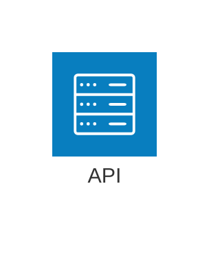
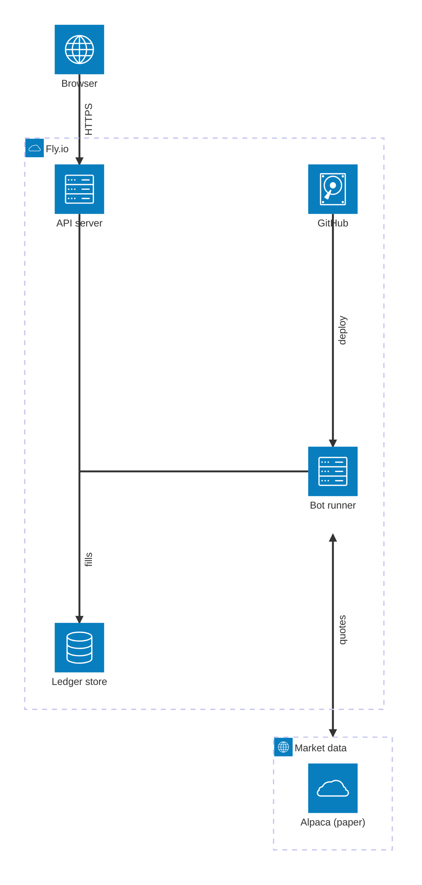

# architecture — `architecture-beta`

**Status:** beta. The docs page is headed "Architecture Diagrams Documentation (v11.1.0+)" and the only accepted keyword is `architecture-beta`. Later additions: `randomize` in v11.14.0, fcose layout knobs in v11.15.0, `seed` and `align row|column` in v11.16.0 (the changelog puts `seed` in 11.16.0 even though the docs list it under 11.15), and punctuation or non-ASCII in unquoted labels in @mermaid-js/parser 1.2.1 (ships with 11.16.1 and later). GitHub runs 11.17.2 (docs/PICTURES.md), so all of these are available there. The Mermaid Chart MCP validator runs v11.13.0 (I checked with an `info` probe) and has none of them.
**GitHub (11.17.2):** The docs page does not mention GitHub. Repo-verified facts (docs/PICTURES.md, scripts/mermaid-lint.mjs, read 2026-09-25): github.com renders Mermaid 11.17.2, and the repo pins mermaid 11.17.2 with @mermaid-js/parser 1.2.1. So architecture-beta works there, along with align (11.16), the layout knobs (11.15), randomize (11.14), seed, edge labels, the {group} modifier, junctions, and punctuation in unquoted labels. GitHub never calls registerIconPacks, so only the five built-in icons draw and every pack icon renders '?' (the repo lint gates the common prefixes). The GitHub mobile app does not render Mermaid; a phone browser does. click callbacks are dead, and fixed themeVariables are lint-refused. The Mermaid Chart MCP validator runs 11.13.0, which is stricter on labels and lacks align, so its verdict can differ from GitHub. Check the final layout on github.com, because fcose placement depends on the version.

## When to reach for it
- Deploy-topology PRs: the fly.toml (skynet-capital web/API) vs fly.bots.toml (skynet-capital-bots, stateful) split, the 6PN controls/insight bridge, the pipeline.yml deploy-bots job. Any change that moves a process across a machine or app boundary.
- Integration-boundary changes: Alpaca market-data and trade-updates streams, the GitHub issue/Actions/Moneypenny loop, any new external provider. The picture answers 'what talks to what, across which boundary, in which direction'.
- Container-level architecture docs (docs/architecture, the ADR-0008 revival) when C4Container renders too cramped. A small set of icons plus groups reads faster than C4's boxes for runtime topology.
- Issue capsules for infra work. A zero-context build session sees which box and which edge the issue touches. Mark the new piece with an iconless dashed service or a **bold** label.
- Before/after fridge-rule pairs for topology changes (two small diagrams, new or removed elements marked by shape or bold, never hue).
- Incident retros where the failure was a boundary (e.g. the 2026-08-26 shared-app restarts), showing which box restarted which.

**Not for:**
- Ordered interactions (order placement, fill callbacks, webhook to build session): the diagram has no notion of sequence. Use sequenceDiagram.
- Code-level module layering inside src/ (engine, risk, adapters…): this is runtime topology, not a dependency graph. Use flowchart, C4Component or Graphify.
- Anything whose point is edge type (sync vs async, live vs planned, blocking vs advisory). There is only one edge style. Use flowchart (-.-> / ==>).
- Bot persona state, decision logic, EARS criteria, call sheets, interrogation verdicts, budgets, backlog snapshots: wrong shape (state, flowchart, table, xychart, kanban).
- More than about 8 nodes, or more than 2 columns, in a PR body read on a 390px phone. Labels shrink to about 7–9px.
- Branded or vendor icons (AWS, GitHub logos). GitHub renders them as '?', so they are decorative at best and broken at worst.
- Two-box relationships where the icons add nothing. A one-line flowchart or a sentence is cheaper.
- Any encoding that relies on hue. The only color controls are diagram-wide theme variables, and the repo lint forbids those anyway.

## Header forms
- architecture-beta
- ---
title: Runtime map
---
architecture-beta   (the title is parsed but the architecture renderer never draws it)
- ---
config:
  architecture:
    randomize: false
    seed: 1
    idealEdgeLengthMultiplier: 1.5
    nodeSeparation: 75
    iconSize: 80
---
architecture-beta
- %%{init: {"architecture": {"iconSize": 60}}}%%
architecture-beta   (a directive; deprecated upstream, and the repo lint prints a note for it)
- architecture-beta
    title Some title   (parsed through TitleAndAccessibilities, not drawn)
- architecture-beta
    accTitle: Short accessible title
    accDescr: One-line description   (also accDescr { multi-line })

## Primitives
| Form | Syntax | Note |
|---|---|---|
| service | `service {id}({icon})[{label}] (in {groupId})?` | Example: `service db(database)[Database] in api`. The icon and the label are both optional in the grammar. Service, group and junction ids share one namespace. ID regex is [\w]([-\w]*\w)?: no dots, no spaces, no trailing dash. |
| service without icon | `service {id}[{label}]` | Renders as an empty rounded box with an 8px dashed outline (class node-bkg, colored like the group border) and the label underneath. Verified by render. |
| service with text badge (undocumented) | `service {id} "TEXT"[{label}]` | The grammar allows a quoted STRING in place of the icon. It renders as the built-in 'blank' filled square with white HTML text inside a foreignObject, line-clamped. Verified: `service c "TXT"["Icon text"]`. Useful for number badges. |
| built-in icons | `(cloud) \| (database) \| (disk) \| (internet) \| (server)` | These five are the only icons documented and the only ones GitHub can draw. There is also an internal `blank`. Colors are hard-coded (#087ebf fill, white glyph). |
| iconify / custom icon | `({packName}:{icon-name})  e.g. (logos:aws-s3)` | Icon token regex is \([\w-:]+\). The pack must first be registered from JS with mermaid.registerIconPacks([{name, loader}]) or ({name: icons.prefix, icons}). An unknown or unregistered icon silently renders a '?' placeholder. |
| junction | `junction {id} (in {groupId})?` | An invisible node that acts as a possible 4-way split or merge point for edges. It has no label or icon, can be an edge endpoint and an align member. |
| group (as container) | `group {id}({icon})[{label}] (in {parentGroupId})?` | Drawn as a dashed rectangle with a small icon (padding*0.75) and the label at its top-left. Groups cannot be edge endpoints; see the {group} modifier. |
| label quoting | `[plain words] \| ["any text, (parens). ok"] \| ['single quoted']` | Labels are ARCH_TITLE tokens and cannot contain [ or ]. In 11.13 and earlier, unquoted labels allow only word characters and spaces. From 11.16.1 (parser 1.2.1) any character except brackets is allowed. Quoting is the portable choice. Markdown **bold** / *italic* works inside labels (verified font-weight=bold). |

## Relations
| Form | Syntax | Note |
|---|---|---|
| undirected edge | `{a}:{L\|R\|T\|B} -- {L\|R\|T\|B}:{b}` | Both port letters are required: `a -- b` is a parse error (verified). The side letter sits next to its own id: `db:R -- L:server` leaves db from the right and enters server from the left. |
| right-hand arrow | `{a}:R --> L:{b}` | `>` placed before the right port draws an arrowhead into b. |
| left-hand arrow | `{a}:R <-- L:{b}` | `<` placed after the left port draws an arrowhead into a. |
| bidirectional | `{a}:R <--> L:{b}` | Arrowheads at both ends. |
| 90-degree (bent) edge | `{a}:T -- L:{b}` | A mixed-axis port pair produces one elbow. The pair also constrains layout: b ends up up and to the side of a. |
| labeled edge (in grammar, not on docs page) | `{a}:R -[label]- L:{b}   \|   {a}:R -[label]-> L:{b}   \|   {a}:R <-[label]-> L:{b}` | Grammar rule: ('--' | '-' ARCH_TITLE '-'). Labels on vertical edges are rotated -90 degrees and labels on bent edges are rotated about 45 degrees (checked in the SVG). |
| edge out of / into a group | `{svc}{group}:B --> T:{svc2}{group}` | The edge attaches to the boundary of the service's group next to that service. Only valid for services inside a group. It throws if both ends are in the same group ('does not pass through two groups'). |
| edge to junction | `{a}:R -- L:{junctionId}` | Junctions take ports like services and are the documented way to fan in or fan out. |
| align row / column (v11.16.0+) | `align row {idA} {idB} {idC} align column {idA} {idB}` | A layout constraint, not an edge. Members must be services or junctions, at least 2, no repeats, one directive per line. Member order sets order along the axis and must not contradict edge directions, otherwise render fails with 'Architecture layout failed…'. Combine row and column directives for grids. |

## Grouping
- group {id}({icon})[{label}] declares a container
- Nesting: group {child}({icon})[{label}] in {parentGroup}. The parent must already be declared. Nesting a group in itself, or 'in' a service, throws.
- Membership: service or junction ... in {groupId}
- The {group} edge modifier routes an edge through group boundaries, e.g. api{group}:R --> L:alpaca{group}
- align row / align column (v11.16+) pin tiers and columns, and can chain across groups to build a grid
- There are no swimlanes, columns keyword, subgraph direction, or group-to-group edges by group id

## Annotations
- Node labels: [text] after the icon; wrap width is iconSize*1.5 (120px by default)
- Group labels: [text], drawn at the top-left of the group next to its icon
- Edge labels: -[text]- in the middle of the edge; rotated on vertical and bent edges
- Text badge inside a node: service id "TXT"[label], e.g. a step number
- accTitle: … / accDescr: … / accDescr { … } set SVG accessibility metadata
- title … and frontmatter title: are accepted but not rendered in architecture diagrams, so put the visible title in markdown above the fence
- %% comment lines are hidden terminals and allowed anywhere
- Markdown **bold** / *italic* inside labels renders as bold or italic tspans

## Emphasis without hue (the colourblind rule)
- Three node forms that differ by shape, not hue: a filled built-in icon square, an iconless service (empty dashed rounded box, good for 'planned / not built'), and a text-badge service (service x "1"[label], a filled square with a number or word)
- Glyph coding: the five built-in glyphs (server, database, disk, internet, cloud) differ in shape, so use them consistently by role
- Bold or italic words in labels: ["**NEW** risk gate"] renders font-weight=bold (verified)
- Numbering in labels or badges to show order of flow (1 Browser, 2 API…)
- Arrowhead presence and direction: none (--), one-way (-->), two-way (<-->) are the only edge variants
- Edge labels (-[fills]->) name the relationship in words; there is NO dashed, dotted or thick edge variant
- Containment: dashed group rectangles and nesting show a boundary (but the default border is a faint pale lavender, so do not let it carry the point alone)
- Junctions make a fan-in or fan-out point explicit
- Position: align row/column tiers (v11.16+) can put 'new' or 'outside' things on their own row

## Styling hooks
- No classDef, style, ::: or linkStyle. The architecture grammar has no per-element styling at all.
- themeVariables specific to this type: archEdgeColor (default lineColor), archEdgeArrowColor (lineColor), archEdgeWidth ('3'), archGroupBorderColor (primaryBorderColor), archGroupBorderWidth ('2px'). These apply to the whole diagram, never to one edge.
- CSS classes available only when embedding with custom CSS: .edge, .arrow, .node-bkg (group or iconless service, stroke-dasharray 8), .node-icon-text, .architecture-service, .architecture-junction, .architecture-service-label, .architecture-edges/.architecture-services/.architecture-groups. Element ids: service-{id}, group-{id}, L_{a}_{b}_{n} (IDs added in 11.12.0).
- On this repo, fixed theme or themeVariables are a lint PROBLEM because they freeze one of GitHub's light/dark modes (scripts/mermaid-lint.mjs). That leaves no usable styling hook on GitHub.

## Config keys
- architecture.padding: number, default 40. Group padding; the group icon is padding*0.75.
- architecture.iconSize: number, default 80. Node size; label wrap width is iconSize*1.5; edge ideal length is iconSize*idealEdgeLengthMultiplier.
- architecture.fontSize: number, default 16
- architecture.useMaxWidth: boolean (from the base config)
- architecture.randomize: boolean, default false (v11.14.0+). Random initial positions; on its own it does not guarantee identical renders.
- architecture.nodeSeparation: number, default 75 (v11.15.0+). Minimum px between siblings in the same group.
- architecture.idealEdgeLengthMultiplier: number, default 1.5 (v11.15.0+). Same-group edges only; also sets the gap between aligned members.
- architecture.edgeElasticity: number 0–1, default 0.45 (v11.15.0+). Same-group edges only.
- architecture.numIter: number, default 2500 (v11.15.0+). Maximum fcose iterations.
- architecture.seed: number, default 1 (docs section v11.15; changelog 11.16.0). Deterministic fcose seed; 0 means use Math.random.
- Set via frontmatter config.architecture.* or mermaid.initialize({architecture:{…}}). Icon packs are JS-only: mermaid.registerIconPacks([...]).

## Gotchas — what silently breaks
- Declaration order matters. Every id used in an edge, an `in`, or an align must already be declared. A child's parent group must come before the child, or you get 'parent does not exist'.
- Group ids cannot be edge endpoints. In 11.17.2, `a:R -- L:someGroup` crashes with the cryptic 'Cannot read properties of undefined (reading 'in')' (verified). Use svc{group} instead.
- {group} on both ends of an edge whose services share a group throws 'does not pass through two groups'. The docs also say {group} is only for services inside a group.
- Every edge needs both port letters. `a -- b` is a parse error (verified).
- Same-side port pairs (R -- R, T -- T) are NOT rejected. They render a misleading straight line (verified).
- No semicolons. `;` is a lexer error (verified); write one statement per line.
- Label characters. Brackets are never allowed inside a label. In 11.13 and earlier (including the Mermaid Chart MCP), unquoted labels allow only [A-Za-z0-9_ ], so `[Fly.io]` or `[**x**]` fail with a lexer error (verified), while `["Fly.io"]` works. 11.16.1+ (GitHub's 11.17.2) accepts punctuation unquoted, but quote anyway for portability.
- IDs follow [\w]([-\w]*\w)?. Dots, spaces, and a trailing dash are invalid. Duplicate ids across service, group and junction throw 'already in use'.
- Icons. An unknown or unregistered icon name renders '?' silently. GitHub never registers iconify packs, so logos:/mdi:/fa: all render '?'. Only cloud, database, disk, internet and server are safe. The repo lint refuses the known pack prefixes.
- title / frontmatter title are parsed but never drawn by the architecture renderer (draw() has no title code; the rendered SVG has no title element).
- Parsing is not rendering. mermaid.parse (the repo's lint) passes align orders that contradict edge directions; those only fail at render time with 'Architecture layout failed'. Two siblings with the same logical position can overlap (#6120), and the layout knobs cannot fix that; use align.
- Width on a phone. A 7-node render measured 928px wide with three columns and 674px wide with two. Scaled to 390px, that is 0.42–0.58x, so 16px labels drop to roughly 7–9px. Keep to 2 columns or fewer, prefer vertical T/B chains, and keep labels short.
- Edge labels on vertical edges read sideways (rotate -90) and on bent edges diagonally. On a phone, put important edge labels on horizontal edges.
- One edge style only (solid 3px, lineColor). You cannot distinguish sync vs async or live vs planned by stroke.
- Layout is force-directed (fcose) from port hints, not hand placement. Small source edits can reshuffle the picture. seed defaults to 1 for determinism from 11.16.
- The iconText badge form and -[label]- edges are in the grammar but not on the docs page. Both are verified working, but they are less documented surface.
- Version skew. The MCP validator is 11.13.0, which lacks align, randomize and the layout knobs and uses the stricter label regex. GitHub is 11.17.2. Treat the repo's pinned lint (npm run mermaid:lint) as the GitHub truth.

## Starters (validated mcp__Mermaid_Chart__validate_and_render_mermaid_diagram, which runs Mermaid v11.13.0 (confirmed with an `info` probe). Both examples came back valid=true and rendered. Cross-checked with the repo's pinned GitHub parser (`node scripts/mermaid-lint.mjs --stdin`, mermaid 11.17.2 / @mermaid-js/parser 1.2.1): both ok, with no problems or notes. Rich render geometry: two columns, 674x1412px, 5 arrowheads, 4 edge labels all rotated -90 degrees (every labeled edge is vertical), groups do not overlap. Extra probes: `align column a c`, same-side ports R--R and `logos:` icons parse on 11.17.2; `;` separators, portless edges and group-id endpoints fail; unquoted `[**Bold** label]` fails on 11.13.0; quoted `["**NEW** gate"]` renders bold; the iconText badge renders; title and frontmatter title are not drawn.; minimal ✓, rich ✓ — The rich example was designed without `align` because the MCP renderer (11.13.0) predates the 11.16.0 directive. `align` was verified parse-only against 11.17.2, and layout conflicts only show at render time. An earlier draft using unquoted `[**Bold** label]` failed on the MCP validator with a lexer error; the fix is to quote the label.)

Minimal:

Rich (grounded in this repo):

## Sources
- https://raw.githubusercontent.com/mermaid-js/mermaid/develop/packages/mermaid/src/docs/syntax/architecture.md
- https://mermaid.js.org/syntax/architecture.html
- https://raw.githubusercontent.com/mermaid-js/mermaid/develop/packages/mermaid/src/docs/config/icons.md
- https://raw.githubusercontent.com/mermaid-js/mermaid/develop/packages/mermaid/src/schemas/config.schema.yaml
- https://raw.githubusercontent.com/mermaid-js/mermaid/develop/packages/parser/src/language/architecture/architecture.langium
- https://raw.githubusercontent.com/mermaid-js/mermaid/develop/packages/parser/src/language/architecture/arch.langium
- https://raw.githubusercontent.com/mermaid-js/mermaid/develop/packages/parser/src/language/common/common.langium
- https://raw.githubusercontent.com/mermaid-js/mermaid/develop/packages/mermaid/src/diagrams/architecture/architectureStyles.ts
- https://raw.githubusercontent.com/mermaid-js/mermaid/develop/packages/mermaid/src/diagrams/architecture/architectureTypes.ts
- https://raw.githubusercontent.com/mermaid-js/mermaid/develop/packages/mermaid/src/diagrams/architecture/svgDraw.ts
- https://raw.githubusercontent.com/mermaid-js/mermaid/develop/packages/mermaid/src/diagrams/architecture/architectureDb.ts
- https://raw.githubusercontent.com/mermaid-js/mermaid/develop/packages/mermaid/src/rendering-util/icons.ts
- https://raw.githubusercontent.com/mermaid-js/mermaid/develop/packages/mermaid/src/themes/theme-base.js
- https://raw.githubusercontent.com/mermaid-js/mermaid/develop/packages/mermaid/CHANGELOG.md
- https://raw.githubusercontent.com/mermaid-js/mermaid/develop/packages/parser/CHANGELOG.md
- /home/user/skynet-capital/docs/PICTURES.md
- /home/user/skynet-capital/scripts/mermaid-lint.mjs
- /home/user/skynet-capital/node_modules/mermaid/dist/chunks/mermaid.core/architectureDiagram-5GKGNRK7.mjs (pinned 11.17.2 renderer)
