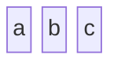
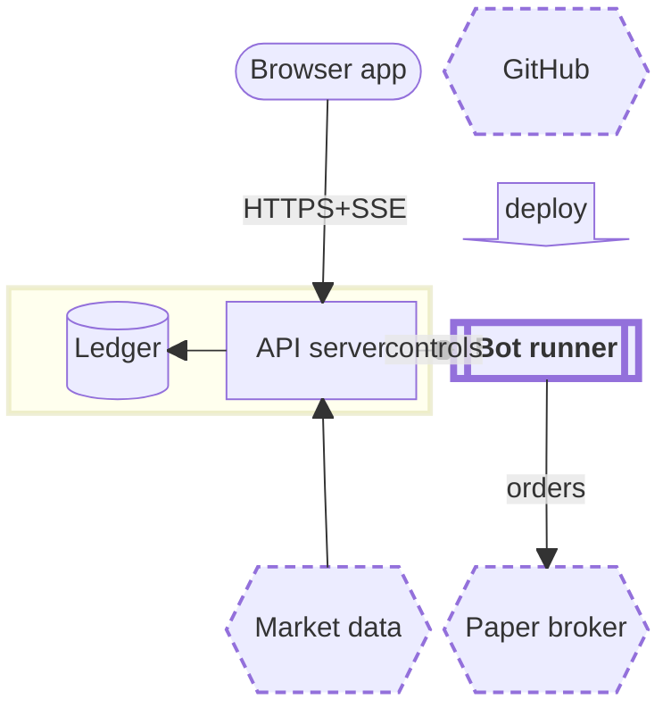

# block — Block diagram (block-beta / block): columns, block widths (id:N, block:name:N), nested composite blocks, space, 15 shapes, block arrows, edges, style/classDef — `block-beta` · `block`

**Status:** Stable since Mermaid v11.10.0. The CHANGELOG (#6653) drops the "-beta" suffix "to reflect their stable status", and the current docs page shows only `block`. It started as `block-beta`, and the detector `/^\s*block(-beta)?/` and the lexer still accept both. On develop, package version 12.0.0 adds per-composite palettes (redux-color themes) and `look: neo`. v11.15.0 adds all arrow types (#7633): dotted and thick edges, plus correct x/o/< ends.
**GitHub (11.17.2):** The docs say nothing about GitHub or renderer support. Verify on github.com: GitHub's Mermaid version is unknown. Safest assumptions: use `block-beta`, not `block`, because GitHub may predate 11.10. Use only `-->`, `---`, `--x`, `--o` and quoted labels. Don't rely on dotted or thick edges (they need >= 11.15), `<-->`, composite labels, frontmatter titles, accTitle/accDescr, or markdown labels. The grammar has no click, href or tooltip, so GitHub's lack of callbacks costs nothing here. useMaxWidth defaults to true, so on a narrow viewport GitHub scales the SVG down rather than scrolling it; design for <= 390px natively.

## When to reach for it
- Deploy/runtime topology where position must stay put: the two Fly apps (dashboard `fly.toml` vs stateful bots `fly.bots.toml`), the 6PN controls bridge (SKYNET_INSIGHTS_BRIDGE_URL, fail-open, which maps naturally to `--o`), Alpaca paper broker and market data, and GitHub's deploy pipeline. Author-fixed grid cells mean the picture doesn't reshuffle between PRs the way flowchart auto-layout does.
- Before/after boundary pictures at the top of a PR body (the fridge rule) for changes that move a component across a deploy or process boundary. Keep the identical grid and mark the changed block with `class x hot` (4px) or a dashed 'proposed' class. The difference reads without hue.
- Layered 'where does this live' maps for issue capsules aimed at a zero-context build session: src/ layers as rows (ui, server/http, engine/bots/playbooks, domain, ports, adapters/alpaca/storage), with spans showing which layers a slice touches.
- A fixed-layout container view for the ADR-0008 / docs/architecture C4 revival, used where C4's auto layout misbehaves. Keep it to <= 3 columns so it passes at 390px.
- Phone-layout wireframes of a dashboard surface (header / chart / order ticket / alerts as spanned rows in `columns 2`). It is the closest Mermaid gets to a 390px layout grid for teardown or plan issues.
- Layered decision-gate stacks (a request passing auth gate, then desk gate, then risk/SafetyController, then broker), using block arrows between rows.

**Not for:**
- Anything edge-dense: edges are straight center-to-center lines with no routing, so more than about 6 edges or any cross-row diagonals produce lines through blocks. Use flowchart or architecture-beta.
- Edge semantics carried by line style (dotted = async, thick = money path). On GitHub's unknown version these fail or render solid, which misleads a reader who is relying on them.
- Named groups: composite labels are invisible, so a container whose NAME is the point (a C4 system boundary) is better as a flowchart subgraph or C4 Boundary.
- Time or ordering: request/response sequences (use sequence), bot lifecycles and order states (use stateDiagram), budget ratchets over weeks (use xychart), backlog snapshots (use kanban), token-budget shares (use treemap/pie), message byte layouts (use packet).
- Wide inventories: more than 3 columns or long labels overflow 390px because every column takes the widest block's width.
- Decorative 'row of boxes' pictures with no positional meaning and no relations. Prose or a table is cheaper.
- Anything needing accessibility metadata inside the diagram (no accTitle/accDescr) or click-through links.

## Header forms
- block-beta   (the original keyword. Every version that has block diagrams accepts it, so it is the SAFEST choice for GitHub's unknown Mermaid version)
- block   (Mermaid >= 11.10.0 only; the validator accepted it)
- ---
title: "Runtime map"
---
block-beta   (YAML frontmatter parses and validates, but the title is NOT drawn: no title text appears in the SVG, and blockRenderer.ts has no title code)
- ---
config:
  block:
    padding: 8
    useMaxWidth: true
  theme: base
  themeVariables:
    lineColor: "#333"
---
block-beta   (block config keys live under `block:`. Frontmatter config is generic Mermaid; I did not probe it separately)
- %%{init: {"block": {"padding": 12}}}%%  then  block-beta   (generic Mermaid init directive; not probed)

## Primitives
| Form | Syntax | Note |
|---|---|---|
| bare block | `a b c` | The id doubles as the label. Blocks on one line fill columns left to right and wrap at `columns N`. A second declaration of the same id merges into the existing block (no duplicate). |
| rectangle (square) | `id["label"]` | Labels inside shape brackets must be double-quoted: the lexer's NODE state only accepts quoted strings. |
| round-edged | `id("label")` |  |
| stadium | `id(["label"])` |  |
| subroutine (double vertical sides) | `id[["label"]]` |  |
| cylinder (database/storage) | `id[("label")]` |  |
| circle | `id(("label"))` |  |
| double circle | `id((("label")))` | The docs pitch it for 'critical or high-priority components'. |
| asymmetric (flag) | `id>"label"]` |  |
| rhombus (decision) | `id{"label"}` |  |
| hexagon | `id{{"label"}}` |  |
| parallelogram (lean right) | `id[/"label"/]` |  |
| parallelogram (lean left) | `id[\"label"\]` |  |
| trapezoid | `id[/"label"\]` |  |
| inverted trapezoid | `id[\"label"/]` |  |
| block arrow (fat directional glyph that sits in a grid cell) | `id<["label"]>(right) \| (left) \| (up) \| (down) \| (x) \| (y) \| (x, down)` | x = horizontal double-headed, y = vertical double-headed, and directions combine with commas. The label can be blank (" ") or padded with &nbsp;. It takes a width (`<["l"]>(down):2`), and spanning was fixed in 11.15. |
| space (empty cell) | `space \| space:N` | Takes N columns (default 1). This is how you position blocks and give edges a clear path. |
| width / column span | `id:N \| id["label"]:N` | Spans N columns. If N is wider than the container's `columns`, you get a console warning and the row overflows. |
| composite (nested) block | `block:id:N   columns 2   a b end` | `block:id` has width 1; the anonymous form is `block ... end`. A composite can be an edge endpoint (`ID --> D`). It accepts a label (`block:id["Label"]:2`), but the label renders centered UNDER the children, so in practice it is hidden (validated). |
| column setting | `columns 3 \| columns auto` | Applies per container, root or composite. auto (the default) puts every child in one row. |

## Relations
| Form | Syntax | Note |
|---|---|---|
| arrow | `A --> B` | Drawn as a STRAIGHT line from block center to block center (3-point path, no routing). It goes straight through any block in between. |
| open line (no arrowhead) | `A --- B` | Renders correctly since 11.10 (#6833). Validated: no marker. |
| labeled arrow | `A -- "label" --> B` | The label must be a double-quoted string. It sits at the edge midpoint on a translucent background. |
| labeled open line | `A -- "label" --- B` |  |
| cross end | `A --x B \| A -- "label" --x B` | Validated: crossEnd marker. Reads as 'blocked / rejected' without hue. |
| circle end | `A --o B \| A -- "label" --o B` | Validated: circleEnd marker. Reads as 'soft / optional / fail-open' without hue. |
| bidirectional | `A <--> B` | The grammar accepts it, but the validator draws NO arrowhead at either end, so avoid it on GitHub. Develop (>=11.15) maps the leading < to a start arrow. |
| double-ended cross/circle | `A x--x B \| A o--o B` | The lexer accepts them (`[xo<]?--+[-xo>]`). Not probed; start markers are only reliable in >=11.15. |
| dotted | `A -.-> B \| A -. "label" .-> B` | Develop (>=11.15) adds the edge-pattern-dotted class. In the validator it PARSES but renders SOLID with NO arrowhead, so the meaning is lost silently. |
| thick | `A ==> B \| A == "label" ==> B` | Develop (>=11.15) adds edge-thickness-thick. In the validator, `A ==> B` is a lexical error and `A == "x" ==> B` is a parse error. |
| tilde link | `A ~~~ B` | The lexer returns LINK. In block diagrams it is NOT an invisible link (per blockDB.ts it gets an open start, no end, solid pattern). Not probed. |
| chained edges | `A --> B --> C` | The grammar recurses (nodeStatement link node). |
| edge to or from a composite | `ID --> D   (ID declared as block:ID ... end)` | From the docs' intro example. |

## Grouping
- `columns N` sets the grid width of the current container, root or composite. The first column setting in a container wins.
- `columns auto` is the default: all children go in one row. The docs note this with `%% columns auto (default)`.
- Named composite `block:id ... end`, width 1.
- Named composite with a span: `block:id:N ... end`. It can declare its own `columns M` inside.
- Anonymous composite: `block ... end`.
- Vertical stack: `block\n  columns 1\n  a b c d\nend` (the docs' 'stacked' example). The container is as wide as its widest child.
- Nesting goes to any depth. A nested composite's columns are independent of its parent's.
- `space` and `space:N` hold cells open. They are the only way to shape layout and to keep edges from crossing blocks.
- Span with `id:N`. Every column in a container is as wide as the widest block in it (the docs' 'Column Width Dynamics'), so one long label widens the whole grid.
- Composite blocks are containers only; their label is hidden (see gotchas). Name a group in surrounding prose, or add a spanning header block as the group's first row, which edges then have to avoid.

## Annotations
- `%% comment` works ONLY on its own line (the docs recommend %% for documentation). A trailing comment after blocks turns into phantom blocks (validated).
- Edge label: `A -- "text" --> B`. It must be quoted.
- Node label: `id["text"]`. Also `&nbsp;` entities (docs) and HTML like `<b>text</b>`, which renders bold (validated). Labels are DOMPurify-sanitized.
- Block-arrow label: `id<["text"]>(dir)`. A blank `" "` is allowed.
- YAML frontmatter `title:` is accepted but NOT rendered for block diagrams (validated).
- NOT supported: accTitle / accDescr (parse error: the lexer has the tokens but the grammar has no rule, validated), notes, markdown strings "`...`" (parse error, validated), click, href, tooltips.

## Emphasis without hue (the colourblind rule)
- SHAPE carries the role (15 shapes to choose from). For example: cylinder `[("")]` = store/ledger, hexagon `{{""}}` = external system, subroutine `[[""]]` = long-running stateful service, stadium `([""])` = UI/client, rhombus = decision, double circle `((("")))` = critical.
- BORDER WEIGHT via `classDef hot stroke-width:4px` + `class id hot` (validated: CSS with !important). Use it to mark the thing the PR changed or the one hot spot.
- DASHED BORDER via `classDef ext stroke-width:2px,stroke-dasharray:6 4` (validated). Use it for 'outside our boundary', 'proposed', or 'not built yet'.
- Composite outline weight: `style groupId stroke-width:3px` (validated) to draw a boundary box around a deploy unit.
- ARROWHEAD SHAPE: `-->` arrow, `---` none, `--x` cross, `--o` circle (all validated). Give each a meaning such as flow / association / blocked / fail-open, and state it in a legend or caption.
- BLOCK ARROWS `id<["deploy"]>(down)`: large filled chevrons that read at 390px without color.
- BOLD label via HTML `<b>...</b>` (validated). Markdown `**` is NOT available (parse error).
- Numbering or prefixes inside labels ("1 Browser", "NEW API", "x Legacy") plus quoted edge labels.
- POSITION is fully author-controlled. Fixed rows and columns can carry meaning (left = inside our deploy, right = outside; top = client, bottom = providers), and the grid stays identical between before/after pictures.
- WIDTH `id:N` = umbrella or importance. `space:N` gaps separate zones.
- Do NOT rely on dotted (`-.->`) or thick (`==>`) edges on GitHub: they either fail or silently render solid in pre-11.15 renderers.

## Styling hooks
- `style id fill:#636,stroke:#333,stroke-width:4px,color:#fff,stroke-dasharray: 5 5`: properties are comma-separated and a trailing `;` is fine. A comma list works too: `style a,b ...`.
- `classDef name fill:#6e6ce6,stroke:#333,stroke-width:4px;` then `class id1,id2 name`. It is emitted as CSS `.name>*{...!important}` (validated), so stroke-width and stroke-dasharray really apply to shapes. A `color:` inside a classDef sets the text color (#7850).
- A composite takes `style dashId stroke-width:3px` as an inline style (validated) and keeps priority over theme palettes.
- No `:::` shorthand (lexical error, validated). No `linkStyle` (parse error, validated). No per-edge styling at all. Edges are uniformly 1px `.flowchart-link` in `lineColor`.
- themeVariables read by the block stylesheet: mainBkg, nodeBorder, nodeTextColor, textColor, clusterBkg, clusterBorder, titleColor, lineColor, arrowheadColor, edgeLabelBackground, tertiaryColor, border2, fontFamily, strokeWidth (node border width comes from the theme since #8211).
- Develop / 12.0 only: `theme: redux-color` or `redux-dark-color` gives each composite its own color (borderColorArray / bkgColorArray / THEME_COLOR_LIMIT) in declaration order. It is hue-only, so never let it carry meaning.
- Develop / 12.0 only: `look: neo` gradient borders, fixed in #8211.
- DOM hooks in the rendered SVG: `g.node#<id>`, `rect.composite`, `path.flowchart-link.edge-thickness-*.edge-pattern-*`, `.edgeLabel`, root `g.block`.

## Config keys
- block.padding: number >= 0, default 8. Padding inside each block (read at render time since #7734).
- block.useMaxWidth: boolean, default true (BaseDiagramConfig). When true the SVG gets width=100% plus max-width, so it scales down to fit a narrow container.
- block.useWidth: number (BaseDiagramConfig).
- block.theme / top-level theme: diagram-scoped theme default (BaseDiagramConfig; frontmatter/directive > initialize() > diagram default > top-level). Only redux-color / redux-dark-color turn on the composite palette (develop).
- look: neo (develop) is honored by block through insertLookDefs.

## Gotchas — what silently breaks
- IDs are `[^()\[\]{}\s<>:=-]+`: NO hyphens, colons, equals, angle brackets, brackets or spaces. `bot-runner` gives 'Lexical error... Unrecognized text' (validated). style/class targets must also be `\w+`, so use camelCase or snake_case. Ids that merely START with a keyword are fine (`spaceship`, `blocky`, `defaultRisk`, `endpoint`, `backend`, `styleguide`, `classic` all validated). Bare `end`, `space`, `block` and `columns N` are reserved.
- The flowchart pipe-label form is a SILENT failure. `A -->|x| B` validates, but it creates a phantom block with id `|x|`, draws the edge to it, and leaves B orphaned (validated). Always write `A -- "x" --> B`.
- Trailing comments are a SILENT failure. `a b %% trailing note` renders extra blocks `%%`, `trailing`, `note` (validated). Put %% comments on their own line.
- accTitle: / accDescr: cause a PARSE ERROR in block diagrams (validated), even though other diagram types accept them. Put accessible text in the surrounding markdown.
- Markdown strings "`**x**`" in node labels cause a PARSE ERROR ('Expecting STR, got MD_STR', validated). Use `<b>x</b>`, which is validated to render bold.
- `A:::cls` causes a lexical error (validated). `linkStyle 0 ...` causes a parse error (validated). The only styling is `style` and `classDef` + `class`.
- Thick edges: `A ==> B` is a lexical error and `A == "x" ==> B` a parse error in the Mermaid Chart renderer (validated). They only work in >= 11.15.
- Dotted edges: `A -. "x" .-> B` validates but renders SOLID with NO arrowhead in the validator (checked in the SVG: edge-pattern-solid, no marker-end). The meaning disappears silently.
- `A <--> B` renders with NO arrowheads at either end in the validator (validated). Use two one-way edges instead.
- A composite label `block:id["Label"]` is drawn centered BEHIND the children, so it is effectively invisible (validated: the label shares the child's center). An unlabeled composite renders an empty 0-width label.
- Frontmatter `title:` is accepted but never drawn (validated). Put the title in the markdown heading or caption above the fence.
- Edges have no routing: each is a straight line from center to center and crosses any block in between. The docs require `space` between linked blocks (`A space B` / `A --> B`). Line nodes up in the same row or column, with empty cells between them.
- `A - B` (single dash) is not a link (docs troubleshooting).
- `style A fill#969` (missing colon) fails to style (docs 'Misplaced Styling'). Properties are `key:value`, comma-separated.
- Width `id:N` greater than `columns` logs a warning and overflows. Since 11.10 (#6702) that overflow no longer shifts later rows, so the same source can lay out differently on older renderers.
- Every column is as wide as the widest block in its container. At 390px keep columns <= 3 and labels <= ~12 characters: the rich example measured 375.5px max-width, while with 'Ledger store' / 'Alpaca paper' labels it was 418px. useMaxWidth then shrinks text on phones.
- Composites stretch row heights (the rich example's API block became 65px tall), so vertical size grows faster than you expect.
- The `block` keyword needs >= 11.10. Older renderers (plausibly GitHub's) only know `block-beta`.
- The grammar has no click, href, tooltip or icon syntax, so interactivity is moot. Theme palettes are hue-only.
- Labels are DOMPurify-sanitized and HTML labels are on (`<b>` survives). Unicode inside quoted labels should be fine, but it was not probed.

## Starters (validated Mermaid Chart MCP validate_and_render_mermaid_diagram. It does not disclose its Mermaid version. It accepts both `block` and `block-beta`, so it is >= 11.10, but its edge handling behaves like < 11.15. I also inspected the returned SVG: the rich example is 375.5px max-width, has 9 blocks, a circleEnd marker on the controls edge, dashed and 4px class CSS applied, bold rendered from <b>, and no title text.; minimal ✓, rich ✓ — Failed probes, all folded into gotchas: `bot-runner` id (lexical error); `A:::hot` (lexical error); `linkStyle 0 ...` (parse error, got LINKSTYLE); `accTitle:` (parse error, got acc_title); "`**Bot runner**`" markdown label (parse error, got MD_STR); `A == "x" ==> B` (parse error, got STR); `bots ==> broker` (lexical error). Probes that were valid but silently wrong: `A -->|x| B` (phantom `|x|` block, B orphaned); `a b %% trailing note` (phantom blocks); `-. "controls" .->` (solid, no arrowhead); `<-->` (no arrowheads); `block:dash["Dashboard app"]` (label hidden behind the child); frontmatter title (not drawn). Earlier drafts of the rich example failed on accTitle, then the markdown label, then the thick labeled edge, then `==>`. The pasted version is the one that passed.)

Minimal:

Rich (grounded in this repo):

## Sources
- https://raw.githubusercontent.com/mermaid-js/mermaid/develop/packages/mermaid/src/docs/syntax/block.md
- https://mermaid.js.org/syntax/block.html
- https://raw.githubusercontent.com/mermaid-js/mermaid/develop/packages/mermaid/src/diagrams/block/parser/block.jison
- https://raw.githubusercontent.com/mermaid-js/mermaid/develop/packages/mermaid/src/diagrams/block/blockDB.ts
- https://raw.githubusercontent.com/mermaid-js/mermaid/develop/packages/mermaid/src/diagrams/block/blockDetector.ts
- https://raw.githubusercontent.com/mermaid-js/mermaid/develop/packages/mermaid/src/diagrams/block/blockRenderer.ts
- https://raw.githubusercontent.com/mermaid-js/mermaid/develop/packages/mermaid/src/diagrams/block/renderHelpers.ts
- https://raw.githubusercontent.com/mermaid-js/mermaid/develop/packages/mermaid/src/diagrams/block/styles.ts
- https://raw.githubusercontent.com/mermaid-js/mermaid/develop/packages/mermaid/src/diagrams/block/blockTypes.ts
- https://raw.githubusercontent.com/mermaid-js/mermaid/develop/packages/mermaid/src/schemas/config.schema.yaml
- https://raw.githubusercontent.com/mermaid-js/mermaid/develop/packages/mermaid/CHANGELOG.md
- https://raw.githubusercontent.com/mermaid-js/mermaid/mermaid@11.4.1/packages/mermaid/src/diagrams/block/parser/block.jison
- https://raw.githubusercontent.com/mermaid-js/mermaid/mermaid@11.12.0/packages/mermaid/src/diagrams/block/parser/block.jison
- /home/user/skynet-capital/fly.bots.toml
- /home/user/skynet-capital/docs/DEPLOY.md
- /home/user/skynet-capital/docs/BOTS.md
