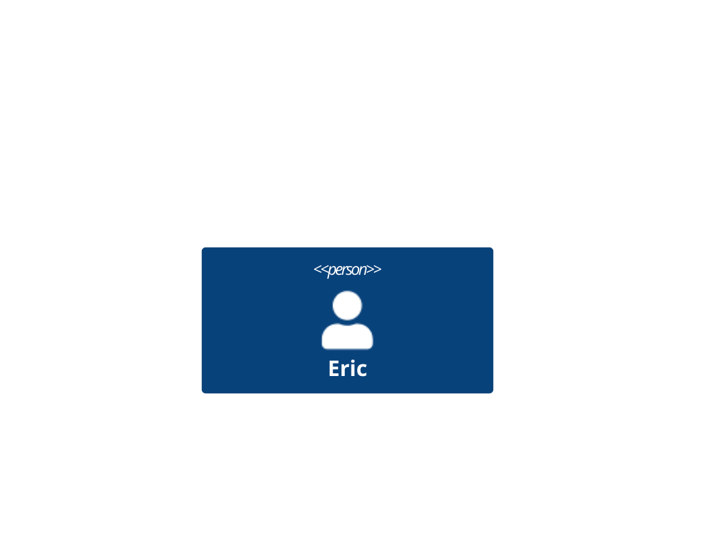
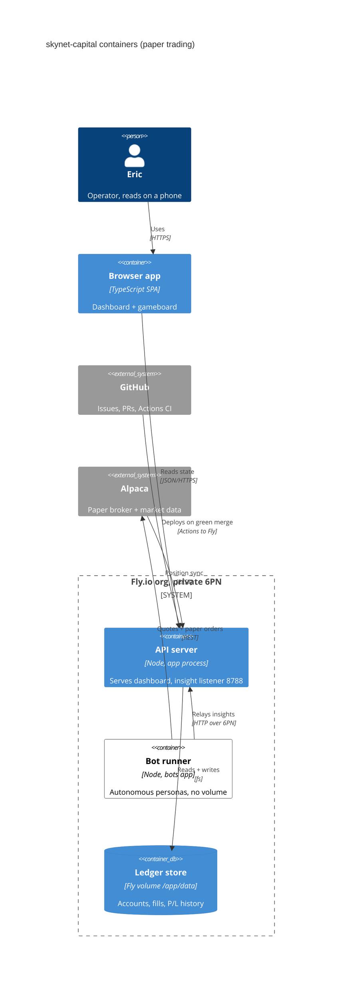

# c4 (https://mermaid.js.org/syntax/c4.html): C4Context / C4Container / C4Component / C4Dynamic / C4Deployment — `C4Context` · `C4Container` · `C4Component` · `C4Dynamic` · `C4Deployment`

**Status:** experimental. The docs banner, verbatim: "C4 Diagram: This is an experimental diagram for now. The syntax and properties can change in future releases. Proper documentation will be provided when the syntax is stable." The docs call the syntax "compatible with plantUML" and send readers to the C4-PlantUML README for how to write it. Mermaid develop/master is at 12.0.0. Develop has started moving C4 drawing onto the shared "unified shapes" (c4ShapeAdapter.ts), so the diagram looks different depending on the Mermaid version.
**GitHub (11.17.2):** The C4 docs page says nothing about GitHub rendering, so verify on github.com. What is known: the C4 grammar has been in Mermaid since v9.x, so GitHub's bundle very likely parses it. Its appearance depends on the version, though: legacy renderer vs v12 unified shapes, and the wrap default flip at v11.17.1 (set `config: wrap: true` in frontmatter to be version-proof). $shape keywords are v12-only. There are no click, link or tooltip features to lose, because $link is unsupported anyway. The page is experimental, which conflicts with docs/PICTURES.md's 'stable types only' prescription. Treat C4 like the beta types there: allowed ad hoc, or in docs/architecture files where a render failure is not a PR's opening frame. Confirm with one test render in a GitHub issue before prescribing it in a template.

## When to reach for it
- ADR-0008's 'System diagrams' spec surface (docs/adr/0008-spec-surfaces-and-architecture-fitness.md, planned SYSTEM-MAP.md): one C4Context (Eric/members -> skynet-capital -> GitHub, Alpaca, Fly) plus one C4Container (browser app, API server, bot runner, ledger volume, insight bridge). This is the token-cheap architecture spec a zero-context build session reads before touching a boundary.
- C4Deployment for PRs touching fly.toml / fly.bots.toml / deploy workflows: two Fly apps (skynet-capital with the /app/data volume; skynet-capital-bots with no volume) and the 6PN-only insight bridge on port 8788. Nested solid Node boxes show the 'which machine owns durable state' fact that caused the 2026-08-26 restart incident.
- C4Dynamic for cross-container request paths where order matters and hue can't be used: bot recommends trade -> API writes ticket -> Alpaca paper order -> fill lands in ledger. The automatic 1:, 2:, 3: numbering carries sequence without colour.
- Plan or feature issues that ADD a container or external dependency (a new market-data provider, a new MCP control plane like ADR-0007, a new store). A C4Container 'where it lives' picture tells the build session which boundary the new box sits in.
- C4Component for decomposer/arch-scan PRs that split a god file inside the API server or bot runner: before/after component boxes inside one Container_Boundary, with the changed components marked by 'NEW:' labels plus white-inverted fill.

**Not for:**
- Lifecycles and gates (issue proposed -> ready -> executing -> done, SIM/LIVE modes, verify -> auto-merge -> deploy): C4 has no states or guards, so use stateDiagram-v2 or flowchart.
- Quantities over time (the fitness budget ratcheting down across weeks, P/L): C4 has no axes, so use xychart or a table.
- Research call sheets, interrogation verdicts (verbatim/amended/reject/status-quo), EARS criteria, platter item lists: these are tabular judgements, so a C4 box would only decorate them.
- Single-module or config-only PRs: a C4 box around one container restates the file path and fails the fridge rule. Waive the picture or use a before/after table.
- Branching or looping request flows (retries, alt paths, error handling): C4Dynamic has no alt/loop/par, so use sequenceDiagram.
- Deltas that need line-style emphasis (a removed or deprecated rel): C4 cannot dash or bolden a rel, so a flowchart with -.-> / ==> reads better for a colourblind reader.
- Anything over about 8 elements for phone review: the grid layout gets too wide (999px at 2 per row) and scales below legible size at 390px. Split into context + container views instead.

## Header forms
- C4Context  (first non-frontmatter line, must end in a newline; also C4Container / C4Component / C4Dynamic / C4Deployment; keywords are case-sensitive)
- title <text>   (a statement placed after the header line. No colon. The text must not contain '#' or ';', or you get a lexical error [verified])
- ---
config:
  c4:
    wrap: false
---
C4Context   (the YAML frontmatter form the docs show, for turning off the default wrapping)
- ---
config:
  wrap: true
---
C4Container   (top-level wrap. This is the only wrap switch before v11.17.1, so it is the portable way to force wrapping on an older or unknown renderer)
- ---
title: X
---
C4Context   (parses, but C4 does NOT render a frontmatter title [verified]. Use the `title` statement instead)
- %%{init: {"wrap": true}}%%   (generic Mermaid directive. Not on the C4 page, so check it works before relying on it)

## Primitives
| Form | Syntax | Note |
|---|---|---|
| Person | `Person(alias, "label", ?"descr", ?sprite, ?tags, $link)` | Stick-figure/person shape. Stereotype text <<person>> (legacy renderer) or [Person] (v12). |
| Person_Ext | `Person_Ext(alias, "label", ?"descr")` | External person: grey fill plus stereotype text <<external_person>> [verified]. |
| System | `System(alias, "label", ?"descr", ?sprite, ?tags, $link)` | Rounded box, stereotype <<system>>. |
| SystemDb | `SystemDb(alias, "label", ?"descr")` | Cylinder shape. |
| SystemQueue | `SystemQueue(alias, "label", ?"descr")` | Horizontal-cylinder (pipe) shape. |
| System_Ext / SystemDb_Ext / SystemQueue_Ext | `System_Ext(alias, "label", ?"descr")` | External variants: grey fill plus <<external_system...>> text. |
| Container | `Container(alias, "label", ?"techn", ?"descr", ?sprite, ?tags, $link)` | The 3rd positional arg is TECHNOLOGY, shown in brackets as [techn] [verified]. The docs list it under the Container diagram, but the grammar accepts every element in every C4 header. |
| ContainerDb / ContainerQueue | `ContainerDb(alias, "label", ?"techn", ?"descr")` | Cylinder / pipe shapes. |
| Container_Ext / ContainerDb_Ext / ContainerQueue_Ext | `Container_Ext(alias, "label", ?"techn", ?"descr")` | External container variants (grey). |
| Component | `Component(alias, "label", ?"techn", ?"descr", ?sprite, ?tags, $link)` | Lightest blue by default. |
| ComponentDb / ComponentQueue | `ComponentDb(alias, "label", ?"techn", ?"descr")` |  |
| Component_Ext / ComponentDb_Ext / ComponentQueue_Ext | `Component_Ext(alias, "label", ?"techn", ?"descr")` |  |
| Deployment_Node (block) | `Deployment_Node(alias, "label", ?"type", ?"descr", ?sprite, ?tags, $link) { ... }` | A container for other elements, drawn as a SOLID-border box (boundaries are dashed). Type prints as [type]. |
| Node / Node_L / Node_R | `Node(alias, "label", ?"type", ?"descr") { ... }` | Node is short for Deployment_Node. Node_L / Node_R are 'left/right aligned' per the docs, but the renderer draws all three the same. |
| Optional-argument forms | `positional: UpdateRelStyle(a, b, "red", "blue", "-40", "60")  \|  named: $offsetY="60"  \|  skip an optional: ""` | Named args must start with $, have double quotes and not be empty. `$offsetY=""` is a parse error [verified]. |

## Relations
| Form | Syntax | Note |
|---|---|---|
| Rel | `Rel(from, to, "label", ?"techn", ?"descr", ?sprite, ?tags, $link)` | Solid 1px line with an arrowhead at `to`. techn is drawn in italics as [techn] [verified]. |
| BiRel | `BiRel(from, to, "label", ?"techn")` | Arrowheads at both ends [verified: marker-start + marker-end]. |
| Rel_Back | `Rel_Back(from, to, "label", ?"techn")` | Only arrowhead is at the FROM end (reads as to -> from) [verified: marker-start only]. |
| Rel_U / Rel_Up | `Rel_U(from, to, "label", ?"techn")` | A layout hint in PlantUML. In Mermaid it parses but draws exactly like Rel (the renderer never checks rel_u). |
| Rel_D / Rel_Down | `Rel_Down(from, to, "label")` | Same as Rel visually [verified parse]. |
| Rel_L / Rel_Left | `Rel_L(from, to, "label")` | Same as Rel visually. |
| Rel_R / Rel_Right | `Rel_R(from, to, "label")` | Same as Rel visually. |
| RelIndex | `RelIndex(index, from, to, "label", ?tags, $link)` | The index argument is IGNORED. In C4Dynamic every rel label gets an automatic 'N: ' prefix in statement order [verified '1: Recommends trade']. No numbering in the other C4 types [verified]. |
| Unsupported (docs) | `Lay_U/Lay_Up, Lay_D/Lay_Down, Lay_L/Lay_Left, Lay_R/Lay_Right; AddRelTag; DashedLine()/DottedLine()/BoldLine()` | No plans to support these. There is no way to make a rel dashed, dotted or thick. |

## Grouping
- Boundary(alias, "label", ?"type", ?tags, $link) { ... }: dashed box (stroke-dasharray 7,7). The type prints as [type] [verified '[lane]'].
- Enterprise_Boundary(alias, "label", ?tags, $link) { ... }: automatically prints [ENTERPRISE] [verified].
- System_Boundary(alias, "label", ?tags, $link) { ... }: automatically prints [SYSTEM] [verified].
- Container_Boundary(alias, "label", ?tags, $link) { ... }: automatically prints [CONTAINER].
- Deployment_Node / Node / Node_L / Node_R (alias, "label", ?"type", ?"descr") { ... }: SOLID-border nesting box for C4Deployment.
- Nesting: boundaries and nodes nest to any depth (the docs examples go 3 deep). `{` goes on the same line (`) {` or `){`) or the next line. `}` closes the block.
- Layout inside groups: row-major in the order you write the statements. UpdateLayoutConfig($c4ShapeInRow="N", $c4BoundaryInRow="M") sets how many per row (defaults 4 and 2). No automatic layout algorithm.

## Annotations
- title <text>: the visible title, drawn centred above the diagram.
- accTitle: <text>: in C4 this is wired to the SAME setter as the visible title. It renders as the on-screen title, and whichever of title/accTitle comes last wins [verified: 'ACC title here' rendered]. It does not produce an SVG <title>.
- accDescr: <text> and accDescr { multi-line }: become the SVG <desc> for screen readers [verified]. The legacy `accDescription <text>` also parses.
- %% comment lines are skipped [verified].
- Line break inside a quoted label or descr:   [verified: two tspans].
- Technology label: the techn argument on Rel and Container/Component renders in brackets, e.g. [REST], [Fly volume /app/data] [verified].
- Stereotype text on every element: the legacy renderer prints <<person>>, <<container_db>>, <<external_system>> [verified]. The v12 develop renderer prints Structurizr style, e.g. [Container: Node.js] / [Software System].
- C4Dynamic auto-numbers rels '1: ', '2: ', ... in statement order [verified].
- Not available: notes, tooltips, click/links ($link parses but is not rendered), Legend, sprites, tags (the docs list these as unsupported).

## Emphasis without hue (the colourblind rule)
- Element KIND is shown by shape, not hue: the Person figure, Db = cylinder, Queue = horizontal pipe, everything else = rounded box.
- Internal vs external is shown twice: grey vs blue (a lightness difference, not red/green) AND the printed stereotype text <<external_system>> / <<external_container>> [verified]. A reader never has to rely on the fill.
- Group type is shown by border pattern: every *Boundary draws a dashed 7,7 border, Deployment_Node/Node draws solid. Boundary labels are bold and add a [SYSTEM]/[ENTERPRISE]/[type] line.
- Direction is shown by arrowhead placement: Rel = one head at the target, BiRel = heads at both ends, Rel_Back = head only at the source.
- Protocol / technology is shown by italic [techn] text on every rel and container.
- Order is shown by C4Dynamic's automatic '1: ', '2: ' prefixes, so a request path reads in order without colour.
- Lightness inversion to single out one element: UpdateElementStyle(x, $bgColor="white", $fontColor="black", $borderColor="black") turns the one changed or new box white-on-black-outline against the blue defaults [verified]. Pair it with a text marker.
- Text markers in labels: put a prefix such as "NEW: API server" or "CHANGED: Bot runner", or add a second line via  . This is the only reliable way to mark one rel as different, because rels cannot be dashed or thickened.
- Boundary titles as captions: wrap the changed slice in Boundary(x, "This PR", "delta") { ... }. Its dashed box plus [delta] label marks scope without colour.
- Avoid: UpdateRelStyle $lineColor/$textColor red vs green (the docs examples use red/blue for demonstration only). No dashed, dotted or bold rel styles exist (DashedLine/DottedLine/BoldLine are unsupported).

## Styling hooks
- UpdateElementStyle(elementName, ?bgColor, ?fontColor, ?borderColor, ?shadowing, ?shape, ?sprite, ?techn, ?legendText, ?legendSprite): only bgColor / fontColor / borderColor visibly apply in the validator's renderer [verified white fill + black stroke]. $shape keywords (person, box|rounded, cylinder|database|db, queue|pipe, component) exist only in the v12 develop shape adapter. The legacy renderer ignored $shape="db" [verified].
- UpdateRelStyle(from, to, ?textColor, ?lineColor, ?offsetX, ?offsetY): recolours one rel and moves its label by integer px offsets (parseInt). Matches on the (from, to) pair.
- UpdateLayoutConfig(?c4ShapeInRow, ?c4BoundaryInRow): defaults 4 and 2. Values below 1 are ignored.
- Placement: the docs say the Update* statements are 'written in the diagram last part' (their examples also put UpdateRelStyle straight after its Rel).
- Config colour keys (c4.*): person_bg_color #08427B, person_border_color #073B6F, external_person_bg_color #686868, system_bg_color #1168BD, external_system_bg_color #999999, container_bg_color #438DD5, external_container_bg_color #B3B3B3, component_bg_color #85BBF0, external_component_bg_color #CCCCCC. Each has a matching *_border_color, plus _db / _queue variants of every type.
- Config font keys (c4.*): {type}FontSize / {type}FontFamily / {type}FontWeight for person, external_person, system, external_system, system_db, external_system_db, system_queue, external_system_queue, container*, component* (same pattern), boundary, message (rel labels, default 12).
- themeVariables: personBorder / personBkg feed the .person CSS rule. There are no other C4-specific theme variables. The docs say 'C4 diagram is fixed style... different css is not provided under different skins.'
- NOT available: classDef, style, linkStyle, :::class, stroke-width, stroke-dasharray, AddElementTag/AddRelTag, RoundedBoxShape()/EightSidedShape().

## Config keys
- c4.wrap (bool, default true since v11.17.1; before that the default was false and only top-level `wrap: true` enabled wrapping, not c4.wrap). Top-level `wrap` also works.
- c4.wrapPadding (default 10)
- c4.c4ShapeInRow (default 4) and c4.c4BoundaryInRow (default 2): in the schema, but the C4 db resets to 4/2 on clear() and the renderer reads the db, so set these with the UpdateLayoutConfig statement (source reading, not render-verified)
- c4.diagramMarginX (50), c4.diagramMarginY (10), c4.c4ShapeMargin (50), c4.c4ShapePadding (20)
- c4.width (216, person/shape box width), c4.height (60), c4.boxMargin (10), c4.nextLinePaddingX (0)
- c4.useMaxWidth (scales the SVG to its container, which matters on a 390px phone)
- c4.{type}FontSize / {type}FontFamily / {type}FontWeight for every element type plus boundary and message
- c4.{type}_bg_color / c4.{type}_border_color for every element type (defaults listed under styling_hooks)

## Gotchas — what silently breaks
- EXPERIMENTAL: the docs say syntax and properties may change, and the look already differs between versions (legacy <<container>> stereotypes and a person PNG icon, vs v12 unified shapes with [Container: techn]).
- Keywords are case-sensitive: `rel(...)` is a lexical error [verified]. The docs prose says 'updateElementStyle' in lowercase, but only `UpdateElementStyle` lexes.
- Any line containing 'direction TB|BT|RL|LR' is swallowed whole as a direction token, EVEN inside a quoted label (e.g. "Sets direction LR"), and gives a parse error [verified]. Reword the label.
- title text cannot contain '#' or ';' (lexical error) [verified].
- Frontmatter `title:` is not rendered for C4 [verified]. `accTitle:` overwrites the VISIBLE title (last one wins) [verified].
- SILENT BREAK: an unquoted LAST argument swallows ')' and the following lines up to the next comma. `Rel(a, b, Uses)` still passes validation, but the later rels come out garbled [verified]. Always double-quote labels. Aliases (first args) can stay bare.
- Quoted strings have no escape, so a " inside a label ends it. Commas inside quotes are fine [verified]. Use   for line breaks [verified].
- Named params must be non-empty: `$offsetY=""` is a parse error [verified]. Skip a positional optional with "" [verified].
- $tags, $link and $sprite parse but do nothing (the docs list sprite/tags/link/Legend as unsupported) [verified $tags ignored]. No clickable elements.
- Rel_U/D/L/R (and Up/Down/Left/Right) do NOT change layout. They draw the same as Rel. Node_L/Node_R draw the same as Node. Lay_* statements are not supported. The only layout levers are statement order and UpdateLayoutConfig.
- UpdateRelStyle targets a (from, to) pair, so the reversed pair will not match. Put Update* statements after the elements and rels they target.
- Docs quirk: they say 'updateElementStyle is inconsistent with the original definition and updates the style of the relationship, including the offset of the text label'. That sentence really describes UpdateRelStyle's offsetX/offsetY.
- Wrap default flipped at v11.17.1. On an older renderer (possibly GitHub's) long descr text will not wrap unless the frontmatter sets `config: wrap: true`.
- WIDTH vs the 390px phone: a single Person renders 516px wide. The 7-element rich example is 999px at c4ShapeInRow=2 and 666px wide x 1818px tall at c4ShapeInRow=1 [verified]. Keep to about 6-8 elements, keep descr short, and use c4ShapeInRow 1-2.
- The rel label positions are fixed by the layout grid and often overlap lines. The docs examples fix this by hand-tuning $offsetX/$offsetY, which is fragile across versions.
- No notes, no alt/loop/par in C4Dynamic, no legend. Anything needing branching belongs in sequenceDiagram.

## Starters (validated mcp__Mermaid_Chart__validate_and_render_mermaid_diagram. It renders with the LEGACY C4 renderer (<<container>> stereotypes, embedded person PNG), which is probably close to GitHub's bundle. The rich example rendered at max-width 666px, with the bots box drawn white fill + black stroke. The raw SVG was also inspected with jq/grep. context7 was not needed: the page, the jison grammar, config.schema.yaml, c4Db.ts, svgDraw.ts, c4ShapeAdapter.ts, c4Renderer.ts and styles.js were read directly from the mermaid develop branch.; minimal ✓, rich ✓ — Negative probes, run on purpose: (1) a label containing 'direction LR' gives Parse error, got 'direction_lr'. (2) lowercase `rel(` gives Lexical error. (3) `title Has a # hash; ...` gives Lexical error. (4) `$offsetY=""` gives Parse error, Expecting 'STR_VALUE'. (5) unquoted last arg `Rel(a, b, Uses)` reports VALID but the output is corrupted (rel labels lost, a stray '[a]' label). Positive probes: C4Dynamic auto-numbering, accTitle overriding the visible title, frontmatter title not rendered,   in descr, BiRel/Rel_Back markers, Boundary [type] and [ENTERPRISE]/[SYSTEM] labels, Deployment_Node/Node/Node_R nesting with Rel_U/Rel_Down.)

Minimal:

Rich (grounded in this repo):

## Sources
- https://raw.githubusercontent.com/mermaid-js/mermaid/develop/packages/mermaid/src/docs/syntax/c4.md (read in full)
- https://mermaid.js.org/syntax/c4.html (rendered page, section and keyword cross-check)
- https://raw.githubusercontent.com/mermaid-js/mermaid/develop/packages/mermaid/src/diagrams/c4/parser/c4Diagram.jison (lexer/grammar: title regex, direction rule, attribute/quoting rules, acc* wiring)
- https://raw.githubusercontent.com/mermaid-js/mermaid/develop/packages/mermaid/src/schemas/config.schema.yaml (C4DiagramConfig keys and defaults)
- https://raw.githubusercontent.com/mermaid-js/mermaid/develop/packages/mermaid/src/diagrams/c4/c4Db.ts (UpdateElementStyle/UpdateRelStyle/UpdateLayoutConfig params, clear() resets 4/2)
- https://raw.githubusercontent.com/mermaid-js/mermaid/develop/packages/mermaid/src/diagrams/c4/svgDraw.ts (rel markers, boundary dasharray, default colours)
- https://raw.githubusercontent.com/mermaid-js/mermaid/develop/packages/mermaid/src/diagrams/c4/c4ShapeAdapter.ts ($shape keyword map, v12 stereotypes)
- https://raw.githubusercontent.com/mermaid-js/mermaid/develop/packages/mermaid/src/diagrams/c4/c4Renderer.ts (no rel_u/d/l/r or nodeL/R handling; UpdateLayoutConfig read from db)
- https://raw.githubusercontent.com/mermaid-js/mermaid/develop/packages/mermaid/src/diagrams/c4/styles.js (fixed CSS, personBorder/personBkg)
- https://github.com/plantuml-stdlib/C4-PlantUML/blob/master/README.md (referenced by the docs as the syntax authority; not fetched)
- Repo grounding: /home/user/skynet-capital/fly.toml, /home/user/skynet-capital/fly.bots.toml, /home/user/skynet-capital/docs/PICTURES.md, /home/user/skynet-capital/docs/adr/0008-spec-surfaces-and-architecture-fitness.md, src/observatory/* (Alpaca)
