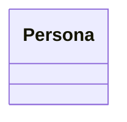
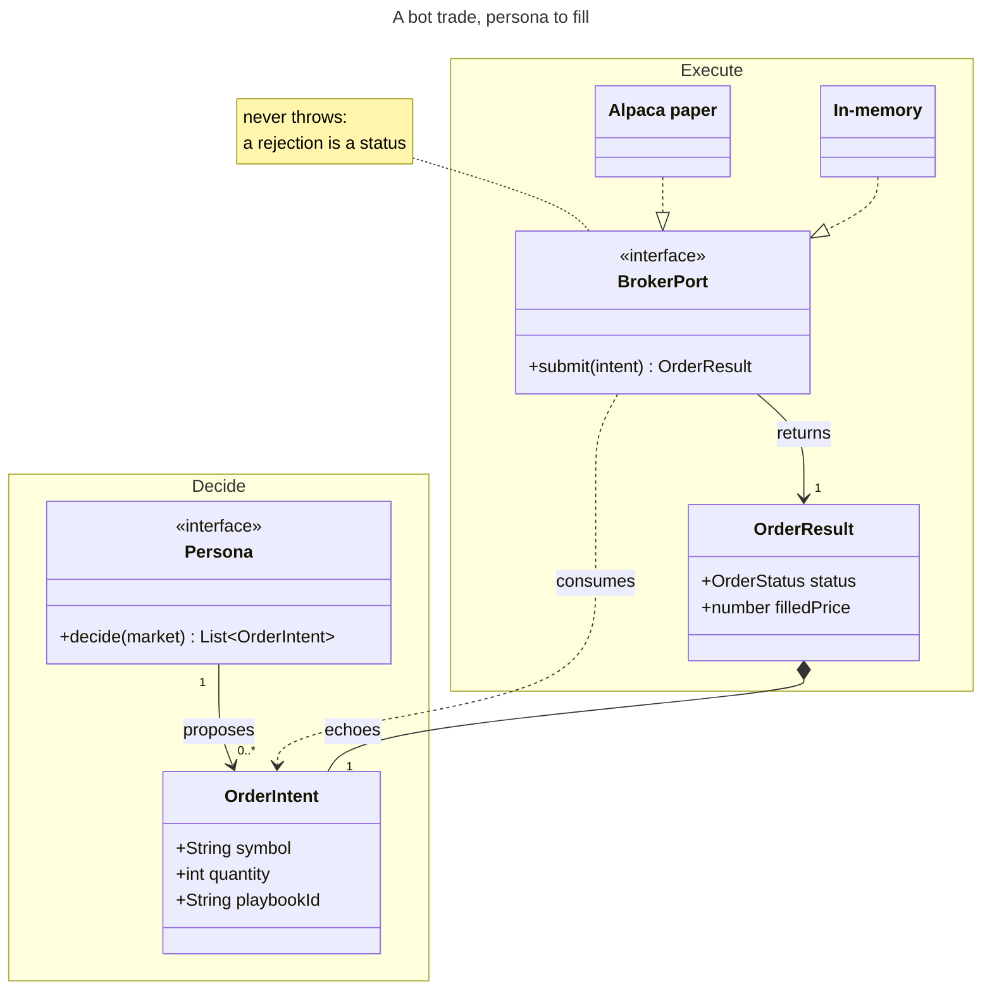

# classDiagram: https://mermaid.js.org/syntax/classDiagram.html (Class diagrams: classes, members, visibility, relationships, cardinality, namespaces, notes, direction, interaction, styling, configuration) — `classDiagram` · `classDiagram-v2`

**Status:** stable. The docs carry no beta or experimental marker. Some parts are version-gated: namespace labels and nested namespaces (with hierarchicalNamespaces) need v11.15.0+. From v12.0.0 the defaults are theme redux-color and look neo, and the class page also says ELK layout. The current Mermaid package on master and develop is 12.0.0.
**GitHub (11.17.2):** The class diagram page says nothing about GitHub. What it does say: interaction (click/link/callback) works only with securityLevel 'loose' and is disabled under 'strict'. GitHub renders sandboxed, so treat interaction as unavailable. GitHub's Mermaid version is unknown. To be safe, avoid v11.15.0+ features (namespace [\"label\"], nested or dotted namespaces, hierarchicalNamespaces) and do not count on v12 defaults (redux-color, neo, ELK). An older renderer draws the classic purple look, as the Mermaid Chart validator did. The current upstream release is 12.0.0 (packages/mermaid/package.json on master and develop). Verify on github.com: render a ```mermaid info``` block to read the deployed version, then test one namespace-label diagram. Otherwise, verify on github.com.

## When to reach for it
- Ports-and-adapters seams: BrokerPort (src/ports/broker.ts) and its realizers AlpacaBrokerAdapter, InMemoryBroker and SwappableBotBroker. Any PR that adds an adapter or changes a port signature: `..|>` plus <<interface>> shows at a glance which implementations must move
- Domain contract deltas in PR bodies, i.e. the 'Schema / data model' row of docs/PICTURES.md: OrderIntent, OrderResult, Persona, Recommendation, DraftOrder field or method changes (e.g. the #885 playbookId/orderId attribution join), with the changed class marked by a <<changed>>/<<new>> stereotype or a note rather than colour
- Issue capsules for a zero-context build session: the exact interface to implement (method names, argument lists, return types, cardinality) next to the EARS criteria. Exact identifiers cost fewer tokens than prose and remove naming guesswork
- /decompose and /dedupe PRs: modules drawn as classes with exported functions as methods and namespace as the directory (src/trading, src/ui), before and after, to show which symbols moved where
- C4 level 4 (code) zoom: the class view under a C4 component box (e.g. the bot execution component into Persona to OrderIntent to BrokerPort to OrderResult)
- Composition structures: a persona wrapped by withPlaybooks composing playbooks, and Recommendation *-- RankedCandidate / AbsentCandidate with cardinality, where ownership and multiplicity are the point

**Not for:**
- Anything temporal or stateful: PR verify to auto-merge to deploy, issue proposed to ready to executing to done, DraftOrder phases, fitness budgets ratcheting weekly. Use stateDiagram-v2, flowchart, timeline or xychart
- Request or message paths (bot to broker to Alpaca and back): sequenceDiagram shows the order, a class diagram does not
- Persisted tables with keys and FK cardinality: erDiagram is the native grammar
- Research call sheets, interrogation verdicts (verbatim/amended/reject/status-quo) and config/constant changes: a table is faster and honest
- Platter PRs merging one commit per item: gitGraph or flowchart
- Single-field additions: a before/after row beats a one-box diagram (the waiver rule)
- Implying OO inheritance or `implements` where TypeScript is only structurally typed (object literals that satisfy an interface without declaring it). Realization arrows would overstate the coupling
- Big modules (more than about 6 classes or long member lists): unreadable at 390px, so it becomes decoration
- Letting v12's per-class categorical colours suggest grouping or status: meaningless hue, and invisible to the red/green colorblind reader

## Header forms
- classDiagram
- classDiagram-v2   (legacy alias: the lexer returns CLASS_DIAGRAM for both, and classDetector-V2.ts says both render with the unified class renderer)
- ---
title: Animal example
---
classDiagram
- ---
config:
  class:
    hideEmptyMembersBox: true
---
classDiagram
- ---
config:
  class:
    hierarchicalNamespaces: false
---
classDiagram   (v11.15.0+)
- ---
config:
  theme: default
  look: classic
  layout: dagre
---
classDiagram   (restores the pre-v12 appearance)
- ---
config:
  class:
    theme: redux
---
classDiagram   (scopes theme/look to class diagrams only; per-type scoping per theming.md)
- %%{init: {"class": {"hideEmptyMembersBox": true}}}%%
classDiagram   (the directive form; theming.md puts it at the same highest priority as frontmatter)
- Body statement (not a header), usually the second line: direction TB | direction BT | direction LR | direction RL

## Primitives
| Form | Syntax | Note |
|---|---|---|
| Class (explicit) | `class Animal` | Names may use only alphanumerics (unicode allowed), underscore and dash. |
| Class (implicit via relation) | `Vehicle <\|-- Car` | Creates both classes and the relation in one line. |
| Class display label | `class Animal["Animal with a label"]` | The id stays Animal for relations and styling. The label can hold symbols (docs example: "Car with *! symbols"). |
| Backtick-escaped class name | `class `Animal Class!` `Animal Class!` --> `Car Class`` | The docs' way to escape special characters in names. |
| Member, colon form (one per line) | `BankAccount : +String owner BankAccount : +deposit(amount)` | Uses the LABEL token, so the member text cannot contain ':' or ';'. |
| Members, block form | `class BankAccount{     +String owner     +BigDecimal balance     +deposit(amount) bool     +withdrawal(amount) int }` | Each body line is a MEMBER matching [^{}\n]*, so colons are fine but '{' and '}' are not. The docs' direction example uses -idCard : IdCard here. |
| Attribute vs method | `+String owner   (attribute) +deposit(amount)   (method)` | The presence of () decides the compartment: methods go to the bottom one, attributes to the middle. |
| Method return type | `+deposit(amount) bool +getPoints() List~int~` | A space is required between ')' and the type. Observed render: 'deposit(amount) : bool' (the renderer inserts ' : '). |
| Generic types | `class Square~Shape~{     List~int~ position     setPoints(List~int~ points)     getPoints() List~int~ } Square : +getDistanceMatrix() List~List~int~~` | Use tildes, not angle brackets. Nesting is supported; commas inside a generic are not (List~K, V~ fails). Refer to the class as Square, not Square~Shape~. |
| Visibility prefixes | `+public  -private  #protected  ~package/internal` | Placed before the member name. |
| Classifiers | `someAbstractMethod()*   someAbstractMethod() int*   someStaticMethod()$   someStaticMethod() String$   String someField$` | * means abstract and $ means static. They go at the very end, after () or after the return type. |
| Annotation (stereotype): inline | `class Shape <<interface>>` | Common values: <<Interface>> <<Abstract>> <<Service>> <<Enumeration>>. Any text is allowed. Renders as «interface» above the bold name. |
| Annotation: separate line | `class Shape <<interface>> Shape` |  |
| Annotation: nested in body | `class Shape{     <<interface>>     noOfVertices     draw() }` |  |
| Enumeration | `class Color{     <<enumeration>>     RED     BLUE     GREEN }` |  |
| Lollipop interface | `bar ()-- foo foo --() bar` | bar is the interface (the circle) and it attaches to class foo. The docs say each lollipop interface is unique and should not be shared or have several edges. |
| Note (floating) | `note "This is a general note"` | Line breaks: \n (docs) or <br> (docs' first example; validated). |
| Note attached to class | `note for MyClass "This is a note for a class"` |  |
| Empty class, hide members box | `--- config:   class:     hideEmptyMembersBox: true --- classDiagram   class Duck` |  |

## Relations
| Form | Syntax | Note |
|---|---|---|
| Inheritance | `classA <\|-- classB    (reverse: classA --\|> classB)` | Solid line with a hollow triangle. In `A <|-- B`, B inherits from A. |
| Composition | `classC *-- classD    (reverse: classC --* classD)` | Solid line with a filled diamond on the whole's side. |
| Aggregation | `classE o-- classF    (reverse: classE --o classF)` | Solid line with a hollow diamond. |
| Association | `classG --> classH    (reverse: classG <-- classH)` | Solid line with an open arrow. |
| Link (solid) | `classI -- classJ` | Solid line, no head. |
| Dependency | `classK ..> classL    (reverse: classK <.. classL)` | Dashed line with an open arrow. |
| Realization | `classM ..\|> classN    (reverse: classM <\|.. classN)` | Dashed line with a hollow triangle (implements). |
| Link (dashed) | `classO .. classP` | Dashed line, no head. |
| Relation label | `classA <\|-- classB : implements [classA][Arrow][ClassB]:LabelText` | The label runs from ':' to end of line and cannot contain ':' or ';'. A colon fails to parse (validated). |
| Two-way (N:M) relation | `Animal <\|--\|> Zebra [Relation Type][Link][Relation Type]` | Relation Type is one of <|  *  o  >  <  |>. Link is -- (solid) or .. (dashed). Example: A *--o B. |
| Cardinality / multiplicity | `Customer "1" --> "*" Ticket Student "1" --> "1..*" Course Galaxy --> "many" Star : Contains [classA] "cardinality1" [Arrow] "cardinality2" [ClassB]:LabelText` | Quoted text goes before and/or after the arrow. Documented values: 1, 0..1, 1..*, *, n, 0..n, 1..n. Any quoted string works ("many"). |
| Lollipop interface edge | `bar ()-- foo foo --() bar` | Draws the provided-interface circle on the interface end. |

## Grouping
- namespace BaseShapes {
    class Triangle
    class Rectangle {
      double width
      double height
    }
}   (groups classes into a titled cluster box)
- namespace Auth["Authentication Service"] { class UserService { +login() } }   (v11.15.0+: the label replaces the displayed name, but the name is still the id for relations and nesting)
- namespace Company.Engineering.Backend { class Developer }   (v11.15.0+ dot notation, which auto-creates the parents Company and Company.Engineering)
- namespace Platform {
    namespace Auth { class UserService }
    namespace Data { class Repository }
    class Gateway
}   (v11.15.0+ syntactic nesting; can be mixed with dot notation)
- config class.hierarchicalNamespaces: false   (compact mode: only explicitly declared namespaces are drawn, each as one flat box labelled with its full dotted name; classes in auto-created ancestors move to the nearest declared namespace)
- Intrinsic grouping: every class box has three compartments (name plus annotation in bold, then attributes, then methods)
- Relations may be declared outside the namespace blocks and still reference the classes inside them (docs examples do this)

## Annotations
- Stereotypes: <<interface>>, <<abstract>>, <<service>>, <<enumeration>> or any custom text, shown as «text» above the class name
- note "general note"; note for ClassName "text"; line breaks via \n or <br>
- Diagram title via YAML frontmatter: ---\ntitle: Bank example\n---
- Relation labels: A --> B : label
- Cardinality text at either end: A "1" --> "0..*" B
- Comments: %% on its own line; everything to the newline is ignored, including class syntax
- Accessibility (lexer, not on this page): accTitle: text / accDescr: text / accDescr { multi-line }
- Interaction (needs securityLevel 'loose'): link Shape "https://url" "tooltip"; click Shape2 href "https://url" "tooltip"; callback Shape "callbackFunction" "tooltip"; click Shape2 call callbackFunction() "tooltip". Declared after all classes. Callbacks receive the nodeId. The .mermaidTooltip CSS class styles tooltips. The lexer also accepts link targets _self/_blank/_parent/_top. Tooltips and links available since 0.5.2
- No autonumber or sequence numbering exists for class diagrams

## Emphasis without hue (the colourblind rule)
- Line pattern carries meaning: solid (--, -->, <|--, *--, o--) versus dashed (.., ..>, ..|>). Solid is structural/owns and dashed is uses/implements, with no hue needed
- Arrowhead glyph carries meaning: hollow triangle (inherit/realize), filled diamond (composition), hollow diamond (aggregation), open arrow (association/dependency), lollipop circle (provided interface). That is five shapes distinguishable in grayscale
- Stereotype text as a delta marker: <<new>>, <<changed>>, <<removed>>, <<interface>> render as «new» above the bold class name. This is the cheapest hue-free way to mark what a PR touched
- Words in the class label: class OrderResult["OrderResult (NEW)"], since the label is free text
- The class name is bold by default. Visibility glyphs + - # ~ and classifier glyphs * (abstract) and $ (static) are text, not colour
- note for X "..." callout boxes to flag the one thing a reader must notice
- namespace boxes with titles (and v11.15+ labels) to show which layer or directory owns a class
- Cardinality and relation-label text ("1" --> "0..*" : proposes) puts the rule in words
- Border weight and dash: style X stroke-width:4px or stroke-dasharray: 5 5 (docs example), or classDef changed stroke-width:3px,stroke-dasharray:4 2 with class X:::changed. Note: docs/PICTURES.md bans ad-hoc style/classDef unless it is a checked-in, contrast-verified snippet
- Direction and rank: in TB the tail of a written edge ranks above its head (observed: `Adapter ..|> BrokerPort` put the adapters above the port), so edge direction can encode 'depends on' reading top-down

## Styling hooks
- style Animal fill:#f9f,stroke:#333,stroke-width:4px
- style Mineral fill:#bbf,stroke:#f66,stroke-width:2px,color:#fff,stroke-dasharray: 5 5
- classDef className fill:#f9f,stroke:#333,stroke-width:4px;
- classDef firstClassName,secondClassName font-size:12pt;
- cssClass "nodeId1" className;
- cssClass "nodeId1,nodeId2" className;
- class Animal:::someclass   and   class Animal:::someclass { ...members... }
- classDef default fill:#f96,color:red   (applies to every node; define specific classes after it)
- External page CSS: .styleClass > * > g { fill:...; stroke:...; stroke-width:4px; } applied with class Animal:::styleClass
- themeVariables: classText (class diagram text color, defaults to textColor) and mainBkg (class box background). Generic keys also apply: primaryColor, primaryBorderColor, primaryTextColor, lineColor, fontFamily, fontSize
- Themes: redux-color (v12 default for class; cycles a categorical colour per class), redux (same geometry, monochrome), default/neutral/dark/forest/base, neo/neo-dark; plus look: neo | classic | handDrawn
- Cannot be styled individually: notes and namespaces (theme only)
- No linkStyle equivalent for relations is documented for classDiagram

## Config keys
- class.hideEmptyMembersBox: boolean, default false. The only key on the page's Configuration table; hides the empty members box
- class.hierarchicalNamespaces: boolean, default true (v11.15.0+). false switches to compact flat namespace boxes
- class.theme: default 'redux-color' since v12 (schema)
- class.look: default 'neo' since v12 (schema)
- layout (top level only, not per-type): 'dagre' | 'elk' | ... The class page says ELK is the class default in v12. theming.md says only swimlane overrides layout. ELK is a separately registered package and falls back to dagre with a console warning if missing
- class.titleTopMargin: default 25
- class.dividerMargin: default 10
- class.padding: default 5
- class.textHeight: default 10
- class.nodeSpacing: integer >= 0
- class.rankSpacing: integer >= 0
- class.diagramPadding
- class.htmlLabels: default false
- class.arrowMarkerAbsolute
- class.useMaxWidth (required base key)
- class.defaultRenderer: exists in <= v11 (default 'dagre-wrapper', seen in the mermaid@11.4.1 schema) and is gone from the v12 schema
- securityLevel: 'loose' (top level) is required for click/link/callback. 'strict' disables them
- Scoped init example from the docs: mermaid.initialize({ layout: 'dagre', class: { theme: 'default', look: 'classic' } })

## Gotchas — what silently breaks
- A colon in a relation label breaks the parse. `Persona --> OrderIntent : fires at 9:45` gives 'Parse error ... Expecting NEWLINE, EOF, got LABEL' (validated). The LABEL token is :[^:\n;]+, so relation labels and colon-form members cannot contain ':' or ';'. Put colon-bearing members in the { } block form and reword labels
- Silent loss: the first lexer rule is `.*direction\s+(TB|BT|RL|LR)[^\n]*`, so any line anywhere containing e.g. 'direction LR' becomes a direction statement and its content disappears. Validated: `note for Trade "read the direction LR on the chart"` returned valid:true but the note was not rendered
- Return type needs a space after ')': `deposit(amount) bool`
- Generics use ~T~, never <T>. Commas inside generics are unsupported (List~K, V~). The generic is not part of the class name, so refer to `Square`, not `Square~Shape~`. Two classes with the same name but different generics are impossible
- Class names: alphanumeric (unicode OK), underscore and dash only. Anything else needs a ["label"] or `backticks`
- The ::: shorthand cannot be used on the same line as a relation statement. Declare `class X:::c` on its own line
- Notes and namespaces cannot be styled individually
- Comments must be on their own line, starting with %%
- Lollipop interfaces are unique. Do not share one interface node across several classes
- classDef default hits every node. Define specific classDefs after it
- Class-body member lines match [^{}\n]*, so '{' or '}' inside a member ends the block
- Version gates: namespace ["label"], nested and dotted namespaces, and hierarchicalNamespaces need v11.15.0+. The redux-color/neo defaults (and per the class doc, ELK) are v12. An older renderer shows the classic purple (#ECECFF/#9370DB) look instead
- The v12 redux-color default gives each class its own categorical hue. That hue means nothing, yet readers will try to read it. Never let colour carry the delta; use stereotypes and notes
- Width at 390px: class diagrams run wide. The validated rich example was 905px wide with two namespaces, 689px with the same content and no namespaces, and 1477px with direction LR. Prefer TB, at most 6 classes, at most 3 short members each, and drop namespaces when width matters
- Validator artifact (Mermaid Chart MCP, not Mermaid): the tool HTML-parses the input, so <<interface>> becomes an <interface> tag and '</interface>' is appended to the end of the source. Even the docs' verbatim annotation example then fails with "got 'DEPENDENCY'". Workaround when validating: end the source with a `%%` comment line to absorb the appended text. Do not change the source for GitHub because of this
- The renderer rewrites method display to 'name(args) : Type', which adds width
- click/link/callback do nothing under securityLevel 'strict'

## Starters (validated mcp__Mermaid_Chart__validate_and_render_mermaid_diagram; minimal ✓, rich ✓ — Minimal: valid on the first try. Rich: the first two attempts, and the docs' own verbatim annotation example, failed with "Parse error ... got 'DEPENDENCY'". The cause is a validator artifact: the MCP tool HTML-parses the input, so <<interface>> becomes an <interface> tag and '</interface>' is appended to the end of the source. Adding a trailing `%% end` comment line absorbed the appended text, after which the docs example and the rich example both returned valid:true. The final rich example (pasted exactly) rendered 6 classes, 2 namespaces, 2 «interface» stereotypes, 4 cardinality terminals, dashed realization and dependency lines, a composition diamond and the note, in a viewBox 905px wide. For comparison: the same content without namespaces was 689px, direction LR was 1477px, and an earlier fuller version was 1030px. The validator draws the pre-v12 default theme (#ECECFF fill, #9370DB stroke), so it is not running the v12 redux-color/neo/ELK defaults. Two extra probes: a colon in a relation label fails to parse, and a note containing 'direction LR' silently vanishes. Real names are grounded in src/ports/broker.ts (BrokerPort.submit returns OrderResult and never throws on rejection), src/adapters/alpaca-broker-adapter.ts, src/adapters/in-memory-broker.ts, src/domain/types.ts (OrderIntent.playbookId, OrderResult.status/filledPrice) and src/personas/persona.ts (Persona.decide returns OrderIntent[]).)

Minimal:



Rich (grounded in this repo):



## Sources
- https://raw.githubusercontent.com/mermaid-js/mermaid/develop/packages/mermaid/src/docs/syntax/classDiagram.md
- https://mermaid.js.org/syntax/classDiagram.html
- https://raw.githubusercontent.com/mermaid-js/mermaid/develop/packages/mermaid/src/docs/config/theming.md
- https://raw.githubusercontent.com/mermaid-js/mermaid/develop/packages/mermaid/src/schemas/config.schema.yaml
- https://raw.githubusercontent.com/mermaid-js/mermaid/master/packages/mermaid/src/schemas/config.schema.yaml
- https://raw.githubusercontent.com/mermaid-js/mermaid/mermaid%4011.4.1/packages/mermaid/src/schemas/config.schema.yaml
- https://raw.githubusercontent.com/mermaid-js/mermaid/develop/packages/mermaid/src/diagrams/class/parser/classDiagram.jison
- https://raw.githubusercontent.com/mermaid-js/mermaid/develop/packages/mermaid/src/diagrams/class/classDetector-V2.ts
- https://raw.githubusercontent.com/mermaid-js/mermaid/master/packages/mermaid/package.json
- /home/user/skynet-capital/docs/PICTURES.md
- /home/user/skynet-capital/src/ports/broker.ts
- /home/user/skynet-capital/src/domain/types.ts
- /home/user/skynet-capital/src/personas/persona.ts
- /home/user/skynet-capital/src/options/recommend.ts
- /home/user/skynet-capital/src/trading/draft-order.ts
