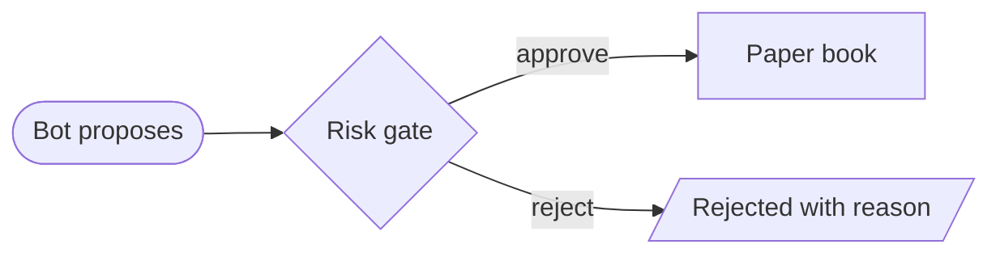
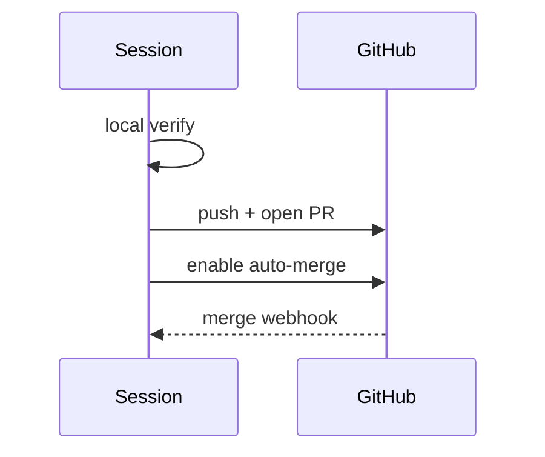
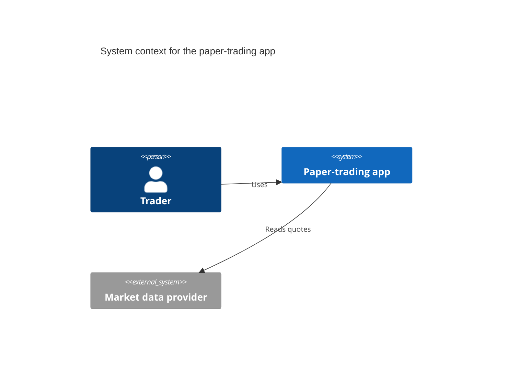
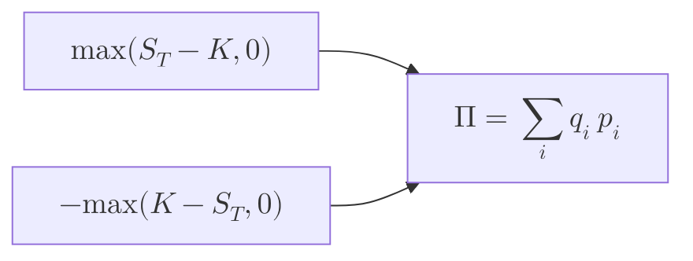
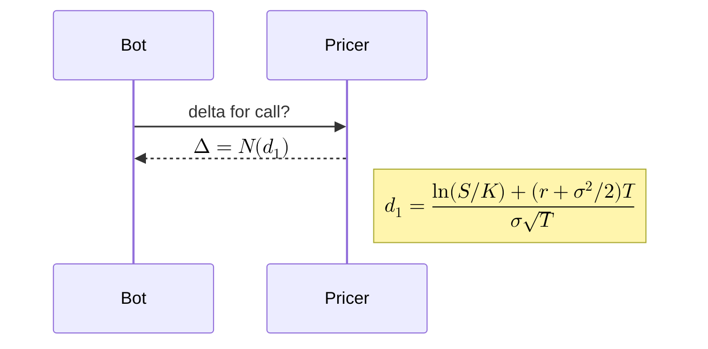

# config/accessibility + config/math + config/usage (cross-cutting: accTitle/accDescr, KaTeX math, and the parse/render/detectType API a headless validator uses)

Three pages, one job: give each diagram a text alternative, allow math in labels, and validate diagrams in code before anyone sees them. ACCESSIBILITY: Mermaid always sets aria-roledescription on the <svg> to the diagram type key. The code also sets role="graphics-document document", which the docs don't mention. Two keywords written in the diagram body add a text alternative: `accTitle:` (one line) becomes a <title> plus aria-labelledby, and `accDescr:` (one line) or `accDescr { ... }` (several lines, no colon) becomes a <desc> plus aria-describedby. The docs say this works for "all diagrams". Tested against Mermaid 11.17.2 (the version GitHub runs), that is false. mindmap, sankey-beta and block-beta fail to parse when the keywords are present. timeline and kanban parse but quietly drop them. C4 turns accTitle into the VISIBLE diagram title and emits no <title>. MATH (v10.9.0+): write KaTeX between `$$...$$`, only in flowcharts and sequence diagrams. It is output as MathML by default. `legacyMathML` falls back to KaTeX's CSS rendering when the browser has no MathML (you must load the KaTeX CSS yourself). `forceLegacyMathML` always uses the CSS rendering. Both default to false. USAGE/API: mermaid.parse(text, {suppressErrors}) returns a Promise of {diagramType, config}. On invalid text it throws, or returns false when suppressErrors is true. mermaid.render(id, text, container?) returns a Promise of {svg, diagramType, bindFunctions}. mermaid.detectType(text) runs synchronously and only matches the header line; it throws UnknownDiagramError when nothing matches. mermaid.run(RunOptions) has replaced init. initialize() is the only place the `secure` keys (including securityLevel, default 'strict') can be set. HEADLESS: parse() works in Node with a jsdom window, document and DOMParser; this repo's scripts/mermaid-lint.mjs already does this, pinned to 11.17.2. render() does not work in jsdom: CSSStyleSheet and getBBox are missing. A full render needs a real browser (mermaid-cli with puppeteer, mermaid-isomorphic with playwright) or the remote Mermaid Chart MCP. A parse-only gate has blind spots, all verified here: malformed KaTeX, text over maxTextSize, accessibility keywords that are silently dropped, and anything decided at layout time. Note that the develop-branch docs already describe v12 (Node >= 22.12, ES2024 bundles, ELK bundled and used by default). GitHub still renders 11.17.2.

## Mechanisms
| Mechanism | Syntax | Scope | Note |
|---|---|---|---|
| accTitle (accessible title) | `accTitle: One line of text   (write it in the diagram body, after the header line; lexer rule is accTitle\s*:\s*)` | One diagram. Adds <title id="chart-title-<svgId>"> as the svg's first child plus aria-labelledby. Usually not shown on screen (gantt is the documented exception, where the title is both visual and accessible). | Single line only. In 11.17.2 it is emitted for flowchart, sequence, class, state, ER, gantt, pie, gitGraph, journey, requirement, quadrant, xychart, packet, architecture, radar and treemap. It fails to parse in mindmap (read as a second root), sankey-beta and block-beta. It is silently dropped in timeline and kanban. In C4 it becomes the visible title with no <title>. |
| accDescr single-line | `accDescr: One line of description` | One diagram. Adds <desc id="chart-desc-<svgId>"> plus aria-describedby. | Supported by the same types as accTitle, and C4 also emits it correctly as <desc>. |
| accDescr multi-line block | `accDescr {   line one   line two }   (no colon; curly braces)` | One diagram. Line breaks are kept in the <desc> text and leading indentation is trimmed (checked in the MCP render of A2). | kanban rejects the block form with 'Lexical error ... Unrecognized text'; it also drops the single-line form. |
| Automatic ARIA (no author action) | `<svg role="graphics-document document" aria-roledescription="<diagram type key>">` | Every rendered SVG, added by setA11yDiagramInfo in render(). | The value is the detectType key, which can differ from the keyword: flowchart-v2, sequence, stateDiagram, c4, er, classDiagram, pie. The role attribute is set in code but not documented. |
| Frontmatter title (visible title, not the a11y title) | `--- title: Plan lifecycle --- stateDiagram-v2 ...` | One diagram. The render path passes it to db.setDiagramTitle, so it is drawn on screen. | It is NOT the accessible <title>; use accTitle for that. It is also missing from parse()'s return value, so a validator has to read the YAML itself. |
| Math labels (KaTeX) | `flowchart:  A["$$x^2$$"] -->\|"$$\sqrt{x+3}$$"\| B("$$\frac{1}{2}$$") sequence:   participant 1 as $$\alpha$$ ; 1->>2: Solve: $$\sqrt{2+2}$$ ; Note right of 2: $$...$$` | Labels in flowcharts (nodes and edge labels) and sequence diagrams (participant aliases, messages, notes) only (v10.9.0+). | Match regex /\$\$(.*?)\$\$/g, so math cannot span lines. It renders with katex.renderToString using displayMode:true and throwOnError:true, so math is always block-style and malformed TeX throws at RENDER time, not at parse time. |
| Math output mode config | `mermaid.initialize({ legacyMathML: true })  \|  mermaid.initialize({ forceLegacyMathML: true })  (also accepted in frontmatter config:, since neither is a secure key)` | Global (site config) or one diagram (frontmatter/directive). | MathML by default. legacyMathML uses KaTeX's HTML+CSS output only when MathML is missing. forceLegacyMathML always uses it and overrides legacyMathML. Either way the page must load katex.min.css itself, at the same version. With neither flag and no MathML, each $$...$$ is replaced with the text 'MathML is unsupported in this environment.' |
| mermaid.parse | `await mermaid.parse(text, { suppressErrors?: boolean })  ->  { diagramType: string, config: MermaidConfig } \| false` | Validation without rendering. Calls are queued and run one at a time. | Throws on invalid input unless suppressErrors is true, in which case it returns false and parseError is not called. As a side effect it resets and re-applies the global directive config. The returned config is the sanitised frontmatter+directive config. |
| mermaid.render | `const { svg, diagramType, bindFunctions } = await mermaid.render(id, text, container?);  el.innerHTML = svg;  bindFunctions?.(el);` | One SVG string. It uses a temporary div appended to document.body, or a sandboxed iframe when securityLevel is 'sandbox'. Calls are queued. | On a parse failure it draws the error ('bomb') diagram and then rejects, unless suppressErrorRendering is true (then it cleans up and rejects). Text longer than maxTextSize is replaced with a 'Maximum text size in diagram exceeded' diagram. Unless securityLevel is 'loose', the SVG is passed through DOMPurify. |
| mermaid.detectType | `mermaid.detectType(text) -> 'sequence' \| 'flowchart-v2' \| ...   (throws UnknownDiagramError)` | Synchronous. Removes frontmatter, directives and %% comments, then runs the registered header detectors. | Only looks at the header, so a body with syntax errors still gets a type. Diagrams are registered only once initialize, parse, render or run has been called; calling detectType on a fresh import throws UnknownDiagramError even for valid text. |
| mermaid.run / startOnLoad | `mermaid.initialize({ startOnLoad: false }); await mermaid.run({ querySelector: '.someOtherClass' \| nodes: [...] , postRenderCallback?: (id)=>{}, suppressErrors?: true })` | Page integration: renders `<pre class="mermaid">` elements and marks each with data-processed. | Replaces mermaid.init, deprecated since v10. With startOnLoad (default true), run() fires on page load. |
| mermaid.initialize (site config) | `mermaid.initialize({ securityLevel: 'loose', htmlLabels: true, flowchart: { useMaxWidth: false } })` | Global config set by the host. This is the ONLY place the secure keys can be changed. | Setting mermaid.startOnLoad or mermaid.htmlLabels directly on the object is deprecated and kept only for backwards compatibility. |
| parseError hook | `mermaid.parseError = (err, hash) => {...}   or   mermaid.setParseErrorHandler(fn)` | Called when parse or render rejects, and inside run(). | From the parse/render wrappers the code calls parseError(err) with ONE argument; only run() calls parseError(error.str, error.hash). It is not called when suppressErrors is true. |
| securityLevel | `mermaid.initialize({ securityLevel: 'strict' \| 'antiscript' \| 'loose' \| 'sandbox' })` | Global. Secure key. | strict (default): HTML in labels is encoded and clicks are off. antiscript: HTML allowed with scripts stripped, clicks on. loose: HTML and clicks on. sandbox (beta): rendered inside an iframe with sandbox="allow-top-navigation-by-user-activation allow-popups", with no JS in context. |
| Tiny build and ELK registration | `<script src=".../@mermaid-js/tiny/dist/mermaid.tiny.js"> ; mermaid.registerLayoutLoaders(elkLayouts); mermaid.initialize({ layout: 'elk' })` | Choice of bundle. | Tiny is about half the size. It has no mindmap, architecture, KaTeX (math renders as 'Katex is not supported in @mermaid-js/tiny...'), lazy loading or ELK. Without ELK, an ELK request falls back to dagre. v12 bundles ELK into the main package; registering @mermaid-js/layout-elk also adds elk.stress, elk.force, elk.mrtree, elk.sporeOverlap, elk.box and elk.rectpacking. |

## Keys
| Key | Meaning | Default |
|---|---|---|
| `securityLevel` | How much the host trusts diagram text: HTML in labels, click handlers, sandbox iframe. Secure key. | 'strict' |
| `startOnLoad` | Render .mermaid elements automatically on page load via run(). Secure key. | true |
| `secure` | Keys that can only be set through initialize(); the same keys in frontmatter or a directive are silently deleted. | ['secure','securityLevel','startOnLoad','maxTextSize','suppressErrorRendering','maxEdges'] |
| `legacyMathML` | When the browser has no MathML, fall back to KaTeX HTML+CSS output; the host must supply katex.min.css. Without it, a warning string replaces the math. | false |
| `forceLegacyMathML` | Always use KaTeX HTML+CSS output for consistent rendering across browsers. Overrides legacyMathML. Needs KaTeX CSS. | false |
| `maxTextSize` | Characters allowed in one diagram. Over the limit, render() draws a 'Maximum text size in diagram exceeded' diagram. parse() does NOT enforce this. Secure key. | 50000 |
| `maxEdges` | Edge limit for flowcharts. Checked while parsing (flowchart db addLink), so parse() does catch it. Secure key. | 500 |
| `suppressErrorRendering` | When true, render() throws without drawing the error 'bomb' SVG into the page. Secure key. | false |
| `deterministicIds / deterministicIDSeed` | Generate SVG ids from a seed rather than the current date, so committed SVGs stay stable. | false / undefined |
| `htmlLabels` | Global HTML labels (foreignObject). flowchart.htmlLabels is deprecated in favour of this. KaTeX output goes into foreignObject HTML labels. | verify (the usage page example sets true) |
| `fontFamily` | Diagram font. Also copied into themeVariables.fontFamily when that is not set. | '"trebuchet ms", verdana, arial, sans-serif;' in 11.17.2. The usage page lists preferred fonts that vary by type and theme: Recursive Variable (since v11.15.0), Open Sans, Arial, Trebuchet MS. |
| `logLevel` | Console log verbosity (5 = fatal only). | 5 |
| `layout` | Layout engine. | 'dagre' in 11.17.2. The v12 usage page says ELK is bundled and 'used by default' (verify when GitHub upgrades). |
| `arrowMarkerAbsolute` | Keep absolute URLs in marker-end references. | false |
| `fontSize / markdownAutoWrap` | Base font size; automatic wrapping of markdown strings. | 16 / true |
| `ParseOptions.suppressErrors` | parse() returns false instead of throwing, and parseError is not called. | undefined (treated as false) |
| `RunOptions.querySelector` | CSS selector for the elements run() renders. | '.mermaid' |
| `RunOptions.nodes` | Explicit elements to render. When set, querySelector is ignored. | undefined |
| `RunOptions.postRenderCallback` | Called with the id of each rendered diagram. | undefined |
| `RunOptions.suppressErrors` | run() logs errors instead of throwing. | false |
| `frontmatter title / displayMode` | title draws a visible diagram title. displayMode is copied to config.gantt.displayMode. | none |

## Theme variables
- No theme variables belong to this topic. accTitle, accDescr and math do not change the palette.
- themeVariables.fontFamily is filled from top-level fontFamily when not set explicitly (initialize and addDirective both do this).
- Sanitiser trap for any themeVariables set in frontmatter or a directive: a value containing characters outside [0-9 "#%(),.;A-Za-z] is blanked. Verified: fontFamily 'sans-serif' comes back as '' because of the hyphen.
- KaTeX in flowcharts: the generated CSS hard-codes `.node .katex path{fill:#000;stroke:#000}`. With forceLegacyMathML or legacyMathML, radical and brace paths are black whatever the theme, so they can disappear in dark mode (verify). MathML output inherits the label text colour.

## For a colourblind reader
accTitle and accDescr are the only built-in way to give a diagram a text alternative that doesn't depend on colour. A good accDescr says in words what the picture encodes, for example 'rejected paths are dashed and end in a slanted box'. The limit: <title> and <desc> go only to assistive technology (and search engines). A SIGHTED red/green colourblind reader never sees them, so for the standing reader they do NOT fix hue-only meaning. Meaning still has to live in visible labels, node shapes, edge styles (dashed, dotted, thick) and words on the arrows. Math renders in one colour (MathML takes the label text colour), so it adds no hue risk; the one edge case is legacy-mode KaTeX paths hard-coded to #000, which can vanish on dark themes. This topic offers no contrast or theme control; that belongs to the theming card. Two practical uses: (1) require accTitle and accDescr on every PR, issue or plan picture, so a zero-context build session reading the raw markdown and a screen-reader user both get the gist; (2) write accDescr as the one-sentence caption of the picture, which doubles as a hue-free statement of what it shows. Don't use accTitle/accDescr on mindmap, sankey-beta or block-beta: the diagram breaks. On timeline, kanban and C4, put the caption in visible text instead.

## On GitHub
GitHub rendered Mermaid 11.17.2 on 2026-09-25 (read from its production bundle; recorded in scripts/mermaid-lint.mjs, where the package pin lives). A ```mermaid block containing just `info` shows the deployed version. What the docs and the 11.17.2 code imply for GitHub: (1) SECURE KEYS: securityLevel, startOnLoad, maxTextSize, suppressErrorRendering, maxEdges and `secure` are silently removed from frontmatter and %%{init}%%, so GitHub's own initialize() settings always win; click handlers and HTML in labels depend on GitHub's securityLevel (verify: probably strict or sandbox; callbacks never run). The 50,000-character and 500-edge limits apply unless GitHub changed them (verify). (2) FRONTMATTER and DIRECTIVES are processed by the parser and sanitised: unknown keys dropped, strings containing < > or url(data: dropped, themeVariables values outside the character whitelist blanked. `title:` draws a visible title. (3) accTitle/accDescr: the <title>/<desc>/aria attributes end up in the SVG, but GitHub draws each diagram inside an iframe from viewscreen.githubusercontent.com. Whether screen readers reach them through that iframe, and what title the iframe itself has, is undocumented (verify). The same C4, timeline and kanban drops apply there. (4) MATH: the full 11.x build includes KaTeX, and current Chrome, Firefox and Safari support MathML, so $$...$$ in flowchart and sequence labels probably renders on GitHub (verify: whether GitHub loads the full or tiny build is not documented; tiny would print 'Katex is not supported in @mermaid-js/tiny'). Don't set forceLegacyMathML or legacyMathML in frontmatter: GitHub won't load katex.min.css, so the output would lose its layout (verify). (5) ELK: not registered in GitHub's 11.17.2, so `layout: elk` falls back to dagre silently (repo lint notes this). The v12 behaviour of ELK bundled by default does not apply until GitHub upgrades. (6) ICON PACKS: GitHub never calls registerIconPacks, so pack icons render as '?' (repo lint gates this). (7) The develop-branch docs describe v12 (Node >= 22.12, ES2024/Safari 17.4, new types). Anything v12-only fails on GitHub. Validate against the 11.17.2 pin, not against the docs.

## Validation tooling
- **mermaid.parse in Node with jsdom (this repo: scripts/mermaid-lint.mjs, `npm run mermaid:lint`, pinned mermaid 11.17.2 + jsdom 30.1.1)** — Before the import, set globalThis.window = new JSDOM(...).window, and also document and DOMParser (DOMPurify binds to window at import; mermaid-js/mermaid#5204). Then `await (await import('mermaid')).default.parse(src)`. Run `node scripts/mermaid-lint.mjs --stdin` or pass files; ship.sh checkbody and issue-lint already call it. — Catches grammar errors on every JISON and Langium type, unknown or v12-only types, the flowchart maxEdges limit, and accTitle/accDescr breaking mindmap, sankey-beta and block-beta. Also gives the sanitised config (theme, layout) for policy checks. CANNOT catch (all verified): malformed KaTeX (N2 passes parse, fails render), text over maxTextSize (a 75,792-character flowchart passed), accTitle dropped on timeline/kanban or moved to the visible title on C4, errors raised only by renderers or layout, overlaps or unreadable output at 390px, icon resolution, contrast. Loads in about 1.5 s. parse() changes global config and is queued, so run one validator per process or accept the shared state (C4 does not clear the shared acc state, so a previous diagram's accTitle can leak into it).
- **mermaid.render in Node with jsdom** — Same globals plus globalThis.CSSStyleSheet = dom.window.CSSStyleSheet, then await mermaid.render(id, src). — Not viable as a gate. Without the CSSStyleSheet shim every type fails with 'CSSStyleSheet is not defined'. With it, pie rendered, but flowchart fails with 'getBBox is not a function' (jsdom has no SVG text measurement). Any type that measures text needs a real browser.
- **mermaid.parse in Node with happy-dom** — Same global-shim approach as jsdom (window, document, DOMParser). — Not tested in this repo; verify. Expect parity with jsdom for parse and the same missing layout APIs (getBBox) for render.
- **@mermaid-js/mermaid-cli (mmdc) — latest 12.0.0** — npx -p @mermaid-js/mermaid-cli mmdc -i in.mmd -o out.svg [-c config.json] [-C style.css] [-t theme] [-b bg] [-p puppeteer.json]; a markdown input has its mermaid blocks rendered and replaced. (needs a browser) — Needs the puppeteer ^25 peer and a Chromium download, plus Node >= 22.13 for 12.0.0. A full render, so it catches KaTeX and renderer errors. 12.0.0 bundles mermaid 12, so to match GitHub, pin an 11.x CLI and override mermaid to 11.17.2. Downloading Chromium in a sandbox may be blocked by the proxy (verify).
- **mermaid-isomorphic 3.1.0 (remcohaszing), and rehype-mermaid 3.0.0 on top of it** — const render = createMermaidRenderer(); const results = await render([src1, src2], { mermaidConfig, css, screenshot? }) returns PromiseSettledResult entries with svg, width and height. (needs a browser) — Uses Playwright in Node (optional peer; run `npx playwright install --with-deps chromium`). Depends on mermaid ^11, so it can be deduped to the 11.17.2 pin, and on katex. Defaults to the arial,sans-serif font; FontAwesome CSS is yours to load. This repo already has playwright 1.62.1, so it is the cheapest full-render gate here (browser binaries: verify).
- **@mermaid-js/parser (1.2.1 installed as mermaid 11.17.2's dependency; latest 2.0.0)** — import { parse } from '@mermaid-js/parser'; await parse('pie', text) throws MermaidParseError (.result holds the lexer and parser errors). — Pure Langium/Chevrotain, no DOM. Covers ONLY the migrated grammars. The 1.2.1 typings list info, packet, pie, architecture, gitGraph, radar, treemap, treeView, eventmodeling, railroad (plus Ebnf/Abnf/Peg), wardley and cynefin. Flowchart, sequence, class, state, ER, C4, gantt, mindmap, timeline, sankey, block, quadrant, xychart, requirement and kanban are still JISON inside mermaid and are not covered. You must pass the type yourself (no detection). 2.0.0 needs Node >= 22.12.
- **beautiful-mermaid 1.1.3 (Craft)** — renderMermaidSVG(src, {bg, fg, ...}) or renderMermaidASCII(src); both synchronous. — Zero DOM, fast, and its ASCII output suits a terminal preview. It has its OWN parser and handles only 6 types (flowchart, state, sequence, class, ER, xychart), so passing here does NOT mean GitHub's Mermaid 11.17.2 will parse or render it. Use it as a preview only, never as a gate.
- **Mermaid Chart MCP validate_and_render_mermaid_diagram** — ToolSearch 'select:mcp__Mermaid_Chart__validate_and_render_mermaid_diagram', then call with {diagramCode, title}. Returns {valid, validationError?, diagramType, rawSVG, renderedPNG, liveEditUrl}. — A remote full render: caught malformed KaTeX (N2) and the mindmap accTitle failure (N1), and returns the real SVG, so the a11y attributes can be checked with jq. The Mermaid version is unknown and may differ from GitHub's 11.17.2, so pair it with the local pinned lint. Successful results run 60 to 150k characters and are saved to tool-results files. Two parallel calls in the same millisecond wrote to the SAME file (A1 overwrote A2), so call it sequentially.
- **GitHub itself / mermaid.live** — Preview in a PR comment or draft; a block containing just `info` prints GitHub's deployed version. mermaid.live is the official live editor. (needs a browser) — The final truth for GitHub rendering, but manual and after the fact.

## Gotchas
- The docs say accTitle/accDescr work on 'all diagrams'. In 11.17.2 that is false. mindmap fails ('There can be only one root', because accTitle is read as a node), sankey-beta and block-beta fail with a parse error, timeline and kanban parse but drop both keywords, and kanban also rejects the multi-line accDescr { } block.
- C4: `accTitle:` calls setTitle, so the text is drawn as the VISIBLE diagram title and there is no <title> or aria-labelledby (confirmed in the MCP render of A4). accDescr works. C4 also does not clear the shared accTitle state, so on a page with several diagrams it can carry the PREVIOUS diagram's accTitle.
- accTitle is one line only. accDescr takes a colon for one line and NO colon with { } for several lines. Only the first form of each has a colon.
- Frontmatter `title:` (visible) and `accTitle:` (hidden <title>) are different things, and parse() returns neither. It returns only {diagramType, config}.
- The code also sets role="graphics-document document", which the accessibility page doesn't mention. aria-roledescription is the type key (flowchart-v2, stateDiagram, c4), not the keyword you typed.
- accDescr is invisible to sighted readers, so it does not solve hue-only encoding for a colourblind reader. Put the meaning in visible labels, shapes and line styles.
- detectType() throws UnknownDiagramError on a fresh import, even for valid text, until initialize, parse, render or run has registered the diagrams. The docs example glosses over this.
- detectType(text) without a config argument can disagree with parse(): 'graph TD' gives 'flowchart' from detectType but 'flowchart-v2' from parse. detectType only matches the header, so 'flowchart LR\n a -->' still returns 'flowchart-v2'. It is not a validator.
- The docs pattern `if (await mermaid.parse(text))` only works with {suppressErrors:true}. Without it, invalid text THROWS rather than returning false.
- A JISON parse error is a plain Error with .hash = {text, token, line, loc{first_line,last_line,first_column,last_column}, expected[]}. A Langium grammar throws MermaidParseError with .result. An unknown type throws UnknownDiagramError. The repo lint prints the first line plus the 'Expecting' line.
- parseError is documented as (err, hash), but the parse and render wrappers call parseError(err) with one argument; only run() passes (str, hash).
- parse() never runs KaTeX: '$$\\frac{1}{$$' passes the local 11.17.2 parse and the repo lint, but the MCP render fails with 'KaTeX parse error: Unexpected end of input'. KaTeX runs with throwOnError:true at render time.
- parse() does not enforce maxTextSize (50,000). A 75,792-character flowchart parsed fine; render() would replace it with 'Maximum text size in diagram exceeded'. maxEdges (500) IS enforced during parse for flowcharts.
- parse() changes global state: it calls reset(), applies the diagram's frontmatter or directive config, and runs through a shared queue. Validators that reuse one instance inherit config and shared acc state from the previous diagram.
- Sanitisation is silent. Secure keys, unknown keys, keys starting with __ or containing proto/constr, and strings containing < > or url(data: are deleted. themeVariables values with characters outside [0-9 "#%(),.;A-Za-z] are blanked (for example 'sans-serif').
- Math: only flowchart and sequence; `$$` is the only delimiter; the expression must sit on one line; it is always display (block) style; flowchart labels need to be quoted strings like ["$$...$$"]. Without MathML or a legacy flag, the text 'MathML is unsupported in this environment.' replaces it. The tiny build replaces it with 'Katex is not supported in @mermaid-js/tiny'.
- legacyMathML and forceLegacyMathML both need katex.min.css at the matching version. That CSS is NOT bundled, KaTeX needs the HTML5 doctype, and in legacy mode flowchart KaTeX paths are hard-coded to #000.
- render() in jsdom fails: 'CSSStyleSheet is not defined', then 'getBBox is not a function' once the shim is added (pie alone rendered). A headless render gate needs a real browser (mermaid-cli, mermaid-isomorphic, Playwright) or the remote MCP.
- When parse fails inside render(), Mermaid draws the error 'bomb' SVG and then rejects. Set suppressErrorRendering:true (secure key, initialize only) so it doesn't leave the bomb behind.
- render() output is passed through DOMPurify unless securityLevel is 'loose'. 'sandbox' wraps the SVG in a base64 data: iframe, and interactivity (bindFunctions, clicks) is lost.
- The develop docs describe v12: Node >= 22.12, ES2024 bundles (Safari 17.4+), ELK bundled and 'used by default', mermaid-cli 12.0.0. GitHub runs 11.17.2. Never treat a docs example as proof that GitHub will render it.
- The Mermaid Chart MCP returns 60 to 150k characters per success, and two parallel calls collided on the same tool-results filename. Validate one diagram at a time.
- The docs' own example HTML has the title 'Big decisions' where the source says 'Big Decisions'. It is illustrative, not a literal output.

```mermaid
---
title: Plan lifecycle
---
stateDiagram-v2
  accTitle: Plan issue lifecycle
  accDescr: A plan moves from draft to ready to building to shipped; ready can bounce back to draft when needs-info is applied.
  [*] --> Draft
  Draft --> Ready: EARS criteria written
  Ready --> Draft: needs-info
  Ready --> Building
  Building --> Shipped
  Shipped --> [*]
```

## Examples (Mermaid Chart MCP (validate_and_render_mermaid_diagram) was available and used, one call at a time after one collision. A1 flowchart: valid; SVG has role="graphics-document document", aria-roledescription="flowchart-v2", aria-labelledby and aria-describedby, and <title>/<desc> with the expected text. A2 sequence: valid; the multi-line accDescr came out as a 3-line <desc> (the first attempt's result file was overwritten by A1's because both calls landed in the same millisecond; re-run on its own). A3 stateDiagram-v2 with frontmatter title: valid; aria-roledescription="stateDiagram", <title>/<desc> present. A4 C4Context: valid, but the SVG has only aria-describedby and <desc>; the accTitle text is drawn as a visible <text> title (confirmed in the 11.17.2 grammar: acc_title calls yy.setTitle). M1 flowchart math: valid; renders MathML <math> in foreignObject. M2 sequence math: valid; 2 KaTeX spans. N1 mindmap with accTitle: INVALID, error "There can be only one root. No parent could be found for (\"accDescr: ...\")" (expected). N2 malformed KaTeX: INVALID, error "KaTeX parse error: Unexpected end of input in a macro argument, expected '}' at end of input: \\frac{1}{" (expected). Cross-check against GitHub's version: all eight went through this repo's lintMermaid (mermaid 11.17.2 + jsdom). A1 to A4, M1 and M2 parse; N1 fails with the same mindmap error; N2 PASSES, which proves the gate misses bad KaTeX. Extra local probes on 11.17.2: an accTitle/accDescr matrix across 22 types (results above); detectType throws before registration; suppressErrors makes parse return false; the parse error .hash shape; sanitisation of secure keys and themeVariables; a 75,792-character diagram parses; render in jsdom fails on CSSStyleSheet and then getBBox.)












```text
mindmap
  accTitle: Surfaces that carry a picture
  accDescr: The root is pictures; branches are PR bodies, issue capsules and plans.
  root((Pictures))
    PR bodies
    Issue capsules
    Plans
```
_(not for GitHub surfaces — mermaid 11.17.2 will not parse it; shown for recognition)_

```mermaid
flowchart LR
  A["$$\frac{1}{$$"] --> B[Net]
```

## Sources
- https://raw.githubusercontent.com/mermaid-js/mermaid/develop/packages/mermaid/src/docs/config/accessibility.md
- https://raw.githubusercontent.com/mermaid-js/mermaid/develop/packages/mermaid/src/docs/config/math.md
- https://raw.githubusercontent.com/mermaid-js/mermaid/develop/packages/mermaid/src/docs/config/usage.md
- /home/user/skynet-capital/node_modules/mermaid/dist/mermaid.d.ts (RunOptions, parse/render/detectType JSDoc, 11.17.2)
- /home/user/skynet-capital/node_modules/mermaid/dist/types.d.ts (ParseOptions, ParseResult, RenderResult)
- /home/user/skynet-capital/node_modules/mermaid/dist/accessibility.d.ts and errors.d.ts
- /home/user/skynet-capital/node_modules/mermaid/dist/config.type.d.ts (secure, legacyMathML, forceLegacyMathML, suppressErrorRendering)
- /home/user/skynet-capital/node_modules/mermaid/dist/mermaid.core.mjs (parse, render, addA11yInfo, preprocessDiagram, parse2/render2 queue)
- /home/user/skynet-capital/node_modules/mermaid/dist/chunks/mermaid.core/chunk-DU6HZSFF.mjs (defaultConfig, sanitize, sanitizeDirective, detectType, renderKatexUnsanitized)
- /home/user/skynet-capital/node_modules/mermaid/dist/chunks/mermaid.core/c4Diagram-7LVT6UL2.mjs (acc_title -> setTitle)
- /home/user/skynet-capital/node_modules/@mermaid-js/parser/dist/src/index.d.ts (DiagramAST coverage, MermaidParseError)
- /home/user/skynet-capital/scripts/mermaid-lint.mjs (GitHub version pin 11.17.2, jsdom parse harness)
- https://registry.npmjs.org/@mermaid-js%2Fmermaid-cli
- https://registry.npmjs.org/mermaid-isomorphic
- https://registry.npmjs.org/@mermaid-js%2Fparser
- https://registry.npmjs.org/beautiful-mermaid
- https://registry.npmjs.org/rehype-mermaid
- https://registry.npmjs.org/mermaid
- https://registry.npmjs.org/@mermaid-js%2Ftiny
