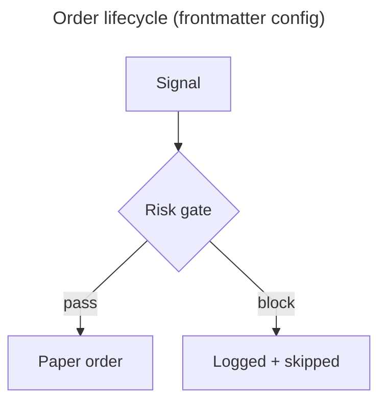
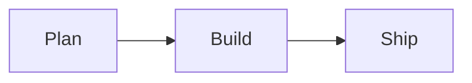
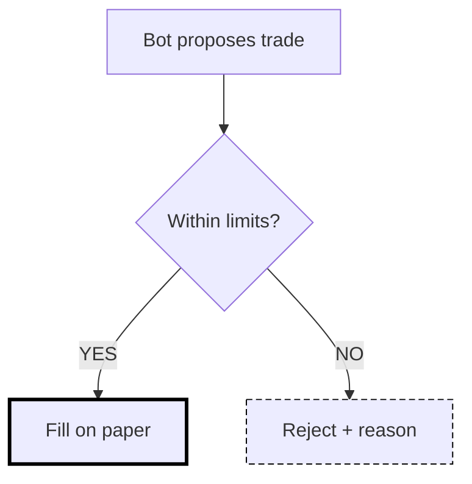
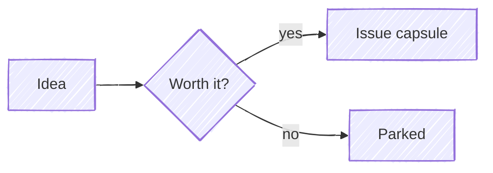
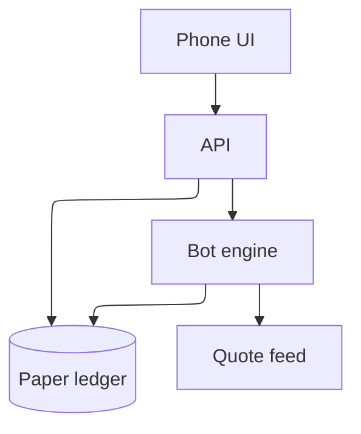
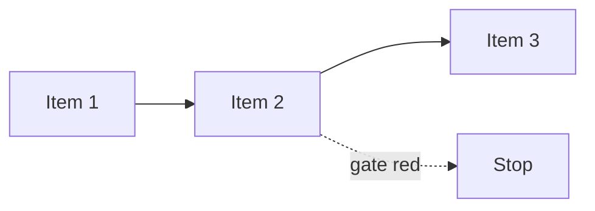
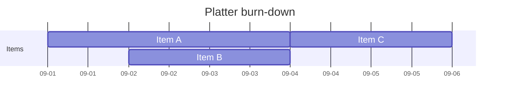
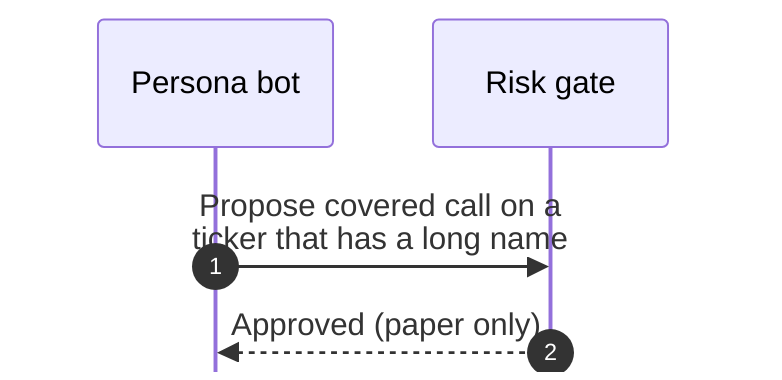
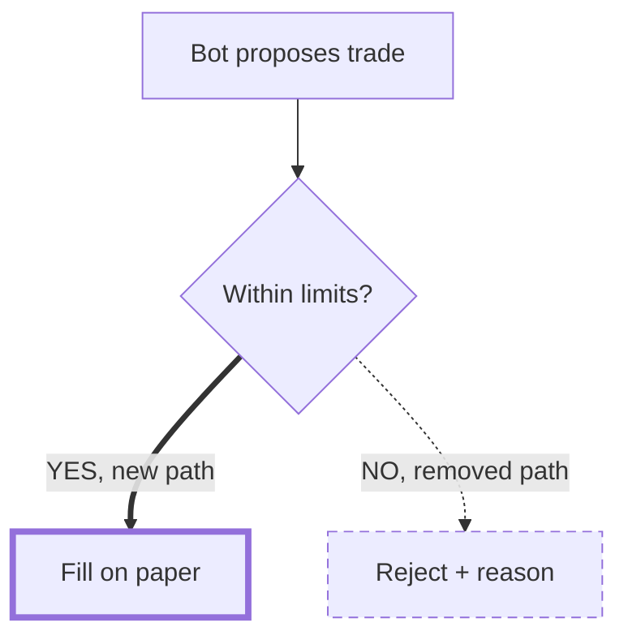

# config/configuration + config/directives (frontmatter, %%{init}%% directives, secure keys, config schema, per-diagram sections)

Mermaid builds a "render config" for each diagram from up to four layers. In order: the schema defaults (config.schema.yaml / defaultConfig.ts), then the siteConfig passed once to mermaid.initialize(), then the diagram's own YAML frontmatter (v10.5.0+), then %%{init}%% directives. Directives are deprecated since v10.5.0 but are still honoured in 11.17.2 and 12.0.0. Before each render the config is reset to the siteConfig (configApi.reset), so one diagram's settings never leak into the next.

Frontmatter supports three top-level keys: `title` (drawn as visible text), `displayMode` (a legacy key that is copied to gantt.displayMode) and `config`, which takes the whole MermaidConfig except the secure keys. Frontmatter and directive config both pass through the same sanitizer. It strips the secure keys (secure, securityLevel, startOnLoad, maxTextSize, suppressErrorRendering, maxEdges), any key not in the schema, prototype-pollution keys, and string values containing `<`, `>` or `url(data:`. themeVariables values must match /^[\d "#%(),.;A-Za-z]+$/ or they are blanked. When a diagram has both, directive values win over frontmatter.

Every diagram type has its own config section (flowchart, sequence, gantt, class, state, er, gitGraph, c4, xyChart, ...). The section name is the config key, which is not always the diagram keyword: `class` for classDiagram, `er` for erDiagram.

Version matters a lot here. GitHub renders 11.17.2 (measured by this repo on 2026-09-25). Upstream is 12.0.0 (released 2026-09-10). In v12, flowchart, sequence, class, state, er, requirement, usecase, venn, swimlane and agentflow default to theme redux-color and look neo, the layout default becomes elk (bundled), and theme/look/layout can be scoped to one diagram type. None of that exists on 11.17.2. There, `config.flowchart.theme` parses but has no effect, and `layout: elk` needs a site-registered package that GitHub does not load, so it silently falls back to dagre.

Validation cannot catch config mistakes. Misspelled keys, bad enum values (theme: purple, layout: nonsense), stripped secure keys and a frontmatter block pushed down by a leading blank line all parse "OK". Only malformed YAML fails, for example tab indentation or an unclosed `[`.

## Mechanisms
| Mechanism | Syntax | Scope | Note |
|---|---|---|---|
| Default config (schema) | `packages/mermaid/src/schemas/config.schema.yaml -> generated defaults + src/defaultConfig.ts (non-JSON defaults)` | All diagrams; the base layer every other layer merges onto | $id https://mermaid.js.org/schemas/config.schema.json. additionalProperties:false at top level, which is why unknown keys are dropped by sanitizeDirective (it checks each key against configKeys). |
| siteConfig via mermaid.initialize() | `mermaid.initialize({ theme: 'base', securityLevel: 'loose', look: 'handDrawn', layout: 'elk', flowchart: { curve: 'linear' } })` | Every diagram on the page or app. Applied ONCE. The ONLY place the secure keys can be set. In v12 it can also scope theme/look/layout to one diagram type, e.g. { look: 'classic', flowchart: { look: 'handDrawn' }, er: { theme: 'neutral' } } | The docs call this the preferred way to configure Mermaid. A host like GitHub owns this layer; diagram authors cannot reach it. Deprecated alternatives: setting mermaid.startOnLoad / mermaid.htmlLabels directly on the object, and mermaid.init(config, nodes), which is deprecated since v10 in favour of mermaid.run(). |
| YAML frontmatter (v10.5.0+) | `--- title: Visible title displayMode: compact config:   theme: neutral   fontSize: 16   flowchart:     curve: linear --- flowchart TD   A --> B` | One diagram. The block must start the diagram text. The docs say the triple dash MUST be the only thing on the first line; an indented fence works if the closing fence has the same indent. Only title, displayMode and config are read; any other top-level key is dropped. | Parsed with js-yaml JSON_SCHEMA. Tabs in indentation are a hard error. Settings are case-sensitive; the docs say misspellings are silently ignored while badly formed parameters break the diagram. `title` renders as visible text (flowchartTitleText), NOT as the SVG <title>. `displayMode` exists for legacy reasons and is copied into config.gantt.displayMode. The config goes through addDirective, so the same sanitizer as directives applies. |
| %%{init}%% / %%{initialize}%% directive (DEPRECATED since v10.5.0) | `%%{init: { "theme": "dark", "fontFamily": "monospace", "logLevel": "info", "htmlLabels": true, "flowchart": { "curve": "linear" }, "sequence": { "mirrorActors": true } } }%%` | One diagram. Can sit above or below the diagram definition. Several init/initialize directives are merged, and the last value wins per key. | JSON keys must be quoted; single or double quotes both work (verified). Unquoted keys or broken JSON make Mermaid ignore the whole directive silently (verified on 11.17.2). A `config` key inside init is moved into the current diagram type's section (verified: init {config:{mirrorActors:false}} set sequence.mirrorActors=false). A top-level fontFamily is copied into themeVariables.fontFamily. The directive wins over frontmatter (verified: frontmatter theme forest + init theme dark gave dark). Still honoured in 11.17.2 and 12.0.0; the upstream advice is to move it to frontmatter `config`. |
| %%{wrap}%% directive | `%%{wrap}%% sequenceDiagram   A->>B: long text` | One diagram; sets the top-level `wrap: true` | Handled in preprocess.ts processDirectives (verified: wrap=true on 11.17.2). Not described on the directives page. |
| Per-diagram config sections | `config:   sequence: { mirrorActors: false, showSequenceNumbers: true, wrap: true, width: 120 }   gantt: { axisFormat: "%m-%d", barHeight: 24 }   er: { layoutDirection: LR }` | Only the named diagram type. Config keys are flowchart, sequence, gantt, journey, timeline, class, state, er, pie, quadrantChart, xyChart, requirement, architecture, mindmap, kanban, gitGraph, c4, sankey, packet, block, radar, treeView, and in newer builds also ishikawa, eventmodeling, venn, wardley-beta, cynefin, railroad, swimlane, agentflow, usecase | Every section inherits BaseDiagramConfig: useWidth, and useMaxWidth (default true). In v12 BaseDiagramConfig also carries theme/look/layout. On 11.17.2 those scoped keys are kept in the config but not honoured (verified: config.flowchart.theme=dark left the top-level theme as default). |
| themeVariables / themeCSS | `config:   theme: base   themeVariables:     primaryColor: "#ffffff"     primaryTextColor: "#000000"     lineColor: "#333333"     fontSize: "18px"` | One diagram (frontmatter/directive) or site-wide (initialize) | Only `base` can be modified. Only hex colours are recognised; named colours such as `red` pass the sanitizer (verified) but break derivation. themeCSS is a raw CSS string checked only for balanced braces. |
| Diagram-syntax styling: classDef / class / style / linkStyle / edge types | `classDef keep stroke-width:4px classDef drop stroke-width:1px,stroke-dasharray:6 4 class C keep B ==> C B -.-> D` | Individual nodes and edges inside one diagram; not part of the config system | The achromatic emphasis mechanism: stroke width, dash pattern, thick `==>` and dotted `-.->` edges. Rendered as `!important` CSS rules on the node class (verified in the SVG). |
| Accessibility keywords accTitle / accDescr | `accTitle: One-line title accDescr: one line -- or -- accDescr {   multi-line   description }` | One diagram; written in the diagram body, not in config | Emits <title> and <desc> plus aria-labelledby and aria-describedby. aria-roledescription is always set to the diagram type key (e.g. flowchart-v2). Supported for all diagram types. |
| configApi runtime (integrator-side) | `setSiteConfig / updateSiteConfig / getSiteConfig / getConfig / reset / setConfig (deprecated) / addDirective` | Library integrators only | reset() runs before every render and restores siteConfig. setConfig is marked @deprecated because the next addDirective or reset overwrites it. |

## Keys
| Key | Meaning | Default |
|---|---|---|
| `title (frontmatter only)` | Visible diagram title, drawn as text in the SVG. It is not the accessible <title>; use accTitle for that. | none |
| `displayMode (frontmatter only, legacy)` | Copied to gantt.displayMode. 'compact' packs non-overlapping tasks onto shared rows (verified). | '' |
| `config (frontmatter only)` | Any MermaidConfig except the secure keys | {} |
| `theme` | CSS theme. Values: default, base, dark, forest, neutral, null. neo, neo-dark, redux, redux-dark, redux-color and redux-dark-color are available in 11.17.2 and 12, but not in 11.12.x or earlier. 'null' disables the predefined themes. | 'default' (v12: per-diagram default redux-color for flowchart/sequence/class/state/er/requirement/usecase/venn/swimlane/agentflow) |
| `themeVariables` | Theme inputs; honoured only with theme: base; hex colours only | derived from the theme |
| `themeCSS` | Extra CSS string (must have balanced braces) | none |
| `look` | classic | handDrawn | neo (neo exists in 11.17+) | 'classic' (v12: neo for the redux-color diagram list) |
| `handDrawnSeed` | Seed for the handDrawn look; 0 means random | 0 |
| `layout` | Layout algorithm: dagre, elk, elk.stress, elk.force, elk.mrtree, elk.sporeOverlap, elk.box, elk.rectpacking, cose-bilkent, tidy-tree. An unregistered layout falls back to dagre with a console warning. | v11.x: 'dagre'; v12 schema: 'elk' (theming.md on develop still says dagre, so the docs contradict each other) |
| `maxTextSize (SECURE)` | Maximum diagram text length | 50000 |
| `maxEdges (SECURE)` | Maximum number of edges | 500 |
| `elk.mergeEdges` | Let parallel edges share a path | false |
| `elk.nodePlacementStrategy` | SIMPLE | NETWORK_SIMPLEX | LINEAR_SEGMENTS | BRANDES_KOEPF | BRANDES_KOEPF (v11); from elk.preset (v12) |
| `elk.nodePlacementAlignment` | NONE | LEFTUP | LEFTDOWN | RIGHTUP | RIGHTDOWN | BALANCED | NONE (11.17); from preset in v12: BALANCED for default, NONE for the others |
| `elk.preset (v12)` | default | legacy | modelOrder | depthFirst | 'default' |
| `elk.straightenEdges (v12)` | Removes small steps where an edge meets a node | true |
| `elk.lineHops (v12)` | Draws edge crossings as hops: true | false | 'arc' | 'gap' | true |
| `elk.layeringStrategy (v12)` | NETWORK_SIMPLEX | LONGEST_PATH | LONGEST_PATH_SOURCE | COFFMAN_GRAHAM | MIN_WIDTH | STRETCH_WIDTH | INTERACTIVE | from preset |
| `elk.layeringLayerBound (v12)` | Maximum nodes per layer for COFFMAN_GRAHAM | 4 |
| `elk.cycleBreakingStrategy` | GREEDY | DEPTH_FIRST | INTERACTIVE | MODEL_ORDER | GREEDY_MODEL_ORDER | GREEDY_MODEL_ORDER (v11); from preset (v12) |
| `elk.forceNodeModelOrder` | Keep nodes in declaration order | false |
| `elk.considerModelOrder` | NONE | NODES_AND_EDGES | PREFER_EDGES | PREFER_NODES | 'NODES_AND_EDGES' |
| `elk.keepEntryNodeOnTop` | Pin the entry node of a cyclic flow to the first layer | false |
| `darkMode` | Changes how derived colours are calculated | false |
| `htmlLabels` | Use HTML for labels. Set it at the root; flowchart.htmlLabels is deprecated since v11.12.3+. | unset (treated as true) |
| `fontFamily` | CSS font-family | '"trebuchet ms", verdana, arial, sans-serif;' |
| `altFontFamily` | Appears unused (schema TODO) | none |
| `logLevel` | trace/0, debug/1, info/2, warn/3, error/4, fatal/5 | 5 |
| `securityLevel (SECURE)` | strict: HTML encoded and click disabled. antiscript: HTML allowed, scripts removed, click on. loose: HTML and click on. sandbox: renders inside a sandboxed iframe (beta). | 'strict' |
| `startOnLoad (SECURE)` | Render automatically on page load | true |
| `arrowMarkerAbsolute` | Absolute arrow-marker URLs (matters with <base>) | false |
| `secure` | Keys only initialize() may set; a site can add more | ['secure','securityLevel','startOnLoad','maxTextSize','suppressErrorRendering','maxEdges'] |
| `legacyMathML` | Fall back to KaTeX CSS when MathML is unsupported (the site must supply KaTeX CSS) | false |
| `forceLegacyMathML` | Always use KaTeX CSS rendering | false |
| `deterministicIds` | Seeded, stable SVG ids | false |
| `deterministicIDSeed` | Seed string for the ids | none |
| `dompurifyConfig` | Options passed to DOMPurify | none |
| `wrap` | Global label wrapping (also set by %%{wrap}%%) | unset |
| `fontSize` | Global font size (number, px) | 16 |
| `markdownAutoWrap` | Auto-wrap markdown strings | true |
| `suppressErrorRendering (SECURE)` | Do not insert the 'Syntax error' SVG | false |
| `<section>.useMaxWidth / useWidth (BaseDiagramConfig)` | Scale to the container width (100%); useWidth sets a fixed width | useMaxWidth true (sankey and ishikawa default false) |
| `flowchart.*` | titleTopMargin, subGraphTitleMargin, diagramPadding, nodeSpacing, rankSpacing, curve (basis|bumpX|bumpY|cardinal|catmullRom|linear|monotoneX|monotoneY|natural|step|stepAfter|stepBefore), padding, wrappingWidth, inheritDir, defaultRenderer (v11 only), htmlLabels (deprecated), minNodeWidth (v12) | 25, {top:0,bottom:0}, 8, 50, 50, 'basis', 15, 200 (v11) / 120 (v12), false, 'dagre-wrapper' |
| `sequence.*` | mirrorActors, wrap, width, height, showSequenceNumbers, messageAlign, rightAngles, hideUnusedParticipants, actorMargin, boxMargin, boxTextMargin, noteMargin, messageMargin, activationWidth, diagramMarginX/Y, bottomMarginAdj, forceMenus, noteAlign, actorFontSize/Family/Weight, noteFontSize/Family/Weight, messageFontSize/Family/Weight, wrapPadding, labelBoxWidth/Height | true, false, 150, 65, false, 'center', false, false, 50, 10, 5, 10, 35, 10, 50/10, 1, false, 'center', 14/'Open Sans'/400, 14/trebuchet/400, 16/trebuchet/400, 10, 50/20 |
| `gantt.*` | titleTopMargin, barHeight, barGap, topPadding, rightPadding, leftPadding, gridLineStartPadding, fontSize, sectionFontSize, numberSectionStyles, axisFormat, tickInterval, topAxis, displayMode (''|compact), weekday | 25, 20, 4, 50, 75, 75, 35, 11, 11, 4, '%Y-%m-%d', unset, false, '', 'sunday' |
| `gitGraph.*` | titleTopMargin, diagramPadding, nodeLabel{width,height,x,y}, mainBranchName, mainBranchOrder, showCommitLabel, showBranches, rotateCommitLabel, parallelCommits, arrowMarkerAbsolute | 25, 8, {75,100,-25,0}, 'main', 0, true, true, true, false, false |
| `c4.*` | diagramMarginX/Y, c4ShapeMargin, c4ShapePadding, width, height, boxMargin, c4ShapeInRow, c4BoundaryInRow, nextLinePaddingX, wrap, wrapPadding. Per element (person, system, system_db, system_queue, container*, component*, external_*, boundary, message) there are *FontSize/*FontFamily/*FontWeight keys and *_bg_color/*_border_color keys. | 50/10, 50, 20, 216, 60, 10, 4, 2, 0, true, 10. Fonts 14 (message 12) 'Open Sans' normal. Colours e.g. person #08427B, system #1168BD, container #438DD5, component #85BBF0, external greys. |
| `er.*` | titleTopMargin, diagramPadding, layoutDirection (TB|BT|LR|RL), minEntityWidth, minEntityHeight, entityPadding, nodeSpacing, rankSpacing, stroke, fill, fontSize | 25, 20, 'TB', 100, 75, 15, 140, 80, 'gray', 'honeydew', 12 |
| `state.* / class.*` | state: wrappingWidth, minNodeWidth, titleTopMargin, dividerMargin, sizeUnit, padding, textHeight, titleShift, noteMargin, forkWidth, forkHeight, miniPadding, fontSizeFactor, fontSize, labelHeight, edgeLengthFactor, compositTitleSize, radius, nodeSpacing, rankSpacing. class: titleTopMargin, dividerMargin, padding, textHeight, htmlLabels, hideEmptyMembersBox, hierarchicalNamespaces (v12) | state: 120, 120, 25, 10, 5, 8, 10, -15, 10, 70, 7, 2, 5.02, 24, 16, '20', 35, 5. class: 25, 10, 5, 10, false, false, true |
| `pie.* / quadrantChart.* / xyChart.*` | pie: textPosition, donutHole, legendPosition, highlightSlice (the last three v12). quadrantChart: chartWidth, chartHeight, titleFontSize, titlePadding, quadrantPadding, x/yAxisLabelPadding, x/yAxisLabelFontSize, quadrantLabelFontSize, quadrantTextTopPadding, pointTextPadding, pointLabelFontSize, pointRadius, xAxisPosition (top|bottom), yAxisPosition (left|right), quadrantInternal/ExternalBorderStrokeWidth. xyChart: width, height, titleFontSize, titlePadding, showDataLabel, showDataLabelOutsideBar, showTitle, showLegend, legendFontSize, legendPadding, xAxis/yAxis{showLabel, labelFontSize, labelPadding, showTitle, titleFontSize, titlePadding, showTick, tickLength, tickWidth, showAxisLine, axisLineWidth, labelRotation}, chartOrientation, plotReservedSpacePercent | pie 0.75, 0, 'right', ''. quadrant 500, 500, 20, 10, 5, 5/5, 16/16, 16, 5, 5, 12, 5, 'top', 'left', 1/2. xy 700, 500, 20, 10, false, false, true, true, 14, 10, axis {true, 14, 5, true, 16, 5, true, 5, 2, true, 2, 0}, 'vertical', 50 |
| `other sections` | architecture: padding, iconSize, fontSize, randomize, nodeSeparation, idealEdgeLengthMultiplier, edgeElasticity, numIter, seed. mindmap: padding, maxNodeWidth, layoutAlgorithm. kanban: padding, sectionWidth, ticketBaseUrl. packet: rowHeight, bitWidth, bitsPerRow, showBits, bitOrder, paddingX/Y. block: padding. radar: width, height, margins, axisScaleFactor, axisLabelFactor, curveTension. sankey: width, height, linkColor, nodeAlignment, useMaxWidth, showValues, prefix, suffix, nodeWidth, nodePadding, labelStyle. timeline: journey-like margins plus disableMulticolor. journey: margins, fonts, actorColours, sectionFills, sectionColours, titleColor/FontFamily/FontSize. requirement: rect_fill, text_color, rect_border_size/color, rect_min_width/height, fontSize, rect_padding, line_height. treeView: rowIndent, paddingX/Y, lineThickness, showIcons, defaultIconPack, filenameIcons, extensionIcons. | architecture 40/80/16/false/75/1.5/0.45/2500/1. mindmap 10/200/'cose-bilkent'. kanban 8/200/''. packet 32/32/32/true/'ascending'/5/5. block 8. radar 600/600/50s/1/1.05/0.17. sankey 600/400/'gradient'/'justify'/false/true/''/''/10/12/'legacy'. timeline disableMulticolor false |

## Theme variables
- BASE INPUTS (set these; everything else derives from them): darkMode=false, background=#f4f4f4, fontFamily='trebuchet ms, verdana, arial', fontSize=16px, primaryColor=#fff4dd. Fixed-default note colours: noteBkgColor=#fff5ad, noteTextColor=#333.
- DERIVED core (calculated unless you override them): primaryTextColor (from darkMode, #ddd or #333), secondaryColor (from primaryColor), primaryBorderColor (from primaryColor), secondaryBorderColor, secondaryTextColor, tertiaryColor (from primaryColor), tertiaryBorderColor, tertiaryTextColor, noteBorderColor (from noteBkgColor), lineColor (from background), textColor (from primaryTextColor), mainBkg (from primaryColor), errorBkgColor (=tertiaryColor), errorTextColor (=tertiaryTextColor). Derivation can invert colours, shift hue, or lighten/darken by 10%.
- Flowchart: nodeBorder (=primaryBorderColor), clusterBkg (=tertiaryColor), clusterBorder (=tertiaryBorderColor), defaultLinkColor (=lineColor), titleColor (=tertiaryTextColor), edgeLabelBackground (from secondaryColor), nodeTextColor (=primaryTextColor)
- Sequence: actorBkg (=mainBkg), actorBorder, actorTextColor, actorLineColor, signalColor (=textColor), signalTextColor, labelBoxBkgColor, labelBoxBorderColor, labelTextColor, loopTextColor, activationBorderColor, activationBkgColor (=secondaryColor), sequenceNumberColor (from lineColor)
- Pie: pie1..pie12 (pie1=primaryColor, pie2=secondaryColor, the rest derived), pieTitleTextSize=25px, pieTitleTextColor, pieSectionTextSize=17px, pieSectionTextColor, pieLegendTextSize=17px, pieLegendTextColor, pieStrokeColor=black, pieStrokeWidth=2px, pieOuterStrokeWidth=2px, pieOuterStrokeColor=black, pieOpacity=0.7
- State: labelColor (=primaryTextColor), altBackground (=tertiaryColor). Class: classText (=textColor). Journey: fillType0..fillType7 (alternating from primaryColor and secondaryColor)
- Present in the theme source (theme-base.js @11.17.2) but NOT in the docs table: git0-7, gitInv0-7, gitBranchLabel0-7, commitLabelColor, commitLabelBackground, commitLabelFontSize, tagLabelColor, tagLabelBackground, tagLabelBorder, tagLabelFontSize (gitGraph); cScale0-11 (mindmap/timeline/kanban-style scales); quadrant1Fill..quadrant4Fill, quadrant1TextFill..4, quadrantPointFill, quadrantPointTextFill, quadrantXAxisTextFill, quadrantYAxisTextFill, quadrantTitleFill, quadrantInternalBorderStrokeFill, quadrantExternalBorderStrokeFill; xyChart{...}, radar{...} (nested objects); requirementBackground, requirementBorderColor, requirementBorderSize, requirementTextColor, relationColor, relationLabelBackground, relationLabelColor; archEdgeColor, archEdgeArrowColor, archEdgeWidth, archGroupBorderColor, archGroupBorderWidth; gantt taskBkgColor, taskBorderColor, taskTextColor, taskTextLightColor, taskTextDarkColor, taskTextOutsideColor, taskTextClickableColor, activeTaskBkgColor, activeTaskBorderColor, doneTaskBkgColor, doneTaskBorderColor, critBkgColor, critBorderColor, todayLineColor, gridColor, sectionBkgColor, sectionBkgColor2, altSectionBkgColor, excludeBkgColor, vertLineColor; state stateBkg, stateLabelColor, compositeBackground, compositeBorder, compositeTitleBackground, innerEndBackground, specialStateColor, transitionColor, transitionLabelColor; ER attributeBackgroundColorOdd/Even, rowOdd/rowEven; C4 personBkg, personBorder; venn1-8, vennSetTextColor, vennTitleTextColor; eventmodeling em* fills and strokes; cynefin{}, wardley{}, wardleyEvolutionColor; neo/redux extras useGradient, gradientStart, gradientStop, dropShadow, strokeWidth, fontWeight, noteFontWeight, radius, THEME_COLOR_LIMIT
- Rules: themeVariables apply ONLY with theme: base. Colours must be hex (named colours are not recognised). v12 note from the syntax reference: on the neo look, `base` turns on useGradient for node strokes, a custom nodeBorder turns the gradient off, and useGradient: true turns it back on.

## For a colourblind reader
What config offers a reader who cannot rely on hue:

1. Achromatic themes:
   - `theme: neutral` is greyscale and print-oriented (verified render: fill #eee, stroke #999).
   - v12 `redux` is the monochrome twin of redux-color. The docs recommend it "when you want the colour to carry meaning you assign yourself".
   - `base` + themeVariables lets you force high-contrast pairs: primaryTextColor #000 on primaryColor #fff, a dark lineColor, a larger fontSize (verified render).
2. Size: top-level `fontSize` (16), themeVariables.fontSize, and per-diagram font keys (sequence messageFontSize 16, gantt fontSize 11, er fontSize 12, c4 *FontSize 14) can all be raised for a 390px phone. The small gantt, er and pie text defaults hurt most.
3. Non-hue emphasis channels live in diagram syntax, not config:
   - classDef `stroke-width` and `stroke-dasharray` without any hex, so they follow the theme and survive both GitHub colour modes (verified render and 11.17.2 parse).
   - Thick `==>` and dotted `-.->` edges.
   - Shape: diamond, cylinder.
   - Text labels on edges ("YES / NO").
4. accTitle and accDescr give screen-reader text.

What it does NOT solve:
- Mermaid has no colour-blind-safe palette switch and no contrast checker.
- Hue carries identity in several places:
  - The categorical palettes (pie1-12, git0-7, fillType0-7, cScale0-11, and v12 redux-color's per-entity colours) separate items by hue only.
  - gantt `crit` tasks are marked red (stroke #ff8888, fill red), and the today line is red.
  - Pie slices depend on a hue-coded legend.
- Automatic colour derivation can produce low-contrast pairs you never chose.
- Named colours are silently ignored by the theme engine.
- Pinning a theme or hex values on GitHub freezes one of its two colour modes (repo finding, docs/PICTURES.md). Contrast fixes made that way can break dark mode.
- Forward risk: when GitHub moves to v12, un-themed flowcharts, sequence, class, state and er diagrams will default to redux-color. That adds decorative per-item hue a reader may take as meaningful, unless those diagrams set theme or look explicitly.

## On GitHub
The Mermaid docs never mention GitHub. What they say about host integrations applies to GitHub as the site integrator:

1. Secure keys can only be set through initialize(), and frontmatter or directive attempts are stripped. Verified on 11.17.2: frontmatter securityLevel: loose, maxTextSize, startOnLoad and secure were all ignored, while theme in the same block applied. Authors therefore cannot enable `click` (strict is the default and disables clicks) or raise size limits. The host can also add keys to `secure` (verify which, if any, GitHub adds).
2. Frontmatter config and %%{init}%% are honoured by the library itself. %%{init}%% is deprecated but still works in 11.17.2. The repo's lint treats `theme` as honoured on GitHub, where it freezes one colour mode. Whether GitHub strips or pre-processes any frontmatter: verify (docs silent).
3. Version: GitHub served 11.17.2 on 2026-09-25 (repo measurement, scripts/mermaid-lint.mjs). An `info` diagram prints the deployed version. So:
   - The v12 per-diagram defaults (redux-color, neo, ELK) and per-diagram theme/look/layout scoping do not apply. The scoped keys parse but are ignored.
   - neo and redux themes and `look: neo` exist in 11.17.2 but not in 11.12.x or earlier.
4. ELK: in 11.x a site must register @mermaid-js/layout-elk. The repo says GitHub does not, so `layout: elk` silently falls back to dagre. In v12 ELK is bundled and becomes the default, so layouts will shift when GitHub upgrades.
5. Icon packs need registerIconPacks by the site. The repo finding is that GitHub renders them as '?'.
6. Math: `$$...$$` KaTeX works in flowchart and sequence labels since v10.9.0, using MathML by default. legacyMathML and forceLegacyMathML need KaTeX CSS supplied by the site. Whether GitHub renders it: verify.
7. `title` from frontmatter renders as visible text. accTitle and accDescr produce <title>/<desc> in the SVG; whether GitHub's iframe exposes them to assistive tech: verify.
8. The GitHub mobile app does not render Mermaid at all (repo finding); a phone browser does.

## Validation tooling
- **mermaid.parse() in Node with jsdom (repo: scripts/mermaid-lint.mjs, mermaid pinned 11.17.2 = GitHub)** — `npm run mermaid:lint` or `node scripts/mermaid-lint.mjs --stdin --json`. It sets up a JSDOM window, document and DOMParser, then imports mermaid and awaits mermaid.parse(src). Afterwards mermaid.mermaidAPI.getConfig() shows the config that actually took effect. — Catches grammar errors and YAML errors in frontmatter (tabs: 'tab characters must not be used in indentation (2:1)'; unclosed flow collection). Checks the diagram type against GitHub's exact version. The repo layer adds house rules: a pinned theme is a problem; %%{init}%%, layout: elk, click and long diagrams produce notes. It CANNOT catch misspelled or unknown config keys (silently dropped), invalid enum values (theme: purple, layout: nonsense), stripped secure keys, named colours in themeVariables, frontmatter pushed down by a leading blank line (parse passes, config ignored), layout quality, contrast, or anything that only happens at render.
- **Mermaid Chart MCP validate_and_render_mermaid_diagram** — Pass diagramCode. It returns valid and diagramType plus rawSVG, a PNG and an edit link, or a validationError with line and column. — Runs server-side on Mermaid v11.13.0 (probed with an `info` diagram), NOT GitHub's 11.17.2 and not v12. Types or looks added after 11.13 may be rejected, and a pass does not prove GitHub renders it the same. Useful for checking rendered effects in the SVG: classDef rules, compact gantt rows, mirrorActors, <title>/<desc>. It cannot show GitHub's dark mode, missing icon packs, or whether ELK was really used.

## Gotchas
- Directives are deprecated (v10.5.0) but still work. If a diagram has BOTH frontmatter and %%{init}%%, the directive wins (verified: forest in frontmatter, dark in init, dark rendered). Mixing them hides which value applies.
- Frontmatter must be at the very top. With a leading blank line before `---`, 11.17.2 still parsed the diagram as valid but applied NONE of the config (observed). An indented block works if the closing `---` has the same indent.
- Tabs in frontmatter indentation are a hard error on both 11.13 (MCP) and 11.17.2: 'tab characters must not be used in indentation (2:1)'.
- Misspelled or unknown keys (themee, flowchart.curvee) are silently dropped, and parse still passes. Invalid enum values are kept silently (theme: purple; layout: nonsense falls back to dagre with only a console warning). A green parse proves nothing about config.
- Secure keys (secure, securityLevel, startOnLoad, maxTextSize, suppressErrorRendering, maxEdges, plus any the site adds) are deleted from frontmatter and directives without an error.
- The sanitizer silently removes:
- string values containing `<`, `>` or `url(data:`, e.g. fontFamily: "" fell back to the default;
- keys starting with `__` or containing `proto` or `constr`;
- themeVariables values outside /^[\d "#%(),.;A-Za-z]+$/, which are blanked (e.g. 'url(javascript:x)' became '').
themeCSS, fontFamily and altFontFamily with unbalanced braces become '{ /* ERROR: Unbalanced CSS */ }'.
- themeVariables only take effect with theme: base, and only as hex. A named colour like `red` passes the sanitizer but the theme engine does not recognise it, so derived colours go wrong.
- Directive JSON: single- or double-quoted keys both work, but unquoted keys or malformed JSON make Mermaid drop the whole directive silently. `%%{ }%%` inside ordinary `%%` comments confuses the renderer, so avoid braces in comments.
- Several init/initialize directives are merged and the last value wins. A `config` key inside init is moved to the current diagram type's section. A directive can sit below the diagram body. A top-level fontFamily in a directive is copied into themeVariables.fontFamily.
- Frontmatter `title` is visible text in the SVG (flowchartTitleText), not the accessible <title>. Use accTitle/accDescr for screen readers. Only title, displayMode and config are read from frontmatter; every other top-level key is ignored.
- `displayMode` is a legacy top-level frontmatter key that only affects gantt (it is copied to gantt.displayMode). The syntax-reference example also puts a `gantt:` block at the frontmatter top level (outside `config:`); the parser ignores top-level keys other than title, displayMode and config, so that block is inert.
- flowchart.htmlLabels is deprecated since v11.12.3+; set htmlLabels at the root. lazyLoadedDiagrams and loadExternalDiagramsAtStartup are deprecated (use registerExternalDiagrams). mermaid.init is deprecated (use mermaid.run). Setting mermaid.startOnLoad directly is deprecated. configApi.setConfig is deprecated.
- Version drift, v12.0.0 (upstream) vs 11.17.2 (GitHub):
- v12 defaults flowchart, sequence, class, state, er, requirement, usecase, venn, swimlane and agentflow to theme redux-color and look neo.
- The v12 schema makes layout default to elk (bundled).
- The develop docs contradict each other: theming.md says global layout dagre and ELK is a separate package; layouts.md and the schema say ELK is default and bundled.
- Scoped config.<diagram>.theme/look/layout is v12-only; 11.17.2 keeps it in config but ignores it (verified).
- flowchart.wrappingWidth default changed from 200 to 120, and flowchart.defaultRenderer is gone in v12.
- neo/redux themes and `look: neo` do not exist in 11.12.x or earlier. The Mermaid Chart MCP runs 11.13.0, so a pass there is not a GitHub-version pass (GitHub is 11.17.2), and vice versa.
- layout: elk on 11.x needs @mermaid-js/layout-elk registered by the site; otherwise it silently falls back to dagre. mindmap keeps cose-bilkent. The tiny build has no ELK at all.
- YAML is parsed with js-yaml JSON_SCHEMA: only JSON-compatible types. Quote values that start with YAML indicators, e.g. axisFormat: "%m-%d"; the quoted form was verified, the unquoted form was not tested.
- Config is reset to siteConfig before every render, so frontmatter never leaks between diagrams. It also means authors cannot set anything page-wide.
- configuration.md says there are '3 sources' but lists 4 (default, siteConfig, frontmatter, directives). Its 'Theme configuration' heading is empty. directives.md lists logLevel's default as 5 and gives both numeric and string forms (debug/info/...).

## Examples (Mermaid Chart MCP (server Mermaid v11.13.0, measured with the `info` diagram):
1. Frontmatter config block: PASS. Visible title rendered; neutral theme and curve applied.
2. %%{init}%% directive: PASS. Neutral fill #eee and stroke #999 rendered.
3. base + themeVariables + hex classDef: PASS. Fill #ffffff and stroke #000000 applied; dasharray 5 3 present.
4. handDrawn flowchart: PASS. Rough.js paths present.
5. ELK flowchart: PASS as valid. The output cannot show whether ELK or a dagre fallback did the layout.
6. accTitle/accDescr: PASS. <title> and <desc> emitted, with aria-labelledby and aria-describedby.
7. gantt displayMode compact: PASS. Item C shares row 1 with Item A; axisFormat %m-%d applied.
8. sequence config section: PASS. Top actors only, sequence numbers on, message wrapped onto 3 lines.
9. Achromatic classDef with no hex: PASS. `.keep{stroke-width:4px!important}` and `.drop{...stroke-dasharray:6 4}` present; thick and dotted edge classes present.
10. Tab-indented frontmatter (negative): FAIL, as expected, with 'Mermaid rendering failed: tab characters must not be used in indentation (2:1)'.

Local mermaid.parse on 11.17.2 (GitHub's version, jsdom, no browser):
- Examples 1–9 all parse. Example 10 fails with the same tab error.
- Config probes:
  - Secure keys in frontmatter were stripped while theme still applied.
  - A directive beats frontmatter.
  - Unknown keys are dropped silently.
  - `<` in fontFamily was dropped.
  - A themeVariables value 'url(javascript:x)' was blanked.
  - %%{wrap}%% sets wrap=true.
  - An init `config` key goes to sequence.mirrorActors.
  - displayMode maps to gantt.displayMode='compact'.
  - Scoped flowchart.theme/look are kept but ignored.
  - look neo / theme neo are accepted.
  - Unquoted-key and broken-JSON directives are ignored silently.
  - A leading blank line before frontmatter means config is not applied, but parse still succeeds.
  - theme: purple and layout: nonsense are accepted silently.
  - Malformed YAML flow fails: 'unexpected end of the stream within a flow collection (3:1)'.

Repo lint (scripts/mermaid-lint.mjs --json):
- The handDrawn example with theme: neutral is flagged as a house PROBLEM (pinned theme).
- ELK gets a note that GitHub falls back to dagre.
- %%{init}%% gets a deprecation note.
- The achromatic no-hex example is clean.)


















```text
NEGATIVE (expected fail):
---
config:
---
flowchart LR
  A --> B
```
_(not for GitHub surfaces — mermaid 11.17.2 will not parse it; shown for recognition)_

```mermaid
info
```

## Sources
- https://raw.githubusercontent.com/mermaid-js/mermaid/develop/packages/mermaid/src/docs/config/configuration.md
- https://raw.githubusercontent.com/mermaid-js/mermaid/develop/packages/mermaid/src/docs/config/directives.md
- https://raw.githubusercontent.com/mermaid-js/mermaid/develop/packages/mermaid/src/docs/config/theming.md
- https://raw.githubusercontent.com/mermaid-js/mermaid/mermaid@11.17.2/packages/mermaid/src/docs/config/theming.md
- https://raw.githubusercontent.com/mermaid-js/mermaid/develop/packages/mermaid/src/docs/intro/syntax-reference.md
- https://raw.githubusercontent.com/mermaid-js/mermaid/develop/packages/mermaid/src/docs/config/accessibility.md
- https://raw.githubusercontent.com/mermaid-js/mermaid/develop/packages/mermaid/src/docs/config/usage.md
- https://raw.githubusercontent.com/mermaid-js/mermaid/develop/packages/mermaid/src/docs/config/math.md
- https://raw.githubusercontent.com/mermaid-js/mermaid/develop/packages/mermaid/src/docs/config/layouts.md
- https://raw.githubusercontent.com/mermaid-js/mermaid/develop/packages/mermaid/src/docs/config/icons.md
- https://raw.githubusercontent.com/mermaid-js/mermaid/develop/packages/mermaid/src/docs/config/faq.md
- https://raw.githubusercontent.com/mermaid-js/mermaid/develop/packages/mermaid/src/schemas/config.schema.yaml
- https://raw.githubusercontent.com/mermaid-js/mermaid/mermaid@11.17.2/packages/mermaid/src/schemas/config.schema.yaml
- https://raw.githubusercontent.com/mermaid-js/mermaid/mermaid@11.12.3/packages/mermaid/src/schemas/config.schema.yaml
- https://raw.githubusercontent.com/mermaid-js/mermaid/mermaid@12.0.0/packages/mermaid/src/schemas/config.schema.yaml
- https://raw.githubusercontent.com/mermaid-js/mermaid/develop/packages/mermaid/src/config.ts
- https://raw.githubusercontent.com/mermaid-js/mermaid/mermaid@11.17.2/packages/mermaid/src/config.ts
- https://raw.githubusercontent.com/mermaid-js/mermaid/develop/packages/mermaid/src/diagram-api/frontmatter.ts
- https://raw.githubusercontent.com/mermaid-js/mermaid/develop/packages/mermaid/src/diagram-api/regexes.ts
- https://raw.githubusercontent.com/mermaid-js/mermaid/develop/packages/mermaid/src/preprocess.ts
- https://raw.githubusercontent.com/mermaid-js/mermaid/develop/packages/mermaid/src/utils/sanitizeDirective.ts
- https://raw.githubusercontent.com/mermaid-js/mermaid/develop/packages/mermaid/src/utils.ts
- https://raw.githubusercontent.com/mermaid-js/mermaid/develop/packages/mermaid/src/mermaidAPI.ts
- https://raw.githubusercontent.com/mermaid-js/mermaid/mermaid@11.17.2/packages/mermaid/src/themes/theme-base.js
- https://registry.npmjs.org/mermaid (dist-tags: latest 12.0.0, 2026-09-10)
- /home/user/skynet-capital/scripts/mermaid-lint.mjs (GitHub renderer = Mermaid 11.17.2, repo measurement 2026-09-25)
- /home/user/skynet-capital/docs/PICTURES.md (GitHub dark mode, icons, mobile-app facts)
- /home/user/skynet-capital/node_modules/mermaid (11.17.2) used for local mermaid.parse probes
