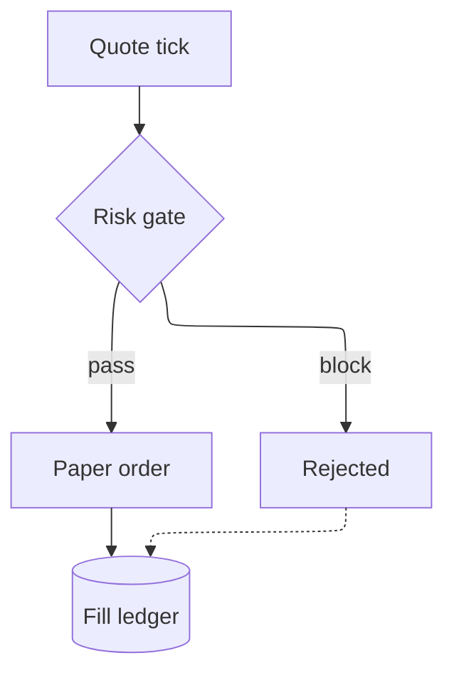
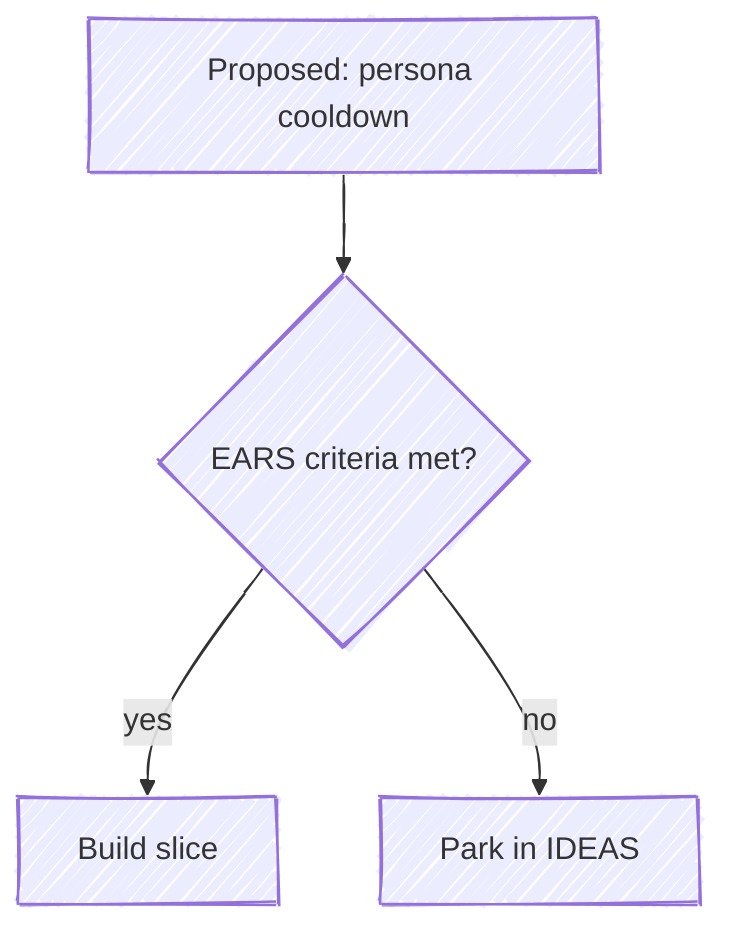
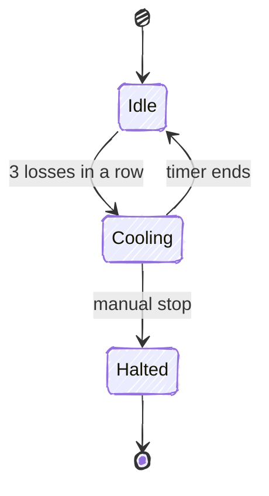
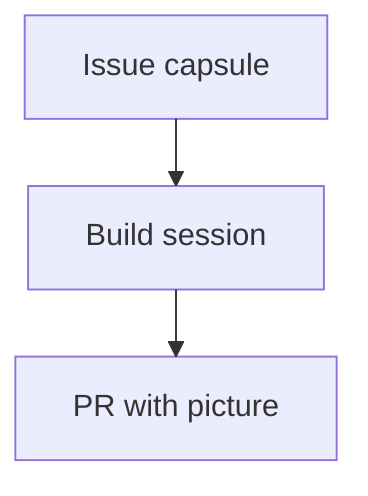
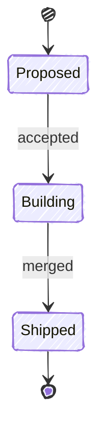
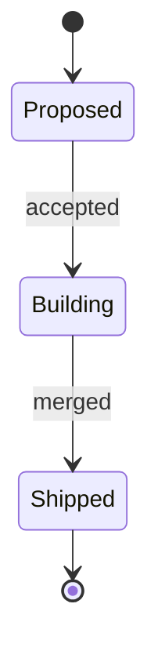
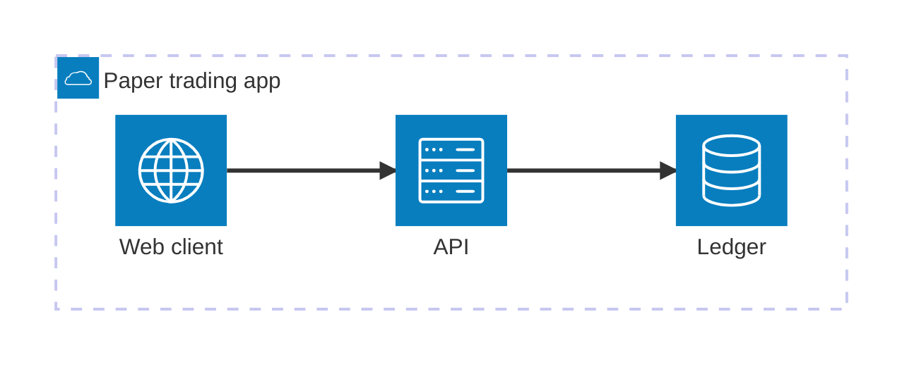
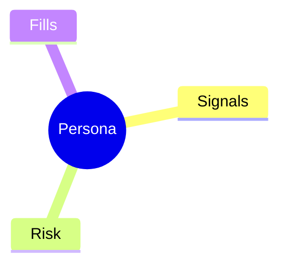
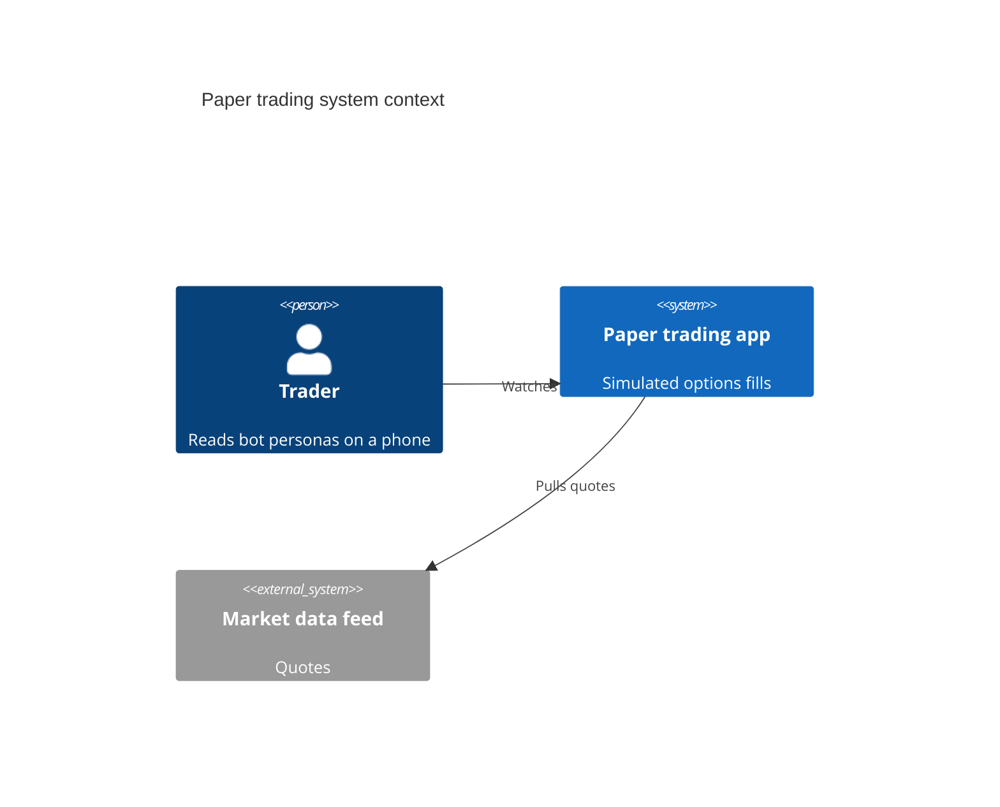

# config/layouts + config/icons: the ELK layout engine, other layouts, the handDrawn look, iconify icon packs, and which diagrams accept icons

The two doc pages are short, and the details that matter are in the config schema, the package READMEs, the per-diagram syntax pages and the renderer code. Mermaid 12.0.0 (npm latest since 2026-09-10) bundles ELK and makes it the default layout for flowchart, state, class, ER, requirement, use-case and agentflow. Mindmap stays on cose-bilkent. The tiny build omits ELK and falls back to dagre. On 11.x, including 11.17.2 (the version github.com renders, per this repo), ELK was a separate `@mermaid-js/layout-elk` package that the host had to register with `mermaid.registerLayoutLoaders`, and the global default layout was `dagre`. When a diagram asks for a layout that isn't registered, what happens depends on the diagram type. Flowchart, class, ER, requirement and swimlane call `getRegisteredLayoutAlgorithm` and silently fall back to dagre, with a console warning. Mindmap falls back to cose-bilkent. On 11.x, stateDiagram-v2 passes `layout` straight to `render()`, which throws "Unknown layout algorithm: elk". The MCP validator (11.13) reproduced that error; on 11.17.2 it is inferred from the bundle code. Other layouts: `dagre`, `cose-bilkent` (full builds only), `tidy-tree` (a separate `@mermaid-js/layout-tidy-tree` package, mainly for mindmap), and the ELK variants `elk.stress`, `elk.force`, `elk.mrtree`, `elk.sporeOverlap`, `elk.box` and `elk.rectpacking`. In 12.x a single container can also pick `elk.layered` or `elk.radial` via `@{ algorithm }`. ELK tuning lives under the `elk:` config block. 12.x adds `preset`, `lineHops`, `straightenEdges`, `layeringStrategy` and `layeringLayerBound`. The `look` key takes `classic | handDrawn | neo`. Its global default is `classic`; 12.x makes `neo` the default for ten diagram types. `handDrawnSeed` defaults to 0, which means random. handDrawn uses rough.js and only reaches diagrams on the shared shape renderer. It rendered on flowchart and state; C4 ignored it; the docs say Wardley and Cynefin don't support it. Icon packs are registered only from JavaScript by the host, with `mermaid.registerIconPacks([{name, loader}] | [{name, icons}])`. The `name` you give overrides the iconify prefix, and a `loader` is only called the first time a diagram uses that pack. An unknown or unregistered icon renders as a '?' on a blue square and does not fail the diagram. Diagrams that take icons: flowchart (the `@{ icon }` shape plus inline `fa:fa-x`), architecture-beta (service/group icons; five built-ins), mindmap (`::icon()` with CSS classes), treeView-beta (`icon()`, `showIcons`, icon maps), and usecase-beta actors (12.x). GitHub authors can't register anything. So on GitHub: `layout: elk` means dagre or an error depending on the type, icon packs render '?', and handDrawn works through frontmatter.

## Mechanisms
| Mechanism | Syntax | Scope | Note |
|---|---|---|---|
| Frontmatter config (per diagram) | `--- config:   layout: elk            # or dagre \| cose-bilkent \| tidy-tree \| elk.stress ...   look: handDrawn        # classic \| handDrawn \| neo   handDrawnSeed: 7   elk:     mergeEdges: false     nodePlacementStrategy: BRANDES_KOEPF --- flowchart TD   A --> B` | That one diagram. Highest priority: it beats initialize(), then the diagram type's default, then the global default. | The `---` must be the very first line. Misspelled keys are ignored silently; malformed YAML breaks the diagram. This is the only mechanism a GitHub author has. layout, look, handDrawnSeed and elk.* are not in the `secure` list, so they are accepted. |
| %%{init}%% directive | `%%{init: {"layout": "elk", "look": "handDrawn", "handDrawnSeed": 3}}%% stateDiagram-v2   ...` | That one diagram, same layer as frontmatter. | Deprecated upstream in favour of frontmatter, and the repo lint notes it. The MCP validator behaved exactly as it does with frontmatter: flowchart + elk passed, state + elk failed. |
| Site config (initialize) | `mermaid.initialize({ layout: 'elk', look: 'handDrawn', handDrawnSeed: 1, elk: { mergeEdges: true, nodePlacementStrategy: 'LINEAR_SEGMENTS' } })` | Every diagram on the page or app (second priority layer). | Only the host can set it. GitHub authors cannot. |
| Per-diagram-type scoping (12.0.0+) | `mermaid.initialize({ look: 'classic', flowchart: { look: 'handDrawn' }, state: { layout: 'dagre' } })   \|   frontmatter: config:\n  flowchart:\n    look: handDrawn` | Only that diagram type. Within a layer, the scoped value beats the global one. | Config keys: agentflow, flowchart, swimlane, class, er, requirement, sequence, state, usecase, venn. The docs disagree on whether `layout` can be scoped (theming.md: yes; agentflow.md: layout is top-level only). Not available on GitHub's 11.17.2; the repo's config-theming card found 11.13 accepts it but silently ignores it. |
| Registering layout loaders | `import elkLayouts from '@mermaid-js/layout-elk'; mermaid.registerLayoutLoaders(elkLayouts); // tiny build (IIFE global): <script src="https://cdn.jsdelivr.net/npm/@mermaid-js/tiny/dist/mermaid.tiny.js"></script> <script type="module">import elkLayouts from 'https://cdn.jsdelivr.net/npm/@mermaid-js/layout-elk/dist/mermaid-layout-elk.esm.min.mjs'; mermaid.registerLayoutLoaders(elkLayouts); mermaid.initialize({ startOnLoad: true, layout: 'elk' });</script> // tidy-tree: import tidyTreeLayouts from '@mermaid-js/layout-tidy-tree'; mermaid.registerLayoutLoaders(tidyTreeLayouts);` | Runtime-global registry on the host page. Each loader is {name, loader: () => Promise<LayoutAlgorithm>, algorithm?}. | 11.x needs this for ELK (built in: dagre, swimlane, and cose-bilkent in full builds). On 12.x it is needed only for the tiny build; on a normal build, registering it is harmless but loads a second copy. layout-elk latest is 1.0.0; layout-tidy-tree latest is 1.0.1. |
| Per-container ELK algorithm (12.x) | `agentflow-beta TB   flow tools["Tools"]     a["a"]@{ shape: tool }   end   tools@{ algorithm: "elk.rectpacking" }` | One container (subgraph or flow) inside an ELK-laid-out diagram. | Documented in agentflow.md and the layout-elk README (it also accepts elk.layered and elk.radial). Whether flowchart subgraphs honour it is undocumented (verify). Not on GitHub 11.17.2. |
| Legacy ELK selectors | `flowchart-elk TD   A --> B --- config:   flowchart:     defaultRenderer: "elk" ---` | One diagram. | `flowchart-elk` still parses in 12.x but is unnecessary. `defaultRenderer` (flowchart/class/state; enum dagre-d3 | dagre-wrapper | elk, default dagre-wrapper on 11.17.2) was removed in v12; its `elk` value only ever set `layout: elk`. |
| Registering iconify icon packs | `// CDN JSON, lazy mermaid.registerIconPacks([{ name: 'logos', loader: () => fetch('https://unpkg.com/@iconify-json/logos@1/icons.json').then((res) => res.json()) }]); // bundler, lazy (npm install @iconify-json/logos@1) mermaid.registerIconPacks([{ name: 'logos', loader: () => import('@iconify-json/logos').then((module) => module.icons) }]); // bundler, eager import { icons } from '@iconify-json/logos'; mermaid.registerIconPacks([{ name: icons.prefix, icons }]);` | Runtime-global icon store on the host page. Diagrams reference icons as `name:icon-id`. | `name` is required and overrides the pack's prefix, which allows short aliases. A loader runs only the first time a diagram uses that pack. Throws if `name` is empty or if neither `loader` nor `icons` is given. Packs can be browsed at icones.js.org. |
| Font Awesome via CSS (fallback for inline fa: and mindmap icons) | `<link href="https://cdnjs.cloudflare.com/ajax/libs/font-awesome/6.5.1/css/all.min.css" rel="stylesheet" />` | Host page. | When an inline `fa:fa-x` token has no registered FA pack, Mermaid emits `<i class='fa fa-x'>`, which needs this CSS. Custom `fak:` icons need a paid Font Awesome kit. |
| Icon syntax per diagram | `flowchart: A@{ icon: "fa:user", form: "square", label: "User", pos: "t", h: 60 }   \|   B["fa:fa-twitter for peace"] architecture-beta: service db(database)[Ledger]   \|   service s3(logos:aws-s3)[Bucket]   \|   group g(cloud)[App] mindmap: ::icon(fa fa-book)   \|   ::icon(mdi mdi-skull-outline) treeView-beta: App.tsx icon(logos:react)   + config treeView.showIcons / defaultIconPack / filenameIcons / extensionIcons usecase-beta (12.x): actor Icon("Registered icon")@{ icon: "fa:user" }` | Per node. | The flowchart icon shape is v11.3.0+; FA packs for inline tokens are v11.7.0+. Architecture has 5 built-ins (cloud, database, disk, internet, server). The timeline docs call their 'icon integration' experimental but document no syntax. In agentflow, `icon` is presentation-only metadata. |
| mermaid-cli icon packs | `mmdc -i in.mmd -o out.svg --iconPacks @iconify-json/logos mmdc ... --iconPacksAndUrls logos#https://cdn.jsdelivr.net/npm/@iconify-json/logos@1.2.14/icons.json` | One CLI render. | mermaid-cli 12.0.0 (2026-09-24) runs Mermaid 12, so ELK is bundled. It registers tidy-tree when the optional dependency is installed, and registers the listed icon packs lazily. |

## Keys
| Key | Meaning | Default |
|---|---|---|
| `layout` | Which layout algorithm places nodes and edges. Values: elk, elk.stress, elk.force, elk.mrtree, elk.sporeOverlap, elk.box, elk.rectpacking, dagre, cose-bilkent, tidy-tree (needs its package), swimlane (internal). | 12.x: 'elk' (tiny build: dagre). 11.17.2: 'dagre'. swimlane-beta defaults to 'swimlane'. |
| `look` | Rendering style: classic | handDrawn (rough.js sketch) | neo (flatter, rounded, soft shadows; 11.14+). | 'classic' globally. 12.0+: 'neo' for agentflow, flowchart, swimlane, class, er, requirement, sequence, state, usecase, venn. |
| `handDrawnSeed` | Seed for the handDrawn look, so the wobble is reproducible (important for visual tests and stable diffs). | 0 (random seed) |
| `elk.mergeEdges` | Lets edges share a path where convenient. Can look pretty but makes the diagram harder to read. | false |
| `elk.nodePlacementStrategy` | How nodes are placed: SIMPLE | NETWORK_SIMPLEX | LINEAR_SEGMENTS | BRANDES_KOEPF. | 11.17.2: BRANDES_KOEPF. 12.x: taken from elk.preset unless set. |
| `elk.nodePlacementAlignment` | Brandes-Koepf alignment: NONE | LEFTUP | LEFTDOWN | RIGHTUP | RIGHTDOWN | BALANCED. BALANCED combines the four directional alignments; NONE picks the smallest result. | 11.17.2: NONE. 12.x: BALANCED for the default preset, NONE for the legacy, modelOrder and depthFirst presets. |
| `elk.preset (12.x)` | Named bundle of layering, placement, alignment and cycle-breaking settings: default | legacy (pre-preset rendering) | modelOrder (favours declaration order) | depthFirst (the previous default). Setting an individual option explicitly overrides the preset for that option only. | 'default' (network-simplex layering, balanced Brandes-Koepf placement, depth-first cycle breaking) |
| `elk.straightenEdges (12.x)` | Removes the tiny staircase step where an edge meets a node, so the edge draws straight. Real turns are never collapsed. | true |
| `elk.lineHops (12.x)` | Draws edge crossings as arcs or gaps so you can see which line passes over which: true | false | 'arc' | 'gap'. Curved edges are skipped. | true |
| `elk.layeringStrategy (12.x)` | Which layer (row or column) each node lands in: NETWORK_SIMPLEX | LONGEST_PATH | LONGEST_PATH_SOURCE | COFFMAN_GRAHAM | MIN_WIDTH | STRETCH_WIDTH | INTERACTIVE. COFFMAN_GRAHAM and MIN_WIDTH give narrower drawings. | taken from elk.preset |
| `elk.layeringLayerBound (12.x)` | Maximum nodes per layer under COFFMAN_GRAHAM (ignored otherwise). Lower values give taller, narrower drawings, which suits a 390px screen. | 4 |
| `elk.cycleBreakingStrategy` | How cycles are found and broken: GREEDY | DEPTH_FIRST | INTERACTIVE | MODEL_ORDER | GREEDY_MODEL_ORDER. | 11.17.2: GREEDY_MODEL_ORDER. 12.x: taken from elk.preset. |
| `elk.forceNodeModelOrder` | Keeps the source's node order during crossing minimisation. Assumes considerModelOrder is NODES_AND_EDGES. | false |
| `elk.considerModelOrder` | Keeps source node/edge order when that adds no crossings: NONE | NODES_AND_EDGES | PREFER_EDGES | PREFER_NODES. | NODES_AND_EDGES |
| `elk.keepEntryNodeOnTop` | Pins the entry node of a cyclic flow that has no natural source to the first layer, so the diagram still reads from its entry. Cycles crossing a subgraph boundary are not detected. | false |
| `mindmap.layoutAlgorithm` | Mindmap's own layout. An unregistered `layout` value falls back to this. | 'cose-bilkent' |
| `flowchart/state/class.defaultRenderer (11.x only)` | Legacy renderer selector: dagre-d3 | dagre-wrapper | elk. The `elk` value just sets layout: elk. | 'dagre-wrapper'. Removed in v12. |
| `<diagramKey>.look / .theme / .layout (12.0+)` | Per-type override, e.g. flowchart.look: handDrawn. | that type's default |
| `registerIconPacks entry {name, loader | icons}` | name: required non-empty alias (overrides the iconify prefix). loader: async () => IconifyJSON (lazy). icons: IconifyJSON (eager). | no packs registered; an unresolved icon renders as '?' |
| `flowchart icon shape: icon / form / label / pos / h` | icon = pack:name from a registered pack. form = square | circle | rounded (omit for no background). label = text. pos = t | b. h = icon height. | form: none, label: none, pos: b, h: 48 (also the minimum) |
| `architecture.iconSize` | Service icon size. Label wrap width is iconSize*1.5; ideal edge length is iconSize*idealEdgeLengthMultiplier. Architecture uses fcose, not `layout`. | 80 |
| `treeView.showIcons / defaultIconPack / filenameIcons / extensionIcons` | Show built-in file/folder icons; the pack used for unprefixed names; exact-filename map; extension map (keys lowercase, dot optional). 'none' hides the icon. An explicit icon() always renders. | false / '' / {} / {} |

## Theme variables
- Neither page defines theme variables. The only overlap: under `look: neo`, node strokes are drawn with a gradient when the theme sets `useGradient` (the base theme does by default). Setting a custom `nodeBorder` on base turns the gradient off unless `useGradient: true` is also set (12.x docs; 11.17.2's render.ts already reads useGradient, gradientStart and gradientStop).
- Built-in architecture icons have hard-coded colours (#087ebf fill, white glyph) that no theme variable changes. The unknown-icon '?' uses the same #087ebf square.
- handDrawn keeps the active theme's node colours (in the MCP render the rough paths still carried the default #ECECFF fill).
- For base vs derived variables and per-diagram variables, see the config-theming card; this topic adds none.

## For a colourblind reader
What this topic gives a reader who can't rely on hue:
(1) `look: handDrawn` is a non-hue channel: the whole diagram changes texture. The repo already uses it to mean 'proposed, not built', and a red/green-colourblind reader sees it. It applies to the whole diagram, not one node, so it can't mark a single delta.
(2) ELK `lineHops` (12.x) draws crossings as arcs or gaps, which makes crossing edges readable without colour. `considerModelOrder`, `forceNodeModelOrder` and `keepEntryNodeOnTop` keep reading order predictable. `layeringStrategy: COFFMAN_GRAHAM` with a low `layeringLayerBound` gives narrower pictures for 390px. All of these are 12.x or need ELK, so none reach GitHub 11.17.2, where layout is dagre (or an error on stateDiagram).
(3) Icons add a glyph channel: architecture's five built-ins differ by shape, not colour. On GitHub only those five draw; every pack icon is the same blue '?' and carries no meaning.
What this topic does NOT solve: layout and look change no colours and no contrast. handDrawn wobble and hachure-like strokes can make labels harder to read at phone width (check a render). Icon glyphs at the default flowchart height of 48px may be too small on a phone. Contrast-safe colour pairing, stroke-width emphasis (`classDef changed stroke-width:3px`) and dotted/thick edges belong to the theming and syntax cards. Keep using the repo's delta grammar and treat look/layout as a supplement to it.

## On GitHub
The docs never mention GitHub on layouts.md or icons.md. What the surrounding docs say:
- The layout-elk README carries a TODO: "Add images for these layouts, as GitHub doesn't support natively".
- The tidy-tree README says the layout "will not be available in all providers that support mermaid by default", because sites must install the package.
- The 11.17.2 ER and flowchart pages say ELK needs the site to enable it.

The repo says github.com renders Mermaid 11.17.2 (docs/PICTURES.md, scripts/mermaid-lint.mjs, read 2026-09-25), so:
(a) ELK: not bundled in 11.x, and GitHub is not known to register layout-elk. flowchart, classDiagram, erDiagram, requirementDiagram and swimlane fall back to dagre silently with a console warning. stateDiagram-v2 has no fallback in the 11.x code and throws 'Unknown layout algorithm: elk'. The MCP (11.13) reproduced this; on 11.17.2 it is inferred from the bundle's stateDiagram draw(); verify on GitHub. The repo lint only NOTES `layout: elk` as 'falls back to dagre', which is wrong for state diagrams. Mindmap with elk or tidy-tree falls back to cose-bilkent. C4 and architecture ignore `layout` entirely.
(b) handDrawn: frontmatter `look: handDrawn` plus `handDrawnSeed` works (repo-verified; look is not a secure key). Directives presumably work too, but they are deprecated.
(c) Icons: GitHub never calls registerIconPacks, so the `@{ icon }` shape, architecture `(pack:name)`, treeView `icon(pack:name)` and usecase icons all render the '?' square. Inline `fa:fa-x` falls back to an empty `<i class='fa fa-x'>`, so it renders blank rather than '?' because there's no FA CSS (verify on GitHub). Mindmap `::icon()` also depends on host CSS, so presumably blank (verify).
(d) Not available on 11.17.2: ELK-by-default, `elk.preset`, `lineHops`, `straightenEdges`, `layeringStrategy`, per-container `@{ algorithm }`, per-type look/layout scoping, usecase-beta. When GitHub moves to 12.x, unconfigured flowchart, state, class, ER and requirement diagrams will re-flow under ELK and restyle as neo/redux-color. Pin `layout: dagre` (valid in both 11 and 12) only on pictures whose meaning depends on position (verify at bump time).
(e) Math is not in scope for this card.

## Validation tooling
- **Mermaid Chart MCP validate_and_render_mermaid_diagram** — Send diagramCode; read `valid` and `validationError`, then grep rawSVG for `rough-node` (handDrawn applied), the `?` tspan on #087ebf (unregistered icon), `<i class="fa ...">` (inline FA fallback), and `<title>`/`<desc>` (accTitle/accDescr). — Runs Mermaid 11.13.0 server-side (repo `info` probe). ELK is not registered: flowchart + elk returns valid (dagre fallback, not labelled as such); stateDiagram + elk returns INVALID 'Unknown layout algorithm: elk'. It can't show GitHub 11.17.2 or 12.x behaviour, can't prove ELK actually laid out a diagram, and can't register icon packs. Unknown icons come back valid=true.
- **Repo scripts/mermaid-lint.mjs (mermaid.parse, pinned 11.17.2, jsdom)** — node scripts/mermaid-lint.mjs --stdin --json < body; also runs inside ship.sh checkbody, issue-lint and the CI corpus spec. — Parse only: it never runs a layout, so it passes stateDiagram + elk, which fails at render. It flags icon-pack prefixes (regex fa|fab|fas|far|logos|mdi|...; misses fak:, fal:, fad:, and reports only the first match per diagram). It notes elk and tidy-tree as 'falls back to dagre', which is inaccurate for state (error) and mindmap (cose-bilkent).
- **@mermaid-js/mermaid-cli (mmdc) 12.0.0** — mmdc -i in.mmd -o out.svg [--iconPacks @iconify-json/logos | --iconPacksAndUrls name#url] (needs a browser) — Headless Chromium through puppeteer. Renders Mermaid 12, so ELK is bundled and tidy-tree registers if its optional dependency is installed. It does NOT reproduce GitHub 11.17.2 layout or icon behaviour unless an 11.x mmdc is pinned.
- **Playwright MCP (this session)** — Tried loading mermaid 11.17.2 in a page to render state + elk. (needs a browser) — Blocked: file:// navigation is refused and cdn.jsdelivr.net fails TLS (the proxy CA isn't trusted by the browser). So no 11.17.2 render was possible here.

## Gotchas
- Version skew decides everything. The develop docs describe 12.0.0 (ELK default, presets, lineHops, neo defaults). GitHub renders 11.17.2 (dagre default, ELK unregistered). The MCP validator runs 11.13.0. The same source lays out and looks different in all three.
- On 11.x an unregistered `layout: elk` is not always a silent fallback. stateDiagram-v2 throws 'Unknown layout algorithm: elk': reproduced on MCP 11.13 with both frontmatter and directive, and 11.17.2's state draw() has no fallback either. flowchart, class, ER, requirement and swimlane fall back to dagre with only a console warning; mindmap falls back to cose-bilkent. Never put `layout: elk` on a GitHub state diagram.
- The repo lint (parse-only) accepts stateDiagram + elk and describes it as a dagre fallback, which is a false green. It also describes mindmap tidy-tree as a dagre fallback when it is actually cose-bilkent.
- The develop docs contradict themselves. layouts.md, usage.md, the schema and syntax-reference say ELK is bundled and default. theming.md → 'Per-diagram defaults' still says the global default is dagre and ELK is a separate package. agentflow.md says `layout` is top-level only, while theming.md says layout can be scoped per type.
- The 11.17.2 syntax-reference claims layout and look work only for flowcharts and state diagrams. In the bundle, class, ER, requirement, mindmap and swimlane also use the layout registry, and ER's own 11.17.2 page shows `layout: elk`.
- The syntax-reference example says 'hand drawn look and forest theme' while its code sets `theme: dark`, so trust the code.
- handDrawn only reaches diagrams drawn by the shared rough.js shape renderer. Verified: flowchart and state (rough-node present). Validated: C4 renders valid but ignores both handDrawn and elk (plain rects). Docs: Wardley and Cynefin are unsupported. The 11.17.2 bundle also wires rough.js into class, ER, requirement, mindmap, kanban, swimlane, block, venn and ishikawa (code-inferred). Sequence and architecture are not wired on 11.17.2 (verify).
- handDrawnSeed 0 is random, so every render wobbles differently and diffs churn. Set a fixed seed for stable pictures.
- An unregistered or unknown icon never fails the diagram. It renders an 80x80 '?' on a #087ebf square, and validators report valid=true. So a validator's 'valid' says nothing about whether the icon showed.
- Inline `fa:fa-x` with no registered FA pack becomes `<i class='fa fa-x'>`, which is blank without FA CSS, not '?'. The docs list prefixes fa, fab, fas, far, fal and fad, but the 11.17.2 code regex is `fa[bklrs]?`, so `fad:` is not substituted (code-inferred).
- Mindmap `::icon(fa fa-book)` uses CSS class names, not iconify pack:name. Mindmap icons are the 'experimental' part of that diagram.
- The icon pack `name` overrides the iconify prefix. Diagrams must use the registered alias (e.g. name:'logos' → `logos:aws-s3`). The loader runs only the first time a diagram uses the pack, and a failed loader is logged and rendered as '?'.
- tidy-tree is a separate package even in 12.x and is 'primarily supported for mindmap'. cose-bilkent ships only in full builds.
- In 12.x, the tiny build omits ELK, mindmap and architecture. Asking for ELK there silently gives dagre unless @mermaid-js/layout-elk is registered.
- `defaultRenderer` is removed in v12 and `flowchart-elk` is legacy; use `layout`.
- ELK node placement is not hand placement. Declaration order matters (considerModelOrder: NODES_AND_EDGES). In 12.x the default preset changed alignment to BALANCED; use `preset: depthFirst` to get the 11-era layout back.

## Examples (The Mermaid Chart MCP tool was available; it renders with Mermaid 11.13.0. All ten sources were also parsed with the repo lint pinned to 11.17.2 (node scripts/mermaid-lint.mjs --stdin): every diagram parsed ok=true.
(1) ELK flowchart with an elk: block (frontmatter): PASSED, valid=true. Layout silently fell back to dagre on 11.13; ELK use was not provable. Lint note: 'layout elk … falls back to dagre'.
(2) handDrawn flowchart, seed 7: PASSED; 4 nodes carry class rough-node.
(3) handDrawn stateDiagram-v2 with accTitle/accDescr, seed 42: PASSED; 3 rough-node states, plus <title>, <desc>, aria-labelledby and aria-describedby emitted. This is the recommended GitHub-safe example.
(4) %%{init}%% layout elk on a flowchart: PASSED (dagre fallback).
(5) %%{init}%% elk + handDrawn on stateDiagram-v2: FAILED, 'Mermaid rendering failed: Unknown layout algorithm: elk'.
(6) Frontmatter layout: elk on stateDiagram-v2: FAILED with the same error, so the failure comes from state + elk, not from directive vs frontmatter.
(7) Flowchart icon shape fa:user plus inline fa:fa-robot: PASSED valid=true, but the SVG shows the '?' #087ebf square for the icon shape and an empty <i class="fa fa-robot"> for the inline token. The repo lint raises a problem: icon pack fa:user renders '?' on GitHub.
(8) architecture-beta with built-in cloud/internet/server/database icons: PASSED, all glyphs drawn.
(9) mindmap with layout: tidy-tree: PASSED (unregistered; mindmap falls back to cose-bilkent per the 11.17.2 code). Lint note says 'dagre', which is inaccurate.
(10) C4Context with look: handDrawn + layout: elk: PASSED valid=true, but both were ignored (plain rects, no rough paths).
Not validated: any render under 11.17.2 or 12.x. The Playwright browser refused file:// and the jsDelivr TLS certificate, so the 11.17.2 state + elk failure is inferred from code, not rendered.)












```text
flowchart LR
    u@{ icon: "fa:user", form: "square", label: "Trader", pos: "t", h: 60 }
    b["fa:fa-robot bot persona"]
    u --> b
```
_(not for GitHub surfaces — uses an icon pack (fa:user); shown for recognition)_







## Sources
- https://raw.githubusercontent.com/mermaid-js/mermaid/develop/packages/mermaid/src/docs/config/layouts.md
- https://raw.githubusercontent.com/mermaid-js/mermaid/develop/packages/mermaid/src/docs/config/icons.md
- https://raw.githubusercontent.com/mermaid-js/mermaid/mermaid%4011.17.2/packages/mermaid/src/docs/config/layouts.md
- https://raw.githubusercontent.com/mermaid-js/mermaid/mermaid%4011.17.2/packages/mermaid/src/docs/config/icons.md
- https://raw.githubusercontent.com/mermaid-js/mermaid/develop/packages/mermaid/src/docs/config/usage.md (ELK and the tiny build; Tiny Mermaid)
- https://raw.githubusercontent.com/mermaid-js/mermaid/develop/packages/mermaid/src/docs/config/tidy-tree.md
- https://raw.githubusercontent.com/mermaid-js/mermaid/develop/packages/mermaid/src/docs/config/theming.md (Per-diagram defaults)
- https://raw.githubusercontent.com/mermaid-js/mermaid/develop/packages/mermaid/src/schemas/config.schema.yaml
- https://raw.githubusercontent.com/mermaid-js/mermaid/mermaid%4011.17.2/packages/mermaid/src/schemas/config.schema.yaml
- https://raw.githubusercontent.com/mermaid-js/mermaid/develop/packages/mermaid/src/docs/intro/syntax-reference.md and the mermaid@11.17.2 copy (Layout and look; Customizing ELK Layout)
- https://raw.githubusercontent.com/mermaid-js/mermaid/develop/packages/mermaid-layout-elk/README.md
- https://raw.githubusercontent.com/mermaid-js/mermaid/develop/packages/mermaid-layout-tidy-tree/README.md
- https://raw.githubusercontent.com/mermaid-js/mermaid/develop/packages/mermaid/src/rendering-util/icons.ts
- https://raw.githubusercontent.com/mermaid-js/mermaid/mermaid%4011.17.2/packages/mermaid/src/rendering-util/render.ts
- https://raw.githubusercontent.com/mermaid-js/mermaid/develop/packages/mermaid/src/docs/syntax/flowchart.md (Icon Shape, fontawesome, Renderer) and the mermaid@11.17.2 copy
- https://raw.githubusercontent.com/mermaid-js/mermaid/develop/packages/mermaid/src/docs/syntax/mindmap.md, treeView.md, usecase.md, agentflow.md, stateDiagram.md, timeline.md
- https://raw.githubusercontent.com/mermaid-js/mermaid/mermaid%4011.17.2/packages/mermaid/src/docs/syntax/entityRelationshipDiagram.md, wardley.md, cynefin.md
- https://raw.githubusercontent.com/mermaid-js/mermaid-cli/master/README.md and src/index.js
- https://registry.npmjs.org/mermaid, /@mermaid-js/layout-elk, /@mermaid-js/layout-tidy-tree, /@mermaid-js/mermaid-cli (dist-tags and release dates)
- /home/user/skynet-capital/node_modules/mermaid/dist/config.type.d.ts and dist/chunks/mermaid.core/*.mjs (11.17.2 bundle: layout fallback per diagram, rough.js and icon wiring, replaceIconSubstring)
- /home/user/skynet-capital/.claude/skills/mermaid/SKILL.md, /home/user/skynet-capital/docs/PICTURES.md, /home/user/skynet-capital/scripts/mermaid-lint.mjs, /home/user/skynet-capital/.claude/skills/mermaid/reference/config-theming.md (repo GitHub facts: 11.17.2)
