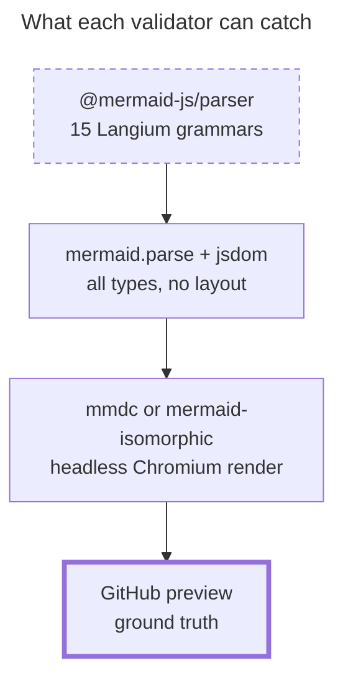
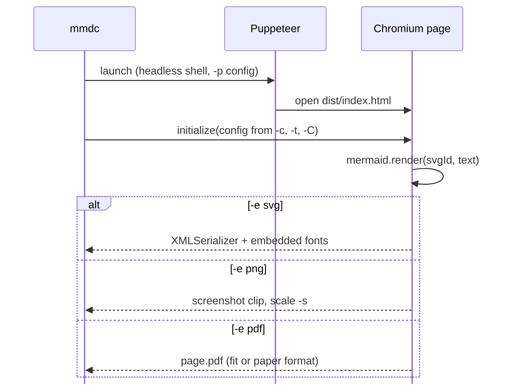
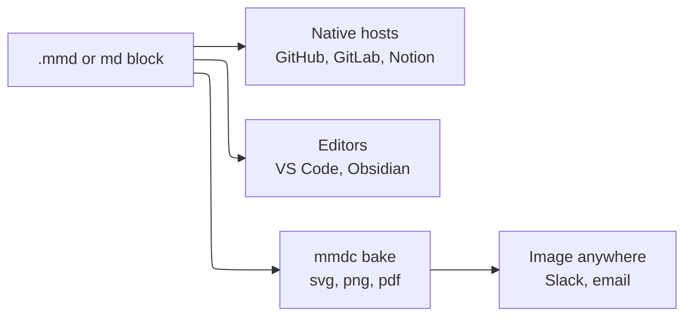
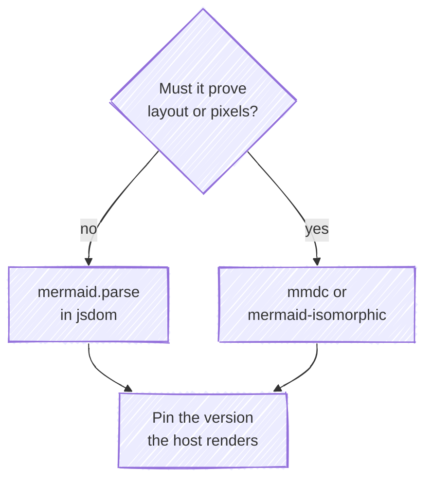
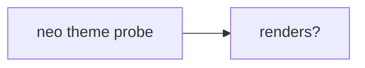
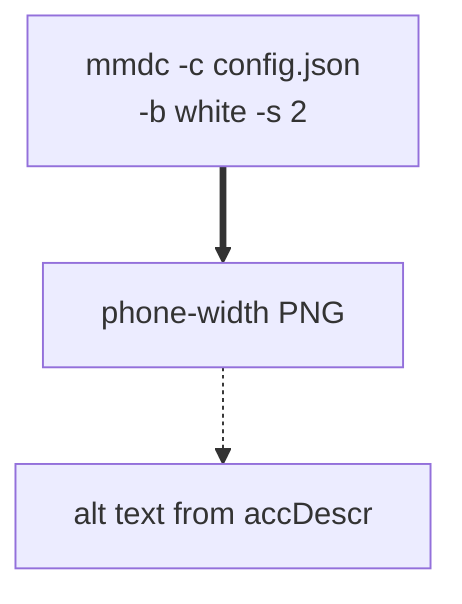

# config/mermaidCLI + ecosystem (mmdc, native-render integrations, headless validators/renderers on npm, 2026-09)

The mermaid docs page config/mermaidCLI.md is now a one-line stub ("mermaid CLI has been moved to mermaid-cli. Please read its documentation instead."). The real documentation is the mermaid-js/mermaid-cli README plus `mmdc -h` (src/index.js). mmdc reads one .mmd file, stdin (`-`), or a Markdown file (every ```mermaid and :::mermaid block). It writes svg, png or pdf, or a rewritten .md file that points at generated SVGs. To do this it launches headless Chromium through Puppeteer (default launch {headless:"shell"}), loads mermaid into a page, calls mermaid.initialize({startOnLoad:false, ...config}) and then mermaid.render. It also bundles ZenUML, FontAwesome, KaTeX CSS and fonts, and uses tidy-tree if it is installed.

Two release lines matter as of 2026-09-25. mmdc 12.0.0 (published 2026-09-24) pins mermaid ^12.0.0 and needs Node 22.13+ and peer puppeteer ^25. Mermaid 12 makes ELK the default layout, redux-color the default theme and neo the default look for ten diagram types, and adds usecase-beta and agentflow-beta. mmdc 11.17.0 uses mermaid ^11.14.0 (resolves to 11.17.2), Node 18.19+, and has different flags: -w/-H/-f, and -t accepts only default/forest/dark/neutral.

github.com renders mermaid 11.17.2, per this repo's scripts/mermaid-lint.mjs, which read it from GitHub's production bundle on 2026-09-25. The Mermaid Chart MCP validator renders 11.13.0 (the `info` probe returned v11.13.0). The repo pins 11.17.2. So at least three mermaid versions are in play, and any validator counts only if it is pinned to the version the host renders.

In the integrations page, a checkmark means native support. Natively supported: GitHub, GitLab, Gitea, Forgejo, Azure DevOps, Notion, Obsidian, HackMD, Joplin, Outline, Slab, Swimm, Observable, Microsoft Loop, Docusaurus, Quarto, Typora, Docsy, Slidev, LiveBook, Tuleap, and others. These need a plugin, extension or marketplace app: Confluence/Jira, VS Code, JetBrains, GitBook, Slack, MkDocs, Redmine, Hexo, WordPress, Discourse, Mattermost and the like.

Headless options fall into three tiers:
1. Grammar-only, no browser: @mermaid-js/parser (15 Langium grammars only), mermaid-parser-bundle (all 34 types).
2. Parse with a DOM shim, no browser: mermaid.parse plus jsdom (what this repo does), and the @mermaid-lint/* and mermaid-validator family.
3. Full render: mmdc/Puppeteer, mermaid-isomorphic/Playwright, the Mermaid Chart MCP (remote).

beautiful-mermaid and grok-mermaid are fast DOM-free renderers with their own parsers. They cover 6 and 5 diagram types, and grok-mermaid is deliberately lenient. Neither is a validator of Mermaid grammar.

## Mechanisms
| Mechanism | Syntax | Scope | Note |
|---|---|---|---|
| mmdc single-file render | `mmdc -i input.mmd -o output.svg   \|   mmdc -i input.mmd -o output.png -t dark -b transparent   \|   mmdc -i in.mmd -e png -s 2 -o out.png` | One diagram file to one svg/png/pdf. The format comes from the output extension unless -e is given. | The default output is <input>.svg (or <input>.<-e>). With stdin input and no -o, the output is out.svg. The output directory must already exist or mmdc errors. |
| mmdc Markdown transform | `mmdc -i readme.template.md -o readme.md [-a ./artefacts]` | Every ```mermaid ... ``` or :::mermaid ... ::: block in a .md/.markdown file. Each becomes <out>-N.svg and the block is replaced with an image reference. | Output is ``. When the diagram has accTitle/accDescr it is ``, so accDescr becomes the alt text. -a sets the artefacts dir (Markdown input only; created if missing; default is the output dir). |
| stdin / stdout piping | `cat << EOF \| mmdc --input -     graph TD     A[Client] --> B[Load Balancer] EOF # stdout: mmdc -i in.mmd -o - -e png > out.png` | One diagram per invocation | `-i -` reads stdin and suppresses the missing-input warning. Omitting -i also reads stdin but warns. `-o -` writes to stdout, forces --quiet, and defaults to svg with a warning unless -e is given. |
| npx / local install | `npx -p @mermaid-js/mermaid-cli mmdc -h   \|   npm install @mermaid-js/mermaid-cli && ./node_modules/.bin/mmdc -h` | Per project | npx needs -p because the package name differs from the binary (mmdc). Brew install is deprecated and unsupported. |
| Docker / Podman | `docker run --rm -u `id -u`:`id -g` -v /path/to/diagrams:/data minlag/mermaid-cli -i diagram.mmd podman run --userns keep-id --user ${UID} --rm -v /path/to/diagrams:/data:z ghcr.io/mermaid-js/mermaid-cli/mermaid-cli -i diagram.mmd` | Container. Images: minlag/mermaid-cli[:version] and ghcr.io/mermaid-js/mermaid-cli/mermaid-cli | The workdir is /data. Older images used /home/mermaidcli; restore that with --workdir=/home/mermaidcli. Without -u the output write fails with EACCES. |
| Node.js API | `import { run } from "@mermaid-js/mermaid-cli"; await run("input.mmd", "output.svg", { puppeteerConfig, quiet, outputFormat, browser, limiter, artefacts, parseMMDOptions: { mermaidConfig, backgroundColor, customFontCSS, fontEmbed, pdfPaperFormat, size, viewport, svgId, iconPacks } });` | Programmatic. renderMermaid(browser, definition, format, opts) returns {title, desc, data}. | The README says it is NOT covered by semver because it follows mermaid's versioning. Passing `browser` reuses one Chromium, which may leak cookies/cache between runs. |
| Config layering in mmdc | `mmdc -t neutral -c mermaid.json -C theme.css -i d.mmd   # mermaid.json e.g. {"theme":"base","themeVariables":{"primaryColor":"#ffffff","lineColor":"#000000","fontSize":"18px"},"flowchart":{"useMaxWidth":true}}` | Site-level config, i.e. the object passed to mermaid.initialize for every diagram in the run | Order of application (code): {theme from -t}, then Object.assign with the -c JSON (so a theme in the file beats -t), then -C CSS written into themeCSS (v12; warns if the config already has themeCSS). Frontmatter `config:` or %%{init}%% directives inside each diagram then apply per diagram, except for secure keys. |
| Puppeteer launch config | `mmdc -p puppeteer-config.json ...   # {"args":["--no-sandbox"]}  or  {"executablePath":"/usr/bin/chromium","timeout":60000}` | Browser launch for the whole run. Merged over the default {headless:"shell"}. | Options go to puppeteer.launch. Documented keys: args, executablePath, product (firefox), timeout. Set env PUPPETEER_SKIP_DOWNLOAD=1 at install to skip the Chromium download. |
| Icon packs in mmdc | `mmdc --iconPacks @iconify-json/logos -i d.mmd mmdc --iconPacksNamesAndUrls logos#https://cdn.jsdelivr.net/npm/@iconify-json/logos@1.2.14/icons.json -i d.mmd mmdc --iconPacksNamesAndUrls azure#file:///tmp/icons.json -i d.mmd` | Registered through mermaid.registerIconPacks for the run | In v12, --iconPacks resolves a locally npm-installed Iconify package (<pkg>/icons.json, prefix read from the JSON). In v11 it downloaded from unpkg. The README spells the URL flag `--iconPacksAndUrls`, but the real flag is `--iconPacksNamesAndUrls`. |
| Native host render (fenced block) | ````mermaid flowchart TB   A --> B ```` | GitHub: Issues, Discussions, PRs, wikis, Markdown files. Also every host marked with a checkmark on the integrations page. | Each host ships its own mermaid version and site config. GitHub's docs say to check the version with a block containing just `info`. |
| Headless parse in Node (DOM shim) | `const { JSDOM } = await import('jsdom'); const dom = new JSDOM('<!doctype html><html><body></body></html>'); globalThis.window = dom.window; globalThis.document = dom.window.document; globalThis.DOMParser = dom.window.DOMParser; const mermaid = (await import('mermaid')).default; await mermaid.parse(src);                          // throws on error await mermaid.parse(src, { suppressErrors: true }); // returns false instead` | One diagram string, validated by the exact mermaid version installed | The docs call this 'Syntax validation without rendering'. It returns {diagramType} and calls mermaid.parseError unless suppressErrors is set. This is how scripts/mermaid-lint.mjs works, pinned to 11.17.2. |
| @mermaid-js/parser direct | `import { parse } from '@mermaid-js/parser'; const ast = await parse('pie', 'pie\n "a": 1');  // throws MermaidParseError {result:{parserErrors, lexerErrors}}` | Only these diagram types: info, packet, pie, treeView, architecture, gitGraph, eventmodeling, radar, railroad, railroadEbnf, railroadAbnf, railroadPeg, treemap, wardley, cynefin | You must name the diagram type up front. Grammar and AST only. |
| mermaid-isomorphic renderer | `import { createMermaidRenderer } from 'mermaid-isomorphic'; const render = createMermaidRenderer({ browserType, launchOptions }); const [r] = await render([src], { mermaidOptions, css, screenshot: true, prefix, containerStyle, iconPacks });  // PromiseSettledResult<{svg,width,height,title,description,id,screenshot}>` | Batch render in Node through Playwright Chromium | Needs `npm install playwright` and `npx playwright install --with-deps chromium`. The default fontFamily is arial,sans-serif. Lazy-loaded icon packs are not supported. |
| Mermaid Chart MCP validate+render | `mcp__Mermaid_Chart__validate_and_render_mermaid_diagram({ diagramCode, title })  ->  { valid, validationError?, diagramType, rawSVG, renderedSVG, renderedPNG, liveEditUrl }` | Remote full render, no local browser | It ran mermaid v11.13.0 on 2026-09-25 (`info` probe). Responses are 50–270k characters and get spilled to a file, so read them with jq. |

## Keys
| Key | Meaning | Default |
|---|---|---|
| `-t, --theme <theme>` | Mermaid theme for the run; overridden by a theme inside -c, and by diagram frontmatter/directives. v12 choices: base, dark, default, forest, neutral, neo, neo-dark, redux, redux-dark, redux-color, redux-dark-color, null. v11.x choices: default, forest, dark, neutral (no base; set base via -c). | v12: undefined, i.e. mermaid's default, which depends on diagram type (redux-color for 10 types in mermaid 12). v11: "default" |
| `-i, --input <input>` | .mmd file; .md/.markdown extracts every ```mermaid and :::mermaid block; `-` reads stdin | none (reads stdin with a warning) |
| `-o, --output <output>` | Output path ending .svg/.png/.pdf/.md/.markdown, or `-` for stdout (forces quiet) | <input>.svg, or <input>.<outputFormat>; out.svg when reading stdin |
| `-e, --outputFormat <svg|png|pdf>` | Explicit output format (needed with -o -) | taken from the output extension (md becomes svg); svg with a warning for stdout |
| `-a, --artefacts <path>` | Where generated SVGs go in Markdown mode. Markdown input only; created if missing. | the output file's directory |
| `-j, --jobs <n>` | Parallel render jobs for multi-diagram Markdown | floor(availableParallelism/2) || 1 |
| `-b, --backgroundColor <color>` | Page and SVG background, e.g. transparent, red, '#F0F0F0'. `transparent` also sets omitBackground on png/pdf. Help text says 'pngs/svgs (not pdfs)'. | white |
| `-c, --configFile <file>` | JSON mermaid config (same keys as mermaid.initialize / frontmatter config), Object.assign'd over {theme} | none |
| `-C, --cssFile <file>` | v12: CSS text written into mermaid's themeCSS (overrides the config's themeCSS with a warning). v11: 'CSS file for the page'. Hosts' CSP may block the inline CSS. | none |
| `-I, --svgId <id>` | id attribute of the rendered <svg> | "my-svg" |
| `-s, --scale <float>` | Puppeteer deviceScaleFactor (PNG pixel density); must be > 0 | 1 |
| `--size <int>  (v12 only)` | PNG: max height or width (by aspect ratio). SVG: max-width. PDF: CSS px (1/96 in). May need useMaxWidth: true, and does not work for every diagram type. | none (viewport 0x0 + auto) |
| `-w, --width / -H, --height  (v11 only)` | Puppeteer page width/height | 800 / 600 |
| `--no-font-embed  (v12 only)` | Do not embed fonts in SVG output. Smaller file, but fonts go missing if the viewer lacks them. | fonts embedded (fontEmbed=true) |
| `--pdf-paper-format <Letter|Legal|Tabloid|Ledger|A0..A6>  (v12 only)` | Print the PDF on that paper size instead of fitting it to the diagram | unset (fit to diagram, first page only) |
| `-f, --pdfFit  (v11 only)` | Scale the PDF to fit the chart | false |
| `-q, --quiet` | Suppress log output | false (true when -o -) |
| `-p, --puppeteerConfigFile <file>` | JSON of puppeteer.launch options merged over the default: args (e.g. ["--no-sandbox"]), executablePath, product, timeout | {headless:"shell"} |
| `--iconPacks <pkg...>` | Iconify icon-pack npm packages (need <pkg>/icons.json with a prefix). v12 resolves local installs; v11 downloaded from unpkg. | none |
| `--iconPacksNamesAndUrls <prefix#url...>` | Icon packs by URL, including file:// (README mis-spells it --iconPacksAndUrls) | none |
| `-V, --version / -h, --help` | Print the version / all options | n/a |
| `env PUPPETEER_SKIP_DOWNLOAD=1` | Skip the bundled Chromium download at npm/yarn install; pair it with executablePath | unset (downloads Chromium) |
| `engines / peers` | mmdc 12.0.0: Node >=22.13, peer puppeteer ^25, mermaid ^12. mmdc 11.17.0: Node ^18.19||>=20, peer puppeteer ^23||^24||^25, mermaid ^11.14.0 | n/a |
| `mermaid.parse(text, { suppressErrors })` | Validate without rendering. Returns {diagramType}. Throws, or returns false when suppressErrors is true. mermaid.parseError(err, hash) is called on throw unless errors are suppressed. | suppressErrors: false |
| `mermaid-isomorphic render options` | containerStyle, css (URL/string, Node only), screenshot (PNG buffer, Node only), prefix, mermaidOptions (MermaidConfig), iconPacks. Renderer options: browserType, launchOptions. | containerStyle {maxHeight:'0',opacity:'0',overflow:'hidden'}; prefix 'mermaid'; fontFamily arial,sans-serif; browserType chromium |

## Theme variables
- mmdc exposes themes only by name (-t) and by config (-c JSON with "theme" plus "themeVariables"). The variable names, and which are base vs derived, are the same as mermaid's theming config: primaryColor, primaryTextColor, primaryBorderColor, lineColor, secondaryColor, tertiaryColor, background, fontFamily, fontSize, darkMode and so on. Only theme 'base' honours custom themeVariables fully; see the config-theming card for the base/derived split.
- v12 theme names (mmdc -t choices): base, dark, default, forest, neutral, neo, neo-dark, redux, redux-dark, redux-color, redux-dark-color, null. neo and redux* are mermaid-12 themes. On mermaid 11.13.0 (the MCP) `theme: neo` validated but rendered with default colours (#ECECFF fill / #9370DB stroke): an unknown theme falls back silently.
- Mermaid 12 changelog: redux-color is the new default theme and neo the default look for flowchart, swimlane, class, ER, requirement, sequence, state, use case, Venn, and agentflow. An unrecognised theme name now resolves to default in name as well as variables. New themeVariable flowContainerStroke (agentflow).
- Validated in this pass (MCP 11.13.0): base plus primaryColor #ffffff, primaryBorderColor #000000, primaryTextColor #000000, lineColor #000000, fontSize 18px. The emitted CSS showed node fill #ffffff, stroke #000000 and font-size 18px, so all were honoured.
- beautiful-mermaid, which is not mermaid themes, uses base bg and fg. Every other colour is derived with color-mix: text is fg 100%; secondary text fg 60%; edge labels 40%; faint text 25%; connectors 50%; arrowheads 85%; node fill 3%; group header 5%; inner strokes 12%; node stroke 20%. Optional enrichments are line, accent, muted, surface, border, plus transparent. There are 15 built-in themes (zinc-light/dark, tokyo-night*, catppuccin*, nord*, dracula, github-light/dark, solarized*, one-dark), live-switchable CSS custom properties (--bg, --fg, --xychart-color-N), and fromShikiTheme() to map VS Code themes.

## For a colourblind reader
What the CLI and ecosystem offer a reader who cannot rely on hue:
1. Achromatic baked images. Run mmdc with `-t neutral`, or with `-c` pointing at a base-theme JSON of black text and strokes on white (validated: fill #ffffff, stroke #000000, fontSize 18px). This gives a PNG/SVG whose meaning survives any colour vision. Emphasis comes from classDef stroke-width and stroke-dasharray (validated: `.truth` stroke-width 4px, `.cheap` dasharray 5 4 emitted as !important CSS) and from edge type (==> thick, -.-> dotted), not from hue.
2. Legibility on a phone. `-s 2` raises PNG pixel density for crisp text at 390px. `--size` caps width (v12). fontSize in themeVariables raises text size.
3. Alt text. mmdc's Markdown mode turns accDescr into the image's alt text and accTitle into its title, so a screen-reader or low-vision reader gets the claim in words.
4. Hue-free by construction. The ASCII/Unicode renderers (beautiful-mermaid renderMermaidASCII, grok-mermaid, whose README says 'the core is colour-blind', mermaid-ascii, termaid) carry no hue, and beautiful-mermaid's Mono Mode derives every tone from two colours.

What it does NOT solve:
- No tool here (mmdc, mermaid.parse, @mermaid-js/parser, the MCP, the mermaid-lint family) checks contrast ratios, red/green pairs, or whether hue alone carries meaning. That needs a house rule or a custom lint over classDef/style fills.
- `-b transparent` PNGs keep black strokes and text, which disappear on GitHub dark mode and dark Slack.
- A fixed theme in a GitHub block can fight the reader's light/dark mode (repo finding; verify).
- The new mermaid-12 defaults (redux-color theme, neo look) are colour-forward. A baked image from mmdc 12 will not look like GitHub's 11.17.2 render.
- Hosts may re-theme or strip styles (verify per host).

## On GitHub
What GitHub's docs say (docs.github.com, creating-diagrams):
- A ```mermaid fenced block renders in Issues, Discussions, pull requests, wikis, and Markdown files.
- Check the deployed version with a block containing only `info`.
- 'You may observe errors if you run a third-party Mermaid plugin'.
- They are silent on site config, secure keys, directives, frontmatter config, themes vs dark mode, icon packs, ELK, KaTeX math, click/links, gists, mobile app and email notifications. Mark all of these verify.

Repo findings (scripts/mermaid-lint.mjs, 2026-09-25), not docs:
- GitHub serves mermaid 11.17.2 from viewscreen.githubusercontent.com.
- `layout: elk` falls back to dagre silently, because ELK is not bundled in 11.x.
- Iconify packs are never registered and render as '?'.
- `click` is dead.
- A fixed theme/themeVariables freezes one of GitHub's two colour modes.
- %%{init}%% still works but is deprecated upstream.
Confirm each with an `info`-style probe before relying on it.

Version facts that bite:
- Mermaid 12.0.0 (2026-09-10) made ELK the default layout, redux-color the default theme and neo the default look, removed flowchart/class/state `defaultRenderer`, and added usecase-beta and agentflow-beta. A 12-only type fails on 11.x: the MCP reported 'No diagram type detected' for usecase-beta.
- When GitHub bumps to 12, every diagram that does not set `layout`/`theme` will re-lay out and re-colour. Pinning `config: layout: dagre` is valid on both 11 and 12 if stability matters; verify the policy.
- Mermaid 12 requires Safari 17.4+ (iOS). How GitHub handles older phones after a bump: verify.

mmdc's role for GitHub: baking images for surfaces GitHub does not render (Slack, email, social previews, notification emails — verify). To match GitHub, pin @mermaid-js/mermaid-cli@11.17.0 with an npm override of mermaid to 11.17.2. The latest mmdc 12.0.0 renders with mermaid 12 defaults.

The Mermaid Chart MCP renders 11.13.0, older than GitHub's. A diagram using syntax or types added in 11.14–11.17.2 can fail there yet render on GitHub, so treat MCP failures on newer types as inconclusive and prefer the repo's 11.17.2-pinned parse. The MCP also accepts unknown theme names silently.

## Validation tooling
- **mermaid.parse in Node with a jsdom DOM shim (repo: scripts/mermaid-lint.mjs, mermaid pinned 11.17.2)** — Set globalThis.window/document/DOMParser from new JSDOM() BEFORE importing mermaid (DOMPurify binds to window at import, mermaid-js/mermaid#5204). Then await mermaid.parse(src), or mermaid.parse(src,{suppressErrors:true}) which returns false on error. — Covers every diagram type registered in that exact mermaid version, including frontmatter/directive parsing and db population, so semantic errors thrown while building the db are caught. It cannot check layout or render-time failures, text overflow or width at 390px, icon/KaTeX loading, whether config keys or theme names are valid (unknown ones are ignored silently), GitHub's site config or dark mode, or hue-only meaning. happy-dom as a lighter shim: verify. About 1.5s cold load.
- **@mermaid-js/parser 2.0.0 (mermaid 12) / 1.2.1 (ships with mermaid 11.17.2)** — import { parse } from '@mermaid-js/parser'; await parse('<type>', text). Throws MermaidParseError with result.parserErrors and result.lexerErrors. — Langium-based, bundled; 2.0.0's only runtime dep is @chevrotain/types. Covers ONLY info, packet, pie, treeView, architecture, gitGraph, eventmodeling, radar, railroad, railroadEbnf, railroadAbnf, railroadPeg, treemap, wardley, cynefin. It does NOT cover flowchart, sequence, class, state, ER, gantt, C4, mindmap, timeline, quadrant, xychart, sankey, block, kanban, requirement or journey, which remain Jison grammars in mermaid core. You must pass the type up front. Grammar/AST only, no mermaid db semantics; frontmatter handling: verify.
- **mermaid-parser-bundle 0.2.1 (community, contember)** — import { parse } from 'mermaid-parser-bundle'; const { type, db } = await parse(src). Throws MermaidParseError on unknown type or grammar error. — Zero-dependency, about 1 MB install. Wraps all 34 types mermaid registers (flowchart ... cynefin, swimlane, ishikawa, venn). Built from a pinned mermaid commit that defaults to about mermaid@11.17.2, which happens to match GitHub; confirm the published build's pin. Render modules are stubbed, so render-time errors are not caught. Small community package (about 2.5k/wk): version-drift and maintenance risk.
- **@mermaid-js/mermaid-cli (mmdc) 12.0.0 / 11.17.0** — mmdc -i d.mmd -o d.svg (or -e png -o -). For Markdown: mmdc -i body.md -o out.md. Node: import { run } from '@mermaid-js/mermaid-cli'. (needs a browser) — A full render in Puppeteer headless Chromium ('shell'), so it catches render-time failures and yields the real image (width and look can be measured). Heavy: Chromium download, sandbox issues when run as root (use -p {"args":["--no-sandbox"]}). 12.0.0 renders with mermaid 12 defaults (ELK, redux-color, neo), so it does not match GitHub; pin 11.17.0 and override mermaid to 11.17.2. Exit code on parse failure: verify. It cannot reproduce GitHub's site config, dark mode or sandboxing.
- **mermaid-isomorphic 3.1.0 (remcohaszing; listed on the integrations page)** — createMermaidRenderer()([src], opts) returns PromiseSettledResult[] with {svg,width,height,title,description,id,screenshot?} (needs a browser) — Uses Playwright (optional peer playwright 1.x plus `npx playwright install --with-deps chromium`). This repo already has playwright-core/@playwright/test 1.62.1; whether the bare `playwright` peer resolves: verify. Depends on mermaid ^11, so the actual resolved version must be pinned (verify). Lazy-loaded icon packs are unsupported. Batch-friendly because one browser is reused.
- **isomorphic-mermaid 0.1.1 (tani)** — import mermaid from 'isomorphic-mermaid'; await mermaid.render(id, src) — svgdom plus jsdom plus DOMPurify pre-wired, with htmlLabels:false and securityLevel:'strict' preset. Depends on mermaid ^11.12.1 (resolve and pin). Text measurement and layout fidelity versus a real browser: verify. Output is not proof of GitHub's look.
- **beautiful-mermaid 1.1.3 (Craft; fork @vercel/beautiful-mermaid)** — renderMermaidSVG(src, theme) (synchronous), renderMermaidSVGAsync, renderMermaidASCII(src, {useAscii, colorMode, ...}) — Has its own parser plus ELK and no DOM. Only 6 types: flowchart, state, sequence, class, ER, xychart-beta. It does not implement mermaid's grammar, so pass/fail predicts nothing about GitHub. It is a pretty renderer (SVG or terminal ASCII), not a validator.
- **grok-mermaid 0.2.3 (TS port of xai grok-build terminal renderer)** — render(src) returns {plain, styled, width, warnings} or null; diagramKind(src); sourceBox(src, cols) — Unicode art for 5 types (flowchart, state, class, er, sequence). Lenient best-effort parse; its README says warnings are advisory and to never gate on them. Returns null for syntax errors, unsupported types or oversize diagrams. Not a validator. Useful for a hue-free terminal preview with a width check (art.width).
- **mermaid-lint family (@mermaid-lint/cli 0.53.1, mermaid-validator 0.3.3, @zabaca/mermaid-validate 1.0.1, mermaid-validate 1.3.2, md-mermaid-lint 1.0.1, @rtuin/mcp-mermaid-validator 0.7.0)** — e.g. npx mermaid-lint "docs/**/*.md" --format json --strict. Most extract fenced blocks from Markdown and call mermaid.parse under jsdom. — Each pins its own mermaid: @mermaid-lint/core uses 11.16.1, mermaid-validator 11.16.0, the others ^11.x ranges. md-mermaid-lint pulls in puppeteer and canvas; the rtuin MCP wraps mermaid-cli ^11.4.2 (so needs a browser). None matches GitHub's 11.17.2 unless overridden. Same blind spots as mermaid.parse. The repo's own script already does this, pinned correctly.
- **Mermaid Chart MCP validate_and_render_mermaid_diagram** — Call it with {diagramCode, title}. Read .valid, .validationError, .diagramType and .rawSVG, using jq on the spilled result file. — A remote full render (it returns SVG and PNG), so it catches render errors and lets you inspect width and colours. It runs mermaid 11.13.0 (the `info` probe returned v11.13.0 on 2026-09-25), older than GitHub's 11.17.2: newer syntax can false-fail, and 12-only types fail. It silently accepts unknown theme names (neo rendered with default colours). Its error text points to a get_mermaid_syntax_document tool that was not exposed in this session. A separate Mermaid Chart REST validate API: verify.
- **GitHub itself (`info` block, PR/issue preview)** — Post or preview a ```mermaid block. A block containing just `info` prints the deployed version. (needs a browser) — The only ground truth for what readers see, including dark mode and phone width. It is manual and not scriptable: the Markdown REST API returns HTML while mermaid renders client-side in a viewscreen iframe (verify).
- **Terminal ASCII renderers (mermaid-ascii, termaid, @zombie-mermaid/ascii-renderer)** — CLI or library calls that emit box-drawing text — Previews only, each with its own partial parser. Not validators of Mermaid grammar.

## Gotchas
- The mermaid docs page config/mermaidCLI.md (and mermaid.js.org/config/mermaidCLI.html) is only a redirect stub. The authoritative option list is `mmdc -h` / src/index.js in mermaid-js/mermaid-cli, not the README.
- README vs code mismatch: the README says `--iconPacksAndUrls`, but the actual flag is `--iconPacksNamesAndUrls <prefix#url...>`.
- mmdc 12.0.0 (2026-09-24) pulls in mermaid 12, which has the ELK default layout, redux-color default theme, neo default look and 12-only types, so its images will not match GitHub's 11.17.2 render. For GitHub-faithful bakes, pin @mermaid-js/mermaid-cli@11.17.0 and add an npm override mermaid=11.17.2, because 11.17.0's ^11.14.0 range floats.
- Flags differ by major version. v11 has -w/--width 800, -H/--height 600 and -f/--pdfFit, and -t accepts only default/forest/dark/neutral, with default 'default'. v12 drops those and adds --size, --no-font-embed and --pdf-paper-format; -t gains base/neo/redux* and defaults to undefined, i.e. mermaid's per-type default. Scripts written for one major break on the other.
- Config precedence inside mmdc: {theme from -t} is overwritten by any theme in the -c JSON, then -C replaces themeCSS (v12, with a warning). Diagram frontmatter or directives override all of these per diagram, except secure keys.
- npx must be run as `npx -p @mermaid-js/mermaid-cli mmdc ...`, because the package name differs from the binary.
- In a container or CI running as root, Chromium fails with 'Running as root without --no-sandbox is not supported'. Fix it with -p puppeteer-config.json {"args":["--no-sandbox"]}; the README advises not running as root at all.
- Chromium is downloaded at install time. Set PUPPETEER_SKIP_DOWNLOAD=1 and put executablePath in the -p config to reuse an installed Chrome; puppeteer only guarantees its bundled version. puppeteer is a peerDependency of mmdc (npm 7+ auto-installs peers; pnpm/yarn behaviour: verify).
- Docker writes as the container user and fails with EACCES on /data unless run with -u `id -u`:`id -g`. Podman needs --userns keep-id and a :z volume flag. The workdir changed from /home/mermaidcli to /data.
- The output directory must already exist, or mmdc errors. The artefacts dir (-a) is auto-created but is only valid with Markdown input.
- `-o -` writes to stdout, forces --quiet, and defaults to svg with a warning unless -e is given.
- -b defaults to white. A `-b transparent` PNG with default black text and strokes becomes unreadable on dark backgrounds (GitHub dark mode, Slack dark).
- --size may need `useMaxWidth: true` in the diagram config and does not work for every diagram type. In v12, SVG output embeds fonts by default, which makes it larger; --no-font-embed risks missing fonts.
- SVGs with inline CSS from -C can be blocked by the hosting site's Content-Security-Policy.
- In Markdown mode, image alt text comes from accDescr and the title attribute from accTitle; otherwise alt is just 'diagram'. Write accDescr as the claim in words.
- The Node API run()/renderMermaid is not covered by semver. It follows mermaid's versioning.
- Unknown theme names and config keys do not fail validation. On the MCP's mermaid 11.13.0, `theme: neo` rendered valid with default colours. Neither mermaid.parse nor the MCP will catch a typo'd config key.
- Three mermaid versions are in play at once: GitHub 11.17.2 (repo finding), Mermaid Chart MCP 11.13.0, and upstream/mmdc-latest 12.0.0. A validator's verdict is only meaningful for the version it runs.
- @mermaid-js/parser is not a general validator. It covers 15 Langium grammars and none of flowchart, sequence, class, state, ER, gantt or C4. It is still Langium-based even though 2.0.0 lists only @chevrotain/types as a dependency (Langium is bundled).
- mermaid.parse in plain Node throws at import without a DOM, because DOMPurify binds to window. Set up the jsdom globals before `import('mermaid')`.
- beautiful-mermaid and grok-mermaid use their own parsers and cover only 5–6 types. grok-mermaid is deliberately lenient, keeping any parseable prefix. Passing them proves nothing about GitHub.
- Validation observation: an ELK flowchart LR fanning out to 3 hosts rendered 702px wide, and the handDrawn TB decision rendered 443px. Both exceed a 390px phone and would be scaled down. Prefer TB and at most 2–3 siblings per rank for PR pictures.
- Mermaid 12 declares Node 22.12+ and Safari 17.4+ as its floor. The changelog says 'mermaid requires a browser' even though it ships Node engines.
- The integrations page's checkmark means native support. Confluence/Jira, VS Code, JetBrains, GitBook, Slack, MkDocs and Redmine need third-party plugins, extensions or marketplace apps. VS Code is listed only under Editor Plugins.
- The Mermaid Chart MCP returns 50–270k-character payloads that spill to a file. Parse them with jq (.valid, .validationError, .rawSVG); do not read them raw.

## Examples (Validated with the Mermaid Chart MCP, validate_and_render_mermaid_diagram. The `info` probe reported mermaid v11.13.0, older than GitHub's 11.17.2.

PASSED:
1. Validation-ladder flowchart: frontmatter title plus config theme neutral, accTitle/accDescr, and classDef stroke-dasharray/stroke-width with class assignment. Valid as flowchart-v2. <title> and <desc> were emitted, and the classDef CSS was emitted as `.cheap>*{stroke-dasharray:5 4!important}` and `.truth>*{stroke-width:4px!important}`.
2. `info`: valid. Rendered text "v11.13.0".
3. %%{init}%% directive sequenceDiagram (theme neutral, sequence.mirrorActors false) with participant aliases and alt/else/end: valid, sequence.
4. ELK frontmatter (`layout: elk`, theme neutral) flowchart LR: valid. The output was 702px wide, too wide for 390px. Whether ELK was actually applied cannot be confirmed from the SVG.
5. handDrawn look (`look: handDrawn`) flowchart TB with a decision node and edge labels: valid. rough-node classes are present, so the look was applied. 443px wide.
6. The mmdc README Markdown-transform example (graph with accTitle/accDescr): valid. It emitted <title>My title here</title> and <desc>My description here</desc>, which mmdc maps to image title and alt.
7. base theme plus themeVariables (primaryColor #ffffff, primaryBorderColor #000000, primaryTextColor #000000, lineColor #000000, fontSize 18px) with ==> and -.-> edges: valid. The CSS showed node fill #ffffff, stroke #000000 and font-size 18px, so all were honoured. 250px wide.

PASSED BUT MISLEADING:
8. `theme: neo` probe: reported valid, but rendered with default-theme colours (fill #ECECFF, stroke #9370DB). An unknown or newer theme name falls back silently, so the validator does not flag it.

FAILED (expected):
9. `usecase-beta` probe, a mermaid-12-only type: INVALID. Error: "Mermaid rendering failed: No diagram type detected matching given configuration for text: usecase-beta ...". The MCP's advice pointed to a get_mermaid_syntax_document tool that is not available in this session.

Not validated: mmdc itself and the npm validators were not installed or run (read-only task). Their behaviour here comes from source, READMEs and registry metadata.)


```mermaid
info
```









```text
usecase-beta
  actor User
  usecase Login
```
_(not for GitHub surfaces — `usecase-beta` needs Mermaid 12; shown for recognition)_




## Sources
- https://raw.githubusercontent.com/mermaid-js/mermaid/develop/packages/mermaid/src/docs/config/mermaidCLI.md
- https://raw.githubusercontent.com/mermaid-js/mermaid/develop/packages/mermaid/src/docs/ecosystem/integrations-community.md
- https://raw.githubusercontent.com/mermaid-js/mermaid-cli/master/README.md
- https://raw.githubusercontent.com/mermaid-js/mermaid-cli/master/package.json
- https://raw.githubusercontent.com/mermaid-js/mermaid-cli/master/src/index.js
- https://raw.githubusercontent.com/mermaid-js/mermaid-cli/master/src/cli.js
- https://raw.githubusercontent.com/mermaid-js/mermaid-cli/master/docs/linux-sandbox-issue.md
- https://raw.githubusercontent.com/mermaid-js/mermaid-cli/master/docs/already-installed-chromium.md
- https://raw.githubusercontent.com/mermaid-js/mermaid-cli/master/docs/docker-permission-denied.md
- https://registry.npmjs.org/@mermaid-js/mermaid-cli/11.17.0 (tarball src/index.js, v11 option set)
- https://raw.githubusercontent.com/mermaid-js/mermaid/develop/packages/mermaid/src/docs/config/usage.md (Syntax validation without rendering / mermaid.parse)
- https://raw.githubusercontent.com/mermaid-js/mermaid/develop/packages/mermaid/CHANGELOG.md (12.0.0 major changes)
- https://docs.github.com/en/get-started/writing-on-github/working-with-advanced-formatting/creating-diagrams
- https://registry.npmjs.org/@mermaid-js/parser (README; 2.0.0 tarball dist/src/index.d.ts parse overloads and MermaidParseError)
- https://registry.npmjs.org/mermaid (versions 11.13.0–12.0.0, deps)
- https://registry.npmjs.org/mermaid-isomorphic (README)
- https://registry.npmjs.org/beautiful-mermaid (README)
- https://registry.npmjs.org/grok-mermaid (README)
- https://registry.npmjs.org/mermaid-parser-bundle (README, 0.2.1 dist/index.d.ts)
- https://registry.npmjs.org/isomorphic-mermaid (README)
- https://registry.npmjs.org/@mermaid-lint/cli (README) and @mermaid-lint/core, mermaid-validator, @zabaca/mermaid-validate, mermaid-validate, md-mermaid-lint, @rtuin/mcp-mermaid-validator, mermaid-ascii, @zombie-mermaid/ascii-renderer (registry metadata)
- https://registry.npmjs.org/-/v1/search?text=mermaid%20parse|mermaid%20validate|mermaid%20lint|mermaid%20validator|mermaid%20ssr|mermaid%20ascii|mermaid%20render%20node|mermaid%20headless (npm search, 2026-09-25)
- /home/user/skynet-capital/scripts/mermaid-lint.mjs (repo: GitHub = mermaid 11.17.2, jsdom parse approach, GitHub behaviour notes)
- /home/user/skynet-capital/package.json (mermaid pinned 11.17.2; playwright 1.62.1 present)
- Mermaid Chart MCP validate_and_render_mermaid_diagram (9 probes, 2026-09-25)
