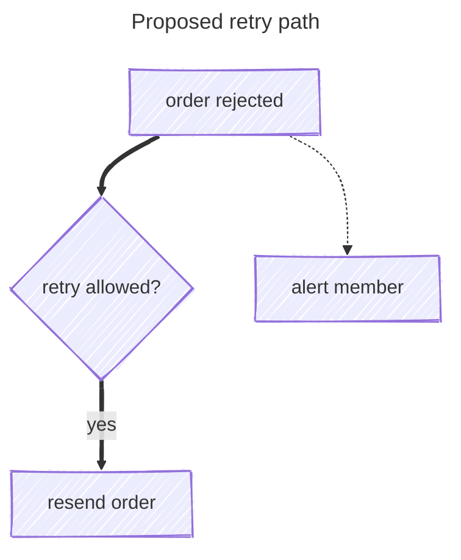

# Config on GitHub — what a diagram may set here

What a diagram may set when GitHub is the renderer, what the house declines and why, and which
validator to trust. The house rules it must never contradict live in `docs/PICTURES.md`.

## The one fact

GitHub renders **Mermaid 11.17.2** (read from its production bundle 2026-09-25; the pin lives in
`scripts/mermaid-lint.mjs`). Upstream is 12.0.0, whose new defaults (ELK layout, `redux-color`
theme, `neo` look, per-type scoping) do **not** apply here. A diagram's own YAML frontmatter
`config:` is honoured, except the locked keys (`secure`, `securityLevel`, `startOnLoad`,
`maxTextSize`, `maxEdges`, `suppressErrorRendering`), which are deleted without an error so
GitHub's own site config always wins. `%%{init}%%` still works but is deprecated since 10.5.0; if a
diagram has both, the directive wins. Use frontmatter.

## Allowed here

| Key / feature | What it does | Example |
|---|---|---|
| frontmatter `title:` | Draws a **visible** title. Not the screen-reader title | `title: Plan lifecycle` |
| `config.look: handDrawn` | Sketch texture = "proposed, not built". Reaches flowchart and state (verified); C4 ignores it. The hatching has no density knob and fights text inside a filled box, so keep it for unfilled pictures | `look: handDrawn` |
| `config.handDrawnSeed` | Fixed wobble, so re-renders don't churn diffs (0 = random) | `handDrawnSeed: 7` |
| `accTitle:` | One line; becomes the SVG `<title>` + `aria-labelledby` | `accTitle: Ship loop` |
| `accDescr:` / `accDescr { }` | Colon for one line, braces and **no** colon for several; becomes `<desc>` | `accDescr: Thick edges are new` |
| `wrap` (or `sequence.wrap`) | Wraps long labels / messages | `wrap: true` |
| `htmlLabels` | Set at the root; `flowchart.htmlLabels` is deprecated | `htmlLabels: true` |
| `fontSize` | **A no-op for flowchart text** (measured 2026-09-26 on 11.17.2). The lever that works is `classDef default font-size:20px,font-family:Verdana` on flowchart and erDiagram; stateDiagram-v2 rejects `classDef default` | `classDef default font-size:20px,font-family:Verdana` |
| `flowchart.nodeSpacing` / `rankSpacing` / `padding` | Tighter packing so a phone shows bigger text (`docs/PICTURES.md` rule 13) | `nodeSpacing: 24`, `rankSpacing: 36`, `padding: 10` |
| v11 shapes `@{ shape: doc \| docs \| stadium \| cyl \| dbl-circ \| person }` and the `==x` cross-head thick edge | All draw on 11.17.2 (measured 2026-09-26); the double circle reads as done, the cross-head as refused | `draws@{ shape: dbl-circ, label: "done" }` |
| `flowchart.curve` | Edge shape (default `basis`) | `curve: linear` |
| `sequence.mirrorActors` / `showSequenceNumbers` | Actors only on top; numbered messages | `mirrorActors: false` |
| `gantt.axisFormat` / `displayMode` | Axis date format (quote it); `compact` packs tasks onto shared rows | `axisFormat: "%m-%d"` |
| `markdownAutoWrap` | Auto-wraps markdown-string labels | default `true` |
| KaTeX `$$...$$` | Math in **flowchart and sequence** labels only; one line; flowchart labels quoted. MathML output, so it probably renders on GitHub (unverified there). The lint does **not** catch bad KaTeX | `A["$$x^2$$"]` |

Where `accTitle`/`accDescr` work on 11.17.2 (probed): flowchart, sequence, class, state, ER,
gantt, pie, gitGraph, requirement, quadrant, xychart, packet, architecture, radar, treemap. They
**break the parse** of mindmap, sankey-beta and block-beta; timeline and kanban **drop** them
silently (kanban also rejects the brace form); C4 draws `accTitle` as the **visible** title. They
reach screen readers only, so meaning still has to live in labels, shapes and line styles.



## Declined here, and why

| Feature | Why not |
|---|---|
| `theme`, `themeVariables`, `themeCSS`, hex fills | GitHub picks light or dark from the page; a pinned theme or hex freezes one mode. The lint **fails** it. The only styling is the contrast-verified `classDef` snippet in `docs/PICTURES.md`, copied whole |
| `layout: elk` (and every non-dagre layout) | ELK is not registered in 11.17.2: flowchart, class, ER and requirement fall back to dagre silently; stateDiagram-v2 throws `Unknown layout algorithm: elk` |
| iconify / Font Awesome icons | GitHub never registers packs: a pack icon renders a `?` square (inline `fa:fa-x` may render blank). `architecture-beta` gets only its five built-ins (cloud, database, disk, internet, server) |
| `click` | Dead: authors cannot lift `securityLevel`, and callbacks never run |
| `treeView-beta` in dark mode | Draws its labels and lines black on the dark canvas on 11.17.2 (measured 2026-09-26); parses fine, not shippable until GitHub's build themes it |
| a `<br/>` in a subgraph title | The cluster keeps one line of headroom; the second line lands on the first node. Hand-break node labels instead (`docs/PICTURES.md` rule 4) |
| relying on markdown-string auto-wrap | The 200 px wrap is skipped at a fractional browser zoom and the label clips mid-word; hand-placed `<br/>` never reaches that path |
| locked keys (`securityLevel`, `startOnLoad`, `maxTextSize`, `maxEdges`, ...) | Deleted from frontmatter and directives; the 50,000-character and 500-edge defaults hold unless GitHub changed them |
| `mermaid.initialize()` | There is no site here; GitHub owns that layer |
| per-type `flowchart.look` / `.theme` / `.layout` | v12 only; 11.17.2 parses it and ignores it |
| `legacyMathML` / `forceLegacyMathML` | They need `katex.min.css`, which GitHub does not load |

## Validation oracles

- **The authority: the pinned lint.** `node scripts/mermaid-lint.mjs <file>` or `--stdin`
  (`--json` for findings; also `npm run mermaid:lint -- <file>`; `ship.sh checkbody`, `issue:lint`
  and the CI corpus run it). It is `mermaid.parse` under jsdom on 11.17.2, GitHub's exact version.
  - Catches: grammar errors in every type, frontmatter YAML errors, unknown or 12-only types, the
    500-edge flowchart limit, `accTitle` breaking mindmap/sankey/block. House problems: a theme,
    an icon pack, the `journey` type. Notes: `%%{init}%%`, a non-dagre layout, `click`, over 40 lines.
  - Cannot catch: malformed KaTeX, text over 50,000 characters, failures raised only at render or
    layout time (state + `layout: elk` passes), misspelled keys or bad values (`theme: purple`),
    config ignored after a leading blank line, `accTitle` dropped on timeline/kanban/C4,
    legibility at 390px, contrast.
- **Mermaid Chart MCP** runs **11.13.0**, older than GitHub. Features from 11.14 on can false-red,
  and a `valid` can hide an ignored setting (unknown theme, scoped key, unresolved icon). Useful
  only for a real SVG (it does catch bad KaTeX); call it one diagram at a time, read the result with
  `jq`. Never let it overrule the lint.
- **`info`**: a mermaid block containing only `info` prints the running version, on GitHub or in
  any validator. Re-check it before trusting the 11.17.2 pin.

```mermaid
info
```

## Gotchas that silently break on GitHub

- Frontmatter `---` must be the very first line; after a blank line the config is ignored and the parse still passes.
- Tabs in frontmatter indentation are a hard error; indent with spaces.
- Only `title`, `displayMode` and `config` are read at the top of frontmatter; other keys are inert.
- A misspelled key is dropped and a bad value kept, both silently; a green parse proves nothing about config.
- Frontmatter plus `%%{init}%%` on one diagram: the directive wins, hiding which value applies.
- `layout: elk` on a state diagram errors on GitHub while the lint passes it.
- Frontmatter `title:` is visible text, not the accessible name; use `accTitle` for that.
- The GitHub mobile app renders no Mermaid; a phone browser does, and scales a wide SVG (and its text) down to 390px.
- Icons never fail a diagram: validators say valid while GitHub draws `?` or nothing.
- When GitHub moves to v12, unconfigured flowchart, state, class, ER and requirement diagrams re-flow under ELK and restyle; `layout: dagre` is valid on both.

## Sources

https://mermaid.js.org/config/configuration.html
https://mermaid.js.org/config/directives.html
https://mermaid.js.org/config/theming.html
https://mermaid.js.org/config/layouts.html
https://mermaid.js.org/config/icons.html
https://mermaid.js.org/config/accessibility.html
https://mermaid.js.org/config/math.html
https://mermaid.js.org/config/usage.html
https://mermaid.js.org/config/faq.html
https://mermaid.js.org/config/mermaidCLI.html
https://mermaid.js.org/intro/syntax-reference.html
https://mermaid.js.org/ecosystem/integrations-community.html
