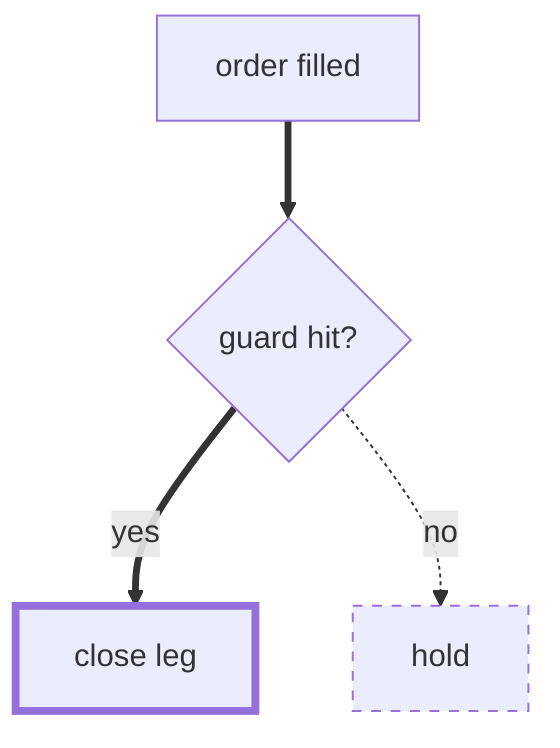
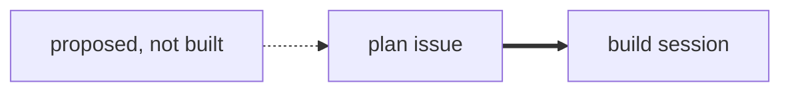
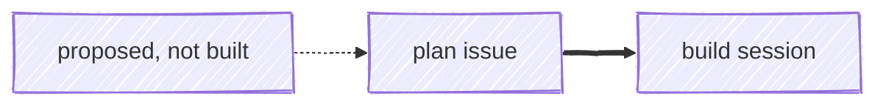
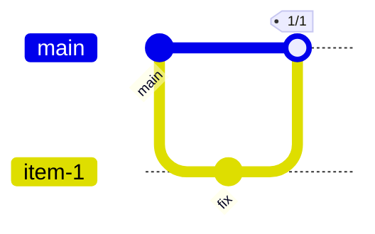
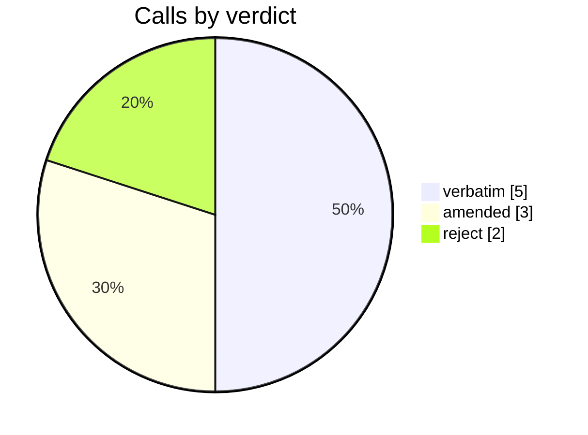
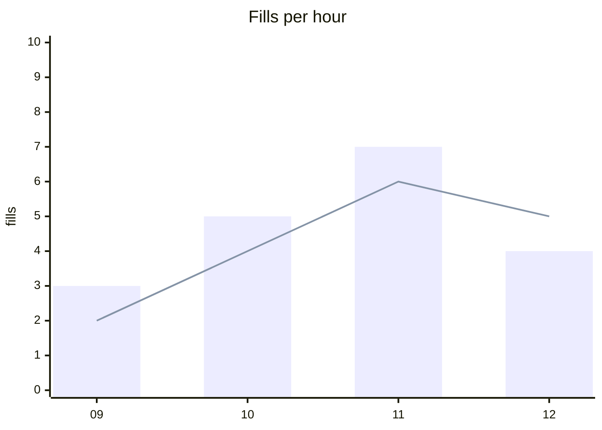
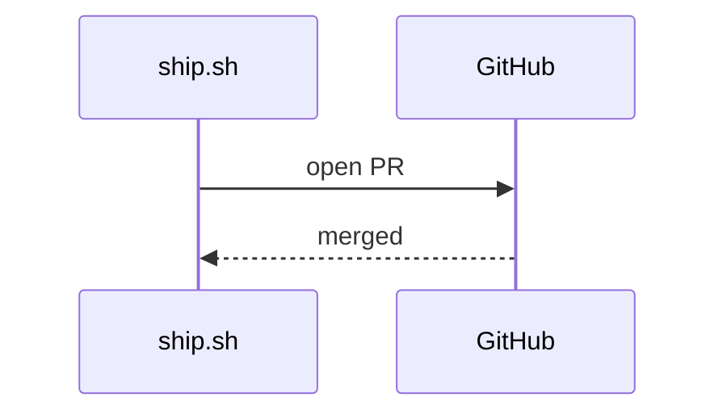
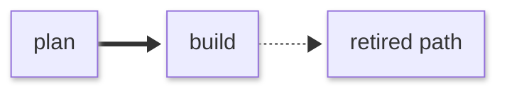
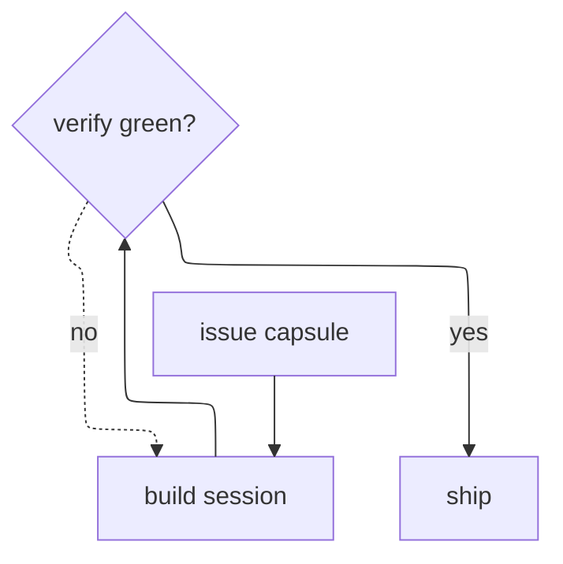
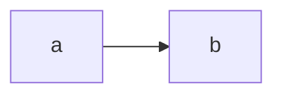

# config/theming (Theme Configuration): built-in themes, themeVariables (base vs derived, per-diagram), customising base, site-wide vs per-diagram config

Themes can be set for a whole site with mermaid.initialize() or for one diagram with frontmatter `config:` (the `%%{init}%%` directive also works but has been deprecated since 10.5.0). The docs say `base` is the only modifiable theme: pair `theme: base` with `themeVariables` (hex colours). Mermaid then works out ~200 other colours (derived variables) from about eight base inputs, mostly by rotating or inverting hue.

The page changed a lot with Mermaid 12.0.0 (released 2026-09-10). It now lists 11 themes: redux-color, redux-dark-color, redux, redux-dark, default, neutral, dark, forest, neo, neo-dark, base. From 12.0 on, ten diagram types default to theme `redux-color` with look `neo` (agentflow, flowchart, swimlane, class, er, requirement, sequence, state, usecase, venn); everything else stays on `default` + `classic`. 12.0 also lets you set `theme`, `look` and `layout` for a single diagram type (e.g. `flowchart: {look: handDrawn}`).

Precedence, highest first: the diagram's frontmatter or directive, then initialize(), then the diagram type's own default, then the global default. Within the first two, a value scoped to a diagram type beats the global value set alongside it.

What the 11.x docs listed: only the five classic themes. The neo/redux themes and the neo look shipped in 11.14.0, so they exist in 11.17.2, which is what github.com renders. The 12.0 defaults and per-diagram-type scoping do not exist there. So a GitHub diagram with no config still renders `default` + `classic`.

Two things found in the installed 11.17.2 code, not stated in the docs:
- Colours set in frontmatter or a directive are only recomputed (derived colours updated) when the same block also sets `theme`.
- Frontmatter/directive values are sanitised: secure keys are removed, any string containing `<`, `>` or `url(data:` is removed, and any themeVariables value with characters outside `[\d "#%(),.;A-Za-z]` is blanked.

The Mermaid Chart MCP validator renders with v11.13.0, which is older than GitHub. It reports unknown theme names and ignored scoped keys as valid.

## Mechanisms
| Mechanism | Syntax | Scope | Note |
|---|---|---|---|
| Site-wide config (initialize) | `mermaid.initialize({ theme: 'base', themeVariables: { primaryColor: '#ffffff' }, look: 'classic', darkMode: false })` | Every diagram rendered by that page or app. This is the second layer of precedence. It is applied only once, and configApi.reset() restores this site config before each render. | Only the host can set it; diagram authors on GitHub cannot. It is also the only place `secure` keys (securityLevel, maxTextSize…) can be changed. |
| Diagram frontmatter config (v10.5.0+) | `--- config:   theme: base   themeVariables:     primaryColor: "#ffffff"     lineColor: "#333333" --- flowchart TD   A --> B` | One diagram. This is the highest-precedence layer. Everything except the secure keys can be overridden. | This is the documented replacement for directives. Also set `theme` in the same block, or the derived colours won't be recomputed. Doing so is harmless on 12.0 too. |
| Init directive (deprecated since v10.5.0) | `%%{init: { "theme": "forest", "themeVariables": { "fontSize": "18px" } } }%%` | One diagram, same layer as frontmatter. `init` and `initialize` are both accepted; multiple directives are merged and the last value wins. | The JSON must be valid, quoted key/value pairs or the whole directive is ignored. It is still honoured (validated on 11.13.0). |
| Per-diagram-type scoping (12.0.0+) | `mermaid.initialize({ look: 'classic', flowchart: { look: 'handDrawn' }, er: { theme: 'neutral' } })  \|  frontmatter:  config:\n  flowchart:\n    look: handDrawn` | Only that diagram type. Within a layer, the scoped value wins over the global one. Works for theme, look and layout. | The scope uses the config key, not the diagram keyword: class, er, sequence, state, requirement, usecase, venn, agentflow, swimlane, flowchart. On 11.13.0 the scoped look parsed as valid but was silently ignored. Not available on GitHub's 11.17.2. |
| Reverting to the pre-12 look | `--- config:   theme: default   look: classic ---   or   mermaid.initialize({ theme: 'default', look: 'classic' })` | One diagram, or the whole page | This is how you undo the 12.0 redux-color/neo defaults on the ten affected types. |
| Customising the base theme | `theme: base + themeVariables: { primaryColor, primaryTextColor, primaryBorderColor, lineColor, secondaryColor, tertiaryColor, … }` | Wherever `theme` is set (site or diagram) | How it works: your overrides are copied in, the derived colours are computed, then your overrides are copied in again, so any variable you set explicitly (derived or not) wins. Other themes also accept overrides mechanically, but the docs support customisation on base only. |
| themeCSS | `config: { themeCSS: ".node rect { stroke-width: 3px; }" }` | Raw CSS injected into that diagram's style block | Not documented on the theming page; defined in the schema. From frontmatter/directives it goes through sanitizeCss: unbalanced braces are replaced with an error comment, and strings containing <, > or url(data: are removed. |
| theme: 'null' | `mermaid.initialize({ theme: 'null' })` | Site | The schema documents it as the way to disable the built-in themes, so the host supplies its own CSS. |
| classDef / style / linkStyle (per element, inside the diagram) | `classDef changed stroke-width:4px classDef removed stroke-dasharray:5 5 class C changed` | Individual nodes or edges in one diagram | themeVariables apply to the whole diagram. Per-node emphasis needs classDef. The 12.0 changelog says an explicit classDef/style beats the redux-color palette. |
| look (classic | handDrawn | neo) + handDrawnSeed | `config:   look: handDrawn   handDrawnSeed: 7` | Diagram or site; per-type from 12.0 | Top-level handDrawn works on 11.13.0 (rough nodes appeared in the render). The `neo` look is 11.14+. handDrawnSeed 0 means random. |
| darkMode flag | `themeVariables: { darkMode: true }   or   config: { darkMode: true }` | Changes how derived colours are computed (e.g. primaryTextColor becomes light, cScale is darkened by 75) | The docs say to use theme `dark` together with darkMode `true` on dark-mode sites. |

## Keys
| Key | Meaning | Default |
|---|---|---|
| `theme` | Built-in theme name. Valid values: default | base | dark | forest | neutral | neo | neo-dark | redux | redux-dark | redux-color | redux-dark-color | 'null' | 'default' globally. From 12.0.0, 'redux-color' for agentflow, flowchart, swimlane, class, er, requirement, sequence, state, usecase, venn |
| `themeVariables` | Object of theme variable overrides. Colours should be hex. Nested objects are used for xyChart, radar, packet, cynefin, wardley | computed by the theme |
| `themeCSS` | Extra CSS string for the diagram | unset |
| `darkMode` | Changes how derived colours are computed | false |
| `fontFamily` | CSS font-family for diagram text. A top-level fontFamily in a directive is copied into themeVariables.fontFamily if that is unset | '"trebuchet ms", verdana, arial, sans-serif;' (schema); themeVariables.fontFamily default "trebuchet ms", verdana, arial |
| `altFontFamily` | Schema TODO says it appears unused except in tests | unset |
| `themeVariables.fontSize` | Font size (px string) | 16px (base/default); 14px (redux) |
| `look` | Rendering style: classic | handDrawn | neo | 'classic' globally. From 12.0.0, 'neo' for the ten types listed under theme |
| `handDrawnSeed` | Seed for the handDrawn look | 0 (random) |
| `layout` | Layout algorithm | theming.md says 'dagre' globally (swimlane → 'swimlane'). The 12.0.0 schema and changelog say 'elk', bundled, except the tiny build which falls back to dagre. An unregistered layout falls back to dagre with a console warning |
| `<diagramKey>.theme / .look / .layout` | Per-diagram-type override (12.0+) | the type's default |
| `secure` | Keys that only initialize() can change; they are stripped from frontmatter and directives | ['secure','securityLevel','startOnLoad','maxTextSize','suppressErrorRendering','maxEdges'] |
| `securityLevel` | strict | loose | antiscript | sandbox | strict |
| `<diagram>.useMaxWidth` | If true, the SVG scales to 100% of the container width (so text shrinks on narrow screens) | true |
| `themeVariables.useGradient (base)` | Under look: neo, node strokes are drawn with a gradient. Overriding nodeBorder turns it off unless useGradient is set explicitly (12.0) | true on base |
| `themeVariables.strokeWidth` | Theme stroke width | 1 (base); 2 (redux*, neo) |
| `themeVariables.radius` | Corner radius | 5 (base); 12 (redux) |
| `themeVariables.THEME_COLOR_LIMIT` | Number of colour-scale slots | 12 |

## Theme variables
- BASE (inputs set directly in theme-base.js): background #f4f4f4 · primaryColor #fff4dd · noteBkgColor #fff5ad · noteTextColor #333 · fontFamily · fontSize 16px · darkMode false · radius 5 · strokeWidth 1 · useGradient true · dropShadow · THEME_COLOR_LIMIT 12
- DERIVED core: primaryTextColor (darkMode ? #eee : #333; the docs table says #ddd/#333) · secondaryColor = primary hue −120 · tertiaryColor = primary hue +180, lightness +5 · primaryBorderColor/secondaryBorderColor/tertiaryBorderColor/noteBorderColor = mkBorder(colour) · secondaryTextColor/tertiaryTextColor = invert(colour) · lineColor & arrowheadColor = invert(background) · textColor = primaryTextColor · mainBkg/nodeBkg = primaryColor · border2 = tertiaryBorderColor · errorBkgColor = tertiaryColor · errorTextColor = tertiaryTextColor
- Flowchart: nodeBorder=primaryBorderColor · clusterBkg=tertiaryColor · clusterBorder=tertiaryBorderColor · defaultLinkColor=lineColor · titleColor=tertiaryTextColor · edgeLabelBackground (secondaryColor, darkened 30 in darkMode) · nodeTextColor=primaryTextColor
- Agentflow (12.0): flowContainerStroke=secondaryBorderColor
- Sequence: actorBkg=mainBkg · actorBorder=primaryBorderColor · actorTextColor · actorLineColor=actorBorder · signalColor/signalTextColor=textColor · labelBoxBkgColor · labelBoxBorderColor · labelTextColor · loopTextColor · activationBorderColor=darken(secondary,10) · activationBkgColor=secondaryColor · sequenceNumberColor=invert(lineColor) · rectBkgColor=tertiaryColor
- Gantt: sectionBkgColor · altSectionBkgColor (white) · sectionBkgColor2 · excludeBkgColor #eeeeee · taskBorderColor · taskBkgColor · activeTaskBorderColor · activeTaskBkgColor · gridColor lightgrey · doneTaskBkgColor lightgrey · doneTaskBorderColor grey · critBorderColor #ff8888 · critBkgColor red · todayLineColor red · vertLineColor navy · taskTextColor · taskTextOutsideColor · taskTextLightColor · taskTextDarkColor · taskTextClickableColor #003163
- C4 (declared under a 'Sequence' comment in the source): personBorder=primaryBorderColor · personBkg=mainBkg
- ER: rowOdd/rowEven (derived from mainBkg) · attributeBackgroundColorOdd/Even
- State: labelColor (per the docs) · transitionColor=lineColor · transitionLabelColor=textColor · stateLabelColor · stateBkg=mainBkg · labelBackgroundColor · compositeBackground · altBackground=tertiaryColor · compositeTitleBackground · compositeBorder=nodeBorder · innerEndBackground · specialStateColor
- Colour scale (timeline, radar, mindmap, etc.): cScale0–11 (primary/secondary/tertiary, then primary hue +30…+330, then darkened) · cScaleInv0–11 · cScalePeer0–11 · cScaleLabel0–11 · scaleLabelColor · surface0–4 · surfacePeer0–4
- Class: classText=textColor
- User journey: fillType0–7 (primary/secondary, hue ±64/128)
- Pie: pie1–12 (hue/lightness shifts of primary/secondary/tertiary) · pieTitleTextSize 25px · pieTitleTextColor · pieSectionTextSize 17px · pieSectionTextColor · pieLegendTextSize 17px · pieLegendTextColor · pieStrokeColor black · pieStrokeWidth 2px · pieOuterStrokeWidth 2px · pieOuterStrokeColor black · pieOpacity 0.7
- Venn: venn1–8 · vennTitleTextColor · vennSetTextColor
- Quadrant: quadrant1–4Fill · quadrant1–4TextFill · quadrantPointFill · quadrantPointTextFill · quadrantXAxisTextFill · quadrantYAxisTextFill · quadrantInternalBorderStrokeFill · quadrantExternalBorderStrokeFill · quadrantTitleFill
- xyChart (nested themeVariables.xyChart): backgroundColor · titleColor · dataLabelColor · legendTextColor · x/yAxisTitleColor · x/yAxisLabelColor · x/yAxisTickColor · x/yAxisLineColor · plotColorPalette (comma-separated string)
- Radar (nested themeVariables.radar): axisColor · axisStrokeWidth · axisLabelFontSize · curveOpacity · curveStrokeWidth · graticuleColor · graticuleStrokeWidth · graticuleOpacity · legendBoxSize · legendFontSize. Curves use cScale${i}
- Packet (nested themeVariables.packet; the docs say these are currently broken by a bug): byteFontSize · startByteColor · endByteColor · labelColor · labelFontSize · titleColor · titleFontSize · blockStrokeColor · blockStrokeWidth · blockFillColor
- Requirement: requirementBackground · requirementBorderColor · requirementBorderSize · requirementTextColor · relationColor · relationLabelBackground · relationLabelColor
- gitGraph: git0–7 (colours repeat cyclically after 8 branches) · gitInv0–7 · branchLabelColor · gitBranchLabel0–7 · tagLabelColor · tagLabelBackground · tagLabelBorder · tagLabelFontSize 10px · commitLabelColor · commitLabelBackground · commitLabelFontSize 10px
- Architecture: archEdgeColor #777 · archEdgeArrowColor #777 · archEdgeWidth 3 · archGroupBorderColor #000 · archGroupBorderWidth 2px
- Wardley: wardleyEvolutionColor + nested wardley{backgroundColor, axisColor, axisTextColor, gridColor, componentFill, componentStroke, componentLabelColor, linkStroke, evolutionStroke, annotationStroke, annotationTextColor, annotationFill}
- Cynefin (nested themeVariables.cynefin): domainFontSize · itemFontSize · boundaryColor/Width · cliffColor/Width · arrowColor/Width · complexBg · complicatedBg · chaoticBg · clearBg · confusionBg · textColor · labelColor
- Event modeling: emUiFill/Stroke · emProcessorFill/Stroke · emReadModelFill/Stroke · emCommandFill/Stroke · emEventFill/Stroke · emSwimlaneBackgroundOdd/Stroke · emArrowhead · emRelationStroke
- Use case (12.0; set by redux-color/redux-dark-color): usecaseActorBkg/Border · usecaseBkg/Border · usecaseBoundaryBkg/Border · usecaseIncludeLine · usecaseExtendLine
- Misc: noteFontWeight · fontWeight · gradientStart/gradientStop (= primary/secondaryBorderColor)

## For a colourblind reader
What theming offers a reader who can't rely on hue:
- **Achromatic themes.** `neutral` is greys for printed black-and-white: node fill #eee, stroke #999, lines #666. It renders on every version. `redux` (11.14+; the docs' choice "when you want the colour to carry meaning you assign yourself") uses white nodes, dark #28253D borders and strokeWidth 2.
- **Base with hand-picked hex.** Validated example: black text on white, #111 borders, #333 lines, fontSize 18px.
- **Stroke and size variables.** themeVariables.strokeWidth, nodeBorder, fontSize (bigger text for 390px phones), pieStrokeWidth/pieStrokeColor/pieOpacity: 1 for crisp slice edges, commitLabelFontSize and tagLabelFontSize. Adding showData to a pie prints values next to the legend.
- **Per-element emphasis without colour.** classDef stroke-width (e.g. 4px) and stroke-dasharray (e.g. 5 5). Validated.
- **Accessible names.** accTitle/accDescr become the SVG `<title>`/`<desc>`. Validated.

What it does NOT solve:
- **Derived colours differ by hue only.** secondaryColor = hue −120; tertiary = hue +180; cScale, git0–7, pie1–12, fillType, venn and quadrant are all hue shifts, so series, branches and slices can collide for a red/green colourblind reader.
- **12.0's default (redux-color on 10 types) colours each item from a categorical palette.** It is decorative, but a reader may take it as meaningful.
- **Nothing checks contrast.** neutral's #999 border on white is about 2.8:1; the default theme's #9370DB border and gantt's red critBkgColor are hue-based.
- **No built-in colourblind-safe palette, and no hatching or pattern fills.** Pie, xychart and radar legends identify series by colour swatch alone.
- **themeVariables apply to the whole diagram, not one node.**
- **useMaxWidth shrinks a wide SVG, and its text, on a 390px screen.**
- **Pinning a theme on GitHub freezes one of the two colour modes** (repo policy: set no theme). Emphasis must be carried by structure: thick `==>` edges, dotted `-.->` edges, subgraphs, diamond shapes, labels.

## On GitHub
**Version.** docs.github.com only says Mermaid is supported, that you can check the version with a ```mermaid block containing `info`, and that third-party plugins may error. The repo read github.com's renderer bundle on 2026-09-25 and found Mermaid 11.17.2 (scripts/mermaid-lint.mjs, docs/PICTURES.md); upstream is 12.0.0. So on GitHub:
- The 12.0 per-diagram defaults (redux-color + neo) and per-diagram-type theme/look/layout scoping do not apply. Unconfigured diagrams render `default` + `classic`.
- neo/neo-dark/redux* themes and look:neo exist from 11.14 and appear in 11.17.2's types, so they should be recognised. Verify by rendering on GitHub.

**Frontmatter and directives.** Theme keys (theme, themeVariables, themeCSS, look, darkMode, fontFamily) are not in the default `secure` list, so frontmatter `config:` and `%%{init}%%` can set them. Verify that GitHub honours them; the repo says a pinned theme overrides GitHub's own light/dark choice. GitHub picking the theme from the page's colour mode is repo-asserted; the docs are silent (verify).

**What gets stripped from frontmatter/directives (11.17.2 code):**
- secure keys (secure, securityLevel, startOnLoad, maxTextSize, suppressErrorRendering, maxEdges)
- `__*`/proto/constructor keys
- keys that aren't known config keys
- string values containing `<`, `>` or `url(data:`
- themeVariables values with characters outside `[\d "#%(),.;A-Za-z]` are blanked

**ELK.** In 11.x ELK is the separate @mermaid-js/layout-elk package, and a layout that isn't registered falls back to dagre with a console warning. So `layout: elk` on GitHub is presumably dagre (repo notes this; verify).

**Icon packs.** Registered by the host; GitHub doesn't register them (repo: they render as '?').

**Math/KaTeX.** The theming docs say nothing (verify).

**click callbacks.** Dead on GitHub (repo), consistent with securityLevel strict (verify).

**Mobile app.** The GitHub mobile app does not render Mermaid; a phone browser does (repo).

## Validation tooling
- **Mermaid Chart MCP validate_and_render_mermaid_diagram** — Send diagramCode; it returns valid plus SVG/PNG. Probing with `info` showed it renders with v11.13.0. — Runs server-side. It cannot check: theme names (theme: redux came back valid but rendered in default colours, because 11.13 predates 11.14's redux/neo), ignored config (scoped `flowchart.look` came back valid but was not applied), colour contrast, or behaviour on GitHub's 11.17.2 or upstream 12.0.0. To check whether a setting actually applied, inspect rawSVG (e.g. rough-node, CSS fill values).
- **Repo scripts/mermaid-lint.mjs (mermaid.parse, pinned 11.17.2, under jsdom)** — node scripts/mermaid-lint.mjs <file.md> | --stdin | --json; also runs from ship.sh checkbody, issue-lint and the CI corpus spec — Parse only, using the same version as github.com. As policy it fails on theme/themeVariables and notes %%{init}%% and layout: elk. It does not render, so it can't check whether themeVariables took effect or check contrast.
- **mermaid.parse (generic)** — await mermaid.parse(src) in Node with a DOM shim (jsdom/happy-dom) — Checks syntax and frontmatter YAML. Theme variables are not computed and nothing is laid out, so there is no contrast check and no warning for unknown themes.
- **GitHub `info` diagram** — A ```mermaid block containing only `info` in any comment or .md shows the deployed version (needs a browser) — Documented by GitHub. Use it to re-check the 11.17.2 pin before relying on 11.14+ themes.

## Gotchas
- **The theme menu depends on the version.** The 11.x docs list 5 themes. neo, neo-dark, redux, redux-dark, redux-color, redux-dark-color and look:neo arrived in 11.14.0. 12.0.0 (2026-09-10) made redux-color + neo the default for 10 diagram types. GitHub renders 11.17.2 and the MCP validator renders 11.13.0, so the three disagree.
- **Only `base` is documented as customisable.** Every theme class runs calculate(overrides), so overrides do apply to other themes, but that is unsupported.
- **Set `theme` next to `themeVariables`.** In 11.17.2's config merge, frontmatter/directive themeVariables are recomputed (derived colours updated) only when the same frontmatter/directive also sets `theme`. Otherwise the raw values land, but borders, secondary colours and so on don't follow.
- **Explicit values always win.** Overrides are applied before and after derivation, so explicitly setting a derived variable (e.g. primaryBorderColor) wins.
- **Hex only (the documented contract).** The docs say 'red' won't work. A probe on 11.13.0 accepted primaryColor: red and derived from it, but keep to hex.
- **Sanitiser blanks some values.** Frontmatter/directive themeVariables values containing characters outside [\d "#%(),.;A-Za-z] are blanked. Hyphens, underscores, single quotes and colons are all rejected, e.g. a themeVariables.fontFamily with 'sans-serif'. Top-level fontFamily only goes through the CSS brace check.
- **Some values vanish silently.** String config values containing <, > or url(data: are removed. Secure keys are removed. Unknown top-level keys are dropped.
- **Directive rules.** Directives have been deprecated since 10.5.0. The JSON must be valid and quoted or the directive is ignored. `init` and `initialize` are merged and the last value wins.
- **The theming page's layout note is stale.** It says the global layout is dagre and ELK is a separate package. The 12.0.0 changelog and schema say ELK is bundled and is the default for flowchart, state, class, ER, requirement, use-case and agentflow; the tiny build falls back to dagre. Set `layout: dagre` to keep the old layout.
- **Unknown theme names.** From 12.0, an unrecognised theme resolves to 'default' by name as well. Earlier versions kept the invalid name but loaded default's variables, which broke palette-aware CSS. Validators still report unknown themes as valid.
- **neo + base draws gradient borders.** Under look:neo with theme base, useGradient paints node strokes with a gradient. Setting nodeBorder turns it off unless useGradient is set explicitly (12.0).
- **Config keys aren't diagram keywords.** Per-diagram config keys are class, er, sequence, state, requirement, usecase, venn, agentflow, swimlane, flowchart — not classDiagram, erDiagram, etc.
- **Docs and source disagree on some defaults.** primaryTextColor in darkMode is #ddd in the docs but #eee in the source. Radar defaults in the docs (axis black, width 1, curveOpacity 0.7) differ from theme-base (lineColor, 2, 0.5). The docs themselves say packet theme variables are broken. Trust the rendered SVG over the tables.
- **Palette slots are finite.** Branch colours cycle after 8 (git0–7); cScale, pie and the redux palettes cycle at 12 (THEME_COLOR_LIMIT); journey has 8 fillTypes.
- **Some variables are nested.** xyChart, radar, packet, cynefin and wardley variables sit in nested objects (themeVariables.xyChart.plotColorPalette). A flat key does nothing.
- **Dark sites need two settings.** Use theme dark plus darkMode true; the `dark` theme alone does not set dark mode.
- **redux defaults are smaller.** fontSize is 14px and the font is 'Recursive Variable' with an arial fallback, which hurts phone legibility unless fontSize is raised.
- **initialize() runs once.** configApi.reset() restores the site config before each render, so directives don't leak between diagrams.
- **Scoped keys can be silently ignored.** A per-type scoped look/theme parses fine on older versions but is ignored. Verify the effect in the SVG, not by the `valid` flag.

## Examples (The Mermaid Chart MCP tool was available. It renders with Mermaid v11.13.0 (the `info` probe returned "v11.13.0"). All 12 examples returned valid:true. What each render actually showed:
1. **Base + themeVariables + classDef + accTitle/accDescr:** passed. The SVG had node fill #ffffff and stroke #111111, `stroke-width:4px` and `stroke-dasharray:5 5` classes, and `<title>`/`<desc>` built from accTitle/accDescr.
2. **Init directive, neutral + fontSize 18px:** passed; font-size 18px and neutral greys (#eee/#999/#666) applied.
3. **Per-type scoped `flowchart: look: handDrawn`:** reported valid, but the look was NOT applied (plain rect nodes, default #ECECFF/#9370DB). 11.13.0 ignores this 12.0 feature.
4. **Top-level `look: handDrawn` + neutral:** passed and applied (rough-node paths present).
5. **gitGraph git0/git1/gitBranchLabel/commitLabelFontSize:** passed; .commit0 #222222, .commit1 #666666, commit-label 14px applied.
6. **Pie with pie1–3, stroke and opacity:** passed; #111/#777/#ddd slices, 3px black stroke, opacity 1.
7. **xychart with nested xyChart.plotColorPalette/titleColor:** passed; black bars, #888888 line, #111111 title.
8. **Base + darkMode sequence:** passed; actor fill #1f2937, message lines and text #f0f6fc.
9. **`theme: redux` + `look: neo`:** reported valid, but rendered with the default theme's colours (#ECECFF/#9370DB). redux/neo are 11.14+, so 11.13.0 silently falls back.
10. **`layout: elk` + neutral:** reported valid and rendered, but I did not confirm that ELK (not dagre) did the layout.
11. **`primaryColor: red` (named colour):** reported valid; the fill was red and derived colours were computed from it, despite the docs saying hex only.
12. **`info`:** v11.13.0.

No example failed to parse. Two need care: (3) and (9) are false positives, where `valid` hides a setting that was ignored.)


```text
%%{init: { "themeVariables": { "fontSize": "18px" } } }%%
flowchart LR
    A["plan"] --> B["build"] --> C["ship"]
```
_(not for GitHub surfaces — sets a fixed theme; shown for recognition)_



















```mermaid
info
```

## Sources
- https://raw.githubusercontent.com/mermaid-js/mermaid/develop/packages/mermaid/src/docs/config/theming.md
- https://mermaid.js.org/config/theming.html
- https://raw.githubusercontent.com/mermaid-js/mermaid/mermaid%4012.0.0/packages/mermaid/src/docs/config/theming.md (identical to develop)
- https://raw.githubusercontent.com/mermaid-js/mermaid/mermaid%4011.17.2/packages/mermaid/src/docs/config/theming.md (5-theme list)
- https://raw.githubusercontent.com/mermaid-js/mermaid/mermaid%4011.12.3/packages/mermaid/src/docs/config/theming.md
- https://raw.githubusercontent.com/mermaid-js/mermaid/develop/packages/mermaid/src/docs/config/directives.md
- https://raw.githubusercontent.com/mermaid-js/mermaid/develop/packages/mermaid/src/docs/config/configuration.md
- https://raw.githubusercontent.com/mermaid-js/mermaid/develop/packages/mermaid/src/schemas/config.schema.yaml
- https://raw.githubusercontent.com/mermaid-js/mermaid/mermaid%4012.0.0/packages/mermaid/src/schemas/config.schema.yaml
- https://raw.githubusercontent.com/mermaid-js/mermaid/develop/packages/mermaid/src/themes/theme-base.js
- https://raw.githubusercontent.com/mermaid-js/mermaid/develop/packages/mermaid/src/themes/theme-neutral.js
- https://raw.githubusercontent.com/mermaid-js/mermaid/develop/packages/mermaid/src/themes/theme-redux.js
- https://raw.githubusercontent.com/mermaid-js/mermaid/develop/packages/mermaid/CHANGELOG.md (12.0.0, 11.14.0 sections)
- https://raw.githubusercontent.com/mermaid-js/mermaid/develop/packages/mermaid/src/docs/syntax/{gitgraph,timeline,quadrantChart,xyChart,radar,packet,pie}.md (theme-variable sections)
- https://registry.npmjs.org/mermaid (dist-tags: latest 12.0.0, published 2026-09-10)
- https://docs.github.com/en/get-started/writing-on-github/working-with-advanced-formatting/creating-diagrams
- /home/user/skynet-capital/node_modules/mermaid/dist/chunks/mermaid.core/chunk-DU6HZSFF.mjs (11.17.2 sanitizeDirective / updateCurrentConfig / sanitize)
- /home/user/skynet-capital/node_modules/mermaid/dist/config.type.d.ts (11.17.2 theme/look enums)
- /home/user/skynet-capital/scripts/mermaid-lint.mjs
- /home/user/skynet-capital/docs/PICTURES.md
