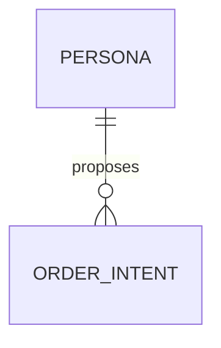
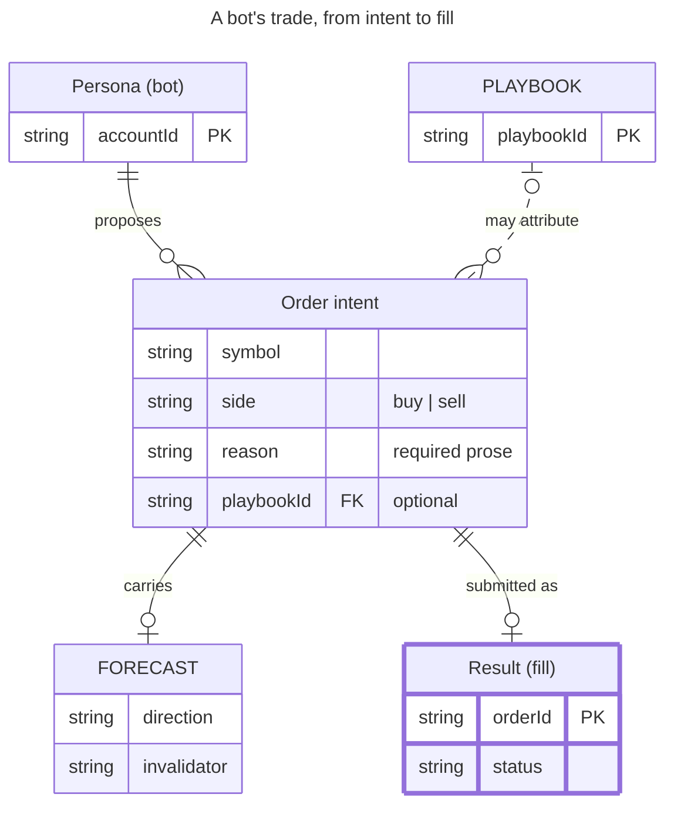

# entityRelationshipDiagram — `erDiagram`

**Status:** stable. There is no beta or experimental marker; ER has been in Mermaid since v7.0.0 (2017). Some sub-features are version-gated: entity aliases v10.5.0+; multi-line labels via   v11.1.0+; direction, style/classDef/class/:::, the default class, unicode/markdown/quoted entity names and handDrawn look arrived in the v11.5-11.6 unified renderer; neo look v11.14.0; optional `?` types and backtick-escaped attribute words v11.16.0+; subgraphs v11.17.0+. From v12.0.0 the defaults are the redux-color theme, neo look and ELK layout. That is an appearance change only, not new syntax.
**GitHub (11.17.2):** The ER docs page says nothing about GitHub. Repo facts: docs/PICTURES.md and scripts/mermaid-lint.mjs pin GitHub's renderer at Mermaid 11.17.2, read from github.com's production bundle on 2026-09-25 (upstream is 12.0.0). A mermaid block containing just `info` prints the deployed version in any GitHub comment.

What GitHub 11.17.2 supports:
- All documented ER syntax parses, including `?` optional types (11.16), backtick-escaped attribute words (11.16), subgraphs with id [title] (11.17.0), direction, style/classDef/class/:::, aliases and accTitle/accDescr. This was parse-verified with the repo lint and parser probes; the rendering was not eyeballed on github.com.
- The v12 appearance defaults (redux-color theme, neo look, ELK layout) do not apply. GitHub draws ER with the default theme, classic look and dagre, and a requested `layout: elk` falls back to dagre silently (per the lint's notes).
- No click or links exist in ER anyway.
- Fixed themes/themeVariables are rejected by the house lint because they freeze one of GitHub's light/dark modes.

Other renderers:
- The GitHub mobile app does not render Mermaid at all; a phone browser does.
- The Mermaid Chart MCP validator is an older 11.x, somewhere between 11.6 and 11.15. It rejects `?`, and it silently mis-parses `subgraph ... end` as entities. Do not treat it as the GitHub oracle; use `npm run mermaid:lint`.

## When to reach for it
- Schema/data-model PRs (the existing docs/PICTURES.md row 'Schema / data model → erDiagram'). Touches to src/domain/types.ts (OrderIntent, OrderForecast, PlaybookSubscription, OrderResult, Position, Portfolio): show which record gained or lost a field, with an attribute comment "added" or "removed" as the delta tag.
- Persisted-record and join-key changes in src/storage/* (jsonl-store, json-file-store, participant-state) and the attribution join closing #885 (OrderResult.orderId → persisted trade → playbookId/playbookMode). ER shows the FK path and cardinality that prose buries.
- Wire/DTO contracts in src/observatory/wire-data.ts (WireTradeRow, WireTradeRowsPage) and wire-reasoning.ts, when a PR changes what the dashboard receives.
- Plan issues that introduce new record types (docs/plans/metrics-layer.md, trade-insights-loop.md, history-layer.md, trade-playbooks.md). A zero-context build session gets exact entities, keys, optionality (`?`) and cardinalities, which is token-efficient build-to-spec.
- Encoding operating-model invariants as cardinality. A platter PR is `PLATTER_PR ||--|{ COMMIT : merges` and `COMMIT ||--|| ITEM : implements` (one commit per item). An issue capsule `||--|{` EARS criterion `||--|{` BDD spec. A research call sheet `||--|{` call `||--||` falsifier. The glyphs make the rule checkable at a glance.
- Associative ('cannot exist without') structure. PlaybookSubscription (account × playbook × mode) and OrderForecast (exists only inside an intent) are identifying relationships. Optional attribution (a bare persona reflex has no playbookId) is non-identifying and dashed.
- Companion to C4 container diagrams: C4 names the stores, ER shows what lives inside each store.

**Not for:**
- Anything ordered in time: PR verify → auto-merge → deploy, issue proposed → ready → executing → done, or the bot's recommend → ticket → fill as a process. ER has no sequence or state; use flowchart, sequenceDiagram or stateDiagram-v2. ER only fits the data those steps leave behind.
- A fitness budget ratcheting down over weeks: use xychart-beta or a timeline.
- A research call sheet or interrogation verdict (verbatim/amended/reject/status-quo): these are tables or decision shapes. ER boxes would be decorative.
- Config/constant diffs: the house before/after table is faster to scan.
- Class hierarchies, interfaces with methods, or type unions: ER has no inheritance or methods, so use classDiagram.
- Marking one relationship as new or risky: edges cannot be styled individually, and dashing an edge would falsely assert 'non-identifying'.
- Large schemas: more than about 6 entities, or entities with many commented attributes, exceed 390px and shrink to unreadable text. Split by aggregate or show only the changed neighbourhood.
- Fill colour as a signal (including v12 redux-color per-entity hues): hue must never carry meaning here.

## Header forms
- erDiagram
- erDiagram with direction TB|BT|LR|RL as its own statement (v11.5+; default TB)
- ---
title: Order example
---
erDiagram
- ---
title: Order example
config:
  layout: dagre
---
erDiagram
- ---
config:
  theme: default
  look: classic
  layout: dagre
---
erDiagram   (the docs' way to get the pre-v12 look back)
- ---
config:
  er:
    minEntityWidth: 80
    entityPadding: 10
---
erDiagram   (per-type config block; keys listed under config_options)
- %%{init: {"er": {...}}}%%
erDiagram   (directive form; deprecated upstream in favour of frontmatter; the repo lint notes it)
- The keyword is lexed case-insensitively, so ERDIAGRAM also parses. Write erDiagram.

## Primitives
| Form | Syntax | Note |
|---|---|---|
| bare entity | `CUSTOMER` | Only first-entity is mandatory, so a lone name draws an entity with no relationships. Names are singular nouns by convention. Capitals are customary, not required. |
| quoted entity (spaces / unicode / markdown) | `"Order intent"   "This ❤ Unicode"   "This **is** _Markdown_"` | Needs the v11.5+ renderer. A quoted name cannot contain % \ or a double quote. `"50% budget"` is a parse error (verified on 11.17.2). |
| entity alias (display label) | `p[Person]   a["Customer Account"] { string email }` | Added in v10.5.0. The alias is drawn instead of the id, and relationships use the id: `p ||--o| a : has`. Alias names follow the entity-name rules. |
| entity with attribute block | `CAR {     string registrationNumber PK     string make     string[] parts }` | One `type name` pair per line. A line with only one word is invalid. `A { }` (empty block) is allowed. |
| attribute type forms | `string   string(99)   string[]   list~string~   string?   `order.id`` | A type must start with a letter, _ or a unicode char, and may contain digits - _ ( ) [ ] . , . The `?` suffix means optional/nullable (v11.16.0+). Backticks escape special characters such as dots (v11.16.0+, changelog only). `~T~` generics parse but are undocumented. |
| attribute name forms | `orderNumber   *orderNumber   `order.id`` | Same rules as a type, and it may also start with * as a primary-key hint. A name starting with a digit (`2fa`) is a parse error (verified). |
| attribute keys | `string driversLicense PK string carReg PK, FK string phone UK` | Only PK, FK and UK are keys. Combine them with commas; they render as `PK,FK`. Markdown and unicode are not supported in keys. |
| attribute comment | `string(99) firstName "Only 99 characters are allowed"` | A double-quoted string at the end of the line. It cannot contain a double quote. It adds a column that widens the whole entity box. |
| entity with inline class | `CAR:::someclass { ... }   HOUSE:::someclass   nodeId:::c1,c2` | The ::: shorthand works on a bare entity, on an entity with a block, on an aliased entity (`p[Person]:::c`) and on either side of a relationship. |

## Relations
| Form | Syntax | Note |
|---|---|---|
| statement grammar | `<first-entity> [<relationship> <second-entity> : <relationship-label>]` | The label is written from the first entity's point of view. Labelling both directions is not supported. Once a relationship is given, the entity, relationship, entity and label parts are all mandatory. |
| zero or one | `\|o (left)   o\| (right)` | The outer character is the maximum, the inner is the minimum. Drawn as a bar plus a circle. |
| exactly one | `\|\| (both sides)` | Drawn as a double bar. |
| zero or more | `}o (left)   o{ (right)` | Drawn as a crow's foot plus a circle. |
| one or more | `}\| (left)   \|{ (right)` | Drawn as a crow's foot plus a bar. The lexer does not enforce left/right mirroring: the docs' own styling example `PERSON o{--|| HOUSE` parses. |
| identifying (solid line) | `CAR \|\|--o{ NAMED-DRIVER : allows` | Use `--` when the child cannot exist without the parent. Word alias: `to`. |
| non-identifying (dashed line) | `PERSON }\|..\|{ CAR : driver` | Use `..` when both entities exist independently. Word alias: `optionally to`. `.-` and `-.` also parse as non-identifying (undocumented). |
| word-alias cardinalities | `CAR 1 to zero or more NAMED-DRIVER : allows PERSON many(0) optionally to 0+ NAMED-DRIVER : is MANUFACTURER only one to zero or more CAR : makes` | Zero or one: `one or zero`, `zero or one`. One or more: `one or more`, `one or many`, `many(1)`, `1+`. Zero or more: `zero or more`, `zero or many`, `many(0)`, `0+`. Exactly one: `only one`, `1`. Bare `one` and `many` also parse (undocumented), and `u` parses as an undocumented MD_PARENT cardinality. Avoid all three. |
| quoted / empty / multi-line label | `A \|\|--o{ B : "appears in"   A \|\|--o{ B : ""   A \|\|--o{ B : "line one line two"` | Multi-word labels must be quoted. Use an empty string when you want no label.   gives a multi-line label (v11.1.0+). |
| class on relationship ends | `PERSON:::foo \|\|--\|\| CAR : owns PERSON o{--\|\| HOUSE:::bar : has` | Attaches a class to the entity at that end. |
| relationship to/from a subgraph | `title1 \|\|--\|\| title2 : links "Customer Domain" \|\|--o{ ORDER : contains` | v11.17.0+. Reference the subgraph by id, never by title, and quote the id if it has spaces. |

## Grouping
- subgraph title1
    CUSTOMER
end   (a single word is both id and title; v11.17.0+)
- subgraph "Customer Domain"
    CUSTOMER
end   (a quoted multi-word value is both id and title)
- subgraph id1 [title 1]
    CUSTOMER
end   (explicit id plus display title; `subgraph broker["Broker side"]` also parses)
- Subgraphs can hold entities, attribute blocks, relationships and nested subgraphs.
- Each subgraph can set its own `direction TB|BT|LR|RL`. The first (top-level) direction statement sets the whole diagram.
- Relationships can target subgraph ids, e.g. `A ||--|| TOP : links`.
- `end` is reserved as the subgraph closer (the lexer is case-insensitive).

## Annotations
- Title comes only from frontmatter (`---\ntitle: ...\n---`). An in-body `title X` is not a keyword: it silently becomes entities `title` and `X` (verified on 11.17.2).
- `accTitle: text` and `accDescr: text`, or multi-line `accDescr { ... }`, emit <title>/<desc> in the SVG for screen readers (verified in render).
- The relationship label (`: "submitted as"`) is the only edge text.
- Attribute comments (`"..."`) are the only in-box free text. The house can use them as delta tags ("added", "removed", "optional").
- Entity aliases (`INTENT["Order intent"]`) give a readable display name while the id stays short.
- Subgraph titles (v11.17+) label a group.
- `%% comment` lines are stripped before parsing, the same as in every Mermaid diagram.
- There are no notes, no autonumber, no tooltips, and no click or links in the ER grammar.

## Emphasis without hue (the colourblind rule)
- Solid versus dashed line is built in: `--` means identifying (child cannot exist alone) and `..` means non-identifying. This dash has a fixed ER meaning, so never reuse it to mean 'new' or 'proposed'.
- The cardinality glyphs are pure shape (bar, circle, crow's foot), so the whole multiplicity story survives greyscale and red/green colour blindness.
- A heavy border via class: `classDef focus stroke-width:4px` then `class RESULT focus`. Verified: it renders as a 4px outline and also thickens every attribute-row cell of that entity.
- A dashed border via class: `classDef proposed stroke-dasharray:6`. Use one integer; `5 5` silently becomes `55`, and decimals such as `1.5px` fail to lex.
- Text tags in attribute comments: `string invalidator "added"` or `float filledPrice "removed"`. This is the most robust way to mark a schema delta row, and it reads at any width and in either GitHub colour mode.
- Text tags in aliases: `FORECAST["NEW Order forecast"]`. Markdown in quoted names (`"**NEW** forecast"`) needs the 11.5+ renderer and should be verified on GitHub before relying on it.
- Key column markers PK, FK and UK act as built-in text badges.
- The `?` type suffix (v11.16+, OK on GitHub 11.17.2) shows optionality as text (`string? playbookId`).
- Subgraph titles (v11.17+) group entities as 'changed in this PR' versus 'unchanged context'. Use them sparingly, because they widen the layout.
- Relationship label wording carries the delta when an edge itself is new ("submitted as (new)"), because edges cannot be restyled one at a time.

## Styling hooks
- style id1 fill:#f9f,stroke:#333,stroke-width:4px   (a single entity)
- style nodeId1,nodeId2 styleList   (several entities in one statement)
- classDef className fill:#f9f,stroke:#333,stroke-width:4px
- classDef firstClassName,secondClassName font-size:12pt
- class nodeId1 className   /   class nodeId1,nodeId2 className1,className2
- ENTITY:::className   /   ENTITY:::c1,c2   (the shorthand, also usable on relationship ends)
- classDef default fill:#f9f,stroke-width:4px;   (applies to every entity without a class; explicit style and classes win)
- There is no linkStyle in the ER grammar, so individual relationships cannot be restyled.
- Config er.fill (default honeydew) and er.stroke (default gray) are legacy colour keys. Their effect under the 11.5+ unified renderer is unverified.
- themeVariables used by ER: rowOdd and rowEven (attribute-row striping), attributeBackgroundColorOdd and attributeBackgroundColorEven (legacy), mainBkg, nodeBorder, lineColor, tertiaryColor (label box), edgeLabelBackground, textColor/nodeTextColor, clusterBkg, clusterBorder and titleColor (subgraphs), strokeWidth (neo look), erEdgeLabelBackground (v12 colour themes). This repo's lint rejects a fixed theme or themeVariables.
- Legacy CSS selectors (pre-11.5 docs): .er.entityBox, .er.attributeBoxEven, .er.attributeBoxOdd, .er.entityLabel, .er.relationshipLabel, .er.relationshipLabelBox, .er.relationshipLine. The current stylesheet uses .entityBox, .relationshipLine, .edge-pattern-dashed, .edgeLabel, .labelBkg, .marker and .cluster rect.

## Config keys
- er.layoutDirection: TB|BT|LR|RL (default TB); the `direction` statement is the in-diagram way to set it
- er.minEntityWidth (default 100 px)
- er.minEntityHeight (default 75 px)
- er.entityPadding (default 15 px, text-to-border)
- er.diagramPadding (default 20 px)
- er.titleTopMargin (default 25)
- er.nodeSpacing (default 140)
- er.rankSpacing (default 80)
- er.fontSize (default 12)
- er.stroke (default gray) and er.fill (default honeydew): legacy colour keys
- er.useMaxWidth (inherited from the base config; scales the SVG to its container)
- er.theme (v12 default redux-color) and er.look (v12 default neo): per-type overrides, v12 only
- top-level layout: dagre | elk. The v12 ER default is ELK. GitHub 11.17.2 uses dagre, and per the repo lint notes a requested elk falls back to dagre silently.
- top-level look: classic | neo | handDrawn (handDrawn arrived with the 11.5 renderer)
- top-level theme. The repo lint forbids fixed themes because they freeze one of GitHub's two colour modes.

## Gotchas — what silently breaks
- VERIFIED on 11.17.2 and on the MCP renderer: an unquoted multi-word label `A ||--o| B : submitted as` silently truncates to 'submitted' and adds a phantom entity `as`. Always quote multi-word labels.
- VERIFIED: statements need no separator, so stray words become entities. In-body `title Trade model` renders three extra boxes; use frontmatter.
- VERIFIED: any top-level line that contains `direction TB|BT|LR|RL` (case-insensitive), even inside a quoted relationship label, is swallowed whole as a direction statement. The relationship and its entities vanish and the layout flips.
- VERIFIED: the lexer is case-insensitive. An attribute named pk, Pk, fk or uk is a parse error. Entities named one, many, to, end, class, style, classDef or subgraph are parse errors (verified for `one`). Suffix them (e.g. END_STATE).
- VERIFIED: a quoted entity name containing % is a parse error (`"50% budget"`). Backslash and inner double quotes are also illegal.
- VERIFIED: an attribute type or name must not start with a digit (`string 2fa` fails). Dots and other special characters need backticks (11.16+).
- VERIFIED: style/classDef values accept only word characters, - * : , # and non-ASCII. `1.5px` and `rgb(...)` are lexical errors. Spaces are dropped, so `stroke-dasharray: 5 5` becomes `stroke-dasharray:55`. A comma separates declarations and `;` ends the statement.
- Once a relationship is given, the label is mandatory. Use `""` when you want no label.
- Attribute comments cannot contain double quotes. Keys are limited to PK, FK and UK, with no markdown or unicode.
- A relationship label reads from the first entity only. The second direction is implied and cannot be labelled.
- Subgraphs are referenced by id, not title; quote the id if it has spaces. `end` closes the subgraph.
- VERSION SKEW: the Mermaid Chart MCP validator runs an older 11.x. It rejects `string?` and silently parses `subgraph X ... end` as three entities named subgraph, X and end. For GitHub-bound diagrams validate with `npm run mermaid:lint` (pinned 11.17.2).
- v12 defaults (redux-color per-entity hues, neo look, ELK) do not apply on GitHub 11.17.2. The redux-color palette colours each entity by slot; that hue is decorative and must never be read as meaning.
- Phone width, measured on the MCP render: 5 entities with 2 per rank came out 574px wide. The first draft (6 entities, comments on every box) came out 1336px and would shrink to about 30% on a 390px phone. Keep at most 2 entities per rank and few attributes, and put comments only on entities that sit alone in their rank.
- classDef styling applies to the entity's outer rect and every attribute-row rect, so a dashed class dashes the whole table grid.
- There is no inheritance, no methods and no per-edge style in ER. For those use classDiagram, or put the emphasis in label text.
- Undocumented tokens that parse on 11.17.2 but should be avoided because they may change: `one`/`many` aliases, `.-`/`-.` edges, `u` (MD_PARENT) cardinality, `~T~` generics.

## Starters (validated Three checks were run. (1) mcp__Mermaid_Chart__validate_and_render_mermaid_diagram: minimal valid; rich valid. The render showed 3 solid and 1 dashed relationship lines, the `money` class on RESULT, the accTitle/accDescr SVG <title>/<desc>, and a 574px viewBox. (2) The repo's `scripts/mermaid-lint.mjs --stdin` on pinned mermaid 11.17.2, GitHub's version per docs/PICTURES.md: both blocks ok. (3) Direct mermaid 11.17.2 parser/DB probes via node + jsdom (read-only, no files written) to confirm each VERIFIED gotcha.; minimal ✓, rich ✓ — The first rich draft (6 entities, `string? playbookId`, `float? filledPrice`) failed on the Mermaid Chart MCP: "Parse error on line 22 ... Expecting 'ATTRIBUTE_WORD', got '?'". The MCP renderer is older than 11.16. The same `?` syntax parses on 11.17.2 (GitHub). I removed `?` so the example passes both. The second draft passed but rendered 1336px wide, so it was trimmed to 5 entities (574px).)

Minimal:

Rich (grounded in this repo):

## Sources
- https://raw.githubusercontent.com/mermaid-js/mermaid/develop/packages/mermaid/src/docs/syntax/entityRelationshipDiagram.md
- https://mermaid.js.org/syntax/entityRelationshipDiagram.html
- https://raw.githubusercontent.com/mermaid-js/mermaid/develop/packages/mermaid/src/schemas/config.schema.yaml (ErDiagramConfig)
- https://raw.githubusercontent.com/mermaid-js/mermaid/develop/packages/mermaid/src/diagrams/er/parser/erDiagram.jison
- https://raw.githubusercontent.com/mermaid-js/mermaid/develop/packages/mermaid/src/diagrams/er/styles.ts
- https://raw.githubusercontent.com/mermaid-js/mermaid/develop/packages/mermaid/src/docs/config/theming.md (per-diagram defaults)
- https://raw.githubusercontent.com/mermaid-js/mermaid/develop/packages/mermaid/CHANGELOG.md (ER entries 11.1.0-12.0.0)
- https://raw.githubusercontent.com/mermaid-js/mermaid/mermaid@11.4.1/packages/mermaid/src/docs/syntax/entityRelationshipDiagram.md (legacy Styling/Other Things sections)
- https://raw.githubusercontent.com/mermaid-js/mermaid/mermaid@11.6.0/packages/mermaid/src/docs/syntax/entityRelationshipDiagram.md
- https://raw.githubusercontent.com/mermaid-js/mermaid/v10.9.1/packages/mermaid/src/docs/syntax/entityRelationshipDiagram.md
- https://raw.githubusercontent.com/mermaid-js/mermaid/mermaid@11.17.2/packages/mermaid/src/themes/theme-default.js (ER theme variables)
- /home/user/skynet-capital/docs/PICTURES.md
- /home/user/skynet-capital/scripts/mermaid-lint.mjs
- /home/user/skynet-capital/.github/pull_request_template.md
- /home/user/skynet-capital/src/domain/types.ts
