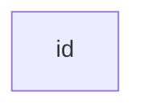
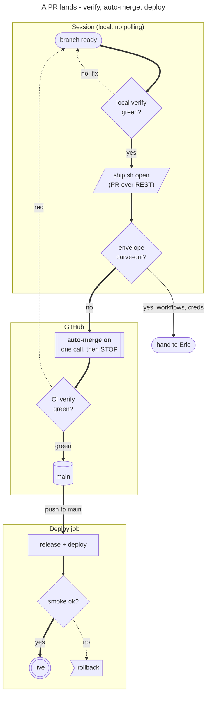

# flowchart — Flowchart (flowchart / graph): v11 @{ shape } syntax, subgraphs, edge variants, markdown strings, ELK/Dagre layout — `flowchart TD` · `flowchart TB` · `flowchart BT` · `flowchart RL` · `flowchart LR` · `graph TD` · `graph TB` · `graph BT` · `graph RL` · `graph LR` · `flowchart-elk TD (legacy alias that selects ELK; still parses in v12, not needed)`

**Status:** stable. Flowchart is Mermaid's core type. What is stable is the syntax. The default look changed in v12.0.0 (npm latest, 2026-09-10): v12 lays out with ELK and draws with the redux-color theme and the neo look. v11 used Dagre, the default theme and the classic look. v11 docs called ELK 'experimental'. The same source therefore lays out differently depending on which version renders it. Version-gated features: @{ shape } syntax v11.3.0+; FA icon packs v11.7.0+; edge-level curve v11.10.0+; collapsible subgraphs v11.17.0+; shapes datastore/folder/bucket/console/browser/person were added after v11.13.0 (present in v11.17.2).
**GitHub (11.17.2):** The flowchart page says nothing about GitHub. What it does imply:
(1) click, callbacks and tooltips only work under securityLevel 'loose', so assume they are dead on GitHub.
(2) Icons need host-registered packs or FontAwesome CSS.
(3) ELK in v11 had to be enabled by the host.
(4) v12 changes the default layout, look and theme, so the same source can render differently.

GitHub's deployed Mermaid version is unknown. The validator here runs v11.13.0, so a green validation is only a proxy for GitHub. To pin GitHub's actual version, preview a ```mermaid block containing only `info` in an issue or PR on github.com; it renders the version string.

Until that is known, keep repo diagrams to features that parse on v11.13:
- classic bracket shapes
- @{ shape } restricted to the v11.13 list (so no person, folder, bucket, console, browser or datastore)
- markdown strings
- edge IDs

Treat collapsed subgraphs and v12-only shapes as unavailable. Everything else: verify on github.com.

## When to reach for it
- PR-body opening picture (the fridge rule) for any dataflow, pipeline or CI change: ship.sh open → auto-merge → deploy, pipeline.yml's verify-vs-deploy split, and the docs-only fast path. docs/PICTURES.md already prescribes `flowchart LR` for 'Dataflow / pipeline'.
- Bot decision paths: persona signal → gates (budget, hardcore, envelope, anti-double-trade) → ticket → fill → journal. Decision diamonds with worded yes/no edges make each gate auditable. Kill and rollback paths go on dotted edges.
- Issue capsules for a zero-context build session: a 5-10 node 'touched path' map showing where the change enters, which gate it passes and what it emits. It gives the builder the topology without prose.
- EARS acceptance criteria: 'When <trigger>, if <condition>, the system shall <response>' maps one-to-one onto trigger node → {condition} → response, with an 'else' edge. The diagram exposes missing else-branches.
- Interrogation call sheet routing: one {diamond} fanning out to verbatim / amended / reject / status-quo, each edge labelled in words, each leaf a different shape.
- Platter PRs: items (@{shape: docs}) → one commit per item → one held PR → Eric merge ([stadium] human hand-off), with carve-outs on a normal edge and the auto-land path thick.
- Governor / coach dispatch cycle: WIP check → gate target → collision check → dispatch athlete in a worktree → PR with auto-merge.
- Research-doc structure arguments (constraint chains, reaction functions), as PICTURES.md already notes; see ai-hardware-constraints-aug-2026.md.
- Stable-type fallback for architecture maps: subgraphs as system or container boundaries, [(cyl)] for stores, [[subroutine]] for services. Use it wherever C4 or architecture-beta cannot be trusted to render on GitHub's unknown version.

**Not for:**
- Lifecycles with guarded transitions (issue proposed → ready → executing → done; SIM/LIVE mode; order states): stateDiagram-v2 says it more honestly, and a flowchart hides which states are resting states.
- Ordered request/response between actors (bot ↔ broker ↔ Alpaca, webhook round-trips): sequenceDiagram. A flowchart loses the time order.
- Quantities over time (a fitness budget ratcheting down week by week, P&L, dead-code counts): xychart or a table. A flowchart of numbers is decorative.
- Research call sheets (call · confidence · why · falsifier): the five-column table is already the picture. Wrapping it in nodes adds nothing and costs width.
- Schemas or data models: erDiagram or classDiagram.
- UI changes: before/after screenshots. A box diagram of a screen is misleading.
- Anything over about 15 nodes, or long LR chains: unreadable at 390px. Split it, or use collapsed subgraphs once the renderer is at v11.17 or later.
- Any diagram where colour (classDef fill) is the only carrier of pass/fail or risk. It violates the colourblind rule, and PICTURES.md bans improvised styling.
- Interactive affordances (click, tooltips, animated edges as the only signal): GitHub renders statically and strict. Links and callbacks will not work there, and motion alone must not carry meaning.

## Header forms
- flowchart LR   (direction one of TB | TD | BT | RL | LR; TD = TB)
- graph LR   (the docs say graph is an alias of flowchart)
- flowchart-elk LR   (legacy; selected ELK before the `layout` key existed)
- ---\ntitle: Node\n---\nflowchart LR
- ---\nconfig:\n  htmlLabels: false\n---\nflowchart LR   (v12/develop form: htmlLabels at top level)
- ---\nconfig:\n  flowchart:\n    htmlLabels: false\n---\nflowchart LR   (v11.12-era form, now deprecated)
- ---\nconfig:\n  markdownAutoWrap: false\n---\ngraph LR
- ---\nconfig:\n  flowchart:\n    curve: stepBefore\n---\ngraph LR
- ---\nconfig:\n  theme: default\n  look: classic\n  layout: dagre\n---\nflowchart LR   (draws v12 output the way v11 did)
- ---\nconfig:\n  layout: elk\n---\nflowchart TD   (v11: ELK is opt-in, and the host must have layout-elk available)
- ---\nconfig:\n  flowchart:\n    defaultRenderer: "elk"\n---   (v11 only; REMOVED in v12; use layout)
- Semicolons at statement end are optional (since 0.2.16). A single space between a vertex and a link is allowed. No space is allowed between a vertex and its text, or between a link and its text.

## Primitives
| Form | Syntax | Note |
|---|---|---|
| bare node | `id` | The id is the displayed text |
| rectangle with text | `id1[This is the text in the box]` | If a node's text is defined more than once, the last one wins. Later edges can omit the text. |
| round edges | `id1(text)` |  |
| stadium | `id1([text])` |  |
| subroutine | `id1[[text]]` |  |
| cylinder / database | `id1[(Database)]` |  |
| circle | `id1((text))` |  |
| asymmetric (flag) | `id1>text]` | No mirrored form exists |
| rhombus / decision | `id1{text}` |  |
| hexagon | `id1{{text}}` |  |
| parallelogram | `id1[/text/]` |  |
| parallelogram alt | `id1[\text\]` |  |
| trapezoid | `A[/Christmas\]` |  |
| trapezoid alt | `B[\Go shopping/]` |  |
| double circle | `id1(((text)))` |  |
| quoted / unicode / special-char label | `id["This ❤ Unicode"]  \|  id1["This is the (text) in the box"]` |  |
| entity-code escapes | `A["A double quote:#quot;"] --> B["A dec char:#9829;"]` | Codes are base-10 (# is #35;). HTML entity names also work. |
| markdown string label | `a("`The **cat**\n  in the hat`")` | Backticks inside double quotes. Supports **bold** and *italic*/_italic_. A literal newline is a line break. Text auto-wraps at wrappingWidth. Works in node, edge and subgraph labels. |
| general shape syntax (v11.3.0+) | `A@{ shape: rect, label: "This is a process" }` | The shape can also be declared inline in an edge: A --> B@{ shape: dbl-circ, label: "done" } (validated). With no label, the id is shown. |
| Process | `@{ shape: rect }` | aliases proc, process, rectangle |
| Event | `@{ shape: rounded }` | alias event |
| Terminal point | `@{ shape: stadium }` | aliases terminal, pill |
| Subprocess | `@{ shape: fr-rect }` | aliases subprocess, subproc, framed-rectangle, subroutine |
| Database | `@{ shape: cyl }` | aliases db, database, cylinder |
| Data store | `@{ shape: datastore }` | alias data-store. Added after v11.13 |
| Folder / Bucket / Console / Browser / Person | `@{ shape: folder }  @{ shape: bucket }  @{ shape: console }  @{ shape: browser }  @{ shape: person }` | folder alias: directory. Added after v11.13; on older renderers they fail with a hard 'No such shape' error |
| Start (circle) | `@{ shape: circle }` | alias circ |
| Bang / Cloud | `@{ shape: bang }  @{ shape: cloud }` | Present in v11.13 |
| Decision | `@{ shape: diam }` | aliases decision, diamond, question |
| Prepare conditional | `@{ shape: hex }` | aliases hexagon, prepare |
| Data I/O lean right | `@{ shape: lean-r }` | aliases lean-right, in-out |
| Data I/O lean left | `@{ shape: lean-l }` | aliases lean-left, out-in |
| Priority action | `@{ shape: trap-b }` | aliases priority, trapezoid-bottom, trapezoid |
| Manual operation | `@{ shape: trap-t }` | aliases manual, trapezoid-top, inv-trapezoid |
| Stop (double circle) | `@{ shape: dbl-circ }` | alias double-circle |
| Text block | `@{ shape: text }` | Text with no border. Usable as a free-floating note |
| Card | `@{ shape: notch-rect }` | aliases card, notched-rectangle |
| Lined/shaded process | `@{ shape: lin-rect }` | aliases lined-rectangle, lined-process, lin-proc, shaded-process |
| Small start | `@{ shape: sm-circ }` | aliases start, small-circle |
| Framed-circle stop | `@{ shape: fr-circ }` | aliases stop, framed-circle |
| Fork/join bar | `@{ shape: fork }` | alias join |
| Collate | `@{ shape: hourglass }` | alias collate |
| Comment brace (left / right / both) | `@{ shape: brace }  @{ shape: brace-r }  @{ shape: braces }` | brace aliases: comment, brace-l |
| Com link | `@{ shape: bolt }` | aliases com-link, lightning-bolt |
| Document | `@{ shape: doc }` | alias document |
| Delay | `@{ shape: delay }` | alias half-rounded-rectangle |
| Direct access storage | `@{ shape: h-cyl }` | aliases das, horizontal-cylinder |
| Disk storage | `@{ shape: lin-cyl }` | aliases disk, lined-cylinder |
| Display | `@{ shape: curv-trap }` | aliases curved-trapezoid, display |
| Divided process | `@{ shape: div-rect }` | aliases div-proc, divided-rectangle, divided-process |
| Extract | `@{ shape: tri }` | aliases extract, triangle |
| Internal storage | `@{ shape: win-pane }` | aliases internal-storage, window-pane |
| Junction | `@{ shape: f-circ }` | aliases junction, filled-circle |
| Lined document | `@{ shape: lin-doc }` | alias lined-document |
| Loop limit | `@{ shape: notch-pent }` | aliases loop-limit, notched-pentagon |
| Manual file | `@{ shape: flip-tri }` | aliases manual-file, flipped-triangle |
| Manual input | `@{ shape: sl-rect }` | aliases manual-input, sloped-rectangle |
| Multi-document | `@{ shape: docs }` | aliases documents, st-doc, stacked-document |
| Multi-process | `@{ shape: st-rect }` | aliases procs, processes, stacked-rectangle |
| Stored data | `@{ shape: bow-rect }` | aliases stored-data, bow-tie-rectangle |
| Summary | `@{ shape: cross-circ }` | aliases summary, crossed-circle |
| Tagged document | `@{ shape: tag-doc }` | alias tagged-document |
| Tagged process | `@{ shape: tag-rect }` | aliases tagged-rectangle, tag-proc, tagged-process |
| Paper tape | `@{ shape: flag }` | alias paper-tape |
| Odd | `@{ shape: odd }` |  |
| Icon node (v11.3.0+) | `A@{ icon: "fa:user", form: "square", label: "User Icon", pos: "t", h: 60 }` | form: square|circle|rounded (omit for no background). pos: t|b (default b). h defaults to 48, which is also the minimum. The icon pack must be registered by the host. |
| Image node (v11.3.0+) | `A@{ img: "https://example.com/image.png", label: "Image Label", pos: "t", w: 60, h: 60, constraint: "off" }` | constraint: on|off (default off). on keeps the aspect ratio from h |
| inline FontAwesome | `B["fa:fa-twitter for peace"]  \|  C("fab:fa-truck-bold a custom icon")` | Prefixes fa, fab, fas, far, fal, fad; fak for paid custom kits. Needs registered packs (v11.7.0+) or FontAwesome CSS on the page |

## Relations
| Form | Syntax | Note |
|---|---|---|
| arrow | `A-->B` |  |
| open link (no head) | `A --- B` |  |
| open link with text | `A-- This is the text! ---B   \|   A---\|This is the text\|B` |  |
| arrow with text | `A-->\|text\|B   \|   A-- text -->B` | Quoted labels work: A -- "yes: workflows, creds" --> H (validated) |
| dotted arrow | `A-.->B` |  |
| dotted arrow with text | `A-. text .-> B` | Quoted form validated: V -. "no: fix" .-> B |
| dotted open | `A -.- B` |  |
| thick arrow | `A ==> B` | Renders at 3.5px (edge-thickness-thick), against 1px for normal edges |
| thick arrow with text | `A == text ==> B` |  |
| thick open | `A === B` |  |
| invisible link | `A ~~~ B` | Layout-only; used to nudge node positions |
| circle head | `A --o B` |  |
| cross head | `A --x B` |  |
| bidirectional | `A o--o B   \|   B <--> C   \|   C x--x D` |  |
| chaining | `A -- text --> B -- text2 --> C` |  |
| fan-out / fan-in with & | `a --> b & c--> d   \|   A & B--> C & D` | The docs advise 'lagom' (not too much): heavy use hurts readability |
| longer link (rank span) | `B ---->\|No\| E   \|   B -- No ----> E` | Each extra character spans one more rank. Normal: --- / ---- / -----; normal arrow: --> / ---> / ---->; thick: === / ==== / =====; thick arrow: ==> / ===> / ====>; dotted: -.- / -..- / -...-; dotted arrow: -.-> / -..-> / -...->. With a mid-link label the extra dashes go on the RIGHT side. The engine may still lengthen links. |
| edge to/from subgraph | `one --> two   \|   three --> two   \|   two --> c2` |  |
| edge ID | `A e1@--> B   \|   A e1@==> B` | Lets later statements address the edge |
| edge animation | `e1@{ animate: true }   \|   e1@{ animation: fast }   (fast\|slow)` | animation: fast is the same as { animate: true, animation: fast } |
| edge-level curve (v11.10.0+) | `e1@{ curve: linear }` | Overrides the diagram-level curve. If an edge is modified more than once, the last modification wins |
| markdown edge label | `c -- "`Bold **edge label**`" --> d` | Markdown renders only inside backticks. A plain quoted "**x**" shows the asterisks literally (validated) |

## Grouping
- subgraph title\n    graph definition\nend
- subgraph ide1 [one]\n    a1-->a2\nend   (explicit id plus display title; the id is what edges and @{ } address)
- subgraph "One" ... end   /   subgraph "`**Two**`" ... end   (quoted title; markdown title)
- Nested subgraphs: subgraph TOP ... subgraph B1 ... end ... end
- direction TB | BT | RL | LR on its own line inside a subgraph sets that subgraph's direction
- LIMITATION: if any node in a subgraph links to something outside it, the subgraph's `direction` is ignored and the parent's direction is inherited. A link to the subgraph id itself (outside --> subgraph1) keeps the direction. Config flowchart.inheritDir (default false) makes subgraphs without an explicit direction inherit the global one.
- Edges may target subgraph ids directly (flowchart type only): A --> TOP --> B
- Collapsible subgraph (v11.17.0+): subgraph one [My Group] ... end then one@{ view: collapsed }. The subgraph draws as a single node carrying its title. Crossing edges are redirected to it, internal edges are dropped, and nested collapses resolve to the outermost collapsed ancestor. view: expanded is the default. The v11.13 renderer accepted the statement and silently rendered the subgraph EXPANDED (validated).
- Practice (from the validated rich example, not stated by the docs): declare nodes inside their subgraph blocks and write edges that cross subgraphs after the blocks, so no node is mentioned first inside the wrong group.

## Annotations
- Title: YAML frontmatter `---\ntitle: ...\n---`. Renders as .flowchartTitleText (validated).
- Edge labels, in two forms: A-->|text|B and A-- text -->B. Also dotted (-. text .->) and thick (== text ==>).
- Comments: `%% text` on its OWN line. Everything after %% to the end of the line is ignored, flow syntax included.
- Note-like shapes (flowchart has no native `note`): A@{ shape: brace, label: "..." } (alias comment), brace-r, braces, or A@{ shape: text, label: "..." } for borderless free text
- No autonumber exists. Number steps inside the labels instead ("1. verify").
- Tooltips and links: click nodeId callback | click nodeId call callback() | click A callback "Tooltip" | click B "https://www.github.com" "tooltip" | click D href "https://www.github.com" "tooltip" _blank. Link targets: _self (default), _blank, _parent, _top. Tooltip style class: .mermaidTooltip. Disabled under securityLevel='strict'; enabled under 'loose'.
- Icons in labels: fa:fa-name, or the icon/img shapes. They depend on the host having icon packs or FontAwesome CSS.

## Emphasis without hue (the colourblind rule)
- Edge weight: `==>` thick (3.5px) for the happy or critical path, against `-->` (1px) for everything else. Measured in the validator SVG.
- Edge pattern: `-.->` dotted for failure, retry, async or return loops. `---` (no head) for association with no flow. `~~~` invisible to separate lanes spatially.
- Arrowhead form: `--x` cross head = blocked/rejected/killed; `--o` circle head = observed/optional; `<-->` two-way.
- Node shape carries the category: {diamond} decision; ([stadium]) human hand-off or terminal; @{shape: dbl-circ} done/live; @{shape: odd} or trap-t exception/manual step; [(cyl)] data or branch; [[subroutine]] scripted step; {{hex}} gate/prepare; @{shape: doc|docs} a document or PR body; @{shape: fork} parallel split/join.
- Label text: edge labels always say the outcome in words (yes/no, green/red, verbatim/amended/reject/status-quo). Never make a reader infer it from colour.
- Markdown strings: "`**bold**`" and *italic* inside a node, edge or subgraph label mark the one item that matters. Backticks are required.
- Unicode glyphs in quoted labels, e.g. "✓ merged", "✗ rolled back", "⚠ carve-out". They read in any colour scheme.
- Subgraph titles as named boundaries or swimlanes (Session / GitHub / Deploy job). Collapsed subgraphs (v11.17+) hide detail but degrade to expanded on older renderers.
- Numbered step labels ("1. verify", "2. open") stand in for the missing autonumber.
- Rank distance: extra dashes (---->) push an outcome visibly further away, e.g. a rare exit.
- Hue-free classDef/style keys: stroke-width:4px and stroke-dasharray: 5 5 (escape commas as \, inside classDef), font-size. Repo rule (docs/PICTURES.md): no style/classDef/init by default, so GitHub can auto-theme light and dark. Use these only from a checked-in, contrast-verified snippet.
- linkStyle N stroke-width:4px (or stroke-dasharray) re-weights one edge without colour. It is fragile: the index is definition order.

## Styling hooks
- style id1 fill:#f9f,stroke:#333,stroke-width:4px
- style id2 fill:#bbf,stroke:#f66,stroke-width:2px,color:#fff,stroke-dasharray: 5 5
- classDef className fill:#f9f,stroke:#333,stroke-width:4px;
- classDef firstClassName,secondClassName font-size:12pt;
- class nodeId1,nodeId2 className;
- A:::someclass --> B   (shorthand; also A:::foo & B:::bar --> C:::foobar)
- classDef default fill:#f9f,stroke:#333,stroke-width:4px;   (applies to every node without a class)
- linkStyle 3 stroke:#ff3,stroke-width:4px,color:red;   (addressed by 0-based order of edge definition)
- linkStyle 1,2,7 color:blue;   /   linkStyle default ...   (default applies to all links)
- Edge classes via edge IDs: A e1@--> B ; classDef animate stroke-dasharray: 9\,5,stroke-dashoffset: 900,animation: dash 25s linear infinite; ; class e1 animate
- External CSS (.cssClass > rect {...}) is silently overridden: Mermaid injects !important styles scoped to the SVG id. Use classDef, or !important on every property (not recommended).
- Diagram curve: config.flowchart.curve. Per edge: e1@{ curve: ... }
- Theme/look: config theme (v12 flowchart default redux-color), look (classic | handDrawn in v11; neo is the v12 flowchart default). Per-type scoping: mermaid.initialize({ flowchart: { theme, look } }) (v12).
- themeVariables: this page names none. The flowchart-relevant keys (e.g. nodeBorder, clusterBkg, clusterBorder, defaultLinkColor, edgeLabelBackground, nodeTextColor, titleColor) live in the theming docs, which I did not read here; verify them there.
- Rendered SVG class hooks seen in the validator output: .edge-thickness-normal|thick|invisible, .edge-pattern-solid|dashed|dotted, .cluster, .edgeLabel, .flowchartTitleText, .edge-animation-fast|slow

## Config keys
- flowchart.curve: basis (default) | bumpX | bumpY | cardinal | catmullRom | linear | monotoneX | monotoneY | natural | step | stepAfter | stepBefore | rounded
- flowchart.nodeSpacing (default 50): spacing on the same rank
- flowchart.rankSpacing (default 50): spacing between ranks
- flowchart.diagramPadding (default 8)
- flowchart.titleTopMargin (default 25)
- flowchart.subGraphTitleMargin: { top, bottom } (default 0/0)
- flowchart.wrappingWidth: markdown-string wrap width. Default 200 in v11.13, 120 in v12/develop
- flowchart.minNodeWidth (default 120): v12/develop only, absent in v11.13
- flowchart.padding (default 15): label-to-shape padding
- flowchart.useMaxWidth (true = scale to container width)
- flowchart.inheritDir (default false): subgraphs without a direction inherit the global one
- flowchart.htmlLabels: DEPRECATED; use top-level htmlLabels, which takes precedence
- flowchart.arrowMarkerAbsolute
- flowchart.defaultRenderer: v11 only (default dagre-wrapper, or elk). REMOVED in v12; use layout
- flowchart.theme / flowchart.look (v12 per-diagram defaults: redux-color / neo)
- top-level layout: dagre (v11 default) | elk (v12 flowchart default); v11 docs also list tidy-tree and cose-bilkent
- top-level elk.*: mergeEdges (false); nodePlacementStrategy SIMPLE|NETWORK_SIMPLEX|LINEAR_SEGMENTS|BRANDES_KOEPF (default); cycleBreakingStrategy GREEDY|DEPTH_FIRST|INTERACTIVE|MODEL_ORDER|GREEDY_MODEL_ORDER (default); forceNodeModelOrder (false); considerModelOrder NONE|NODES_AND_EDGES (default)|PREFER_EDGES|PREFER_NODES
- top-level look: classic | handDrawn (+ neo in v12); handDrawnSeed
- top-level htmlLabels (the docs' markdown examples set it false)
- top-level markdownAutoWrap (default true)
- top-level securityLevel: strict disables click; loose enables it
- top-level maxTextSize (default 50000 chars) and maxEdges (default 500)
- per-node @{ }: shape, label, icon, form, pos, h, w, img, constraint
- per-edge @{ }: animate, animation (fast|slow), curve
- per-subgraph @{ }: view (collapsed|expanded)
- legacy JS: mermaid.flowchartConfig = { width: ... } (Width section)

## Gotchas — what silently breaks
- Lowercase `end` as a node id or label breaks the parser. Validated on v11.13: `a --> end` gives 'Parse error ... got end'. Capitalise it (End/END) or put it in quotes: A["end of day (EOD)"] validated OK.
- A link followed by a node whose name starts with o or x becomes a circle/cross edge: A---oB is a circle edge and A---xB is a cross edge. Add a space or capitalise (dev--- ops, dev---Ops).
- Parentheses, brackets, braces, colons and other punctuation in labels must go inside double quotes: id1["This is the (text) in the box"]. Escape a double quote as #quot; and use #NNN; decimal codes or HTML entity names.
- Unicode text must be quoted: id["This ❤ Unicode"].
- Markdown renders ONLY in "`...`" strings. A plain "**x**" shows literal asterisks (validated). <br> works in normal labels with htmlLabels on; in markdown strings, use a real newline (leading indentation is stripped, validated).
- Unknown @{ shape } names are a HARD render error on older renderers: v11.13 says 'No such shape: person' (validated). person, folder, bucket, console, browser and datastore arrived after v11.13.
- Unknown or unsupported @{ } keys are SILENTLY ignored. On v11.13, `view: collapsed` parsed but rendered the subgraph expanded (validated). A feature can therefore degrade silently rather than fail.
- The v12 defaults (ELK, redux-color, neo) change the layout and look of unchanged source. v11-only config (flowchart.defaultRenderer) was removed in v12. flowchart.htmlLabels is deprecated in favour of top-level htmlLabels.
- In v11 ELK was 'experimental' and had to be enabled in the host's lazy-loading configuration (v9.4+). The layout-elk package must be present, otherwise `layout: elk` cannot take effect.
- Subgraph `direction` is ignored as soon as any inner node links outside the subgraph.
- Comments must sit on their own line and start with %%. A trailing %% after a statement is not the documented form.
- linkStyle addresses edges by definition order (0-based). Inserting or reordering an edge silently restyles the wrong one. Prefer edge IDs (e1@-->) plus class.
- In classDef/style values, commas are delimiters, so escape them as \, (for example stroke-dasharray: 9\,5). Space-separated dash values (5 5) avoid the problem.
- External CSS is overridden by Mermaid's scoped !important rules.
- click/callback/tooltips need securityLevel loose. Under strict (typical for hosted renderers) they do nothing.
- No space is allowed between a vertex and its text or between a link and its text. Semicolons are optional.
- When a link label sits mid-link, extra length dashes go on the right side (B -- No ----> E). Requested lengths are minimums the engine may exceed.
- The asymmetric shape id>text] has no mirrored form.
- Too many `&` chains make the source unreadable ('lagom').
- Size caps: maxTextSize 50000 characters and maxEdges 500 by default. Beyond those the diagram does not render.
- Icons (fa:, icon shape) need host-registered packs or FontAwesome CSS. Without them, the text or placeholder shows.
- Phone fit (from the validated rich example): 12 nodes in TD rendered 519px wide by 1737px tall, so on a 390px screen it scales to about 75%. Keep labels short, prefer TD over long LR chains, and cap nodes at about 12-15.

## Starters (validated mcp__Mermaid_Chart__validate_and_render_mermaid_diagram. Its renderer reports Mermaid v11.13.0 (an `info` diagram returned 'v11.13.0') and uses dagre with the classic look and default theme.; minimal ✓, rich ✓ — None for minimal or rich. Rich renders 3 subgraphs and 12 nodes, with thick-solid, normal-solid and normal-dotted edge classes present; 519x1737px. Probes run to ground the gotchas: `a --> end` gives a parse error; @{ shape: person } gives 'No such shape: person' (hard fail); one@{ view: collapsed } is accepted but ignored (rendered expanded); edge id + e1@{ animate: true } is OK; quoted edge labels on dotted/thick edges are OK; "**x**" without backticks renders literal asterisks; a backtick markdown string renders <strong>/<em>.)

Minimal:



Rich (grounded in this repo):



## Sources
- https://raw.githubusercontent.com/mermaid-js/mermaid/develop/packages/mermaid/src/docs/syntax/flowchart.md (read in full, all 1494 lines)
- https://raw.githubusercontent.com/mermaid-js/mermaid/mermaid%4011.12.0/packages/mermaid/src/docs/syntax/flowchart.md (diffed against develop to separate v11 from v12 content)
- https://raw.githubusercontent.com/mermaid-js/mermaid/develop/packages/mermaid/src/rendering-util/rendering-elements/shapes.ts (the shapes table behind the page's virtual:shapesTable include)
- https://raw.githubusercontent.com/mermaid-js/mermaid/mermaid%4011.13.0/packages/mermaid/src/rendering-util/rendering-elements/shapes.ts and .../mermaid%4011.17.2/... (shape availability by version)
- https://raw.githubusercontent.com/mermaid-js/mermaid/develop/packages/mermaid/src/schemas/config.schema.yaml (FlowchartDiagramConfig)
- https://raw.githubusercontent.com/mermaid-js/mermaid/mermaid%4011.13.0/packages/mermaid/src/schemas/config.schema.yaml (v11.13 flowchart, layout, elk, look, htmlLabels, maxTextSize, maxEdges)
- https://raw.githubusercontent.com/mermaid-js/mermaid/mermaid%4011.13.0/packages/mermaid/src/docs/config/layouts.md
- https://registry.npmjs.org/mermaid (latest 12.0.0, 2026-09-10; 11.x release dates)
- /home/user/skynet-capital/docs/PICTURES.md (house rules: stable types only, no init/classDef by default)
- /home/user/skynet-capital/scripts/ship.sh and /home/user/skynet-capital/.github/workflows/pipeline.yml (grounding for the rich example)
