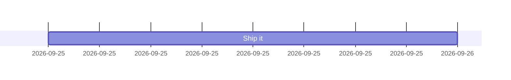
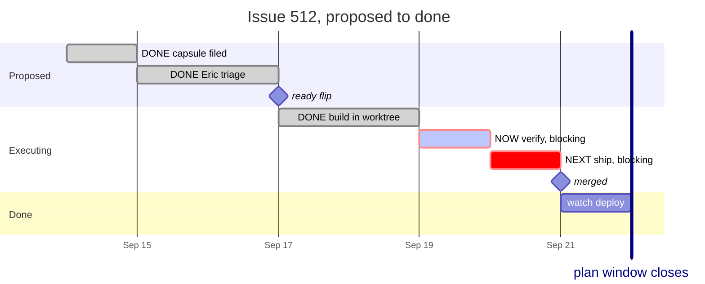

# gantt: Gantt diagrams (https://mermaid.js.org/syntax/gantt.html). Covers sections, tasks, dates, durations, after/until dependencies, milestones, vertical markers, done/active/crit tags, excludes/weekend, dateFormat/axisFormat, tickInterval/weekday, compact mode, today marker, comments, styling, configuration, click interaction and examples. — `gantt`

**Status:** stable. It is a core type with no -beta suffix and a long history, though the docs page never labels its status. Some features are version-gated: tickInterval v10.3.0+ (millisecond/second support also v10.3.0), `until` v10.9.0+, `weekend friday|saturday` v11.0.0+. `vert` markers have their own docs section, but the page's own Examples block still comments "%% not yet official". `vert` is in the tag list of the pinned 11.17.2 bundle (ganttDiagram chunk: tags = ["active","done","crit","milestone","vert"]) and it renders in the MCP validator.
**GitHub (11.17.2):** The docs say nothing about GitHub specifically; verify on github.com. Repo facts (docs/PICTURES.md, scripts/mermaid-lint.mjs): GitHub renders Mermaid 11.17.2, and the repo pins that version for lint. In 11.17.2, gantt has `until` (10.9+), `weekend` (11.0+), tickInterval with ms/s (10.3+) and `vert` (confirmed in the pinned bundle's tag list). `click` href/call is dead on GitHub (strict security; the docs say click is disabled under securityLevel strict) and the house lint notes it. theme/themeVariables fail the house lint, so the default colours are what GitHub shows. How crit (red) and done (lightgrey) render in GitHub dark mode is unverified. The today marker uses the viewer's clock. Layout width comes from the container at render time, so desktop and phone browsers get different bar widths. The GitHub mobile app does not render Mermaid at all; a phone browser does.

## When to reach for it
- Retros (the retro skill and docs/LESSONS.md): 'measure how long detection took' is a duration. Draw the incident as a `vert`, the undetected drift and the time-to-fix as bars, and the fix merge as a `milestone`. Detection latency then reads as bar length at a glance.
- Plan issues and multi-slice programs (docs/plans, AUTONOMY-PLAN.md, GAMEBOARD-PLAN.md, the /work-issues burn-down): slices as tasks chained with `after`, gates (Eric flips ready, merge, deploy) as milestones, a hard date as `vert`, and phases as sections. It is the only Mermaid type that puts 'when' and 'what waits on what' on one time axis.
- Earnings-cycle and options research (the symbol-sweep skill, docs/research): a trade's life around events. Earnings date and option expiry as `vert`; the IV run-up window, entry, hold and exit windows as bars; playbook S1/S2/E1 windows per symbol as sections. This suits the call sheet's 'why' when timing IS the thesis.
- Intraday bot trade flow with dateFormat HH:mm and axisFormat %H:%M: signal → recommendation → ticket → fill → exit, with market open or close as `vert`. It shows latency and the holding period, not the message order (sequenceDiagram owns order).
- CI and deploy latency breakdowns (ci-install-duration-budget, latency-scan): stages as bars with `after`, showing which step dominates wall-clock time.
- Platter PR landing log: one row per item commit and one milestone per merge, useful only when timing or overlap between items is the point.
- Routine and governor cadence: which cron Routines or coach dispatches overlap in a day (collision spotting).

**Not for:**
- Anything without a real time axis: architecture (C4 / architecture-beta), dataflow (flowchart), EARS acceptance criteria, call sheets, interrogation verdict shapes. A gantt there invents dates.
- Issue or PR lifecycles where only the STATES matter, not durations. stateDiagram-v2 shows guarded transitions; a gantt implies a schedule the event-driven autonomy loop does not keep. Fake dates are misleading precision.
- Budget ratchets and metric trends (fitness budgets ratcheting down over weeks). The value is the y-axis, so use xychart-beta. The docs' 'bar chart via dateFormat X' hack is decorative next to xychart.
- Any chart whose meaning rests on done/active/crit colouring alone: it fails the red/green colorblind reader.
- Long horizons with short tasks, or more than about 15 rows. At 390px the plot area is about 240px, so bars collapse to slivers and labels pile up outside them.
- PR fridge pictures for single-step changes: one or two bars say less than one sentence.
- Charts that depend on the today marker or on `click` links: the marker changes daily for a record, and click is dead on GitHub.

## Header forms
- gantt  (must be lowercase: the detector regex is /^\s*gantt/ in 11.17.2. Keywords inside the body are case-insensitive.)
- ---
title: Plan title
---
gantt  (the docs say a frontmatter title is ignored if the chart body has its own `title` line)
- ---
displayMode: compact
---
gantt  (top-level displayMode works; the docs example says it is 'gantt specific setting but works at this level too')
- ---
config:
  gantt:
    topAxis: true
    displayMode: compact
    axisFormat: '%b %d'
    tickInterval: 1week
    numberSectionStyles: 2
---
gantt
- %%{init: {"gantt": {"topAxis": true}}}%%
gantt  (legacy directive; deprecated upstream, and the house lint flags it with a note)
- In-body directive lines (any order, before or between tasks): title <text> | dateFormat <dayjs fmt> | axisFormat <d3 fmt> | tickInterval <N><unit> | excludes <tokens> | includes <tokens> | weekend friday|saturday | weekday monday..sunday | todayMarker off|<css> | topAxis | inclusiveEndDates | accTitle: .. | accDescr: .. | accDescr { .. }. The page does not document `includes`, `topAxis` (as a statement) or `inclusiveEndDates`; they come from the jison grammar.

## Primitives
| Form | Syntax | Note |
|---|---|---|
| task: explicit start and end | `Label :id, 2026-09-14, 2026-09-16` | A colon separates the title from the metadata, and commas separate metadata items. With 3 items the first is the id. Dates are parsed with dateFormat. |
| task: start plus length | `Label :id, 2026-09-14, 3d` | End = start + length, then pushed right by any excluded days inside the span. |
| task: chained (implicit start) | `Label :3d   or   Label :2026-09-20` | Tasks are sequential by default: with 1 item, the start is the end of the preceding task in declaration order, and the item is either an end date or a length. |
| task: after dependency | `Label :id, after a b c, 2d` | Starts at the LATEST end of the referenced tasks. IDs are space-separated. |
| task: until | `Label :id, 2026-09-14, until m1   \|   Label :after a, until m1   \|   Label :until m1` | Ends at the START of the referenced task or milestone (v10.9.0+). |
| task: no id (2-item forms) | `Label :2026-09-14, 3d  \|  Label :after a, 2026-09-20  \|  Label :after a, 2d` | Other tasks cannot reference it (after/until need an id). |
| status tags | `Label :done, id, 2026-09-14, 1d  \|  :active, ...  \|  :crit, ...  \|  :crit, done, ...  \|  :active, crit, ...` | Valid tags are active, done, crit, milestone and vert. Tags are optional but must come FIRST in the metadata. Combinations render as activeCrit / doneCrit classes. |
| milestone | `Merged :milestone, m1, 2026-09-20, 0d` | A single instant drawn as a rotated square (diamond) with an italic label. Position = initial date + duration/2. Anything that references it with after/until needs both an id and a duration. |
| vertical marker | `Deadline :vert, v1, 2026-09-22, 0d` | A full-height vertical line with its label at the bottom. It takes no row and is filtered out of row layout. |
| duration units | `500ms 30s 30m 4h 3d 2w 1M 1y 1.5d` | Case matters: m = minutes, M = months. Decimals are allowed. An invalid token (3dX) gives a zero-length task silently. |
| title | `title Adding GANTT diagram functionality` | Optional, centred at the top. |
| bar-chart hack (docs example) | `dateFormat X axisFormat %s section Issue19062 71 : 0, 71` | Unix-timestamp input turns bars into plain magnitudes. |

## Relations
| Form | Syntax | Note |
|---|---|---|
| implicit sequence | `A :a1, 2026-09-14, 2d B :1d` | B starts where the preceding declared task ends. No arrow is drawn. |
| after (finish-to-start, multi-parent) | `C :c, after a b, 1d` | Start = max(end of a, end of b). Gantt NEVER draws dependency lines; the relation shows only as bar alignment. |
| until (end-at-start-of) | `D :d, after a, until m1` | End = start of m1 (v10.9.0+). Unknown ids only log a console warning. |
| excluded-day stretch | `excludes weekends T :t, 2026-09-18, 3d` | Excluded days INSIDE a task push its end to the right; the bar has no gap. Excluded days BETWEEN consecutive tasks show as a blank shaded gap. |
| click link / callback (interaction, not an edge) | `click taskId href "https://..." click taskId call cb("a", "b")` | Needs securityLevel 'loose'; disabled under 'strict'. Dead on GitHub (the house mermaid-lint notes it). |

## Grouping
- section <Name>: the only grouping construct. The name is required and runs to the end of the line. It draws a full-width background band and a gutter label on the left. Band styles alternate across numberSectionStyles (default 4).
- Section names accept   line breaks: the renderer splits on lineBreakRegex into tspans. This is the only way to fit a long name into the 75px gutter.
- Tasks declared before any `section` fall into an unnamed section with a blank gutter label.
- Compact mode (displayMode: compact in frontmatter or config.gantt.displayMode): non-overlapping tasks in one section share a row. Overlaps stack into extra rows.

## Annotations
- title <text> (in the body), or `title:` in frontmatter (the body title wins)
- %% comment: must be on its own line. The docs say any text after %% up to the newline is ignored, including diagram syntax.
- accTitle: <text> / accDescr: <text> / accDescr { multi-line }: accessibility metadata, in the grammar
- vert: labelled full-height marker for deadlines, events or checkpoints
- milestone: diamond with italic label
- todayMarker: an automatic line at the READER's current date. Hide it with `todayMarker off`, or restyle it with `todayMarker stroke-width:5px,stroke:#0f0,opacity:0.5` (commas become semicolons as inline CSS).
- topAxis (statement or config.gantt.topAxis): repeats the date labels along the top
- click taskId href URL / click taskId call fn(args): links and callbacks (securityLevel loose only)

## Emphasis without hue (the colourblind rule)
- WARNING: every gantt status tag is hue-only or lightness-only in the default theme (rendered CSS). crit = red fill + #ff8888 stroke; active = light-blue fill; done = lightgrey fill + grey stroke. All share stroke-width 2 with normal tasks. A red/green colorblind reader cannot reliably tell crit from a normal task, so NEVER let a tag carry the meaning alone.
- Put the status in the label text: prefix DONE / NOW / NEXT and a word such as 'blocking' or 'critical' (e.g. `NOW verify, blocking :active, crit, ver, after bld, 1d`). Task titles may contain commas and parentheses but not colons.
- Shape: `milestone` draws a diamond and an italic label, the one built-in non-bar glyph. Use it for gates (ready flip, merge, deploy).
- Line: `vert` draws a full-height vertical rule with a text label. Use it for deadlines, expiry, the incident moment, or 'window closes'.
- Grouping: section names (with  ) carry the phase (Proposed / Executing / Done). Position within a band is read by eye, not by colour.
- Geometry is the message: bar length = duration and horizontal offset = waiting time. A gap or a long bar reads in greyscale.
- Row order: declaration order is row order, so put the critical path first or group it in its own section named 'critical path'.
- todayMarker can be restyled achromatically (`todayMarker stroke-width:4px,stroke-dasharray:4 2`), but on a record it moves every day, so prefer `todayMarker off`.
- Possible but not house-legal: themeCSS such as `.crit0,.crit1,.crit2,.crit3{stroke-dasharray:4 2;stroke-width:3}` would give crit a dashed outline. It improvises styling that PICTURES.md forbids, and it is unverified on GitHub.

## Styling hooks
- No classDef / style / linkStyle / ::: in gantt. Styling is CSS classes plus themeVariables only.
- CSS classes (from gantt/styles.js): .grid .tick, .grid path, .grid .tick text, .titleText, .section0-.section3, .sectionTitle0-3, .task0-3, .taskText0-3, .taskTextOutside0-3, .taskTextOutsideLeft, .taskTextOutsideRight, .active0-3, .activeText0-3, .done0-3, .doneText0-3, .crit0-3, .activeCrit0-3, .doneCrit0-3, .activeCritText0-3, .doneCritText0-3, .milestone, .milestoneText, .vert, .vertText, .today, .exclude-range, .task.clickable, .taskText.clickable
- Each task rect's DOM id is its task id (e.g. #item36), so themeCSS can target one bar. Docs example: themeCSS: " #item36 { fill: CadetBlue } " under frontmatter config.
- Gantt themeVariables: taskBkgColor, taskBorderColor, taskTextColor, taskTextLightColor, taskTextDarkColor, taskTextOutsideColor, taskTextClickableColor, activeTaskBkgColor, activeTaskBorderColor, doneTaskBkgColor, doneTaskBorderColor, critBkgColor, critBorderColor, sectionBkgColor, sectionBkgColor2, altSectionBkgColor, excludeBkgColor, gridColor, todayLineColor, vertLineColor, titleColor, textColor, fontFamily
- Inline todayMarker CSS string (the one per-element style statement in the grammar)
- HOUSE RULE (docs/PICTURES.md, scripts/mermaid-lint.mjs): theme/themeVariables in frontmatter or %%{init}%% FAIL the lint, and no hand-picked hex is allowed. In practice that leaves the gantt default palette only. Improvised themeCSS is outside the house rule's spirit, and GitHub support for it is unverified.

## Config keys
- gantt.titleTopMargin (int, default 25)
- gantt.barHeight (int, 20)
- gantt.barGap (int, 4)
- gantt.topPadding (int, schema default 50; the docs sample shows 75)
- gantt.leftPadding (int, 75): width of the section-name gutter
- gantt.rightPadding (int, 75)
- gantt.gridLineStartPadding (int, schema 35; docs sample 10)
- gantt.fontSize (int, schema 11; docs sample 12)
- gantt.sectionFontSize (int|string, schema 11; docs sample 24)
- gantt.numberSectionStyles (int, schema 4; docs sample 1): number of alternating section band styles
- gantt.axisFormat (string, '%Y-%m-%d'): d3-time-format tokens
- gantt.tickInterval (string matching /^([1-9][0-9]*)(millisecond|second|minute|hour|day|week|month)$/)
- gantt.topAxis (bool, false)
- gantt.displayMode ('' | 'compact', default '')
- gantt.weekday (monday..sunday, default sunday): start day for week-based ticks
- gantt.useMaxWidth (bool, from BaseDiagramConfig)
- gantt.useWidth (number): read at render time in 11.17.2 to override the container width. It appears in the docs' frontmatter example but is NOT in config.schema.yaml.
- In-body equivalents: dateFormat, axisFormat, tickInterval, excludes, includes, weekend, weekday, todayMarker, topAxis, inclusiveEndDates (makes explicit end dates inclusive; grammar-only)
- DOCS ERROR: the 'Possible configuration params' table lists mirrorActor and bottomMarginAdj. Those are sequence-diagram keys, not gantt keys.

## Gotchas — what silently breaks
- VERIFIED (pinned 11.17.2 parse): a task title that starts with a YYYY-MM-DD date is a PARSE ERROR (`2026-09-14 kickoff :1d` → got 'date'). The lexer matches the date token before task text.
- VERIFIED (render): a colon inside a task title silently truncates it. `PR 1: verify :2026-09-14, 1d` renders as 'PR 1'. Titles are [^:\n]+.
- VERIFIED (render): body keywords are case-insensitive, so a task line starting with a keyword plus a space is swallowed. `Section review :2026-09-14, 1d` became a SECTION named 'review :2026-09-14, 1d' and the task vanished. The same applies to title, excludes, includes, dateFormat, axisFormat, tickInterval, todayMarker, weekday X, weekend X, topAxis, inclusiveEndDates and gantt.
- VERIFIED (parse): a task named `click ...` is a parse error (click is an interaction keyword). `end` is NOT reserved in gantt.
- VERIFIED (parse): `#` inside task metadata ends the token, so `fill :done, f1, 2026-09-14, 1d #512` is a parse error. Keep issue numbers like #512 out of task lines. They are fine in `title` and in task titles before the colon. The same [^#\n;] cut applies to dateFormat, axisFormat, tickInterval and excludes.
- `;` also ends task metadata. Text after it becomes the NEXT task's title (it parses, but you get a junk row).
- VERIFIED (render): a trailing `%% note` after task metadata silently gives that task ZERO duration (width 0), and every `after` chain shifts. Comments must sit on their own line, yet the docs' own Timeline example uses trailing %% comments.
- Tags must come first in the metadata; a misplaced tag is read as an id or date.
- Invalid durations or dates do not error. The task gets zero length with only a console warning ('neither a valid date ... nor a valid duration'). Unknown ids in after/until also only warn.
- dateFormat (INPUT, dayjs tokens: YYYY-MM-DD, HH:mm, X) and axisFormat (OUTPUT, d3 tokens: %Y-%m-%d, %H:%M, %b %d) use DIFFERENT token syntaxes.
- VERIFIED (render): the default axisFormat %Y-%m-%d on a short or intraday span repeats identical labels. The 1-day minimal chart drew nine ticks all reading '2026-09-25'. Set axisFormat (e.g. %H:%M) and tickInterval to match the span.
- tickInterval accepts only millisecond|second|minute|hour|day|week|month. `1decade`/`1year` are silently ignored (the docs say so, and it parses). More than 10,000 estimated ticks means the custom interval is skipped.
- `excludes weekdays` is not supported; it parses and is silently ignored. Excludes accept YYYY-MM-DD dates, day names ('sunday') and 'weekends'. Multiple excludes lines concatenate. Exclude shading is skipped entirely when the chart spans more than 5 years.
- Today marker = `new Date()` at the reader's render time. On a historical PR or record it lands wherever 'today' is, possibly off the timeline, and moves every day. Use `todayMarker off` for records.
- Width = container width at render time (the MCP validator rendered at 300px). Plot area = width - leftPadding - rightPadding (150px by default). At 390px a 9-day plan gave 18-38px bars and every label spilled outside its bar (verified in the rich render). Section names longer than about 75px overlap the bars unless broken with  .
- Gantt draws no dependency arrows. `after` only positions bars, so a reader cannot see WHICH task gated another unless the ids are echoed in the labels.
- Milestone x-position = start + duration/2, not start.
- The docs table says 'later <taskID>'; that is a typo for `after`.
- The docs' ganttConfig sample values disagree with the schema defaults (topPadding 75 vs 50, gridLineStartPadding 10 vs 35, fontSize 12 vs 11, sectionFontSize 24 vs 11, numberSectionStyles 1 vs 4).
- The header must be lowercase `gantt`: detector /^\s*gantt/.
- Unicode in titles was not probed; stick to ASCII punctuation in task lines.

## Starters (validated mcp__Mermaid_Chart__validate_and_render_mermaid_diagram (valid:true, diagramType gantt for both; the rich example rendered at a 300px viewBox with classes done0, milestone, activeCrit1, crit1 and vert as intended). Also cross-checked with the repo's scripts/mermaid-lint.mjs --stdin --json, which parses with the pinned mermaid 11.17.2 = GitHub's version: both examples ok, problems []. The gotcha probes were run through the same two tools.; minimal ✓, rich ✓ — none for the two examples. The deliberate gotcha probes failed as expected under 11.17.2: a date-leading title ('got date'), `#` in metadata ('Expecting taskData, got NL'), and a `click`-named task ('Expecting callbackname, href').)

Minimal:

Rich (grounded in this repo):

## Sources
- https://raw.githubusercontent.com/mermaid-js/mermaid/develop/packages/mermaid/src/docs/syntax/gantt.md (read in full)
- https://mermaid.js.org/syntax/gantt.html (rendered from the same markdown; not fetched separately)
- https://raw.githubusercontent.com/mermaid-js/mermaid/develop/packages/mermaid/src/diagrams/gantt/styles.js
- https://raw.githubusercontent.com/mermaid-js/mermaid/develop/packages/mermaid/src/diagrams/gantt/parser/gantt.jison
- https://raw.githubusercontent.com/mermaid-js/mermaid/develop/packages/mermaid/src/diagrams/gantt/ganttDb.js
- https://raw.githubusercontent.com/mermaid-js/mermaid/develop/packages/mermaid/src/schemas/config.schema.yaml (GanttDiagramConfig)
- /home/user/skynet-capital/node_modules/mermaid/dist/chunks/mermaid.core/ganttDiagram-EL5Y4UJY.mjs (pinned 11.17.2: renderer width, tick cap, today marker, section  , exclude 5-year cap)
- /home/user/skynet-capital/docs/PICTURES.md
- /home/user/skynet-capital/scripts/mermaid-lint.mjs
