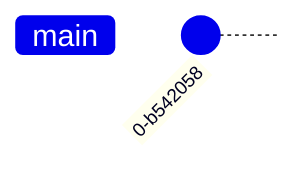
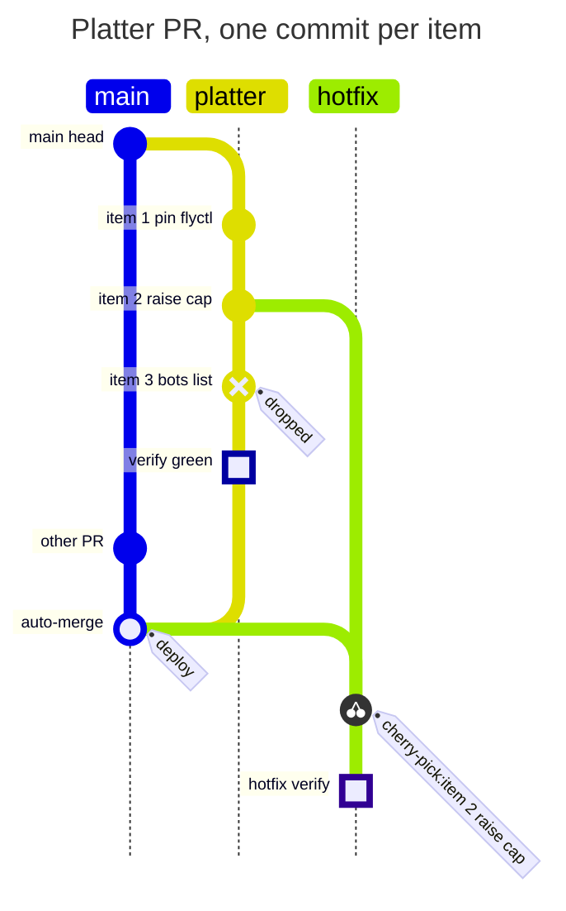

# gitgraph (https://mermaid.js.org/syntax/gitgraph.html). Git graph: commit, branch, checkout/switch, merge, cherry-pick; commit id, tag and type; orientation (LR/TB/BT); parallel commits; themes and theme variables — `gitGraph` · `gitGraph:` · `gitGraph LR:` · `gitGraph TB:` · `gitGraph BT:`

**Status:** stable. The docs carry no beta or experimental marker, and the keyword has no -beta suffix. Some features are version-gated: LR:/TB: orientation needs v10.3.0+, BT: needs v11.0.0+, parallelCommits needs v10.8.0+. The redux/redux-color/neo themes are recent (the develop docs list redux-color as the default theme, but the Mermaid Chart MCP renderer still used the classic 'default' palette).
**GitHub (11.17.2):** The gitgraph docs page says nothing about GitHub rendering or integration. Verify on github.com. Keep to the conservative subset: plain `gitGraph` or `gitGraph TB:` (v10.3+). Avoid `BT:` (v11+), `parallelCommits` (v10.8+) and the redux*/neo* themes, because GitHub's Mermaid version is unknown. No init block or themeVariables (per PICTURES.md dark-mode rule). The diagram has no click or interaction features, so nothing is lost on GitHub. accTitle and accDescr validated on the MCP renderer; their support on GitHub is unverified.

**Measured on 11.17.2 (2026-09-26, the round-3 design session):** commit connectors are a fixed 8 px, the diagram takes no `classDef`, its theme is locked, and long plain-word branch names overlap the `main` label. Retired for the held-PR story (`docs/PICTURES.md` → the held PR starter, rule 10); keep it for branch topology with few, short-named branches, vertical (`TB:`, `rotateCommitLabel: false`) on a phone.

## When to reach for it
- Platter PRs (one commit per item): each item is a commit on a `platter` lane, a dropped or rejected item is a REVERSE commit tagged 'dropped', the verify gate is a HIGHLIGHT commit, and the auto-merge into main carries a 'deploy' tag. The picture is the PR's structure.
- PR lifecycle, verify, auto-merge, deploy: a branch, a HIGHLIGHT verify commit, a merge with id 'auto-merge' and tag 'deploy'. Useful as a fridge-rule picture on ship and merge-policy PRs.
- Governor or grind cycles: several athlete worktree branches forking from main and landing one by one. Shows parallelism and landing order.
- Retros and LESSONS.md incident timelines about git history: the change lands (tag 'deploy'), the regression shows up, a revert as a REVERSE commit, then a fix commit. Also hotfix cherry-picks onto a hotfix lane.
- Explaining branching or merge policy (protected paths board the platter while ordinary work auto-merges) in docs such as COACHES.md and MONEYPENNY.md, and in the ship skill.

**Not for:**
- Anything that isn't git history. An issue moving proposed to ready to executing to done is a stateDiagram-v2. A bot recommending a trade, then a ticket, then a fill is a sequenceDiagram. App architecture is C4 or a flowchart. A fitness budget ratcheting over weeks is an xychart or timeline. The branch/merge metaphor would suggest forks and merges that don't exist.
- A research call sheet or interrogation verdicts (verbatim/amended/reject/status-quo): these are tables, not topology.
- Routine single-commit PRs: one dot on one lane is decorative. Use the waiver.
- Real histories with more than about 15 commits or 8 lanes: unreadable at 390px, and lane colors repeat.
- Showing real SHAs or auto ids: noise, and banned by the legibility budget.
- Using lane or highlight color to mean pass/fail: it fails the colorblind reader. Use type shapes and tags instead.

## Header forms
- gitGraph
- gitGraph:
- gitGraph :   (grammar: 'gitGraph' ':' with whitespace allowed)
- gitGraph LR:   (explicit default, v10.3.0+)
- gitGraph TB:   (v10.3.0+)
- gitGraph BT:   (v11.0.0+)
- ---\ntitle: Example Git diagram\n---\ngitGraph
- ---\ntitle: T\nconfig:\n  theme: 'base'\n  gitGraph:\n    showBranches: true\n    showCommitLabel: true\n    mainBranchName: 'main'\n    mainBranchOrder: 0\n    rotateCommitLabel: false\n    parallelCommits: false\n  themeVariables:\n    git0: '#hex'\n---\ngitGraph TB:
- %%{init: {'gitGraph': {'showBranches': false}}}%%\ngitGraph   (legacy directive form. The docs say 'use directives or the initialize call'. The grammar treats %%{...}%% as a hidden terminal.)

## Primitives
| Form | Syntax | Note |
|---|---|---|
| commit (bare) | `commit` | Adds a commit to the current branch. Every graph starts on 'main' (or mainBranchName), which is the current branch at the start. The auto id is '<seq>-<7 random chars>', and it is drawn as the label. |
| commit with custom id | `commit id: "Alpha"` | The value must be a quoted string, "..." or '...'. It becomes the visible label and the handle that cherry-pick uses. |
| commit type | `commit type: NORMAL \| commit type: REVERSE \| commit type: HIGHLIGHT` | Unquoted, uppercase. NORMAL (default) draws a solid circle, REVERSE a crossed solid circle, HIGHLIGHT a filled rectangle. |
| commit tag | `commit tag: "v1.0.0"` | Draws a tag-shaped flag (a box with a hole). The grammar allows repeated tag: attributes (tags+=), which stack. Only single tags appear on the page. |
| commit attributes combined | `commit id: "Reverse" type: REVERSE tag: "RC_1"` | Attributes can appear in any order and in any combination. The docs also write `commit type: HIGHLIGHT id:"Denver"`, and the space after the colon is optional (id:"A"). |
| commit message (grammar-only) | `commit msg: "text"   or   commit "text"` | The langium grammar accepts this, but the renderer never draws the message (the label is commit.id). It is not documented on the page. Don't use it to carry meaning. |
| branch | `branch develop   \|   branch "cherry-pick"   \|   branch feat/x.y` | Creates a branch AND switches to it. The name must be unique. Unquoted names follow /\w([-./\w]*[-\w])?/, so dashes, dots and slashes are fine, but a name can't end in . or /. Quote names that look like keywords or contain spaces. |
| branch with order | `branch test1 order: 3` | An integer lane position. See the grouping entries for how ordering works. |
| checkout / switch | `checkout develop   \|   switch develop` | Sets the current branch. The two keywords are interchangeable. A name that doesn't exist causes an error. |
| merge | `merge develop` | Joins the head of the named branch into the current branch's head and creates a merge commit, drawn as a filled double circle. |
| merge with attributes | `merge nice_feature id: "customID" tag: "customTag" type: REVERSE` | id, tag and type work as they do on commits. A custom merge id must be unique, or it throws. |
| cherry-pick | `cherry-pick id: "MERGE" parent: "B"   \|   cherry-pick id: "A"   \|   cherry-pick id: "A" tag: "custom"` | Adds a new commit on the current branch, drawn with a cherry glyph and an auto tag 'cherry-pick:<id>' (plus '|parent:
' when the source is a merge). A custom tag: replaces the auto tag. parent: is required when the source is a merge commit. |

## Relations
| Form | Syntax | Note |
|---|---|---|
| lane continuation (implicit) | `commit  (successive commits on the same current branch)` | Draws a parent-to-child connector along the branch lane. You never write an edge explicitly, because edges come only from commands. |
| fork | `branch <name>` | The new lane starts from the current head, and a curved connector runs from the parent commit to the first commit on the new branch. |
| merge (two-parent join) | `merge <branch> [id: ".."] [tag: ".."] [type: ..]` | Connects the other branch's head to a merge commit on the current branch. The merge commit has parents [current head, other head]. |
| cherry-pick (copy link) | `cherry-pick id: "<commitId>" [parent: "<immediateParentId>"]` | Connects the source commit on another branch to a new cherry-pick commit on the current branch. Its parents are [current head, source]. |
| checkout (no edge) | `checkout <branch> / switch <branch>` | Changes which lane the next commit lands on. It draws nothing. |
| temporal vs parallel spacing | `config.gitGraph.parallelCommits: true\|false` | false (default) places commits by the order they were declared, so time reads along the axis. true places commits by distance from their parent, so commits the same number of steps from a shared parent line up. |

## Grouping
- Branches as lanes are the only grouping construct. There are no subgraphs, boxes or sections.
- Lane order: main is first by default (order 0). Next come branches without `order:`, in the order they were declared. Last come branches with `order: N`, sorted by N. Set `order:` on every branch to control the order fully.
- `mainBranchOrder: N` (config) moves main into the ordered set, for example after branches with order < N.
- `mainBranchName: 'X'` (config) renames the root lane. After that, `checkout X` refers to it.
- Orientation sets how lanes are laid out. LR stacks lanes top to bottom with commits running left to right. TB and BT put lanes side by side with commits running down or up.

## Annotations
- Title via YAML frontmatter `title:`. It is drawn as .gitTitleText above the graph, and `titleTopMargin` controls the spacing.
- `title <text>` inside the body is also accepted by the grammar (the common TitleAndAccessibilities fragment). This was not validated here, so prefer frontmatter.
- `accTitle: <text>` and `accDescr: <text>` (or `accDescr { multi-line }`) inside the body. I validated both. They become the SVG <title> and <desc>, with aria-labelledby and aria-describedby. They are useful for screen readers and are not drawn.
- Commit labels come from `id:`, and branch labels from the branch name.
- Tags (`tag:`) are the only callout text on a commit. They are drawn as a tag-shaped flag.
- Cherry-pick commits get an automatic 'cherry-pick:<id>' tag.
- `%%` line comments are allowed anywhere (hidden terminal).
- NOT supported: notes, click/links/tooltips, autonumber, and free-text edge labels.

## Emphasis without hue (the colourblind rule)
- Commit type shape is the main way to mark something without color. NORMAL is a solid circle, REVERSE a crossed circle (use it for a dropped, reverted or rejected item), HIGHLIGHT a filled square (use it for a gate or verify point), a merge is a double circle, and a cherry-pick has a cherry glyph.
- A tag flag (`tag: "deploy"`, `tag: "dropped"`) puts a text word next to the commit, so the meaning is in words rather than hue.
- The commit id is the label. Put the status word in the id itself (e.g. "verify green", "item 3 dropped"). Keep ids short and unique.
- Lane position and branch name: a separate named lane (e.g. `hotfix`, `platter`) marks a separate stream by position and text. `order:` places the important lane next to main.
- Title and accDescr state the takeaway in words.
- Orientation: TB puts lanes side by side, and each lane's name heads its column.
- Avoid: git0 to git7 lane colors as the only difference, gitInv highlight colors, and relying on the arrow color to show which branch a merge came from. Hue repeats every 8 lanes and fails for red/green colorblind readers.

## Styling hooks
- themeVariables git0 to git7: lane, commit and arrow colors for branches by index. They repeat cyclically after 8, so the 9th branch reuses git0.
- themeVariables gitInv0 to gitInv7: HIGHLIGHT commit color, per branch index.
- themeVariables gitBranchLabel0 to gitBranchLabel7: branch label text color, per branch index.
- themeVariables commitLabelColor and commitLabelBackground: commit id label text color and background (the background is drawn at 0.5 opacity).
- themeVariables commitLabelFontSize (e.g. '16px') and tagLabelFontSize.
- themeVariables tagLabelColor, tagLabelBackground and tagLabelBorder.
- Other variables the styles read, not listed on the page: primaryColor (fill of the merge, reverse and highlight inner shapes in classic themes), lineColor/commitLineColor (the lane line), and, in redux/neo themes, nodeBorder, mainBkg and strokeWidth.
- theme: redux-color (the default per the develop docs), redux-dark-color, redux, redux-dark, default, neutral, dark, forest, neo, neo-dark, base. Theme variables are only customizable on 'base'.
- CSS classes for themeCSS: .commit, .commitN, .commit-highlightN, .commit-merge, .commit-reverse, .commit-highlight-inner, .commit-cherry-pick, .commit-label, .commit-label-bkg, .tag-label, .tag-label-bkg, .tag-hole, .branch/.branchN (lane lines, stroke-dasharray 2), .arrow/.arrowN (stroke-width 8), .branch-labelN, .labelN, .gitTitleText.
- NOT available: classDef, style, linkStyle, :::class, and per-commit or per-edge inline styling.

## Config keys
- gitGraph.showBranches (boolean, default true): hides branch names and lane lines
- gitGraph.showCommitLabel (boolean, default true): hides commit id labels
- gitGraph.mainBranchName (string, default 'main')
- gitGraph.mainBranchOrder (number, default 0)
- gitGraph.rotateCommitLabel (boolean, default true): true rotates labels 45 degrees, false centers them horizontally
- gitGraph.parallelCommits (boolean, default false; v10.8.0+)
- gitGraph.titleTopMargin (integer, default 25; schema only)
- gitGraph.diagramPadding (number, default 8; schema only)
- gitGraph.nodeLabel {width:75,height:100,x:-25,y:0} (schema only)
- gitGraph.arrowMarkerAbsolute and gitGraph.useMaxWidth (inherited BaseDiagramConfig; schema only)
- Top-level theme and themeVariables (see styling_hooks). logLevel appears in the doc examples but isn't gitGraph-specific.

## Gotchas — what silently breaks
- The keyword is case-sensitive. The detector is /^\s*gitGraph/, so `gitgraph` in lowercase (as the page prose spells it) is not recognized.
- A direction needs a trailing colon. `gitGraph TB:` is valid, but `gitGraph TB` fails (validated: 'Expecting token of type EOF but found TB').
- id:, tag:, msg: and parent: values must be quoted strings. `commit id: Alpha` fails (validated: 'Expecting token of type STRING'). type: values are unquoted uppercase NORMAL|REVERSE|HIGHLIGHT.
- Auto ids are random ('0-f7b6e1f') and are drawn as labels, so every render shows different SHA-like noise. Give ids to the commits you want labeled, or set showCommitLabel:false. This repo's legibility budget bans SHAs in labels.
- A merge commit shows a label ONLY when it has a custom id. A cherry-pick commit never shows a label, only its tag.
- `msg:` or a bare message string parses but is never rendered.
- A duplicate commit id only logs a warning and overwrites the earlier commit internally, which can garble the drawing. A duplicate custom merge id throws.
- `branch X` where X already exists throws. Use `checkout X`. checkout or merge of an unknown branch errors.
- merge errors if you merge a branch into itself, if the current branch has no commits, if the branch being merged has no commits, or if both heads are the same commit ('Both branches have same head'). So a branch needs at least one commit of its own before it can be merged.
- cherry-pick rules: the id must exist, the source can't be on the current branch, the current branch needs at least one commit, and a merge-commit source needs `parent:` naming an IMMEDIATE parent.
- Branch names that could read as keywords (e.g. cherry-pick) must be quoted. Unquoted names can't end in '.', '/' or '-'... (per the REFERENCE regex, they can't end in . or /). Spaces need quotes.
- One command per line. There are no semicolon separators in the langium grammar, so keep one statement per line.
- Theme colors cover only 8 lanes and then repeat. Custom themeVariables apply only to theme 'base'.
- rotateCommitLabel defaults to true (45-degree labels). In TB orientation, tags are rotated as well. Long ids in LR widen the diagram horizontally and overflow 390px quickly. TB grows vertically: a validated 11-commit, 3-lane TB graph came out about 342px wide.
- Version gates: TB/LR need v10.3.0+, BT needs v11.0.0+, parallelCommits needs v10.8.0+, and the redux*/neo* themes are recent. Older renderers reject `BT:` and ignore unknown config.
- No interactivity at all: no click, links or tooltips, which suits GitHub.
- It draws only commit and branch topology. Arbitrary nodes and notes aren't possible.

## Starters (validated mcp__Mermaid_Chart__validate_and_render_mermaid_diagram (plus 2 negative probes: `gitGraph TB` without a colon, and an unquoted `commit id: Alpha`; both were rejected as expected); minimal ✓, rich ✓ — None for the minimal or rich examples. The rich render: 3 lanes (main, platter, hotfix), 11 commits, all ids drawn, tags 'dropped', 'deploy' and 'cherry-pick:item 2 raise cap' drawn, accTitle/accDescr emitted as SVG <title>/<desc>, viewBox width about 342px (fits a 390px phone). The MCP renderer used the classic 'default' theme palette, which suggests an older Mermaid than the develop docs (which default to redux-color).)

Minimal:

Rich (grounded in this repo):

## Sources
- https://raw.githubusercontent.com/mermaid-js/mermaid/develop/packages/mermaid/src/docs/syntax/gitgraph.md (read in full via curl)
- https://mermaid.js.org/syntax/gitgraph.html (checked theme list and version markers)
- https://raw.githubusercontent.com/mermaid-js/mermaid/develop/packages/parser/src/language/gitGraph/gitGraph.langium
- https://raw.githubusercontent.com/mermaid-js/mermaid/develop/packages/parser/src/language/gitGraph/reference.langium
- https://raw.githubusercontent.com/mermaid-js/mermaid/develop/packages/parser/src/language/common/common.langium
- https://raw.githubusercontent.com/mermaid-js/mermaid/develop/packages/mermaid/src/schemas/config.schema.yaml (GitGraphDiagramConfig)
- https://raw.githubusercontent.com/mermaid-js/mermaid/develop/packages/mermaid/src/diagrams/git/gitGraphAst.ts
- https://raw.githubusercontent.com/mermaid-js/mermaid/develop/packages/mermaid/src/diagrams/git/gitGraphRenderer.ts
- https://raw.githubusercontent.com/mermaid-js/mermaid/develop/packages/mermaid/src/diagrams/git/styles.js
- https://raw.githubusercontent.com/mermaid-js/mermaid/develop/packages/mermaid/src/diagrams/git/gitGraphDetector.ts
- /home/user/skynet-capital/docs/PICTURES.md (repo picture rules: stable types, <=15 nodes, 390px, no init/style blocks)
