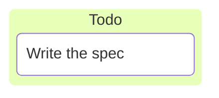
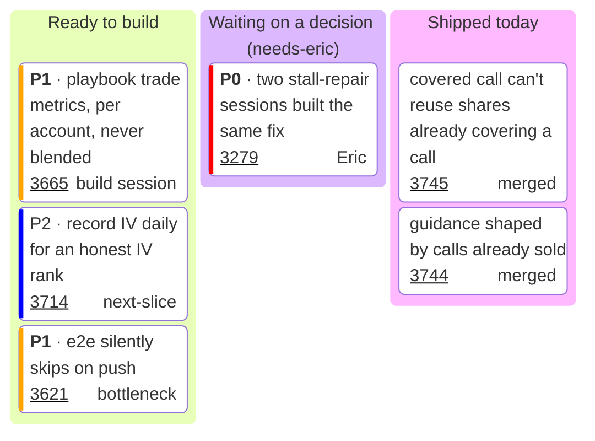

# kanban — https://mermaid.js.org/syntax/kanban.html. Covers columns, cards, card metadata (@{ ticket, assigned, priority }) and one documented config key (ticketBaseUrl). I read the page in full and also checked the upstream source (parser, db, renderer, styles, card shape, config schema, changelog), because the page is short and leaves most behaviour unsaid. — `kanban`

**Status:** stable. The keyword has no -beta suffix and the docs carry no beta or experimental warning. The docs nav marks it with a fire emoji as new. Kanban was added in Mermaid 11.4.0 (changelog #5999: "Adding Kanban board, a new diagram type"). 11.4.1 fixed a bug where "Kanban diagrams will not render when adding a number as ticket id or assigned". The docs site shows upstream 12.0.0.
**GitHub (11.17.2):** The kanban docs say nothing about GitHub. Per this repo's docs/PICTURES.md and scripts/mermaid-lint.mjs, github.com renders Mermaid 11.17.2 (read from its production bundle on 2026-09-25). Kanban has existed since 11.4.0, so GitHub draws it; both examples parse under the pinned 11.17.2. Four things are unverified or known limits. (1) Whether the SVG ticket links (<a target=_blank>) are clickable inside GitHub's sandboxed viewscreen iframe is unverified: verify on github.com, and treat the ticket as plain text. The repo already treats `click` as dead on GitHub. (2) The GitHub mobile app does not render Mermaid at all; a phone browser does. (3) Column header fills follow GitHub's light/dark theme through cScale, so do not pin a theme. (4) Mermaid Chart's renderer placed labels in foreignObject HTML even though kanbanRenderer sets htmlLabels=false, so exact text layout may differ slightly on GitHub.

## When to reach for it
- Backlog snapshot in a /secretary digest (docs/digests): columns Ready to build / Waiting on a decision (needs-eric) / Shipped. Each card is an issue, with ticket linking to /issues/N and assigned = owner. It answers 'where does everything stand' at one glance, and the column carries the state in words, not hue.
- /work-issues session open and close frame: which `plan`/`feedback` issues were picked, which are building, and which shipped. A dated one-off picture, as the fridge rule wants.
- A platter PR body (one commit per item): items sorted into merged-in-this-platter / deferred / rejected columns, with the PR or issue number in the ticket slot.
- The interrogation call sheet's verdict buckets (verbatim / amended / reject / status-quo) as columns, each proposal a card. Categorical sorting is exactly what kanban does. Four columns need sectionWidth of about 140–150 to stay legible at 390px.
- /governor cycle report: dispatches per coach bucketed as dispatched / PR open (auto-merge) / merged / failed-not-retried.
- Triage of a flood of same-shape issues, such as the six open `[ci] Moneypenny Events` ci-failure issues (#3719–#3724), bucketed as untriaged / researching / closed.
- Program-plan slice tracking in a plan issue (e.g. the Mermaid program's slices: skill, lint, PICTURES v2, C4 docs, plan issue) as todo / in flight / done.

**Not for:**
- Anything with dependencies, sequence or causality (blocks, depends-on, pipeline flow). Kanban has no edges; use a flowchart, gantt or sequenceDiagram.
- Architecture (browser app, API server, bot runner, ledger store, GitHub, market-data provider). Use C4 or architecture-beta/block.
- Quantities or trends (fitness budget ratchet, token budget, P&L). Use xychart, treemap or pie. A card count is not a measure.
- Research call sheets (call · confidence · why · falsifier). Four fields per row do not fit into title + ticket + assigned; a markdown table reads better.
- Living docs that outlast the day. A board in docs/*.md goes stale silently, and GitHub issues/labels are the source of truth. Use it only in dated artifacts (digest, PR body, session report).
- Priority-driven boards where the stripe is the message. The stripe is red/orange/blue by hue alone, which is misleading for the colorblind reader unless the text repeats it.
- A single column or 1–3 cards. A markdown checklist carries the same content with less chrome, and the fridge-rule waiver beats a decorative board.
- More than 3–4 columns or about 12 cards. It will not read at 390px.

## Header forms
- Bare keyword on the first line: `kanban`. It is case-sensitive: `KANBAN` fails with "No diagram type detected matching given configuration for text: KANBAN" (tested on 11.17.2).
- YAML frontmatter with a kanban config block (form from the docs):
---
config:
  kanban:
    ticketBaseUrl: 'https://github.com/ejclark/skynet-capital/issues/#TICKET#'
    sectionWidth: 170
---
kanban
- Frontmatter `title: ...` is accepted and parses, but kanban silently does not draw it. Tested: the rendered SVG had no title text.
- Legacy directive `%%{init: {"kanban": {"ticketBaseUrl": "..."}}}%%` still works in Mermaid config handling but is deprecated upstream. This repo's mermaid-lint flags it and asks for frontmatter instead.
- Blank lines or `%%` comment lines before `kanban` are allowed (the grammar has a spaceLines prefix).

## Primitives
| Form | Syntax | Note |
|---|---|---|
| column (id + title) | `  ready[Ready to build]` | The first node's indentation sets the column level. Every later node at exactly that indentation is a new column. Columns are laid out left to right in source order. Each column header gets its own cScale fill by position (section-1, section-2, ...). |
| column (bare word) | `  Todo` | The text is both id and title. Spaces are allowed (`first card` works as an id). An id cannot contain ( [ ) { } @. |
| column (no id) | `  [In progress]` | The id becomes the text itself, so two columns with the same text collide. |
| column/card with quoted label | `  eric["Waiting on a decision (needs-eric)"]` | Quote the label whenever it contains ( ) [ ] { }. Tested: `t3["SPY 450C (weekly) [hot]"]` renders as-is. |
| card | `    i3714[P2 · record IV daily for an honest IV rank]` | Any node indented deeper than the column level becomes a card in the most recent column. Cards stack top to bottom in source order. Each card has a white background, a nodeBorder stroke and rx=5 corners. Text wraps at sectionWidth − 25 px. |
| card with metadata | `    i3279[**P0** · two stall-repair sessions built the same fix]@{ ticket: '3279', assigned: 'Eric', priority: 'Very High' }` | @{ } is YAML, parsed with js-yaml JSON_SCHEMA. Documented keys are assigned, ticket and priority. The ticket text sits under the title on the left, and the assigned text sits bottom right. Priority is NOT drawn as text, only as a 4px coloured stripe on the left edge. |
| multi-line metadata | `    t4[multi]@{       ticket: '12'       assigned: carol     }` | Tested: works, rendered '12' and 'carol'. Once there is a newline, the block is parsed as a YAML block mapping, so do not use commas in this form. |
| label override (undocumented) | `    t5[ignored]@{ label: 'override' }` | In kanbanDb, `label` replaces the bracket text. Tested: rendered 'override'. |
| markdown and line breaks in labels | `    t2["`**bold** and *it*`"]   \|   t6[plain **bold** text]   \|   a1[line one line two]` | Labels use labelType markdown, so **bold** and *italic* render as <strong>/<em> even without the backtick-quote form.   gives a line break. All tested. |
| mindmap shape delimiters (inert) | `    t4(round)   t5{{hex}}   ((circle))   ))bang((   )cloud(` | Carried over from the mindmap grammar. They parse, but every card renders as the same rounded rectangle (tested). They only change internal padding. |

## Relations
| Form | Syntax | Note |
|---|---|---|
| none (no edges) | `(no arrow syntax exists)` | The kanban getData() always returns edges = []. There is no way to draw a dependency, flow or link between cards or columns. |
| card-in-column membership | `column at indent N, card at indent > N` | The only structural relation, and it comes from indentation alone. Deeper nesting (a card indented under a card) flattens into a sibling card, so there are no sub-tasks (tested: 'deeper card' rendered as the next card in the same column). |
| ordering | `source order` | Columns go left to right and cards go top to bottom, both in the order written. The position itself is the only ranking signal. |
| ticket → external link | `@{ ticket: '3665' } + config.kanban.ticketBaseUrl '.../issues/#TICKET#'` | The ticket text is wrapped in an SVG <a class="kanban-ticket-link" xlink:href=... target="_blank"> and underlined. Tested: rendered href https://github.com/ejclark/skynet-capital/issues/3665. |

## Grouping
- Columns are the only grouping, and there is one level: column, then card. A column holding another column throws "Groups within groups are not allowed in Kanban diagrams" (renderer guard).
- Indentation decides everything. The first node's indentation defines the column level, and it can be column 0 (the docs' metadata example has `todo[Todo]` unindented, and this was tested valid).
- If you dedent a card below the column indentation, the next node throws "Items without section detected, found section (\"x\")". Tested: with only 2 nodes it silently becomes a card instead; the error appears from the 3rd node on.
- Empty columns are allowed. They render with a minimum height of 50px (tested).
- A column's height grows with its cards, so columns end at different heights (bottom edges are ragged).

## Annotations
- %% comments on their own line are fine (the lexer turns `\s*%%.*` into a blank line). A trailing `%%` after a card also parsed on 11.17.2.
- There is no title and no accTitle/accDescr. A line like `accTitle: Acc probe` becomes a COLUMN literally titled 'accTitle: Acc probe' (tested). Frontmatter title is not drawn (tested).
- Each card has two text slots besides its title: `ticket` (under the title, left, underlined when ticketBaseUrl is set) and `assigned` (bottom right). They work as free-text tags. Unknown keys (such as owner) are ignored silently.
- Inline formatting in labels: **bold**, *italic*,   (all tested).

## Emphasis without hue (the colourblind rule)
- Column position is the primary encoding: the column a card sits in IS its state. Name columns in words ('Waiting on a decision (needs-eric)') rather than relying on the header fills, which differ only by hue and carry no meaning.
- Put priority in the label text, e.g. `**P0** · ...`, `P1 · ...`. The built-in priority stripe is hue only: red and orange are nearly indistinguishable for a red/green colorblind reader, and 'Medium' or any misspelled value draws nothing. The stripe may repeat the text but must never be the only signal.
- Bold or italic via markdown (**P0**, *stale*). Tested to render <strong>/<em>.
- Use the `assigned` slot as a bottom-right text tag: owner ('Eric', 'build session') or state ('merged', 'blocked').
- Use the `ticket` slot as an underlined issue number when ticketBaseUrl is set. The underline is an achromatic 'this is a live link' cue.
- Leading glyphs or bracketed words in the label: '⚠ ', '✓ ', '✗ ', '[blocked]'. They are text, so they survive colour blindness and grayscale.
- Order within a column: top = most urgent. Order is the only ranking you can express without hue.
- Put a tag on its own line with   (e.g. 'title **needs Eric**').
- Not available in kanban: per-card shapes (all delimiters render the same), per-card stroke-width/stroke-dasharray (no classDef/style; ::: is dropped), icons, and any edges.

## Styling hooks
- No classDef, style or linkStyle statements. `:::className` and `::icon(...)` lines parse (mindmap heritage) but are silently dropped: the card class stayed `node undefined` and no icon was drawn (tested).
- themeVariables cScale0..cScale11: column fills, lightened by 10 (darkened in dark mode), applied per column index through `.section-N` (1-based).
- themeVariables cScaleLabel0..11: column header text colour. cScaleInv0..11 is used for `.section-N line` strokes.
- themeVariables background (card fill and ticket-link fill), nodeBorder (card border and ticket-link stroke), textColor (.label and .cluster-label).
- git0 / gitBranchLabel0 style `.section-root`, which kanban never emits (dead CSS).
- CSS class hooks: `.section-N`, `.kanban-ticket-link` (has text-decoration: underline), `.kanban-label`, `.node rect` (stroke-width 1px), `.items`, `.sections`.
- Priority stripe colours are hard-coded in kanbanItem.ts and not themeable: 'Very High' = red, 'High' = orange, 'Medium' = no stroke, 'Low' = blue, 'Very Low' = lightblue.
- `look: handDrawn` applies only to column frames. Cards do not receive `look` in getData, so they stay classic.
- Repo rule: do not fix `theme`/`themeVariables`. It freezes one of GitHub's two colour modes, and scripts/mermaid-lint.mjs flags it.

## Config keys
- kanban.ticketBaseUrl (string, default ''). The docs' only named option. `#TICKET#` is replaced by the card's ticket value (JS String.replace, so first occurrence only), and the ticket text becomes an <a target=_blank>. The ticket displays raw, so store the bare number ('3665'), not '#3665', or the URL breaks.
- kanban.sectionWidth (number, default 200). In the config schema but not on the docs page. It is the column width; card width = sectionWidth − 15 and label max-width = sectionWidth − 25. Tested: 170 gave 145px labels and a 540px-wide SVG for 3 columns.
- kanban.padding (number, default 8). In the schema, but the renderer reads `conf.mindmap?.padding` for the viewBox and hard-codes 10px between cards, so this key does effectively nothing.
- kanban.useMaxWidth (inherited from BaseDiagramConfig). The renderer reads `mindmap.useMaxWidth` instead; the default is true, so the SVG scales down to the container width.
- Global keys that touch kanban: `look` (handDrawn affects column frames only) and `theme`/`themeVariables` (see styling_hooks; do not pin them on GitHub).

## Gotchas — what silently breaks
- An unquoted `#` in metadata is a YAML comment and silently wipes out the REST of the @{ }. Tested: `@{ ticket: #123, assigned: bob }` rendered with NO ticket and NO assigned. Always quote: ticket: '3279'.
- Metadata values containing `:` or `,` must be quoted. `@{ assigned: bob: jr }` fails with "missed comma between flow collection entries". An unquoted `}` or `^` inside @{ } also breaks the lexer.
- Priority values are exact and case-sensitive: 'Very High', 'High', 'Low', 'Very Low' (documented), plus 'Medium' (undocumented, draws no stripe). 'high' parses fine and silently draws an invisible stripe (tested: <line> with no stroke attribute). Priority never appears as text.
- Do not use `shape:` in @{ }. Any value with uppercase or '_' throws "No such shape: X. Shape names should be lowercase.", and that includes the code's own 'kanbanItem' (tested on 11.17.2). Lowercase values are silently ignored.
- The keyword must be lowercase `kanban`. `KANBAN` gives "No diagram type detected" (tested).
- Indentation is the syntax (see grouping). A stray dedent throws "Items without section detected", and deeper nesting flattens silently.
- `accTitle:`/`accDescr:` become a column (tested), and frontmatter `title:` is not drawn. Carry the title in the surrounding markdown.
- `:::class` and `::icon()` parse and then vanish. There is no styling per card or column.
- IDs should be unique, but the docs' own Full Example reuses `id3` twice. Duplicates still render (tested) but produce duplicate DOM ids. Bare-word and `[text]` nodes use their text as the id, so repeated text means a repeated id.
- Bracket text cannot contain unquoted `]`, `)`, `(` or `}`. Use `id["..."]` or the markdown string form ``id["`...`"]``. Apostrophes, semicolons, colons, commas and `·` inside [...] are fine (tested: `can't`, `semi; colon: ok`).
- Width scales with column count at sectionWidth 200: 3 columns ≈ 630px, 4 ≈ 835px (tested). On a 390px phone a 4-column board scales to about 47% and card text is unreadable. Keep it to 3 columns or fewer, or set sectionWidth to about 150–170, and to 12 cards or fewer.
- There are no edges at all. You cannot show that one card blocks another.
- Before 11.4.1, a numeric ticket or assigned value broke rendering. Quoting sidesteps it on every version.
- `label:` in @{ } silently overrides the bracket text (undocumented). Unknown keys are dropped without warning.
- Parse-only linting does not catch the silent failures (the `#` wipe, lowercase priority, dropped :::, accTitle turned into a column). All of those passed `node scripts/mermaid-lint.mjs --stdin` as ok. They show up only in the rendered output.

## Starters (validated Two checks on both examples. (1) mcp__Mermaid_Chart__validate_and_render_mermaid_diagram returned valid:true, diagramType:kanban, and I inspected rawSVG: the rich example is 540px wide, the 6 ticket hrefs resolve to github.com/ejclark/skynet-capital/issues/N, <strong>P0/P1</strong> render, and the stripes are orange/blue/orange/red. (2) The repo's own `node scripts/mermaid-lint.mjs --stdin --json` parses with the pinned Mermaid 11.17.2 (GitHub's version per docs/PICTURES.md) and returned ok:true for both. Card content comes from real open issues (#3665, #3714, #3621, #3279) and merged PRs (#3745, #3744).; minimal ✓, rich ✓ — None on the two examples. Probe diagrams produced these (kept for the gotchas): 'Items without section detected, found section ("x")' from a dedented card; 'No diagram type detected matching given configuration for text: KANBAN'; 'missed comma between flow collection entries (2:15)' from `assigned: bob: jr`; 'No such shape: kanbanItem. Shape names should be lowercase.' Silent failures found only by inspecting rendered SVG: an unquoted `ticket: #123` dropped ticket and assigned; priority 'high'/'Medium' drew no visible stripe; :::urgent and ::icon() were dropped; accTitle became a column; frontmatter title was not drawn.)

Minimal:

Rich (grounded in this repo):

## Sources
- https://raw.githubusercontent.com/mermaid-js/mermaid/develop/packages/mermaid/src/docs/syntax/kanban.md
- https://mermaid.js.org/syntax/kanban.html
- https://raw.githubusercontent.com/mermaid-js/mermaid/develop/packages/mermaid/src/diagrams/kanban/parser/kanban.jison
- https://raw.githubusercontent.com/mermaid-js/mermaid/develop/packages/mermaid/src/diagrams/kanban/kanbanDb.ts
- https://raw.githubusercontent.com/mermaid-js/mermaid/develop/packages/mermaid/src/diagrams/kanban/kanbanRenderer.ts
- https://raw.githubusercontent.com/mermaid-js/mermaid/develop/packages/mermaid/src/diagrams/kanban/styles.ts
- https://raw.githubusercontent.com/mermaid-js/mermaid/develop/packages/mermaid/src/rendering-util/rendering-elements/shapes/kanbanItem.ts
- https://raw.githubusercontent.com/mermaid-js/mermaid/develop/packages/mermaid/src/schemas/config.schema.yaml
- https://raw.githubusercontent.com/mermaid-js/mermaid/develop/packages/mermaid/CHANGELOG.md
- /home/user/skynet-capital/docs/PICTURES.md
- /home/user/skynet-capital/scripts/mermaid-lint.mjs
- GitHub issues list for ejclark/skynet-capital (open, via GitHub MCP), used to ground the rich example
