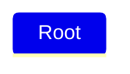
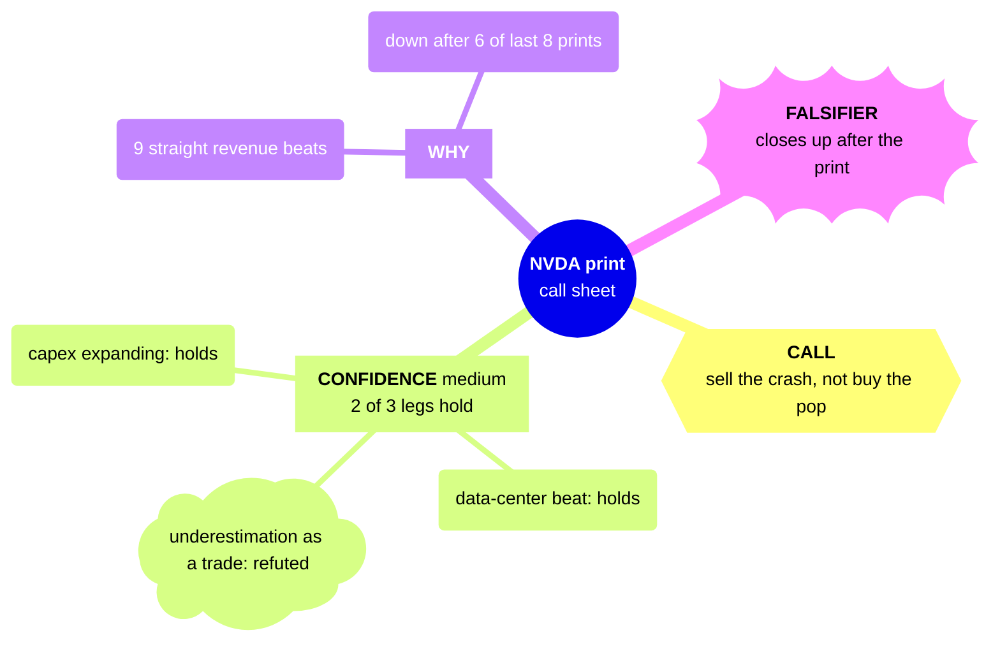

# mindmap: indentation hierarchy, node shapes, icons, classes, markdown strings (https://mermaid.js.org/syntax/mindmap.html) — `mindmap`

**Status:** experimental. The docs banner says: "This is an experimental diagram for now. The syntax and properties can change in future releases. The syntax is stable except for the icon integration which is the experimental part." It has shipped in core mermaid since 9.4.0, lazy-loaded. Before that it was the external @mermaid-js/mermaid-mindmap package registered with registerExternalDiagrams.
**GitHub (11.17.2):** The mindmap docs say nothing about GitHub. Per this repo's measurement (docs/PICTURES.md, scripts/mermaid-lint.mjs), github.com renders Mermaid 11.17.2 and mindmap is on the menu. Both examples here parse under that exact version. Four things fail or degrade on GitHub. Icons (::icon) show '?'. Custom :::classes get no CSS. layout: tidy-tree is not registered, so it silently falls back to cose-bilkent (the lint's note says dagre). Click and link are not part of mindmap anyway. The frontmatter title is not drawn by the diagram itself. The GitHub mobile app does not render Mermaid at all; a phone browser does. Verify the final radial layout width on github.com at 390px.

## When to reach for it
- Research-doc call sheets (call · confidence · why · falsifier) as a one-glance radial summary at the top of docs/research/*.md, like the validated NVDA Aug-2026 example: hexagon = call, bang = falsifier, cloud = refuted or open leg.
- Issue and plan decomposition: a parent plan issue fanning into its slice issues (for example this Mermaid program: skill, lint, PICTURES v2, C4 docs, filing). A shape can mark each slice's role, for example a hexagon for the slice that needs Eric (needs-eric).
- Taxonomies and inventories that are truly trees: the feedback-kind taxonomy (docs/research/feedback-kind-taxonomy.md), bot persona families (docs/BOTS.md), the house playbook family S1/S2/E1/S3/S4 + G1, the docs/ map, and the multi-symbol-sweep kill list (bang = killed hypothesis).
- Teardown call sheets: reference patterns grouped under borrow / adapt / skip branches.
- Journey or brainstorm captures (/journey, IDEAS.md): branches explored, with killed branches as bangs and open forks as clouds, in an outline that reads as text even where it does not render (GitHub mobile app).

**Not for:**
- Anything with order, flow, or time: PR verify → auto-merge → deploy, and issue proposed → ready → executing → done. Use flowchart or stateDiagram-v2; mindmap has no arrows or order.
- Trade lifecycle (bot recommends → ticket → fill): use sequenceDiagram or stateDiagram. A tree implies containment, not causality.
- App architecture (browser app, API server, bot runner, ledger store, GitHub, market-data provider): many-to-many dependencies (API and bot runner both write the ledger) cannot be drawn without cross-links. Use C4 or flowchart.
- Platter PRs merging one commit per item: use gitGraph.
- The fitness budget ratcheting down over weeks: a quantity over time, so use xychart-beta or a timeline. A mindmap has no numeric encoding.
- Before/after or delta pictures: there are no thick, dotted, or dashed edge variants to mark new or removed parts on GitHub.
- The interrogation call sheet verdicts (verbatim / amended / reject / status-quo) across many items: a table is denser and scannable at 390px. A mindmap of 4 × N leaves blows the ≤15-node and phone-width budget.
- Any tree deeper than 3 levels or wider than about 10 nodes: the radial cose-bilkent canvas shrinks to unreadable text on a phone.
- Any use where branch color would carry meaning: section hues are automatic, arbitrary, and hard to tell apart for a red/green colorblind reader.

## Header forms
- mindmap   (the keyword alone on the first line. The lexer is case-insensitive, and in 11.17.2 the rule is /^(?:mindmap\b)/i. The detector is /^\s*mindmap/, so leading blank lines and full-line %% comments before it are allowed)
- ---\nconfig:\n  mindmap:\n    maxNodeWidth: 150\n    padding: 10\n---\nmindmap   (YAML frontmatter carrying config)
- ---\nconfig:\n  layout: tidy-tree\n---\nmindmap   (documented Tidy Tree layout. It must be registered by the integrator and is NOT registered on GitHub, so it silently falls back to cose-bilkent)
- ---\ntitle: X\n---\nmindmap   (parses, but the mindmap DB has no diagram-title support, so the title is NOT drawn. Checked: the title text is absent from the rendered SVG)
- %%{init: {...}}%% on the line before mindmap   (the legacy directive form. Deprecated upstream in favor of frontmatter, and this repo's lint notes it)

## Primitives
| Form | Syntax | Note |
|---|---|---|
| Root node | `mindmap   Root` | The first node is the root, whatever its indentation (that indentation becomes baseLevel). Exactly one root is allowed. A later node at root level or shallower throws 'There can be only one root. No parent could be found for ("B")', checked on 11.17.2. Root gets CSS classes section-root and section--1. A default-shape root draws as a filled rounded rectangle. |
| Default shape (bare text) | `I am the default shape` | The text is both id and label. Non-root default nodes draw with no border: the label plus a colored underline (class 'no-border', the .section-N line rule). The label cannot contain ( [ ) { } because those start a shape. |
| Square | `id[I am a square]` | type RECT. Padding is doubled. |
| Rounded square | `id(I am a rounded square)` | type ROUNDED_RECT, drawn as a rect with rx=5. Padding is doubled. |
| Circle | `id((I am a circle))` | type CIRCLE |
| Bang | `id))I am a bang((` | Parens are reversed: opens with )) and closes with ((. Draws as an explosion outline. |
| Cloud | `id)I am a cloud(` | Parens are reversed: opens with ) and closes with (. In the grammar, ( closed by ( is also a cloud. |
| Hexagon | `id{{I am a hexagon}}` | type HEXAGON. Padding is doubled. |
| Shape without an id | `[text]  /  (text)  /  ((text))` | Undocumented, but the grammar's nodeWithoutId rule accepts it and the id becomes the text. Ids are never referenced (there are no edges to write), so they need not be unique. Duplicate labels were checked and render as separate nodes. |
| Quoted label | `id["CONFIDENCE: medium (2 of 3 legs hold)"]` | Double quotes inside the shape delimiters allow ( ) [ ] { } in the label. Validated. Do not mix quoted and unquoted text inside one shape. |
| Markdown string label | `id["`**Root** with a second line Unicode works too: 🤓`"]` | Written as "` ... `" inside any shape delimiters. **bold** and *italic* work. The label auto-wraps at maxNodeWidth, and a literal newline gives a line break. Leading indentation on continuation lines is stripped, so they can be indented to match the outline (checked). Unicode and emoji work. |
| Icon decoration | `B(B) ::icon(mdi mdi-skull-outline)` | Goes on the line AFTER the node, at any indent, and applies to the last node added. Takes font-icon classes (Font Awesome 5 'fa fa-book', Material Design 'mdi mdi-...'). The site integrator must load the icon fonts. EXPERIMENTAL. Nothing was drawn in the Mermaid Chart render, and per docs/PICTURES.md GitHub shows '?'. |
| Class decoration | `A[A] :::urgent large` | Goes on the line after the node. The rest of the line is a space-separated list of CSS classes appended to the node's class list. Per the docs, 'These classes need to be supplied by the site administrator'. There is no classDef in mindmap. |

## Relations
| Form | Syntax | Note |
|---|---|---|
| Parent to child (implicit edge) | `A     B      (B indented deeper than A)` | The only relation in the diagram type. Edges come from indentation: one curved 'basis' edge per parent-child pair, with no arrowheads, labels, or edge styles. There is no syntax to write an edge, cross-link two branches, or give a node two parents. The result is strictly a tree. |
| Siblings | `A     B     C      (same indentation)` | Sibling order in the source is the input to the layout, but the force-directed cose-bilkent layout decides where each sibling lands. |
| Unclear indentation | `A     B   C      (C deeper than A, shallower than B)` | Indentation only matters relative to earlier rows. The parent is the nearest previous node whose indentation is smaller, so C becomes a child of A and a sibling of B. It is silently accepted, with no error. |
| Automatic edge taper by depth | `(automatic, via CSS class edge-depth-N)` | Classic look: root to child 11px, then 8, 5, 2. At depth 5 the rule computes -1, which is invalid CSS, so edges fall back to 3px (thicker again). The author cannot set thickness per edge. Neo look uses max(10-2(i-1),2). |

## Grouping
- There is no explicit grouping construct: no subgraph, box, section keyword, or boundary. The only grouping is the subtree.
- Each child of the root starts a 'section'. Every node in that branch gets class section-N (N = child index mod 11, because MAX_SECTIONS is 12) and its own cScale hue. Branch hue is automatic and carries no meaning the author chose. With more than 11 first-level branches the hues repeat.

## Annotations
- %% comment: must be on its own line. After a closed shape (x[y] %% note) the comment is dropped. After a BARE default-shape label it becomes part of the label (checked: rendered as 'bare label %% trailing note').
- Line breaks in regular labels:   (docs example 'On effectiveness and features'). In markdown strings: a literal newline.
- ::icon(classes): an icon on the preceding node (experimental; needs site-loaded font).
- Frontmatter title: accepted but not drawn for mindmap.
- Not available: notes, edge labels, tooltips, click or links, autonumber, accTitle and accDescr (the jison grammar has none of these tokens).

## Emphasis without hue (the colourblind rule)
- Shape vocabulary is the main lever. Suggested mapping: ((circle)) for the subject or root, {{hexagon}} for THE CALL or decision, ))bang(( for the falsifier, kill condition, or risk, )cloud( for an open question or unverified or refuted leg, [square] for a section header or fact, (rounded) for evidence, and bare default text (underlined, no border) for minor leaves.
- Markdown-string **bold** and *italic*, plus ALL-CAPS lead words (CALL / CONFIDENCE / WHY / FALSIFIER) carry the role in the text itself.
- Unicode glyphs inside labels (docs: 'Unicode works too') such as ✓ / ✗ / ⚠ or words like 'holds' / 'refuted' state verdicts without color.
- Hierarchy depth is shown by distance from the root, and the automatic edge taper gives thick edges near the root and thin ones at leaves. It is not settable per edge.
- Placing the key branch first puts it first in the source outline, though the force-directed layout decides where it lands.
- NOT available on GitHub: dashed, dotted, or thick edge variants, linkStyle, style, stroke-width, and stroke-dasharray. Section hue is automatic and must never carry meaning.

## Styling hooks
- :::class1 class2  (the line after a node; CSS must be supplied by the integrator. GitHub supplies none, so custom classes are a no-op there)
- Built-in CSS classes the renderer emits: mindmap-node, section-root, section--1 (root), section-N (branch N), section-edge-N (edge color), edge-depth-N (edge width), node-icon-N, mindmap-node-label. Also 'disabled', an undocumented built-in rule (lightgray fill, #efefef text) that :::disabled attaches (checked). Its contrast is unverified, so do not rely on it.
- themeVariables used by mindmap: cScale0..cScale11 (branch fill and edge stroke), cScaleLabel0..11 (branch text), cScaleInv0..11 (the default-shape underline), lineColorN, git0 (root fill), gitBranchLabel0 (root text), THEME_COLOR_LIMIT. In the neo look also strokeWidth, mainBkg, and nodeBorder (redux, redux-dark, and neutral themes).
- This repo's rule (docs/PICTURES.md): no theme and no themeVariables. mermaid-lint fails theme: in frontmatter and in %%{init}%%, so in practice the only style lever here is shape plus text.

## Config keys
- mindmap.padding (number, default 10). Doubled for square, rounded, and hexagon nodes.
- mindmap.maxNodeWidth (number, default 200). Label box max-width; markdown strings wrap at it. The validated rich example sets 150 to narrow the canvas.
- mindmap.useMaxWidth (from BaseDiagramConfig). Scales the SVG to its container width.
- mindmap.layoutAlgorithm (string, schema default 'cose-bilkent'). The 11.17.2 renderer actually resolves the top-level config.layout with fallback 'cose-bilkent'.
- layout: tidy-tree (top-level; documented on the mindmap page and in /config/tidy-tree, 'primarily supported for mindmap'). It needs the tidy-tree layout package registered. It is not registered on GitHub and falls back silently. The repo lint's note says 'dagre', but the mindmap renderer's fallback is cose-bilkent.
- look: classic | neo (global). Changes the edge-taper formula and node stroke rules.

## Gotchas — what silently breaks
- Only one root. A second node at root indentation is a hard parse error ('There can be only one root...'), checked on GitHub's 11.17.2 via scripts/mermaid-lint.mjs.
- Bare labels with parentheses are silently mangled. 'Fill (partial)' renders as a rounded node labelled just 'partial', and the text before the paren is lost (checked). Brackets and braces behave the same way. Quote the label: id["Fill (partial)"].
- Unquoted text inside a shape cannot contain ) ] ( }. Use "..." or a markdown string. Never mix a quoted part and an unquoted part in one shape; it gives two description tokens and a parse error.
- Cloud and bang use reversed parens: )cloud( and ))bang((. One slip turns a cloud into (rounded) or truncates the label.
- A %% after a bare label becomes label text. Keep comments on their own line.
- Indentation is relative, and ambiguous indents silently re-parent to the nearest shallower previous node. The lexer measures whitespace by character count, so mixing tabs and spaces can silently mis-nest (inferred from the grammar, not tested).
- ::icon() and :::class decorate the LAST node added, whatever their own indentation, and must sit on their own line. :::class takes the rest of the line.
- Icons are experimental and need site-loaded Font Awesome or MDI fonts. GitHub shows '?' (docs/PICTURES.md), and the Mermaid Chart renderer drew nothing. Custom classes need site CSS, which GitHub does not supply.
- A frontmatter title is accepted and not drawn. Put the title in the root node.
- The layout is force-directed (cose-bilkent) and radial, so the canvas is wide. The first validated version of the 11-node rich example rendered at 1078x509px. With maxNodeWidth 150 and shorter labels it was 831x610, about 0.47x on a 390px phone. Keep about 10 nodes or fewer and labels of a few words or less.
- Edge taper breaks below depth 4 (computed width -1 falls back to 3px). Beyond 11 first-level branches, hues repeat. Keep trees at 3 levels or fewer.
- No edges, cross-links, or multiple parents, so dependency and flow structures cannot be expressed.
- Not in the grammar: accTitle, accDescr, click, and style. Adding them causes a parse error or renders them as node text.
- Undocumented lexer tokens '-)' and '(-' exist in the grammar. Avoid them in label text outside quotes.

## Starters (validated mcp__Mermaid_Chart__validate_and_render_mermaid_diagram (both examples valid:true, diagramType mindmap; rich renders 831x610 viewBox, labels confirmed in SVG) AND the repo's own scripts/mermaid-lint.mjs --stdin against node_modules/mermaid 11.17.2 = GitHub's pinned renderer version (both ok:true, zero problems). Gotcha probes (two roots, 'Fill (partial)', trailing %%, :::disabled, frontmatter title, ::icon, tidy-tree) were also run through both.; minimal ✓, rich ✓ — None for the two examples. The probes confirmed: a two-root map fails with 'There can be only one root' at 11.17.2; 'Fill (partial)' renders as 'partial'; a trailing %% after a bare label becomes label text; the frontmatter title is not drawn; ::icon(fa fa-book) produced no icon element in the Mermaid Chart render; tidy-tree drew a lint note (not registered on GitHub).)

Minimal:

Rich (grounded in this repo):

## Sources
- https://raw.githubusercontent.com/mermaid-js/mermaid/develop/packages/mermaid/src/docs/syntax/mindmap.md (full page, read via WebFetch and curl)
- https://mermaid.js.org/syntax/mindmap.html (checked reachable, HTTP 200; content taken from the raw markdown above)
- https://raw.githubusercontent.com/mermaid-js/mermaid/develop/packages/mermaid/src/docs/config/tidy-tree.md
- https://raw.githubusercontent.com/mermaid-js/mermaid/develop/packages/mermaid/src/schemas/config.schema.yaml (MindmapDiagramConfig)
- https://raw.githubusercontent.com/mermaid-js/mermaid/develop/packages/mermaid/src/diagrams/mindmap/parser/mindmap.jison
- https://raw.githubusercontent.com/mermaid-js/mermaid/develop/packages/mermaid/src/diagrams/mindmap/mindmapDb.ts
- https://raw.githubusercontent.com/mermaid-js/mermaid/develop/packages/mermaid/src/diagrams/mindmap/styles.ts
- https://raw.githubusercontent.com/mermaid-js/mermaid/develop/packages/mermaid/src/diagrams/mindmap/detector.ts
- /home/user/skynet-capital/node_modules/mermaid/dist/chunks/mermaid.core/mindmap-definition-YA3MSWOX.mjs (mermaid 11.17.2 bundle = GitHub's version)
- /home/user/skynet-capital/docs/PICTURES.md
- /home/user/skynet-capital/scripts/mermaid-lint.mjs
- /home/user/skynet-capital/docs/research/nvda-aug-2026-print.md (scene for the rich example)
