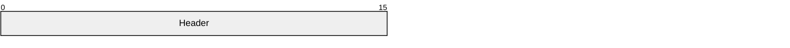
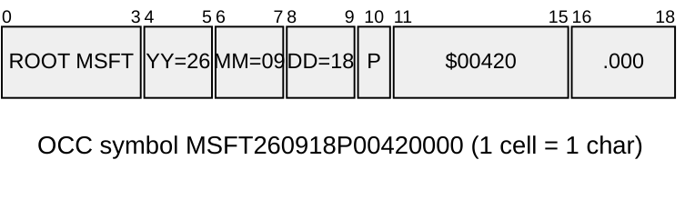

# packet — Packet diagram (packet / packet-beta): bit ranges and field labels. Docs heading "Packet Diagram (v11.0.0+)". — `packet` · `packet-beta`

**Status:** Stable. The docs page header says "v11.0.0+". It shipped as `packet-beta` in 11.0.0. Changelog 11.9.0 (#6510, "Move packet diagram out of beta") added the bare `packet` keyword, and `packet-beta` is still accepted (detector regex `/^\s*packet(-beta)?/`, grammar `("packet"|"packet-beta")`). The `+<count>` bit-count syntax needs v11.7.0+ (#5980). `bitOrder: descending` is marked `v<MERMAID_RELEASE_VERSION>+` on the develop branch, meaning it is not yet in any release (not in the 12.0.0 changelog).
**GitHub (11.17.2):** The docs page says nothing about GitHub or renderer support. Verify on github.com. Version guidance for GitHub's unknown Mermaid version: `packet-beta` is recognised from 11.0.0 onward, the `packet` keyword only from 11.9.0, `+N` from 11.7.0, and `bitOrder` is not in any release. For the widest compatibility, use `packet-beta` with explicit `start-end` ranges and no bitOrder. There are no click or interaction features, so nothing is lost on GitHub's static render. A render failure shows as an error box in the PR's opening frame (house note in docs/PICTURES.md). Before prescribing this type, validate it with the Mermaid Chart MCP and preview it on GitHub.

## When to reach for it
- Broker wire formats in src/trading/option-symbols.ts. The OCC symbol ROOT+YYMMDD+C|P+strike×1000 (8 digits) is the textbook case: fixed-width, ordered, contiguous fields where width is meaning. The picture makes the known encoding limits visible: the dot-less root (BRK.A cannot be encoded) and the 8-digit strike (no strike at or above $100,000, MAX_OCC_STRIKE).
- Any PR that changes a parser or builder for a positional or packed format (OCC symbol, date stamps, composed IDs or idempotency keys, bit-flag or enum packing). The fridge-rule opening picture is a before/after pair of packet diagrams, one per format version.
- Issue capsules for a zero-context build session that must emit or parse a fixed layout. A packet diagram plus explicit ranges is a token-cheap, unambiguous spec. Pair it with EARS criteria that name each field's range, e.g. 'WHEN the strike field (11-18) ...'.
- Slot budgets for house formats, where width stands for a character or line budget: the commit subject line of a platter PR (type(scope): summary within 50/72 chars), or the call-sheet row 'call · confidence · why · falsifier' as ordered fixed slots. Use this only when the budget is a hard contract.

**Not for:**
- Anything with relationships, flow or causality (service calls, bot decision loops, the PR/issue pipeline). There are no edges, so use flowchart, sequence or architecture instead.
- Proportions or budgets that are not contiguous positional layouts, e.g. where a token budget goes, or P&L attribution. The widths would imply byte positions that do not exist. treemap, pie or xychart fit better.
- Variable-length or keyed formats (JSON payloads, API responses, YAML frontmatter). A packet diagram implies fixed offsets. Using it for JSON fields is misleading, and erDiagram or classDiagram is better.
- Status or state (open/closed, verbatim/amended/reject verdicts). Every block looks identical and cannot be styled per field, so the distinction would rest on text alone. Use a table or stateDiagram.
- Large layouts on phones at default config (32x32 = 1026px wide). This is decorative at best, because the text becomes unreadable once scaled into 390px.
- Prescribed PR-template slots. By house rule (docs/PICTURES.md) only stable types that GitHub is known to render are prescribed. Packet is ad hoc only until verified on github.com.

## Header forms
- packet
- packet-beta   (alias, accepted from v11.0.0 to develop; safest on older renderers such as GitHub's unknown version)
- ---
title: "TCP Packet"
---
packet
- packet
title UDP Packet   (inline title statement: keyword `title`, a space, then free text up to end of line or a trailing %%)
- ---
config:
  packet:
    showBits: true
    bitsPerRow: 16
---
packet
- ---
title: Name
config:
  packet:
    bitsPerRow: 19
    bitWidth: 20
---
packet
- %%{init: {"packet": {"bitsPerRow": 16}}}%%
packet   (the grammar parses the DIRECTIVE terminal. The docs page only shows YAML frontmatter, so prefer frontmatter)

## Primitives
| Form | Syntax | Note |
|---|---|---|
| range block | `start-end: "Label"` | Inclusive bit range, e.g. `0-15: "Source Port"`. Width = end-start+1. End must be >= start. |
| single-bit block | `start: "Label"` | e.g. `106: "URG"`. Draws one cell with one centred bit number. |
| bit-count block (v11.7.0+) | `+count: "Label"` | e.g. `+16: "Source Port"`. Starts automatically at previous end + 1. `+1` is a single bit. `+0` throws 'Cannot have a zero bit field.' |
| mixed forms | `+16: "A" 16-31: "B" +8: "C"` | Docs: 'it's fine to mix and match.' Explicit starts still have to be contiguous. |
| label string | `"double-quoted" \| 'single-quoted'` | Required. Grammar STRING = /"([^"\\]|\\.)*"|'([^'\\]|\\.)*'/, so backslash escapes are allowed. Rendered as plain SVG <text>: no markdown, no HTML, no wrapping. |
| rows (implicit) | `config packet.bitsPerRow (default 32)` | Blocks flow left to right and wrap every bitsPerRow units. A block that crosses a row boundary is split into two rectangles, and each one repeats the full label. |

## Relations
| Form | Syntax | Note |
|---|---|---|
| none: adjacency is contiguity | `(no edge or arrow syntax exists)` | The only relation is sequential adjacency. Each block must start at previous end + 1, and the first block must start at 0. Order in the source is order in the picture. |
| row continuation | `a block whose range crosses a bitsPerRow boundary` | Implicit wrap: the block is drawn as two rectangles on consecutive rows with the same label. This is the only way to express 'continues'. |

## Grouping
- Rows are the only grouping. `bitsPerRow` (default 32) sets the row width, and blocks wrap into stacked rows (words). Setting bitsPerRow to the natural record width puts one record per row.
- Row-spanning split: a block that crosses a row boundary becomes two rectangles, each labelled with the full label.
- bitOrder: descending (unreleased) mirrors each row separately. Row 2 reads 63 down to 32, not down to 0. A partial row is padded on the left.
- There are no nested groups, subgraphs, or containers.

## Annotations
- Title: inline `title Some Text` statement after the header, or YAML frontmatter `title:`. It renders at the BOTTOM centre with class .packetTitle.
- Accessibility: `accTitle: text`, `accDescr: text`, or multi-line `accDescr { ... }`. These become SVG <title>/<desc> with aria-labelledby/aria-describedby (confirmed in the validated render).
- Comments: `%% text` on its own line, or trailing after a block as in the docs: `start: "Block name" %% Single-bit block`.
- Bit numbers (showBits: true, the default): the start number sits at the block's top-left and the end number at its top-right. A single-bit block gets one centred number (classes .packetByte.start/.end).
- Field label: the quoted string centred in the block (class .packetLabel). This is the only per-block annotation.

## Emphasis without hue (the colourblind rule)
- Width is the primary channel. A field's rectangle width equals its bit or char count, so size difference reads without hue.
- Isolation by row: pick bitsPerRow so the field of interest starts or fills its own row, or give it a dedicated single-bit cell (like the URG/ACK/SYN flags in the TCP example).
- Label text markers, since labels are plain text: CAPS (`ROOT`), a prefix sigil (`* STRIKE`, `! changed`, `NEW:`), parentheses for optional or reserved fields (the docs use `(Options and Padding)`), and before/after values in the label (`$00420`). Unicode glyphs such as ★ or ▲ depend on the font, so verify on GitHub.
- Explicit filler fields such as `(reserved)` or `(unused)` make gaps visible, which the contiguity rule forces anyway.
- Bit or position numbering (showBits) lets prose reference 'field 11-15' exactly, so the picture and the text agree without colour.
- Global only: themeVariables.packet.blockStrokeWidth (e.g. '2') thickens every border for legibility, but it cannot mark one field. There is no per-block dashed, dotted, bold or markdown option.
- Before/after: two stacked packet diagrams (old layout and new layout) with the changed field labelled `NEW:` or `CHANGED:`. That is the achromatic diff idiom for this type.

## Styling hooks
- No classDef, `style`, `:::`, linkStyle or click. Every styling hook is global to the diagram.
- themeVariables.packet.byteFontSize (default '10px'): bit-number font size.
- themeVariables.packet.startByteColor / endByteColor (default 'black'): colours of the start and end bit numbers.
- themeVariables.packet.labelColor (default 'black') and labelFontSize (default '12px'): field labels.
- themeVariables.packet.titleColor (default 'black') and titleFontSize (default '14px').
- themeVariables.packet.blockStrokeColor (default 'black'), blockStrokeWidth (default '1', a string), and blockFillColor (default '#efefef').
- The dark theme sets packet.{start,end}ByteColor, labelColor, titleColor and blockStrokeColor to primaryTextColor, and blockFillColor to background.
- themeCSS / CSS targets: .packetBlock (rect), .packetLabel (text), .packetByte.start, .packetByte.end, .packetTitle. The classes are uniform, so CSS cannot pick out one field except by :nth-child position, which is brittle and not GitHub-safe.

## Config keys
- packet.rowHeight: number, default 32, min 1. Height of each row.
- packet.bitWidth: number, default 32, min 1. Width of each bit or cell. The main lever for phone fit.
- packet.bitsPerRow: number, default 32, min 1. Bits per row. SVG width = bitWidth*bitsPerRow+2.
- packet.showBits: boolean, default true. Show or hide bit numbers. When true, paddingY gets +10 internally.
- packet.paddingX: number, default 5, min 0. Horizontal gap between blocks (subtracted from each block's width).
- packet.paddingY: number, default 5, min 0. Vertical gap between rows.
- packet.bitOrder: 'ascending' | 'descending', default ascending. descending mirrors each row MSB-left for hardware registers. UNRELEASED (develop only).
- packet.useMaxWidth: boolean, default true (BaseDiagramConfig). Scale to container width. Set false to keep absolute size (horizontal scroll on phones).
- packet.useWidth: number (BaseDiagramConfig).
- Theme-level: themeVariables.packet.* (see styling_hooks).

## Gotchas — what silently breaks
- Contiguity is mandatory and there are NO gaps. The first block must start at 0 and every later block at lastBit+1, otherwise it throws `Packet block 10 - 15 is not contiguous. It should start from 8.` (validated). Unused or reserved space has to be an explicit filler field such as `+3: "(reserved)"`.
- The range must ascend. `7-0` throws 'End must be greater than start.' This holds even with bitOrder: descending: fields are always declared lowest bit first, and only the drawing mirrors.
- `+0` throws 'Packet block N is invalid. Cannot have a zero bit field.' (validated).
- Labels MUST be quoted. `0-7: Header` gives a lexer error, 'Expecting token of type STRING' (validated). Both double and single quotes work.
- Integers cannot have leading zeros. `00-07:` is a parse error (validated), because the INT terminal is /0|[1-9][0-9]*(?!\.)/. Decimals are also rejected.
- One block per line. Each block needs an EOL (newline or EOF). There is no semicolon separator.
- Labels are never wrapped or truncated (the renderer centres plain text). A long label in a narrow block overflows into its neighbours. Budget about 6-7px per character at the default 12px labelFontSize against block width = bits*bitWidth - paddingX.
- Phone width: the SVG is bitWidth*bitsPerRow+2 wide (default 32*32+2 = 1026px) and useMaxWidth scales it into the column. At 390px that is about 0.38x, so 12px labels become about 4.6px and 10px bit numbers become about 3.8px, which is unreadable. Keep bitsPerRow*bitWidth <= about 388, e.g. bitsPerRow 16 with bitWidth 24, or 19 with 20 as in the rich example.
- The title renders at the BOTTOM centre of the diagram, not the top, and it does not wrap, so a long title is clipped or overflows at narrow widths.
- When showBits is true, getConfig adds 10 to paddingY internally to make room for the bit numbers, so vertical spacing is not the configured value.
- Units are unitless numbers labelled 'bits' only by convention. You can lay out chars or bytes, but say the unit in the title or accDescr, because the axis numbers do not.
- Hard cap: maxPacketSize = 10_000, checked against the number of rows pushed (db.getPacket().length), and it silently stops. You will never hit it in practice.
- Version skew: `packet` needs 11.9.0+, `+N` needs 11.7.0+, and bitOrder is unreleased (develop only). On an unknown renderer version (GitHub), the most compatible form is `packet-beta` with explicit `start-end` ranges.
- A `%%` inside a title line ends it (the TITLE regex stops at %%). Comments are full-line or trailing: `+8: "x" %% note`.
- There is no per-block styling at all: no classDef, no `style`, no `:::`, no click. Emphasis has to come from structure or label text (see achromatic_emphasis).
- Default-theme colours are hard-coded black on #efefef in styles.ts. The dark theme overrides them via themeVariables.packet (primaryTextColor on background). Verify contrast in GitHub dark mode.

## Starters (validated mcp__Mermaid_Chart__validate_and_render_mermaid_diagram. Minimal is valid (viewBox 1026x62, max-width 1026px, so it shrinks unreadably on a phone). Rich is valid (viewBox 382x110, max-width 382px, so it renders 1:1 at a 390px phone width; the title rendered at the bottom, and accTitle/accDescr became SVG <title>/<desc>). Extra probes: `packet-beta` header valid. Gap `0-7` then `10-15` invalid ('not contiguous. It should start from 8'). Unquoted label invalid (lexer error, expected STRING). `00-07` invalid (parse error). `+0` invalid ('Cannot have a zero bit field'). Single-quoted label accepted by the lexer.; minimal ✓, rich ✓ — None on the two card examples. The error texts above come from the deliberate negative probes.)

Minimal:

Rich (grounded in this repo):

## Sources
- https://raw.githubusercontent.com/mermaid-js/mermaid/develop/packages/mermaid/src/docs/syntax/packet.md
- https://mermaid.js.org/syntax/packet.html
- https://mermaid.js.org/config/schema-docs/config-defs-packet-diagram-config.html
- https://raw.githubusercontent.com/mermaid-js/mermaid/develop/packages/mermaid/src/schemas/config.schema.yaml (PacketDiagramConfig, BaseDiagramConfig)
- https://raw.githubusercontent.com/mermaid-js/mermaid/develop/packages/parser/src/language/packet/packet.langium
- https://raw.githubusercontent.com/mermaid-js/mermaid/develop/packages/parser/src/language/common/common.langium
- https://raw.githubusercontent.com/mermaid-js/mermaid/develop/packages/mermaid/src/diagrams/packet/parser.ts
- https://raw.githubusercontent.com/mermaid-js/mermaid/develop/packages/mermaid/src/diagrams/packet/renderer.ts
- https://raw.githubusercontent.com/mermaid-js/mermaid/develop/packages/mermaid/src/diagrams/packet/styles.ts
- https://raw.githubusercontent.com/mermaid-js/mermaid/develop/packages/mermaid/src/diagrams/packet/types.ts
- https://raw.githubusercontent.com/mermaid-js/mermaid/develop/packages/mermaid/src/diagrams/packet/db.ts
- https://raw.githubusercontent.com/mermaid-js/mermaid/develop/packages/mermaid/src/diagrams/packet/detector.ts
- https://raw.githubusercontent.com/mermaid-js/mermaid/develop/packages/mermaid/src/themes/theme-dark.js
- https://raw.githubusercontent.com/mermaid-js/mermaid/develop/packages/mermaid/CHANGELOG.md (11.7.0 #5980 +count; 11.9.0 #6510 out of beta)
- /home/user/skynet-capital/src/trading/option-symbols.ts (grounding for rich example)
- /home/user/skynet-capital/docs/PICTURES.md (house rule: beta types ad hoc only; GitHub Mermaid version lags)
