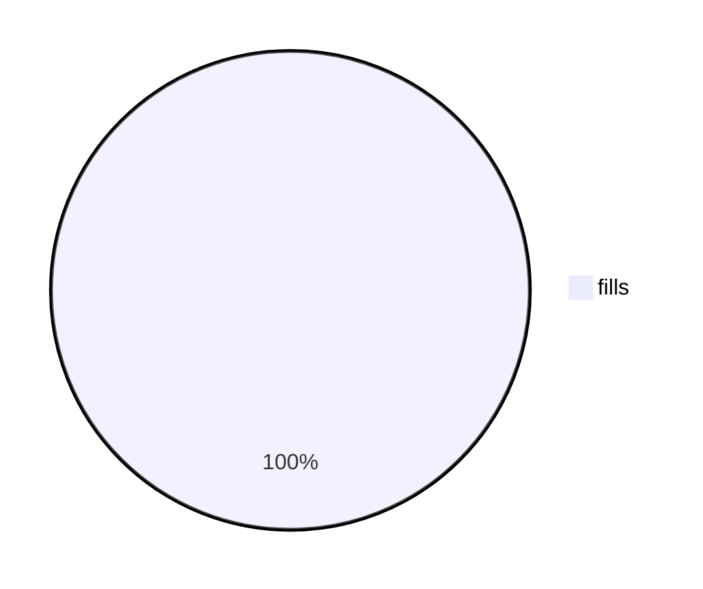
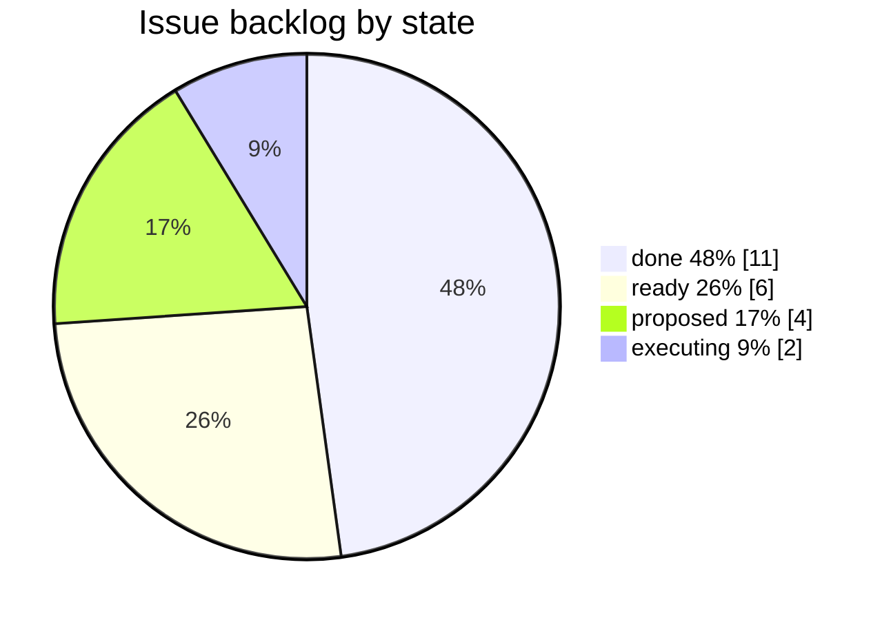

# pie — Pie chart diagrams (title, showData, slices; donut / legend position / highlight slice in v11.16.0+) — `pie` · `pie showData` · `pie title <text>` · `pie showData title <text>`

**Status:** stable (keyword has no -beta suffix). The three config features donutHole, legendPosition and highlightSlice are marked v11.16.0+ in the docs. GitHub runs 11.17.2 (docs/PICTURES.md), so they exist there; confirmed in the local 11.17.2 bundle source.
**GitHub (11.17.2):** The pie docs page says nothing about GitHub. Repo research (docs/PICTURES.md, scripts/mermaid-lint.mjs) records that github.com renders Mermaid 11.17.2, which is at least 11.16.0, so pie with donutHole, legendPosition and highlightSlice should work in PR bodies, issues and .md files. The syntax is parse-verified here with the pinned 11.17.2; the visual result still needs checking on github.com. Pie has no click, links or tooltips, so GitHub's missing callbacks cost nothing. highlightSlice: hover needs a mouse and is useless on a phone. The GitHub mobile app does not render Mermaid at all; a phone browser does, at 390px, so prefer legendPosition: bottom. Do not add theme or themeVariables: GitHub picks light or dark per page, and the repo lint rejects both. A mermaid block containing just `info` prints the deployed version in any GitHub comment, which is the way to re-check the version after a GitHub bump.

## When to reach for it
- Secretary digests and report-outs showing one snapshot of a whole: e.g. this week's merged PRs by change class (feature / fix / docs / chore), or where agent or compute time went by agent. One glance, 3–5 parts.
- Backlog composition by lifecycle state (proposed / ready / executing / done) or by label, in a digest or a burn-down issue: 'how much is stuck in ready?'.
- Platter PR bodies: what the platter is made of (items by kind, e.g. 4 fixes · 2 specs · 1 doc), as a compact companion to the per-commit list.
- Paper-portfolio allocation at one instant: capital at risk by strategy (short puts / spreads / long calls) or by bot persona, when every value is non-negative and there are 5 or fewer buckets.
- Structural-debt gate composition (dead-code, spec-gap or duplication findings by kind) when a coach or governor report explains where the remaining budget sits. Snapshot only; the ratchet over time belongs in xychart-beta.
- Research docs where the finding is a share, e.g. 'fills by order type' or 'share of signals by playbook S1/S2/E1', stated as the call in the title and backed by showData numbers.

**Not for:**
- Anything over time: a fitness budget ratcheting down over weeks, P&L by day, a burn-down. Use xychart-beta or a table; a pie has no time axis.
- Flows and lifecycles: bot recommends trade → ticket → fill, PR verify → auto-merge → deploy, issue proposed → ready → executing → done as a process. Use flowchart, sequenceDiagram or stateDiagram-v2.
- Signed quantities: P&L per persona, Greeks, deltas. Negative values are a hard error, and netting them into a pie misleads.
- Before/after comparisons. Two pies side by side are hard to compare; use a key · before · after · why table or a bar chart.
- Near-equal parts or precise comparison (e.g. 26% vs 24%): angles are read poorly and toFixed(0) rounding hides differences.
- More than 5 categories, or any bucket under 1% (silently not drawn), or a long tail: use a table or a bar chart.
- Call sheets (call · confidence · why · falsifier) and interrogation verdicts (verbatim/amended/reject/status-quo). These are categorical judgements, not parts of a whole; a pie of 'confidence' is decorative.
- Architecture and relationships (C4, ER): pie has no edges.
- When a one-line sentence or a 3-row GFM table says it faster (e.g. '2 of 23 executing'). A pie then burns the fridge-rule glance, and its hue-keyed legend is the worst case for the colourblind reader.

## Header forms
- pie
- pie showData
- pie title Pets adopted by volunteers   (title on the same line as the keyword)
- pie showData title Key elements in Product X
- pie showData  then `title ...` on its own indented line (the docs example form)
- ---\ntitle: Frontmatter title\n---\npie   (a frontmatter title is accepted; parse-verified on 11.17.2)
- ---\nconfig:\n  pie:\n    textPosition: 0.5\n    donutHole: 0.2\n    legendPosition: bottom\n    highlightSlice: Potassium\n---\npie showData
- %%{init: {"pie": {"textPosition": 0.5}}}%%\npie   (parses, but deprecated upstream since 10.5; the repo lint flags it as a note and wants frontmatter instead)
- The keyword is case-sensitive: `Pie` fails with 'No diagram type detected'. Blank lines, frontmatter, directives and %% comments may come before `pie`.

## Primitives
| Form | Syntax | Note |
|---|---|---|
| slice (data row) | `"label" : value` | Label must be quoted: double or single quotes, backslash escapes allowed ("say \"hi\""). An unquoted label is a lexer error. Spaces around the colon are optional ("a": 3 and "b"  :4 both parse). The grammar is label=STRING ':' NUMBER_PIE EOL. |
| slice value | `INT like 386, or FLOAT like 42.96 (digits on both sides of the dot)` | The docs say 'positive numeric value (supported up to two decimal places)'. The parser also accepts more decimals, e.g. 3.14159. These fail: .5, 5., 1,000, 1e3, and a trailing `;`. A negative value throws: '"x" has invalid value: -3. Negative values are not allowed in pie charts. All slice values must be >= 0.' A value of 0 parses even though the docs say values must be >0, but the slice is not drawn (see gotchas). |
| showData flag | `pie showData` | Must directly follow the `pie` keyword. The legend text becomes `label [value]`. The slice text stays a rounded percentage. |
| title | `title <free text to end of line>` | Optional. Allowed on the pie line or on its own line, and the grammar interleaves it anywhere among the slices. The text is raw: parentheses, brackets, colons and % parse fine. `%%` starts a comment and truncates the title. |
| slice order | `(implicit) source order` | The renderer calls d3 pie().sort(null), so slices run clockwise from 12 o'clock in source order. The legend lists them in the same order. |
| auto slice label | `(implicit) Math round: ((value/sum)*100).toFixed(0) + '%'` | Slices show only a percentage, never the name. The name appears only in the legend, next to a colour swatch. |

## Relations
| Form | Syntax | Note |
|---|---|---|
| none: pie has no edges | `(no relation syntax)` | The only structural relation is order. Source order = clockwise order from 12 o'clock = legend order, because sorting is disabled. Use it to encode rank (largest first) or to put the focal slice first. |

## Grouping
- None. There are no sections, subgraphs or nesting. To group, pre-aggregate into one slice, e.g. "other (3 kinds)" : 4.
- Duplicate labels are NOT merged or summed: the first wins and later rows with the same label are silently dropped (pieDb.addSection checks `if (!sections.has(label))`).

## Annotations
- title <text>: the diagram title (class pieTitleText, default 25px, centred over the pie). A long title widens the viewBox.
- Frontmatter `title:` also sets the diagram title.
- accTitle: <text>: the accessible title, emitted as <title> in the SVG with aria-labelledby. It comes from the common grammar and the pie docs page does not mention it. Verified in the render output.
- accDescr: <text> (single line) or accDescr { multi-line } (parse-verified): the accessible description, emitted as <desc> with aria-describedby.
- %% comment: a full-line comment, or a trailing comment after a slice row (parse-verified). A %% in a title or accTitle line ends the text there.
- showData: puts the raw values in the legend as `label [value]`.
- Automatic percentage text on each drawn slice, positioned by pie.textPosition.
- No notes, tooltips, links, click callbacks or autonumber exist for pie.

## Emphasis without hue (the colourblind rule)
- Put the number in the label text, e.g. "done 48%" : 11. The legend then reads `done 48% [11]` and the slice reads `48%`, so a reader matches slice to name by number, not by swatch hue. This is the main colourblind fix, because the slice itself never shows its name.
- Order encodes meaning. Source order = clockwise order from 12 o'clock = legend order (no sorting), so list largest-first so position gives rank, or put the focal slice first so it starts at 12 o'clock.
- pie.highlightSlice: "<exact label>" (v11.16+). The matching slice draws at scale 1.05 and opacity 1 while the others stay at 0.7. That is a size and contrast pop-out, not a hue one. The label must match exactly, including any % you embedded.
- showData puts exact values in the legend, so the chart reads as a table even if the wheel is ignored.
- The title states the takeaway, e.g. `title Executing is only 9% of the backlog`. Words carry the point, not colour.
- donutHole: 0.3–0.5 draws a ring. A shape change can mark a different kind of chart (e.g. a composition ring vs a budget pie). legendPosition: center puts the legend inside the hole, next to the ring.
- textPosition near 0.85–0.9 pushes the % labels to the rim of thin slices so they stay readable. It does not prevent overlap.
- Keep to 5 or fewer slices so position plus number fully identify each one. Past 12 slices, colours repeat and the legend becomes ambiguous even for a full-colour reader.
- accTitle / accDescr: say in words which slice matters, for screen readers and for the source view.
- Thicker slice borders (pieStrokeWidth) would help separate adjacent slices, but they need themeVariables, which this repo's lint bans. Rely on the label and order techniques instead.

## Styling hooks
- No classDef, style, linkStyle or ::: for pie. Styling goes only through themeVariables and CSS classes.
- themeVariables pie1..pie12: fill for the Nth slice. Defaults derive from primaryColor, secondaryColor and tertiaryColor. The colour scale cycles, so slice 13 reuses pie1.
- themeVariables pieTitleTextSize (25px) and pieTitleTextColor (taskTextDarkColor).
- themeVariables pieSectionTextSize (17px) and pieSectionTextColor (textColor): the in-slice % labels.
- themeVariables pieLegendTextSize (17px) and pieLegendTextColor (taskTextDarkColor).
- themeVariables pieStrokeColor (black) and pieStrokeWidth (2px): each slice's border.
- themeVariables pieOuterStrokeColor (black) and pieOuterStrokeWidth (2px): the outer ring. The docs example sets pieOuterStrokeWidth: "5px".
- themeVariables pieOpacity (0.7): slice opacity. A highlighted slice goes to opacity 1.
- Theming rules: only the `base` theme can be customised, and only hex colours work (`#ff0000` yes, `red` no).
- CSS classes, reachable through the global themeCSS config: .pieCircle (slices), .pieCircle.highlighted, .pieCircle.highlightedOnHover:hover (scale 1.05, opacity 1, 250ms), .pieOuterCircle, .slice (% text), .legend text, .pieTitleText.
- REPO RULE: scripts/mermaid-lint.mjs FAILS any frontmatter `theme:` or `themeVariables:`, even themeVariables alone ('sets a fixed theme'). So every themeVariables hook above is off-limits in PR bodies and issues. The docs' own donut example would fail the house lint.

## Config keys
- pie.textPosition: number 0–1, default 0.75. Axial position of the % labels, from 0 at the centre to 1 at the outer edge.
- pie.donutHole: number 0–0.9, default 0 (v11.16.0+). Inner-radius ratio. The renderer applies it only when 0 < value <= 0.9; anything else silently draws a full pie.
- pie.legendPosition: one of top, bottom, left, right, center; default right (v11.16.0+). An invalid value such as `middle` parses and silently falls back to right. Only right and left add the legend width to the viewBox; top and bottom add height.
- pie.highlightSlice: string, default '' (v11.16.0+). Use an exact slice label, or 'hover' to pop whichever slice is hovered. Hover needs a pointer, so it does nothing on a phone or in a static view.
- pie.useMaxWidth: from BaseDiagramConfig, default true. The SVG gets max-width equal to its viewBox width and scales down to fit the container.
- Fixed renderer geometry (not configurable): height 450, pie width 450, MARGIN 40, radius 185, legend swatch 18px.
- Set these in YAML frontmatter `config: pie: {...}`. The %%{init}%% directive also works but is deprecated.

## Gotchas — what silently breaks
- Values must be non-negative. A negative value is a hard error (parse OK, then the db throws). Zero parses despite the docs saying 'greater than zero'.
- SILENT DROP: any slice under 1% of the total, including 0, is filtered out of the wheel (`(d.value/sum)*100 >= 1`), yet it still appears in the legend with a swatch that matches nothing.
- SILENT DROP: a duplicate label keeps the first value; later rows are discarded, not summed.
- Percentages are rounded independently with toFixed(0), so the slice labels may not add up to 100%.
- Slices show only percentages, never names. Identity depends on matching a legend swatch by hue, which is inherently hostile to a red/green colourblind reader unless labels carry the number or order carries rank.
- Number syntax is strict: no .5, no 5., no thousands separators (1,000), no exponent (1e3), no unit or % suffix on the value, and no trailing semicolon. All are lexer errors.
- Labels must be quoted. Single quotes work; `\"` escapes work; colons and parentheses inside the quotes are fine.
- The title runs to end of line and is not quoted. A `%%` inside it starts a comment and truncates it.
- Invalid config values (legendPosition: middle, donutHole: 1.5) are not parse errors. They silently fall back, so a lint pass does not mean the config took effect.
- Renderers older than 11.16 silently ignore donutHole, legendPosition and highlightSlice. The Mermaid Chart MCP validator runs v11.13.0 (confirmed with an `info` probe) and drew this card's rich example as a plain pie with the legend on the right. A 'valid' result there is not proof of the v11.16+ look.
- Phone width: the chart is a fixed 450px tall. The default right legend adds the longest label's width (about 645px wide for the rich example on 11.13), so at 390px everything scales down to roughly 60% and 17px text becomes about 10px. Use legendPosition: bottom, which keeps width about equal to the pie, and short labels. A title wider than the pie also widens the viewBox.
- More than 12 slices reuse colours (pie1..pie12 cycle), so two legend entries share a swatch.
- Small adjacent slices get overlapping % labels. There is no collision avoidance.
- The house lint rejects any theme or themeVariables in frontmatter, so the docs' own example with themeVariables.pieOuterStrokeWidth fails here.
- Semicolons after rows, a `Pie` keyword, and unquoted labels all fail to parse. Unlike flowchart, there is no statement separator.

## Starters (validated mcp__Mermaid_Chart__validate_and_render_mermaid_diagram, whose renderer reports v11.13.0 via an `info` probe. Both examples returned valid:true, diagramType:pie. The rich render showed slice text 48%/26%/17%/9%, legend `done 48% [11]`… (showData working), the title, and <title>/<desc> from accTitle/accDescr. It also showed a full pie, the legend on the right, and no `highlighted` class: 11.13 silently ignores the v11.16+ keys. Both examples were also parsed with the repo's pinned Mermaid 11.17.2 (GitHub's version): `node scripts/mermaid-lint.mjs --stdin` returned 0 problems and 0 notes. The 11.17.2 bundle (node_modules/mermaid/dist/chunks/mermaid.core/pieDiagram-*.mjs) contains the donutHole, legendPosition and highlightSlice code paths. Edge cases were probed on 11.17.2 (results are in gotchas).; minimal ✓, rich ✓ — No syntax errors. Not verified: how donut, bottom legend and highlight actually look on 11.17.2. A Playwright attempt to render from a CDN failed (the headless browser has no network, and file:// is blocked). That attempt auto-wrote .playwright-mcp/ log files into the repo root; the folder is gitignored (.gitignore:41) and was left in place because this was a read-only run.)

Minimal:

Rich (grounded in this repo):

## Sources
- https://raw.githubusercontent.com/mermaid-js/mermaid/develop/packages/mermaid/src/docs/syntax/pie.md
- https://mermaid.js.org/syntax/pie.html
- https://raw.githubusercontent.com/mermaid-js/mermaid/develop/packages/mermaid/src/docs/config/theming.md
- https://raw.githubusercontent.com/mermaid-js/mermaid/develop/packages/parser/src/language/pie/pie.langium
- https://raw.githubusercontent.com/mermaid-js/mermaid/develop/packages/parser/src/language/common/common.langium
- https://raw.githubusercontent.com/mermaid-js/mermaid/develop/packages/mermaid/src/schemas/config.schema.yaml
- https://raw.githubusercontent.com/mermaid-js/mermaid/develop/packages/mermaid/src/diagrams/pie/pieDb.ts
- https://raw.githubusercontent.com/mermaid-js/mermaid/develop/packages/mermaid/src/diagrams/pie/pieRenderer.ts
- https://raw.githubusercontent.com/mermaid-js/mermaid/develop/packages/mermaid/src/diagrams/pie/pieStyles.ts
- /home/user/skynet-capital/node_modules/mermaid/dist/chunks/mermaid.core/pieDiagram-E7YTZNPT.mjs (local 11.17.2 bundle)
- /home/user/skynet-capital/docs/PICTURES.md
- /home/user/skynet-capital/scripts/mermaid-lint.mjs
