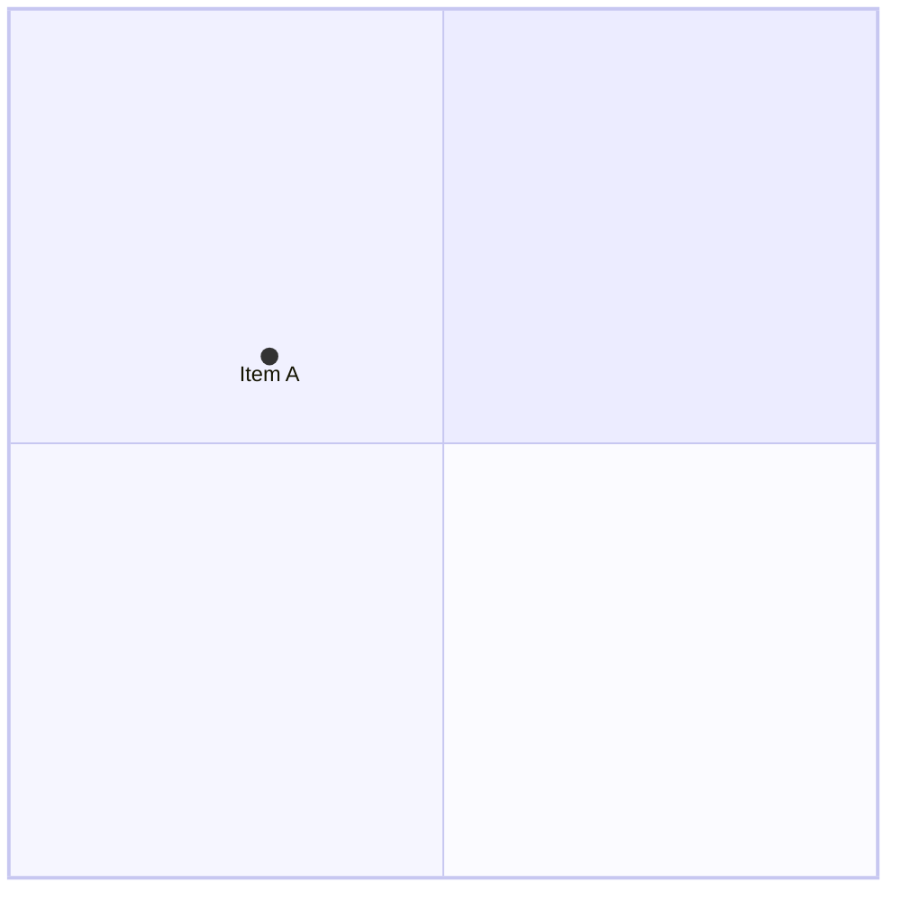
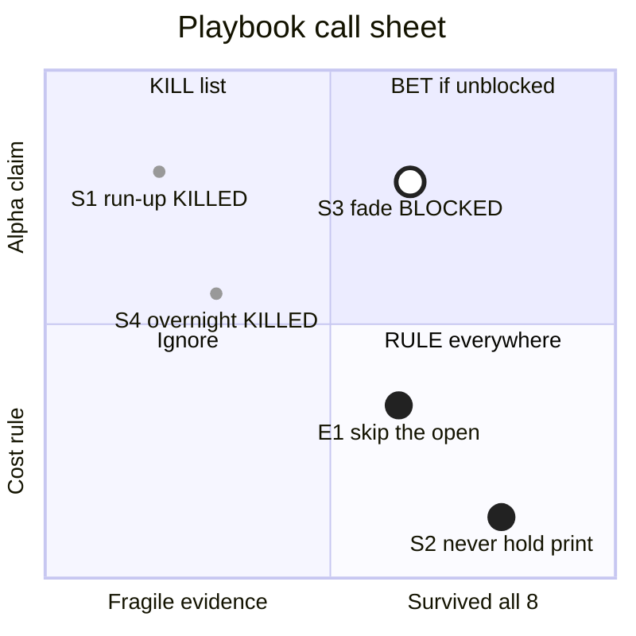

# quadrantChart: Quadrant Chart (https://mermaid.js.org/syntax/quadrantChart.html) — `quadrantChart`

**Status:** stable. The docs page has no beta or experimental marker, and the header is plain `quadrantChart` with no `-beta` suffix. The type first shipped in Mermaid v10.2. Point styling (`:::class`, `classDef`, inline radius/color/stroke-*) came later. Unquoted non-ASCII labels only became legal with the 11.15/11.16 fix (PR #7693). The validator used here still rejects them, so older renderers do too.
**GitHub (11.17.2):** The docs page says nothing about GitHub or renderer support. Verify on github.com. What is known: quadrantChart needs Mermaid 10.2 or later. Point styling (`:::`, `classDef`, inline radius/color/stroke-*) is a later addition, so an older GitHub Mermaid could reject it. Unquoted non-ASCII labels need 11.15/11.16 or later; always quote them. There are no click, link or tooltip features for this type, so GitHub's lack of callbacks costs nothing. Frontmatter `config.quadrantChart` and `themeVariables` worked in the MCP validator, but check that GitHub honors them before depending on the chart size or font-size tuning for phone legibility. accTitle/accDescr emit SVG <title>/<desc> for screen readers.

## When to reach for it
- Research call sheets (docs/research/*.md, e.g. multi-symbol-sweep.md): place playbooks or hypotheses on evidence strength vs claim size, with the verdict word in each label (KILLED/BLOCKED/RULE). It is a one-glance picture above the call · confidence · why · falsifier table and replaces a paragraph of 'which survived where'
- Secretary triage (the /secretary skill): reversibility (x) vs impact (y), with quadrants named 'interrupt Eric now' / 'digest' / 'auto-ship' / 'ask first'. This encodes the irreversible-class rule as a picture for digests
- Backlog ordering for /work-issues or plan issues: value vs effort (or value vs blast radius) for 4-8 candidate issues, to show why the next one was picked
- /teardown borrow/adapt/skip call sheets: fit-with-our-surface vs build cost, with quadrant labels BORROW / ADAPT / SKIP / PARK
- Interrogation call sheets: place the shapes being judged (verbatim, amended, reject, status-quo) on e.g. risk vs benefit so the chosen shape visibly sits in the winning quadrant
- Governor/coach debt targeting: severity vs fix cost for flagged files (arch-scan, dupe-scan, dead-scan) when choosing which target to dispatch
- Bot persona positioning: a qualitative comparison of personas on normalized risk appetite vs expected edge, as a PR-body picture when adding or retuning a persona

**Not for:**
- Anything with flow or order: a bot recommends a trade → ticket → fill, a PR goes verify → auto-merge → deploy, an issue goes proposed → ready → executing → done. Use flowchart, sequence or state diagrams; quadrants have no edges
- Architecture (browser app, API server, bot runner, ledger store, GitHub, market-data provider). Use C4 or flowchart; position in a 2x2 means nothing there
- Time series such as a fitness budget ratcheting down over weeks. Use xychart-beta; the 0-1 axes have no ticks and no units
- Platter PRs merging one commit per item: that is a list or gitGraph, not a 2x2
- Precise quantitative claims (p-values, returns, win rates). Normalizing to 0-1 with no tick marks hides units, and the positions invite false precision
- More than about 8 points on a 390px phone: labels collide with no avoidance, and it turns into decoration
- When the two axes are not independent, or only one dimension matters (a ranking), a sorted list or table is more honest
- Where hue or dashed outlines would be needed to separate categories. The only non-hue channels are size, fill luminance, ring thickness and label text

## Header forms
- quadrantChart   (bare header; the body may be empty. Validated: an empty 2x2 grid renders)
- quadrantChart followed by an in-body `title <text>` line. The title takes the rest of the line verbatim and always renders above the chart
- ---\ntitle: Frontmatter title\n---\nquadrantChart   (YAML frontmatter title; validated, renders as the chart title)
- ---\nconfig:\n  quadrantChart:\n    chartWidth: 400\n    chartHeight: 400\n  themeVariables:\n    quadrant1TextFill: "#ff0000"\n---\nquadrantChart   (frontmatter config + themeVariables; this is the docs example form, and the docs example itself leaves out the '#')
- Keywords are case-insensitive (lexer option case-insensitive). Leading spaces and indentation are allowed
- %%{init: {...}}%% directives are generic Mermaid and not on this page. Prefer frontmatter

## Primitives
| Form | Syntax | Note |
|---|---|---|
| title | `title <text>` | Rendered at top center (titleFontSize, titlePadding). Takes the whole rest of the line. The frontmatter `title:` is equivalent |
| x-axis (both ends) | `x-axis <left text> --> <right text>` | Each text is centered under its half of the plot. With points present, the labels are drawn at the bottom whatever xAxisPosition says |
| x-axis (left only) | `x-axis <left text>` | Only the left text renders, left-aligned (text-anchor start), not centered |
| x-axis (trailing delimiter) | `x-axis <left text> -->` | Not documented but in the grammar and validated: appends ' ⟶' to the left label, which reads as a one-ended 'increasing' arrow |
| y-axis (both ends) | `y-axis <bottom text> --> <top text>` | Rotated -90 degrees, each centered on its half. yAxisPosition left|right |
| y-axis (bottom only) | `y-axis <bottom text>` | Only the bottom text renders, anchored at the bottom. A trailing `-->` form also exists and appends ' ⟶' |
| quadrant label | `quadrant-1 <text> \| quadrant-2 <text> \| quadrant-3 <text> \| quadrant-4 <text>` | 1 = top-right, 2 = top-left, 3 = bottom-left, 4 = bottom-right (math convention, counter-clockwise from top-right). Centered in the quadrant when there are no points, pinned to the top of the quadrant when points exist |
| point | `<text>: [x, y]` | x and y must be in the 0-1 range. The lexer accepts only `0`, `1` or `0.<digits>`. Draws a circle with its label centered below it |
| point with inline style | `<text>: [x, y] radius: 12, color: #ff3300, stroke-color: #10f0f0, stroke-width: 5px` | Comma-separated key: value list after the coordinates. Only these 4 keys exist |
| point with class | `<text>:::<className>: [x, y]` | The class name must be \\w+ (letters, digits, underscore; no hyphen). An undefined class is ignored silently |
| point with class + inline override | `<text>:::<className>: [x, y] color: #0000ff` | Inline styles win over class styles, and class styles win over theme |
| quoted text | `quadrant-1 "Adopt (bet)"  /  "S3: fade (blocked)": [0.3, 0.6]` | Double-quoted strings work for axis, quadrant and point text. This is the escape hatch for parentheses, colons and non-ASCII (validated) |
| markdown string (parsed, not rendered) | `quadrant-1 "`**Adopt**`"` | The grammar accepts it but the renderer uses plain SVG text. Validated: it renders the literal characters **Adopt**, with no bold |

## Relations
| Form | Syntax | Note |
|---|---|---|
| none: no edges exist | `(n/a)` | quadrantChart has no arrows, links or connections between points. Relationships are expressed only by position in the 2x2 plane |
| axis text delimiter | `x-axis A --> B   /   y-axis A --> B   (lexer: --+> so ---> also works)` | Only valid inside x-axis and y-axis lines. It separates the low-end text from the high-end text and is not an edge. A `-->` inside point or quadrant text breaks the parse |

## Grouping
- No subgraph, box, section or namespace constructs. The four quadrants (quadrant-1..4) are the only grouping, and membership comes implicitly from the coordinates (x < 0.5 / >= 0.5, y < 0.5 / >= 0.5)
- `:::className` plus `classDef` is a visual grouping (points sharing a style), not a structural one
- The grammar has a dead `section` production with no lexer token behind it, so it is unusable

## Annotations
- title <text> (in-body) or frontmatter `title:`
- accTitle: <text>. Validated: emits <title> plus aria-labelledby on the SVG
- accDescr: <text> (single line) or accDescr { multi-line } (in the grammar). Validated: emits <desc> plus aria-describedby
- %% comment lines are skipped. A `%%` anywhere mid-line (not preceded by `}`) starts a comment and truncates the rest of that line, labels included
- Point labels (text before the colon) render under each point
- Quadrant labels (quadrant-1..4) and axis end labels are the only other text
- No notes, tooltips, links, click callbacks, autonumber or legends exist for this type

## Emphasis without hue (the colourblind rule)
- Point size: `radius: <int>`. A big dot marks an adopted or important item and a small dot a killed or minor one
- Hollow ring vs solid dot: `color: #ffffff, stroke-color: #222222, stroke-width: 3px` gives a ring, and `color: #222222` gives a solid disc. This is a luminance and shape-of-fill difference that is safe for red/green colorblind readers (validated in the rich example)
- Ring thickness: stroke-width 1px vs 3px vs 5px as a second ordinal channel
- Fill luminance ladder: #222222 dark / #999999 mid / #ffffff white. Grey steps, never hue
- Put the verdict word in the label itself, in CAPS: `S1 run-up KILLED`, `S3 fade BLOCKED`. The text carries the meaning even with the styling stripped
- Quadrant labels name the action (`BET if unblocked`, `KILL list`, `RULE everywhere`) so the region reads without a legend
- Axis end texts carry direction words (`Fragile evidence --> Survived all 8`). The trailing-delimiter form adds a ⟶ glyph
- Quadrant background checkerboard by luminance (quadrant1Fill/3Fill #ffffff, 2Fill/4Fill #eeeeee) separates regions without hue (validated)
- Not available: dashed or dotted outlines (stroke-dasharray is rejected), non-circle markers, bold or markdown labels (rendered literally), line breaks in labels

## Styling hooks
- Inline point styles after the coordinates: `color: #hex` (fill), `radius: <int>`, `stroke-color: #hex`, `stroke-width: <int>px`. Validated: any other key throws 'style named X is not supported' (e.g. stroke-dasharray)
- `classDef <name> color: #hex, radius: <int>, stroke-color: #hex, stroke-width: <int>px` defines a class. Spaces around ':' are fine (`radius : 10`)
- `<text>:::<name>: [x, y]` applies a class to a point
- Precedence (docs): 1) direct/inline styles, 2) class styles, 3) theme styles
- Point-style values are validated strictly: color and stroke-color must be 3- or 6-digit hex with an optional '#' (named colors like `red` throw, validated). radius must be an integer (`7.5` is a parse error, validated). stroke-width must be <int>px
- themeVariables (quadrant-specific): quadrant1Fill, quadrant2Fill, quadrant3Fill, quadrant4Fill, quadrant1TextFill, quadrant2TextFill, quadrant3TextFill, quadrant4TextFill, quadrantPointFill, quadrantPointTextFill, quadrantXAxisTextFill, quadrantYAxisTextFill, quadrantInternalBorderStrokeFill, quadrantExternalBorderStrokeFill, quadrantTitleFill. Validated: quadrantNFill overrides via frontmatter took effect
- No `style`, `linkStyle` or `class a,b name` statements exist for this type
- Renderer SVG groups (from source, not on the docs page), usable only through themeCSS: g.quadrants > g.quadrant (rect + text), g.border (lines), g.data-points > g.data-point (circle + text), g.labels > g.label, g.title

## Config keys
- quadrantChart.chartWidth: number, default 500. Also the SVG viewBox width and the max-width when useMaxWidth is true
- quadrantChart.chartHeight: number, default 500
- quadrantChart.titlePadding: number, default 10 (top and bottom padding of the title)
- quadrantChart.titleFontSize: number, default 20
- quadrantChart.quadrantPadding: number, default 5 (padding outside all quadrants)
- quadrantChart.quadrantTextTopPadding: number, default 5 (quadrant label top padding when labels are drawn at the top, i.e. when points exist)
- quadrantChart.quadrantLabelFontSize: number, default 16
- quadrantChart.quadrantInternalBorderStrokeWidth: number, default 1
- quadrantChart.quadrantExternalBorderStrokeWidth: number, default 2
- quadrantChart.xAxisLabelPadding: number, default 5
- quadrantChart.xAxisLabelFontSize: number, default 16
- quadrantChart.xAxisPosition: 'top'|'bottom', default 'top'. Forced to bottom whenever any point exists
- quadrantChart.yAxisLabelPadding: number, default 5
- quadrantChart.yAxisLabelFontSize: number, default 16
- quadrantChart.yAxisPosition: 'left'|'right', default 'left'
- quadrantChart.pointTextPadding: number, default 5. Measured from the point CENTER, not its edge
- quadrantChart.pointLabelFontSize: number, default 12
- quadrantChart.pointRadius: number, default 5 (default radius for unstyled points)
- quadrantChart.useMaxWidth: boolean, default true (BaseDiagramConfig; in the schema, not the docs table). true means width=100% with max-width=chartWidth, so the chart scales down on narrow screens
- Schema note: QuadrantChartConfig has unevaluatedProperties:false, so unknown keys may be rejected. Several schema descriptions are mislabeled (e.g. titleFontSize is described as padding); trust the docs table

## Gotchas — what silently breaks
- Coordinates: the lexer accepts only `0`, `1` or `0.<digits>`. `1.0` is a lexical error (validated), and `.5`, negatives, percentages and values above 1 also fail. Positions are plot fractions, not data units, so normalize first
- Unquoted text allows only letters, digits, spaces and the characters ! " # $ % & ' * + , - . ` ? \\ _ / =. Parentheses `(`, `)`, `[`, `]`, `<`, `>`, `@`, `|`, `~`, `^`, `{`, `}` and a bare `:` cause a lexical error (validated for parentheses). Double-quote the whole label to use them (validated: "S3: fade (blocked)")
- Non-ASCII (·, —, →, ≤, emoji, accents) in UNQUOTED labels fails on renderers older than Mermaid 11.15/11.16 (validated: `x-axis Low · weak` failed in the MCP validator). Always quote labels containing non-ASCII. The house call-sheet separator '·' must be quoted
- `;` ends a statement anywhere (validated: `A: [0.2, 0.3]; B: [0.7, 0.9]` makes two points), so a semicolon inside unquoted text silently splits the line
- `%%` mid-line starts a comment and silently truncates the label
- A label cannot start with `-`. `-->` inside point or quadrant text is lexed as the axis delimiter and breaks the parse
- Reserved tokens are matched anywhere in unquoted text: title, accTitle, accDescr, x-axis, y-axis, quadrant-1..4, classDef, quadrantChart. A label beginning with 'title...' flips into title mode
- Class names must be \\w+. Hyphenated names like `my-class` break. An undefined class is ignored silently, with no error
- Style values: hex only (a named color throws, validated). radius must be an integer (7.5 is a parse error, validated). stroke-width must be an integer with a px suffix. Any unknown key throws (stroke-dasharray, validated). DOT is not a legal style token, so no decimals anywhere in styles
- stroke-color does nothing unless stroke-width is also set (docs)
- Default point fill is broken in the validated renderer: it emits fill="hsl(240, 100%, NaN%)", an invalid color that browsers draw as black. Theme source also has an operator-precedence bug, so a user-set themeVariables.quadrantPointFill is overridden. Always give points an explicit `color:` via classDef
- The docs' own config example sets `quadrant1TextFill: "ff0000"` without the '#', which is an invalid SVG color. Include the '#'
- Markdown strings ("`**x**`") parse but render as literal asterisks (validated). There are no line breaks either: every label is a single SVG <text> line with no wrapping, and long labels overflow and are clipped at the viewBox edge
- Labels are centered under their point with no collision avoidance. Nearby points overlap their labels, and points near x=0 or x=1 push labels past the chart edge (keep x between about 0.15 and 0.85 for 15-20 character labels). Points near y=1 collide with the top-pinned quadrant labels
- pointTextPadding is measured from the point center, so with radius > 5 the label overlaps its own dot. Set pointTextPadding to at least radius + 3 (the rich example uses 12)
- Draw order is reversed: points are rendered in reverse declaration order, so the FIRST-declared point is painted on top
- With zero points, axis labels follow xAxisPosition (default top) and quadrant labels sit centered. Adding a single point moves the x-axis to the bottom and the quadrant labels to the top
- Duplicate quadrant-N/axis/title lines: the last one wins silently
- Phone at 390px: the default 500px chart is scaled to roughly 0.7x by useMaxWidth, so 12px point labels become about 8px. Use chartWidth/Height around 400 and font sizes of 14 or more, and keep to about 8 points or fewer
- Quadrant fills in the default theme are near-identical lavenders (#ECECFF to #fbfbff) and borders are lavender rgb(199,199,241). Low contrast; set quadrantNFill and the border fills explicitly

## Starters (validated mcp__Mermaid_Chart__validate_and_render_mermaid_diagram (the renderer's Mermaid version is unknown but older than 11.15, since unquoted non-ASCII failed). Both examples returned valid:true. I checked the rich example's rawSVG: classDef styles applied (ring stroke #222222 at 3px, radii 9/4), the quadrant fills took effect, <title>/<desc> were emitted from accTitle/accDescr, max-width is 400px, and every label sits inside the viewBox. The bare `quadrantChart` header alone also validated; minimal ✓, rich ✓ — Negative probes, all rejected as the docs and grammar predict: unquoted `quadrant-1 Adopt (bet)` gave 'Lexical error… Unrecognized text'. `[1.0, 0.6]` gave a lexical error. `color: red` gave 'value for color red is invalid, please use a valid hex code'. `radius: 7.5` gave a parse error ('got DOT'). `stroke-dasharray: 4px` gave 'style named stroke-dasharray is not supported'. Unquoted `x-axis Low · weak --> High · strong` gave a lexical error. Positive probes that passed: quoted labels with parentheses and colons, a frontmatter `title:`, the trailing `x-axis Low -->` form (renders 'Low ⟶'), `;` as a statement separator, and a markdown string (valid, but it renders literal **).)

Minimal:

Rich (grounded in this repo):

## Sources
- https://raw.githubusercontent.com/mermaid-js/mermaid/develop/packages/mermaid/src/docs/syntax/quadrantChart.md (full page read: Example, Syntax notes, Title, x-axis, y-axis, Quadrants text, Points, Chart Configurations, Chart Theme Variables, Example on config and theme, Point styling, Available styles, Order of preference, Example on styling)
- https://mermaid.js.org/syntax/quadrantChart.html (rendered form of the same page)
- https://raw.githubusercontent.com/mermaid-js/mermaid/develop/packages/mermaid/src/diagrams/quadrant-chart/parser/quadrant.jison (grammar: allowed characters, coordinate regex, accTitle/accDescr, markdown strings, trailing delimiter)
- https://raw.githubusercontent.com/mermaid-js/mermaid/develop/packages/mermaid/src/diagrams/quadrant-chart/quadrantDb.ts (style-key parsing and errors)
- https://raw.githubusercontent.com/mermaid-js/mermaid/develop/packages/mermaid/src/diagrams/quadrant-chart/utils.ts (hex/int/px validators)
- https://raw.githubusercontent.com/mermaid-js/mermaid/develop/packages/mermaid/src/diagrams/quadrant-chart/quadrantBuilder.ts (layout: label placement, draw order, style precedence)
- https://raw.githubusercontent.com/mermaid-js/mermaid/develop/packages/mermaid/src/diagrams/quadrant-chart/quadrantRenderer.ts (SVG group classes, useMaxWidth)
- https://raw.githubusercontent.com/mermaid-js/mermaid/develop/packages/mermaid/src/themes/theme-default.js (quadrant theme defaults, quadrantPointFill precedence bug)
- https://raw.githubusercontent.com/mermaid-js/mermaid/develop/packages/mermaid/src/schemas/config.schema.yaml (QuadrantChartConfig, useMaxWidth)
- https://raw.githubusercontent.com/mermaid-js/mermaid/develop/packages/mermaid/CHANGELOG.md (PR #7693: unquoted non-ASCII fix, 11.15/11.16)
- /home/user/skynet-capital/docs/research/multi-symbol-sweep.md (grounding for the rich example: S1/S2/E1/S3/S4 verdicts)
