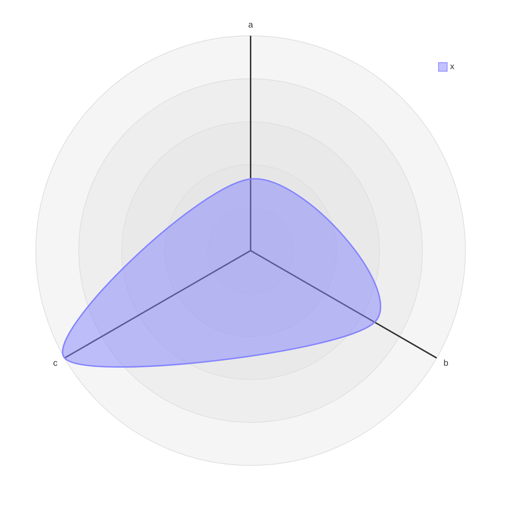
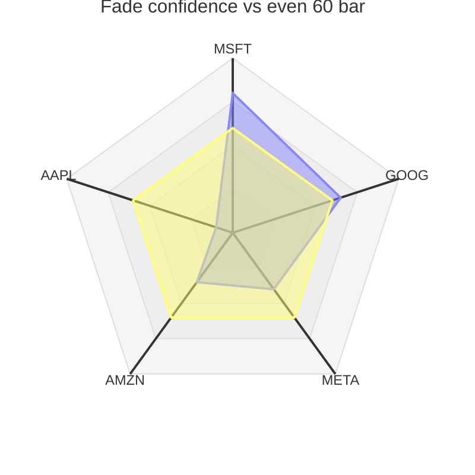

# radar — Radar chart (radar-beta): axes, curves, min/max, config, graticule. https://mermaid.js.org/syntax/radar.html (docs heading: "Radar Diagram (v11.6.0+)") — `radar-beta` · `radar-beta:` · `radar-beta :`

**Status:** beta. Added in v11.6.0 and marked beta by the -beta keyword. The detector in 11.17.2 is /^\s*radar-beta/, so a bare `radar` header is not recognised. The grammar is the same in 11.17.2 and develop.
**GitHub (11.17.2):** The docs say nothing about GitHub. The repo's own measurement (scripts/mermaid-lint.mjs, scripts/ship.sh, docs/PICTURES.md, dated 2026-09-25) is that github.com renders with Mermaid 11.17.2. That is at least 11.6.0, and PICTURES.md lists radar-beta as drawable. The repo lint parses with exactly 11.17.2, and both examples pass it. The 11.17.2 grammar is the same as develop. Its renderer adds outward-anchored axis labels and overflow=visible, so legend or label text that runs past the viewBox is not clipped by the SVG, although GitHub's frame might still clip it. Radar has no click callbacks or icons, so no GitHub feature gaps apply. The GitHub mobile app does not render Mermaid at all; a phone browser does. Fixed theme and themeVariables are rejected by the repo lint, because GitHub picks light or dark per page. Whether GitHub honours config.themeCSS is unverified. I did not look at the rendered picture on github.com itself: verify on github.com, especially dark-mode contrast of the #DEDEDE graticule and the legend or label overflow.

## When to reach for it
- Research call sheets (docs/research/*, symbol-sweep synthesis) where the call is 'which of N names clears the bar'. Use 3-8 names as spokes on one 0-100 scale (confidence, or evidence strength), one data curve plus a constant deploy-bar curve. Readers see from the shape which spokes break the bar. This is the rich example.
- Bot persona profile cards: one persona's normalised dimensions (for example leverage, holding period, turnover, drawdown tolerance, catalyst reliance) as one curve, against a constant house-limit ring. Useful in persona docs, and in PRs that change a persona's risk parameters, as small multiples (one radar before, one after) rather than two overlaid curves.
- Snapshot of gate and budget use: each defensive gate (spec-gap, dead-code, dupes, arch, issue-lint) as % of its budget, against a 100% ring. One picture shows which coach is over budget. The weekly trend belongs in an xychart.
- Interrogation or decision call sheets comparing candidate shapes (verbatim / amended / reject / status-quo) on 4-6 shared criteria, but only as small multiples (one radar per shape, same axis order and max). One overlay of 4 curves would rely on hue alone.
- Any comparison where every axis uses the same, bounded, non-negative scale and the question is the overall profile, not exact values.

**Not for:**
- Time series and ratchets (a fitness budget going down week by week, P&L over time). Use xychart. Radar has no time axis.
- Anything that can go negative: returns, P&L, deltas, greeks with sign. The parser rejects '-', and offsetting the data hides the zero line.
- Axes with mixed units or scales that aren't normalised. The enclosed area suggests a comparison that doesn't exist.
- More than 2 overlaid curves, or any chart that needs the legend to tell curves apart. Identity is hue-only, fills blend, and a red/green colorblind reader cannot match swatch to curve.
- Anything that needs exact values or rankings. There are no tick numbers and no point labels. Use a table, or an xychart bar.
- Architecture, flow, sequence, state, or anything with relationships. Radar has no edges.
- Data with an arbitrary axis order. Reordering spokes changes the shape and area, which invites false reads of the shape.
- Fewer than 3 or more than about 8 dimensions: degenerate below, unreadable at 390px above.
- Trivial PRs (typo, chore). A decorative radar spends the reader's glance for nothing. Use the Picture waiver.

## Header forms
- radar-beta
- radar-beta:   (colon form accepted by grammar: 'radar-beta' | 'radar-beta:' | 'radar-beta' ':')
- Blank lines before the header are allowed (grammar starts with NEWLINE*)
- YAML frontmatter with title:
---
title: "Grades"
---
radar-beta
- YAML frontmatter with type config (the key is `radar`):
---
config:
  radar:
    width: 300
    height: 300
    axisScaleFactor: 1
    axisLabelFactor: 1.05
    curveTension: 0.17
---
radar-beta
- Docs example with theme and themeVariables (this repo's lint REJECTS it because it fixes the theme):
---
config:
  theme: base
  themeVariables:
    cScale0: "#FF0000"
    radar:
      curveOpacity: 0
---
radar-beta
- %%{init: {"radar": {"curveTension": 0}}}%% on the line above radar-beta parses, but it is deprecated. The repo lint prints a note: use frontmatter instead.

## Primitives
| Form | Syntax | Note |
|---|---|---|
| axis (bare id) | `axis A, B, C` | Declares spokes clockwise from 12 o'clock, in declaration order. The label defaults to the id. The ID terminal is /[\w]([-\w]*\w)?/: ASCII word chars and inner dashes only. No spaces, no trailing dash, no unicode. |
| axis with label | `axis m["Math"], s['Science']` | Labels must be quoted with double or single quotes; an unquoted label is a parse error. Escape a quote as \". Unicode such as '·' or '★' is fine inside the quotes. |
| multiple axis lines | `axis m["Math"], s["Science"], e["English"] axis h["History"], g["Geography"], a["Art"]` | Axes from every axis line add up in order. Splitting them over lines keeps the source readable. |
| curve, positional values | `curve c1{1, 2, 3, 4, 5}` | The nth value goes to the nth axis. A wrong count still parses: in 11.17.2, curve x{1, 2} on 3 axes parsed to entries [1,2] with no error, so the shape is silently wrong. |
| curve with label | `curve a["Alice"]{85, 90, 80, 70, 75, 90}` | The label is the legend text. It defaults to the id. |
| curve, keyed values | `curve id4{ axis3: 30, axis1: 20, axis2: 10 }` | Values are matched to axis ids and reordered into axis order. The colon is optional: { a 1, b 2 } parses. Every axis needs a value, or parsing fails with 'Missing entry for axis <label>'. A curve cannot mix keyed and positional values. An axis line placed after the curves still works. |
| several curves on one line | `curve id2["Label2"]{4, 5, 6}, id3{7, 8, 9}` |  |
| values across several lines | `curve x{   1,   2,   3 }` | Newlines are allowed inside the braces. |
| option: max | `max 100` | Sets the outer ring. If you leave it out, the largest data value becomes the rim. |
| option: min | `min 0` | Default is 0. Negative numbers do not parse. |
| option: graticule | `graticule circle \| graticule polygon` | Default is circle. It also changes how curves are drawn: circle gives rounded Catmull-Rom curves shaped by curveTension, polygon gives straight edges. Any other word is a parse error. |
| option: ticks | `ticks 5` | Number of concentric rings, default 5. Values above 32 are capped at 32 with a logged warning. |
| option: showLegend | `showLegend true \| showLegend false` | Default is true. Only true or false are accepted: 'no' is a parse error. |
| several options on one line | `max 10, min 0, ticks 5` | Parses under 11.17.2. If an option appears twice, the last one wins (max 10 then max 20 gives 20). |
| numbers | `INT /0\|[1-9][0-9]*/ or FLOAT /[0-9]+\.[0-9]+/` | Decimals like 0.5 work. These do not parse: -1, .5, 1e3, or a leading-zero integer like 07. |

## Relations
| Form | Syntax | Note |
|---|---|---|
| none (no edges) | `n/a` | Radar has no edges, arrows or links. The only 'relation' is how curve values bind to axes. |
| positional binding | `curve c{v1, v2, v3}` | The value at index i goes to the i-th declared axis. If you reorder axes, you must reorder every positional curve. |
| keyed binding | `curve c{ axisId: v, axisId2: v2 }` | Binding is by axis id, so it survives axis reordering. Every axis must be present. |

## Grouping
- No grouping construct: no subgraphs, groups, columns or nesting.
- The only grouping is on a line: comma lists after `axis`, after `curve`, and between options.
- Several statements of the same kind add up in declaration order. Axis order sets the spoke order, clockwise from the top. Curve order sets the colour index (cScale0, cScale1, ...).

## Annotations
- Title in frontmatter: `title: Grades` in the --- block. This is the docs' own first example.
- Title keyword: `title Restaurant Comparison`. It takes the rest of the line literally, so `title "Quoted"` keeps the quote marks in the rendered title. A trailing `%% ...` on the title line is stripped.
- accTitle: <single line>, from the common grammar. It becomes the SVG <title> and aria-labelledby.
- accDescr: <single line> or accDescr { multi-line }. It becomes the SVG <desc> and aria-describedby.
- Axis labels: id["text"]. Curve labels: id["text"], shown as legend text.
- Comments: a %% line on its own, or a trailing `%% ...` after a statement. Both parse under 11.17.2.
- There are no point labels, no value labels, and no numbers on the tick rings. Nothing on the chart states the scale, so put it in the title.

## Emphasis without hue (the colourblind rule)
- Nothing in the DSL varies a curve by dash or line weight. curveStrokeWidth and curveOpacity are global and blocked by the repo lint. The legend swatch identifies a curve only by hue. So identity has to come from shape and text, not from styling.
- Reference-shape trick: add a constant curve (for example {60, 60, 60, 60, 60}). It draws as a regular polygon (with graticule polygon) or a near-circle (with circle), next to the irregular data shape. The reader can tell 'bar' from 'data' by shape alone, and the title names which is which. This is the rich example.
- Draw one data curve per chart, and use small multiples (one radar per name or persona) instead of overlaying curves. The reader never has to match a curve to a swatch.
- `showLegend false`, with the key written in words in the title (for example 'irregular = confidence, even pentagon = bar'). This removes the only hue-only element.
- Pick ticks and max so a graticule ring lands on the threshold (max 100, ticks 5 puts a ring at 60), and say 'ring 3 = deploy bar' in the title. Or choose ticks so the threshold does NOT coincide with a ring (ticks 4 with a bar at 60), so the bar curve can't be mistaken for grid.
- Put marks and numbers in axis label text: axis msft["MSFT 80 ★"], or numbered spokes axis a["1 MSFT"]. Unicode inside the quoted label parses in 11.17.2. Labels are plain SVG text: no markdown or bold (inferred from the renderer's .text()).
- `graticule polygon` versus `circle` switches every curve between straight-edged and rounded. It is global, but it helps a constant reference ring stand apart from circular gridlines.
- Order curves so the most important one is curve 0. In the default theme, cScale0 (blue, hsl 240) and cScale1 (yellow, hsl 60) differ in lightness and on the blue-yellow axis, so a red/green colorblind reader can tell them apart. In the Mermaid Chart render, cScale2 (hsl 80) is almost the same as cScale1, and cScale3 (hsl 270) is close to cScale0. Don't use more than 2 curves.
- Possible but unverified: config.themeCSS such as ".radarCurve-1 { stroke-dasharray: 6 4; fill-opacity: 0; }". It parses and passes the repo lint, but I have not checked whether GitHub honours it, so don't rely on it.

## Styling hooks
- There is no classDef, style, ::: or per-element style syntax. You cannot style one curve from the DSL.
- Curve colour comes only from its index: .radarCurve-N and .radarLegendBox-N use themeVariables cScaleN. The docs say the maximum index is usually 12 (THEME_COLOR_LIMIT). Curves past that index get no generated style.
- Global themeVariables: fontSize (title), titleColor, cScale0..cScale11.
- themeVariables.radar.*: axisColor, axisStrokeWidth, axisLabelFontSize, curveOpacity, curveStrokeWidth, graticuleColor, graticuleOpacity, graticuleStrokeWidth, legendBoxSize, legendFontSize. These apply to every curve at once.
- The docs' default table does not match the 11.17.2 theme code. In 11.17.2: axisStrokeWidth 2, axisLabelFontSize 12, curveOpacity 0.5, graticuleColor #DEDEDE, graticuleOpacity 0.3, legendBoxSize 12, legendFontSize 12, axisColor = lineColor. styles.ts appends 'px' to the two font sizes, so give plain numbers such as 12, not '12px'.
- The renderer's CSS classes are radarTitle, radarAxisLine, radarAxisLabel, radarGraticule, radarCurve-N, radarLegendBox-N and radarLegendText. They are the only way to target parts, via config.themeCSS.
- REPO CONSTRAINT: scripts/mermaid-lint.mjs rejects any `config.theme` or `config.themeVariables`, because they freeze one of GitHub's light/dark modes. So in this repo every hue, opacity, stroke and font-size knob above is off-limits. What remains: the config.radar layout keys, and themeCSS. themeCSS parses and passes the lint, but I have not checked that GitHub applies it.

## Config keys
- config.radar.width, default 600. Diameter = min(width, height). The viewBox is width + marginLeft + marginRight.
- config.radar.height, default 600
- config.radar.marginTop / marginBottom / marginLeft / marginRight, default 50 each
- config.radar.axisScaleFactor, default 1. Spoke length = radius × factor, so 0.25 gives short spokes (docs example).
- config.radar.axisLabelFactor, default 1.05. Label distance = radius × factor (+4px pad in 11.17.2).
- config.radar.curveTension, default 0.17. Catmull-Rom to Bézier tension. Only matters with graticule circle.
- DSL options (written in the diagram body, not in config): showLegend (default true), max (default: the largest data value), min (default 0), graticule circle|polygon (default circle), ticks (default 5, at most 32).
- Theme keys, blocked by the repo lint: themeVariables.fontSize, titleColor, cScale0..11, and radar.{axisColor, axisStrokeWidth, axisLabelFontSize, curveOpacity, curveStrokeWidth, graticuleColor, graticuleOpacity, graticuleStrokeWidth, legendBoxSize, legendFontSize}.
- Phone lever the repo lint allows: config.radar width: 300, height: 300 gives a 400×400 viewBox. At 390px that is about 1:1, so 12px labels stay near 12px. The default 700 viewBox shrinks them to about 6.7px.

## Gotchas — what silently breaks
- The header must be `radar-beta`. A bare `radar` is not detected in 11.17.2.
- Numbers cannot be negative. `-1` and `min -5` are lexer errors ('unexpected character: ->-<-'). Leading-dot decimals like .5 and exponents also fail. So P&L, returns and deltas cannot be plotted without offsetting them yourself.
- Values outside [min, max] are clamped without warning (relativeRadius clips). An outlier past max sits on the rim and looks equal to max.
- If max is left out, the largest value touches the rim, which exaggerates small differences. Always set max. All-zero data with no max makes max = min (a divide-by-zero radius).
- Labels need quotes. axis a[Alpha] is a parse error ('Expecting token of type STRING').
- IDs are ASCII [\w-] and cannot end with a dash. These fail to parse: `axis my axis` (space), `axis axis-` (trailing dash), `axis é` (unicode). `my-axis` is fine.
- Keywords cannot be used as ids. `axis max, curve` fails ('Expecting token of type ID but found max'). Likely also true for min, ticks, graticule, showLegend, axis, title, true, false, circle, polygon.
- A semicolon at the end of a line (`axis a, b, c;`) is a lexer error.
- A curve cannot mix keyed and positional values (`{ a: 1, 2, 3 }` fails). A keyed curve that is missing an axis fails with 'Missing entry for axis <label>'.
- A wrong number of positional values parses silently: fewer values drop spokes, extra values are kept. Count them by hand.
- `title "X"` keeps the literal quote marks. Write the title keyword without quotes, or use frontmatter title:.
- The tick rings have no numbers and the points have no value labels. A reader cannot recover exact values, so state the scale in the title and keep exact figures in a table next to the chart.
- The legend sits in the top-right at x = 0.75 × (width/2 + marginRight) with a 12px swatch. At the default size it has about 70px for text, roughly 8 characters at 12-14px. In 11.17.2 the SVG sets overflow=visible, so longer labels run past the viewBox and may be clipped or collide in GitHub's frame. Keep legend labels short, or use showLegend false.
- Long left or right axis labels can spill past a 50px margin, especially after narrowing width/height. Keep them to about 5 characters (tickers work) or widen marginLeft and marginRight.
- Curve fills are semi-transparent (0.5 in 11.17.2), so overlapping curves blend into new colours. With more than 2 curves, a colorblind reader cannot tell which curve is which.
- The shape depends on axis order. The same data in a different order encloses a different area, so fix the order by meaning (for example ranked) and say so.
- With fewer than 3 axes the data encloses no area (inferred). With more than about 8, the labels crowd at 390px.
- The repo lint rejects theme and themeVariables, so the docs' own 'config and theme' example fails ship.sh checkbody and issue-lint in this repo.
- The Mermaid Chart MCP renders with an older Mermaid build: axis labels lack the outward text-anchor, and the SVG lacks overflow=visible. Its preview is not GitHub's rendering. The repo's pinned 11.17.2 lint is the authority.
- The docs' default table (curveOpacity 0.7, axisStrokeWidth 1, legendFontSize 14px, axisColor black) does not match 11.17.2's theme code (0.5, 2, 12, lineColor).
- legendBoxSize is probably ignored: the develop renderer hardcodes the legend rect at width 12 and height 12. Unverified in the 11.17.2 build.

## Starters (validated Two validators, both run on the exact source pasted above. (1) mcp__Mermaid_Chart__validate_and_render_mermaid_diagram returned valid:true, diagramType 'radar' for both. For the rich example it rendered a 400×400 viewBox with the title at y=-200, five labelled spokes, curves radarCurve-0 and radarCurve-1, and no legend. (2) This repo's scripts/mermaid-lint.mjs lintMermaid, run under the pinned mermaid 11.17.2 (the version the repo's lint pins for github.com), returned problems:[] and notes:[] for both. The rich example is grounded in docs/research/multi-symbol-sweep.md: S3 reaction-day fade, strongest on MSFT (p=3.4e-4), then GOOG (p=0.0014), META/AMZN direction only, absent on AAPL. The 0-100 confidence scores are illustrative.; minimal ✓, rich ✓ — None for the two examples. Edge cases probed under 11.17.2. Fail: negative value, `min -5`, `.5`, unquoted label, space in id, trailing-dash id, unicode id, keyword as id (`max`), semicolon, mixed keyed/positional curve, keyed curve missing an axis ('Missing entry for axis c'), `showLegend no`, `graticule square`, and a fixed theme (repo policy). Pass: `radar-beta:`, keyed values without colons, curve before axis, single-quoted labels, \" escapes, unicode inside labels, several options on one line, values split over lines, trailing %% comments, empty `radar-beta`, axes with no curves, wrong-count positional curves (these pass silently), themeCSS, and %%{init}%% (with a deprecation note).)

Minimal:

Rich (grounded in this repo):

## Sources
- https://raw.githubusercontent.com/mermaid-js/mermaid/develop/packages/mermaid/src/docs/syntax/radar.md
- https://mermaid.js.org/config/schema-docs/config-defs-radar-diagram-config.html
- https://raw.githubusercontent.com/mermaid-js/mermaid/develop/packages/parser/src/language/radar/radar.langium
- https://raw.githubusercontent.com/mermaid-js/mermaid/develop/packages/parser/src/language/common/common.langium
- https://raw.githubusercontent.com/mermaid-js/mermaid/develop/packages/mermaid/src/diagrams/radar/db.ts
- https://raw.githubusercontent.com/mermaid-js/mermaid/develop/packages/mermaid/src/diagrams/radar/renderer.ts
- https://raw.githubusercontent.com/mermaid-js/mermaid/develop/packages/mermaid/src/diagrams/radar/styles.ts
- https://raw.githubusercontent.com/mermaid-js/mermaid/mermaid@11.17.2/packages/mermaid/src/diagrams/radar/renderer.ts
- https://raw.githubusercontent.com/mermaid-js/mermaid/mermaid@11.17.2/packages/parser/src/language/radar/radar.langium
- /home/user/skynet-capital/node_modules/mermaid (v11.17.2) dist/chunks/mermaid.esm/chunk-AHS5MEEA.mjs (radar theme defaults) and the radar-beta detector
- /home/user/skynet-capital/scripts/mermaid-lint.mjs
- /home/user/skynet-capital/scripts/ship.sh
- /home/user/skynet-capital/docs/PICTURES.md
- /home/user/skynet-capital/docs/research/multi-symbol-sweep.md
