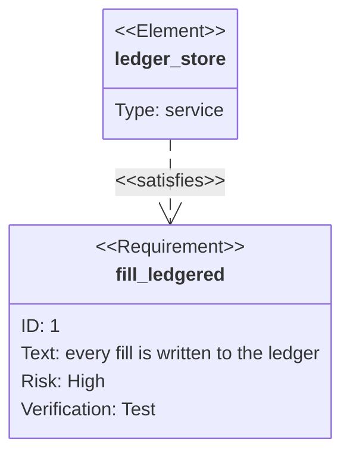
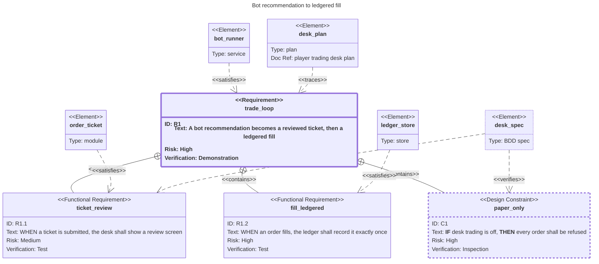

# requirementDiagram — https://mermaid.js.org/syntax/requirementDiagram.html (source: packages/mermaid/src/docs/syntax/requirementDiagram.md on develop). Models requirements and how they connect, using SysML v1.6 terms. Page sections: intro, Default theme/look/layout (v12.0.0+), Syntax (Requirement, Element, Markdown Formatting, Relationship), Larger Example, Direction, Styling (Direct Styling, Class Definitions, Default class, Applying Classes, Combined Example). — `requirementDiagram`

**Status:** stable. The keyword has no -beta suffix and the page marks nothing beta or experimental. It is not on docs/PICTURES.md's list of prescribed stable types, but that list is the repo's own choice, not the docs' status. Feature arrival is uneven: the Direction, Styling (style/classDef/class/:::) and Markdown Formatting sections are in the docs from mermaid@11.5.0 and missing at mermaid@11.4.1. From v12.0.0 the type defaults to the redux-color theme, the neo look and the ELK layout (older versions used Dagre).
**GitHub (11.17.2):** The page says nothing about GitHub or other integrations, so verify on github.com. Version facts from the docs history: requirementDiagram predates v11, but direction, style/classDef/class/:::, and markdown in quoted text first appear in the docs at mermaid@11.5.0 (missing at 11.4.1). The v12.0.0 defaults (redux-color theme, neo look, ELK layout) may not match GitHub's deployed renderer, and ELK may not be available there at all. The safe core for an unknown GitHub version: the six requirement types, element blocks, the seven relations in both arrow forms, accTitle/accDescr, %% comments, all text quoted. Keep classDef/:::/markdown/direction out of PR and issue bodies until a github.com render check confirms them. docs/PICTURES.md also bans style/classDef by default for dark-mode reasons, though stroke-width/dasharray/font-weight without hex colours carry no hue. This type has no click callbacks, so GitHub's click restriction costs nothing here.

## When to reach for it
- Plan files with EARS acceptance criteria (docs/plans/*.md, e.g. docs/plans/player-trading-desk.md, whose WHEN/IF...shall bullets carry '— verify: spec'). Each criterion becomes a functionalRequirement whose text is the EARS sentence, verifymethod matches the verify tag (test = spec, inspection = review, demonstration = live demo), an element satisfies it (the module) and an element verifies it (the BDD spec). This is a traceability matrix drawn as a picture.
- Issue capsules read by a zero-context build session. A 3-5 node picture of 'these criteria are the contract; this spec must verify each' tells the builder exactly what done means, which is token-efficient building to spec.
- Spec-gap and /ears//backfill work: a requirement with no incoming 'verifies' edge is visibly unverified. Mark it with classDef stroke-dasharray:5 so the gap shows without hue.
- Guardrails and invariants as designConstraint: paper-only / desk trading off-switch, the irreversible class, envelope.json limits, merge-policy rules. The «Design Constraint» header separates them from features in words.
- Plan decomposition: one epic requirement 'contains' its slice criteria (solid circle-cross edges), which mirrors plan issue → slice issues.
- PR bodies for PRs that close specific acceptance criteria. A small picture of 'this PR satisfies R1.2; this spec verifies it' can serve as the fridge-rule opening picture when the change IS a requirement closure.

**Not for:**
- Anything ordered in time: bot recommends → ticket → fill, PR verify → auto-merge → deploy, issue proposed → ready → executing → done. There are no sequence or state semantics. Use sequenceDiagram, flowchart or stateDiagram-v2.
- App architecture (browser app, API server, bot runner, ledger store, GitHub, market-data provider). Elements are flat boxes with no boundaries or protocols, so it reads as a fake C4. Use C4/flowchart.
- Research call sheets (call · confidence · why · falsifier) and interrogation call sheets. Box fields are fixed to id/text/risk/verifymethod, so squeezing confidence or falsifier into text misleads. Use a table.
- Fitness-budget ratchets over weeks (use xychart/gantt) and platter PRs merging one commit per item (use a table or gitGraph).
- Large traceability sets (more than ~5 nodes) on a phone. Boxes are wide (the 9-node example was 1689px), so a markdown table of criterion · satisfied by · verified by reads better at 390px.
- Using risk as a severity heatmap. Risk is only a text line, and the v12 palette hues are per-node decoration, not risk.
- Trivial PRs (typo/chore). Per PICTURES.md, an honest 'Picture: waived' beats a decorative requirement box.

## Header forms
- requirementDiagram
- ---
title: Bot recommendation to ledgered fill
---
requirementDiagram   (frontmatter title is drawn above the diagram as text.requirementDiagramTitleText; a YAML value that contains ': ' must be quoted)
- ---
config:
  theme: default
  look: classic
  layout: dagre
---
requirementDiagram   (from the page: draws the pre-v12 look)
- ---
config:
  requirement:
    useMaxWidth: true
    rect_min_width: 200
    fontSize: 14
---
requirementDiagram   (type-scoped config block, keys from config.schema.yaml RequirementDiagramConfig)
- mermaid.initialize({ layout: 'dagre', requirement: { theme: 'default', look: 'classic' } })   (from the page: API-level, sets the theme and look for this type only; layout is top-level and applies to every diagram)
- %%{init: {...}}%% directive: generic Mermaid, not mentioned on this page. docs/PICTURES.md bans init blocks by default

## Primitives
| Form | Syntax | Note |
|---|---|---|
| requirement (generic) | `requirement name {     id: user_defined_id     text: user defined text     risk: low\|medium\|high     verifymethod: analysis\|inspection\|test\|demonstration }` | Header renders as «Requirement». The name is bold, followed by the lines 'ID:', 'Text:', 'Risk:', 'Verification:'. Every body field is optional, in any order, one per line. Empty fields are left off the box. |
| functionalRequirement | `functionalRequirement name { ...same body... }` | Header renders as «Functional Requirement» |
| interfaceRequirement | `interfaceRequirement name { ...same body... }` | Header renders as «Interface Requirement» |
| performanceRequirement | `performanceRequirement name { ...same body... }` | Header renders as «Performance Requirement» |
| physicalRequirement | `physicalRequirement name { ...same body... }` | Header renders as «Physical Requirement» |
| designConstraint | `designConstraint name { ...same body... }` | Header renders as «Design Constraint». Fits guardrails and invariants. |
| risk enum | `risk: low \| medium \| high` | The table writes Low/Medium/High. The lexer is case-insensitive, so either case works. Renders as the text 'Risk: High'. There is no visual scale. |
| verifymethod enum | `verifymethod: analysis \| inspection \| test \| demonstration` | Also accepted as verifyMethod (case-insensitive). Renders as 'Verification: Test'. |
| element | `element name {     type: user_defined_type     docref: user_defined_ref }` | A lightweight link out to another document or artifact. Header renders as «Element», then 'Type:' and 'Doc Ref:'. docRef/docref are both accepted. An empty body 'element x {\n}' is valid. |
| quoted / markdown name or text | `requirement "__test_req__" {     text: "*italicized text* **bold text**" }` | Any user text can be quoted. Markdown inside quotes works in names, text, docref and similar (v11.5+). Verified: **IF**/**THEN** rendered as <strong>. |
| inline class at definition | `requirement test_req:::important { ... }` | Works on element definitions too: element x:::cls { |

## Relations
| Form | Syntax | Note |
|---|---|---|
| forward form | `source_name - <type> -> destination_name` | Both endpoints must be names of requirement or element nodes defined elsewhere |
| reverse form | `destination_name <- <type> - source_name` | Same meaning as the forward form, e.g. test_req <- copies - test_entity2 means test_entity2 copies test_req. Verified with 'trade_loop <- traces - desk_plan'. |
| contains | `parent - contains -> child` | Requirement decomposition. Renders as a SOLID line with a circle-cross (containment) marker at the source/parent end and no arrowhead, labelled «contains». It is the only relation drawn differently from the rest. |
| copies | `a - copies -> b` | SysML «copy», a reused, read-only copy of a requirement. Dashed line (10,7) with arrowhead at the destination, labelled «copies». |
| derives | `a - derives -> b` | SysML «deriveReqt», a requirement derived from another. Dashed + arrowhead + «derives». The docs do not say which end is the source requirement, so pick a convention and state it. |
| satisfies | `element - satisfies -> requirement` | A design element (module/service/store) meets the requirement. Dashed + arrowhead + «satisfies». |
| verifies | `test_element - verifies -> requirement` | A test, spec or evidence proves the requirement. Dashed + arrowhead + «verifies». |
| refines | `a - refines -> b` | SysML «refine», a more detailed statement of a requirement. Dashed + arrowhead + «refines». |
| traces | `a - traces -> b` | Generic SysML «trace» dependency. Dashed + arrowhead + «traces». The page gives only the 7 names; their meanings come from SysML, not this page. |

## Grouping
- None. There is no subgraph, boundary, box, namespace or section construct.
- The only hierarchy is the 'contains' relation (parent - contains -> child), shown with the solid circle-cross edge.
- Use hierarchical ids (R1, R1.1, R1.2) to show nesting in text, as the page's Larger Example does (1, 1.1, 1.2, 1.2.1).

## Annotations
- Every relation gets an automatic edge label «type» (e.g. «satisfies»). Custom edge label text is not possible.
- Every node gets an automatic stereotype header (e.g. «Design Constraint», «Element»).
- YAML frontmatter title: drawn as the diagram title (verified: text.requirementDiagramTitleText).
- accTitle: single line  /  accDescr: single line  /  accDescr { multi-line }. They are in the grammar though the page doesn't mention them. Verified: accTitle became the SVG <title>.
- %% comment lines are skipped. The lexer also skips '#' to end of line as a comment (grammar-derived).
- No notes, tooltips, click/link callbacks, or autonumber exist for this type.
- direction TB|BT|LR|RL statement (TB is the default). Layout only, not an annotation.

## Emphasis without hue (the colourblind rule)
- Built into the edges: 'contains' is a SOLID line with a circle-cross marker at the parent end. All six other relations are DASHED (10,7) with an arrowhead. Decomposition and trace/satisfy/verify links separate without hue.
- Built into the words: every edge carries a «type» label and every node a «stereotype» header, so meaning is always in text. Use designConstraint for guardrails so the header itself reads «Design Constraint».
- Risk and verification method render as words ('Risk: High', 'Verification: Test'), never as colour.
- classDef/style stroke-width:4px for a heavier border on the key node (verified in the rich example).
- classDef/style stroke-dasharray:5 for a dashed border that marks a guard, pending or unverified node. Use ONE value: a comma splits declarations and spaces are dropped (verified: stroke-dasharray:5 and :2 both applied).
- font-weight:bold via classDef (verified), or markdown **bold** / *italic* inside quoted names and text (v11.5+, verified as <strong>).
- Hierarchical ids (R1, R1.1, C1) number and group requirements in text.
- Frontmatter title to name the picture.
- Limit: there is no per-edge emphasis (no linkStyle), so one relation cannot be made to stand out from others of the same type.
- Caution: the v12 default redux-color theme gives each node an arbitrary palette hue. That colour carries no meaning, but a reader may assume it does. Say so, or pin theme: default / look: classic where the renderer honours it.

## Styling hooks
- style name1,name2 fill:#ffa,stroke:#000,color:green: direct CSS on one or more nodes
- classDef clsName fill:#f96,stroke:#333,stroke-width:4px: reusable class. A declaration containing 'color' is also applied to the label text.
- classDef default ...: applies to every node. Define specific classes and styles after it to override.
- class name1,name2 clsName1,clsName2: many nodes, many classes
- name:::clsName: shorthand, either inline at the definition (requirement x:::c {) or as a standalone statement. It can set several classes but only on ONE node.
- No linkStyle. Edges cannot be styled one at a time (verified: 'linkStyle 0 ...' is a parse error).
- themeVariables: requirementBackground, requirementBorderColor, requirementBorderSize, requirementTextColor, relationColor, relationLabelBackground, relationLabelColor; requirementEdgeLabelBackground (develop styles.js); bkgColorArray / borderColorArray (v12 color themes cycle per-node palette slots)
- CSS classes in styles.js: .reqBox, .reqTitle, .reqLabel, .reqLabelBox, .req-title-line, .relationshipLine, .relationshipLabel, .divider, .edgeLabel, .labelBkg, .requirementDiagramTitleText; [data-look][data-color-id=color-N].node for the palette

## Config keys
- requirement.useMaxWidth (required in schema; BaseDiagramConfig)
- requirement.theme (default 'redux-color' in v12)
- requirement.look (default 'neo' in v12; 'classic' for the old look; handDrawn also recognised by the shape code)
- top-level layout: ELK is the v12 default for this type; 'dagre' restores the old layout. It is top-level, so it applies to every diagram on the page.
- requirement.rect_fill (default '#f9f9f9')
- requirement.text_color (default '#333')
- requirement.rect_border_size (default '0.5px')
- requirement.rect_border_color (default '#bbb')
- requirement.rect_min_width (default 200)
- requirement.rect_min_height (default 200)
- requirement.fontSize (default 14)
- requirement.rect_padding (default 10)
- requirement.line_height (default 20)
- NOTE: the rect_* / text_color / line_height keys come from config.schema.yaml and are not named on the page. Whether they still take effect in the unified (v11.5+) renderer is unverified; themeVariables and classDef are the dependable levers.

## Gotchas — what silently breaks
- UNQUOTED text cannot contain - : , { < > = (the lexer pattern is [\w][^:,\r\n\{\<\>\-\=]*). VERIFIED: 'text: auto-merge only when checks are green' fails with "Expecting 'NEWLINE', got 'LINE'". Quote anything containing a hyphen, comma, colon or angle bracket: paths, EARS 'IF x, THEN y', ISO dates, 'paper-only'.
- An unquoted value whose FIRST word is a keyword fails. The keywords are: test, analysis, inspection, demonstration, low, medium, high, id, text, risk, type, docref, verifymethod, element, requirement (and the other 5 type names), contains, copies, derives, satisfies, verifies, refines, traces, style, class, classDef. VERIFIED: 'text: test coverage never drops' fails with "got 'VERIFY_TEST'". The page's own warning: 'The parser will fail if another keyword is detected.' Keywords inside the value are fine ('the test text.'), and so is a prefix joined to a word character (test_req, tests). Node names and class names that are exactly a keyword fail too.
- A quoted string cannot contain a double quote. There is no escape (the lexer takes [^"]*).
- Block layout is strict. '{' must end its line, each field goes on its own line, and '}' closes the block. VERIFIED: 'requirement a { id: 1 }' on one line fails with "Expecting 'NEWLINE', got 'ID'".
- Keywords are case-insensitive (%options case-insensitive), so verifyMethod/verifymethod, docRef/docref and High/high all work.
- risk and verifymethod accept ONLY their enums. Anything else is a parse error.
- No linkStyle (VERIFIED parse error), no subgraphs, no notes, no click/tooltips.
- Grammar-derived: any line containing 'direction TB|BT|LR|RL' ANYWHERE (regex .*direction\s+LR[^\n]*) is swallowed as a direction statement, including inside a text value.
- Grammar-derived: 'title ...' inside the body is lexed but no grammar rule consumes it. Use YAML frontmatter title instead.
- Grammar-derived: a value that starts with '#' is eaten as a comment to end of line. Quote it ('#123').
- Grammar-derived: in style/classDef/class lines spaces are dropped and commas split declarations. 'stroke-dasharray:5 5' becomes '55' and 'stroke-dasharray:5,5' splits in two, so use a single value.
- Version drift: direction, style/classDef/class/:::, and markdown in quoted text first appear in the docs at v11.5.0. Older renderers raise parse errors, or show literal ** for markdown.
- v12 defaults (redux-color palette, neo look, ELK layout) change the look and layout versus older renderers. The page's frontmatter (theme: default, look: classic, layout: dagre) restores the old look.
- Width and phone legibility: boxes are at least ~200px wide and siblings spread sideways. The validated 9-node rich example rendered at a 1689x715 viewBox, about 23% scale at 390px, which is too small to read on a phone. Keep phone-bound pictures to 5 or fewer nodes, one short chain, and short text.
- The docs don't define which end is which for derives/refines/copies/traces. 'A - derives -> B' is ambiguous to a reader, so declare the convention (e.g. in accDescr or prose).
- Unquoted names can contain internal spaces (the lexer trims them), but this is fragile. Prefer snake_case names.
- The six non-contains relations draw identically. Only the «label» tells them apart.

## Starters (validated mcp__Mermaid_Chart__validate_and_render_mermaid_diagram. Both examples returned valid:true, diagramType 'requirement'. In the rich render I checked 3 «contains» with containsStart markers, 6 dashed edges with arrowEnd markers («satisfies»x3, «verifies»x2, «traces»x1), the classDef stroke-width:4px/3px, stroke-dasharray:5/2 and font-weight:bold applied, the markdown **IF**/**THEN** rendered as <strong>, the frontmatter title drawn, and accTitle placed in the SVG <title>. Four negative probes all failed as predicted: unquoted hyphen, keyword as first word, one-line body, and linkStyle.; minimal ✓, rich ✓ — None for the two examples. Caveat: the rich example rendered at a 1689x715 viewBox, which is valid but too wide to read on a 390px phone. For phone surfaces cut it to 5 or fewer nodes. The Mermaid Chart validator runs a recent (v12-era, redux-color/neo) Mermaid. GitHub's version is unknown, so the classDef/:::/markdown/direction features may not render there.)

Minimal:

Rich (grounded in this repo):

## Sources
- https://raw.githubusercontent.com/mermaid-js/mermaid/develop/packages/mermaid/src/docs/syntax/requirementDiagram.md
- https://mermaid.js.org/syntax/requirementDiagram.html
- https://raw.githubusercontent.com/mermaid-js/mermaid/develop/packages/mermaid/src/diagrams/requirement/parser/requirementDiagram.jison
- https://raw.githubusercontent.com/mermaid-js/mermaid/develop/packages/mermaid/src/diagrams/requirement/requirementDb.ts
- https://raw.githubusercontent.com/mermaid-js/mermaid/develop/packages/mermaid/src/diagrams/requirement/styles.js
- https://raw.githubusercontent.com/mermaid-js/mermaid/develop/packages/mermaid/src/rendering-util/rendering-elements/shapes/requirementBox.ts
- https://raw.githubusercontent.com/mermaid-js/mermaid/develop/packages/mermaid/src/themes/theme-base.js
- https://raw.githubusercontent.com/mermaid-js/mermaid/develop/packages/mermaid/src/schemas/config.schema.yaml (RequirementDiagramConfig)
- https://raw.githubusercontent.com/mermaid-js/mermaid/mermaid@11.4.1/packages/mermaid/src/docs/syntax/requirementDiagram.md
- https://raw.githubusercontent.com/mermaid-js/mermaid/mermaid@11.5.0/packages/mermaid/src/docs/syntax/requirementDiagram.md
- /home/user/skynet-capital/docs/PICTURES.md
- /home/user/skynet-capital/docs/plans/player-trading-desk.md
