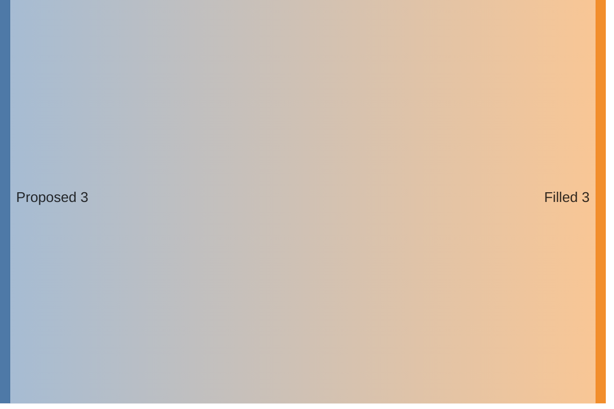
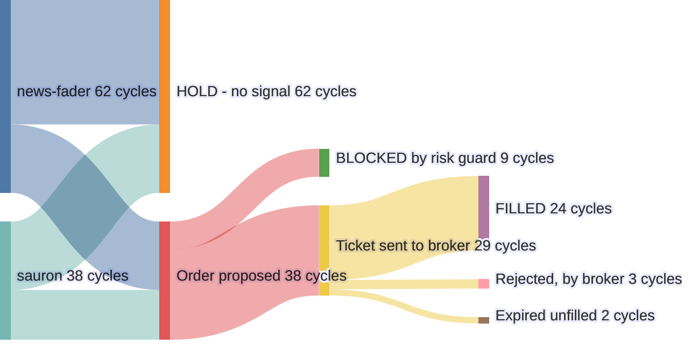

# sankey (https://mermaid.js.org/syntax/sankey.html): "Sankey diagram (v10.3.0+)" — `sankey-beta` · `sankey`

**Status:** experimental. The docs warn: "This is an experimental diagram. Its syntax are very close to plain CSV, but it is to be extended in the nearest future." The type exists since v10.3.0. labelStyle, nodeWidth, nodePadding and nodeColors arrived in v11.15.0. Both keywords parse in Mermaid 11.17.2, the version GitHub runs (checked against the repo's pinned copy). Use `sankey-beta` when you need it to work everywhere: every version since 10.3.0 accepts it.
**GitHub (11.17.2):** The docs say nothing about GitHub. Repo facts (docs/PICTURES.md, scripts/mermaid-lint.mjs): github.com renders Mermaid 11.17.2, and at that version both `sankey-beta` and `sankey` parse (both keywords confirmed with the pinned lint). The v11.15 keys (labelStyle, nodeWidth, nodePadding, nodeColors) are in the 11.17.2 source that is installed. Config only applies through YAML frontmatter; mermaid.initialize is not available. The GitHub mobile app does not render Mermaid at all; a phone browser does. The repo's mermaid-lint only parses, so a cycle ('circular link') or a NaN value from a header row or bad number passes the ship gate and then fails or draws garbage on GitHub. Check the render with the Mermaid Chart MCP before shipping. Still to verify on github.com: how multiply-blended bands look in dark mode, and whether labelStyle: outlined draws its halo in GitHub's iframe.

## When to reach for it
- Bot trade funnel, in a PR or digest about the engine or risk guards: decision cycles per persona → HOLD vs order proposed → blocked by risk guard vs ticket sent → filled / rejected / expired. The question it answers is where volume leaks, and band width answers it without color.
- Throughput digests (docs/digests, secretary skill): a week of issues filed → ready / needs-info / rejected → built → merged / reverted, or PRs opened → verify pass/fail → auto-merge → deployed. Counts that split and merge across stages.
- Platter PR summary: items proposed → merged as a commit / deferred / dropped, with counts.
- Interrogation call-sheet tally: N shapes judged → verbatim / amended / reject / status-quo.
- Compute or fitness budget allocation (docs/COMPUTE.md, coach budgets): total budget → per-agent or per-coach → per-task class, when the quantity is conserved (tokens, dollars, minutes).
- Paper-account capital allocation: account equity → persona → strategy or underlying (all positive, conserved amounts).

**Not for:**
- Lifecycles with loops or retries (issue reopened, PR re-verified, proposed → ready → executing → done with back-edges). A cycle crashes the render; use stateDiagram-v2.
- Order in time or request paths (trade → ticket → fill as messages): there is no time axis and no message order. Use sequenceDiagram or timeline.
- Architecture and dependencies (browser app, API server, bot runner, ledger, GitHub, market data): band width would imply a traffic volume nobody measured. Use C4 or flowchart.
- Quantities that are not conserved (confidence scores, ratings, percentages that do not add up, research call-sheet confidence): the widths would mislead.
- Signed flows such as P&L with losses as negative numbers: negatives are unsupported. Model a loss as a positive sink node or use a table.
- Two or three rows: a key · count table is faster to read.
- Illustrative or invented counts in a PR body break the grounding honesty rule unless the caption says 'illustrative'.
- Any label that needs the house glyphs (· → —) or non-ASCII text.
- Emphasis that relies on node color (good green vs bad red): unreadable for the red/green colorblind reader.

## Header forms
- sankey-beta   (portable form; must be lowercase, alone on its line, with NO trailing whitespace)
- sankey   (bare form; the current docs use it and 11.17.2 accepts it because the detector regex is /^\s*sankey(-beta)?/)
- ---\ntitle: <text>\nconfig:\n  sankey:\n    width: 460\n    height: 320\n    showValues: true\n    suffix: " cycles"\n    labelStyle: outlined\n    nodeAlignment: left\n    linkColor: source\n---\nsankey-beta   (YAML frontmatter. This is the only way to set config on GitHub. title: is accepted but the sankey renderer never draws it)
- %%{init: {"sankey": {"showValues": false}}}%%\nsankey-beta   (init directive: it parses, but it is deprecated upstream and the repo's mermaid-lint flags it)
- Uppercase SANKEY-BETA is REJECTED with 'No diagram type detected' (the detector is case-sensitive even though the lexer is not). Checked with the 11.17.2 lint.
- Text on the keyword line breaks the parse ('sankey-beta A,B,10', or 'sankey-beta' followed by trailing spaces, gives 'Expecting NEWLINE'). Rows start on the next line. Blank lines and %% comment lines between the keyword and the first row are fine.

## Primitives
| Form | Syntax | Note |
|---|---|---|
| node (implicit) | `any source or target field, e.g. Order proposed` | There is no separate node declaration. A node is created the first time a string appears in either column. Its identity is the exact trimmed string and is case-sensitive: 'Filled' and 'filled' are two nodes. A node's height is the larger of its inflow and outflow. |
| link row (the only statement) | `source,target,value` | Exactly 3 CSV columns (RFC 4180 subset). Two columns fail with 'Expecting COMMA'. Four columns fail with 'Expecting NEWLINE/EOF, got COMMA'. Fields are trimmed, so indenting with spaces is fine. |
| quoted field (contains a comma) | `Pumped heat,"Heating and cooling, homes",193.026` |  |
| escaped double quote | `Pumped heat,"Heating and cooling, ""homes""",193.026` | Write a doubled "" inside a quoted field. The parser turns "" back into ". |
| value | `a decimal number, e.g. 124.729` | Read with parseFloat(trim). Labels show it rounded to 2 decimals. Anything non-numeric becomes NaN and breaks the render with no error. Keep values positive. |
| empty spacer line | `(a truly empty line between rows)` | Allowed for readability; runs of blank lines collapse. A line holding only spaces or tabs is a parse error. |

## Relations
| Form | Syntax | Note |
|---|---|---|
| flow link | `A,B,10` | A flow of magnitude 10 from A to B. Band width is proportional to the value. The only variant: no arrows, no link labels, no dashed or dotted forms, no direction keyword (layout is always left to right). |
| fan-out (split) | `Order proposed,BLOCKED by risk guard,9\nOrder proposed,Ticket sent to broker,29` | Several rows share a source, so one node splits into several bands. |
| fan-in (merge) | `news-fader,Order proposed,22\nsauron,Order proposed,16` | Several rows share a target. The bands merge and the node's height becomes the sum. |
| multi-stage chain | `A,B,10\nB,C,7` | A target that reappears as a source pushes the next node into a new column. Columns come from graph depth, and nodeAlignment decides how they are placed. |
| duplicate pair | `A,B,5\nA,B,3` | Each row is pushed as its own link and nothing is summed (confirmed in sankeyDB addLink), so you get separate parallel bands. Pre-sum the values if you want one band. |
| cycle or self-loop (FORBIDDEN) | `A,B,10\nB,A,5` | It parses, but the render throws 'circular link' (confirmed with the Mermaid Chart MCP). The graph must be a DAG. |

## Grouping
- None. There are no subgraph, section, box, namespace or boundary constructs.
- The only grouping is implicit columns (d3-sankey layers) computed from graph depth. nodeAlignment moves nodes between columns: left puts every node at its depth; right pushes toward the outputs; justify (the default) sends nodes with no outgoing links to the far-right column; center is like left, except nodes with no incoming links move right.
- Blank lines between blocks of rows group the SOURCE text for the author only. They do not change the render.

## Annotations
- %% comment on its own line. The preprocessor strips it (regex ^\s*%%(?!{)[^\n]+). The docs use it as a column header: '%% source,target,value'.
- A trailing %% after a VALUE seems to work only because parseFloat ignores trailing text. After a name it becomes part of the name. Do not rely on either.
- Frontmatter title: parses, but the sankey renderer never draws it (confirmed: the title text is absent from the rendered SVG). Put the title in the markdown caption.
- accTitle / accDescr are NOT supported. A body line such as 'accTitle: x' fails with 'Expecting COMMA'.
- Value labels: showValues (default true) adds prefix + value + suffix to each node label, e.g. suffix ' cycles' renders 'FILLED 24 cycles'. The newline between name and value collapses to a space in SVG, so it all sits on one line (confirmed in the rendered SVG).
- There are no notes, link labels, tooltips, click/href or autonumber.

## Emphasis without hue (the colourblind rule)
- Band thickness IS the value. It is the diagram's main channel and needs no color. Make the thing that matters the fattest or the most visibly thin band.
- Name the drop-off. Route attrition into a named sink node (BLOCKED by risk guard, Expired unfilled, Losses) so a leak reads as a labelled band rather than a color.
- Label text carries emphasis. Use CAPS for outcomes or terminal states (FILLED, BLOCKED, HOLD) and lowercase for intermediate stages. Plain-word markers such as 'NEW -' or 'was -' also work. ASCII only.
- showValues with prefix/suffix prints the number on every node, so magnitude is read rather than guessed from color.
- Position: nodeAlignment 'justify' sends every terminal outcome to the far-right column; 'left' keeps each node beside its source. Pick whichever makes the outcome column the one people compare.
- labelStyle: outlined adds a halo behind labels. That is a contrast aid, not a hue.
- A single CSS color for linkColor removes hue as a channel entirely, so nothing can be read wrongly by hue. It conflicts with the house no-hex rule and may freeze one GitHub theme, so use it only with a contrast-checked snippet.
- Missing tools: no dashed or dotted bands, no node shapes, no border widths, no subgraph titles. If you need them, this is the wrong diagram type.
- State what the bands mean in the markdown caption (e.g. 'band width = decision cycles'). Never state it as a color key.

## Styling hooks
- config.sankey.linkColor: 'source' | 'target' | 'gradient' (default) | a CSS color such as '#a1a1a1', which paints every band that one color
- config.sankey.nodeColors: { "Exact node name": "#4e79a7", ... } (v11.15+). Keys must match the node string exactly. Unlisted nodes keep the palette.
- config.sankey.labelStyle: 'legacy' (default; label goes right of the node if the node's x is in the left half, otherwise left) | 'outlined' (v11.15+; the label gets a halo stroke in mainBkg and is placed by layer relative to the highest-value node)
- Default palette: d3 schemeTableau10, assigned by node name. The rich render drew #4e79a7 blue, #59a14f green and #e15759 red, so red and green can sit next to each other.
- CSS classes you can target: .nodes > .node > rect (shape-rendering crispEdges), .links > .link path (stroke-opacity 0.5, mix-blend-mode multiply, stroke-width = max(1, band width)), .node-labels (font-size 14), .sankey-label-bg / .sankey-label-fg (outlined mode only)
- Theme variables the sankey styles read: fontFamily, textColor (label fill, inherited from the svg root), mainBkg or background (outlined halo). There are NO sankey-specific themeVariables.
- Not available: classDef, style, linkStyle, ::: class shorthand, per-link or per-node style statements.

## Config keys
- width: number, default 600. Layout extent in px; the SVG viewBox follows it.
- height: number, default 400. The renderer's fallback is actually defaultSankeyConfig.width (a harmless upstream typo because defaults merge first), but set it explicitly anyway.
- useMaxWidth: boolean. The schema default is false but the shipped defaults set true, so the SVG scales down to its container (rendered style='max-width: 600px').
- linkColor: 'source' | 'target' | 'gradient' | CSS color, default 'gradient'
- nodeAlignment: 'justify' | 'left' | 'right' | 'center', default 'justify'
- showValues: boolean, default true (set false in the docs examples). When true, 15px is added to nodePadding internally.
- prefix: string, default '' (text before each value, e.g. '$')
- suffix: string, default '' (text after each value, e.g. ' cycles'; keep the leading space)
- nodeWidth: number, default 10 (v11.15+)
- nodePadding: number, default 12 (v11.15+; vertical gap between nodes)
- labelStyle: 'legacy' | 'outlined', default 'legacy' (v11.15+)
- nodeColors: map of node name to CSS color (v11.15+)
- The docs page shows config via mermaid.initialize({sankey:{...}}) in a <script>. On GitHub only frontmatter `config: sankey:` (or a deprecated %%{init}%%) applies. prefix, suffix and useMaxWidth appear only in config.schema.yaml, not on the docs page.

## Gotchas — what silently breaks
- ASCII ONLY, even inside quotes. The lexer's TEXTDATA class is [ -!#-+--~], so the house glyphs (·, →, —), accented letters, emoji and curly quotes all fail. Confirmed with the 11.17.2 lint: 'PR · verify' fails with 'Expecting NEWLINE/EOF/COMMA, got NON_ESCAPED_TEXT'; '"PR → verify"' fails with 'Expecting DQUOTE'. This repo writes those glyphs everywhere, so this is the trap it will hit most.
- The keyword must be lowercase. 'SANKEY-BETA' fails with 'No diagram type detected'.
- Trailing whitespace after the keyword line fails ('Expecting NEWLINE'). Trailing spaces after a data row are fine because values are trimmed.
- A line holding only spaces (for example a blank line your editor indented) fails with 'Expecting COMMA'. Truly empty lines are fine.
- Tab-indented rows fail because tab is not in TEXTDATA. Space indentation is fine.
- Every row needs exactly 3 fields. An empty field (A,,10) fails.
- Thousands separators: 1,000 unquoted fails (4 columns). "1,000" quoted parses, but parseFloat returns 1, a silently wrong value. Write 1000.
- A CSV header row 'source,target,value' parses AND renders with no error, drawing bogus 'source 0' and 'target 0' nodes with NaN paths (confirmed: the Mermaid Chart MCP returned valid:true). Put the header in a %% comment.
- Non-numeric values (ten, n/a) parse and then render as NaN with no error. A unit suffix like 10% reads as 10.
- Cycles and self-loops parse, so they PASS the repo's parse-only scripts/mermaid-lint.mjs, but the render throws 'circular link' (confirmed with the Mermaid Chart MCP). The ship gate cannot catch this; run a render check.
- Node identity is the exact trimmed string and is case-sensitive. A typo or a case difference quietly splits one node into two.
- Rows with the same source and target are not summed; each draws its own band.
- The frontmatter title is never drawn, and accTitle/accDescr lines break the parse. The markdown caption is the only title.
- With showValues on (the default), each label is 'name value' on ONE line, so labels get longer. In legacy mode, labels in the right half are right-anchored and grow leftward over the bands. Keep names to about 20 characters.
- Phone width: useMaxWidth scales the SVG to its container. A 600-wide chart at 390px shrinks about 0.6x, so 14px labels become roughly 8-9px. Set width to about 400-460 for PR bodies.
- Keys added in v11.15+ (labelStyle, nodeWidth, nodePadding, nodeColors) are silently ignored by older renderers. Unknown config keys never raise an error. The Mermaid Chart MCP renderer ignored labelStyle: outlined (no sankey-label-bg in its SVG), so it runs an older Mermaid than GitHub's 11.17.2.
- Bands use mix-blend-mode: multiply at 0.5 opacity. On a dark background they may look muddy. Not verified; check on github.com in dark mode.
- Colors come from Tableau10 by node name, and red (#e15759) and green (#59a14f) can end up next to each other. Never let color encode good or bad.
- Mermaid's global limit is 50,000 characters (MAX_TEXTLENGTH). The repo lint flags diagrams over 40 lines as advisory.

## Starters (validated Two checks. (1) mcp__Mermaid_Chart__validate_and_render_mermaid_diagram: minimal and rich both returned valid:true, diagramType sankey; the rich render drew all 9 nodes with values ('news-fader 62 cycles', ...), viewBox 0 0 460 320. (2) The repo's own parse gate: node scripts/mermaid-lint.mjs --stdin --json, pinned to Mermaid 11.17.2 (GitHub's version); both examples had zero problems. The MCP renderer runs an older Mermaid (it ignored labelStyle: outlined), so the lint is the GitHub contract and the MCP is the render and layout check.; minimal ✓, rich ✓ — None for the two examples. Probes that failed on purpose (11.17.2 lint): uppercase SANKEY-BETA (no diagram type detected); non-ASCII 'PR · verify', quoted '"PR → verify"', 'PR—verify'; tab-indented row; trailing spaces after the keyword; keyword and row on the same line; whitespace-only blank line; accTitle line; 2 columns; 4 columns; empty field; unquoted 1,000. Probes that parse but break at render (MCP): 'A,B,10 / B,A,5' fails with 'circular link' (valid:false); a 'source,target,value' header row returned valid:true but drew bogus 0-value nodes with NaN paths. Probes that passed: bare 'sankey', space-indented rows, trailing spaces on a data row, %% own-line and trailing comments, CRLF, init directive, frontmatter title plus config, parentheses, colon, #, semicolon, HTML-ish text.)

Minimal:

Rich (grounded in this repo):

## Sources
- https://raw.githubusercontent.com/mermaid-js/mermaid/develop/packages/mermaid/src/docs/syntax/sankey.md
- https://mermaid.js.org/syntax/sankey.html
- https://raw.githubusercontent.com/mermaid-js/mermaid/develop/packages/mermaid/src/schemas/config.schema.yaml
- https://raw.githubusercontent.com/mermaid-js/mermaid/develop/packages/mermaid/src/diagrams/sankey/sankeyDetector.ts
- https://raw.githubusercontent.com/mermaid-js/mermaid/develop/packages/mermaid/src/diagrams/sankey/parser/sankey.jison
- https://raw.githubusercontent.com/mermaid-js/mermaid/develop/packages/mermaid/src/diagrams/sankey/sankeyRenderer.ts
- https://raw.githubusercontent.com/mermaid-js/mermaid/develop/packages/mermaid/src/diagrams/sankey/sankeyDB.ts
- https://raw.githubusercontent.com/mermaid-js/mermaid/develop/packages/mermaid/src/diagrams/sankey/sankeyUtils.ts
- /home/user/skynet-capital/node_modules/mermaid/dist/chunks/mermaid.core/sankeyDiagram-P5KCCOFB.mjs (installed 11.17.2: lexer rules, parser actions, renderer, styles)
- /home/user/skynet-capital/node_modules/mermaid/dist/mermaid.core.mjs (preprocess: cleanupComments, frontmatter, MAX_TEXTLENGTH)
- /home/user/skynet-capital/node_modules/mermaid/dist/chunks/mermaid.core/chunk-DU6HZSFF.mjs (default sankey config, global styles)
- /home/user/skynet-capital/docs/PICTURES.md
- /home/user/skynet-capital/scripts/mermaid-lint.mjs
- /home/user/skynet-capital/docs/BOTS.md
