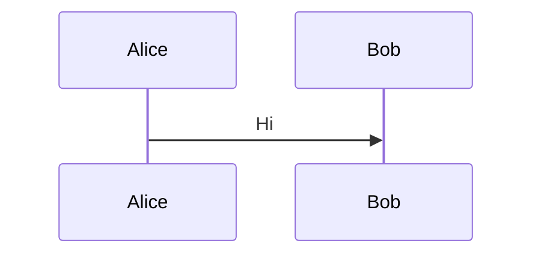
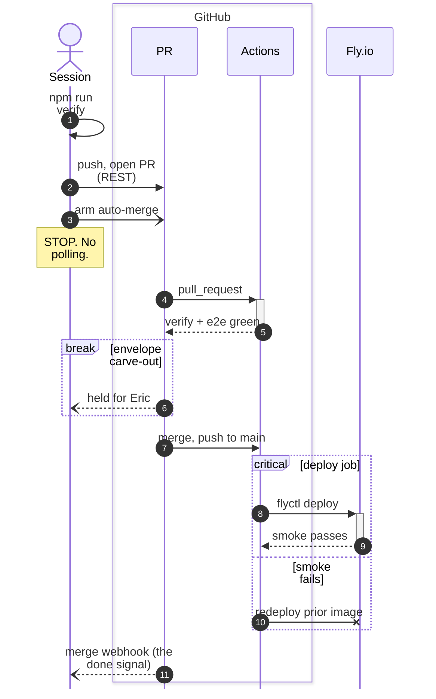

# sequenceDiagram: participants/actors, autonumber, loop/alt/opt/par/critical/break, notes, activations, boxes, links — `sequenceDiagram`

**Status:** stable. The page has no beta marker. Some features are version-gated: create/destroy v10.3.0+, bidirectional arrows v11.0.0+, participant @{type} stereotypes v11.11.0, inline "alias" v11.13.0, neo look v11.14.0, half-arrows and central () connections v11.12.3+, decimal autonumber start/step v11.15.0+, and redux-color + neo as the default theme/look in v12.0.0.
**GitHub (11.17.2):** The sequenceDiagram page says nothing about GitHub or renderer integration, so verify on github.com. Implications drawn from the page and changelog: GitHub's deployed Mermaid version is unknown and lags releases, so avoid half-arrows, central () connections, @{type} stereotypes, inline alias, decimal autonumber and v12 theme names unless GitHub's version is confirmed. GitHub has no site stylesheet, so the page's CSS-class styling can't be used; only theme/init/frontmatter config applies. The link/links popup menus depend on click interaction, which GitHub doesn't provide (no click callbacks), so treat them as inert. %%{init}%% has not been verified on GitHub. It is the config form this repo's ship.sh/issue-lint gates accept, whereas frontmatter '---' fails their type check.

## When to reach for it
- PICTURES.md row 'New route / request path': any PR adding or changing an HTTP/SSE route (src/http, src/server, observatory), e.g. browser -> server -> Alpaca adapter -> response, including the SSE/websocket fan-out
- The land-a-PR loop (scripts/ship.sh, pipeline.yml verify/e2e/arm-auto-merge/deploy/smoke/rollback, moneypenny-events.yml): numbered steps plus break for envelope carve-outs plus critical/option for smoke-fail rollback
- Bot trade lifecycle (src/bots, src/personas, src/risk, src/trading, src/alpaca): persona recommends -> risk check -> ticket -> paper order -> fill event -> equity update, with alt for rejected/unfilled and -x for a cancelled order
- Issue capsules for a zero-context build session: a sequence gives the exact call order plus the failure branches, and autonumber lets EARS criteria cite steps ('WHEN step 5 returns red, the system SHALL ...')
- Event lanes and handoffs: feedback form -> labeled issue -> label event -> fresh build session -> PR (the existing PICTURES.md starter); governor cycle (coach -> gate target -> athlete in worktree -> PR + auto-merge); HANDOFFS/DELEGATION between agents
- Retros (/retro): an autonumbered timeline of who did what, where a Note marks the detection point and the gap to detection reads as step count

**Not for:**
- Lifecycles and modes (issue proposed -> ready -> executing -> done, SIM/LIVE, gates): a state diagram fits better (stateDiagram-v2), since there are no actors exchanging messages
- Static architecture or containment (C4 containers, module maps): a sequence shows time, not structure
- Fitness budgets ratcheting over weeks, or equity curves: these are quantities over time, so use a chart or table
- Research call sheets and interrogation verdicts (verbatim/amended/reject/status-quo): tabular judgments with no message order
- Platter PRs (one commit per item): a list or table of items. A sequence of 'commit' self-messages is decorative
- Trivial or typo PRs: take the 'Picture: waived' path
- A two-actor linear exchange of 2-3 messages: a sentence is cheaper
- More than 5 participants or more than about 15 messages: unreadable at 390px
- Any diagram where box or rect colour is the only signal: fails the red/green colourblind reader

## Header forms
- sequenceDiagram   (bare header. The lexer is case-insensitive, but this repo's gates match the exact token sequenceDiagram)
- ---
title: Ship flow
config:
  theme: default
  look: classic
  sequence:
    mirrorActors: false
---
sequenceDiagram   (YAML frontmatter. The page shows config.theme/look; sequence.* keys scope config to this type)
- %%{init: {"theme": "neutral", "sequence": {"mirrorActors": false, "wrap": true}}}%%
sequenceDiagram   (init directive, older form, validated. In PR/issue bodies this is the ONLY config form that passes ship.sh checkbody / issue-lint, see gotchas)
- title Some title   (in-body statement after the header; legacy form 'title: Some title' also parses)
- accTitle: text / accDescr: text / accDescr { multi-line }   (accessibility statements, in the grammar)
- mermaid.initialize({ sequence: { theme: 'default', look: 'classic', showSequenceNumbers: true } })   (site-level, type-scoped; not available on GitHub)

## Primitives
| Form | Syntax | Note |
|---|---|---|
| implicit participant | `Alice->>John: Hello John` | Created on first mention. Columns follow order of first appearance |
| participant (box) | `participant Alice` | Declaring participants fixes their column order no matter which one messages first |
| actor (stick figure) | `actor Alice` | Different glyph from participant, so it reads without colour |
| external alias | `participant A as Alice` | Short id plus a display label. This is the only way to put a line break in a name: participant Alice as Alice Johnson |
| stereotype participants (v11.11.0) | `participant Alice@{ "type" : "boundary" }   \| "control" \| "entity" \| "database" \| "collections" \| "queue"` | JSON config object after the id. Each type draws a distinct UML shape, e.g. a cylinder for database |
| stereotype + external alias | `participant API@{ "type": "boundary" } as Public API actor DB@{ "type": "database" } as User Database` | Works with both participant and actor |
| inline alias (v11.13.0) | `participant API@{ "type": "boundary", "alias": "Public API" }` | When both are given, the external 'as' alias wins over the inline "alias" |
| create (v10.3.0+) | `create participant Carl Alice->>Carl: Hi Carl! create actor D as Donald Carl->>D: Hi!` | The lifeline starts mid-diagram. The very next message must be TO the created participant, since only the recipient can be created |
| destroy (v10.3.0+) | `destroy Carl Alice-xCarl: We are too many` | The next message must be from or to the destroyed participant; the lifeline ends in an X |
| activation (explicit) | `activate John ... deactivate John` | Draws an activation bar on the lifeline |
| activation (shortcut) | `Alice->>+John: Hello John-->>-Alice: Great!` | + activates the receiver and - deactivates the sender. Activations stack on one actor |
| message | `[Actor][Arrow][Actor]:Message text` | The text runs from the colon to end of line, stopping early at # or ;. Self-messages work: A->>A: text |

## Relations
| Form | Syntax | Note |
|---|---|---|
| solid, no arrowhead | `->` | Solid line without arrow |
| dotted, no arrowhead | `-->` | Dotted line without arrow |
| solid arrow | `->>` | Solid line with arrowhead (typical sync call) |
| dotted arrow | `-->>` | Dotted line with arrowhead (typical reply) |
| bidirectional solid (v11.0.0+) | `<<->>` | Arrowheads at both ends |
| bidirectional dotted (v11.0.0+) | `<<-->>` | Dotted, arrowheads at both ends |
| solid cross | `-x` | Cross at the end (lost, failed or terminating message) |
| dotted cross | `--x` | Dotted with cross |
| solid async | `-)` | Open arrow at end (async / fire-and-forget) |
| dotted async | `--)` | Dotted open arrow (async) |
| top half arrowhead (v11.12.3+) | `-\|\   dotted: --\|\` | Half-arrow, top |
| bottom half arrowhead (v11.12.3+) | `-\|/   dotted: --\|/` | Half-arrow, bottom |
| reverse top half (v11.12.3+) | `/\|-   dotted: /\|--` | Arrowhead at the sender end |
| reverse bottom half (v11.12.3+) | `\\|-   dotted: \\|--` | The docs table misprints this as \\-. The jison grammar (SOLID_ARROW_BOTTOM_REVERSE) confirms \|- |
| top stick half (v11.12.3+) | `-\\   dotted: --\\` | Stick (line) half-arrow, top |
| bottom stick half (v11.12.3+) | `-//   dotted: --//` | Stick half-arrow, bottom |
| reverse top stick (v11.12.3+) | `//-   dotted: //--` | Reverse stick, top |
| reverse bottom stick (v11.12.3+) | `\\-   dotted: \\--` | Reverse stick, bottom |
| central connection (v11.12.3+) | `Alice->>()John: to centre Alice()->>John: from centre John()->>()Alice: both` | () before and/or after the arrow attaches the message to a central point on the lifeline instead of actor to actor |
| activation suffix | `A->>+B: msg   /   B-->>-A: msg` | Can combine with any arrow |

## Grouping
- box [color] [Label] ... end: groups participant declarations only into a vertical box. The colour must come before the label and can be a CSS name, rgb(), rgba(), hsl() or hsla(). With no colour the box is transparent. Hex is NOT supported. 'box transparent Aqua' forces a transparent box whose label is a colour word
- loop Label ... end
- alt Condition ... else Condition ... end: allows multiple else branches
- opt Condition ... end: an if with no else
- par Label ... and Label ... end: nestable
- par_over Label ... and ... end: exists in the grammar (overlapped parallel) but is undocumented on the page
- critical Action ... option Circumstance ... end: options are optional and the block nests like par
- break Condition ... end: stops the sequence, usually for exceptions
- rect rgb(r,g,b) | rect rgba(r,g,b,a) ... end: background highlight around any statements, nestable

## Annotations
- Note right of A: text | Note left of A: text | Note over A: text | Note over A,B: text   (a note spans two participants when two are given; the keyword is case-insensitive)
-   line breaks in message and note text (in actor names only via an alias)
- autonumber: numbers every arrow. 'autonumber 10' sets the start; 'autonumber <start> <increment>' (v11.15.0+) accepts decimals to hundredths; 'autonumber off' is in the grammar
- Config equivalent: sequence.showSequenceNumbers: true
- title Text (and legacy 'title: Text'); accTitle: ...; accDescr: ... / accDescr { ... }
- %% comment: must be on its own line; everything after it to the newline is ignored
- Entity codes: #9829; #infin; #35; (#) #59; (;) are decimal or HTML names, and #59; is REQUIRED for a literal semicolon
- Actor menus: 'link Alice: Dashboard @ https://...' and 'links Alice: {"Dashboard": "https://...", "Wiki": "https://..."}' open a popup menu on the actor
- wrap:/nowrap: prefix directly after the colon (e.g. A->>B:wrap:long text) is accepted by the grammar for per-message wrapping; undocumented on the page
- Block labels on loop/alt/opt/par/critical/break show a keyword tab, and the condition text is auto-wrapped in [brackets]. Don't type the brackets yourself
- 'properties' and 'details' actor statements exist in the grammar but are undocumented

## Emphasis without hue (the colourblind rule)
- Line texture: solid (->>) for the call or request and dotted (-->>) for the reply, so direction of work reads without colour
- Arrowhead shape carries meaning: filled head >> = sync, open ) = async fire-and-forget, cross x = failed/lost/terminated, no head = plain link, double <<->> = two-way. Half and stick arrows are more head shapes, but only on v11.12.3+
- Participant glyph: actor (stick figure) vs participant (box) vs @{type} stereotypes (database cylinder, queue, boundary, control, entity, collections). Shape encodes role (v11.11.0+ for stereotypes)
- autonumber puts a numbered badge on each arrow, so prose, EARS criteria and review comments can cite 'step 7'
- Labelled frames: break / critical+option / alt+else / opt / loop / par each print a keyword tab plus a [condition] label, so failure and exception paths are named in words, not tinted
- Notes (Note over A,B: STOP. No polling.) work as text callouts; uppercase or terse imperative text for emphasis
- Activation bars (+/-) show who is holding work, drawn as a bar width rather than a colour
- create/destroy: the lifeline visibly starts mid-diagram or ends in an X
- box <Label> with no colour: a titled grouping frame that relies on the border and text only
- rect rgba(0,0,0,0.08): a low-alpha GREY band shades a region by luminance, not hue (the page shows rgb/rgba only)
- Pin theme neutral (or monochrome 'redux' / 'default') so v12's per-actor hue cycling can't be misread as meaning

## Styling hooks
- No classDef, style, linkStyle or ::: for sequence diagrams; the page names none. Styling is CSS classes plus theme variables plus box/rect colours
- CSS classes (page table): actor, actor-top, actor-bottom, text.actor, text.actor-box, text.actor-man, actor-line, messageLine0 (solid), messageLine1 (dotted), messageText, labelBox, labelText, loopText, loopLine, note, noteText. Rendered SVG also carries a sequenceNumber class
- themeVariables (theming.md, Sequence Diagram Variables): actorBkg, actorBorder, actorTextColor, actorLineColor, signalColor, signalTextColor, labelBoxBkgColor, labelBoxBorderColor, labelTextColor, loopTextColor, activationBorderColor, activationBkgColor, sequenceNumberColor. Only the 'base' theme can be customised
- box <color> and rect rgb()/rgba() fills
- theme/look: v12 defaults for sequence are theme redux-color (a categorical hue cycled per actor) and look neo. Override with frontmatter config or %%{init}%%, or type-scoped via mermaid.initialize({ sequence: { theme, look } })
- Font config keys (actor/note/message FontSize/FontFamily/FontWeight) and noteAlign/messageAlign, see config_options

## Config keys
- Named on the page (table): mirrorActors (page default false; config.schema.yaml says true, so set it explicitly), bottomMarginAdj 1, actorFontSize 14, actorFontFamily '"Open Sans", sans-serif', actorFontWeight (page shows a font family by mistake; schema 400), noteFontSize 14, noteFontFamily '"trebuchet ms", verdana, arial', noteFontWeight (schema 400), noteAlign center, messageFontSize 16, messageFontFamily '"trebuchet ms", verdana, arial', messageFontWeight (schema 400)
- Named in the page's mermaid.sequenceConfig example: diagramMarginX 50, diagramMarginY 10, boxTextMargin 5, noteMargin 10, messageMargin 35, mirrorActors
- sequence.showSequenceNumbers (default false), the config form of autonumber
- sequence.theme / sequence.look (v12 defaults redux-color / neo), scoped per type
- Schema-only keys (config.schema.yaml SequenceDiagramConfig): hideUnusedParticipants false, activationWidth 10, actorMargin 50, width 150 (actor box width), height 65, boxMargin 10, messageAlign center, forceMenus false, rightAngles false, wrap false, wrapPadding 10, labelBoxWidth 50, labelBoxHeight 20, arrowMarkerAbsolute, messageFont/noteFont/actorFont
- Phone tuning (validated): {"mirrorActors": false, "width": 90, "actorMargin": 30, "wrap": true} cut a 4-participant diagram from 1034px to 588px wide
- Delivery: mermaid.initialize({sequence:{...}}), frontmatter config.sequence.*, %%{init}%% directive, mermaid.sequenceConfig (legacy, per page), or a JSON config file with the mermaid CLI

## Gotchas — what silently breaks
- 'end' as a participant/node name breaks parsing (the page's top note). Enclose it as (end), [end], {end} or "end", or better, alias it. Keyword-PREFIXED names are fine: Parser, Endpoint, Andrew and Options all validated
- # starts a comment almost everywhere (the lexer skips #[^\n]*), and it fails SILENTLY. Validated: 'A->>B: closes PR #123 today' rendered as 'closes PR'. In this repo that hits every PR or issue number: write #35;123 or 'PR 123'
- ; is a statement separator. Validated: 'A->>C: a; b' is a parse error. Use #59; for a literal semicolon
- box colour sniffing: the first word is tested as a CSS colour. Validated: 'box Red Team' gives a red box titled 'Team'. Use 'box transparent Red Team' or a non-colour first word. Hex (#ff0000) is impossible because # is a comment
- create must be followed IMMEDIATELY by a message TO the created participant, and destroy by a message from or to the destroyed one, or it errors. You can't re-create an id after destroying it (use aliases). Before v10.7.0 a destroy error could poison every diagram on the page
- Unmatched deactivation ('-' suffix or deactivate on an inactive lifeline) throws 'Trying to inactivate an inactive participant'. Watch this when activations straddle alt/else branches
- The same participant declared in two boxes throws an error. box contains participant declarations only, not messages
- Column order is order of first mention. Declare participants up front to control layout
- %% comments must sit on their own line
- Docs defects: the half-arrow table lists \\- twice; reverse-bottom-half is \|-. mirrorActors default conflicts (page false vs schema true), and the *FontWeight defaults are misprinted as font families
- Version drift (GitHub's version is unknown): half-arrows and central () need 11.12.3, @{type} 11.11.0, inline alias 11.13.0, decimal autonumber 11.15.0, <<->> 11.0.0, create/destroy 10.3.0. '=' in labels was only fixed in 11.10.0 and a trailing colon with no message in 11.7.0, so avoid both on GitHub. Stick to the classic core there
- v12 default theme redux-color gives each actor its own hue. That colour is decorative, but a colourblind reader may treat it as meaning. Pin a theme
- Width grows with participant count: each adds roughly width(150)+actorMargin(50) px plus label width. A validated 4-participant diagram was 1034px, about 0.38 scale at 390px. Keep to 4-5 participants and short labels, or tune width/actorMargin/wrap
- REPO GATE: scripts/ship.sh checkbody and scripts/issue-lint.mjs read the first non-blank, non-%% line's first token as the diagram type. A YAML frontmatter block therefore reads as type '---' and FAILS the stable allowlist. Use %%{init: ...}%% in PR/issue bodies
- The link/links actor menus are click popups. GitHub's sandboxed render has no click callbacks, so never put information only in a menu
- Condition labels are auto-bracketed ([smoke fails]), so don't type brackets. Message text may contain ':' '(' ')' '+' but not '#' or ';'

## Starters (validated mcp__Mermaid_Chart__validate_and_render_mermaid_diagram. Both examples returned valid:true with diagramType 'sequence'. The rich example is grounded in scripts/ship.sh + .claude/skills/ship/SKILL.md + .github/workflows/pipeline.yml (verify, arm-auto-merge, deploy with flyctl, smoke, rollback) and rendered at viewBox width 588px; minimal ✓, rich ✓ — No errors on the two card examples. Probe diagrams, not card examples, were used to confirm gotchas: (1) 'A->>C: a; b' gave a parse error on line 7 (semicolon split the statement); (2) 'closes PR #123 today' was valid but rendered as 'closes PR' (silent truncation at #); (3) 'box Red Team' gave fill="Red" and title 'Team'; (4) participants named Parser/Endpoint/Andrew/Options were valid. The first rich draft at default sizing was 1034px wide and was retuned to 588px. '=' was removed from the label because of the 11.10.0 fix note.)

Minimal:

Rich (grounded in this repo):

## Sources
- https://raw.githubusercontent.com/mermaid-js/mermaid/develop/packages/mermaid/src/docs/syntax/sequenceDiagram.md (read in full, 927 lines)
- https://mermaid.js.org/syntax/sequenceDiagram.html (rendered form of the same source; not fetched separately)
- https://raw.githubusercontent.com/mermaid-js/mermaid/develop/packages/mermaid/src/diagrams/sequence/parser/sequenceDiagram.jison
- https://raw.githubusercontent.com/mermaid-js/mermaid/develop/packages/mermaid/src/diagrams/sequence/sequenceDb.ts
- https://raw.githubusercontent.com/mermaid-js/mermaid/develop/packages/mermaid/src/schemas/config.schema.yaml
- https://raw.githubusercontent.com/mermaid-js/mermaid/develop/packages/mermaid/src/docs/config/theming.md
- https://raw.githubusercontent.com/mermaid-js/mermaid/develop/packages/mermaid/CHANGELOG.md
- /home/user/skynet-capital/docs/PICTURES.md
- /home/user/skynet-capital/scripts/ship.sh
- /home/user/skynet-capital/scripts/issue-lint.mjs
- /home/user/skynet-capital/.claude/skills/ship/SKILL.md
- /home/user/skynet-capital/.github/workflows/pipeline.yml
