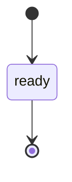
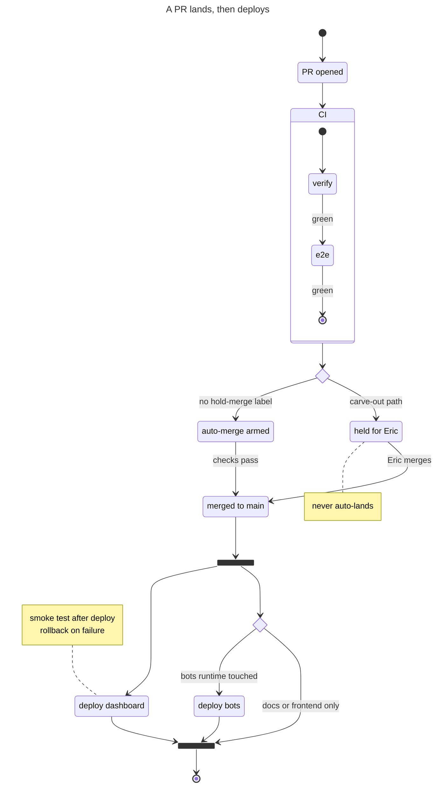

# stateDiagram: State diagram (stateDiagram-v2), covering composite states, fork/join, choice, concurrency, notes, direction, classDef. Doc source is the develop branch, which already documents the v12.0.0+ defaults. — `stateDiagram-v2` · `stateDiagram`

**Status:** stable. The docs attach no beta or experimental tag. The develop/v12.0.0+ page adds new per-diagram defaults for state diagrams: theme redux-color, look neo, layout ELK instead of Dagre. On v11.x, state.defaultRenderer defaults to 'dagre-wrapper'. The docs still label plain `stateDiagram` the "Older renderer". On develop both headers route to one unified renderer (stateDetector-V2.ts matches /^\s*stateDiagram/). On v11 the legacy detector only claims `stateDiagram` when defaultRenderer is not dagre-wrapper. Older Mermaid builds, which GitHub may run, can draw plain `stateDiagram` with the legacy renderer, so always write `stateDiagram-v2`.
**GitHub (11.17.2):** The stateDiagram docs page says nothing about GitHub, so verify on github.com. Facts that bear on it: (a) the page documents v12.0.0+ defaults (redux-color theme, neo look, ELK layout) that GitHub's deployed and lagging Mermaid probably doesn't have. v11.x schemas use state.defaultRenderer = dagre-wrapper, and ELK falls back to dagre when not registered. So always write `stateDiagram-v2` and expect classic-looking output on GitHub. (b) The grammar supports `click id "url" "tooltip"` / `click id href "url"`, but GitHub renders non-interactively, so no clicks or tooltips. (c) With no %%{init}%% and no colour classDefs, GitHub auto-themes light/dark. PICTURES.md already prescribes stateDiagram-v2 as a stable GitHub type. (d) The Mermaid Chart MCP validator's version is unreported. Silent-breakage probes (semicolon labels, 'direction XX' inside labels) pass validation but render wrong, so a lint rule should grep for them rather than trust validation alone.

## When to reach for it
- PR landing path (the ship/pipeline scene): verify, then e2e, then a choice between auto-merge armed and held for Eric (carve-out/hold-merge), then merged, then a fork into deploy dashboard and conditional deploy bots. The choice diamonds are the policy. Fits PR bodies that change ship.sh, pipeline.yml, envelope.json, or merge policy.
- Issue capsule lifecycle: draft/proposed, then ready (Eric flips), executing, done (PR merges), with a choice into 'waiting on a decision (needs-eric)' or needs-info. This is already the PICTURES.md starter, and it gives zero-context build sessions the legal transitions at a glance.
- Mode and gate changes, e.g. SIM to LIVE and any guarded mode flip. PICTURES.md already maps 'Lifecycle / gate / mode' to stateDiagram-v2.
- Bot trade/order lifecycle: signal, recommended, ticket, then a choice between filled, rejected, or expired, with notes on risk guards. Fits persona/trader PRs that add or reorder order states.
- Platter item lifecycle: boarded, held, platter PR open, Eric merges (one commit per item). Also governor dispatch: WIP check, dispatched, PR, merged or failed (never auto-retried).
- Research/interrogation verdict routing when the verdict changes what happens next (verbatim / amended / reject / status-quo as a choice node feeding distinct follow-up states).
- Plans with EARS 'When <trigger>, the system shall...' criteria: each trigger becomes a labelled transition and each 'while <state>' becomes a state. The diagram doubles as a checklist for the acceptance criteria.

**Not for:**
- Linear pipelines with no branch, loop, or guard (form to issue to session to PR): a flowchart LR reads like a sentence, and a state diagram just adds [*] ceremony.
- Request/message ordering between actors (bot, API, broker): use sequenceDiagram.
- Architecture and containers (C4, system maps): state diagrams model behaviour, not structure.
- Numeric trends such as a fitness budget ratcheting down over weeks: states would fake a quantity. Use a table or xychart.
- Call sheets (call · confidence · why · falsifier) and config deltas: tables scan better.
- Anything that needs edge emphasis (dashed 'proposed' or bold 'critical' paths): stateDiagram has one arrow style and no linkStyle.
- Trivial 2-state changes or typo/docs PRs: waive the picture (PICTURES.md proportionality).
- More than about 12 states, deep nesting, or several concurrency regions: at 390 px the render shrinks below legibility (the rich example is already 846 px wide).
- Relying on redux-color's per-item palette: hue would look meaningful but is just cycled, which misleads a red/green colourblind reader.

## Header forms
- stateDiagram-v2   (recommended; the docs call the other one the older renderer)
- stateDiagram   (legacy header; on older builds it can pick the old dagre-d3 renderer)
- ---\ntitle: Simple sample\n---\nstateDiagram-v2   (YAML frontmatter title; quote the value if it contains ': ')
- ---\nconfig:\n  theme: default\n  look: classic\n  layout: dagre\n---\nstateDiagram-v2   (docs' recipe for the pre-v12 appearance: frontmatter config wins over the per-diagram defaults)
- ---\nconfig:\n  state:\n    theme: default\n    look: classic\n---   (per-diagram-type scoping; the config key is `state`, not `stateDiagram`)
- %%{init: {"theme":"base","state":{...}}}%%   (general Mermaid directive, highest priority tier together with frontmatter; this repo's PICTURES.md defaults to NO init block)
- accTitle: text  /  accDescr: text  /  accDescr { multi-line }   (accessibility lines placed after the header, shown in the docs' classDef examples)

## Primitives
| Form | Syntax | Note |
|---|---|---|
| bare state | `stateId` | Simplest declaration. The ID is one token: no spaces, no '-', no ':', no '{' (grammar ID = [^:\n\s\-{]+). |
| implicit state | `s1 --> s2` | Undefined states named in a transition are created automatically. You can add descriptions later. |
| state with description (keyword form) | `state "This is a state description" as s2` | How you get spaces or punctuation (e.g. hyphens) into the visible label. Use the id everywhere after this. |
| state with description (colon form) | `s2 : This is a state description` | The label runs to end of line. It must not contain ';' or '::'. |
| start / end pseudostate | `[*] --> s1    and    s1 --> [*]` | Arrow direction decides start (filled dot) or end (bullseye). Inside a composite, [*] is that composite's own start or end. |
| choice | `state if_state <<choice>>` | Diamond. The grammar also accepts [[choice]] (validated). |
| fork | `state fork_state <<fork>>` | Bar that splits one path into many. The grammar also accepts [[fork]]. |
| join | `state join_state <<join>>` | Bar that merges many paths into one. The grammar also accepts [[join]]. |
| composite state | `state First {\n  [*] --> second\n  second --> [*]\n}` | Nests to any depth. Composite name must be a single word ('state A B {' throws 'State name must be a single word'). |
| composite with display name | `state "Human title" as Review { ... }   OR   NamedComposite: Another Composite  + state NamedComposite { ... }` | Both forms appear in the docs and grammar. |
| concurrency region divider | `--   (own line, inside a composite body)` | Splits a composite into parallel regions (the docs' NumLock/CapsLock/ScrollLock example). Only valid inside { }. |
| hide empty description / scale | `hide empty description   \|   scale 350 width` | PlantUML-compat tokens that are in the grammar but not on the docs page. Visible effect unverified. |
| click (grammar only) | `click s1 "https://url" "tooltip"   \|   click s1 href "https://url"` | In the jison grammar, not on the docs page. GitHub disables interactivity, so don't rely on it. |

## Relations
| Form | Syntax | Note |
|---|---|---|
| transition | `s1 --> s2` | The ONLY arrow in the grammar. No reverse, dotted, thick, or bidirectional variants, and no linkStyle. |
| labelled transition (event/guard) | `s1 --> s2 : A transition` | The label is everything after ':' to end of line. A ';' ends it and the leftover text is parsed as new phantom states (validated). |
| entry from start | `[*] --> s1` | Start. Inside a composite, the composite's own entry. |
| exit to end | `s1 --> [*]` | End. Inside a composite, the composite's own exit. |
| composite-to-composite | `First --> Second` | Allowed between whole composites. Transitions between internal states of DIFFERENT composites are NOT allowed (docs). |
| guarded branch out of a choice | `if_state --> False : if n < 0\nif_state --> True : if n >= 0` | Put a guard label on every edge leaving a choice. '<' and '>=' are fine in labels (docs example). |
| fork fan-out / join fan-in | `fork_state --> State2\nfork_state --> State3\nState2 --> join_state\nState3 --> join_state` | Parallel split and synchronisation. |
| concurrent regions | `state Active {\n [*] --> A1\n --\n [*] --> B1\n}` | Not an edge. Draws a dashed divider between orthogonal regions. |
| inline class on a transition end | `Moving --> Crash:::movement   \|   Crash:::badBadEvent --> [*]   \|   [*]:::cls --> s1` | The ::: operator can sit on either side. Grammar allows it on [*] too. |

## Grouping
- Composite state: state Id { ...body... }, nestable (docs show 3 levels). Draws a titled rounded container.
- Composite with human title: state "Title text" as Id { ... }, or `Id: Title` on a separate line plus state Id { ... }.
- Concurrency: `--` lines inside a composite body split it into parallel regions separated by dashed dividers.
- Per-composite direction: `direction LR` inside a composite body sets that composite's layout independently (docs example).
- No subgraph, box, or namespace keyword. Composites are the only grouping.

## Annotations
- Note, multi-line: note right of State1\n  text lines...\nend note   (also `note left of`). Any text, colons included, up to `end note`.
- Note, single-line: note left of State2 : This is the note to the left.   The text cannot contain ':' (validated parse error) or ';'.
- Transition label: s1 --> s2 : event [guard] / action text
- State description: `id : text` or `state "text" as id`
- Diagram title: YAML frontmatter `---\ntitle: ...\n---`
- Accessibility: accTitle: ... / accDescr: ... / accDescr { multi-line } (screen-reader title and description, hue-free)
- Comments: `%%` on its own line or at the end of a statement. Everything to end of line is ignored. The grammar also treats a token starting with `#` as a comment.
- No autonumber, tooltips (except the grammar-only click), or links on the docs page. Number steps by hand in labels if needed.

## Emphasis without hue (the colourblind rule)
- Pseudostate SHAPE carries meaning with no colour: <<choice>> is a diamond (a decision), <<fork>>/<<join>> are solid bars (parallel split/sync), [*] is a filled dot (start) or bullseye (end).
- Composite container with a title groups a phase (e.g. 'CI' holding verify then e2e). The boxed region is the emphasis.
- Concurrency `--` draws dashed dividers between regions, a hue-free cue for 'these run in parallel'.
- Notes (`note right of held : never auto-lands`) are a distinct note shape beside the state. Best hue-free way to flag a risky or held state.
- Guard and event words on transitions ('carve-out path', 'checks pass'). State edges have only one line style, so the words must carry the difference.
- classDef or style limited to geometry and weight, never colour: stroke-width:4px, stroke-dasharray:6 4, font-weight:bold, font-style:italic (validated: `classDef held stroke-width:4px,stroke-dasharray:6 4,font-weight:bold` + `waiting:::held` and `style armed stroke-width:3px` all rendered). Setting no fill or colour keeps GitHub's light/dark auto-theming intact. PICTURES.md bans classDef/style by default, so this would need a checked-in 'contrast-neutral' snippet.
- Layout position: put the happy path on the straight spine (direction TB) and side branches off it. Per-composite `direction LR` sets off a sub-phase.
- Label wording: prefix held or terminal states with words ('held for Eric', 'rolled back') or manual step numbers ('1 verify'), since there is no autonumber.
- accTitle/accDescr give screen readers a text version, useful for any non-visual reader.
- NOT available: dashed or thick transitions, linkStyle, or per-edge styling. Don't plan emphasis that depends on edge style.

## Styling hooks
- classDef name prop:val,prop:val   e.g. classDef badBadEvent fill:#f00,color:white,font-weight:bold,stroke-width:2px,stroke:yellow (valid CSS property:value pairs, comma-separated; trailing ';' tolerated in docs)
- classDef default ...   (grammar has a DEFAULT classDef id)
- class s1, s2 styleName   (apply to one or more comma-separated state ids; ids must be word characters)
- id:::styleName   (inline, inside a transition statement; validated)
- style id css   e.g. style armed stroke-width:3px   (in the grammar, not on the docs page; validated: renders stroke-width:3px !important)
- Docs-stated classDef limits: cannot be applied to start/end states, or to or within composite states (the ::: section contradicts the first limit)
- themeVariables named in theming.md for state: labelColor (default primaryTextColor), altBackground (default tertiaryColor, background of deep composite states)
- Other variables read by state styles.js (not documented as state-specific): transitionColor, transitionLabelColor, stateBkg, stateBorder, stateLabelColor, compositeBackground, compositeTitleBackground, innerEndBackground, specialStateColor, labelBackgroundColor, edgeLabelBackground, noteBkgColor, noteBorderColor, noteTextColor, lineColor, mainBkg, nodeBorder, strokeWidth, radius, useGradient, dropShadow
- Themes (v12 enum): default, base, dark, forest, neutral, neo, neo-dark, redux, redux-dark, redux-color, redux-dark-color. redux-color (the v12 state default) cycles a categorical palette per item. redux is the monochrome twin 'when you want the colour to carry meaning you assign yourself'.
- look: classic | neo (v12 default for state) | handDrawn. layout: dagre | elk (v12 state default; falls back to dagre if the elk package is not registered)
- Rendered SVG class hooks: `.statediagram-state` plus the classDef name on the node group (validated: class="node held statediagram-state")

## Config keys
- state.theme (v12 default 'redux-color'), state.look (v12 default 'neo'), state.layout (schema default 'elk' on develop; theming.md says only swimlane overrides layout, a doc inconsistency. Unregistered elk falls back to dagre.)
- state.defaultRenderer (v11.x only: dagre-d3 | dagre-wrapper | elk, default dagre-wrapper; removed on develop)
- state.useMaxWidth (default true: scales to container width; false keeps absolute size)
- state.titleTopMargin (25)
- state.wrappingWidth (120, develop/v12 only: label wrap width; markdown strings wrap automatically)
- state.minNodeWidth (120, develop/v12 only: uniform minimum label width)
- state.nodeSpacing, state.rankSpacing (integers ≥0)
- state.padding (8), state.miniPadding (2), state.dividerMargin (10), state.noteMargin (10)
- state.forkWidth (70), state.forkHeight (7): size of fork/join bars
- state.fontSize (24), state.fontSizeFactor (5.02), state.labelHeight (16), state.textHeight (10), state.titleShift (-15), state.compositTitleSize (35, sic), state.sizeUnit (5), state.edgeLengthFactor ('20'), state.radius (5), state.arrowMarkerAbsolute (bool)
- Priority (theming.md): frontmatter/%%{init}%% > mermaid.initialize() > per-diagram-type default > global default. A diagram-scoped value beats a global one within the same tier.
- themeVariables: labelColor, altBackground (state-specific per theming.md)

## Gotchas — what silently breaks
- HYPHENS BREAK IDS (validated parse error): `[*] --> auto-merge` fails. Use `state "auto-merge armed" as armed`, or camelCase/underscore IDs.
- SEMICOLON IN A LABEL FAILS SILENTLY (validated): `A --> B : verify; then merge` passes validation but renders phantom states ';', 'then', 'merge'. Never put ';' in transition labels, state descriptions, or single-line notes.
- THE WORD 'direction' FOLLOWED BY TB/BT/LR/RL ANYWHERE ON A LINE SWALLOWS THE LINE (validated): `A --> B : flip direction LR later` renders only B. State A and the edge vanish, with no error, because the lexer rule is `.*direction\s+LR[^\n]*`.
- Colon in a single-line note is a parse error (validated: `note right of A : status: held`). Use the multi-line `note right of A ... end note` form.
- Description/label grammar rejects '::' and ';' ((?:[^:\n;]|":"[^:\n;])+).
- Spaces in state names: only via `state "desc" as id` or `id : desc`. `state Foo Bar {` throws 'State name must be a single word'.
- `--` (concurrency) is only legal inside a composite body. At top level it's a lex error.
- You cannot draw transitions between internal states of different composites (docs). Route through the composites' boundaries instead.
- [*] inside a composite is that composite's local start/end, not the diagram's.
- classDef cannot be applied to start/end states or to or within composites (docs), yet the ::: section says it works on start/end states. The docs contradict themselves, so treat both as unreliable.
- `class a, b name` ids must be \w word characters.
- Keywords followed by whitespace start statements: state, note, class, style, classDef. Don't name a state `note` or `class` (grammar-derived, unverified). IDs that merely START with click/default (e.g. Defaulted, clicked) render fine (validated).
- A token starting with '#' is a comment per the grammar (e.g. `A --> #123` loses its target). Put issue numbers in labels after ':', not in IDs.
- `%%{` starts a directive, not a comment. Comments are `%%` followed by anything else.
- YAML frontmatter title containing ': ' must be quoted, or the frontmatter breaks.
- v12 defaults (redux-color categorical palette, neo look, ELK) change appearance from the same source. GitHub's version is unknown, so the Mermaid Chart MCP render may not match github.com.
- Width on a phone: the validated 13-state rich example rendered at 846x1531 px. At 390 px it scales to roughly 46%, so labels shrink. Keep to ≤12 states, short labels, TB direction. Side-by-side concurrency regions and wide choice fan-outs shrink worst.
- Only one edge style exists, so any design that needs dashed or bold transitions must use a flowchart instead.

## Starters (validated mcp__Mermaid_Chart__validate_and_render_mermaid_diagram (Mermaid Chart MCP; its Mermaid version is not reported and may differ from GitHub's); minimal ✓, rich ✓ — Minimal and rich both valid (diagramType stateDiagram). Rich rendered all 17 labels, including the multi-line note with a  , at 846x1531 px. The rich example is grounded in .github/workflows/pipeline.yml (verify, e2e, arm-auto-merge unless the hold-merge label is set, deploy dashboard on every main push, deploy-bots only when the bots runtime is touched, smoke/rollback) and .claude/skills/ship/SKILL.md (carve-outs held for Eric). Gotcha probes: (1) `[*] --> auto-merge` gave INVALID, a parse error at the hyphen. (2) `A --> B : verify; then merge` was reported VALID but rendered phantom states ';' 'then' 'merge' (silent breakage). (3) `note right of A : status: held` gave INVALID, a parse error at the second colon. (4) `A --> B : flip direction LR later` was reported VALID but rendered only state B; the line was eaten as a direction statement (silent breakage). (5) `Defaulted --> clicked` was valid and rendered correctly. (6) `classDef held stroke-width:4px,stroke-dasharray:6 4,font-weight:bold` + `waiting:::held` + `style armed stroke-width:3px` + `state pick [[choice]]` were valid, and the styles were present in the SVG.)

Minimal:

Rich (grounded in this repo):

## Sources
- https://raw.githubusercontent.com/mermaid-js/mermaid/develop/packages/mermaid/src/docs/syntax/stateDiagram.md
- https://mermaid.js.org/syntax/stateDiagram.html
- https://raw.githubusercontent.com/mermaid-js/mermaid/develop/packages/mermaid/src/diagrams/state/parser/stateDiagram.jison
- https://raw.githubusercontent.com/mermaid-js/mermaid/develop/packages/mermaid/src/schemas/config.schema.yaml (StateDiagramConfig, BaseDiagramConfig)
- https://raw.githubusercontent.com/mermaid-js/mermaid/develop/packages/mermaid/src/docs/config/theming.md (Per-diagram defaults, State Colors)
- https://raw.githubusercontent.com/mermaid-js/mermaid/develop/packages/mermaid/src/diagrams/state/stateDetector-V2.ts
- https://raw.githubusercontent.com/mermaid-js/mermaid/develop/packages/mermaid/src/diagrams/state/styles.js
- https://raw.githubusercontent.com/mermaid-js/mermaid/mermaid@11.12.0/packages/mermaid/src/schemas/config.schema.yaml (v11 defaultRenderer)
- https://raw.githubusercontent.com/mermaid-js/mermaid/mermaid@11.12.0/packages/mermaid/src/diagrams/state/stateDetector.ts
- /home/user/skynet-capital/docs/PICTURES.md
- /home/user/skynet-capital/.github/workflows/pipeline.yml
- /home/user/skynet-capital/.claude/skills/ship/SKILL.md
