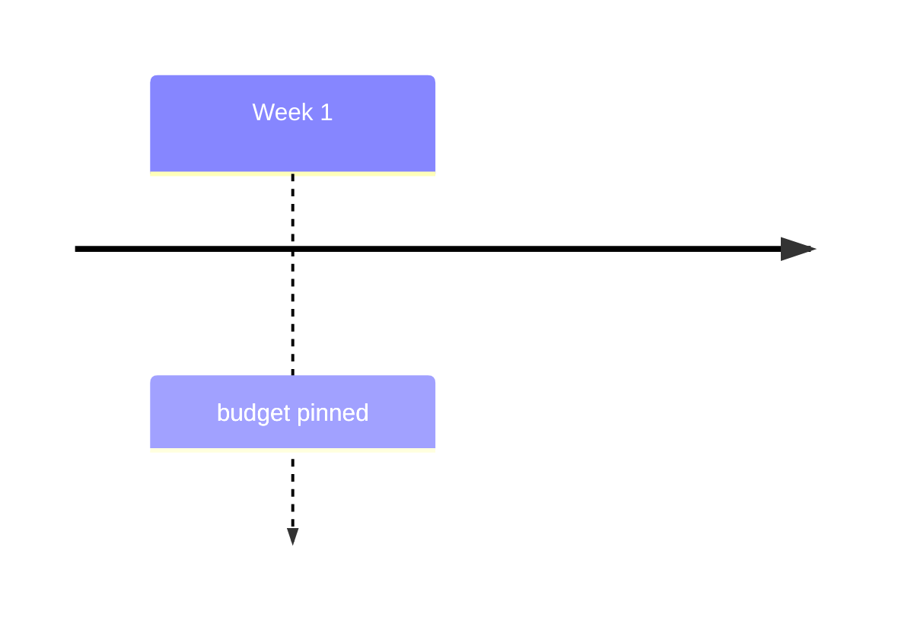
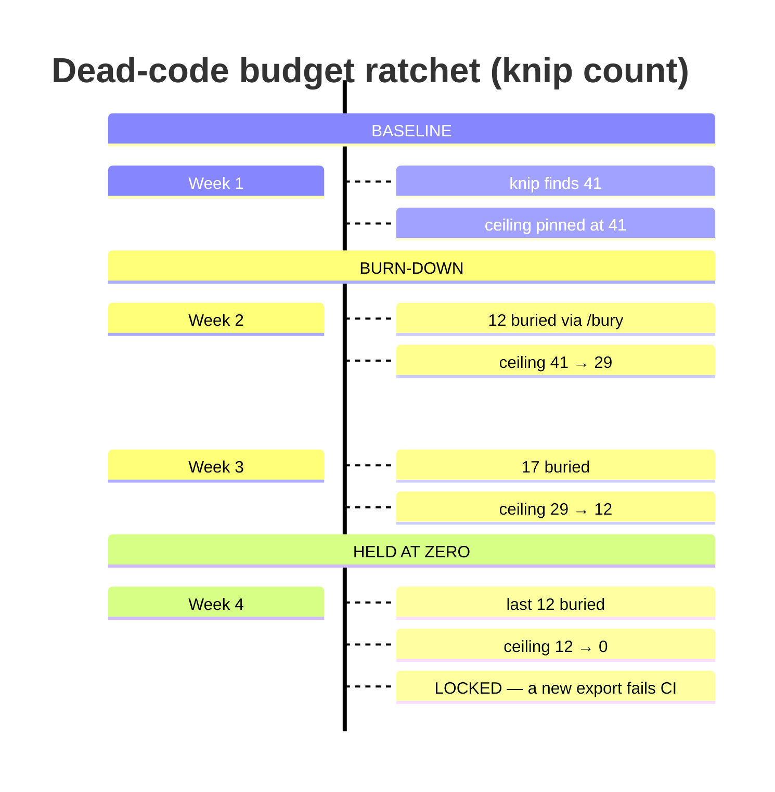

# timeline — https://mermaid.js.org/syntax/timeline.html (source: packages/mermaid/src/docs/syntax/timeline.md, develop branch, read 2026-09-25). Covers: title, periods, events (inline and continuation), sections/ages, text wrapping and  , direction LR/TD (v11.14.0+), multicolor vs disableMulticolor, cScale/cScaleLabel colour overrides, the theme list, and lazy-load integration. Cross-checked against the jison grammar (timeline.jison), config.schema.yaml TimelineDiagramConfig, styles.js, svgDraw.js, timeline-definition.ts (renderer selector), and the repo's pinned mermaid 11.17.2 bundle. — `timeline` · `timeline LR` · `timeline TD`

**Status:** experimental. The docs say: "This is an experimental diagram for now. The syntax and properties can change in future releases. The syntax is stable except for the icon integration which is the experimental part." The integration section also says timeline "uses experimental lazy loading & async rendering features which could change in the future." Direction (LR/TD) arrived in v11.14.0. There is no -beta suffix on the keyword.
**GitHub (11.17.2):** The docs page itself says nothing about GitHub. From this repo: docs/PICTURES.md and scripts/mermaid-lint.mjs record that github.com renders Mermaid 11.17.2 (read from its production bundle on 2026-09-25) and list `timeline` among the types it draws. The repo pins mermaid 11.17.2, and that bundle's timeline chunk contains the `timeline_td` token and a renderer selector (getDirection() === 'TD' → vertical renderer), so `timeline TD` (v11.14.0+) should draw vertically on GitHub. This was NOT visually verified on github.com, so verify there before relying on it for the 390px rule. The Mermaid Chart MCP preview is v11.13.0 and draws TD as LR, so don't trust it for layout. No click/links/icons exist in timeline anyway. GitHub mobile app: Mermaid does not render at all (per PICTURES.md); phone browsers do. The repo lint refuses fixed theme/themeVariables, so leave colours at GitHub's light/dark defaults and never let section hue carry meaning. Put a mermaid block containing just `info` in a GitHub comment to read the deployed version.

## When to reach for it
- Budget ratchets over weeks (dead-budget.json, dupe-budget.json, spec-gap-budget.json, comment-bloat-budget.json and the other *-budget.json files): one period per week or ratchet PR, with the events 'N buried' and 'ceiling A → B'. It shows the story of each step down. Put PR numbers in EVENT text, never in the period.
- /journey records (docs/JOURNEYS): PICTURES.md already routes reasoning journeys to `timeline` instead of the `journey` type. Sections carry the phase (QUESTION / CLAIMS MOVED / BRANCHES KILLED / OPEN FORKS) and events carry each move, in order.
- /retro incident reconstruction (docs/LESSONS.md): sections for ESCAPED / UNDETECTED / CAUGHT / PREVENTED, with timestamps written colon-free (0931). This makes detection lag visible as the number of periods between escape and catch.
- Issue capsule history for a zero-context build session: a short 'what already happened' strip (proposed → ready → executing → done, with a date per period and the deciding event underneath). Use it when the order of decisions matters more than the state machine.
- Secretary digests: sections = days (or MON..FRI), periods = surfaces or lanes, events = merged PRs or shipped items. That is a weekly activity digest at a glance. Keep it to 3 periods in LR, or use TD, for 390px.
- Research docs and symbol sweeps: earnings-cycle chronology (PRE-PRINT / PRINT / POST-DRIFT sections, events = observations) above the call sheet, when the claim is about sequence.
- CHANGELOG or release narrative and roadmap slices ('what landed when'), where each period is a release or week and events are headline changes.
- Market-session phases for a bot persona (premarket / open / midday / close, with the times written 0930 not 09:30), with the bot's actions per phase as events.

**Not for:**
- Branching or merging history, including platter PRs (one commit per item) and verify → auto-merge → deploy pipelines with retries. Use gitGraph or flowchart: timeline cannot draw a fork, a merge or a loop.
- Durations, overlaps and dependencies (a plan with parallel slices, or bot run windows). Use gantt: timeline periods are points, equally spaced and not time-scaled.
- Status lifecycles with conditions or back-edges (issue proposed → ready → executing → done with a rejection path, or a ticket → fill with cancel). Use stateDiagram-v2. Timeline only works for a single, already-happened linear history.
- Quantitative trends where the number is the point (P&L curve, a budget count over 20 weeks). Use xychart-beta: timeline gives no magnitude encoding, and equal spacing misleads.
- Architecture (browser app, API server, bot runner, ledger store, GitHub, market-data provider). Use C4 or architecture-beta.
- Request/response flows (bot recommends a trade → ticket → fill across components). Use sequenceDiagram.
- Interrogation or research call sheets (verbatim/amended/reject/status-quo; call · confidence · why · falsifier). A table carries this better. A timeline would be decoration.
- Anything that needs ONE item flagged as different (the risky step, the irreversible touch). There are no per-node styles, so emphasis falls back to text. A flowchart with a distinct shape or a thick edge works better.
- Trivial PRs with one or two events. A timeline there is decorative, so take the PICTURES.md waiver instead.
- More than about 4 periods in LR on a phone, or more than 12 sections (the colours repeat).

## Header forms
- timeline   (the default, left to right)
- timeline LR   (v11.14.0+, explicit left to right, same as the default)
- timeline TD   (v11.14.0+, top-down. The lexer is case-insensitive, so `timeline td` parses too)
- Leading whitespace before `timeline` is fine: the detector is /^\s*timeline/ and the doc examples indent it
- YAML frontmatter before the keyword:
---
title: Dead-code budget ratchet
config:
  timeline:
    disableMulticolor: true
---
timeline
  ...   (both parse under 11.17.2)
- The docs' own frontmatter form also sets theme/themeVariables:
---
config:
  theme: 'base'
  themeVariables:
    cScale0: '#ff0000'
---   (this repo's mermaid-lint REFUSES a fixed theme/themeVariables because it freezes one of GitHub's two colour modes)
- Deprecated directive `%%{init: {"timeline": {"disableMulticolor": true}}}%%` on the line before `timeline`. It parses; the repo lint notes it as deprecated since 10.5, so use frontmatter
- Programmatic form: mermaid.initialize({ timeline: { disableMulticolor: true } }). Not usable on GitHub

## Primitives
| Form | Syntax | Note |
|---|---|---|
| time period | `Week 1` | A line of plain text that starts a period. It is text, not a date: nothing is parsed, sorted or time-scaled. Lexer rule [^#:\n]+, so a period can contain NO ':' and NO '#'. No quoting mechanism exists (quotes render literally). A period with no events is legal and draws just the period box. |
| period with one event | `2002 : LinkedIn` | `{time period} : {event}`. The colon MUST be followed by whitespace (the event token is ":"\s...). |
| period with several inline events | `2004 : Facebook : Google` | `{time period} : {event} : {event}`. Every ' : ' (colon + space) starts a new event. |
| continuation events (one per line) | `2004 : Facebook      : Google      : Instagram` | An indented line that begins with ': ' adds another event to the PREVIOUS period. You can mix inline and continuation forms: `Bullet 1 : sub-point 1a : sub-point 1b` then `     : sub-point 1c`. Events stack top to bottom in source order. |
| event node | `: event text (may contain '#', ';', unicode, and a colon NOT followed by whitespace, e.g. 10:30)` | Events render as boxes below the period (LR) or beside it (TD). Text is set with d3 .text(), so it is plain text: no markdown, no bold, no HTML except the   line break. |
| title | `title History of Social Media Platform` | Optional. The keyword `title` followed by whitespace and the rest of the line (colons are allowed here). Drawn bold at the top. Frontmatter `title:` also works. |
| section | `section 17th-20th century` | Grouping header, see grouping. The name runs to end of line and must not contain ':'. |
| forced line break | `Steam  power` | Works inside periods, events and section names. The wrapper splits only on the exact token ` `. The docs show no ` ` form. |
| automatic wrap | `(implicit)` | Long period and event text wraps automatically to the fixed node width (about 150-200px) so it is never drawn outside the diagram. |

## Relations
| Form | Syntax | Note |
|---|---|---|
| chronological order (implicit) | `source line order` | No edge syntax exists. The first period is drawn at the left (LR) or top (TD) and the last at the right or bottom. Mermaid draws a solid axis arrow through all periods automatically. Spacing is equal, not proportional to elapsed time. |
| period → its events (implicit) | `Period : e1 : e2   or continuation lines `: e3`` | In LR a dashed connector with an arrowhead runs down from each period to its event stack. The first event sits nearest the period (top) and the last furthest (bottom). You cannot draw an arrow between two events or across periods. |
| section membership (implicit) | `section X  (every period below it until the next section)` | Without any section, all periods sit in a default section. |
| direction | `timeline LR \| timeline TD` | LR (the default) runs periods left to right with events hanging below. TD (v11.14.0+) switches to a separate vertical renderer: periods stack down a vertical axis with events to the side. |

## Grouping
- `section <name>`: groups every following period into a section ('age') until the next `section`. Sections draw in definition order as a header band over their periods, and every period and event in a section shares one colour scheme.
- Default section: if you define no section, all periods go into an implicit default section. In that case each PERIOD gets its own colour (multicolor) unless disableMulticolor is set.
- No nesting: a section inside a section is impossible, and a section cannot contain events directly (an event before any period crashes, see gotchas).
- Section names accept  , e.g. `section 2023 Q1   Release Personal Tier`, but no ':'.

## Annotations
- `title <text>`: the diagram title, bold at the top. Frontmatter `title:` is equivalent.
- `accTitle: <text>`: the accessible title (in the grammar but not on the docs page). Parses under 11.17.2.
- `accDescr: <text>` or the multiline `accDescr {` ... `}`: the accessible description (in the grammar, not on the docs page). Both parse under 11.17.2.
- `%% comment`: a whole-line comment. Also, any character followed by `%%` mid-line starts a comment in the lexer (except when the `%%` sits inside an event token).
- `# ...`: the timeline lexer treats `#` as start-of-comment to end of line EVERYWHERE except inside event text. See the gotcha: '#' in a period silently deletes the rest of the line.
- ` `: a manual line break inside any label.
- NOT available in timeline: notes, tooltips, `click`/links, autonumber, and per-node labels beyond the text itself. The `::icon()` syntax from mindmap is a parse error in 11.17.2 even though the docs call 'icon integration' the experimental part.

## Emphasis without hue (the colourblind rule)
- Section headers as text: put the category in the section name, e.g. `section BASELINE` / `section BURN-DOWN` / `section HELD AT ZERO`. Uppercase section names read as bands without hue. Section colours are an arbitrary rotation, so the NAME must carry the meaning.
- Leading tokens in labels: `LOCKED — ...`, `[BLOCKED]`, `REVERTED`, `✓` / `✗`, `▲` / `▼`, `→` for a before/after value (`ceiling 41 → 29`). Unicode glyphs parse fine under 11.17.2 and render in the MCP tool. Do not use ': ' inside the token (it splits the event).
- Position: the first event under a period is the most prominent (top of the stack), so put the headline event first. Period order is the only other positional channel.
- Stack height: more events under a period make a visibly taller column, which lets you show 'busy week' vs 'quiet week' without colour.
- ` ` to set a short bold-looking first line apart from its detail (there is no real bold or markdown).
- Title plus accTitle/accDescr: state the takeaway in words ('ceiling fell 41 → 0 in four weeks').
- disableMulticolor: true (only without sections) removes hue entirely, so no reader can infer meaning from colour.
- NOT available: per-node shapes, stroke-width, stroke-dasharray, thick or dotted edges, notes, numbering. Every period and event is the same rounded box, and all connectors are the same uniform dashed line. Emphasis in a timeline is text, order and grouping only.

## Styling hooks
- NO classDef, style, linkStyle or ::: in timeline. Each is a parse error (`classDef x fill:#fff` fails under 11.17.2). You cannot style one period or event individually.
- themeVariables `cScale0`..`cScale11`: background fill per section. Without sections they apply per period. cScale0 drives the first section. Past 12 sections the colours repeat (THEME_COLOR_LIMIT, default 12).
- themeVariables `cScaleLabel0`..`cScaleLabel11`: text (foreground) colour per section, also used for the node-icon colour.
- styles.js also reads `cScaleInv0..11` (the underline/connector line colour per section, which non-redux themes darken or lighten) and, in redux themes, `mainBkg`, `nodeBorder`, `strokeWidth`, `fontWeight`, `tertiaryColor`, `clusterBorder`.
- Config `timeline.disableMulticolor: true`: every period and event uses one colour scheme. It only has an effect when there are NO sections (renderer check: isWithoutSections && !disableMulticolor).
- `theme`: the docs list redux-color (documented as the default), redux-dark-color, redux, redux-dark, default, neutral, dark, forest, neo, neo-dark, base. The redux and neo themes are present in 11.17.2. The docs say to override theme variables via initialize or directives.
- Generated CSS classes (reachable only through themeCSS or a host stylesheet, not from diagram text): .timeline-node, .section-N (N = section index - 1, so the first is .section--1), .taskWrapper (periods), .eventWrapper (events, brightness(120%) filter), .lineWrapper line (axis and connectors), .node-bkg, .node-line-N, .section-edge-N, .edge-depth-N, .disabled.
- REPO NOTE: scripts/mermaid-lint.mjs refuses a fixed theme or themeVariables in any mermaid block, so in PRs and issues the cScale overrides are effectively off-limits. Rely on the default palette plus text.

## Config keys
- timeline.disableMulticolor (boolean, default false). The only key the docs page names. Prose spells it `disableMultiColor`, but the real key is `disableMulticolor` (lowercase c).
- timeline.padding (number). Read by the renderer for setupGraphViewbox (the renderer defaults it to 50).
- timeline.useMaxWidth (boolean, from BaseDiagramConfig). Controls whether the SVG scales to container width (max-width style).
- Direction is NOT a config key. It is set only by the header token (`timeline LR` / `timeline TD`, v11.14.0+).
- Schema-listed TimelineDiagramConfig keys, mostly inherited or copied from sequence/journey and largely unused by the timeline renderer: diagramMarginX (50), diagramMarginY (10), leftMargin (150), width (150), height (50), boxMargin (10), boxTextMargin (5), noteMargin (10), messageMargin (35), messageAlign (left|center|right, default center), bottomMarginAdj (1), rightAngles (false), taskFontSize (14), taskFontFamily ('"Open Sans", sans-serif'), taskMargin (50), activationWidth (10), textPlacement ('fo'), actorColours, sectionFills, sectionColours.
- Global keys that matter: theme, themeVariables.cScale0-11 / cScaleLabel0-11 / THEME_COLOR_LIMIT (the section colour cycle, default 12), look ('neo' changes node drawing and adds drop shadows), fontSize, logLevel (the docs examples set 'debug').

## Gotchas — what silently breaks
- COLON IN A PERIOD IS A PARSE ERROR: `09:31 : open` fails under 11.17.2 (got 'INVALID'). Write `0931`, `9.31` or `09h31`. docs/PICTURES.md already lists this trap.
- COLON NEEDS WHITESPACE AFTER IT: `Week 1:merged` is a parse error. Always write `period : event`.
- COLON+SPACE INSIDE AN EVENT SILENTLY SPLITS IT: `Week 1 : Note: merged` parses as TWO events ('Note' and 'merged'). A colon with no following space is kept (`at 10:30 merged` is fine).
- '#' IN A PERIOD SILENTLY DELETES THE REST OF THE LINE: `PR #12 : merged` parses, but '#12 : merged' is lexed as a comment. You get a period 'PR ' with no event and no error. '#' INSIDE event text is kept (`Week 1 : PR #12 merged` is fine). The entity form `#35;` parses in a period, but the render is unverified.
- KEYWORD PREFIXES HIJACK PERIODS (case-insensitive): a period starting with `title ` becomes the diagram title (`Title fight : x` parses, silently, as the title). A period starting with `section ` becomes a section and then crashes (`Section review : x` gives 'Cannot read properties of undefined (reading 'events')'). A period starting with `timeline` is a parse error (`Timeline review : x`). Avoid starting a period with title/section/timeline/accTitle/accDescr.
- COLON IN A SECTION NAME CRASHES: `section Q1: plan` gives 'Cannot read properties of undefined (reading 'events')'.
- EVENT BEFORE ANY PERIOD CRASHES: a first content line of `: orphan` gives the same 'reading events' error.
- No classDef/style/:::/click/::icon(): each is a parse error. The docs mention 'icon integration' as experimental, but 11.17.2's timeline grammar has no icon syntax. Iconify packs render as '?' on GitHub anyway.
- Only ` ` breaks a line (the wrapper splits on the literal token ` `). Text is plain SVG text: markdown/**bold**/HTML are not interpreted. Quotes are shown literally. Semicolons are plain text, not statement separators.
- Spacing is NOT proportional to time. Periods are equally spaced text labels in source order, with no date parsing or sorting. A 1-day gap and a 1-year gap look identical, so write the gap into the label if it matters.
- WIDTH ON A PHONE: LR adds about 200px per period. A 4-period example rendered at max-width 1190px in the MCP tool, which is unreadably small at 390px. For phones keep LR to 3 periods, or use `timeline TD` (v11.14.0+), which grows downward.
- PREVIEW MISMATCH: the Mermaid Chart MCP tool runs v11.13.0 (probed with the `info` diagram). It ACCEPTS `timeline TD` but draws it LR. GitHub's 11.17.2 bundle contains the vertical renderer (timeline-definition picks verticalRenderer when direction === 'TD'), so the MCP preview is not evidence of the TD layout.
- disableMulticolor does nothing once any `section` exists (the renderer only checks it for section-less timelines). The docs' initialize example sets it to false, which is the default, so it demonstrates nothing.
- More than 12 sections (or section-less periods) repeat colours, so two unrelated sections can share a hue. Never let colour identify a section.
- The docs list redux-color as the default theme. Theme defaults differ across versions, and this repo's lint refuses fixed themes, so don't design around a specific palette.
- Indentation is cosmetic, except that a continuation event must start with ': ' (the lexer skips leading whitespace).
- Text wraps inside a fixed-width box. Long unbroken tokens (hashes, URLs) overflow or wrap badly, so abbreviate.

## Starters (validated mcp__Mermaid_Chart__validate_and_render_mermaid_diagram (the MCP renderer reports Mermaid v11.13.0 via an `info` probe): minimal valid=true, rich valid=true, diagramType=timeline. PLUS the repo's own scripts/mermaid-lint.mjs --stdin, which parses with the pinned mermaid 11.17.2 (the version github.com renders per docs/PICTURES.md): rich example problems=[] notes=[] ok=true. The same lint ran about 25 gotcha probes whose outcomes are recorded in gotchas.; minimal ✓, rich ✓ — No errors on either example. Caveat: the MCP tool (11.13.0) accepted `timeline TD` but laid the rich example out left-to-right (periods at x=200..800, max-width 1190px), because TD layout needs v11.14.0+. The TD vertical layout could not be visually confirmed. It parses under 11.17.2, and the 11.17.2 bundle contains the vertical renderer, but it was not rendered on github.com. Rendered labels were checked in the MCP SVG: all 16 labels present (section names, 4 periods, 11 events including 'LOCKED — a new export fails CI'; the '→' glyph survived). The title rendered bold. accTitle/accDescr parsed, but the MCP's SVG showed no aria-labelledby, so their GitHub accessibility output is unverified. Parse-error probes under 11.17.2: `09:31 : open`, `Week 1:merged`, `Timeline review : x`, `::icon(...)`, `classDef`. Crash probes: `Section review : x`, `section Q1: plan`, a leading `: orphan`. Probes that parse but lose meaning: `PR #12 : merged` (the rest of the line is dropped as a comment), `Title fight : x` (becomes the title), `Week 1 : Note: merged` (splits into two events).)

Minimal:

Rich (grounded in this repo):

## Sources
- https://raw.githubusercontent.com/mermaid-js/mermaid/develop/packages/mermaid/src/docs/syntax/timeline.md
- https://mermaid.js.org/syntax/timeline.html
- https://raw.githubusercontent.com/mermaid-js/mermaid/develop/packages/mermaid/src/diagrams/timeline/parser/timeline.jison
- https://raw.githubusercontent.com/mermaid-js/mermaid/develop/packages/mermaid/src/schemas/config.schema.yaml (TimelineDiagramConfig, around line 1941)
- https://raw.githubusercontent.com/mermaid-js/mermaid/develop/packages/mermaid/src/diagrams/timeline/styles.js
- https://raw.githubusercontent.com/mermaid-js/mermaid/develop/packages/mermaid/src/diagrams/timeline/svgDraw.js
- https://raw.githubusercontent.com/mermaid-js/mermaid/develop/packages/mermaid/src/diagrams/timeline/timelineRenderer.ts
- https://raw.githubusercontent.com/mermaid-js/mermaid/develop/packages/mermaid/src/diagrams/timeline/timelineRendererVertical.ts
- https://raw.githubusercontent.com/mermaid-js/mermaid/develop/packages/mermaid/src/diagrams/timeline/timeline-definition.ts
- https://raw.githubusercontent.com/mermaid-js/mermaid/develop/packages/mermaid/src/diagrams/timeline/detector.ts
- /home/user/skynet-capital/docs/PICTURES.md
- /home/user/skynet-capital/scripts/mermaid-lint.mjs
- /home/user/skynet-capital/node_modules/mermaid/dist/chunks/mermaid.core/timeline-definition-24CTP7MA.mjs (pinned 11.17.2)
