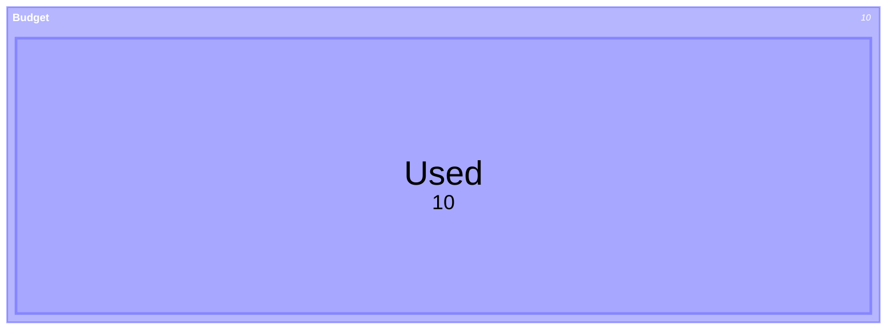
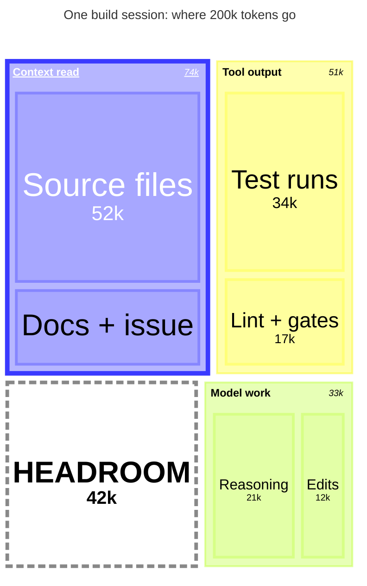

# treemap: Treemap (treemap-beta), covering hierarchy syntax, values and classDefs — `treemap-beta` · `treemap (the grammar accepts the bare keyword: TREEMAP_KEYWORD = 'treemap-beta' | 'treemap'. It parses under 11.17.2 but the docs never show it, so write treemap-beta)`

**Status:** beta. The docs say: "This diagram type is new to Mermaid, and its syntax may change in future versions." The keyword carries -beta. It shipped in Mermaid 11.8.0 (changelog #6590, "nested treemap"). Later fixes: 11.13.0 made classDef styles actually apply (#7178), 11.14.0 made the title and labels use theme-aware colours on dark backgrounds (#7526), and 11.16.0 fixed labels in large nested diagrams (#7247). All of these are inside github.com's 11.17.2.
**GitHub (11.17.2):** The treemap docs page says nothing about GitHub. This repo's recorded fact (docs/PICTURES.md, scripts/mermaid-lint.mjs GITHUB_MERMAID_VERSION) is that github.com renders Mermaid 11.17.2, read 2026-09-25. treemap-beta arrived in 11.8.0, and its classDef application (11.13.0), dark-background label colours (11.14.0) and nested-label fixes (11.16.0) are all inside that version, so GitHub should draw it with working classDefs. The pinned 11.17.2 parser accepts both examples. Other constraints: the house lint rejects frontmatter theme/themeVariables, so there is no forest theme and no cScale overrides. The GitHub mobile app does not render Mermaid (a phone browser does). There are no click/links, which treemap does not support anyway. Still verify on github.com, especially label contrast in dark mode and the auto-hidden small-cell labels.

## When to reach for it
- 'Where a budget goes' pictures in PR bodies and research docs: an agent session's token or context spend, CI minutes by workflow, or governor-cycle cost by coach/athlete. One number rolls up into 2-3 named buckets.
- Structural-debt gates where the size is the story: LOC by directory/file for arch-scan/decompose god-file candidates, knip dead-code findings by folder, spec-gap targets by src area. The biggest block is the next target.
- Paper-portfolio exposure (non-negative notional or premium at risk) by underlying → strategy → leg, or bot-persona capital allocation. It is also a cheap Mermaid sketch of the app's own positions-lens treemap (app/src/shell/treemap.ts) in plan issues before building.
- Backlog composition snapshots in digests: open issues by label → area (counts), when share matters more than order.
- Research docs that size a universe (e.g. option volume or open interest share by name within a sector) where every value is positive and there are 12 or fewer leaves.

**Not for:**
- Anything with negative values: realized/unrealized P&L, drawdowns, deltas. It will not even parse.
- Ratchets and trends over time (fitness budget stepping down weekly): use xychart-beta. A treemap has no time axis, and re-sorting breaks before/after comparison.
- Before → after diffs in platter or ratchet PRs: two treemaps re-flow and move cells, so a key-before-after-why table or xychart reads better.
- Flows, sequences, architecture, dependencies: there are no edges. Use flowchart, sequenceDiagram, C4 or architecture-beta.
- Call sheets or interrogation verdicts (verbatim/amended/reject/status-quo) and EARS criteria: categorical judgements with no magnitude, so area would be decorative.
- Long tails and many small items (over 12-20 leaves, or leaves under about 8%): labels auto-hide and the picture becomes unlabeled boxes on a phone.
- Exact-number reading: values can hide silently. Put the load-bearing numbers in text or a table too.
- Where colour would carry section identity: the hue is keyed by name and the default palette has low-contrast header text. Rely on the labels.

## Header forms
- treemap-beta   (documented first line; nothing else on the line)
- treemap        (bare form: accepted by the Langium grammar and parses under the pinned 11.17.2, but undocumented)
- Blank lines and %% comment lines may come before the keyword (grammar comment: hidden NL/ML_COMMENT terminals).
- YAML frontmatter with title and a type-scoped config block:
---
title: Where 200k tokens go
config:
  treemap:
    valueFormat: "~s"
    nodeWidth: 40
    nodeHeight: 60
    showValues: true
---
treemap-beta
- Frontmatter theme (docs example): ---\nconfig:\n    theme: 'forest'\n---. Mermaid accepts it, but this repo's mermaid-lint REJECTS a fixed theme/themeVariables because it freezes one of GitHub's two colour modes.
- In-body title line: `title One build session: where 200k tokens go` (keyword, a space, then the rest of the line; colons in the text are fine)
- %%{init: {"treemap": {...}}}%% directive: generic Mermaid mechanism, deprecated upstream; the repo lint notes it and prefers frontmatter

## Primitives
| Form | Syntax | Note |
|---|---|---|
| Section (parent/branch node) | `"Section Name"   or   'Section Name'   optionally   "Section Name":::className` | Quoted string on its own line; no value. Its area and header value are the sum of its descendant leaves. Drawn as a filled rect (fill-opacity 0.6) with a 25px header strip: bold 12px label on the left (truncated with '...') and a 10px italic sum on the right. Unquoted names fail to parse. |
| Leaf (valued node) | `"Leaf Name": 12   or   "Leaf Name", 12   optionally   "Leaf Name": 12:::className` | The separator is ':' or ','. Value lexes as /[0-9_.,]+/ and converts via parseFloat after stripping commas, so 700000, 1,000 and 1.5 all work. Negatives (-10) are a lexer error and 1e3 is a parse error. Drawn at fill-opacity 0.3 with a 3px stroke in the PARENT section's colour. The label auto-sizes from 38px down to 8px; the value sits under it at 0.6x. |
| Root-level leaf | `"HEADROOM": 42000        (indent 0, no enclosing section)` | Legal. It is a child of an invisible unnamed root, so its fill AND stroke are 'transparent': only the text shows. Verified in the render. |
| classDef statement | `classDef className prop:val,prop:val[;]` | Can go anywhere in the body because classDefs are collected before rows. Name regex [a-zA-Z_][a-zA-Z0-9_]+ means AT LEAST 2 characters ('classDef a ...' fails). Commas separate properties; '\,' escapes a literal comma. |
| Class attachment | `"Name":::cls   (section)   \|   "Name": 10:::cls   (leaf; glued straight after the value)` | No spaces around ':::'. '"B" : 1 ::: xx' fails to parse. An unknown class name is silently ignored. |
| Title / accessibility | `title Text   \|   accTitle: Text   \|   accDescr: Text   \|   accDescr { multi-line }` | Any of these can go between rows. title reserves 30px at the top (14px .treemapTitle). accTitle/accDescr become aria-labelledby/aria-describedby on the svg. |

## Relations
| Form | Syntax | Note |
|---|---|---|
| Containment (parent → child) | `a line indented DEEPER than the preceding section line` | The only relation this diagram has: there are NO edges or arrows. Level = the character length of the leading whitespace (a tab counts as 1, four spaces as 4). The parent is the nearest earlier SECTION with a strictly smaller level. |
| Sibling | `the same or shallower indent than the previous child, still deeper than the parent` | buildHierarchy pops the stack while top.level >= item.level. Uneven leaf indents under one section still land in that section. |
| Value roll-up | `implicit: a section's value = the sum of its descendant leaves (d3 hierarchy().sum)` | Shown in the section header when showValues is true. A value written on a section line turns that line into a Leaf. |
| Leaf-with-children (silent re-parenting) | `"A": 5\n    "B": 1` | Parses without error, but leaves are never pushed on the parent stack, so B attaches to A's enclosing section (or to root), not to A. |

## Grouping
- Nesting by indentation (spaces or tabs) to any depth. The docs warn that deep hierarchies are hard to read. Keep to 2-3 levels.
- Several top-level sections are allowed. They are wrapped in an invisible unnamed root (depth 0, never drawn) and fill the canvas together.
- The layout is d3 squarified treemap, sorted by value DESCENDING: source order is ignored and the largest item goes top-left.
- Section padding: 25px header + 10px inner padding on each side; 'padding' (default 10) sets the gap between sibling cells.
- No way to force position, columns or order; there is no direction keyword.

## Annotations
- title <text> as an in-body line, or title: in frontmatter (both parse). It is centred at the top in 14px .treemapTitle.
- accTitle: <text> / accDescr: <text> / accDescr { ... } for SVG aria title and description (verified in render: aria-labelledby and aria-describedby present).
- %% comment, on its OWN line only. A trailing comment after a node ('"A" %% note') fails to parse under 11.17.2.
- Section header value: the auto-summed total in 10px italic at the right of the header. Suppressed by showValues: false.
- Leaf value line under each leaf label, formatted by valueFormat. Hidden automatically when it does not fit.
- No free-text notes, legends, axis labels, or per-node tooltips/links. Labels are plain SVG text (no markdown, no HTML, no  ). Unicode such as → and ✓ renders fine.

## Emphasis without hue (the colourblind rule)
- AREA is the primary encoding and needs no hue: size is proportional to value, and the section header prints the sum.
- Thick border via classDef: stroke-width:4px or 5px on a section or leaf. Add stroke-opacity:1 on sections, because the renderer sets section stroke-opacity 0.4. Verified in render.
- Dashed border via classDef: stroke-dasharray:8 4. Use SPACE-separated values, because a comma is a property separator. Pair it with a neutral stroke:#888 when the cell has no section, because root-level leaves have a transparent stroke. Verified.
- Bold / italic / underline labels via classDef: font-weight:bold, font-style:italic, text-decoration:underline. These apply to both the label and the value text. Verified.
- Structural placement: a root-level leaf (outside every section) renders with no fill, so it reads as 'outside the budget' (e.g. unspent headroom).
- Words and glyphs inside the quoted label: ALL-CAPS, a leading ▲/▼/✓/①, or a suffix such as '(spare)'. Plain Unicode renders.
- Section header text + value identify each group, so hue is only a redundant cue. Never ask the reader to match leaf colour to section colour.
- fill-opacity or fill:none via classDef can hollow out one cell (a rect property, so it is applied inline). Stroke width and dash are verified; opacity is inferred from the same code path.

## Styling hooks
- classDef name prop:val,... then :::name on a section or leaf (docs: 'classDef important fill:#f96,stroke:#333,stroke-width:2px;').
- Label-type properties go to label AND value text as inline '!important' (color is rewritten to fill): color, font-size, font-family, font-weight, font-style, text-decoration, text-transform, letter-spacing, etc.
- All other properties go on the rect as inline '!important' and override the renderer's attributes: fill, stroke, stroke-width, stroke-dasharray, stroke-opacity, fill-opacity. Verified in the rendered SVG. Sections also get the stroke* props a second time via borderStyles.
- CSS classes in the SVG: .treemapSection, .treemapSectionHeader, .treemapSectionLabel, .treemapSectionValue, .treemapLeafGroup, .treemapLeaf, .treemapLabel, .treemapValue, .treemapTitle, .treemapNode.section, .treemapNode.leaf. Leaf groups get the class '<cls>x' (a trailing 'x' is appended), so CSS selectors on the class name do not match; only the inline classDef styles work.
- Colours come from ordinal scales KEYED BY NODE NAME. Section and leaf fill use themeVariables cScale0..cScale11, section stroke uses cScalePeer0..11, and label text uses cScaleLabel0..11. Leaves inherit their parent section's cScale colour.
- Style options read by getStyles (themeVariables.treemap.*): sectionStrokeColor, sectionStrokeWidth, sectionFillColor, leafStrokeColor, leafStrokeWidth, leafFillColor, labelFontSize, valueFontSize, titleFontSize, titleColor, labelColor, valueColor. Fallbacks come from themeVariables.titleColor and textColor. Mostly overridden by inline attributes.
- theme: 'forest' and other themes via frontmatter (docs example). Forbidden by this repo's mermaid-lint.
- No 'style <node>' statement: 'style B fill:#fff' is a parse error.

## Config keys
- treemap.useMaxWidth (default true): SVG scales to 100% of the container width.
- treemap.padding (default 10): gap between sibling cells (d3 paddingInner).
- treemap.diagramPadding (default 8): padding around the whole SVG viewport.
- treemap.showValues (default true): shows leaf values and section-header sums.
- treemap.nodeWidth (default 100): CANVAS width = nodeWidth × 10 (default 1000). It does not set per-node size.
- treemap.nodeHeight (default 40): CANVAS height = nodeHeight × 10 (default 400), plus 30 when there is a title. For a 390px phone use roughly nodeWidth 40 and nodeHeight 50-60 so the 400px-wide viewBox scales about 1:1.
- treemap.valueFormat (default ','): a d3-format specifier. The docs list ',', '$', '.1f', '.1%', '$0,0', '$.2f', '$,.2f'. The renderer special-cases a leading '$' by prefixing '$' to format(rest), and falls back to ',' on error. '~s' gives SI units (52000 → 52k), verified.
- treemap.borderWidth (default 1), treemap.valueFontSize (default 12), treemap.labelFontSize (default 14): documented and present in the defaults, but NOT read by the 11.17.2 renderer (grep of diagram-VX7I27RA.mjs). Treat them as inert.

## Gotchas — what silently breaks
- Every name must be quoted, with "..." or '...'. There is no escape for the enclosing quote, so use the other quote style for a label that contains one. Colons and commas INSIDE quotes are fine.
- Negative values are a lexer error, so a treemap cannot show losses or negative P&L. The docs also list 'Not suitable for data with negative values'.
- Numbers: no scientific notation (1e3 fails). Commas are stripped (1,000 → 1000). Underscores lex but parseFloat stops at them ('1_000' → 1), silently wrong. '1.2.3' becomes 1.2.
- Zero parses but gets zero area. A section with no leaves also sums to 0 and is effectively invisible (inferred from d3.hierarchy).
- Indent level = raw whitespace character count, so mixing tabs and spaces nests wrongly and silently. Use spaces only.
- ':::' must be glued to the name or value. A space before it is a parse error.
- classDef names need at least 2 characters. 'classDef a ...' is a parse error.
- Property values that contain commas (stroke-dasharray:6,4 or a font-family list) are split into separate properties unless written with '\,' or spaces.
- No trailing %% comments after a node, and no ';' line terminators on node lines. Both fail to parse. A trailing ';' is only optional on classDef.
- No 'style' statement, no click/links/tooltips, no markdown/HTML in labels.
- Layout sorts by value, so you cannot control order or position. Two treemaps of before/after data re-flow and are hard to compare.
- Small cells lose text silently: leaf labels shrink to 8px and then hide, and values hide first. More than 20 leaves switches to 'complex' mode, where fonts go down to 4px. Observed: a 4k/200k leaf lost its label, and a wide but short 22k cell lost its value. Keep every leaf at 8% or more of the total, and keep to 12 leaves or fewer.
- Root-level leaves get transparent fill AND stroke, so a dashed or thick classDef border stays invisible unless the classDef also sets stroke:<neutral>.
- Colours are keyed by NAME. Duplicate names share a colour and are not an error.
- Contrast: in the default theme the first-drawn section's header label rendered #ffffff on pale blue (hsl 240 100% 76%, 0.6 opacity), which is low contrast. The fix would be a classDef color:, but that freezes one colour mode. Prefer keeping section names short and repeating key numbers in the PR text.
- The default canvas is 1000×400. At 390px that scales by about 0.39, so the 12px section headers drop to about 4.7px. Set nodeWidth ≈ 40 (and nodeHeight ≈ 50-60) for phone reading.
- labelFontSize, valueFontSize and borderWidth config appear to have no effect in 11.17.2.
- The docs' percent example uses valueFormat '$.1%', which the '$' special-case turns into '$35.0%'. For percentages use '.1%' with fractional values (0.35).
- Section header labels truncate with '...' when narrow. Keep section names to 1-2 words.
- The docs example 'fill:red,color:blue' uses hue as meaning. Do not copy it into this repo.

## Starters (validated mcp__Mermaid_Chart__validate_and_render_mermaid_diagram (both valid:true, diagramType 'treemap'; I inspected the rendered SVG attributes) PLUS scripts/mermaid-lint.mjs --stdin in this repo, which parses with the pinned Mermaid 11.17.2 that github.com runs: both pass. The same lint probed the gotchas listed above (negative, 1e3, trailing %%, spaced :::, 1-char classDef, style stmt, unquoted name, ';' terminators: all fail; comma separator, single quotes, 1,000, tabs, title line, frontmatter title, accDescr block, duplicate names, bare 'treemap' keyword: all pass).; minimal ✓, rich ✓ — No errors in the final sources. Two problems in the first rich draft were found by render inspection and fixed. (1) The root-level HEADROOM leaf had transparent stroke, so the dashed border was invisible; fixed by adding stroke:#888. (2) A 4k 'Issue capsule' leaf lost its label; fixed by merging it into 'Docs + issue' and raising nodeHeight to 60. Remaining known render quirk in the final version: the 22k 'Docs + issue' value text is auto-hidden (wide but short cell); its section header still shows 74k. context7 MCP was unavailable ('Invalid API key'), so I read the upstream source files instead (grammar, renderer, db, styles).)

Minimal:

Rich (grounded in this repo):

## Sources
- https://raw.githubusercontent.com/mermaid-js/mermaid/develop/packages/mermaid/src/docs/syntax/treemap.md
- https://mermaid.js.org/syntax/treemap.html
- https://raw.githubusercontent.com/mermaid-js/mermaid/develop/packages/parser/src/language/treemap/treemap.langium
- https://raw.githubusercontent.com/mermaid-js/mermaid/develop/packages/parser/src/language/treemap/valueConverter.ts
- https://raw.githubusercontent.com/mermaid-js/mermaid/develop/packages/mermaid/src/diagrams/treemap/renderer.ts
- https://raw.githubusercontent.com/mermaid-js/mermaid/develop/packages/mermaid/src/diagrams/treemap/styles.ts
- https://raw.githubusercontent.com/mermaid-js/mermaid/develop/packages/mermaid/src/diagrams/treemap/db.ts
- https://raw.githubusercontent.com/mermaid-js/mermaid/develop/packages/mermaid/src/diagrams/treemap/parser.ts
- https://raw.githubusercontent.com/mermaid-js/mermaid/develop/packages/mermaid/src/diagrams/treemap/utils.ts
- https://raw.githubusercontent.com/mermaid-js/mermaid/develop/packages/mermaid/src/rendering-util/rendering-elements/shapes/handDrawnShapeStyles.ts
- https://raw.githubusercontent.com/mermaid-js/mermaid/develop/packages/mermaid/CHANGELOG.md
- /home/user/skynet-capital/node_modules/mermaid/dist/chunks/mermaid.core/diagram-VX7I27RA.mjs (installed 11.17.2 treemap renderer)
- /home/user/skynet-capital/docs/PICTURES.md
- /home/user/skynet-capital/scripts/mermaid-lint.mjs
