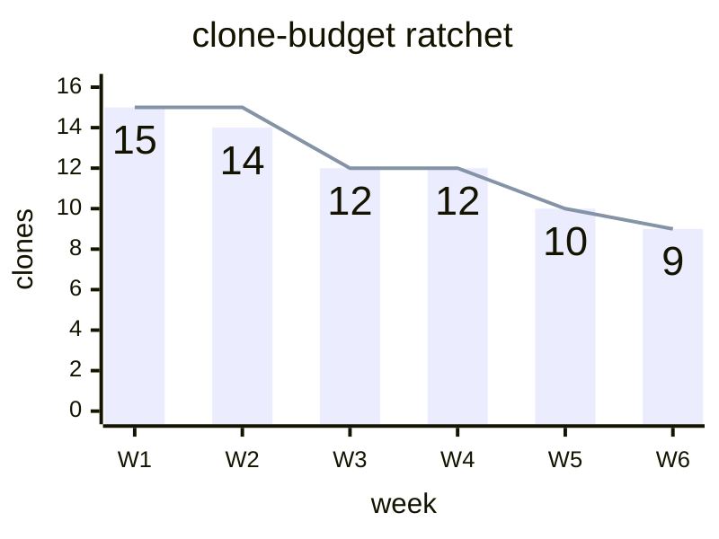

# xyChart — https://mermaid.js.org/syntax/xyChart.html (XY chart: bar + line on shared x/y axes) — `xychart` · `xychart-beta`

**Status:** Stable upstream. Mermaid v11.10.0 (changelog #6653) dropped the "-beta" suffix "to reflect their stable status". The detector regex is /^\s*xychart(-beta)?/ and the lexer maps both keywords to the same token, so `xychart-beta` still works as an alias. Several features are recent: showDataLabelOutsideBar arrived in v11.14.0; per-point line labels, x-axis labelRotation and the truncation of extra data points arrived in v11.16.0; the legend (showLegend, legendFontSize, legendPadding) arrived in v11.17.0. docs/PICTURES.md in this repo still classes it as beta: "permitted ad hoc but never prescribed". Since GitHub's Mermaid version is unknown, treat it as beta on GitHub.
**GitHub (11.17.2):** The docs page says nothing about GitHub or renderer support; verify on github.com. What is known: the MCP validator runs v11.13.0, measured by rendering an `info` diagram. A ```mermaid\ninfo\n``` block in an issue or PR on github.com would show the deployed version the same way; run that probe before prescribing anything from v11.14 or later. Use the `xychart-beta` keyword, which every version accepts. Keep version-gated features out of PR opening frames: point labels (11.16) fail to parse on older versions, and the legend (11.17) silently disappears. XY charts have no click or interaction syntax, so GitHub's lack of callbacks costs nothing. Frontmatter config and themeVariables.xyChart support on GitHub, and dark-mode palette contrast, are unverified. docs/PICTURES.md already lists xychart-beta as 'permitted ad hoc but never prescribed'.

## When to reach for it
- Fitness-gate budget ratchets over time: clone-budget.json (clones 9), comment-bloat-budget.json (narrationComments 44), forward-test-id-budget.json (duplicateIds 7, which docs/COACHES.md says 'ratcheted down as those rows get renumbered'), dep-graph and scripts-grouping. Draw measured findings as bars and the ceiling as a line. This fits /governor cycle PRs, coach athlete PRs (/decompose, /dedupe, /bury, /backfill) and /secretary weekly digests.
- Threshold budgets against a trend, such as CI install duration against ci-install-duration-budget.json maxInstallSeconds 600: a line of measured times plus a flat reference line at 600. Latency-scan before/after uses the same shape.
- Detection lag across incidents in /retro and docs/LESSONS.md (incident-scan): lag in hours per incident as bars.
- Research call-sheet evidence in symbol-sweep and earnings-cycle docs: small-n numeric series such as realized move against implied move per quarter (bar = realized, line = implied). It supports the falsifier line with a picture.
- Options payoff at expiry in plans or PRs that touch payoff math: `x-axis "underlying" 80 --> 120` with an evenly sampled `line` of P/L. Evenly spaced strikes match how the numeric axis spaces points.
- Bot persona paper-trading equity curves or per-persona returns in a digest. Use one line or one bar series, with the numbers labelled on the bars.

**Not for:**
- Composition or share of a whole, such as where a token budget goes: use pie or treemap. Overlapping bars cannot show parts of a whole.
- Architecture, dataflow, lifecycles or request paths: use C4/architecture, flowchart, stateDiagram or sequenceDiagram. An XY chart has no nodes or edges.
- Comparing two or more lines, or two or more bar series. They differ only by colour, which fails the red/green colourblind reader, and multiple bars overlap instead of grouping.
- P&L where red/green (loss/gain) carries the meaning. Hue cannot carry meaning here, and bars have no zero baseline, so negatives do not hang below zero.
- One or two data points, or values the reader must read exactly. A GFM table is clearer and already counts as the fridge-rule picture.
- Irregularly spaced dates or strikes on a numeric x-axis, which are silently evened out, and truncated y-axes on bars, which exaggerate changes.
- PRs with no numeric claim (typo, chore, pure docs). An honest `Picture: waived` beats a decorative chart.
- Anything that needs the legend, point labels, showDataLabelOutsideBar or labelRotation when GitHub's renderer may be older than v11.14-11.17. It either fails to parse or silently loses the cue.

## Header forms
- xychart-beta   (the only keyword before v11.10.0; accepted by every version, so this is the GitHub-safe choice)
- xychart   (bare keyword; v11.10.0 and later; confirmed valid on v11.13.0)
- xychart horizontal  |  xychart vertical  |  xychart-beta horizontal   (orientation token on the keyword line; the default is vertical)
- ---
title: Chart title
config:
  xyChart:
    width: 400
    height: 300
    showDataLabel: true
  themeVariables:
    xyChart:
      plotColorPalette: "#9a9a9a, #505050"
---
xychart-beta   (YAML frontmatter goes before the keyword; a frontmatter title renders as the chart title, confirmed)
- config.xyChart.chartOrientation: horizontal   (the config-key alternative to the keyword token)

## Primitives
| Form | Syntax | Note |
|---|---|---|
| chart title | `title "Sales Revenue"   \|   title Revenue` | Always drawn at the top. Needs quotes if it contains a space. The frontmatter `title:` also works. |
| x-axis, categorical (band) | `x-axis "title with space" [cat1, "cat2 with space", cat3]   \|   x-axis [jan, feb, mar]` | The axis title is optional. Categories are text. |
| x-axis, numeric range | `x-axis title 0 --> 100   \|   x-axis 0 --> 100` | Line and bar points are spaced evenly from min to max: step = (max-min)/(n-1) in xychartDb.ts. |
| x-axis, title only | `x-axis "week"` | The range or categories are derived from the data. |
| y-axis, numeric range | `y-axis "Revenue (in $)" 4000 --> 11000   \|   y-axis 0 --> 50` | The y-axis cannot be categorical. |
| y-axis, title only (auto range) | `y-axis "Seconds"` | The auto range runs from the data min to the data max, not from 0. See gotchas. |
| axes omitted | `(no x-axis / y-axis lines)` | Both axes are optional. The minimal chart is the keyword plus one series. |
| bar series | `bar [2.3, 45, .98, -3.4]   \|   bar "series name" [5000, 6000, 7500]` | Values are numbers only: optional sign, integer or decimal, and a leading dot is allowed (.6, +1.3, -.34). |
| line series | `line [2.3, 45, .98, -3.4]   \|   line "series name" [48.1, 41.5, 45.7]` | A named series goes into the legend on v11.17.0+. Unnamed series are left out of the legend. |
| per-point line label (v11.16.0+) | `line [25 "Launch", 45, 72, 90 "Target Hit"]` | A quoted string after a value. Fixed 12px, drawn in the line's stroke colour, above the point (right of it when horizontal). Bars accept the syntax but ignore the labels. Mermaid v11.13.0 rejects it with a parse error. |
| accessibility title / description | `accTitle: one line accDescr: one line accDescr {   multi-line }` | Defined in the grammar, not on the docs page. Emitted as SVG <title>/<desc> (confirmed in the render). |
| statement separator | `bar [3, 7]; line [3, 7]` | Newline or `;` both end a statement (grammar eol; confirmed valid). |

## Relations
| Form | Syntax | Note |
|---|---|---|
| none: no edges | `n/a` | XY charts have no nodes, arrows or edge variants. Relationships come only from shared axes. |
| series overlay (implicit) | `bar "measured" [15, 14, 12] line "ceiling" [15, 15, 12]` | Every bar/line statement shares the same axes and category positions. Series are drawn in declaration order, so later ones paint over earlier ones. Palette colour is assigned by declaration index across bars and lines together. |
| multiple bars (overlap, not grouped) | `bar [20,30,25,35] bar [15,25,20,30]` | barPlot.ts gives every bar series the same x and the full band width. The bars stack on top of each other; there are no grouped or stacked bars. |
| axis range delimiter | `min --> max` | The only arrow in the grammar. It is valid only inside x-axis / y-axis and is not an edge. |

## Grouping
- No subgraphs, groups, nesting or columns.
- The series (one bar/line statement) is the only grouping unit. Named series are grouped in an automatic legend on v11.17.0+; showLegend:false hides it.
- A categorical x-axis `[a, b, c]` is the only bucketing construct. There is no stacked or grouped bar layout: multiple bar series overlap.

## Annotations
- Chart title: `title "..."` in the body, or `title:` in frontmatter (both confirmed).
- Axis titles: the leading text in `x-axis "title" ...` and `y-axis "title" ...`.
- Series names: `bar "name" [...]` and `line "name" [...]`. They become legend entries on v11.17.0+ and are silently ignored on older versions (v11.13.0 renders no legend).
- Bar value labels: config xyChart.showDataLabel: true (the page says v11.14.0+ for the section; it rendered on v11.13.0). showDataLabelOutsideBar: true (v11.14.0+) moves them outside the bar.
- Per-point text labels on lines: `line [540 "PaLM", 65, ...]` (v11.16.0+, 12px fixed).
- Comments: a `%%` line is skipped (confirmed). `%%{...}%%` is excluded from the comment rule because it is a directive.
- Accessibility: `accTitle:` and `accDescr:` / `accDescr { }` produce SVG <title>/<desc>.

## Emphasis without hue (the colourblind rule)
- Mark type is the strongest non-hue channel. Make the actual a `bar` and the target/ceiling/threshold a `line`, so the two series differ in shape.
- Separate series by lightness, not hue: plotColorPalette "#9a9a9a, #505050" (light-grey bar, dark-grey line). Avoid two series of similar lightness.
- A threshold or ceiling can be drawn as a flat reference line, e.g. `line "budget" [10, 10, 10, 10]`. Keep it the only line so it cannot be mistaken for another series.
- Print the number on each bar with showDataLabel: true. The value is readable as text, so colour is never needed to decode it. Declare the bar first (see gotchas).
- Name key points on a line with per-point labels (`9 "now"`, `15 "start"`, `12 "breach"`); v11.16.0+ only.
- Put the claim in words in the title and axis titles (e.g. title "ceiling only moves down"). Legend names help only on v11.17.0+.
- Horizontal orientation keeps long category names readable without rotating them.
- Limits: there is no per-series dashed, dotted or thick stroke, no markers and no icons. Two lines can only be told apart by lightness or labels, so use at most one bar plus one line when the reader is colourblind.

## Styling hooks
- No classDef, style, `:::` or per-element styling. All styling goes through config and themeVariables.
- themeVariables.xyChart.plotColorPalette: a comma-separated colour string (e.g. "#000000, #0000FF"). Colours map to series in declaration order across bars and lines, cycling modulo the length.
- themeVariables.xyChart.backgroundColor, titleColor, dataLabelColor, legendTextColor
- themeVariables.xyChart.xAxisLabelColor, xAxisTitleColor, xAxisTickColor, xAxisLineColor
- themeVariables.xyChart.yAxisLabelColor, yAxisTitleColor, yAxisTickColor, yAxisLineColor
- Rendered SVG group classes (seen in the render, not documented): .main .background .chart-title .plot .bar-plot-N .line-plot-N .bottom-axis/.top-axis/.left-axis .label .ticks .title. They are only reachable through themeCSS, which GitHub is unverified to honour.
- Fixed geometry that cannot be configured: line strokeWidth is 2, bars have stroke-width 0 and 5% padding, point labels are 12px. There is no dash or marker option per series.

## Config keys
- xyChart.width (default 700, min 1)
- xyChart.height (default 500, min 1)
- xyChart.titlePadding (10)
- xyChart.titleFontSize (20)
- xyChart.showTitle (true)
- xyChart.showLegend (true; v11.17.0+)
- xyChart.legendFontSize (14; v11.17.0+)
- xyChart.legendPadding (10; v11.17.0+)
- xyChart.chartOrientation ('vertical' | 'horizontal')
- xyChart.plotReservedSpacePercent (50; schema minimum 30)
- xyChart.showDataLabel (false)
- xyChart.showDataLabelOutsideBar (false; v11.14.0+)
- xyChart.useMaxWidth (inherited from BaseDiagramConfig via allOf; the SVG gets max-width = width)
- xyChart.xAxis / xyChart.yAxis are AxisConfig objects with these keys: showLabel (true), labelFontSize (14), labelPadding (5), showTitle (true), titleFontSize (16), titlePadding (5), showTick (true), tickLength (5), tickWidth (2), showAxisLine (true), axisLineWidth (2), labelRotation (0; schema min -90; bottom x-axis only; v11.16.0+)

## Gotchas — what silently breaks
- GitHub keyword: bare `xychart` parses only on v11.10.0+. `xychart-beta` parses everywhere, so use it on GitHub.
- Newer syntax fails hard on older renderers. Per-point labels `[15 "start", ...]` failed on the Mermaid Chart MCP (v11.13.0) with: Parse error ... Expecting 'SQUARE_BRACES_END', 'COMMA', got 'STR'. The whole diagram becomes an error box, which would be the PR's opening frame.
- Legend is v11.17.0+. Older versions accept series names and silently draw no legend (confirmed on v11.13.0). Never let series identity depend on the legend.
- Config keys newer than the renderer (showDataLabelOutsideBar 11.14, labelRotation 11.16, showLegend/legend* 11.17) are probably ignored silently. Unverified.
- Unquoted multi-word text is joined silently: `x-axis [big cat, dog]` rendered the label "bigcat" (confirmed). Quote any text with spaces.
- Unquoted text may contain only letters, digits and & + = * . # _ -. A colon, parentheses, $, %, /, apostrophes or commas need quotes. A quoted string cannot contain `"` and there is no escape for it.
- Data values are plain numbers. `1,000` becomes two values because the comma is the separator. Units, %, $ and exponents (1e3) are not allowed.
- The default palette is unusable: the first series is #ECECFF, nearly invisible on white (confirmed in the render), and the rest mixes peach, green and pink hues. Always set plotColorPalette.
- The auto y-range starts at the data minimum, not 0. With bar [1, 2] the smallest bar rendered about 3px tall (confirmed). For bars, always give `y-axis "..." 0 --> max`.
- Bars always grow from the bottom edge of the plot, not from zero. A y-min above 0 truncates and exaggerates differences, and negative values do not hang below a zero baseline.
- Multiple bar series overlap at the same x at full width (barPlot.ts). There are no grouped or stacked bars. Use one bar series.
- showDataLabel labels every bar series with the values of the first declared plot (xychartRenderer.ts reads plots[0]). If a line is declared first, the bars show the line's numbers. Declare the bar first and use only one bar series.
- More values than categories: v11.16.0+ truncates the extra points. Older versions draw orphans in unlabeled space. Keep the counts equal.
- Numeric x-axis spaces points evenly between min and max. Irregular dates or strikes are misplaced, so use categorical labels for uneven spacing.
- Phone fit: the default is 700x500 and GitHub scales it to the container, so on a 390px screen 14px labels shrink to about 7-8px. Set width ~400 and height ~300 (rendered max-width 400 confirmed). Keep to 6-8 categories or fewer with 2-4 character labels, or use horizontal orientation.
- Casing: the diagram keyword is `xychart`, but the config and themeVariables key is `xyChart`. The docs prose says 'xychart attribute' while its YAML uses xyChart; follow the YAML.
- A multi-line `accDescr { }` could hang the browser before v11.13.0 (fix #7293). On unknown versions use a single-line accDescr.
- Pinning very dark or very light plot colours may disappear if GitHub renders with a dark theme background. Prefer mid-greys and check both light and dark mode. This is an inference and has not been verified.

## Starters (validated mcp__Mermaid_Chart__validate_and_render_mermaid_diagram. Rendering the `info` diagram shows it runs Mermaid v11.13.0.; minimal ✓, rich ✓ — The first rich draft added per-point labels (`line "ceiling" [15 "start", 15, 12, 12, 10, 9 "now"]`). v11.13.0 rejected it: "Parse error on line 8: ...line \"ceiling\" [15 \"start\", 15, 12, 12, ... Expecting 'SQUARE_BRACES_END', 'COMMA', got 'STR'". This is expected because the feature is v11.16.0+. The labels were removed and the pasted rich_example validated. Its render showed data labels 15/14/12/12/10/9 on the bars, bar fill #9a9a9a, max-width 400px, and SVG <title>/<desc> from accTitle/accDescr, with no legend (legend is v11.17.0+). Extra probes, all valid on v11.13.0: bare `xychart` with a frontmatter `title:`, `horizontal`, a `%%` comment and a `;` separator; `[big cat, dog]`, which rendered "bigcat". Values W1-W5 in the rich example are illustrative. The endpoint 9 matches the current clone-budget.json {"clones": 9}.)

Minimal:

```mermaid
xychart-beta
    line [3, 2, 1]
```

Rich (grounded in this repo):



## Sources
- https://raw.githubusercontent.com/mermaid-js/mermaid/develop/packages/mermaid/src/docs/syntax/xyChart.md
- https://mermaid.js.org/syntax/xyChart.html
- https://raw.githubusercontent.com/mermaid-js/mermaid/develop/packages/mermaid/src/diagrams/xychart/parser/xychart.jison
- https://raw.githubusercontent.com/mermaid-js/mermaid/develop/packages/mermaid/src/diagrams/xychart/xychartDetector.ts
- https://raw.githubusercontent.com/mermaid-js/mermaid/develop/packages/mermaid/src/diagrams/xychart/xychartDb.ts
- https://raw.githubusercontent.com/mermaid-js/mermaid/develop/packages/mermaid/src/diagrams/xychart/xychartRenderer.ts
- https://raw.githubusercontent.com/mermaid-js/mermaid/develop/packages/mermaid/src/diagrams/xychart/chartBuilder/components/plot/barPlot.ts
- https://raw.githubusercontent.com/mermaid-js/mermaid/develop/packages/mermaid/src/diagrams/xychart/chartBuilder/components/plot/linePlot.ts
- https://raw.githubusercontent.com/mermaid-js/mermaid/develop/packages/mermaid/src/schemas/config.schema.yaml
- https://raw.githubusercontent.com/mermaid-js/mermaid/develop/packages/mermaid/src/themes/theme-default.js
- https://raw.githubusercontent.com/mermaid-js/mermaid/develop/packages/mermaid/CHANGELOG.md
- /home/user/skynet-capital/docs/PICTURES.md
- /home/user/skynet-capital/docs/COACHES.md
- /home/user/skynet-capital/clone-budget.json
