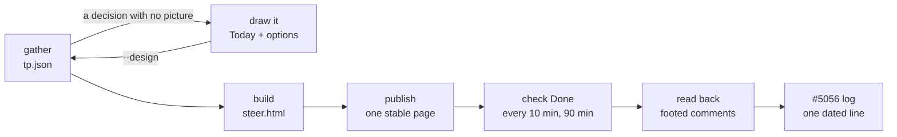

# /steer — one page, twice a day

Eric works about 8–4 Central. Each touch point is one page: **what shipped since the last page ·
the decisions only he can make · what is queued until the next page · the last 14 days · Done.**
His answers land as comments on their issues, so the page is disposable and the issue is the
record. Plan and evidence: #5056. The format was earned on #5037, where round 1 of the profile
critique drew 7 Builds, 24 More/Not marks, 6 notes and 16 pinned threads in one sitting.

## The drill

`<dir>` is this touch point's folder in the session scratchpad, e.g. `<scratchpad>/steer/2026-10-10-pm`.
The stable page's URL is in #5056's state block; the first publish puts it there.

1. **Read the last page's answers first** — the next reel starts at its Done. ArtifactData `list`
   the collection `tp` on the stable page with `out_dir: <dir>/prev` (one file per round's meta),
   then `list` each listed round's `tp/<id>/decisions` from the last 14 days into the same
   `out_dir` — the strip's "median days a decision waited" is read from those answers. No page
   yet: skip `--prev`.
   - **A late Done is read back before anything else.** If the latest round has `doneAt` set and
     #5056's Log has no line for that page id (the 90-minute watch ended first), run step 7 for
     that round now, with its own `tp.json` from its folder, then step 8.
2. **Gather** — `git fetch origin main` first (the reel and the strip read `origin/main`; a stale
   ref drops merges silently), then `npm run steer:gather -- --out <dir> --prev <dir>/prev`
   (about 2 minutes; it reads the Needs-you selector, the rank, admission, the dial and the merge
   log — nothing else).
   - Between midnight and 05:00 Central gather refuses to name the page: pass `--tp` — last
     evening's (`--tp 2026-10-09-pm`) or this morning's — so neither takes the other's records.
   - A design round: add `--design <manifest.json>` (shape below) — repeat it, or give a comma
     list, for one manifest per issue, each naming its own `issue`. Every issue must already be on
     the Needs-you list — a `Needs from you` callout above the fold — or gather refuses it.
   - Read the one-line summary: decisions and minutes, merges, queue, dial, and **`N need
     pictures: <keys>`**. A `halt` dial heads the page.
3. **Every decision gets pictures** — Eric, 2026-10-10, on a page that asked two decisions in
   words alone: _"1 and 2 have no pictures. i'm uncertain what I am responding too"_. Gather keeps
   any decision with no picture out of the asked set, in `tp.json`'s `needsPictures`. For each one,
   draw Today and its options as pictures (the critique-round drill below: a real screenshot of
   Today, 2–5 options phone-first, a recommendation) into a design manifest for its issue, then
   re-run step 2 with every manifest passed as `--design`. Publish only when `needsPictures` is
   empty — or, when a drawing can't be finished this touch point, publish anyway: the page names
   each one as "being drawn and comes next page" and the read-back rolls it over untouched. A held
   PR is the one exception: it stays a link to GitHub, where the PR opens with its own picture.
4. **Build** — `npm run steer:build -- <dir>/tp.json` → `<dir>/steer.html` + `<dir>/files.json`.
   Optional single look: open it at 390 (the page must not scroll sideways) and fix what is broken.
5. **Publish** — the Artifact tool, `file_path: <dir>/steer.html`, `files` from `files.json`,
   `capabilities: { db: {}, user: {} }`; first publish `icon: "compass"`, after that `url` = the
   stable page. List its files first (`scope: "files"`) and map every `img/…` path this
   `files.json` no longer names to `null`, so old rounds' pictures don't pile up. One functional
   pass after the first publish: ArtifactData `list` of `tp` (empty until he opens it).
   Never republish over round 1's critique page (5LDY3gN9gxLk8f3Z5UpSGT) unless Eric asks; its
   `critique/q*` records stay readable either way, because this page writes only under `tp/`.
6. **Watch for Done, briefly** — `/loop 10m` with a prompt that ArtifactData `get`s `tp/<id>`
   (collection `tp`, doc `<id>`) and, when `doneAt` is set, **cancels the loop, then** runs steps
   7 and 8 — once: a tick after the read-back would post every comment again. Put the stop time
   (publish + 90 min) in the prompt; past it, cancel the loop. A late Done is read back by the
   next page's step 1. "steered" from Eric cancels the loop and runs steps 7 and 8 at once.
7. **Read back** — ArtifactData `list` the collections `tp/<id>/decisions`, `tp/<id>/queue` and
   `tp/<id>/reel`, and `get` `tp`/`<id>`, all with `out_dir: <dir>/records`.
   - **His comments count too** — Eric, 2026-10-10, after an automatic reply told him _"a comment
     here won't show up in the read-back"_. ArtifactComments `read` on the stable page's URL
     (follow `cursor` while it says more threads exist). Take every comment Eric wrote and sent to
     Claude since this round's `openedAt` — never Claude's own replies — and write
     `<dir>/comments.json` as `[{ "anchorKey": "<the anchor's element id>", "text": "<his words,
     exactly>", "at": "<ISO time>" }]`. A decision's anchor is `#d-<key>`, or `#d-<key>-<option>`
     on one of its options; pass the id as it is — the read-back maps it to the decision key.
   - Then `npm run steer:readback -- --tp <dir>/tp.json --records <dir>/records --comments
     <dir>/comments.json --out <dir>/readback` prints the plan: `actions`, `commands`, `rollover`,
     `defaults`, `followUps`, `unplacedComments`. Each comment is quoted word for word under
     "Eric's comments on the page" in its decision's part of the issue comment; a decision he
     commented on without tapping is quoted and rolled over, never given its default.
   - Run each `commands` entry as written (REST through `scripts/issues.mjs`; bodies are files).
   - Comments: reply on each quoted thread with the issue it landed on, then resolve it, so the
     next round never quotes it twice. `followUps` `read-comment` → read his comments beside his
     taps, and bank anything that shapes a next round beside the round (the critique round's
     `{ anchor, gist, applies_to, commitment }`, step 4 below). `unplacedComments` (on what
     shipped, the queue, the header) → answer each on its thread and route it like any raw thought.
   - `followUps`: `next-round` → build the next design round (below); `read-note` / `more` /
     `hold` / `not` → read his words; a note that does settle it gets its label move by hand, with
     the quote. "Not now" never takes `needs-eric` off by itself: on an issue still carrying
     `ready` that would start the build he just declined.
   - Nothing in `rollover` is touched: a skipped fork, design round or held PR waits for the next
     page, and so does every decision that was still being drawn.
8. **Update #5056's state block** — one dated Log line: the page id, answered / rolled over,
   active minutes, and the stable page's URL if it is new.

## What the page and the read-back guarantee (and the specs that hold them)

- **One selector, one rank, one merge reader.** Decisions are `plan().needsYou`; order is
  `classOf()` then oldest; the reel is `comms-scan --json`. `tests/scripts/moneypenny/needs-you.spec.ts`.
- **Records are keyed by touch point**: `tp/<id>/{decisions,queue,reel}/<key>`, meta on `tp/<id>`.
- **No decision is asked without a picture.** One with none is named as being drawn, by title,
  counted apart in the summary line, and rolled over by the read-back with no default and no label
  move. `tests/scripts/steer-pictures.spec.ts`.
- **The bar counts only what the store holds** — the read-back reads nothing else. A view with no
  store (the desktop app's own browser, not signed in to claude.ai; a saved file) says "Answers
  save only on claude.ai — open this page there to see or change them" and locks the controls; a
  store still connecting says "Loading your answers…"; one that can't be read says so. Never a
  browser-only count. `tests/scripts/steer-client.spec.ts`.
- **Every read-back comment carries the lane FOOTER and quotes Eric word for word** — his notes
  and his comments sent to Claude on the page alike. A plan flips only through
  `ready — take slice 1 per the state block`, on an Approve of a `plan` issue.
- **A skipped approval that is reversible and in the envelope takes its default**, said as
  "default applied; no answer from Eric". Every other skip rolls over.
- **The irreversible class is a link, never a button**: held/platter PR merges, the surge dial,
  envelope paths. Specs: `tests/scripts/steer-{records,readback,page}.spec.ts`.
- **Pressed states carry a glyph and a border or strike**, both themes from `docs/BRAND.md`.

## A design decision: the critique round (#5037)

What round 1 of #5037 did, written down so the next round costs instructions, not invention:

1. **Today first, as a real screenshot** of the live app at 390 (and 1280), marked so; a mockup
   of today is labelled "mockup of today". The before is never imagined.
2. **3–5 options as pictures, phone first**, each with one line on what it changes, and a
   recommendation with its confidence and a dated "wrong if" folded beneath.
3. **Reactions: Build this · More of this · Not this**, plus a note in his words (I like · I wish ·
   What if). One Build per question becomes a `feedback` + `ready` issue at read-back.
4. **Comments pinned on a picture reach the live session** (ArtifactComments): answer each one,
   quote it on the issue at read-back (step 7 of the drill),
   and record each as `{ anchor, gist, applies_to, commitment }` beside the round — round 1's are
   in the session scratchpad's `shapes/r1-feedback/` with `eric-verbatim.md` mapping them.
5. **The next round is built from his words**: every More goes deeper (real states, edge cases,
   desktop), every Not is replaced by a new direction, every comment's commitment is honoured and
   cited, and a note that applies to all questions (round 1: "progressive reveal") shapes all of them.

The manifest `--design` reads is the critique builder's own: `{ issue, round, root?, questions:
[{ q, title, ask, rec, conf, wrong, saw[], changes, topic, today: { phone, desk, source, caption },
options: [{ key, name, phone, desk, delta }] }] }` (a bare array works with `--design-issue`).
Picture paths resolve against `root`, the manifest's folder, then its parent.

## What this will not do

- Merge, set `surge`, touch an `envelope.json` path, or ask about a `needs-eric` label that states
  no decision — those are counted on the page, and routed by the existing doors.
- Run unattended. Slice 4 (#5056) moves assembly onto the digest's Routine; until then a live
  session runs every step.
