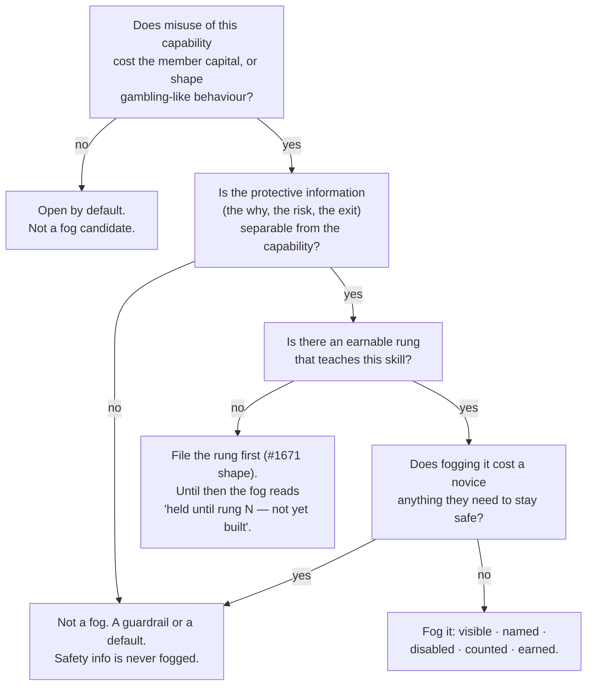

# Fog of war — when to withhold a capability, and how to do it honestly

A **fog of war** shows a member that a capability exists while withholding its contents until they
have earned the skill it assumes. It is a *reveal* mechanic, not a lock: the door is drawn on the
map, named, and counted, so the member knows exactly what is there and what opens it. Eric named it
as one of the two reveal treatments he liked in the 2026-09-05 progressive-reveal exercise
(`docs/IDEAS.md`, "just not here/now") and, on 2026-09-06, called the research shelf's **day lens**
"a spot on / perfect scenario" for it — a same-day view that pays out like 0DTE and belongs behind
the zero-DTE rung. This doc turns those two calls into criteria a session can apply without asking.

Provenance: the trade ladder (`src/domain/progression.ts`, #469), the locked-rung rule
(#1461: *visible, disabled, explained*), the proposed 400/500 rungs (#1671), the research day
lens (#1704). The portable version is the last section.

## The decision tree

_Caption — the five questions, in order; every fog shipped here should be traceable through them._

## The criteria, spelled out

The articulated ones are Eric's; the rest are what the three shipped or planned instances have in
common and nobody had written down.

1. **Fog what accelerates risk, never what explains it.** The day lens is fogged; every call's *why*
   and *proves it wrong* stay open. An exit, a loss, a `SIM` label, a P/L figure is never fogged.
2. **Fog the lens, not the data.** Nothing is deleted or hidden from the corpus; a fogged view
   renders as a silhouette with a count ("1 day call held until rung 501"). The member always knows
   what is there and what earns it — the carrot is the point.
3. **The unlock is evidence, never a claim.** A rung is earned by a real fill
   (`progression.ts`: "the order id IS the evidence") — never a checkbox, a timer, a quiz alone, or
   money. A fog that money lifts is a paywall wearing a costume.
4. **The fog must cost the novice ~nothing.** Check before fogging: what does the hidden content say?
   The research Today row reads "stand aside" on 268 of 272 ledgers — withholding it from a novice
   loses them nothing they could act on safely. If the hidden content is what a novice needs to be
   safe, it is a *default*, not a fog candidate.
5. **The gate names a rung that exists in the catalog.** A fog is honest only when its unlock is
   earnable. Where the rung is not built yet (501 before #1671 lands), the fog says so in words —
   "a rung nobody can fill yet stays locked, honestly" (#1671) — and never implies progress is
   possible when it is not.
6. **Reveal is progressive and adjacent.** The item that sharpens is the one *one step ahead* of the
   member (silhouette → outline → full), never the whole map at once. The ladder's
   rung-at-a-time unlock is the same rule.
7. **Fog is per-member, never per-universe.** It changes what *you* see of a lens, not what data the
   shared universe holds. The invite gate is the only boundary on data (CLAUDE.md, shared-universe
   rule); fog sits inside it.
8. **Experience sees through it.** Fog is coaching, so a member the seeding rule already trusts
   (wheels off, fill history) is not fogged. Whether a member may lift it themselves is #1671's
   open decision 1 — until settled, follow whatever the ladder does.
9. **Copy states what the rung teaches, not a warning.** "Zero-DTE — the fastest clock" is the
   house voice; "DANGER: advanced" is not (CLAUDE.md, positive reinforcement; domain honesty).
10. **A fog ships with its own gauge.** The progression store already knows how many members sit at
    each rung; a fog nobody ever clears is too steep, and that is a finding, not a feature.

## Instances (the pattern's own ledger)

| Where | Fogged capability | Unlock | Status |
|---|---|---|---|
| `/trade` option ticket | option opens beyond the earned rung | the previous rung's fill | shipped (#469, #1461) |
| `/playbooks` store | a house playbook's full body and preview | the rung the card names (`unlocksAfter`) | shipped (#885) |
| `/trade` multi-leg builder | spread execution | rung 401 | planned (#1671) |
| `/trade` same-day expiry | any option order expiring today | rung 501 | planned (#1671) |
| `/research` day lens | the Today row of every ledger in range | rung 501, or wheels off | planned (#1704) |

Add a row when a new fog ships; a fog with no row here is undocumented and gets one.

## Audit — the tree run across the app (2026-09-06)

Eric's ask: inspect the textbook case's criteria, then illuminate what else checks them — and what
is gated today for reasons that are *not* fog, so the noise comes off the emerging design.

| Surface | Today | Verdict | Route |
|---|---|---|---|
| `/trade` option rungs · `/playbooks` store | fogged behind fills | fog — textbook, shipped | ledger above |
| `/research` day lens | open (the Today row) | fog behind 501 | #1704 |
| `/trade` multi-leg builder · same-day expiry | open, inexecutable / ungated | fog behind 401 / 501 | #1671 |
| `/u/:id/playbooks` subscribe (delegating capital to a bot's playbook) | open, no rung | **fog candidate** — Q1 yes (capital), Q2 yes (the thesis stays readable), Q3 yes: the rung the playbook card already names | filed as its own issue |
| "say hello to Moneypenny" wall before the first stock buy | gated | **not a fog** — the unlock is engagement, not skill evidence (criterion 3); an onboarding gate, name it as one | leave; never call it fog |
| comprehension checks (`unlock-gate.tsx`) | quiz claims a milestone | a quiz may *accompany* an earn, never substitute for the fill | leave |
| wheels-off button | one-click bypass of every fog | the door, not a fog | #1671 decision 1 |
| `/research` week · month · quarter lenses | — | open — long-horizon awareness lowers risk (Q1 no) | #1704 |
| options chain greeks, every call's *why* / *proves it wrong*, P/L, `SIM` labels, the leaderboard | open | never fog — protective or shared-universe (criteria 1, 7) | — |
| `/research` calendar days with no event | disabled | **noise, not fog** — nothing is behind the door; the lens/range model makes every day pickable | #1704 slice 2 |
| `/outpost` · `/collections` catalogs | open, "named and visible, never quietly dropped" | open — browsing is not a capability | — |
| member-built bots (the north star) | not member-facing yet | future fog at a 400+ rung, when it exists | later |

## Anti-patterns

- **Fogging safety.** Hiding a kill switch, a falsifier, a risk line, or an exit path. Guardrail, not
  fog.
- **Fog as FOMO.** Copy or motion that makes the fogged thing feel like the prize and the open
  things feel like chores. The fanfare budget goes to what goes *right* (CLAUDE.md).
- **Fog with no door.** A silhouette whose rung is not in the catalog and does not say so.
- **Fog as a group setting.** Any fog whose state lives on the universe rather than the member.
- **Fog as a paywall.** Any unlock that money, a subscription, or a referral satisfies.

## The portable version (for any product)

Withhold a capability, never information. Gate it on demonstrated skill, never on a claim or a
payment. Draw the door on the map: visible, named, disabled, with a count of what is behind it and
the exact act that opens it. Reveal one step ahead of the user, not the whole map. Let proven
experience see through it. Ship a gauge of how many users sit fogged at each gate. Never fog what
someone needs to stay safe — that is a default.
