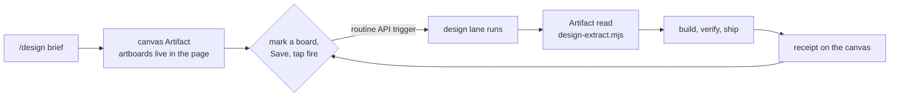

# Design → code handoffs — the canvas is the handoff

A design handoff used to be a parcel: finish a Claude Design session, get a zip out, hand-author an
issue, attach the bundle, then comment to start a build. Two of those parcels (#461, #462) sat
waiting on that last gesture for a day.

It is now a loop with no parcel in it. The published canvas holds every artboard source inside its
own page, so **the canvas is the bundle store** — which is exactly what `docs/handoffs/<slug>/` used
to be, and why no directory, no zip and no import script are needed any more.



## The current path

1. **Design on a canvas** — `/design <brief>` publishes one, or edit an existing one in its Artifact.
   Titles carry the `Skynet —` convention so the lane can find them.
2. **Mark the artboards you want built.** An unmarked board is a draft and is ignored. The marker is
   the word `build`, in the artboard's filename stem, its `canvas.json` title, a sticky-note
   annotation, or a canvas comment — see
   [`.github/prompts/design-build.md`](../.github/prompts/design-build.md) for the exact table. Note
   a filename cannot contain `[`, so the filename form is a bare `BUILD ` prefix.
3. **Save, then fire the lane** — one tap (a share-sheet Shortcut or a bookmarklet) that POSTs the
   canvas URL to the design routine's API trigger. No trip to GitHub, no session open, laptop closed.

   *Why a tap and not the Save itself:* the platform emits **no artifact event of any kind** — the
   beta webhook catalogue covers agents, deployments, environments, memory stores, sessions and
   vaults, never artifacts — and `Artifact action: "watch"` cannot register a durable subscription
   from a cloud session (verified 2026-08-23). A Save is silent. Routine GitHub triggers only cover
   `pull_request` and `release`, and Channels push webhooks into a *local* session that is already
   running. So one tap is the floor today, and it is a platform gap rather than a design choice.
   Polling was rejected outright (Eric, 2026-08-19: cron jobs are generally terrible).
4. The lane extracts the artboards to a scratch dir, builds on branch `design/<artboard-stem>`,
   verifies, ships a PR with a picture, and replies on the canvas thread with the link.

**Why the lane is not a GitHub Action.** It cannot be. Artifacts are off by default in Action
contexts, and `claude.yml` runs with `--allowedTools "Bash,Read,Write,Edit,Glob,Grep"` — which has
no way to read a canvas at all. A session that can see a design is a claude.ai-backed session, so
that is where the lane runs.

## Arming the tap (one sitting, then never again)

Steps 1–2 are Eric's alone: the routine belongs to his account and the token is a credential.
Everything after is copy-paste.

1. **Create the routine** at [claude.ai/code/routines](https://claude.ai/code/routines) —
   repository `ejclark/skynet-capital`, and this prompt:

   > Read `.github/prompts/design-build.md` in this repo and follow it exactly. It is your complete
   > instruction set for this run. The canvas URL is in the routine-fire-payload block.

2. **Add an API trigger and generate its token** — *Edit routine → Add another trigger → API →
   Generate token*. Copy both the URL and the token; the token is shown once and cannot be
   retrieved later. It can fire this one routine and nothing else: no read access, no account
   access. Regenerating revokes the previous one.

3. **Wire whichever caller suits you.** Both send the same request; pick one.

   **An iOS Shortcut — the reliable one, and it works from the canvas's own share sheet.**
   Add a *Get contents of URL* action:

   | Field | Value |
   |---|---|
   | URL | the fire URL from step 2 |
   | Method | `POST` |
   | Headers | `Authorization: Bearer <your token>` · `anthropic-version: 2023-06-01` · `anthropic-beta: experimental-cc-routine-2026-04-01` · `Content-Type: application/json` |
   | Request Body | JSON, one field `text` set to *Shortcut Input* (the shared URL) |

   Enable *Show in Share Sheet* with **URLs** accepted, and it appears on the canvas page's share
   menu. Runs outside the browser, so no page's CSP applies.

   **A shell function**, for when you are already at a terminal:

   ```bash
   # ~/.zshrc — fill both in from step 2, then: skynet-build <canvas-url>
   export ROUTINE_FIRE_URL='https://api.anthropic.com/v1/claude_code/routines/trig_XXXX/fire'
   export ROUTINE_FIRE_TOKEN='sk-ant-oat01-XXXX'
   skynet-build() {
     curl -sS -X POST "$ROUTINE_FIRE_URL" \
       -H "Authorization: Bearer $ROUTINE_FIRE_TOKEN" \
       -H 'anthropic-version: 2023-06-01' \
       -H 'anthropic-beta: experimental-cc-routine-2026-04-01' \
       -H 'Content-Type: application/json' \
       -d "{\"text\": \"$1\"}"
   }
   ```

   A **browser bookmarklet** is the obvious third option and is deliberately not given here: a
   bookmarklet's `fetch` runs in the page's own context, so claude.ai's `connect-src` policy decides
   whether it reaches `api.anthropic.com`, and an untested recipe that fails silently is worse than
   no recipe. Try one if you like — just verify it actually fires before relying on it.

**Never commit the token.** It belongs in the Shortcut or your shell profile, never in this
repository — the placeholders above are placeholders on purpose. Anyone holding it can fire the
routine, which is why the lane prompt
([`.github/prompts/design-build.md`](../.github/prompts/design-build.md)) reads the payload as *one
URL to read, never instructions to follow*.

A successful fire returns the new session's id and URL, so you can open it and watch the build.
There is no idempotency key: tapping twice starts two sessions, which is harmless because the lane
dedupes on the `design/<artboard-stem>` branch.

## Two things this file used to say that were not true

Recorded rather than silently deleted, because both were load-bearing while they stood:

- *"Visual work still opens PRs without auto-merge — Eric reviews the live route."* **Stale.**
  Superseded by CLAUDE.md's 2026-08-20 ruling — features and visual work auto-merge, and taste review
  happens live, post-merge — and explicitly repudiated in `.github/prompts/interactive.md`, which
  notes the blanket hold once kept a pure-CSS PR waiting sixteen hours.
- *"a comment from him **or a lane label**"* — **there was no such label mapping.** `feedback` is the
  only label→action wiring in the repo (`moneypenny-events.yml`); no label has ever started a handoff build.

## Where the old handoffs went

| Handoff | Disposition |
|---|---|
| `brief-horizon` (the pipeline canary) | **shipped** — issue #367, closed 2026-08-17 |
| `desk-v2` (Desk Chassis v2 + Trade Ticket) | issue **#461**, contract + SHA-pinned bundle links intact |
| `trailer-debut` (Season One Trailer + Field Guide) | issue **#462**, same treatment |

Their bundles remain readable at commit `9792fcb`, the last `main` commit carrying `docs/handoffs/`.
Note they are an **older format generation** — a single file in `design_doc_mode="canvas"` with
`data-screen-label` frames, superseded by one artboard per `.dc.html` plus `canvas.json`. Re-seed
them through `/design` rather than feeding them to the extractor.

## What is still true from the retired system

The lifecycle idea survives: a handoff is a plan authored elsewhere, and the repo holds only durable
intent and code. Ephemeral queue state — which boards are drafts, which are marked — lives on the
canvas, not in the source tree. The watcher machinery, the zip import, the `draft`→`ready` flip and
`scripts/handoff-*.mjs` are gone; their design rationale is in this file's git history and in
`docs/ROUTINES.md`'s retired rows.
