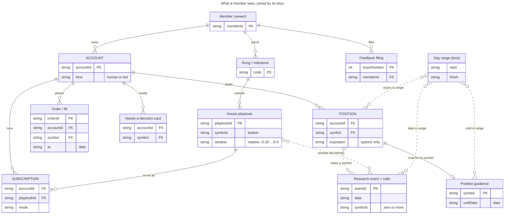

# The information model — what a signed-in member sees, keyed

_Phase 1 of the route-architecture plan (Eric, 2026-09-26: "figure out the information
architecture first. the tighter we can group information through organized data structures.. the
more this elegance will come out in our designs"). This page is read from the **types**, never
from the pages: every row cites the TypeScript type that defines the entity and the endpoint that
serves it. Slice 1a is the model; slice 1b (the wargame) settles the groups; the pages follow._

**How to read it.** Six keys join everything a member sees — **account · symbol · date/range ·
rung · playbook · event** — plus three the code carries that the plan's list left out: **order ·
position · decision**, and the one under all progression entities, **member** (the viewer, never
an account — #888). A page is a set of entities that share a key; a *joint* is a key two groups
share. The calendar is the date key made visible; the account switcher is the account key; the
ticket's symbol field is the symbol key.

## 1. The picture

_Caption — the entities a member sees and the keys that join them, read from `app/src/live/*.ts`
and the server views; solid = a relation a payload already carries, dashed = a join the app would
have to make (section 4)._

## 2. The entity table

One row per entity a signed-in member can see. **Type** is the client model (the payload's
mirror); the server view it mirrors is in parentheses. **Keys** use the vocabulary above.
**Shown today** cites the component that renders it and the page that mounts it. **Gated by** is
what hides or disables it (the fog ledger: `docs/FOG-OF-WAR.md`).

### 2a. The account group — a book

| Entity | Type (file:line) | Endpoint (server file:line) | Keys | Relations | Shown today (file:line) | Gated by |
|---|---|---|---|---|---|---|
| Owned account | `OwnedAccount` `app/src/live/settings.ts:10` | `GET /api/settings` `src/server/settings-api-routes.ts:185` | account · member | member owns 0..n; a bot carries `suspended` | `AccountCard` `app/src/routes/settings.tsx:313,430` · switcher `app/src/routes/accounts.tsx:131` · `AccountField` `app/src/routes/trade.tsx:118` · `PlaybooksRail` `app/src/shell/playbooks-section.tsx:28` · `app/src/shell/desk-rail.tsx:30` | ownership (the session) |
| Net worth (per account + total) | `AccountNetWorthView` / `AccountsNetWorthView` `app/src/live/networth.ts:59,66` (`src/observatory/networth-json-view.ts:137,144`) | `GET /api/accounts/networth` `src/server/content-api-routes.ts:155` | account · date/range (windows 7D·1M·3M·1Y, `networth-json-view.ts:21`) | all-time high; benchmark delta | `NetWorthCondensed` `app/src/shell/networth-summary.tsx:140` (`accounts.tsx:319`) · `NetWorthCard` `app/src/shell/networth-card.tsx:43` (`app/src/shell/accounts-overview-section.tsx:75`) · roster `networth-summary.tsx:61` (`accounts-overview-section.tsx:97`) | owned accounts only |
| Equity curve | `EquityCurve` `app/src/live/equity-curve.ts:17` (`src/observatory/equity-curve-json-view.ts:32`) | `GET /api/accounts/:id/equity-curve?range=` `src/server/content-api-routes.ts:159` | account · date/range (7D…ALL, `equity-curve.ts:8`) | vs benchmark bars (`hero-chart.tsx:109`) | `HeroChart` `app/src/shell/hero-chart.tsx:93` (`networth-card.tsx:126`) · `RosterSparkline` `app/src/shell/roster-sparkline.tsx:28` (`networth-summary.tsx:106`, `new-high-ceremony.tsx:102`) | — |
| Desk tiles + allocation | `Desk` / `DeskTiles` / `DeskAllocation` `app/src/live/desk.ts:150,117,138` (`src/observatory/desk-json-view.ts:206,165`) | `GET /api/desk/:id` `src/server/desk-json-routes.ts:97` (dispatched `content-api-routes.ts:164`) | account | carries positions · decisions · considerations · landmark | `DeskTilesGrid` `app/src/shell/desk-tiles-grid.tsx:23` (`u.$id.index.tsx:81`) · `MoneyStrip` `app/src/shell/money-strip.tsx:63` (`accounts-overview-section.tsx:81`) · hovercard `app/src/shell/desk-hovercard.tsx:19` (`leaderboard.tsx:268`) | none — any id, no ownership check on reads (`desk-json-routes.ts:114-118`) |
| Position (+ lots, next event) | `DeskPosition` / `PositionLot` / `PositionEvent` `app/src/live/desk.ts:27,12,62` (`src/observatory/position-event.ts:26`) | `GET /api/desk/:id` | account · symbol · position · date (`expiresInDays`, `nextEvent.at`) · event (`nextEvent`, label only) | an option's `symbol` is the OCC symbol (`desk.ts:31`) | `PositionsBlotter` `app/src/shell/positions-blotter.tsx:123` (`accounts-positions-section.tsx:34`, `u.$id.index.tsx:82`) · `MapLens`/`RunwayLens` `app/src/shell/positions-lens.tsx:116,224` · `PositionCards` `app/src/shell/position-cards.tsx:25` | — |
| Option position (+ book greeks) | `OptionPositionRow` / `OptionBookGreeks` `app/src/live/options.ts:177,195` | `GET /api/trade/option-positions?participantId=` `src/server/option-positions-route.ts:56` | account · symbol (`underlying` + OCC) · position · date (`expiration`, `daysToExpiry`) | one row per held contract | `OptionPositionsCard` `app/src/shell/option-positions.tsx:273` (`orders-section.tsx:36`) · read by `money-strip.tsx:74`, `decision-pager.tsx:77`, `guidance-section.tsx:59`, `positions-blotter.tsx:150` | `available:false` when unlinked |
| Needs-a-decision card | `Decision` `app/src/live/desk.ts:76` (`src/observatory/decisions-view.ts:43`) | rides `GET /api/desk/:id` | account · symbol · position · decision · date (as words: `clocks`, `decisions-view.ts:116-130`) | `primary.href` → `/trade?desk=&symbol=` (`decisions-view.ts:217`) | `DecisionPager` `app/src/shell/decision-pager.tsx:62` (`accounts-overview-section.tsx:104`) · `MapLens` column `positions-lens.tsx:116` | — |
| Consideration chip | `ConsiderationChip` `app/src/live/desk.ts:105` (`src/observatory/considerations-view.ts:24`) | rides `GET /api/desk/:id` (`desk-json-routes.ts:223-228`) | account · symbol · playbook | a house playbook matching a held symbol | **served, not rendered** — the pager replaced the rail (`decision-pager.tsx:11`) | — |
| Activity event (fill) + reasoning | `DeskActivityEvent` / `ActivityReasoning` `app/src/live/desk.ts:256,279` (`src/observatory/desk-json-view.ts:312`) | `GET /api/desk/:id/activity` `src/server/desk-json-routes.ts:107,122` | account · order · symbol · date (`at`) · playbook (`reasoning.playbookId`) · decision (`reasoning`) | anchor `#act-<orderId>` (`desk.ts:332`) | `ActivityTable` `app/src/shell/activity-table.tsx:24` (`accounts.tsx:107-123`) · `RecentOrdersStrip` `app/src/shell/recent-orders-strip.tsx:30` (`option-gate.tsx:535`, `trade-gate.tsx:386`) · `FormStrip` `app/src/shell/form-strip.tsx:53` (`networth-card.tsx:131`) | `available:false` without a ledger |
| Order (working / recent) | `DeskOrderRow` / `DeskOrders` `app/src/live/orders.ts:19,44` | `GET /api/trade/orders?participantId=` `src/server/trade-orders-routes.ts:286`; cancel/replace `:290,277` | account · order · symbol · date (`submittedAt`) | `replaces` / `replacedBy` chain | `OrdersSection` `app/src/shell/orders-section.tsx:18` (`trade.tsx:339`) | unlinked / unreachable |
| Order event (live) | `DeskOrderEvent` `app/src/live/desk-events.ts:18` | `GET /api/trade/events?participantId=` (SSE) `src/server/desk-events-route.ts:30` | account · order | promotes the ticket's headline to "filled" | `fillHeadline` `app/src/live/fill-headline.ts:24` | bus wired |
| Alert | `DeskAlert` `app/src/live/alerts.ts:11` (`src/server/desk-alerts-route.ts:38`) | `GET /api/trade/alerts?participantId=` `src/server/desk-alerts-route.ts:31` | account · symbol? · date (`at`) | dismissed by `fingerprint` | `DeskAlerts` `app/src/shell/desk-alerts.tsx:67` (`orders-section.tsx:34`) | `dismissable` |
| Pulse (recap) | `DeskPulse` `app/src/live/pulse.ts:61` (`src/observatory/pulse-json-view.ts:62`) | `GET /api/desk/:id/pulse` `src/server/desk-json-routes.ts:107` | account · date/range (weeks, curve) | streaks; the doubling race | `PulseBody` `app/src/routes/u.$id.pulse.tsx:129` — **desk only** | — |
| Heartbeat | `Heartbeat` / `PlaybookHeartbeat` `app/src/live/heartbeat.ts:18,10` (`src/observatory/bot-heartbeat-view.ts:34,24`) | `GET /api/desk/:id/heartbeat` `src/server/desk-json-routes.ts:107` | account (bot) · playbook · date (`since`, `lastPassAt`) | one verdict per subscribed playbook | `HeartbeatChip` `app/src/shell/heartbeat.tsx:73` (`accounts.tsx:317`) · `HeartbeatSection` `heartbeat.tsx:99` (`accounts.tsx:251`) | bot accounts only (`accounts.tsx:78`) |
| Decision cycle (a bot's pass) | `DecisionCycle` / `DecisionOutcome` / `RefusedIntent` `app/src/live/desk.ts:345,312,336` (`src/observatory/decision-json-view.ts:80`) | `GET /api/desk/:id/decisions?before=` `src/server/desk-json-routes.ts:107` | account (bot) · date (`at`) · symbol · playbook · order (`activityAnchor`) | forecast (`desk.ts:305`) | `DecisionsSection` `app/src/shell/decisions-section.tsx:177` (`heartbeat.tsx:127`, `u.$id.decisions.tsx:56`) | bot accounts |
| Thesis | `ThesisData` / `ThesisCall` / `ThesisMarker` `app/src/live/desk.ts:433,395,411` (`src/observatory/thesis-json-view.ts:69`) | `GET /api/desk/:id/thesis` `src/server/desk-json-routes.ts:107` | account (bot) · date (`window`, `asOf`, `markers[].at`) · order (`activityAnchor`) | persona id | `ThesisDrawer` `app/src/shell/thesis-drawer.tsx:207` (`accounts.tsx:252`, `u.$id.thesis.tsx:38`) | bot accounts; `BotControls` owner-only (`thesis-drawer.tsx:36`) |
| Landmark (power, health) | `DeskSnapshot.landmark` `app/src/live/desk.ts:164-169` | rides `GET /api/desk/:id` (`desk-json-routes.ts:229-231`) | account (persona-mapped bot) | drives the tower iframe URL | `SauronCard` `app/src/shell/sauron-card.tsx:145` (`accounts-overview-section.tsx:108`) · `LandmarkHero` `app/src/shell/landmark-hero.tsx:21` (`u.$id.index.tsx:75`) | persona-mapped bots only |
| Playbook subscription | `PlaybookStoreCardView.subscription` `app/src/live/playbook-store.ts:36-44` (`src/domain/types.ts:162`) | `GET /api/playbook-store?id=` `src/server/desk-json-routes.ts:224`; writes `src/server/subscriptions-api-routes.ts:211-213` | account · playbook · rung (delegation) | account × playbook × mode | `SubscriptionRow` `app/src/shell/playbook-store-cards.tsx:141` (`playbooks-section.tsx:64` → `research.tsx:101`) | `canManage` (ownership); delegation fog — rung 102 or wheels off (`playbook-store.ts:47`) |

### 2b. The symbol group — a name

| Entity | Type (file:line) | Endpoint (server file:line) | Keys | Relations | Shown today (file:line) | Gated by |
|---|---|---|---|---|---|---|
| Quote | `Quote` `app/src/live/quote.ts:9` | `GET /api/trade/quote?symbol=` `src/server/option-api-routes.ts:343` | symbol | also rides `ChainData.quote` (`options.ts:78`) | `QuoteHeader` `app/src/shell/quote-header.tsx:70` (`trade-gate.tsx:297`, `option-gate.tsx:599`, `chain-section.tsx:156`) | — |
| Bars | `Bars` `app/src/live/bars.ts:18` | `GET /api/trade/bars?symbol=&days=` `src/server/option-api-routes.ts:344` | symbol · date/range (days) | the hero chart's benchmark series | `ChartSection` `app/src/shell/chart-section.tsx:119` (`trade.tsx:337`) · `hero-chart.tsx:109` | — |
| Option chain | `ChainData` / `ChainRow` `app/src/live/options.ts:69,40` | `GET /api/trade/chain?symbol=&type=&exp=` `src/server/option-api-routes.ts:342` | symbol · date (`expiration`, `expirations[]`) | `?exp=` travels between chain and ticket (`expiration.ts:1-6`) | `ChainSection` `app/src/shell/chain-section.tsx:83` (`trade.tsx:356`) · `option-gate.tsx:215` · `draft-leg-form.tsx:55` · `roll-row.tsx:91` · straddle `chain-straddle.tsx:49` → `straddle-view.tsx:77` | rung locks (zero-DTE 501, `chain-section.tsx:56,145`); unlinked / no options |
| Position guidance (the lever calls) | `GuidanceMarket` (served) → `PositionGuidance` / `LeverCall` / `ManageCall` / `WaitingOn` `src/options/position-guidance-types.ts:168,270,196,304,257`; client `GuidanceAnswer` `app/src/live/guidance.ts:24` | `GET /api/trade/guidance?symbol=` `src/server/option-api-routes.ts:346` | symbol · position (stake applied in the browser, `guidance.ts:13-16`) · decision (`call`, `confidence`, `provesWrong`) · date (`until.date`, `DteMark`, `EarningsWindow`, `catalysts`) · event (catalysts, no id) | ledger stance quotes the research call (`:121`) | `GuidanceView` `app/src/shell/guidance-view.tsx:103` (`guidance-section.tsx:136` → `trade.tsx:345`) · `LeverCard` `guidance-lever.tsx:213` · `GuidanceManage` `guidance-manage.tsx:122` | one read per symbol (~30 broker calls) |
| Ticket / option / spread draft | `TicketDraft`/`TicketPreview` `app/src/live/ticket.ts:17,28` · `OptionDraft`/`OptionPreview` `app/src/live/options.ts:132,93` · `DraftOrder`/`DraftPreview` `app/src/live/draft-order.ts:33,62` | `POST /api/trade/review|submit` `src/server/trade-api-routes.ts:171,155` · `/api/trade/option/review|submit` `src/server/option-api-routes.ts:391,359` · `/api/trade/draft` `src/server/draft-order-route.ts:226` | account · symbol · rung (`code`) · date (`expiration`) · order (the result) | preset by `?play=` ↔ ticket nav (`plays.ts:12`) | `TradeGate` `app/src/shell/trade-gate.tsx:160` · `OptionGate` `option-gate.tsx:107` · `DraftOrderBuilder` `draft-order-builder.tsx:181` (`trade.tsx:142` `DeskTicket`) | feedback gate; per-rung locks; spread until 401; zero-DTE until 501 (`option-gate.tsx:419,458,550`) |
| Wire trade (everyone's fills) + booked P/L | `WireTrade` / `WirePnl` `app/src/live/wire.ts:36,51` (`src/observatory/wire-json-view.ts:52`) | `GET /api/wire[?before=]` `src/server/content-api-routes.ts:57`; `?symbol=` variant (`wire.ts:107`, **no caller**) | account (`whoId`) · symbol · date (`when`) | reasoning + vitals on bot trades | `TradeRow` `app/src/shell/wire-trade-row.tsx:69` (`activity.tsx:379`) · `PnlSection` `app/src/routes/activity.tsx:139` | — (shared universe) |

### 2c. The date group — the calendar

| Entity | Type (file:line) | Endpoint (server file:line) | Keys | Relations | Shown today (file:line) | Gated by |
|---|---|---|---|---|---|---|
| Research event | `ResearchEvent` `app/src/live/research.ts:52` (source `MarketEvent` `src/domain/market-events-types.ts:28`) | `GET /api/research` `src/server/content-api-routes.ts:61` (`researchShelfJson`, `src/observatory/research-json-view.ts:64`) | event · date · symbol (`symbols[]`, empty = market-wide) | kind · impact · `researched` | `EventHorizon` `app/src/shell/event-horizon.tsx:138` (`board-section.tsx:373`) · `CallBoard` `board-section.tsx:59` | day lens fog (`app/src/live/fog.ts:14`) |
| Research call (a ledger's horizon rows) | `ResearchCall` / `HorizonRow` `app/src/live/research.ts:24,15` | `GET /api/research` | event (`eventId`) · date/range (the lens picks a horizon, `research.ts:100`) · decision (call · confidence) · symbol (via its event) | `adjacent` hub events; `lastAssessed` | `CallBoard` `app/src/shell/board-section.tsx:59` · call mix `app/src/live/call-mix.ts:29` | the Today row fogged behind rung 501 or wheels off |
| Research doc (study, ledger) | `ResearchDocLink` `app/src/live/research.ts:7` | `GET /api/research`; the page itself `/research/<slug>` `src/server/research-page-routes.ts:6` | event (a ledger's slug) · symbol (in the slug) | — | `DocList` `app/src/shell/board-section.tsx:195` | — |
| Research symbol (watchlist + next print) | `ResearchSymbol` `app/src/live/research.ts:46` | `GET /api/research` | symbol · event · date (`next.date`) | — | `ResearchFilters` chips `app/src/shell/board-section.tsx:227` | — |
| Day range (a lens around an anchor) | `DayRange` / `Lens` `app/src/live/horizon-range.ts:19`, `app/src/live/research.ts:100` | client-derived (`rangeFor`, `horizon-range.ts:72`); fiscal quarter from `src/domain/fiscal-calendar.ts:19` | date/range · symbol (one symbol snaps the quarter, `board-section.tsx:326-328`) | the query's `on:` + `lens:` tokens (`research.ts:122`) | `EventHorizon` head + lens row `event-horizon.tsx:138` | — |
| Market closure | `ResearchClosure` `app/src/live/research.ts:65` / `MarketClosure` `horizon-range.ts:27` (`src/domain/market-calendar.ts:27`) | rides `GET /api/research` only (`content-api-routes.ts:66-78`) | date | hatched on the grid; counts sessions | `EventHorizon` `event-horizon.tsx:138` | — |
| Market session clock | `MarketSessionView` `app/src/live/market-session.ts:18` | none — client clock | date | — | `MarketSession` `app/src/shell/market-session.tsx:26` (`__root.tsx:176`, every route) | — |
| Council line (this week) | `CouncilEntry` / `CouncilWeek` `app/src/live/council.ts:8,21` | `GET/POST /api/council` `src/server/council-api-routes.ts:9` | member (`mine`) · date (`week`) · playbook (`playbookId`) | `plays[]` = playbook id + symbol | `CouncilSection` `app/src/routes/activity.tsx:239` | `enabled` |

### 2d. The progression group — the member's rungs (member-keyed, never account-keyed)

| Entity | Type (file:line) | Endpoint (server file:line) | Keys | Relations | Shown today (file:line) | Gated by |
|---|---|---|---|---|---|---|
| Play / rung (the ladder) | `PlayInfo` / `PlaysIndex` `app/src/live/options.ts:15,31` (`src/domain/plays.ts:59`) | `GET /api/trade/plays` `src/server/plays-api-routes.ts:126` | rung (`code`, `locked`, `earned`, `opensAfter`) · member (via the linked account) | `gate` = the feedback gate (#1119) | `MilestoneStrip` `app/src/shell/milestone-strip.tsx:32` (`trade.tsx:717`, `learn_.trading.tsx:73`) · `RungChip` `rung-chip.tsx:15` (`trade.tsx:215`) · `TicketNav` `ticket-nav.tsx:32` (`trade.tsx:226`) · `LockedPanel` `locked-panel.tsx:17` · `LadderGateCard` `ladder-gate.tsx:11` · day-lens fog `fog.ts:22` | the feedback gate; `wheels` |
| Journey (courses · milestones · checks) | `Journey` / `JourneyCourse` / `JourneyMilestone` / `CheckGate` `app/src/live/learn.ts:83,21,12,51` (`src/observatory/learn-json-view.ts:85`; `src/domain/curriculum.ts:21,33`) | `GET /api/learn` `src/server/content-api-routes.ts:80`; claim/check `src/server/learn-api-routes.ts:68-86` | member · rung (a milestone's `tradeType`) · order (`earned.orderId`) · date (`earned.on`) | celebrations; rank; points | `Chapters` `app/src/routes/learn.tsx:30` · `CourseCard`/`Hud` `app/src/shell/course-cards.tsx:43,83` (`learn_.trading.tsx:82-85`) · `UnlockBanner`/`CheckGateCard` `app/src/shell/unlock-gate.tsx:89,210` (`learn.tsx:125-131`) · `ProfileMeta` `app/src/shell/profile-meta.tsx:13` | the feedback gate (`learn.ts:89`) |
| Onboarding (M·01) | `Onboarding` / `OnboardingStep` / `OnboardingAccount` `app/src/live/onboarding.ts:28,8,17` (`src/server/onboarding-api-routes.ts:28`) | `GET /api/onboarding` `src/server/onboarding-api-routes.ts:144` | member (`viewerId`) · account (`account`) · rung (`rungsEarned`, `nextUp`) | decides the Profile tab's landing (`__root.tsx:98-111`) | `OnboardingPage` `app/src/routes/onboarding.tsx:134` · `MilestoneCard` `learn.tsx:41` · Moneypenny's chips (`app/src/live/moneypenny.ts:71-75`) | — |
| Human playbook (M·03 chapter) | `HumanPlaybook` / `Playbooks` `app/src/live/playbooks.ts:3,15` (`src/domain/playbook-catalog.ts:19`) | `GET /api/playbooks` `src/server/playbooks-api-routes.ts:24` | member · rung (`unlocksAfter`) · playbook (a **different** catalog from the store) | — | `PlaybooksPage` `app/src/routes/playbooks.tsx:52` · `MilestoneCard` `learn.tsx:63` | WIP Season 1 — nothing arms |
| Feedback filing + community earn | `RecentFiling` / `FeedbackIndex` / `CommunityCelebration` `app/src/live/feedback.ts:15,32,26` | `GET/POST /api/feedback` `src/server/feedback-api-routes.ts:225` | member · date (`filedAt`) | mirrored as `WireFeedbackItem` `app/src/live/wire.ts:59` on Activity | `RecentFeedback` `app/src/shell/feedback-recent.tsx:89` (`feedback.tsx:68`) · `CommunityUnlockBanner` `community-banner.tsx:16` (`feedback.tsx:66`) · `PulseSection` `activity.tsx:173` | `enabled` (a GitHub token) |
| Moneypenny thread | `MpMessage` / `MoneypennyState` `app/src/live/moneypenny.ts:40,58`; `CompanionIndex` `app/src/live/companion.ts:13` | `GET /api/companion`, chat `src/server/companion-routes.ts:211,215`; thread in this browser keyed by member (`app/src/live/moneypenny-storage.ts:14`) | member | files through `/api/feedback` | `MoneypennyRail` `app/src/shell/moneypenny-rail.tsx:65` (`__root.tsx:197`, every route) | `companionEnabled` |

### 2e. The house group — the shared universe

| Entity | Type (file:line) | Endpoint (server file:line) | Keys | Relations | Shown today (file:line) | Gated by |
|---|---|---|---|---|---|---|
| Playbook store card | `PlaybookStoreCardView` / `PlaybookStoreView` `app/src/live/playbook-store.ts:18,54` (`src/observatory/playbook-store-json-view.ts:32`; `src/discovery/playbook-store.ts:38`) | `GET /api/playbook-store?id=<account>` `src/server/desk-json-routes.ts:224` | playbook · symbol (`symbols[]` basket) · date (`window` — **relative**, "D-20 to D-6", `src/discovery/playbook-store.ts:48-50`) · rung (delegation) · account (the subscription) | evidence → a research doc (`evidenceHref`) | `PlaybookCard` `app/src/shell/playbook-store-cards.tsx:255` (`playbooks-section.tsx:64` → `research.tsx:101`) | full body behind `unlocksAfter`; delegation fog |
| Leaderboard row + compare | `BoardRow` / `BoardCompare` / `BoardSnapshot` `app/src/live/board.ts:32,76,83` (`src/observatory/standings-board-view.ts:71,131`) | `GET /api/board?by=&a=&b=` `src/server/content-api-routes.ts:151` + live patches (`app/src/live/channel.ts:34`) | account (`key`) · member (`meId` on the league card) | `CompareHolding.symbol` (`board.ts:68`) | `FieldLadder`/`CompareSection` `app/src/routes/leaderboard.tsx:251,114` · `LeagueCard` `app/src/shell/league-card.tsx:52` (`sauron-card.tsx:182`) | — (shared universe) |
| Ops status (fleet health) | `OpsStatus` `app/src/live/ops-status.ts:18` | `GET /api/ops-status` `src/server/content-api-routes.ts:92` | none (fleet-wide) | — | `StatusPill` `app/src/shell/status-pill.tsx:123` (`__root.tsx:178`, every route) | `degraded` |
| Fleet controls | `Fleet` / `FleetBot` `app/src/live/controls.ts:15,9` (`src/observatory/settings-view.ts:14`) | `GET/POST /api/controls` `src/server/controls-api-routes.ts:64` | account (bots) | — | `MissionControl` `app/src/shell/mission-control.tsx:25` (`settings.tsx:437`) | owner |
| Persona class (join) | `PersonaClass` / `JoinIndex` `app/src/live/join.ts:10,17` | `GET/POST /api/join` `src/server/join-api-routes.ts:64` | account (the one being created) | — | `onboarding.tsx:82` (`ConnectStep` `:70`) | `canAddBots` |

## 3. The keys table

| Key | Entities that carry it | Pages already keyed on it | URL carrier today |
|---|---|---|---|
| **account** | owned account · net worth · equity curve · desk · position · option position · decision · activity · order · order event · alert · pulse · heartbeat · decision cycle · thesis · landmark · subscription · board row · wire trade (`whoId`) · onboarding.account | `/accounts` (switcher, `accounts.tsx:355-357`; default from `app/src/shell/default-account.ts:14`) · `/u/$id` (path) · `/trade` (`trade.tsx:626-632`) · `/research?section=playbooks` · `/leaderboard` (compare) | `?account=` (`/accounts`, `/research`) · `/u/$id` · `?desk=` (`/trade`) · `?a=`/`?b=` (`/leaderboard`) |
| **symbol** | position · option position (`underlying` + OCC) · decision · activity · order · alert · quote · bars · chain · guidance · ticket/draft · wire trade · research event (`symbols[]`) · research symbol · research doc (slug) · playbook card (`symbols[]`) · compare holding | `/trade` (`trade.tsx:741-746`) · `/research` (`sym:` scope, `research.ts:134`) · `/accounts` blotter (`?q=` bare term, `desk.ts:184-192`; anchor `#pos-<symbol>`) · `/activity` (`?q=` bare term, `wire.ts:124`) | `?symbol=` `?strike=` `?exp=` `?manage=` `?rollTo=` (`/trade`) · `sym:` token inside `?q=` (`/research`) |
| **date / range** | research event · research call (lens → horizon) · day range · closure · session clock · position (`expiresInDays`, `nextEvent.at`) · option position (`expiration`) · activity (`at`) · order (`submittedAt`) · alert (`at`) · pulse (weeks) · equity curve (range) · net worth (windows) · heartbeat (`since`) · decision cycle (`at`) · thesis (`window`, markers) · guidance (`until`, `DteMark`, earnings window, catalysts) · council (`week`) · filing (`filedAt`) · milestone (`earned.on`) · chain (`expiration`) · playbook card (`window`, relative) | `/research` (the calendar: `on:` + `lens:`, `board-section.tsx:317-328`) · `/trade` (`?exp=`) · `/accounts` blotter (`dte:<N`, `event:before-expiry`, `desk.ts:184-192`) · hero chart range — **component state, not URL** (`hero-chart.tsx:101`) · `/accounts?lens=` is the positions **view** (list · map · runway, `positions-lens.tsx:18`), not a time lens | `on:YYYY-MM-DD` + `lens:day|week|month|quarter|all` tokens inside `?q=` (`/research`) · `?exp=` (`/trade`) · `dte:` / `event:` tokens inside `?q=` (`/accounts`) |
| **rung** | play (`code`, `locked`, `earned`) · milestone (`tradeType`) · onboarding (`rungsEarned`, `nextUp`) · human playbook (`unlocksAfter`) · delegation gate (`unlocksAfter`) · day-lens fog (501) · ticket/draft (`code`) | `/trade` (ticket nav ↔ `?play=`, `plays.ts:12-31`) · `/learn/trading` · `/learn` · `/research` (fog line) | `?play=` (`/trade`, a preset) · the chapter routes `/learn`, `/learn/trading`, `/onboarding`, `/playbooks` |
| **playbook** | store card · subscription · heartbeat (`playbooks[].playbookId`) · activity reasoning (`playbookId`) · decision outcome (`playbook`) · council line (`playbookId`) · consideration chip · human playbook (a separate catalog) | `/research?section=playbooks` (the whole catalog) · `/accounts?section=heartbeat` (verdict table) | **none** — no `?playbook=`; the store lists all cards for one account |
| **event** | research event (`id`) · research call (`eventId`) · ledger doc (slug ends with the id) · research symbol (`next`) · position (`nextEvent`, label + date, **no id**) · guidance (`catalysts`, `EarningsWindow`, **no id**) | `/research` (board + calendar) · `/research/<slug>` (the ledger page) | `/research/<slug>` · `on:` day ≈ the event's day; **no `?event=`** |
| **order** | order row (`id`) · activity event (`orderId`) · order event (`orderId`) · milestone (`earned.orderId`) · decision outcome (`activityAnchor`) · thesis marker (`activityAnchor`) | `/trade?section=orders` · `/accounts?section=activity` (anchor target) | `#act-<orderId>` anchor — resolves only on `/accounts` (`desk.ts:332`) · `?section=orders` (`/trade`) |
| **position** | position (account × symbol) · option position (OCC) · decision (`symbol`) · open call / manage call (`occ`) · guidance stake | `/accounts` overview (blotter, lenses) · `/trade?section=guidance` (`?manage=`) | `?manage=<OCC>` (`/trade`) · `#pos-<symbol>` anchor (`/accounts`) |
| **decision** | needs-a-decision card (`id`) · decision cycle (bot) · lever call / manage call (guidance) · research call (house) · thesis call | `/accounts` overview (pager) · `/accounts?section=heartbeat` · `/trade?section=guidance` · `/research` board | **none** — cards link out to `/trade?desk=&symbol=` |
| **member** | owned accounts (the list) · journey · onboarding (`viewerId`) · filing · Moneypenny thread · council (`mine`) · board (`meId`) · plays (via the linked account) | `/learn`, `/learn/trading`, `/onboarding`, `/playbooks`, `/feedback`, `/settings`, the rail | **none** — always the session; never a param |

**Two vocabulary clashes the lift must resolve** (slice 2a's `useHorizonRange()`): `?lens=` on
`/accounts` is a positions *view* (`positions-lens.tsx:18`) while `lens:` on `/research` is a *time
span* (`research.ts:100`); and "playbook" names two catalogs — the store (`playbook-store.ts:18`,
subscribable, keyed by account) and M·03's human playbooks (`playbooks.ts:3`, a chapter, keyed by
member) — #3622 parked, #3527 recorded the split as deliberate.

## 4. The joints — where two groups share a key

"Client-side today" means both payloads already exist and the join is a lookup over them; "needs
an endpoint" means a field the server knows is not in any payload.

| Joint | Left payload (field) | Right payload (field) | Key | Client-side today? |
|---|---|---|---|---|
| Events × held positions — a *burning day* | `GET /api/research` `events[].symbols`, `events[].date` (`research.ts:52-60`) | `GET /api/desk/:id` `positions[].symbol` (shares) + `GET /api/trade/option-positions` `rows[].underlying` (options — the desk's `symbol` is the OCC code, `desk.ts:31`) | symbol → date | **Yes** — three fetches already made on `/accounts` + `/research`; the server already does the narrow version per position (`nextEvent`, `position-event.ts:26`, and the blotter's `event:before-expiry`, `desk.ts:71`), just not by day. `/api/research` is the whole history (`content-api-routes.ts:66`) — fine at today's size |
| Research calls × held symbols | `GET /api/research` `calls[].eventId` → `events[].symbols` | positions as above | symbol | **Yes** — `board-section.tsx:351-359` already scopes the board by `sym:`; feed it held symbols instead of typed ones |
| Playbook windows × the calendar's range | `GET /api/playbook-store?id=` `cards[].window` — a **relative** string ("D-20 to D-6", `src/discovery/playbook-store.ts:48`) | `DayRange` (`horizon-range.ts:19`) | date | **No** — the payload has no absolute dates; the probe knows the event dates server-side. Needs the store view to emit resolved `windowStart`/`windowEnd` per basket symbol (a field, not a new route) |
| Decisions due × range | `GET /api/desk/:id` `decisions[].clocks` — **words** ("Expires in 37 days", `decisions-view.ts:116-130`) | the same payload's `positions[].expiresInDays`, `positions[].nextEvent.at` | position → date | **Yes, indirectly** — join `decisions[].symbol` to its position in the same payload and read the dates there; cleaner if `Decision` carried `dueOn` (a field) |
| Guidance *until* × range | `GET /api/trade/guidance?symbol=` → `LeverCall.until.date`, `ManageCall.until.date`, `WaitingOn.date` (`position-guidance-types.ts:205,257,316`) | `DayRange` | date | **Per symbol, yes** — the engine runs in the browser (`guidance.ts:13-16`); **book-level, no** — one ~30-call read per held symbol; a book-level sheet wants an endpoint (the owner member file's seed, slice 0a) |
| Expirations × range | `GET /api/trade/option-positions` `rows[].expiration` (ISO, `options.ts:183`) | `DayRange` | date | **Yes** — `RunwayLens` already draws a 90-day timeline off it (`positions-lens.tsx:224`) |
| Chain expirations × guidance DTE marks | `GET /api/trade/chain` `expirations[]` (`options.ts:72`) | guidance `dteStrip[]` (`position-guidance-types.ts:212`) | date | **Yes** — both on `/trade`; the chain owns the control (#3407/#3523), guidance marks it |
| Heartbeat verdicts × store cards | `GET /api/desk/:id/heartbeat` `playbooks[].playbookId` | `GET /api/playbook-store?id=` `cards[].id` | playbook | **Yes** — two fetches, one lookup; today the verdict table shows ids only (`heartbeat.tsx:30`) |
| Bot decisions × fills | `GET /api/desk/:id/decisions` `outcomes[].activityAnchor` (`#act-<orderId>`) | `GET /api/desk/:id/activity` `activity[].orderId` | order | **Yes** — but the anchor resolves only where the activity table is mounted (`/accounts`), not on `/u/$id` (the plan's dead end 5) |
| Fills × earned milestones | `GET /api/learn` `milestones[].earned.orderId` (`learn.ts:18`) | `GET /api/desk/:id/activity` `activity[].orderId` | order | **Yes** — nothing renders it today (a fill row could say "earned 201") |
| Council lines × playbooks | `GET /api/council` `entries[].playbookId` (`council.ts:13`) | `GET /api/playbook-store?id=` `cards[].id` | playbook | **Yes** — the council already ships `plays[]` (id + symbol) for its selector |
| Wire trades × my accounts | `GET /api/wire` `trades[].whoId` | `GET /api/settings` `accounts[].id` | account | **Yes** — the feed has `is:bot`/`is:human` (`wire.ts:115`) but no "mine" |
| Leaderboard row × desk | `GET /api/board` `rows[].key` | `GET /api/desk/:id` | account | **Yes** — the hovercard does it (`desk-hovercard.tsx:19`) |
| Closures × any calendar outside R&D | `GET /api/research` `closures[]` — the only carrier (`content-api-routes.ts:66-78`) | whichever page mounts a calendar | date | **Yes with a fetch** — a calendar on `/accounts` must pull `/api/research` for its closures, or closures move to their own small endpoint |

## 5. Draft group → home

_draft: settled by the wargame (slice 1b). Listed, not decided — every home below is a candidate._

| Group | Key(s) | Entities | Pieces shown today (pages) | Candidate home |
|---|---|---|---|---|
| **The account group** — a book | account (+ symbol, order, position, decision inside it) | net worth · equity curve · desk tiles · positions · option positions · decisions · activity · orders · alerts · pulse · heartbeat · decision cycles · thesis · landmark · subscriptions | `/accounts` (overview · activity · heartbeat · thesis) · `/u/$id` (active · decisions · pulse · thesis) · `/trade?section=orders` · `/research?section=playbooks` (subscribe as) | `/accounts` for the viewer's own accounts; `/u/$id` for any account (#2321: other members' accounts are not Profile) |
| **The symbol group** — a name | symbol (+ date via expiry) | quote · bars · chain · guidance · ticket/draft · wire for one symbol (served, unrendered) · research calls/docs by `sym:` · store cards by basket | `/trade` (ticket · chart · chain · guidance) · `/research` (`sym:` chips) | `/trade`; research for the ticket's symbol co-located, never merged (#3729, #3623) |
| **The date group** — the calendar | date/range (+ event, symbol) | research events · calls (lens) · closures · session clock · expirations · guidance `until` · decisions due · council week · playbook windows (once absolute) · net-worth / equity windows | `/research` rail (the only calendar) · `/accounts` runway lens · hero chart range (local state) · `/trade?exp=` | one range control, present on every page it joins — R&D today; the cockpit and Trade per the joints above (the plan's "conduit") |
| **The progression group** — the member's rungs | rung · member | plays/ladder · journey · onboarding · human playbooks (M·03) · delegation fog · day-lens fog · celebrations | `/learn` · `/learn/trading` · `/onboarding` · `/playbooks` · `/trade` (strip + rung chip) · `/research` (fog line) · `/feedback` (community earns) | a viewer-level Milestones section (#888) — of the Profile page, or its own; the wargame decides |
| **The house group** — the shared universe | event · playbook (+ account for standings) | research events/calls/docs · playbook store · leaderboard · wire (everyone's fills) · council · ops status · fleet controls · persona classes | `/research` · `/leaderboard` · `/activity` · the status pill · `/settings` (mission control) · `/onboarding` (join) | R&D stays the house home (#3623); leaderboard and activity stay outside Profile (#2321) |
| **The member group** — me, not my accounts | member | feedback filings · Moneypenny thread · profile/timezone/prefs | `/feedback` · the rail (every route) · `/settings` | Profile sections keyed on the viewer (#888) and Settings; the rail stays shell-level |

## 6. What the model contradicts in the plan

Where the plan file's claims about pages or entities are wrong by the code — each with the line
that proves it.

1. **Thesis is already a cockpit section.** The plan says the desk's "remaining exclusives — Pulse,
   Thesis — become sections" of `/accounts`; `ThesisDrawer` already mounts there
   (`app/src/routes/accounts.tsx:71,252`). The only desk-exclusive payload is **Pulse**
   (`u.$id.pulse.tsx:129`); Decisions render inside Heartbeat (`heartbeat.tsx:127`) *and* on
   `/u/$id/decisions`.
2. **The calendar is not blind to the book — the server already joins one event per position.**
   "It knows nothing about *your* book" is true of the calendar control, but `DeskPosition.nextEvent`
   (`position-event.ts:26`, `desk.ts:62`) and the `event:before-expiry` filter (`desk.ts:71`) are
   the burning-day join, per position, shipped. What is missing is the *by-day* direction.
3. **Playbook windows are relative strings, not dates.** "The store cards already carry a window"
   — they carry `"D-20 to D-6"` (`src/discovery/playbook-store.ts:48-50`); no date join is
   possible client-side (joint table). The wargame's "playbook windows × range" needs a field.
4. **Decisions carry no due date.** `Decision.clocks` are sentences (`decisions-view.ts:116-130`);
   "decisions due × range" joins through the position, not the card.
5. **Two keys the plan's list omits carry six entities each: `order` and `member`.** Anchors,
   earned milestones, SSE fills and thesis markers key on the order id; every progression entity
   keys on the viewer, never the account (#888) — "the account key is the profile" is only true of
   the book half of Profile.
6. **The store view takes an account, nothing else.** "R&D's calls/ledgers … keyed by the column's
   range and the account's symbols" — `/api/playbook-store?id=` (`desk-json-routes.ts:224`) and
   `/api/research` (no params, `content-api-routes.ts:61`) accept neither a range nor a symbol
   server-side; the scoping the plan wants is client-side over both payloads (joints 1–2), which is
   possible today.
7. **`?lens=` already exists and means something else.** The plan's carrier list (`?account=`,
   `?section=`, `?play=`, `on:`/`lens:`/`sym:`) misses `/accounts?lens=list|map|runway`
   (`positions-lens.tsx:18`) — a positions *view*, colliding in name with R&D's time lens.
8. **"Who else traded this" does not render.** `fetchWireForSymbol` (`wire.ts:107`) has no caller,
   and `Desk.considerations` (`desk.ts:157`) is served but unrendered since the pager replaced the
   rail (`decision-pager.tsx:11`) — neither is on any page the shapes re-home.
9. **The desk reads are open to any id.** `/api/desk/:id` finds the participant and answers with no
   ownership check (`desk-json-routes.ts:114-118`) — the plan's dead end 4 holds on reads as well
   as on the write controls it names.
10. **The hero chart's range is not URL state.** "The calendar's range" cannot key the equity chart
    today: its range lives in component state (`hero-chart.tsx:101`) and speaks a different
    vocabulary (7D·1M·3M·1Y·YTD·ALL, `equity-curve.ts:8`) from the lens (day·week·month·quarter·all).
