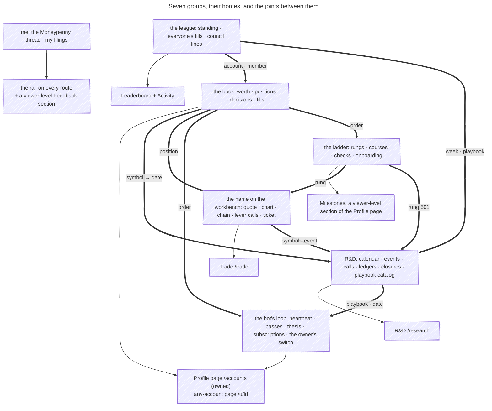

# The information model — what a signed-in member sees, keyed

_Phase 1 of the route-architecture plan (Eric, 2026-09-26: "figure out the information
architecture first. the tighter we can group information through organized data structures.. the
more this elegance will come out in our designs"). This page is read from the **types**, never
from the pages: every row cites the TypeScript type that defines the entity and the endpoint that
serves it. Slice 1a is the model (§1–§4); slice 1b, the wargame, settled the groups, the joints
and the missing entities (§5–§7) and wrote the decision down (§8); the pages follow._

**How to read it.** Six keys join everything a member sees — **account · symbol · date/range ·
rung · playbook · event** — plus four the code carries that the plan's list left out: **order ·
position · decision · member** — the last under every progression entity, and always the viewer,
never an account (#888) — and an eleventh the wargame found, **persona** (§5.8). A page is a set of
entities that share a key; a *joint* is a key two groups
share. The calendar is the date key made visible; the account switcher is the account key; the
ticket's symbol field is the symbol key.

## 1. The picture

_Caption — the entities a member sees and the keys that join them, read from `app/src/live/*.ts`
and the server views; solid = a relation a payload already carries, dashed = a join the app would
have to make (section 4)._

## 2. The entity table

One row per entity a signed-in member can see. **Type** is the client model (the payload's
mirror); the server view it mirrors is in parentheses. **Keys** use the vocabulary above.
**Shown today** cites the component that renders it and the page that mounts it. **Gated by** is
what hides or disables it (the fog ledger: `docs/FOG-OF-WAR.md`).

### 2a. The account group — a book

| Entity | Type (file:line) | Endpoint (server file:line) | Keys | Relations | Shown today (file:line) | Gated by |
|---|---|---|---|---|---|---|
| Owned account | `OwnedAccount` `app/src/live/settings.ts:10` | `GET /api/settings` `src/server/settings-api-routes.ts:185` | account · member | member owns 0..n; a bot carries `suspended` | `AccountCard` `app/src/routes/settings.tsx:313,430` · switcher `app/src/routes/accounts.tsx:131` · `AccountField` `app/src/routes/trade.tsx:118` · `PlaybooksRail` `app/src/shell/playbooks-section.tsx:28` · `app/src/shell/desk-rail.tsx:30` | ownership (the session) |
| Net worth (per account + total) | `AccountNetWorthView` / `AccountsNetWorthView` `app/src/live/networth.ts:59,66` (`src/observatory/networth-json-view.ts:137,144`) | `GET /api/accounts/networth` `src/server/content-api-routes.ts:155` | account · date/range (windows 7D·1M·3M·1Y, `networth-json-view.ts:21`) | all-time high; benchmark delta | `NetWorthCondensed` `app/src/shell/networth-summary.tsx:140` (`accounts.tsx:319`) · `NetWorthCard` `app/src/shell/networth-card.tsx:43` (`app/src/shell/accounts-overview-section.tsx:75`) · roster `networth-summary.tsx:61` (`accounts-overview-section.tsx:97`) | owned accounts only |
| Equity curve | `EquityCurve` `app/src/live/equity-curve.ts:17` (`src/observatory/equity-curve-json-view.ts:32`) | `GET /api/accounts/:id/equity-curve?range=` `src/server/content-api-routes.ts:159` | account · date/range (7D…ALL, `equity-curve.ts:8`) | vs benchmark bars (`hero-chart.tsx:109`) | `HeroChart` `app/src/shell/hero-chart.tsx:93` (`networth-card.tsx:126`) · `RosterSparkline` `app/src/shell/roster-sparkline.tsx:28` (`networth-summary.tsx:106`, `new-high-ceremony.tsx:102`) | owned accounts only (`src/server/equity-curve-routes.ts:39-41`, 404 otherwise — corrected in 1b) |
| Desk tiles + allocation | `Desk` / `DeskTiles` / `DeskAllocation` `app/src/live/desk.ts:150,117,138` (`src/observatory/desk-json-view.ts:206,165`) | `GET /api/desk/:id` `src/server/desk-json-routes.ts:97` (dispatched `content-api-routes.ts:164`) | account | carries positions · decisions · considerations · landmark | `DeskTilesGrid` `app/src/shell/desk-tiles-grid.tsx:23` (`u.$id.index.tsx:81`) · `MoneyStrip` `app/src/shell/money-strip.tsx:63` (`accounts-overview-section.tsx:81`) · hovercard `app/src/shell/desk-hovercard.tsx:19` (`leaderboard.tsx:268`) | none — any id, no ownership check on reads (`desk-json-routes.ts:114-118`) |
| Position (+ lots, next event) | `DeskPosition` / `PositionLot` / `PositionEvent` `app/src/live/desk.ts:27,12,62` (`src/observatory/position-event.ts:26`) | `GET /api/desk/:id` | account · symbol · position · date (`expiresInDays`, `nextEvent.at`) · event (`nextEvent`, label only) | an option's `symbol` is the OCC symbol (`desk.ts:27`) | `PositionsBlotter` `app/src/shell/positions-blotter.tsx:123` (`accounts-positions-section.tsx:34`, `u.$id.index.tsx:82`) · `MapLens`/`RunwayLens` `app/src/shell/positions-lens.tsx:116,224` · `PositionCards` `app/src/shell/position-cards.tsx:25` | — |
| Option position (+ book greeks) | `OptionPositionRow` / `OptionBookGreeks` `app/src/live/options.ts:177,195` | `GET /api/trade/option-positions?participantId=` `src/server/option-positions-route.ts:56` | account · symbol (`underlying` + OCC) · position · date (`expiration`, `daysToExpiry`) | one row per held contract | `OptionPositionsCard` `app/src/shell/option-positions.tsx:273` (`orders-section.tsx:36`) · read by `money-strip.tsx:74`, `decision-pager.tsx:77`, `guidance-section.tsx:59`, `positions-blotter.tsx:150` | owned accounts only (`src/server/option-positions-route.ts:59-61`, 404 otherwise — corrected in 1b); `available:false` when unlinked |
| Needs-a-decision card | `Decision` `app/src/live/desk.ts:76` (`src/observatory/decisions-view.ts:43`) | rides `GET /api/desk/:id` | account · symbol · position · decision · date (as words: `clocks`, `decisions-view.ts:116-130`) | `primary.href` → `/trade?desk=&symbol=` (`decisions-view.ts:217`) | `DecisionPager` `app/src/shell/decision-pager.tsx:62` (`accounts-overview-section.tsx:104`) · `MapLens` column `positions-lens.tsx:116` | — |
| Consideration chip | `ConsiderationChip` `app/src/live/desk.ts:105` (`src/observatory/considerations-view.ts:24`) | rides `GET /api/desk/:id` (`desk-json-routes.ts:223-228`) | account · symbol · playbook | a house playbook matching a held symbol | **served, not rendered** — the pager replaced the rail (`decision-pager.tsx:11`) | — |
| Activity event (fill) + reasoning | `DeskActivityEvent` / `ActivityReasoning` `app/src/live/desk.ts:256,279` (`src/observatory/desk-json-view.ts:312`) | `GET /api/desk/:id/activity` `src/server/desk-json-routes.ts:107,122` | account · order · symbol · date (`at`) · playbook (`reasoning.playbookId`) · decision (`reasoning`) | anchor `#act-<orderId>` (`desk.ts:332`) | `ActivityTable` `app/src/shell/activity-table.tsx:24` (`accounts.tsx:107-123`) · `RecentOrdersStrip` `app/src/shell/recent-orders-strip.tsx:30` (`option-gate.tsx:535`, `trade-gate.tsx:386`) · `FormStrip` `app/src/shell/form-strip.tsx:53` (`networth-card.tsx:131`) | `available:false` without a ledger |
| Order (working / recent) | `DeskOrderRow` / `DeskOrders` `app/src/live/orders.ts:19,44` | `GET /api/trade/orders?participantId=` `src/server/trade-orders-routes.ts:286`; cancel/replace `:290,277` | account · order · symbol · date (`submittedAt`) | `replaces` / `replacedBy` chain | `OrdersSection` `app/src/shell/orders-section.tsx:18` (`trade.tsx:339`) | unlinked / unreachable |
| Order event (live) | `DeskOrderEvent` `app/src/live/desk-events.ts:18` | `GET /api/trade/events?participantId=` (SSE) `src/server/desk-events-route.ts:30` | account · order | promotes the ticket's headline to "filled" | `fillHeadline` `app/src/live/fill-headline.ts:24` | bus wired |
| Alert | `DeskAlert` `app/src/live/alerts.ts:11` (`src/server/desk-alerts-route.ts:38`) | `GET /api/trade/alerts?participantId=` `src/server/desk-alerts-route.ts:31` | account · symbol? · date (`at`) | dismissed by `fingerprint` | `DeskAlerts` `app/src/shell/desk-alerts.tsx:67` (`orders-section.tsx:34`) | `dismissable` |
| Pulse (recap) | `DeskPulse` `app/src/live/pulse.ts:61` (`src/observatory/pulse-json-view.ts:62`) | `GET /api/desk/:id/pulse` `src/server/desk-json-routes.ts:107` | account · date/range (weeks, curve) | streaks; the doubling race | `PulseBody` `app/src/routes/u.$id.pulse.tsx:129` — **desk only** | — |
| Heartbeat | `Heartbeat` / `PlaybookHeartbeat` `app/src/live/heartbeat.ts:18,10` (`src/observatory/bot-heartbeat-view.ts:34,24`) | `GET /api/desk/:id/heartbeat` `src/server/desk-json-routes.ts:107` | account (bot) · playbook · date (`since`, `lastPassAt`) | one verdict per subscribed playbook | `HeartbeatChip` `app/src/shell/heartbeat.tsx:73` (`accounts.tsx:317`) · `HeartbeatSection` `heartbeat.tsx:99` (`accounts.tsx:251`) | bot accounts only (`accounts.tsx:78`) |
| Decision cycle (a bot's pass) | `DecisionCycle` / `DecisionOutcome` / `RefusedIntent` `app/src/live/desk.ts:345,312,336` (`src/observatory/decision-json-view.ts:80`) | `GET /api/desk/:id/decisions?before=` `src/server/desk-json-routes.ts:107` | account (bot) · date (`at`) · symbol · playbook · order (`activityAnchor`) | forecast (`desk.ts:305`) | `DecisionsSection` `app/src/shell/decisions-section.tsx:178` (`heartbeat.tsx:127`, `u.$id.decisions.tsx:56`) | bot accounts |
| Thesis | `ThesisData` / `ThesisCall` / `ThesisMarker` `app/src/live/desk.ts:433,395,411` (`src/observatory/thesis-json-view.ts:69`) | `GET /api/desk/:id/thesis` `src/server/desk-json-routes.ts:107` | account (bot) · date (`window`, `asOf`, `markers[].at`) · order (`activityAnchor`) | persona id | `ThesisDrawer` `app/src/shell/thesis-drawer.tsx:207` (`accounts.tsx:252`, `u.$id.thesis.tsx:38`) | bot accounts; `BotControls` is a `<fieldset disabled>` for everyone — a prospective subscriber's control, not the owner's (`thesis-drawer.tsx:36-42`; corrected in 1b, §5.2) |
| Landmark (power, health) | `DeskSnapshot.landmark` `app/src/live/desk.ts:164-169` | rides `GET /api/desk/:id` (`desk-json-routes.ts:229-231`) | account (persona-mapped bot) | drives the tower iframe URL | `SauronCard` `app/src/shell/sauron-card.tsx:145` (`accounts-overview-section.tsx:108`) · `LandmarkHero` `app/src/shell/landmark-hero.tsx:21` (`u.$id.index.tsx:75`) | persona-mapped bots only |
| Playbook subscription | `PlaybookStoreCardView.subscription` `app/src/live/playbook-store.ts:36-44` (`src/domain/types.ts:162`) | `GET /api/playbook-store?id=` `src/server/subscriptions-api-routes.ts:206`; writes `src/server/subscriptions-api-routes.ts:211-213` | account · playbook · rung (delegation) | account × playbook × mode | `SubscriptionRow` `app/src/shell/playbook-store-cards.tsx:141` (`playbooks-section.tsx:64` → `research.tsx:101`) | `canManage` (ownership); delegation fog — rung 102 or wheels off (`playbook-store.ts:47`) |

### 2b. The symbol group — a name

| Entity | Type (file:line) | Endpoint (server file:line) | Keys | Relations | Shown today (file:line) | Gated by |
|---|---|---|---|---|---|---|
| Quote | `Quote` `app/src/live/quote.ts:9` | `GET /api/trade/quote?symbol=` `src/server/option-api-routes.ts:343` | symbol | also rides `ChainData.quote` (`options.ts:78`) | `QuoteHeader` `app/src/shell/quote-header.tsx:70` (`trade-gate.tsx:297`, `option-gate.tsx:599`, `chain-section.tsx:156`) | — |
| Bars | `Bars` `app/src/live/bars.ts:18` | `GET /api/trade/bars?symbol=&days=` `src/server/option-api-routes.ts:344` | symbol · date/range (days) | the hero chart's benchmark series | `ChartSection` `app/src/shell/chart-section.tsx:119` (`trade.tsx:337`) · `hero-chart.tsx:109` | — |
| Option chain | `ChainData` / `ChainRow` `app/src/live/options.ts:69,40` | `GET /api/trade/chain?symbol=&type=&exp=` `src/server/option-api-routes.ts:342` | symbol · date (`expiration`, `expirations[]`) | `?exp=` travels between chain and ticket (`expiration.ts:1-6`) | `ChainSection` `app/src/shell/chain-section.tsx:83` (`trade.tsx:356`) · `option-gate.tsx:215` · `draft-leg-form.tsx:55` · `roll-row.tsx:91` · straddle `chain-straddle.tsx:49` → `straddle-view.tsx:77` | rung locks (zero-DTE 501, `chain-section.tsx:56,145`); unlinked / no options |
| Position guidance (the lever calls) | `GuidanceMarket` (served) → `PositionGuidance` / `LeverCall` / `ManageCall` / `WaitingOn` `src/options/position-guidance-types.ts:168,270,196,304,257`; client `GuidanceAnswer` `app/src/live/guidance.ts:24` | `GET /api/trade/guidance?symbol=` `src/server/option-api-routes.ts:346` | symbol · position (stake applied in the browser, `guidance.ts:13-16`) · decision (`call`, `confidence`, `provesWrong`) · date (`until.date`, `DteMark`, `EarningsWindow`, `catalysts`) · event (catalysts, no id) | ledger stance quotes the research call (`:121`) | `GuidanceView` `app/src/shell/guidance-view.tsx:103` (`guidance-section.tsx:136` → `trade.tsx:345`) · `LeverCard` `guidance-lever.tsx:213` · `GuidanceManage` `guidance-manage.tsx:122` | one read per symbol (~30 broker calls) |
| Ticket / option / spread draft | `TicketDraft`/`TicketPreview` `app/src/live/ticket.ts:17,28` · `OptionDraft`/`OptionPreview` `app/src/live/options.ts:132,93` · `DraftOrder`/`DraftPreview` `app/src/live/draft-order.ts:33,62` | `POST /api/trade/review|submit` `src/server/trade-api-routes.ts:171,155` · `/api/trade/option/review|submit` `src/server/option-api-routes.ts:391,359` · `/api/trade/draft` `src/server/draft-order-route.ts:226` | account · symbol · rung (`code`) · date (`expiration`) · order (the result) | preset by `?play=` ↔ ticket nav (`plays.ts:12`) | `TradeGate` `app/src/shell/trade-gate.tsx:160` · `OptionGate` `option-gate.tsx:107` · `DraftOrderBuilder` `draft-order-builder.tsx:181` (`trade.tsx:142` `DeskTicket`) | feedback gate; per-rung locks; spread until 401; zero-DTE until 501 (`option-gate.tsx:419,458,550`) |
| Wire trade (everyone's fills) + booked P/L | `WireTrade` / `WirePnl` `app/src/live/wire.ts:36,51` (`src/observatory/wire-json-view.ts:52`) | `GET /api/wire[?before=]` `src/server/content-api-routes.ts:57`; `?symbol=` variant (`wire.ts:106`, **no caller**) | account (`whoId`) · symbol · date (`when`) | reasoning + vitals on bot trades | `TradeRow` `app/src/shell/wire-trade-row.tsx:69` (`activity.tsx:379`) · `PnlSection` `app/src/routes/activity.tsx:139` | — (shared universe) |

### 2c. The date group — the calendar

| Entity | Type (file:line) | Endpoint (server file:line) | Keys | Relations | Shown today (file:line) | Gated by |
|---|---|---|---|---|---|---|
| Research event | `ResearchEvent` `app/src/live/research.ts:52` (source `MarketEvent` `src/domain/market-events-types.ts:28`) | `GET /api/research` `src/server/content-api-routes.ts:61` (`researchShelfJson`, `src/observatory/research-json-view.ts:64`) | event · date · symbol (`symbols[]`, empty = market-wide) | kind · impact · `researched` | `EventHorizon` `app/src/shell/event-horizon.tsx:138` (`board-section.tsx:373`) · `CallBoard` `board-section.tsx:59` | day lens fog (`app/src/live/fog.ts:14`) |
| Research call (a ledger's horizon rows) | `ResearchCall` / `HorizonRow` `app/src/live/research.ts:24,15` | `GET /api/research` | event (`eventId`) · date/range (the lens picks a horizon, `research.ts:100`) · decision (call · confidence) · symbol (via its event) | `adjacent` hub events; `lastAssessed` | `CallBoard` `app/src/shell/board-section.tsx:59` · call mix `app/src/live/call-mix.ts:29` | the Today row fogged behind rung 501 or wheels off |
| Research doc (study, ledger) | `ResearchDocLink` `app/src/live/research.ts:7` | `GET /api/research`; the page itself `/research/<slug>` `src/server/research-page-routes.ts:6` | event (a ledger's slug) · symbol (in the slug) | — | `DocList` `app/src/shell/board-section.tsx:195` | — |
| Research symbol (watchlist + next print) | `ResearchSymbol` `app/src/live/research.ts:46` | `GET /api/research` | symbol · event · date (`next.date`) | — | `ResearchFilters` chips `app/src/shell/board-section.tsx:227` | — |
| Day range (a lens around an anchor) | `DayRange` / `Lens` `app/src/live/horizon-range.ts:19`, `app/src/live/research.ts:100` | client-derived (`rangeFor`, `horizon-range.ts:72`); fiscal quarter from `src/domain/fiscal-calendar.ts:19` | date/range · symbol (one symbol snaps the quarter, `board-section.tsx:326-328`) | the query's `on:` + `lens:` tokens (`research.ts:122`) | `EventHorizon` head + lens row `event-horizon.tsx:138` | — |
| Market closure | `ResearchClosure` `app/src/live/research.ts:65` / `MarketClosure` `horizon-range.ts:27` (`src/domain/market-calendar.ts:27`) | rides `GET /api/research` only (`content-api-routes.ts:66-78`) | date | hatched on the grid; counts sessions | `EventHorizon` `event-horizon.tsx:138` | — |
| Market session clock | `MarketSessionView` `app/src/live/market-session.ts:18` | none — client clock | date | — | `MarketSession` `app/src/shell/market-session.tsx:26` (`__root.tsx:176`, every route) | — |
| Council line (this week) | `CouncilEntry` / `CouncilWeek` `app/src/live/council.ts:8,21` | `GET/POST /api/council` `src/server/council-api-routes.ts:9` | member (`mine`) · date (`week`) · playbook (`playbookId`) | `plays[]` = playbook id + symbol | `CouncilSection` `app/src/routes/activity.tsx:239` | `enabled` |

### 2d. The progression group — the member's rungs (member-keyed, never account-keyed)

| Entity | Type (file:line) | Endpoint (server file:line) | Keys | Relations | Shown today (file:line) | Gated by |
|---|---|---|---|---|---|---|
| Play / rung (the ladder) | `PlayInfo` / `PlaysIndex` `app/src/live/options.ts:15,31` (`src/domain/plays.ts:59`) | `GET /api/trade/plays` `src/server/plays-api-routes.ts:126` | rung (`code`, `locked`, `earned`, `opensAfter`) · member (via the linked account) | `gate` = the feedback gate (#1119) | `MilestoneStrip` `app/src/shell/milestone-strip.tsx:32` (`trade.tsx:717`, `learn_.trading.tsx:73`) · `RungChip` `rung-chip.tsx:15` (`trade.tsx:215`) · `TicketNav` `ticket-nav.tsx:32` (`trade.tsx:226`) · `LockedPanel` `locked-panel.tsx:17` · `LadderGateCard` `ladder-gate.tsx:11` · day-lens fog `fog.ts:22` | the feedback gate; `wheels` |
| Journey (courses · milestones · checks) | `Journey` / `JourneyCourse` / `JourneyMilestone` / `CheckGate` `app/src/live/learn.ts:83,21,12,51` (`src/observatory/learn-json-view.ts:85`; `src/domain/curriculum.ts:21,33`) | `GET /api/learn` `src/server/content-api-routes.ts:80`; claim/check `src/server/learn-api-routes.ts:68-86` | member · rung (a milestone's `tradeType`) · order (`earned.orderId`) · date (`earned.on`) | celebrations; rank; points | `Chapters` `app/src/routes/learn.tsx:30` · `CourseCard`/`Hud` `app/src/shell/course-cards.tsx:43,83` (`learn_.trading.tsx:82-85`) · `UnlockBanner`/`CheckGateCard` `app/src/shell/unlock-gate.tsx:89,210` (`learn.tsx:125-131`) · `ProfileMeta` `app/src/shell/profile-meta.tsx:13` | the feedback gate (`learn.ts:89`) |
| Onboarding (M·01) | `Onboarding` / `OnboardingStep` / `OnboardingAccount` `app/src/live/onboarding.ts:28,8,17` (`src/server/onboarding-api-routes.ts:28`) | `GET /api/onboarding` `src/server/onboarding-api-routes.ts:144` | member (`viewerId`) · account (`account`) · rung (`rungsEarned`, `nextUp`) | decides the Profile tab's landing (`__root.tsx:98-111`) | `OnboardingPage` `app/src/routes/onboarding.tsx:134` · `MilestoneCard` `learn.tsx:41` · Moneypenny's chips (`app/src/live/moneypenny.ts:71-75`) | — |
| Human playbook (M·03 chapter) | `HumanPlaybook` / `Playbooks` `app/src/live/playbooks.ts:3,15` (`src/domain/playbook-catalog.ts:19`) | `GET /api/playbooks` `src/server/playbooks-api-routes.ts:24` | member · rung (`unlocksAfter`) · playbook (a **different** catalog from the store) | — | `PlaybooksPage` `app/src/routes/playbooks.tsx:52` · `MilestoneCard` `learn.tsx:63` | WIP Season 1 — nothing arms |
| Feedback filing + community earn | `RecentFiling` / `FeedbackIndex` / `CommunityCelebration` `app/src/live/feedback.ts:15,32,26` | `GET/POST /api/feedback` `src/server/feedback-api-routes.ts:225` | member · date (`filedAt`) | mirrored as `WireFeedbackItem` `app/src/live/wire.ts:59` on Activity | `RecentFeedback` `app/src/shell/feedback-recent.tsx:89` (`feedback.tsx:68`) · `CommunityUnlockBanner` `community-banner.tsx:16` (`feedback.tsx:66`) · `PulseSection` `activity.tsx:173` | `enabled` (a GitHub token) |
| Moneypenny thread | `MpMessage` / `MoneypennyState` `app/src/live/moneypenny.ts:40,58`; `CompanionIndex` `app/src/live/companion.ts:13` | `GET /api/companion`, chat `src/server/companion-routes.ts:211,215`; thread in this browser keyed by member (`app/src/live/moneypenny-storage.ts:14`) | member | files through `/api/feedback` | `MoneypennyRail` `app/src/shell/moneypenny-rail.tsx:65` (`__root.tsx:197`, every route) | `companionEnabled` |

### 2e. The house group — the shared universe

| Entity | Type (file:line) | Endpoint (server file:line) | Keys | Relations | Shown today (file:line) | Gated by |
|---|---|---|---|---|---|---|
| Playbook store card | `PlaybookStoreCardView` / `PlaybookStoreView` `app/src/live/playbook-store.ts:18,54` (`src/observatory/playbook-store-json-view.ts:32`; `src/discovery/playbook-store.ts:38`) | `GET /api/playbook-store?id=<account>` `src/server/subscriptions-api-routes.ts:206` | playbook · symbol (`symbols[]` basket) · date (`window` — **relative**, "D-20 to D-6", `src/discovery/playbook-store.ts:48-50`) · rung (delegation) · account (the subscription) | evidence → a research doc (`evidenceHref`) | `PlaybookCard` `app/src/shell/playbook-store-cards.tsx:255` (`playbooks-section.tsx:64` → `research.tsx:101`) | full body behind `unlocksAfter`; delegation fog |
| Leaderboard row + compare | `BoardRow` / `BoardCompare` / `BoardSnapshot` `app/src/live/board.ts:32,76,83` (`src/observatory/standings-board-view.ts:71,131`) | `GET /api/board?by=&a=&b=` `src/server/content-api-routes.ts:151` + live patches (`app/src/live/channel.ts:34`) | account (`key`) · member (`meId` on the league card) | `CompareHolding.symbol` (`board.ts:68`) | `FieldLadder`/`CompareSection` `app/src/routes/leaderboard.tsx:251,114` · `LeagueCard` `app/src/shell/league-card.tsx:52` (`sauron-card.tsx:182`) | — (shared universe) |
| Ops status (fleet health) | `OpsStatus` `app/src/live/ops-status.ts:18` | `GET /api/ops-status` `src/server/content-api-routes.ts:92` | none (fleet-wide) | — | `StatusPill` `app/src/shell/status-pill.tsx:123` (`__root.tsx:178`, every route) | `degraded` |
| Fleet controls | `Fleet` / `FleetBot` `app/src/live/controls.ts:15,9` (`src/observatory/settings-view.ts:14`) | `GET/POST /api/controls` `src/server/controls-api-routes.ts:64` | none — fleet-wide (`allSuspended`, every bot; env-allowlist owner). The per-bot switch is Owned account's `suspended` + `POST /api/settings/bot-control` (§5.2) | — | `MissionControl` `app/src/shell/mission-control.tsx:25` (`settings.tsx:437`) | owner |
| Persona class (join) | `PersonaClass` / `JoinIndex` `app/src/live/join.ts:10,17` | `GET/POST /api/join` `src/server/join-api-routes.ts:64` | account (the one being created) | — | `onboarding.tsx:82` (`ConnectStep` `:70`) | `canAddBots` |

## 3. The keys table

| Key | Entities that carry it | Pages already keyed on it | URL carrier today |
|---|---|---|---|
| **account** | owned account · net worth · equity curve · desk · position · option position · decision · activity · order · order event · alert · pulse · heartbeat · decision cycle · thesis · landmark · subscription · board row · wire trade (`whoId`) · onboarding.account | `/accounts` (switcher, `accounts.tsx:355-357`; default from `app/src/shell/default-account.ts:14`) · `/u/$id` (path) · `/trade` (`trade.tsx:626-632`) · `/research?section=playbooks` · `/leaderboard` (compare) | `?account=` (`/accounts`, `/research`) · `/u/$id` · `?desk=` (`/trade`) · `?a=`/`?b=` (`/leaderboard`) |
| **symbol** | position · option position (`underlying` + OCC) · decision · activity · order · alert · quote · bars · chain · guidance · ticket/draft · wire trade · research event (`symbols[]`) · research symbol · research doc (slug) · playbook card (`symbols[]`) · compare holding | `/trade` (`trade.tsx:741-746`) · `/research` (`sym:` scope, `research.ts:134`) · `/accounts` blotter (`?q=` bare term, `desk.ts:184-192`; anchor `#pos-<symbol>`) · `/activity` (`?q=` bare term, `wire.ts:124`) | `?symbol=` `?strike=` `?exp=` `?manage=` `?rollTo=` (`/trade`) · `sym:` token inside `?q=` (`/research`) |
| **date / range** | research event · research call (lens → horizon) · day range · closure · session clock · position (`expiresInDays`, `nextEvent.at`) · option position (`expiration`) · activity (`at`) · order (`submittedAt`) · alert (`at`) · pulse (weeks) · equity curve (range) · net worth (windows) · heartbeat (`since`) · decision cycle (`at`) · thesis (`window`, markers) · guidance (`until`, `DteMark`, earnings window, catalysts) · council (`week`) · filing (`filedAt`) · milestone (`earned.on`) · chain (`expiration`) · playbook card (`window`, relative) | `/research` (the calendar: `on:` + `lens:`, `board-section.tsx:317-328`) · `/trade` (`?exp=`) · `/accounts` blotter (`dte:<N`, `event:before-expiry`, `desk.ts:184-192`) · hero chart range — **component state, not URL** (`hero-chart.tsx:101`) · `/accounts?lens=` is the positions **view** (list · map · runway, `positions-lens.tsx:18`), not a time lens | `on:YYYY-MM-DD` + `lens:day|week|month|quarter|all` tokens inside `?q=` (`/research`) · `?exp=` (`/trade`) · `dte:` / `event:` tokens inside `?q=` (`/accounts`) |
| **rung** | play (`code`, `locked`, `earned`) · milestone (`tradeType`) · onboarding (`rungsEarned`, `nextUp`) · human playbook (`unlocksAfter`) · delegation gate (`unlocksAfter`) · day-lens fog (501) · ticket/draft (`code`) | `/trade` (ticket nav ↔ `?play=`, `plays.ts:12-31`) · `/learn/trading` · `/learn` · `/research` (fog line) | `?play=` (`/trade`, a preset) · the chapter routes `/learn`, `/learn/trading`, `/onboarding`, `/playbooks` |
| **playbook** | store card · subscription · heartbeat (`playbooks[].playbookId`) · activity reasoning (`playbookId`) · decision outcome (`playbook`) · council line (`playbookId`) · consideration chip · human playbook (a separate catalog) | `/research?section=playbooks` (the whole catalog) · `/accounts?section=heartbeat` (verdict table) | **none** — no `?playbook=`; the store lists all cards for one account |
| **event** | research event (`id`) · research call (`eventId`) · ledger doc (slug ends with the id) · research symbol (`next`) · position (`nextEvent`, label + date, **no id**) · guidance (`catalysts`, `EarningsWindow`, **no id**) | `/research` (board + calendar) · `/research/<slug>` (the ledger page) | `/research/<slug>` · `on:` day ≈ the event's day; **no `?event=`** |
| **order** | order row (`id`) · activity event (`orderId`) · order event (`orderId`) · milestone (`earned.orderId`) · decision outcome (`activityAnchor`) · thesis marker (`activityAnchor`) | `/trade?section=orders` · `/accounts?section=activity` (anchor target) | `#act-<orderId>` anchor — resolves only on `/accounts` (`desk.ts:332`) · `?section=orders` (`/trade`) |
| **position** | position (account × symbol) · option position (OCC) · decision (`symbol`) · open call / manage call (`occ`) · guidance stake | `/accounts` overview (blotter, lenses) · `/trade?section=guidance` (`?manage=`) | `?manage=<OCC>` (`/trade`) · `#pos-<symbol>` anchor (`/accounts`) |
| **decision** | needs-a-decision card (`id`) · decision cycle (bot) · lever call / manage call (guidance) · research call (house) · thesis call | `/accounts` overview (pager) · `/accounts?section=heartbeat` · `/trade?section=guidance` · `/research` board | **none** — cards link out to `/trade?desk=&symbol=` |
| **member** | owned accounts (the list) · journey · onboarding (`viewerId`) · filing · Moneypenny thread · council (`mine`) · board (`meId`) · plays (via the linked account) | `/learn`, `/learn/trading`, `/onboarding`, `/playbooks`, `/feedback`, `/settings`, the rail | **none** — always the session; never a param |

**Two vocabulary clashes the lift must resolve** (slice 2a's `useHorizonRange()`): `?lens=` on
`/accounts` is a positions *view* (`positions-lens.tsx:18`) while `lens:` on `/research` is a *time
span* (`research.ts:100`); and "playbook" names two catalogs — the store (`playbook-store.ts:18`,
subscribable, keyed by account) and M·03's human playbooks (`playbooks.ts:3`, a chapter, keyed by
member) — #3622 parked, #3527 recorded the split as deliberate.

## 4. The joints — where two groups share a key

"Client-side today" means both payloads already exist and the join is a lookup over them; "needs
an endpoint" means a field the server knows is not in any payload.

| Joint | Left payload (field) | Right payload (field) | Key | Client-side today? |
|---|---|---|---|---|
| Events × held positions — a *burning day* | `GET /api/research` `events[].symbols`, `events[].date` (`research.ts:52-60`) | `GET /api/desk/:id` `positions[].symbol` (shares) + `GET /api/trade/option-positions` `rows[].underlying` (options — the desk's `symbol` is the OCC code, `desk.ts:27`) | symbol → date | **Yes** — three fetches already made on `/accounts` + `/research`; the server already does the narrow version per position (`nextEvent`, `position-event.ts:26`, and the blotter's `event:before-expiry`, `desk.ts:71`), just not by day. `/api/research` is the whole history (`content-api-routes.ts:66`) — ≈2.5 MB by the panel's measure and fetched only while the Board is active, so a head outside the Board wants a slim range-scoped events endpoint (§7 MISSING 4) |
| Research calls × held symbols | `GET /api/research` `calls[].eventId` → `events[].symbols` | positions as above | symbol | **Yes** — `board-section.tsx:351-359` already scopes the board by `sym:`; feed it held symbols instead of typed ones |
| Playbook windows × the calendar's range | `GET /api/playbook-store?id=` `cards[].window` — a **relative** string ("D-20 to D-6", `src/discovery/playbook-store.ts:48`) | `DayRange` (`horizon-range.ts:19`) | date | **No** — the payload has no absolute dates; the probe knows the event dates server-side. Needs the store view to emit resolved `windowStart`/`windowEnd` per basket symbol (a field, not a new route) |
| Decisions due × range | `GET /api/desk/:id` `decisions[].clocks` — **words** ("Expires in 37 days", `decisions-view.ts:116-130`) | the same payload's `positions[].expiresInDays`, `positions[].nextEvent.at` | position → date | **Yes, indirectly** — join `decisions[].symbol` to its position in the same payload and read the dates there; cleaner if `Decision` carried `dueOn` (a field) |
| Guidance *until* × range | `GET /api/trade/guidance?symbol=` → `LeverCall.until.date`, `ManageCall.until.date`, `WaitingOn.date` (`position-guidance-types.ts:205,257,316`) | `DayRange` | date | **Per symbol, yes** — the engine runs in the browser (`guidance.ts:13-16`); **book-level, no** — one ~30-call read per held symbol; a book-level sheet wants an endpoint (the owner member file's seed, slice 0a) |
| Expirations × range | `GET /api/trade/option-positions` `rows[].expiration` (ISO, `options.ts:183`) | `DayRange` | date | **Yes** — `RunwayLens` already draws a 90-day timeline off it (`positions-lens.tsx:224`) |
| Chain expirations × guidance DTE marks | `GET /api/trade/chain` `expirations[]` (`options.ts:72`) | guidance `dteStrip[]` (`position-guidance-types.ts:212`) | date | **Yes** — both on `/trade`; the chain owns the control (#3407/#3523), guidance marks it |
| Heartbeat verdicts × store cards | `GET /api/desk/:id/heartbeat` `playbooks[].playbookId` | `GET /api/playbook-store?id=` `cards[].id` | playbook | **Yes** — two fetches, one lookup; today the verdict table shows ids only (`heartbeat.tsx:30`) |
| Bot decisions × fills | `GET /api/desk/:id/decisions` `outcomes[].activityAnchor` (`#act-<orderId>`) | `GET /api/desk/:id/activity` `activity[].orderId` | order | **Yes** — but the anchor resolves only where the activity table is mounted (`/accounts`), not on `/u/$id` (the plan's dead end 5) |
| Fills × earned milestones | `GET /api/learn` `milestones[].earned.orderId` (`learn.ts:18`) | `GET /api/desk/:id/activity` `activity[].orderId` | order | **Yes** — nothing renders it today (a fill row could say "earned 201") |
| Council lines × playbooks | `GET /api/council` `entries[].playbookId` (`council.ts:13`) | `GET /api/playbook-store?id=` `cards[].id` | playbook | **Yes** — the council already ships `plays[]` (id + symbol) for its selector |
| Wire trades × my accounts | `GET /api/wire` `trades[].whoId` | `GET /api/settings` `accounts[].id` | account | **Yes** — the feed has `is:bot`/`is:human` (`wire.ts:115`) but no "mine" |
| Leaderboard row × desk | `GET /api/board` `rows[].key` | `GET /api/desk/:id` | account | **Yes** — the hovercard does it (`desk-hovercard.tsx:19`) |
| Closures × any calendar outside R&D | `GET /api/research` `closures[]` — the only carrier (`content-api-routes.ts:66-78`) | whichever page mounts a calendar | date | **Yes, with no fetch** — the topbar clock already imports `MARKET_CLOSURES` from `src/domain/market-calendar.ts` (`app/src/live/market-session.ts:1`) and says "Market closed, opens Tue 9:30 ET" on every route; what no page outside R&D renders is the *reason* and the hatched cell (§5.4 ◆, corrected in 1b) |

## 5. The grouping — seven groups, wargamed (slice 1b)

_Settled by the wargame: 86 scenarios (the five member journeys, then rounds by angle — first
week · earnings week · a losing week · rebalance day · a phone-only month · a bot-watcher's audit ·
a four-session week · the closures), 402 steps, 497 distinct entity pairs (984 counted both ways),
five rounds. **Honest count: the run stopped at the round cap, not at two dry rounds — the fifth
round still added links**, so the diminishing-returns criterion in the plan was not reached
mechanically; the cut below is the best over 86 scenarios (modularity 0.122 against 0.090 for the
draft that stood here) and a sixth round that moves an entity between groups is part of every
falsifier. Each group is **one key, one home**, the pairs that put its entities on one screen, the
calls in Eric's words it honours, the red pass's amendments applied, and the dated observation
that moves an entity out. Seven red passes ran, one per group; all seven returned **holds with
amendment** — the amendments are folded in below, marked ◆. The group names are ledger names: a
member reads the job (Overview · Positions · Activity · Market calendar · Milestones · Feedback),
never the name._

### 5.1 The book — what this account holds, what it is worth, what needs a decision

| | |
|---|---|
| **Key** | **account** — owned → all thirteen entities; any account → the open six (tiles · position · decision card · consideration chip · activity · pulse), read-only ◆. Position · order · decision live inside it; date/range is the window it is read over. "All accounts" is the member joint: the `+ total` is member-keyed (`resolveNetWorth`, `app/src/routes/accounts.tsx:82-96`) ◆ |
| **Entities** | Owned account (the switcher facet only — id · name · kind · `suspended`; the credential, timezone and remove facets stay Settings' `AccountCard`, the irreversible class ◆) · Net worth · Equity curve · Desk tiles + allocation · Position (+ lots, next event) · Option position (+ book greeks) · Needs-a-decision card · Alert · Order (working) · Order event (live) · Activity event + reasoning · Pulse · Consideration chip |
| **Home** | the Profile page `/accounts` (owned; `app/src/routes/accounts.tsx:107-123`) and the any-account page `/u/$id` (reached from the Leaderboard — #2321, never Profile): one page shape, `sectionsFor(kind)` (`accounts.tsx:78`) plus ownership-gated writes (#3345/#3350) |
| **Falsifier** | by the crawl re-run after 2d (target 2026-10-10): the returning-trader journey still acts on an expiring option from `/trade?section=orders`' alert strip rather than the Overview's queue, or Eric asks on the live route for alerts back on Trade → Alert returns to the workbench; Pulse's standing facts read to Eric as "a second net-worth card" → they stay a sub-route of the any-account page and only the week joint (Pulse × Activity 13/13) renders on the book |

**The evidence.** 165 steps in 71 of 86 scenarios put two or more of these on one screen — inside
weight 343, the densest cluster. Strongest pairs: Equity curve × Net worth 20 steps/15 scenarios;
Option position × Position 20/17; Needs-a-decision × Position 19/18; Needs-a-decision × Option
position 18/16; Activity × Net worth 18/17; Net worth × Owned account 15/14; Alert × Option
position 13/11; Alert × Needs-a-decision 12/11; Alert × Position 10/10; Pulse × Activity 13/13;
Desk tiles × Position 13/11. The #3407 P4 open ask ("alerts strip: Trade or the account page?") is
answered by the data: Alert sits beside the card or the positions 35 times and beside the Ticket 4
(moving Alert to the workbench drops modularity from 0.122 to 0.113) — *"DeskAlerts mounts on
`/trade?section=orders`, the pager on `/accounts`. Neither links the other, and the card's clock
is words, so the reader matches them by name"* (a long call bleeding into expiry, s1); *"The
Monday read on `/accounts` shows no working orders at all. Missed signal: the stale limit fills
into EEM's next event"* (ten days away, s3). Pulse: *"`/accounts` never links the member's own
account page, so a new member cannot reach their own recap from the cockpit: an unreachable page,
not just extra clicks"* (end of week 1, s1).

**Honours** #2953 (net worth first — "IS the page identity"); #3345/#3350 (self-scoped; two homes
by ownership; no "desk" in copy); #2321 (the any-account page stays outside Profile); #3689
(nothing opens over the hero — the `NewHighCeremony` overlay already covers the topbar clock,
`new-high.css:5-9`, flagged); #674 as #3407 holds it (working orders keep a pane on Trade — see
the flagged fork below).

**Moves.** Alert: from `desk-alerts.tsx` mounted only at `orders-section.tsx:34` → the Overview's
queue. Working orders: added to the Overview's queue (cancel/modify are book writes). Pulse: from
`u.$id.pulse.tsx:129` only → the book, in two shapes (below). Consideration chip: served on
`GET /api/desk/:id`, unrendered since `decision-pager.tsx:11` → the position row / Map lens,
owner-only.

**Amendments applied (the red pass).**
- ◆ **The key does not select all thirteen for a non-owner.** Seven entities are served only for
  owned ids — Owned account, Net worth (`src/server/networth-api-routes.ts:18-22`), Equity curve
  (`src/server/equity-curve-routes.ts:39-41`, 404 unless owned — §2a listed it "Gated by: —",
  corrected), Option position (`src/server/option-positions-route.ts:59-61`, corrected), Alert,
  Order, Order event; six ride the open desk payload (`desk-json-routes.ts:114-118`). The key is
  written as two selections, above.
- ◆ **The 390 face is three things, not thirteen.** The Overview already stacks ceremony → net-worth
  card → pager → the character card (664px art) → positions under a sticky head that pins 36–47%
  of the viewport (panel §3). The phone face is **standing (Net worth) · one queue · positions**,
  with Activity and the recap as sections; the other nine render as fields inside those three,
  never as strips (phone-only.md §3-4: "a second screen is a second visit").
- ◆ **One queue, keyed on position, below the standing, still.** The same OCC renders today as a
  card, a position-watch alert, an option-position row and a blotter row, with two acknowledgement
  systems (a localStorage snooze with no date, `decision-pager.tsx:29-45`; a server dismissal by
  `fingerprint`, `desk-alerts-route.ts`). The card id `${kind}-${symbol}` (`decisions-view.ts:206`)
  and `alertFingerprint` (source · priority · symbol · dedupeKey) share the symbol, so the alert's
  priority word + title become the card's clock line and the server dismissal replaces the
  localStorage list (closing MISSING 12). Order-watch alerts (filled · cancelled · rejected ·
  replaced) are Activity rows by the route's own description (`src/alerts/order-watch.ts:14,23-31`),
  never queue items. The queue sits **below** net worth and does not animate (#2953: nothing over
  the hero; #3689: "the ceremony is the only thing that animates" — a position-watch alert is
  re-derived per read and flips with `inTheMoney`, `position-watch.ts:63-83`, so a strip beside
  the hero would be a banner that animates by data).
- ◆ **Order has one home per moment.** The scenarios split Order by moment: placement/modify
  beside the Ticket (7 steps) versus the standing "is anything due" read beside the card, the alert
  and the position (12 steps). **Working orders are the book's**; Trade keeps only the ticket's own
  order through Order event + the `RecentOrdersStrip` already on both ticket gates
  (`option-gate.tsx:535`, `trade-gate.tsx:386`); recent orders are Activity. Retiring the full
  Orders pane from Trade is a **flagged fork — "reverses #674 / your 2026-09-22 workbench call"**
  (`orders-section.tsx:9-16`), judged on the live route, not slipped in.
- ◆ **On the any-account page the card is a read.** Its primary links `/trade?desk=<other>`, which
  silently switches to the viewer's first account (`trade.tsx:630-632`, dead end 4). On `/u/$id`
  the card renders as a read ("this account is deciding…") with no primary, and the Consideration
  chip does not render (#885: subscribe nudges are owner-only).
- ◆ **"All accounts" merges every owned book's cards into one queue by stake** — today the roster
  replaces the pager, the money strip does not render, no ceremony plays, and "Needs you" counts
  `desk.decisions.length` ignoring snoozes with nothing to open (`accounts-overview-section.tsx:77-104`;
  the decision key has no URL carrier, §3). The cross-account gaps are MISSING 9.
- ◆ **Pulse is two shapes.** `DeskPulse` (`app/src/live/pulse.ts:61-67`) carries standing facts —
  `curve.peak/drawdown`, tiles, streaks, the doubling race — and `weeks[]`, the recap keyed on
  date/range that joins Activity 13/13. The standing facts fold into the net-worth card (a second
  fetch, same card — the form strip already shows the trade run, `networth-card.tsx:131`); `weeks[]`
  is the recap section beside Activity. The panel's "Pulse stays a section" rested on a fetch fact,
  not a grouping fact.
- ◆ No split by ownership (every non-owner read uses the open six plus the league's Wire and
  Leaderboard — the same page with gated writes) and no merge with the bot's loop (its reads are
  the viewer's book; its joint is Activity's reasoning + the order anchor).

### 5.2 The bot's loop — is it running, what it decided, what it is subscribed to, the owner's switch

| | |
|---|---|
| **Key** | **account × playbook (any kind)** ◆ — Heartbeat is bot-only (`sectionsFor`); a human account's subscription has no run state (MISSING 21). Date: `since` · `lastPassAt` · the window. Order (`activityAnchor`) joins it to the book's fills |
| **Entities** | Heartbeat · Decision cycle (a bot's pass) · Thesis · Playbook subscription · **the own-bot switch** (`OwnedAccount.suspended` + `POST /api/settings/bot-control`, ownership-gated — `src/server/settings-api-routes.ts:126-151`) ◆ |
| **Home** | two by ownership, said out loud ◆: owned → `/accounts?account=<bot>&section=heartbeat` and `…=thesis` (`accounts.tsx:251-252`; the chip in the sticky header, `heartbeat.tsx:73`, #3687); non-owned → `/u/<bot>` gains a Heartbeat section (state + verdict words, playbook ids withheld per #885) and a fills view keyed by `whoId` ◆ |
| **Falsifier** | Eric reading a non-owned bot's page asks for its playbook names in the heartbeat (a dated reversal of #885, 2026-08-29) → the playbook key returns for non-owners; the bot-watcher crawl after 2d still cannot tell "stood down until Monday" from a fault → the group is missing its end-date entity (MISSING 11), not its home; Eric on the live route reads the switch beside the Thesis as "Settings leaked into my book" → only the suspend *state* renders here and the switch returns to Settings |

**The evidence.** 42 steps in 22 scenarios; inside weight 78; a separate group scores higher than
merged into the book (0.122 vs 0.105). Pairs: Heartbeat × Playbook subscription 16/13; Decision
cycle × Thesis 12/11; Decision cycle × Heartbeat 8/8; the switch × Heartbeat 7/7; Subscription ×
Thesis 7/7. Joint to the book by order: Activity × Decision cycle 13/12. *"Pause or unsubscribe is
decided on the evidence from steps 2–4 and should sit next to it. Fleet controls mount on
`/settings` MissionControl, 2 route hops from the evidence. Subscriptions live on R&D → Playbooks.
The owner leaves the account to act on it"* (Sauron hit the restricted rung, s5); *"Taking over a
bot's position safely takes three writes in order: suspend, trade, resume… three routes and about
6 taps, and a missed resume leaves the bot dark"* (the bot's assignment alert, s4).

**Honours** #3350 (bot-only sections stay `sectionsFor(kind)`); #3687 (the heartbeat chip in the
sticky header; Decisions retired into Heartbeat + Activity); #1307 (red on silence — a stood-down
bot must never read as sick); #885 (the playbook key owner-only — see the flag); #3194 (untouched).

**Moves.** The subscription row: from `playbook-store-cards.tsx:141` via `/research?section=playbooks&account=`
→ **one row per playbook beside Heartbeat** — verdict + capital/mode/enabled + the resolved window
and next print — joined on `playbookId` (§4 already lists heartbeat verdicts × store cards as
client-side; the verdict table shows ids only, `heartbeat.tsx:30`); the card's body (evidence,
rules) stays in R&D. **Carry the reversal flag in his words:** #3623 (2026-09-23, "move this
view/view content to research") placed "Subscribe as" in Research; this is the sixth home in four
weeks (#881→#885→#3343→#3623→the bot's page); his 2026-09-26 "bolt on off to the side" is the newer
word. The own-bot switch: from the Settings account card → beside Heartbeat; **Mission Control
never leaves Settings**.

**Amendments applied (the red pass).**
- ◆ **"Fleet controls" was the wrong entity.** `/api/controls` is fleet-wide (`allSuspended`,
  every bot, `companionModel`, the audit line) and answers `{owner:false}` to anyone not
  env-allowlisted (`src/server/controls-api-routes.ts:9-12,75-83`), so "account (kind = bot)"
  selects none of it and a member who owns a bot by join never sees it. The per-bot switch is a
  relation of Owned account (`app/src/live/settings.ts:16-17,74-80`) gated on ownership, "NOT the
  env-allowlist" (`settings-api-routes.ts:126`); it joins here by account. Fleet controls stay in
  Settings with the shell's keyless pair (§5.8); "is it just Sauron, or the whole fleet?" is the
  Ops status × Heartbeat joint.
- ◆ **Thesis carries no owner's switch.** `BotControls` is a `<fieldset disabled>` for everyone
  (`thesis-drawer.tsx:36-42`) whose "Target account" is the *viewer's* human accounts — a
  prospective subscriber's control, shipped locked; the #3186 safeguard ladder has no code in
  `app/src` (one comment). The owner's write controls that exist are exactly the own-bot suspend
  and the subscription's set-enabled/unsubscribe (`subscriptions-api-routes.ts:203-213`); the
  stand-down end date is the MISSING third. §2a's gate "BotControls owner-only" is corrected to
  "disabled for everyone; a non-owner's control".
- ◆ **Landmark leaves for the league** (§5.7): its dials derive from standing and P/L (power = rank
  among bots by return, `src/observatory/standings.ts:4-16`; health = unrealized/basis,
  `src/universe/project.ts:95-109`), nothing from the loop, and its home is the league card
  (#3727). The heartbeat *state* may render as text beside the standing ("quiet by design, not
  sick"); a heartbeat-fed mood stays closed unless Eric opens the fork (#3725, #1307).
- ◆ **The heartbeat vocabulary.** `HeartbeatState` is `beating | stale | market-closed | no-record`
  (`app/src/live/heartbeat.ts:7`); `no-window` is a *playbook verdict* state (`:8`) and `halted` is
  a detail string (`bot-heartbeat-view.ts:40`). A suspended bot's passes still write records with
  `halted = "suspended by owner"`, so in market hours it reads "● Beating · halted: suspended by
  owner" — the fault word with no until. MISSING 11 is specified against this enum.
- ◆ **390 (a phase-3 note, not a grouping change):** the per-playbook row renders as a card ≤860
  (the verdict table is already four columns); the own-bot switch rides the chip's popover for
  owners (`heartbeat.tsx:80-96`) — beside the state it changes, no header growth (#3687's budget);
  the suspend → trade → resume path needs the switch reachable from Trade's ticket when
  `?desk=<bot>` — a joint through `AccountField` (`trade.tsx:118`), not a section.
- ◆ **The #885 flag, sharpened.** "At this time, we do not show what playbooks others are using"
  is already breached in three places — `decisions-section.tsx:30-35` renders `outcome.playbook ·
  playbookMode` on any bot's page, `wire-reasoning.ts:63-68` copies the playbook name and mode
  into every member's feed under a "#885 attribution" label, and `activity.tsx:331-333` renders the
  council tag to the league. Two non-owner steps need the key now ("was the loss one playbook or
  all of them?"). This is a decision about **house bots' playbooks** (public or not); it goes to
  Eric only after the erosion check — #1296's "fleet health should be public" may already answer
  it; the two-day live read is the instrument.

### 5.3 The name on the workbench — the quote, the chart, the chain, the lever calls, the ticket for one symbol

| | |
|---|---|
| **Key** | **symbol** alone ◆ — expiration and rung are sub-keys of the Chain and the Ticket only (Quote has no date; Bars' `days` is a lookback; the lever calls carry no rung — MISSING 35); position is the group's **joint** to the book, carried by the stake and `?manage=`; account is a joint too, and its carrier is broken (`?desk=` not owned falls back to `accounts[0]`, `trade.tsx:628-632`) |
| **Entities** | Quote · Bars · Option chain · Position guidance (the lever calls — the group's joint entity ◆) · Ticket / option / spread draft |
| **Home** | Trade `/trade` — the Bench (#3407): `DeskTicket` `trade.tsx:142`; the chain's default home is the **ticket's accordion** (`option-gate.tsx:189`, Ticket Accordion 2026-09-22 ◆), `chain-section.tsx:83` the standalone pane; `guidance-view.tsx:103`; `QuoteHeader` on every ticket pane. Docked ≥1280 the bench is ticket (+ chain accordion + chart when it is an option ticket, full width, `bench.css:1-14`) + orders; Chain and Guidance dock only when `?section=` names them, one at a time (`trade.tsx:448-449`) ◆. Folded <1280: one pane by `?section=` |
| **Falsifier** | a new round finds the Research call needed beside the ticket more often than beside the position (today a tie, Guidance × Call 23/20 vs Position × Call 23/18) → R&D's call board gets its Trade co-location before the book's; Guidance's no-stake entry reads fall below its with-position reads by more than 3:1 (today ≈27:38 of 65) → the position key wins and Guidance moves to the book with `GET /api/trade/guidance` gaining a participant id ◆; the 390 judge lines for the timed steps still read "cannot tell whether to act without switching panes" after the option ticket carries the lever-call line and the held contract → the group is two panes wearing one name and splits into fill (Ticket · Chain · Quote) and read (Guidance · Bars) ◆ |

**The evidence.** 58 steps in 41 scenarios; inside weight 89; Guidance × Quote 21/20; Chain ×
Guidance 18/16; Quote × Ticket 14/14; Chain × Ticket 12/11; Chain × Quote 11/11. The group's
outward joints outweigh its inside (to the book 208, to R&D 181, to the ladder 57): the workbench
is where the book (a position and its stake), the calendar (the print and the expiry) and the
ladder (the rung) meet one symbol — that is its job. Six timed steps need Ticket × Chain × Quote
as one read under a bell (buy back the call before 15:45 on the train; close the AMZN spread as
one order at 15:40); seventeen carry Guidance × Chain, the roll-or-buy-back read. *"Guidance sees
no stake, because `heldStake` is stock-only, so it offers AAPL entry levers… answers 'should I buy
AAPL?' instead of 'what do I do with this call?'"* (deep ITM call on launch day, s2). **Wire trade
leaves this group** (the draft had it here): it co-occurs with the Leaderboard 11 and Activity 11
times against the Ticket 3 — house data read against standing, not the name.

**Honours** #3407 (the workbench; chain owns expiration; the ladder strip full width across the
top); #1461 (the trade form stands on its own; the calendar presets, never drives); #3729
(research co-located for the ticket's symbol — a joint, not a merge); #1740 (no third band before
the h1 at 390); mobile-first (2026-09-05); #784 ("side by side only when the panes feed each
other") — weakest for the chart: `ChartSection` takes only a symbol and hands nothing back, Bars ×
Ticket is 2 of 58 Ticket steps; **not** reversed here — 2/58 is written as the dated observation
beside PATTERNS:117's falsifier.

**Amendments applied (the red pass).**
- ◆ **Guidance stays, as the group's joint entity.** By pairs it is joined to the book (≈78) and
  R&D (≈54) more than to its group (43, of which Guidance × Quote is mostly satisfied inside its
  own payload — `GuidanceInputs.spot`); 31 of 65 Guidance steps carry no group-mate (the `/accounts`
  triage and wait reads). A split to the book was tested and rejected: `GET /api/trade/guidance?symbol=`
  takes no account (`option-api-routes.ts:346`), the no-stake entry reads have only the symbol key,
  and #3729 names both homes ("in proximity to my positions and the trading form").
- ◆ **The position sub-key selects less than the draft claimed.** `?manage=` is consumed by
  `focusFrom` → the Orders pane's `OptionPositionsCard` (a book entity, `manage-handoff.ts:15-26`);
  `heldStake()` reads the book's payload and is stock-only (`guidance.ts:111-119`), so a held long
  option, short put or spread gets entry levers (MISSING 7). `OpenCall` is calls-only, `ManageCall`
  covered calls only.
- ◆ **Bars has two jobs.** 7 of 12 Bars steps are the benchmark or adjudication read with no
  group-mate (October against the market; "did the forecast come true"). Its home is the chart
  pane; its benchmark read is a joint to the book (`hero-chart.tsx:107-110`), its adjudication read
  a joint to R&D (Research call) and the loop (Decision cycle — MISSING 19).
- ◆ **The phone rule.** At 390 the bench is a five-way exclusive switch (`trade.tsx:113-119`,
  #1749), not a screen; the option ticket is the 390 pane and already carries Quote and the chain
  by construction; the lever-call line and the held contract are the two rows the scenarios ask it
  to carry; Bars stays a tap away (the returning trader skips the chart).
- ◆ **Order event's order key is the joint to the book and the ladder**, with `fill-headline.ts`
  as its carrier: Ticket × Order event is 9 steps where the fill, the rung and the book meet on
  one order id ("filled" and rung 102 in the same fill).
- ◆ **The incoming carrier is dry where it hurts.** The pager's `tradeHref` builds
  `?symbol=&strike=&exp=` — an *open* preset — for a held contract and bare `?symbol=` for shares
  (`decisions-view.ts:188-193`), never `?manage=<OCC>` nor `&section=guidance`; "Review on Trade ↗"
  on a held call opens a ticket to buy more of it. A slice on the joint, not a grouping change.
- ◆ **The Ticket × Option position border.** `validateSell` reads only the held quantity
  (`src/trading/order-ticket.ts:128-146`) while `heldStake.callsSold` already computes the shares
  promised to open short calls (`guidance.ts:120-127`) — a 60-share trim on 150 shares with one
  call sold reviews clean and leaves the call uncovered (MISSING 16).
- ◆ Merge with R&D tested and rejected: two keys in one group, and it reverses #3623 and #3729's
  co-locate-never-merge. The symbol-scoped wire (`fetchWireForSymbol`, no caller) is a dry symbol
  joint to the league, not a member.

### 5.4 R&D — the calendar, the house calls and ledgers, the closures, the playbook catalog

| | |
|---|---|
| **Key** | **date/range** — the event is its id; symbol and playbook scope it; the doc *rides its event* (its only date is `lastAssessed` — freshness, not the range ◆). The range keeps its own today (`marketToday()`, `board-section.tsx:321-322`); the topbar clock is not this group's ◆ |
| **Entities** | Research event · Research call (a ledger's horizon rows) · Research doc (study, ledger) · Research symbol (watchlist + next print) · Day range (a lens around an anchor) · Market closure · Playbook store card |
| **Home** | R&D `/research` — the house home (#3623): `board-section.tsx` (`CallBoard :59`, `ResearchFilters :227`, `EventHorizon :373` → `event-horizon.tsx:138`); the store `playbooks-section.tsx:64` → `playbook-store-cards.tsx:255` (the card stays; the subscription row leaves for the bot's page); the ledger page `src/server/research-page-routes.ts:6`. **Co-located, never merged**, by the symbol → date joint: the calendar head on the Profile page (slice 2·1) and Events on the book (2·2); the band above the Bench (3b); the topbar keeps R&D |
| **Falsifier** | Eric's live reaction to Events on the book is "R&D bolted onto the cockpit" (the panel's own falsifier) → the co-location shrinks to the held-events line and this group stays whole on `/research`; after 2·1 the crawl's eric j1 s3 passes but the judge line still finds the week's calls read on R&D first → the Research call moves to the workbench (a −0.002 cut) rather than being co-located from here; the absolute window ships on the heartbeat/subscription view rather than the store view → the card follows the subscription to the bot's loop (restoring #885's 2026-08-29 "belongs at the account level view — because the trading account is the capital") ◆; a fifth home for research within four weeks (#881→#885→#3343→#3623) is the standing warning against any move that is not a co-location |

**The evidence.** 100 steps in 57 scenarios (inside weight 228). Day range × Research event 36/33
is the strongest pair in the whole matrix; Call × Event 24/20; Range × Call 19/13; Store card ×
Event 17/14; Range × Closure 17/14; Closure × Event 17/13; Range × Store card 15/12; Doc × Call
8/8 (the weakest — the doc holds here by its event). The core holds because it is **one payload**:
six of the seven arrive as one `ResearchShelfData` fetch (`app/src/live/research.ts:74-89`) that
the board parses with one query model (bare terms · `sym:` · `on:` · `lens:`,
`board-section.tsx:302-358`), so splitting any of them puts two carriers on one fetch ◆; the one
entity not in that payload (the store card, `/api/playbook-store?id=`, keyed by account) is the one
the data pulls elsewhere. *"The two joins contradict each other: `inSymbolScope` matches only the
event's `symbols[]`… The FOMC event's `symbols[]` is empty, so a scoped board says nothing about
EEM while the blotter says the Fed is EEM's event"* (the Fed call `sym:EEM` can't find, s2); *"The
date key has four week vocabularies: Council ISO week in UTC, R&D the lens week, Net worth a
rolling 7D, Pulse a Monday-start week"* (finding 4); *"D-20 means two different counts: the
research counts sessions, the engine counts calendar days"* (finding 5).

**Honours** #3623 (R&D the house home; the fold into the Profile page is **not** earned as a merge
— it is earned as two co-locations by the symbol → date joint, 62 scenarios); #3729 ("in proximity
to my positions and the trading form"); #1704 (week default carried with its falsifier — the
four-vocabulary finding and the fogged-day scenarios are that falsifier's data); #1461 (presets,
never drives; the chain owns expiration, #3407/#3523); #3622/#3527 (the two Playbooks co-located
via the rung key, never merged); #1736 (the fiscal-quarter label rides with the range).

**Amendments applied (the red pass).**
- ◆ **The clock leaves.** The Market session clock sat here by fiat: not one step located on
  `/research` lists it (every clock step is on `/accounts`, `/trade`, `/activity`, `/leaderboard`,
  `/onboarding` or `/settings`); its pairs are the book's (decision card 13, position 11, option
  position 11, ticket 10) and a cut with the clock in the book scores 0.133. "Today is the clock"
  is not a join the code makes — the range anchors on `marketToday()` inside the board and the
  clock is a client timer with no range. It is a shell entity (§5.8); its book joint is joint 12.
- ◆ **The store card is held by the call, and the falsifier is now written** (above): its
  strongest pair is the subscription (22/19) and a cut with the card beside the subscription
  scores 0.128 vs 0.122; its "calendar attachment" rests on a join the payload cannot make
  (`window` is "D-20 to D-6", `src/discovery/playbook-store.ts:47-50` — MISSING 1). #3623
  (2026-09-23) holds; the data would accept either.
- ◆ **Council line is R&D's joint to the league, not a member** — it sits beside this group's
  entities in 18 steps (call 8, store card 7, range 5, closure 4) and the league's in 8, and the
  four-session-week scenario needs the Sunday line, the week lens, Labor Day hatched, the Sep-11
  expiry and Friday's CPI in one row. Its week vocabulary is settled by the range (the council's
  ISO-UTC week, `council-store.ts:75-85`, becomes the lens week); its `mine` half renders on the
  book (§5.7). Home unchanged (the league page — #2321 holds, not Profile).
- ◆ **Closure × clock is the joint the key's "today" actually joins** (11 steps, all off
  `/research`). The quoted gap — "Market closure rides only `GET /api/research`… so no trading
  surface can say *fills Monday, market closed Friday*" — is true of the payload but not of the
  client: the topbar clock imports `MARKET_CLOSURES` directly (`app/src/live/market-session.ts:1`),
  computes the early close and the next open around holidays and already says "Market closed,
  opens Tue 9:30 ET" on every route. What no trading surface can say is the **reason** ("Labor
  Day") and the hatched cell; the closure table needs no endpoint to reach the book — the panel's
  slim calendar endpoint is needed for **events**, not closures (joint 1 corrected).
- ◆ **The co-located head is range · arrows · lens only.** At ≤860 the topbar already spends a
  full-width row on the clock (`market-session.css:150-155`) and the calendar is a ~290px block at
  390 (#784, never placed); on Trade the fog line travelling with the head would be the third
  carrier of rung 501 on one screen beside the chain's "— locked (0DTE)" chip and the milestone
  strip ("Rung 501 is drawn three times", the door from 202 to 501, s2) — the milestones driving
  the trade form again against #1461. The fog line stays with the board that renders it (joint 8,
  the ladder's); the "today" anchor stays the topbar's.

### 5.5 The ladder — the rungs, the courses and checks, onboarding, the human playbook chapter

| | |
|---|---|
| **Key** | **member × rung** — intended; **served today as the session's first owned account × rung** ◆ (`resolveOwnerId`, `src/scripts/dashboard-access.ts:92`; `/api/trade/plays` and `/api/learn` pass it to `progression.view(participantId, opaqueMemberId)`, `plays-api-routes.ts:117-125`, `content-api-routes.ts:81-87`; order review/submit compute the *traded* account's ladder, `option-api-routes.ts:378-390`). Order joins a rung to the fill that earned it; never account by intent (#888). MISSING 33: a member-keyed ladder read — until it lands the Milestones section is not honestly viewer-level |
| **Entities** | Play / rung (the ladder) · Journey (courses · milestones · checks) · Onboarding (M·01) · Human playbook (M·03 chapter) · the training-wheels preference (`PlaysIndex.wheels` + `POST /api/trade/wheels`, `plays-api-routes.ts:100-137` — no row in §2d until now ◆). **Persona class (join) leaves** for the book ◆ |
| **Home** | a viewer-level **Milestones** section of the Profile page (#888; plan 2b) — today `learn.tsx:30`, `learn_.trading.tsx:73-85`, `onboarding.tsx:134`, `playbooks.tsx:52` — with its chapters as **stacked cards and `?chapter=` as an anchor, never a second switch** ◆; identical on every account selection, the switcher **hidden** (not greyed) with one line saying why ◆. Its rendered joints stay where they are drawn: the strip · rung chip · ticket nav · locked panel on Trade (`trade.tsx:215,226,717`, #3407, #1461), the day-lens fog on R&D (`board-section.tsx:318,392`) |
| **Falsifier** | Eric reads a 5–6 item section switch at 390 as a band (the plan's doctrine falsifier) → the ladder keeps its own route and the Profile page carries only the strip; a round after the fill × rung join renders still finds the rung read first on a chapter page rather than on the fill or the ticket → the strip is the home and the chapter the joint; Eric asks for celebrations on `/learn` again after they move to the fill row → #469's ceremony surface is a graduated takeover, not a row; Eric asks, after 2b lands Milestones and Feedback as two sections, why the hello-gate card and the feedback ledger are on different sections → the two sections merge ◆ |

**The evidence.** 21 steps in 18 scenarios inside (Journey × Rung 16/15) against 90 steps of joints
to the book, 57 to the name, 62 to R&D: Rung × Ticket 20/16, Activity × Journey 15/15, Activity
× Rung 14/14, Rung × Call 13/11, Guidance × Rung 12/12, Chain × Rung 11/10. The rung is read where
it gates (the ticket, the chain, the lever) and where it is earned (the fill), almost never on
its chapter pages. The core (Rung + Journey + Onboarding) holds as **one ledger** because a fill
earns 202 *and* opens the comprehension check in the same event (`progression-service.ts:175-200`;
sold Tuesday, expired worthless, s2), and all three derive from one `progression.view` ◆.
*"`UnlockBanner` renders only on `/learn`… The Profile tab silently switches its landing from
`/learn` to `/accounts` once `onboarding.complete` flips, so the one page that celebrates is no
longer where the tab goes"* (day 1, s5); *"One rung, two predicates. The chain and the server gate
read 501's `locked`… The day lens reads `earned`"* (501 unlocked but not earned, s1).

**Honours** #888 (viewer-keyed; "not repeated inside every account row"); #1461 (locked = visible,
disabled, named; the milestones never drive the trade form); #3407 (the strip full width on
Trade); #3622/#3527 (the human playbook stays the M·03 chapter object); the fog-of-war rule
(2026-09-06); Eric's 2026-09-22 ("a member who's done onboarding wants their book, not the
milestones ToC" — the positive call for the fold; #1119's one-route-per-chapter is the
Claude-derived fork it overturns, row cited) ◆.

**Amendments applied (the red pass).**
- ◆ **The zero-account door is drawn before any fold.** `/accounts` returns early with "connect
  one from onboarding" when `accounts[0]` is undefined (`accounts.tsx:166-174`), so
  `/accounts?section=milestones&chapter=onboarding` loops a first-timer with no account. Either
  the Profile page's empty state **is** the M·01 checklist, or `/onboarding` stays the route for a
  member with no account and the section is its post-connect twin — the lift picks one and the
  crawl's first-timer j1 s2/s4 is the proof.
- ◆ **Onboarding under the sticky head reverses Eric's 2026-09-17 call** ("duplicating [account
  figures] here read as account-status content under a checklist heading") from the other
  direction: the cockpit head renders `AccountSwitcher` + `NetWorthCondensed` on every non-Overview
  section (`accounts.tsx:308-331`). Hence the switcher hides on viewer-level sections, and the
  chapters are cards, not a sub-switch (2 base + 2 bot + Events + Milestones + Feedback = 7 items
  is the third band PATTERNS.md:66-68 forbids).
- ◆ **Persona class (join) is the book's** — keyed "account (the one being created)", gated
  `canAddBots` = owner-only (`join-api-routes.ts:79`), never selected by member or rung; its two
  scenario steps co-occur with Onboarding only because `ConnectStep` hosts the form (Eric,
  2026-09-03: "the form's one home is here, not a join page"). It is Owned account's creation
  form, reached through M·01's connect step by the account joint — same page, different group.
- ◆ **The human playbook renders beside the store on R&D → Playbooks** as the rung-keyed "prove
  by hand" state of the same page — two objects, one surface (#3622/#3527 forbid merging the
  objects; 2c permits co-location); the M·03 chapter card becomes a link into it. This closes
  dead end 7 ("Two catalogs on two routes… R&D's store has no Wheel card", called away, s6).
  Falsifier: Eric reading the two lists as one system and asking which he subscribes to → the
  chapter returns to Profile.
- ◆ **The fill-row celebration renders only where the fill's account is the ladder's account** —
  the ticket's `fillHeadline` already knows the traded account, so #469's ceremony rides there
  first; `activity-table.tsx` and `fill-headline.ts` render no earned/milestone today (verified,
  zero references), and once they do a bot's fill row would celebrate against `ownedIds[0]`'s
  ledger. The claim (`POST /api/learn/claim`) stays on the viewer-level surface until MISSING 33
  lands. `Journey.celebrating` mounts in the cockpit head (viewer-level, every section) with its
  Claim; the Milestones section carries the check gate and the courses.
- ◆ **The fog sentence, corrected.** Not "the fog belongs to one entity drawn by this group":
  FOG-OF-WAR.md's ledger lists six fogs on four groups, each rendered by its host reading the
  plays payload — the rung is a joint read by six fogs; the placement of each is Eric's
  (propose-then-place). Still true: lifting the range into the cockpit must not carry the day-lens
  fog with it (joint 8).
- ◆ Not merged with Me (§5.6), but the shared surface is named: `Journey.gate` **is** the hello
  (`progression.ts:159-168`, satisfied by first-feedback), and one banner family renders both
  groups' earns (`EngagementUnlockBanner` on `learn.tsx:127`, `CommunityUnlockBanner` on
  `feedback.tsx:65`). The split is by job — earned by fills and gating the ticket, versus a
  channel — and flips at no cost (merging changes modularity by +0.004).

### 5.6 Me — my channel to Moneypenny and my filings (the viewer's, never an account's)

| | |
|---|---|
| **Key** | **member** — bounded by exclusion: member-keyed and neither rung- nor account-scoped ◆. Honest split: the filing is member-keyed on the server (`GET /api/feedback` by `opaqueMemberId`); the thread is **member × browser** (`sc.moneypenny.v1.<member>` in localStorage, `moneypenny-storage.ts:6-14`; the only server record is the gate's boolean ack) — MISSING 23 ◆ |
| **Entities** | Moneypenny thread · Feedback filing + community earn (the community banner only — `learn.tsx:124`'s `UnlockBanner` is the ladder's ◆) · member preferences (theme · density · default account · timezone — today localStorage or per-account, MISSING 24 ◆) |
| **Home** | the Moneypenny rail `moneypenny-rail.tsx:65` (`__root.tsx:197`, every route — shell-level, stays; the ≤860 full-screen overlay is a **phase-3 fork flagged against #2953**, "covers the hero when open" ◆) and a viewer-level **Feedback** section of the Profile page (plan 2b, #888): `feedback-recent.tsx:89`, `community-banner.tsx:16`; the Activity pulse (`activity.tsx:173`) is #1977's mirror board and stays in the league |
| **Falsifier** | a round finds a filing needed beside an account's position more often than beside the rail (today Filing × Position 2 vs Filing × Thread 9) → the filing takes an account key and the section moves; Eric on the live 2b route reads the Feedback section under the account switcher as "my account's filings" → it renders with the switcher hidden or leaves for its own route; the section switch overflows at 390 → the filings ledger folds into Milestones as its community chapter (form-level, the group and its key intact), falsified by Eric reading "my filings under Milestones" as a mismatch ◆ |

**The evidence.** 9 steps in 7 scenarios inside (Filing × Thread 9/7) and deliberately little
outside. Apart breaks the filing's only door and her only memory: the rail is the sole way to file
(`feedback.tsx:12-19`: "no form here") and the server folds the member's own filings into every
chat turn (`companion-context.ts:67-75`), so a filing without the thread has no entry and an
answer without the filings cannot say "did the snooze thing ship yet?". The dry-join evidence that
keeps it apart from the book: *"under `/accounts`' switcher the selected account implies the filing
is per-account, and on a second account the same filings would repeat"* (end of week 1, s5). Its
cost is keys that never travel: 12 of the 24 thread steps ask her about the page on screen (the
assignment alert s3: *"She reads the human book and can answer 'you hold no GOOG calls', a false
all-clear"*) against 7 pure filing steps and 5 ladder steps.

**Honours** #888 (viewer-level; rendered on every selection); the copy rule (#3729/#3186 — no
coined names in her answers or the section labels); #784 ("trades and issues… have no fundamental
overlap"); #1977 (the mirror board + 👍 tally is Activity's — the A+B go signal is 18 days old,
unbuilt); Eric's 2026-08-25 honesty rule (`src/domain/community.ts:1-9`: the community and
curriculum tracks are "kept deliberately SEPARATE"); FEEDBACK.md's metric ("a member got a real
answer, fast").

**Amendments applied (the red pass).**
- ◆ **The chat does carry context — the wrong one.** Not "no account context payload": the server
  injects `participantId = resolveCurrentId` (the session's single default account,
  `companion-routes.ts:152-166`, `dashboard-identity.ts:9-15`) plus the ladder, the last three
  filings, market open and the clock (`companion-context.ts:45-80`). What it never carries is the
  **page's** key: the client posts `{ messages }` only (`companion.ts:60-72`). Her context is
  exactly this group + the ladder, never the book on screen.
- ◆ **The falsifier's third clause is already true on the tape**, so it is the amendment: every
  message and every filing gets a context stamp at write time `{route, account, symbol/OCC,
  rung}` — the filing has the slot (`area`, 60 chars, `feedback.ts:66-79`) and loses the rest
  (`assembleInput`, `feedback-api-routes.ts:101-117`). The thread does not "join every group"; it
  cites one (MISSING 31).
- ◆ **The member-key joint with the ladder is named** (rung 0 = say hello; community points feed
  the same score): Thread × Rung 4, Thread × Onboarding 3, Filing × ladder entities 7 — the union
  ≈11 distinct steps exceeds the inside 9. Not a merge; plan 2b already pairs them as two
  viewer-level sections of one page.
- ◆ **Two MISSING entities that make the two rows one thing:** the filing's comment thread (the
  lane's needs-info question is a GitHub comment; the member's reply is `POST /api/feedback/followup`;
  `RecentFiling` carries `status` only, `feedback.ts:15-22` — one conversation, three stores,
  MISSING 31) and the fix's release + the issue's close reason (`statusFromIssue` maps *any*
  closed state to shipped, `feedback-status.ts:40-49`, stamped with the running `APP_VERSION`,
  `feedback-api-routes.ts:69-76` — false during a deploy, after a rollback, and for
  closed-as-not-planned; the league's mirror uses the same map, MISSING 31).
- ◆ **The third home's cites, corrected:** `app/src/shell/prefs.ts` (there is no
  `app/src/live/prefs.ts`); `dashboard-identity.ts:9`, not `dashboard-access.ts:92`; and the
  timezone is **per account** (`saveProfile({ id: account.id, … timezone })`, `settings.tsx:47-70`),
  not the viewer's (new phone s2; Tokyo s1 asks for a member one). Preferences enter as the
  group's third entity, MISSING 24.
- ◆ The owner's read of everyone's filings (Eric reads the loop s1–s3) cannot be served by this
  key and belongs to the league's mirror — which carries no filer (`WireFeedbackItem`,
  `wire.ts:59-66`), a MISSING on the league side (30).

### 5.7 The league — everyone's standing, everyone's fills, this week's council lines

| | |
|---|---|
| **Key** | **account (`participantId`)** ◆ — `Board.key = Wire.whoId` (`standings-patch.ts:57`, `wire-json-view.ts:76`); member enters only through the league card's `meId`/`ownedIds` (`league-card.tsx:59-63`) and `CouncilWeek.mine`. Council entries are keyed by `opaqueMemberId` (`council-api-routes.ts:22`) and join no board or wire row by design (pseudonymous, `council-store.ts:5-9`). **Date/range is dropped from the key** ◆ — `by=month` is a trailing metric, the council week is ISO-UTC, the wire's `when` is preformatted: three vocabularies, none shared |
| **Entities** | Leaderboard row + compare (**with booked P/L folded in** ◆ — the wire's Booked P&L row and the ladder's `realized` metric read the same `participant.realizedPl`, `wire-data.ts:107-114`, `standings-metric.ts:54`) · Wire trade (everyone's fills) · Council line (the `entries` half; `mine` is a joint into the book ◆) · **Landmark** (from the loop ◆) |
| **Home** | the league page — today two routes, `/leaderboard` (`FieldLadder :251`, `CompareSection :114`) and `/activity` (`TradeRow :379`, `CouncilSection :239`, the feedback pulse `:173`); with Ops status out, booked P/L folded and `Council.mine` on the book it is three sections, **Standing · Fills · Council**, which fits one page at 390 ◆ — whether that is one route or two is the lift's call (2d/3b), flagged: the Activity tab folds only when the three sections hold at 390. `/leaderboard` mounts the same `readLeague` reading (`meId` + `ownedIds`) so the member key exists on the home and the login landing has an "am I OK" line ◆. Its door into a member's book is the any-account page `/u/$id` (never `/accounts`); the rail's forced `← Leaderboard by=equity` (`desk-rail.tsx:78-80`) must keep the metric and the compare pair |
| **Falsifier** | a member-vs-member read is asked for on the live route (first-timer sizes up the owner, s4) and `BoardRow` gains an owning-member field → the key becomes member and Compare takes two members; Eric asks for a rank chip in the sticky header (#3725's rejected seat D) → the row moves to the book as a viewer-keyed field; by 2026-10-15 #1977's mirror board + tally is built into the Feedback section instead of the pulse → the feedback pulse leaves this page; Eric reads the merged page as "the hot mess" (#784) → the two routes stay |

**The evidence.** 20 steps in 18 scenarios inside (Leaderboard × Wire 11/10; Council × Leaderboard
6/6; Council × Wire 5/5) and 99 steps of joints to the book (Leaderboard × Net worth 11/10;
Activity × Wire 11/10; Pulse × Wire 7/7; Council × Net worth 7/5; Landmark × Leaderboard 6/6) and
57 to R&D. The draft's house group (§5 draft: research events/calls/docs · store · leaderboard ·
wire · council · ops status · fleet controls · persona classes) is **subtracted, not dissolved** ◆:
research to §5.4, the store to §5.4 by #3623, fleet controls and the persona pick to their owners
(§5.2, §5.1), ops status to the shell — what remains is the league. *"`fetchWireForSymbol` has no
caller (`wire.ts:106`), so the 'who else traded this' row shows on zero screens"* (day 1, s3);
*"`FieldLadder` renders no rank numbers and takes no `meId`, so there is no 'you' chip… For a
red/green colorblind reader, the intensity ramp gives little help"* (passed by a friend, s2).

**Honours** #2321 (outside Profile; fill history inline, never a right sheet); #3727 (the league
card on every portfolio; "the card is static"); #3725 (direction only — a rank/mood dial into the
tower widens the fork, said out loud); #1307 (red on silence — and the ladder itself **fails
open**: `rowViews` drops every errored participant, `standings-patch.ts:48`, so a quiet-because-dead
account is absent, not red, and `readLeague`'s `me` goes undefined with the gap sentence — a
defect the lift must close ◆); #2224 (council lifted intact; the week key joins theses); #1704;
CLAUDE.md's shared-universe boundary (#885's playbook fog is the one exception).

**Amendments applied (the red pass).**
- ◆ **Ops status leaves for the shell.** It is keyless and lives on every route by Eric's own call
  (#1296; `status-pill.tsx:16-21`: "This is the home — group-visible by construction, on every
  route"); its six steps split 2 league · 2 book · 2 feedback, every one answered by the pill on
  the route the member is on.
- ◆ **`Council.mine` is the book's joint.** The viewer's own line is read or written in ~25 steps
  beside net worth 7D, their fills, the store card and the research call; everyone's `entries` in
  ~5, three of them dry because entries are pseudonymous. `mine` (member × week) renders on the
  Overview beside the standing (the nearest type to the MISSING wait record, 10); `entries` stays
  the league read; the week is the range's (§5.4).
- ◆ **The Wire is the league's feed with two declared joints**: of ~24 wire steps, ~9 are
  symbol-scoped (served, `wire-routes.ts:113-128`, never called), ~10 are one account's fills (the
  book's `GET /api/desk/:id/activity`, open to any id, which `/u/$id` does not mount — dead end 5),
  ~5 the feed. `symbol` joins into the workbench; `whoId` into the any-account page's Activity (2d).
- ◆ **Freshness disagrees on the merged page**: `/leaderboard` opens a live channel and prints
  "N live ops applied" (`leaderboard.tsx:13,306,317`); the Activity feed is a one-shot query
  refetched on window focus with no channel (`activity.tsx:404`). The seam is stated on the page
  or closed before the two share one (Eric, 2026-09-25: a pulse check against live sources).
- ◆ **#885 is breached twice inside the group and the tag is not the only leak**: the council tag
  (`activity.tsx:331-332`) and the wire's bot reasoning (`wire-reasoning.ts:28-30,67-69` —
  `playbookId`/`playbookMode`/`strategy`, and the `reason` text names the play) both publish
  playbook names to the whole league. The amendment covers `reasoning.reason` and the strategy chip
  too, or the call is amended out loud; the wire field is labelled "#885 attribution" — the same
  issue asked for it — so the ledger must record which half of #885 wins.
- ◆ **The league's two joints into the book are named**: the league card (account/`meId`, #3727,
  `accounts-overview-section.tsx:108-113`) and `Council.mine` (member/week). The Friday read
  (standing + my line + net worth 7D) needs the book, so its home is the Overview via the card and
  the "apart" cost is zero while the card stays.

### 5.8 The shell — three every-route entities, not a group

Not a group (no shared key): the entities the frame mounts on every route, each keyless or
member-only, homes unchanged, placed here so the "one home, one key" rule is not broken by
entities that have no page.

| Entity | Key | Home (unchanged) | Its joints |
|---|---|---|---|
| Market session clock | date (today · the session · next open) — a client clock, `app/src/live/market-session.ts` | `__root.tsx:176` (#3689: "static information that should always be visible") | joint 12 (the book's cards, the working orders, the ticket); closure × clock 11/6 |
| Ops status (fleet health) | none (fleet-wide) | `status-pill.tsx:123` (`__root.tsx:178`; #1296) | Ops status × Heartbeat ("is it just Sauron, or the fleet?"); fails closed (#1307) |
| Moneypenny rail | member (× browser today) | `moneypenny-rail.tsx:65` (`__root.tsx:197`) | Me (§5.6) — the rail is its channel; the ≤860 overlay is the phase-3 fork |
| Fleet controls (Mission Control) | none (fleet-wide, env-allowlist) | `mission-control.tsx` (`settings.tsx:437`) — Settings, never a page | the own-bot switch is a *different* entity (§5.2) |

**The persona key.** `DecisionCycle.authorPersona`, `ActivityReasoning.personaId`,
`ThesisData.personaId` (a fallback persona trading on Sauron's broker) ride three payloads and are
not one of §3's ten keys; the "via beta-scout" chip explains itself only in a `title`
(`decisions-section.tsx:117-122`). It joins the book to the loop by order (joint 5) and is MISSING
20 — an eleventh key the lift names, not a group.

## 6. The joints — where two groups meet, and what renders on whose page

The wargame's twelve group-level joints. A joint is a shared key rendered on a host page as a
field, a row or a link — never a second copy of the other group's section (co-locate, never
merge: #3623, #3729). **Client-side today** is read against §4: "yes" means both payloads already
exist on the host page and the join is a lookup; "keyed wrong" means the lookup exists but the
scenarios found it joined on the wrong field; "no" means a field the server knows is in no payload.

| # | Between | Key | What is joined (strongest pairs; steps/scenarios) | Client-side today? |
|---|---|---|---|---|
| 1 | The book × R&D — **the burning day**: held positions against the calendar's events, calls and closures | symbol → date/range (event is the id the join lacks) | 62 of 86 scenarios, weight 338, the largest in the matrix: Position × Research event 29/27, Position × Research call 23/18, Day range × Position 20/19, Option position × Event 20/18, Needs-a-decision × Event 13/12, Closure × Option position 11/8. Which held names print or expire in the range, the house call on each, the *sessions* between, and the closures inside a card's "Expires in 7 days". *"The week's decision order is set by which held name prints first, and that is only visible when the week's days and the book sit on the same screen"* (earnings-week Monday, s1) — eric.md j1 s3, a `known_gap`. This is the co-location the wargame **earns** for 2c / 2·1 / 2·2 — never a merge | **Yes, keyed wrong** — the per-position version ships (`DeskPosition.nextEvent`, `position-event.ts:26`, `desk.ts:62`) and by-day is three fetches already made (§4 joint 1); but `nextEvent` carries a label + date and no event id, keeps ONE event per position with the stock tier winning (a Fed decision on a print day is dropped, `position-event.ts:40-44,90-100`), `symbols[]` is matched literally (macro events with `[]` vanish from a `sym:` scope, `board-section.tsx:43-56`; GOOGL never finds a GOOG print). Closures **are** client-side (◆ the topbar clock imports `MARKET_CLOSURES`, `market-session.ts:1`) — what is missing is the reason and the hatched cell; the panel's slim range-scoped endpoint is for **events** (`/api/research` is one ≈2.5 MB payload, `content-api-routes.ts:61-77`). The date key has four week vocabularies and two D-20 counts (MISSING 5) |
| 2 | The book × the name on the workbench — the stake into the lever calls, the card into the ticket | symbol · position (the OCC or the lot); account travels as `?desk=` | 50 scenarios, weight 208: Guidance × Position 25/22, Needs-a-decision × Guidance 16/12, Option position × Guidance 15/13, Position × Ticket 10/9, Order event × Ticket 9/9. *"Rebalance guidance and position guidance are two answers to the same question. Seeing only one of them hides the disagreement, and the disagreement is the signal"* (month-end trim, s4); the pager's lock-in card (≥50%) and the guidance's ManageCall rule 5 make the same call from two engines | **Yes, keyed wrong** — the engine runs in the browser on the book's stake (`guidance.ts:13-16`, `heldStake :117-140`) and the card links `/trade?desk=&symbol=`; but the saved stake and the since-you-last-looked snapshot are per symbol per browser (`skynet-guidance-stake:<symbol>`, `guidance.ts:52-53`), not account × symbol × member, so the bot's page reads the human's stake; `heldStake` is stock-only (MISSING 7); the card's href carries no `?manage=<OCC>` (`decisions-view.ts:188-194` presets an OPEN ticket); `?desk=` not owned falls back to `accounts[0]` (dead end 4); "← Back to account" lands on `/u/$id` (dead end 6); the pager's thresholds (`decisions-view.ts:75-94`) and `ManageCall` (`position-guidance-manage.ts:14-27`) never see each other |
| 3 | The name on the workbench × R&D — the house call beside the lever call; the print and the closures beside the expiry | symbol · event (date via the expiration and the window) | 44 scenarios, weight 181: Guidance × Research call 23/20, Guidance × Event 19/16, Quote × Call 17/16, Chain × Event 11/11, Clock × Ticket 10/10. The ledger's week/month rows and their falsifier against the lever call's confidence; the print date and its estimate/confirmed status against each expiration chip; sessions and early closes against the chain's dates. #3729: "on demand research within the trading section too" | **Partly** (§4: the board scopes by `sym:`; chain expirations × DTE marks are both on `/trade`) — but guidance's ledger stance reads only `events/<sym>-<date>-print` files (`guidance-route.ts:78-87`), so macro ledgers and the week/month rows never reach the Guidance tab (EEM reads "no dated research ledger" two days after the FOMC ledger was updated, `guidance-pulse.ts:206`); catalysts are strings with no event id; freshness is judged by two rules on two routes (`assessmentAge` vs `researchPulse`); `provesWrong` is parsed server-side (`week-study.ts:165`) and dropped by `/api/research`; `expirations[]` are bare dates (`options.ts:72`) with no session count or early-close flag; one symbol has three URL carriers (§3) |
| 4 | R&D × the bot's loop — the store card beside the subscription and the heartbeat; the playbook window on the calendar | playbook · date/range (event: the print the window counts toward) | 25 scenarios, weight 120: Store card × Subscription 22/19, Heartbeat × Store card 14/10, Subscription × Event 11/10, Heartbeat × Event 11/9. A verdict ("no-window", "long") beside the rule that produced it and the window's absolute dates; capital reserved beside the confirmation it waits on. *"If a basket's D-20 window opens next week, the right call is wait rather than reallocate. Only the date join can make that distinction. Impossible today"* (rebalancing across books, s3) | **Yes for verdicts × cards** (two fetches, one lookup; ids only today, `heartbeat.tsx:30`). **No for windows × the range** (§4): `cards[].window` is "D-20 to D-6" (`playbook-store.ts:48-50`) with no `windowStart`/`windowEnd`; G1 enters only on a confirmed print (`registry.ts:72`) and the payload drops `EarningsPrint.status` (`research-json-view.ts:110-111`); the engine counts calendar days (`earnings-calendar.ts:127-130`) where the research counts sessions; the store view takes one `?id=` account; `PlaybookVerdictState` has no "awaiting confirmation". The most-requested MISSING field (1) |
| 5 | The book × the bot's loop — a bot's fill beside the pass that placed it, and who placed it | order (`activityAnchor` ↔ `orderId`) · account (bot) · the persona key §3 lacks | 28 scenarios, weight 112: Activity × Decision cycle 13/12, Activity × Thesis 8/8, Activity × Heartbeat 8/7, Owned account × Subscription 8/6. The fill's price and P/L to the intent, the guardDelta and the forecast; six sells in one minute to the flatten that caused them; a manual fill on a bot's book to its author (*"Blaming Sauron's thesis and its tower for a fallback persona's fill misreads the whole week"*, s5) | **Yes** (§4) — but the `#act-<orderId>` anchor resolves only where the activity table mounts (`/accounts`, `desk.ts:332`), never on `/u/$id` (dead end 5), which for a non-owner is every bot page; the persona key is not one of §3's keys (MISSING 20); the merged All-accounts activity table has no Account column; a hand-placed lot carries no playbook and G1's exit sells every share held (`playbook.ts:344,358-366`); a flatten/halt leaves no row (`safety.ts:182` has no production subscriber) |
| 6 | The book × the ladder — the fill that earned the rung, celebrated beside its explanation | order (`milestones[].earned.orderId` ↔ `activity[].orderId`); the rung stays viewer-keyed (#888) | 36 scenarios, weight 90: Activity × Journey 15/15, Activity × Rung 14/14, Order event × Rung 7/7. A fill and the rung it proved (101, 102, 202), the door that rung opened, the disciplined exit's celebration where it happened. *"The fill and the earn are one moment. The reward belongs on the fill that earned it"* (day 1, s5). This is the surface #469 asks for: 15 scenarios name the fill row and the ticket headline, not a takeover | **Yes** (§4: both payloads exist, "nothing renders it today"). Traps: celebrations mount only on `/learn` and `/feedback`; `['plays']`/`['learn']` are not in `deskQueryKeys` (`desk-events.ts:27-33`) so the strip stays stale after the fill; the rail invalidates `['plays']` on `filedSeq` alone so a plain hello never lifts the gate on Trade; `/api/learn` reads the FIRST owned account (MISSING 33) so a bot's fill earns nothing visible; outcome milestones are written only by the backfill script into a store no route reads (MISSING 29); the ceremony transitions' cue ops are dropped (`board.ts:192`, MISSING 28) |
| 7 | The ladder × the name on the workbench — the rung that locks the ticket, the chain and the lever | rung (member) · symbol (the draft's play and expiration) | 26 scenarios, weight 57: Rung × Ticket 20/16, Guidance × Rung 12/12, Chain × Rung 11/10. The lock's reason as a visible sentence beside the control it disables (the 0DTE chip, the spread, the roll), the path to the rung the lever call needs, one predicate for one rung | **Yes** (`GET /api/trade/plays`; `MilestoneStrip`/`RungChip`/`TicketNav`/`LockedPanel` on `trade.tsx:215,226,717`) — with three defects: the strip reads the session's FIRST owned account's ladder (`plays-api-routes.ts:125`) while option review/submit check the traded account's (`option-api-routes.ts:378-390`), so on a bot's ticket the strip and the refusal can disagree; rung 501 has two predicates (`chain-section.tsx:131` and `option-api-routes.ts:245` read `locked`, `fog.ts:24` reads `earned`); the chain's "— locked (0DTE)" reason lives only in `title` (`option-fields.tsx:96-97,122-137`, dead end 8) and the chain defaults every locked member onto `expirations[0]` on opex Friday; the refusal copy still points at a wheels toggle that no longer exists (`option-api-routes.ts:227-233`, #1870) |
| 8 | The ladder × R&D — the day-lens fog on the Research call's Today row (and the delegation fog on the store) | rung (501 for the day lens; 102 for subscribe) · date/range (the lens it lands on) | 24 scenarios, weight 62: Rung × Research call 13/11, Day range × Rung 11/7, Rung × Event 10/9, Store card × Rung 7/7. Which horizon row a member may read, counted honestly, and the door's path. Four scenarios show the fog rides the wrong entity: *"The fog would hide a date filter that no rung teaches: information, not a capability"* (print day fogged, s1) | **Yes, wrong in shape** — `fog.ts` reads `['plays']` and fails open (`:21`); `board-section.tsx:320` coerces `lens:day` → `week` for a fogged member; the fog is applied to the shared date key, so lifting `?on=&span=` into the cockpit and Trade (2·1, 3b) would fog exits, expirations and decisions due unless it moves to one entity — the Research call's Today row (`research.ts:207-219`); the held row is served open on the `all` lens, the ledger page and Trade's guidance (`ledger-stance.ts:85`); `HorizonRow` carries no date for the day it describes; the fog copy names 501 and no path and its no-rung branch is stale since #1870; `FOG-OF-WAR.md:75` still says "or wheels off"; no fog gauge exists (`PlaysIndex` is viewer-only) |
| 9 | The league × the book — my standing beside my own book; everyone's fills beside mine | account (row key ↔ my owned ids) · date/range (the metric window) · order (the fill on the wire is my fill) | 33 scenarios, weight 99: Leaderboard × Net worth 11/10, Activity × Wire 11/10, Pulse × Wire 7/7, Council × Net worth 7/5, Equity curve × Leaderboard 6/6, Landmark × Leaderboard 6/6. A rank change to the curve that caused it and the fill that booked it; "who else traded this" filtered to held symbols; "mine" on the wire; a member's several rows as one member. Rendered by the league card (#3727) and `Council.mine` on the Overview | **Yes** for row × desk (the hovercard, desktop-only) and wire × my accounts (`is:bot`/`is:human`, no "mine", `wire.ts:115`). The per-symbol wire is served and never called (`wire.ts:106`); Compare carries market value only (`board.ts:65-71`); another member's equity curve 404s while their Pulse is open; the board has no week metric, no prior rank and no owning member (`board.ts:32`); the league card's metric is component state; the rail's only exit forces `by=equity` and drops `?a=&b=`; `WirePnl` is one realized total per who with no symbol; `/api/accounts/networth` is owned-only so a non-owned account has no all-time high; the ladder fails open on an errored participant (MISSING 36) |
| 10 | The league × R&D — this week's council lines against the calls and the store; the wire against a call's week | date/range (the week — four vocabularies) · playbook (the council tag, the store id) · event | 24 scenarios, weight 57: Council × Research call 8/5, Council × Store card 8/8, Council × Day range 5/4, Wire × Call 5/5. A committed line against the newest call on the same playbook and symbol; a kept refusal scored on Friday. *"The council entry carries only a `playbookId` plus its symbol, so nothing marks the line as contradicted"* (the call refutes this week's council line, s1) | **Yes for lines × playbooks** (`plays[]` ships with the selector). Not for the rest: `CouncilEntry` is `{text, at, playbookId?}` with no symbol, account, horizon or outcome (`council.ts:8-15`); `GET /api/council` answers only the current week, keyed as an ISO week in UTC (`council-store.ts:75-85`) so a Sunday-afternoon line lands in the ending week; the tag selector offers every house playbook with no rung check (`council-form.ts:60`); wire rows carry preformatted `when` (`wire-json-view.ts:70,79`) — a raw `at` + `since`/`until` is the panel's next-slice (MISSING 25); no payload grades a call (MISSING 18) |
| 11 | Me × every group — the thread and the filing carry no page keys | member (only) — the join every scenario wanted was member + the keys on screen (account · symbol · position · range · rung) | Thread contacts: 14 scenarios to the book, 7 to the name, 6 to the ladder, 7 to R&D (Moneypenny × Guidance 4/4, × Decision card 3/3, × Clock 3/3, × Onboarding 3/3; Filing × Ticket 3/2). A question about the contract on screen; a filing that reproduces the state it describes; her answer citing the book's number | **No** — the chat request carries `{ messages }` only (`companion.ts:72`); her tools bind to `resolveCurrentId`, the session's default account (`companion-routes.ts:155`), not the account on screen; her market context is "weekdays", not the calendar (`companion-context.ts:86`); the thread lives in one browser (`moneypenny-storage.ts:14`) and the parked draft in memory; `FeedbackInput` carries `area` only and `FeedbackLogEntry` does not persist it (`feedback-log.ts:25-34`); Follow up is owner-only per filing so a post-merge reaction becomes a new issue. The amendment is the context stamp (MISSING 31) |
| 12 | The shell's clock and R&D's closures × the book and the workbench — today, the session, the next open, against the cards, the working orders and the ticket | date (today · the session · last close → next open) · position (expiration, sessions left) | 35 scenarios carry the clock: Clock × Needs-a-decision 13/11, × Option position 11/7, × Position 11/10, × Ticket 10/10, × Net worth 10/9; Closure × Clock 11/6, × Order 6/4. "Expires in 4 days" as 2 full sessions plus a 3-hour one; a queued order's first eligible session; "today" meaning one date across the clock, the 7D window and a card's clock for a member 13 hours ahead. *"He plans a 15:45 Friday exit that does not exist"* (Thanksgiving week, s1) | **The clock is client-side** (`market-session.ts`, reading `src/domain/market-calendar.ts`) and knows today's closure and an early close only for today (`:56`), `nextOpen` as a string (`:26`); `sessionsIn` exists client-side only for R&D's head (`horizon-range.ts:148-151`); decision clocks are prose that knows no closures (`decisions-view.ts:116-130`) and `Decision` has no `dueOn`; the ticket warns only when the market is closed right now and names no day (`order-ticket.ts:264-265`); the Order row carries `submittedAt` only; the stored member timezone is read only by the legacy card (MISSING 24) — the SPA's clock and calendar are ET-only (`market-session.ts:32`, `horizon-range.ts:37`); the `NewHighCeremony` overlay covers the topbar clock (#3689 flagged). The range a closure needs — last close → next open — does not exist (MISSING 5) |

## 7. Missing entities — what the scenarios reached for and no type or endpoint holds

Numbered so the groups above can cite them. Each names the nearest type and endpoint the scenario
found, so a slice starts from the field, not from the page. The first ten are ordered by how many
scenarios asked; 33–36 were added by the red passes.

1. **Absolute playbook window dates** — resolved `windowStart`/`windowEnd` per basket symbol,
   counted in sessions, plus the print's estimate/confirmed status the window waits on; today
   `PlaybookStoreEntry.window` is the relative string "D-20 to D-6" (`src/discovery/playbook-store.ts:48-50`;
   `playbook-probe.ts:94-107`) on `GET /api/playbook-store?id=` (`subscriptions-api-routes.ts:206`);
   G1 enters only on a confirmed date (`src/playbooks/registry.ts:72`) and the engine counts
   calendar days (`earnings-calendar.ts:127-130`) where the research counts sessions. 8 steps of 8
   scenarios — the most-requested field.
2. **An event id on a position's next event** (and on guidance's catalysts and a thesis call) —
   `NextEvent {label, at, beforeExpiry, scope}` (`src/observatory/position-event.ts:26-35`) →
   `DeskPosition.nextEvent` (`app/src/live/desk.ts:62`) on `GET /api/desk/:id`; `GuidanceInputs`
   catalysts are strings (`position-guidance-types.ts`); `ThesisCall` window/invalidator are free
   strings. Also one event per position only (the Fed on a print day is dropped) and a share-class
   alias GOOG↔GOOGL on the symbol key.
3. **Print-date status and source on the research event** — `EarningsPrint.status`
   `'confirmed'|'estimate'` + `source` (`src/domain/earnings-calendar.ts:29-41`) and
   `MarketEvent.status` are dropped by `researchShelfJson` (`src/observatory/research-json-view.ts:110-111`);
   `ResearchEvent` (`app/src/live/research.ts:52`) has no status; only the chain's earnings badge
   says "expected". With it: the event's date history and its time of day (`MarketEvent.date` is
   date-only, `market-events-types.ts:28` — before-open vs after-close is a 13-hour ambiguity).
4. **The book's events by day** (held positions × research events joined by date) — no type or
   endpoint; §4 joint 1 is client-side over three payloads; macro events with `symbols []` are
   dropped by a `sym:` scope (`board-section.tsx:43-56`). A slim range-scoped calendar endpoint
   (events; closures are already client-side) is the panel's precondition for any head outside the
   Board (`/api/research` is one ≈2.5 MB payload, `content-api-routes.ts:61-77`).
5. **A closure-gap range (last close → next open) and sessions-to-expiry** — `DayRange` is
   calendar-anchored (`rangeFor`, `horizon-range.ts:72`); `sessionsIn` is client-side for R&D's
   head only (`:148-151`); `MarketSessionView.nextOpen` is a string (`market-session.ts:26`) and
   knows only today's early close (`:56`); `ChainData.expirations[]` are bare dates
   (`options.ts:72`); decision clocks count calendar days (`decisions-view.ts:116-120`;
   `position-plain.ts:43-49`).
6. **A book-level guidance sheet** — `GuidanceAnswer` is per symbol (`GET /api/trade/guidance?symbol=`,
   `option-api-routes.ts:346`, ~30 broker calls each); nothing aggregates the lever calls across
   held symbols (eric.md's first seed). With it: a macro-tier ledger read in guidance
   (`ledgerFor` builds only `events/<sym>-<date>-print`, `guidance-route.ts:78-87`) and the as-of
   session date on guidance's closed-market line (`guidance-view.tsx:140`).
7. **Manage calls for a held short put and a held long option** — `OpenCall` is calls-only
   (`position-guidance-types.ts:70`), `ManageCall` covers covered calls only
   (`position-guidance-manage.ts:14-27`), `heldStake` is "Stock only" and needs `shares > 0`
   (`guidance.ts:111-123`), so a member holding only a contract gets entry levers for the name.
   Also the print's implied move as a served field (`expectedMove`, `src/options/outlook.ts:109`).
8. **A target allocation (and an over-target decision kind)** — no type or endpoint;
   `DeskAllocation` carries `sharesPct/optionsPct/cashPct` only (`desk.ts:138`); `OwnedAccount` has
   no target; `Decision.kind` is `at-risk | lock-in | idea` (`desk.ts:79`); `TicketPreview` has no
   share-of-book after the fill (`ticket.ts:40-41`). 4 steps of 4 scenarios (eric.md j3 s2).
9. **Cross-account views for a member with several books** — an allocation across "All
   accounts" (`MoneyStrip` renders only when `!allAccounts`, `accounts-overview-section.tsx:77-83`),
   a position by symbol across owned accounts (`accounts-positions-section.tsx:64-80`), a decision
   queue for All accounts (`NetWorthRoster` carries counts only, `:92-97`), an Account column on
   the merged activity table (`activity-table.tsx:34-50`), and a cash transfer between owned
   accounts (no endpoint in `src/server`).
10. **A wait record** — scope (book · symbol · position), the date or price condition that
    reopens it, and the call it rests on; today `WaitingOn` is recomputed on every read
    (`position-guidance-types.ts:257`; `position-guidance.ts:135-160`), `Decision.clocks` are
    prose with no `dueOn`, "Not now" is a localStorage id list with no date or reason
    (`decision-pager.tsx:29-45`), `CouncilEntry` is `{text, at, playbookId?}` (`council.ts:8-15`),
    and a then-vs-now record lives only in a per-browser `GuidanceSnapshot`. 9 steps across 7
    scenarios (eric.md j4 s2).
11. **A bot stand-down with an end date (and a scheduled suspend)** — `FleetBot.suspended` and
    `PlaybookSubscription.enabled` are booleans (`controls.ts:9-13`; `src/domain/types.ts:162-170`);
    `botControlRequest` takes `suspend|resume` only; suspend feeds the same `blockedReason` as the
    kill switch (`src/autonomous/bot-controls.ts:8-10`) so a planned pause reads as `halted`
    (`bot-heartbeat-view.ts:40`) against `HeartbeatState = beating | stale | market-closed | no-record`
    (`heartbeat.ts:7`); observe mode (`bot-controls.ts:33`) is unreachable from the app; shadow
    intents while stood down are not recorded.
12. **A durable acknowledgement on a Needs-a-decision card** ("the bot owns this", with a reason)
    — the snooze is a localStorage id list per account (`decision-pager.tsx:29-45`) that never
    expires, ignores escalation (a card keyed `${kind}-${symbol}` stays hidden after a 9% drop) and
    the roster's count ignores it. Closed by §5.1's one queue: the alert's server dismissal by
    `fingerprint` (`desk-alerts-route.ts`) replaces the list.
13. **The risk-ladder tier for an account, live and at decision time** — `RiskReading {tier, nextRung}`
    (`src/risk/risk-ladder.ts:79-86`) is computed only inside the bot `SafetyController`
    (`safety.ts:146`), served by no endpoint; `onRiskAlert` fires only from `safety.ts:182` with no
    production subscriber; only proxies exist (`thesis-json-view.ts:128`, `vitals.ts:55`). With it:
    a flatten/halt event row beside the burst of closing fills and a per-feed freshness stamp on
    the Overview (`generatedAt`/`asOf` exist per payload, never shown together).
14. **The order type and stop trigger on an Activity event** — `DeskOrderRow.orderType` +
    `stopPrice` exist (`desk-orders-view.ts:41,127`) but `DeskActivityEvent` (`desk.ts:256`) and
    order-watch's words (`src/alerts/order-watch.ts:23-32`) carry neither, so a stop that fired
    reads as a manual sell; and a queued order's first eligible session (`orders.ts:19` carries
    `submittedAt` only).
15. **Option lifecycle events in the live ledger** (OPEXP · OPASN · OPEXC · OPTRD) and an
    after-the-close expiry state — `getOptionLifecycleActivities` (`alpaca-options-client.ts:457`)
    reaches the ledger only through `src/scripts/backfill-trade-activity.ts:70` by hand; the live
    boot reconcile never pages lifecycle (`serve-dashboard.ts:91` → `activity-backfill.ts:57-68`);
    OPTRD's share leg is deliberately unscored (`option-lifecycle.ts:36-43`) so an assignment's stock
    sale never books; exercised shares carry the strike as basis with the premium lost
    (`desk-json-view.ts:84-86`). 5 scenarios.
16. **A covered pairing and a held spread as one position, with its payoff** — `position-plain.ts:17-19`
    is single-leg by design; `OptionPositionRow` is one row per contract (`options.ts:177`); cards
    key `${kind}-${OCC}` so a bear call spread gets two contradictory cards and "worst case:
    unlimited"; only a draft carries legs (`draft-order.ts:33,62`); `DraftLeg` has no open/close
    intent; `greeks-aggregator.ts:60` already offsets the stock leg against a short call and
    `decisions-view.ts` does not. With it (◆): shares promised to open short calls on the stock
    ticket's preview (`order-ticket.ts:128-146` checks held quantity only while `guidance.ts:120-127`
    knows the coverage), a short-stock state, and a per-position premium tally (today a typed field
    in browser storage, `guidance-stake-form.tsx:31`).
17. **An ex-dividend event kind** — `EventKind` (`src/domain/market-events-types.ts:15-22`) has no
    dividend, so the date an in-the-money short call is most likely to be assigned early is in no
    entity; `position-watch.ts:35`'s assignment window is 7 days and the ManageCall's "no early
    exercise and no dividends" caveat lives in the assumptions block (`position-guidance.ts:167`).
18. **A graded call outcome** (call · falsifier · what happened · the member's action) and
    `provesWrong` on the served Research call — `HorizonRow` carries call · horizon · confidence ·
    tldr · lastAssessed only (`research.ts:15-45`); `week-study.ts:165` parses `provesWrong` and
    `/api/research` drops it; `HorizonRow` carries no date for the day it describes ("Today (D-47)"
    written 09-18 reads as today's call); nothing scores a call, a council call or a declined
    trade's counterfactual. 6 steps of 5 scenarios ("refusals are P&L" has nowhere to be seen).
19. **A forecast grade for a bot's pass** — `DecisionForecast` (`desk.ts:305`, "the structured,
    scoreable half") renders as prose only (`decisions-section.tsx:45-48`) and no endpoint scores it
    against `GET /api/trade/bars`; with it, realized P/L per account per symbol (`WirePnl` carries
    one total) and per-playbook P/L attribution (`ActivityReasoning.playbookId`, nothing rolls it up).
20. **The persona key** — `DecisionCycle.authorPersona`, `ActivityReasoning.personaId`,
    `ThesisData.personaId` (beta-scout trades on Sauron's broker) ride three payloads and are not
    one of §3's keys; the "via beta-scout" chip explains itself only in a `title`
    (`decisions-section.tsx:117-122`); wire rows and thesis markers drop the author.
21. **Per-subscription exposure against target, a lot's playbook commitment, and a
    subscription's run state** — no view says "verdict long, entry skipped: already holding" (G1
    buys only from zero shares, `playbook.ts:344`, and exits by selling every share held
    `:358-366`; the engine emits no intent); `PositionLot` has no playbook or origin field
    (`desk.ts:12-25`); a "following" link from a manual position to the playbook it copies (the
    Consideration chip, served and unrendered); an "awaiting confirmation" heartbeat verdict
    (`heartbeat.ts:9`); ◆ a liveness verdict for a subscription on a **human** account
    (`GET /api/desk/:id/heartbeat` reads a bot's passes only, `desk-json-routes.ts:84`; the store's
    "Subscribe as" lists the human account, `playbooks-section.tsx:28-52`, the server gates on
    ownership only, `subscriptions-api-routes.ts:178-181`, and no executor for it was found in
    `src/autonomous` or `src/playbooks` — "is it waiting, or dead?").
22. **A member last-seen / since-last-visit marker** — no `lastSeen` anywhere in `app/src` or
    `src`; the nearest are the 7D·1M windows, a bot's `sinceLastPassMs` and the per-browser
    guidance snapshot; the SSE bus keeps no replay buffer (`desk-events-route.ts:23`) so a fill
    while the phone sleeps never promotes the headline. 4 steps of 4 scenarios.
23. **Server-side member state that today lives in one browser** — the guidance stake and snapshot
    keyed member × account × symbol (`guidance.ts:52-53` are symbol-only localStorage, so two owned
    accounts holding EEM share one stake and two devices disagree), a ceremony-seen record
    (`new-high-ceremony.tsx:24-40`), the default account (`app/src/shell/default-account.ts`),
    theme and density (`app/src/shell/prefs.ts`), ◆ **the Moneypenny thread** (`moneypenny-storage.ts:6-14`
    — member × browser today; the only server record of a message is the gate's boolean ack,
    `companion-routes.ts:184-191`) and its parked draft (`moneypenny.ts:76`). No endpoint stores any.
24. **Member preferences as an applied key** ◆ — theme · density · default account · timezone,
    member-keyed: `SettingsIndex.profile.timezone` is saved **per account** (`settings.ts:15`,
    `settings.tsx:47-70`) and read only by the legacy `participant-card.ts:84`; the SPA's clock and
    calendar are ET-only (`market-session.ts:32`; `horizon-range.ts:37,39`), decision clocks state
    no zone, and the settings hint "Sets how your account's day boundaries are drawn"
    (`settings.tsx:115`) is a false signal.
25. **A calendar-month range on the equity curve and a week metric on the board** —
    `EquityCurveRange` is 7D·1M·3M·1Y·YTD·ALL (`equity-curve.ts:8`, trailing) and the hero chart's
    range is component state (`hero-chart.tsx:101`); `parseBoardMetric` has no week (`board.ts:25`);
    a council week keyed to the coming trading week and past council weeks (`GET /api/council`
    answers the current week only); a raw `at` + `since`/`until` on `/api/wire` (`WireTrade.when`
    is preformatted, `wire-json-view.ts:70,79`).
26. **A member-keyed watchlist and watch/reminder with a push channel** — `ResearchSymbol` is the
    house's watchlist (`research.ts:46`) and `DeskPosition` needs a holding; no serviceWorker,
    Notification or PushManager anywhere in `app/` or `src/server`, no web manifest, no email path.
    4 scenarios.
27. **An order-scoped deep link plus a post-login return path** — wire rows link only to `/u/$id`
    (`wire-trade-row.tsx:92`); the `#act-<orderId>` anchor resolves only on `/accounts`; the auth
    gate redirects to `/login` without the path (`dashboard-auth-gate.ts:43`); the OAuth callback
    always lands on `/` (`oauth-callback.ts:79`) → `/leaderboard`; a rank change or rank history
    (`BoardRow` has no prior rank, `board.ts:32`; `/api/board` takes no `?at=`).
28. **The ceremony transitions rendered** (took_profit · deployed_capital · graduated) —
    `WorldTransition` (`world-transitions.ts:38`) is delivered by `CeremonyChannel` as `/events` cue
    ops that `board.ts:192` drops; the only built ceremony is `NewHighCeremony` for a single owned
    account; a history of highs by date; an all-time high for a non-owned account (`/api/accounts/networth`
    is owned-only; the desk payload carries no high, `desk.ts:150`); contribution by position over
    a range such as "since the last high".
29. **A read path for outcome milestones** — `LadderProgressLogStore` (`src/server/ladder-progress-log.ts`)
    is written by `ladder-activity-detector.ts:37-39` ("first-realized-profit", "first-otm-expiry")
    only through `backfill-trade-activity.ts:87` and read by nothing in `app/src`.
30. **The league's member layer** — the board row's owning member (`BoardRow` `board.ts:32`;
    `BoardViewRow` `standings-board-view.ts:54`), another member's earned rungs (`/api/learn` is
    "the session's OWN journey"), another member's earned milestone on a fill, a human fill's
    stated reason (`WireTrade.reasoning` is bot-only), a reaction or endorsement on another
    member's fill or filing (#1977 A+B unbuilt), ◆ the filer on the Activity pulse item
    (`WireFeedbackItem` `wire.ts:59-66` has no member though the log holds `opaqueMemberId`), and
    a fog gauge — members per rung (`PlaysIndex` is viewer-only; FOG-OF-WAR.md criterion 10).
31. **Filing context and lifecycle** — ◆ a context stamp at write time on every message and every
    filing `{route, account, symbol/OCC, rung, at}` (`FeedbackInput` carries `area` only,
    `feedback.ts:66-79`; `FeedbackLogEntry` `feedback-log.ts:25-34` does not persist it; the chat
    posts `{ messages }`, `companion.ts:72`); ◆ the filing's comment thread — the lane's needs-info
    question (a GitHub comment) and the member's follow-ups (`POST /api/feedback/followup`,
    owner-only), member-keyed and read by both the section and the rail (`RecentFiling` carries
    `status` only, `feedback.ts:15-22`); ◆ the fix's release and the issue's close reason
    (`statusFromIssue` maps any closed state to shipped, `feedback-status.ts:40-49`, stamped with
    the running `APP_VERSION`, `feedback-api-routes.ts:69-76`; Moneypenny closes on the push to main
    before the deploy, `feedback-build.md:117-118`, and a rollback never reopens it).
32. **The guest list and claims as IA entities** — `GuestEntry` (`admin.ts:9`, `GET /api/admin/invite`)
    and `LinkedAccount`/`ClaimView` (`admin.ts:19`, `GET/POST /api/admin/claim`) render in Settings'
    Guest list and Unclaimed accounts (`settings.tsx:421,441`) with no §2 row; `/api/onboarding`
    answers only for the session's own member (`onboarding-api-routes.ts:73`) so the owner cannot
    see a guest's progress; credential health per account (`OwnedAccount` has no key-status field;
    `OnboardingAccount.stale` covers the first human account only); a persona class read against
    the store cards it could run before the account exists (`/api/playbook-store` needs an `?id=`).
33. ◆ **A member-keyed ladder read** — a plays/learn view keyed by opaque member id, or a union over
    the owned accounts' fills. Today `resolveOwnerId` returns the session's first owned account
    (`dashboard-access.ts:92`) and `/api/trade/plays` + `/api/learn` pass it to
    `progression.view(participantId, opaqueMemberId)`, which reads `readFills(participantId)`
    (`progression-service.ts:120,175-180`); only the engagement track is member-keyed. A member
    whose first owned account is a claimed bot climbs the bot's ladder; a covered call filled by
    hand on the bot earns 202 on the bot's ledger while the strip reads `ownedIds[0]`'s. The
    precondition for a Milestones section that is honestly viewer-level (#888).
34. ◆ **The training-wheels preference as a visible control** — `PlaysIndex.wheels` +
    `POST /api/trade/wheels` (`plays-api-routes.ts:100-137`) is a per-account record two fogs read
    (the day lens, `fog.ts:21-23`; the store's delegation gate, `playbook-store.ts:47-53`) and no
    control renders; the zero-DTE refusal still says "Turn the wheels off to open the full catalog"
    (`option-api-routes.ts:227-233`); `FOG-OF-WAR.md:75` still says the day lens lifts "or wheels
    off", which #1870 removed.
35. ◆ **A rung on the lever call** — `LeverCall` (`position-guidance-types.ts:196-208`) carries lever
    · call · confidence · reasons · provesWrong · until · atOpen and no `unlocksAfter`/`locked`,
    while `PlayInfo` (`options.ts:15-31`) carries code/locked/opensAfter from `GET /api/trade/plays`;
    12 steps read the rung against a lever ("which lever his rungs allow — a cash-covered put is
    201") and a lever call for a locked rung renders with no path beside it.
36. ◆ **A red state on the standing row for an errored account** (#1307 "red on silence") —
    `rowViews` drops every errored participant (`standings-patch.ts:48`), so a quiet-because-dead
    account is absent from the ladder, not red, and `readLeague`'s `me` goes undefined so the gap
    sentence vanishes with the row (`league-data.ts:62-63`). A watcher cannot see Sauron "quiet";
    they see no Sauron.

## 8. The IA decision — written down before any lift (#895)

_Caption — the decision, not yet built: seven groups, the page each one calls home, and the
ten joints (thick edges, labelled with the key they share) that render on each other's pages
as a row, a line or a link; drawn from §5 and §6, sketch texture because nothing here is
shipped._

**The grouping, in one paragraph.** A signed-in member's information falls into seven groups,
each with one key and one home. **The book** (key: account — everything an account holds, is
worth, and must decide; owned → the Profile page `/accounts`, any account → `/u/$id`) and
**the bot's loop** (account × playbook — is it running, what it decided, what it is subscribed
to, the owner's switch; the bot-only sections of the same two pages) are the two halves of
Profile. **The name on the workbench** (symbol — the quote, chart, chain, lever calls and ticket
for one name; Trade) is where the book's stake, the calendar's print and the ladder's rung meet
one symbol. **R&D** (date/range — the calendar, events, calls, ledgers, closures and the playbook
catalog; `/research` stays the house home) is co-located onto the book and the bench by the
symbol → date joint, the largest in the matrix, and never merged. **The ladder** (member × rung
— intended; served per first-owned-account today) is a viewer-level Milestones section of the
Profile page whose rendered joints stay where they gate (Trade) and where they are earned (the
fill). **Me** (member — the Moneypenny thread and my filings) is the rail on every route plus a
viewer-level Feedback section. **The league** (account across members — standing, everyone's
fills, this week's council lines) stays outside Profile on Leaderboard + Activity, joined into
the book by the league card and the viewer's own council line. Three every-route entities (the
clock, the status pill, the rail) are the shell, not a group; the persona key is an eleventh key
the lift names. The rail dimension leaves the frame on every non-Settings route because every
rail today carries either a group's sub-nav (which the group's home now holds as sections) or a
control on a stage that is full width once the column is gone; the tower's form (the panel's
band, §9 of the plan issue) is phase 3's question and is not decided here.

**The copy rule** (#3729, #3186): every name in §5–§8 is a ledger name. What a member reads is
the job — Overview · Positions · Activity · Heartbeat · Thesis · Market calendar · Milestones ·
Feedback · Leaderboard · Trade · R&D. "Cockpit", "desk", "the burning day", "the band", "the
crest", "the workbench" never reach copy or an unglossed question to Eric.

### 8.1 The doctrine edits — `app/src/shell/frame.tsx`

`tests/ui/page-sections.spec.ts:49-62` string-matches the lines below, so every edit lands in
slice 2a with the spec updated in the same PR — never routed around. Each row quotes the line
it amends, states the amendment, and writes the observation that reverses it.

| The line today (`frame.tsx`) | The amendment | Falsifier (the dated observation) |
|---|---|---|
| *"the TOPBAR is the app-level navigation dimension; the left rail is a second, per-view dimension — each route hands in its own sub-navigation or controls."* (header, `:4-6`) | **Two dimensions, topbar · stage.** The rail's two jobs are re-homed, never deleted: a group's sub-nav becomes its home page's section switch (the Profile page's Overview · Activity · Heartbeat · Thesis · Milestones · Feedback; the any-account page's Overview · Activity · Pulse · Heartbeat · Thesis); a view's controls sit at the top of its own stage (Activity's kinds, R&D's calendar head, Trade's folded switch). | Eric reading a control at the top of its stage as "plucked from the tiles it controls" (his own 2026-08-28 parked note, #738) → that control returns beside its tile, still on the stage; a Profile link that survives only in the rail (`/feedback`, `/learn` post-onboarding) found dead by the crawl after 2a → the plain link row stays until 2b lands |
| *"the layout is three ordered dimensions — the TOPBAR is the first (app-level navigation), the LEFT RAIL the second (a view's sub-nav OR its controls — a control here drives the content beside it), and the VIEW CONTENT the third. Higher dimensions steer lower ones, never the reverse"* (`:8-12`) | **Two ordered dimensions.** The topbar is first; the page's own head is second — its identity (the standing on the Profile page), its section switch, and, only where a date key drives content, the calendar head; the content is third. Higher still steers lower: content never reconfigures the head, and the head never adds app-level destinations. | Eric reads the head (or the panel's band) as "a second topbar" on the live route by 2026-10-10 (the panel's falsifier) → the calendar head leaves the head for the stage's first row and the section switch alone stays |
| *"the rail column is the SAME width on every view — reserved even when a view has nothing to put in it yet — so the content column never shifts left or right as you navigate. A view without rail content gets an empty column, not a wider stage."* (`:14-17`) | **Every non-Settings stage is full width — constant geometry by construction.** Settings keeps its list as a two-column layout inside its own stage, so the one transition that shifts is the gear-icon transition into an *action* page (`__root.tsx:18`), flagged "reverses your call of 2026-08-28 for this transition only", citing #784's 2026-08-29 revisit clause ("we'll likely revisit when we add more content and the design breaks down"). | Eric names the Settings ↔ anything transition as a shift on the live route → Settings' list leaves its stage for the same head-row shape every other page has; `layout-resize-scan.mjs:120` returning `[]` without `.rail` → the scan is fixed in 2a, not the rule |
| *"a KIND is a filter over ONE list — a query qualifier the bar accepts as text, mirrored by a rail toggle (`is:bot` on Activity, `lens:` on Research)."* (`:21-23`) | **Mirrored by a stage toggle.** `lens:` on Research stops being the example: the date key is root URL state (`?on=&span=`, the panel's F5/F10 — `?lens=` is taken on `/accounts` for List · Map · Runway) and the filter box still accepts `on:`/`lens:` and writes the root params — one model, two carriers. | `app/tests/live/research.spec.ts` (18) or a shared `/accounts` link losing its range → the root params are dropped and R&D keeps its own tokens |
| *"a SECTION is a different SHAPE of data on the same page — the rail's section switch (`section-switch.tsx`), exactly one current, URL-stateful via a `section` search param."* (`:24-26`) | **The head's section switch** — the same mechanism, the same exclusivity (#1749: exclusive at every width). A **group's home page** may hold as sections the shapes its group carries *and* the viewer-level sections #888 names (Milestones, Feedback) with the account switcher hidden while they are open, one line saying why. | Eric reads a 5–6-item switch at 390 as a band (the plan's doctrine falsifier; #1740 — no third band before the h1) → the ladder keeps its own route and the Profile page carries only the strip |
| *"a SUB-VIEW is a full view of its own — a nested route plus rail sub-nav (`profile-rail.tsx`). A section that outgrows its page graduates here"* (`:27-29`) | **A sub-view is a nested route plus a link row in its parent's head** — the rail sub-nav is gone; the Profile family's sub-views (`/learn`, `/learn/trading`, `/onboarding`, `/playbooks`, `/feedback`) fold into sections of the Profile page (2b) *after* their doors are drawn (the zero-account door, the non-owned id); the any-account page's (`/u/$id/pulse`, `/thesis`, `/decisions`) fold into its own head's switch (2d). Graduation still exists: a section that outgrows its page becomes a route. | A fold that strands a member (the crawl's first-timer j1 s2/s4 looping on `/accounts?section=milestones` with no account) → that route stays a sub-view until its door is drawn — no redirect before the door |
| *"A section switch is the rail's CONTROL role, never a new dimension: it drives the content beside it and adds no app-level destinations."* (`:30-31`) | **A section switch is the head's control role**, never a new dimension — unchanged in substance. | — |
| *(new line)* | **A GROUP is the set of entities that share one key; a page is one group's home. A JOINT is a key two groups share; it renders on the host page as a field, a row or a link inside an existing section (the held-events line under the net-worth card; the lever-call line on the ticket; the store's verdict row beside the heartbeat) — never as a second copy of the other group's section.** Co-locate, never merge (#3623, #3729). | Eric's live reaction to Events on the book (2·2) is "R&D bolted onto the cockpit" (the panel's falsifier) → the co-location shrinks to the held-events line; a fifth home for research within four weeks (#881→#885→#3343→#3623) is the standing warning against any move that is not a co-location |
| *"a BENCH is several SECTIONS that are one instrument's tools and feed each other … DOCKED TOGETHER at the bench width and FOLDED to ordinary exclusive sections below it."* (`:33-42`) | **Unchanged.** One amendment to its inventory, flagged: working orders and the alerts strip are the book's (§5.1); the bench keeps the ticket's own order (Order event + `RecentOrdersStrip`) and the option-positions card — retiring the full Orders pane "reverses #674 / your 2026-09-22 workbench call" and is judged on the live route. The chart stays (2/58 Ticket steps is the dated observation beside PATTERNS:117's falsifier, not a reversal). | Eric on the live route reads alerts or working orders as "part of the ticket" after they move to the book → they return to the folded Orders pane and the book keeps only a count |

### 8.2 What each lift executes (the plan issue's acceptance criteria point here)

| Lift | The IA call it executes | The condition, and whether the wargame met it |
|---|---|---|
| 2a — the rail dimension leaves the frame | §8.1 rows 1–4, 7; every control to the top of its own stage as it is; a plain link row for the Profile family's sub-nav until 2b | unconditional — no group has the rail as its home |
| 2b — viewer-level Milestones + Feedback | §5.5, §5.6: two sections of the Profile page keyed on the viewer, the switcher hidden; the chapters as stacked cards; the zero-account door drawn first | conditional on the door (§5.5) and on MISSING 33 for honesty — the section ships with the "default owned account" caveat stated in its empty state until the member-keyed read lands |
| 2c — research beside the positions | §5.4 + joint 1: **co-location, never a merge** — the calendar head on the Profile page (2·1) and Events on the book (2·2) with the call line as the agenda's text, `/research` untouched; the call beside the ticket's symbol is the band on Trade (3b), tied by data with the position and landing after the book's | **met** — the burning-day joint is the largest in the matrix (62 of 86 scenarios, weight 338); *not* met for the board as a section (the store card and the board's filters stay on R&D; the R&D core is one payload) |
| 2d — the any-account page keeps a non-Profile home | §5.1, §5.2, §5.7: `/u/$id` folds its rail into its own head's switch (Overview · Activity · Pulse · Heartbeat · Thesis), gains the Heartbeat section and a fills view by `whoId`, renders the card as a read, and gets the character card in place of `LandmarkHero` | unconditional — #2321 holds; the route name is the lift's, not the IA's |
| 3a / 3b — the tower's form, the band, the phone face | phase 3, the design panel's input (attached to the plan issue) — not decided here | Eric's eye, on the live flag |

## 9. What the model contradicts in the plan

Where the plan file's claims about pages or entities are wrong by the code — each with the line
that proves it (written in slice 1a; §5–§8 supersede where they disagree).

1. **Thesis is already a cockpit section.** The plan says the desk's "remaining exclusives — Pulse,
   Thesis — become sections" of `/accounts`; `ThesisDrawer` already mounts there
   (`app/src/routes/accounts.tsx:71,252`). The only desk-exclusive payload is **Pulse**
   (`u.$id.pulse.tsx:129`); Decisions render inside Heartbeat (`heartbeat.tsx:127`) *and* on
   `/u/$id/decisions`.
2. **The calendar is not blind to the book — the server already joins one event per position.**
   "It knows nothing about *your* book" is true of the calendar control, but `DeskPosition.nextEvent`
   (`position-event.ts:26`, `desk.ts:62`) and the `event:before-expiry` filter (`desk.ts:71`) are
   the burning-day join, per position, shipped. What is missing is the *by-day* direction.
3. **Playbook windows are relative strings, not dates.** "The store cards already carry a window"
   — they carry `"D-20 to D-6"` (`src/discovery/playbook-store.ts:48-50`); no date join is
   possible client-side (joint table). The wargame's "playbook windows × range" needs a field.
4. **Decisions carry no due date.** `Decision.clocks` are sentences (`decisions-view.ts:116-130`);
   "decisions due × range" joins through the position, not the card.
5. **Four keys the plan's list omits: `order` (6 entities), `position` (5), `decision` (5) and
   `member` (8)** — counted from the keys table. Anchors, earned milestones, SSE fills and thesis
   markers key on the order id; every progression entity keys on the viewer, never the account
   (#888) — "the account key is the profile" is only true of the book half of Profile.
6. **The store view takes an account, nothing else.** "R&D's calls/ledgers … keyed by the column's
   range and the account's symbols" — `/api/playbook-store?id=` (`subscriptions-api-routes.ts:206`) and
   `/api/research` (no params, `content-api-routes.ts:61`) accept neither a range nor a symbol
   server-side; the scoping the plan wants is client-side over both payloads (joints 1–2), which is
   possible today.
7. **`?lens=` already exists and means something else.** The plan's carrier list (`?account=`,
   `?section=`, `?play=`, `on:`/`lens:`/`sym:`) misses `/accounts?lens=list|map|runway`
   (`positions-lens.tsx:18`) — a positions *view*, colliding in name with R&D's time lens.
8. **"Who else traded this" does not render.** `fetchWireForSymbol` (`wire.ts:106`) has no caller,
   and `Desk.considerations` (`desk.ts:157`) is served but unrendered since the pager replaced the
   rail (`decision-pager.tsx:11`) — neither is on any page the shapes re-home.
9. **The desk reads are open to any id.** `/api/desk/:id` finds the participant and answers with no
   ownership check (`desk-json-routes.ts:114-118`) — the plan's dead end 4 holds on reads as well
   as on the write controls it names.
10. **The hero chart's range is not URL state.** "The calendar's range" cannot key the equity chart
    today: its range lives in component state (`hero-chart.tsx:101`) and speaks a different
    vocabulary (7D·1M·3M·1Y·YTD·ALL, `equity-curve.ts:8`) from the lens (day·week·month·quarter·all).
