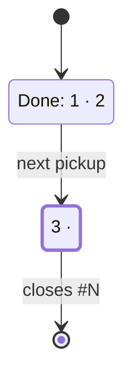

# Issues — the communication grammar for the channel humans actually read

The issue channel is becoming the front door of this project (Eric, 2026-08-21: *"GitHub issues seem
like a system that is bound to become a constraint as more humans engage"*). Every idea, bug and plan
now lands there — and **each one is read by two audiences at once**: a human deciding whether to care,
and a zero-context AI session about to build it. This page is the grammar that serves both.

Sibling docs: [`PICTURES.md`](PICTURES.md) (the picture grammar, shared verbatim),
[`ENGINEERING.md`](ENGINEERING.md) → *Change communication* (the same rules for commits and PRs).
Machine-checked by `node scripts/issue-lint.mjs`. The drill that files one: `/issue`.

## The measurement that started this

`node scripts/issue-lint.mjs --audit` reports it live. Baseline, 71 issues, 2026-08-21:

| Surface | fold (`<details>`) | picture | table | headings |
|---|---|---|---|---|
| **Issues** | **1%** (1/71) | **0%** (0/71) | 5% | 19% |
| PRs, last 60 (templated + gated) | **100%** | 26% | — | — |

Of the 21 **human-facing** issues (the `[event-research]` lane is machine-to-machine and exempt),
**14 fail the contract below** — almost all for the same reason: no fold.
The eight longest issues (#466 at 6,722 chars, #467 at 6,787) are **100% above the fold**: no
summary, no picture, no fold — the exact wall Eric named. This is not an authoring-discipline
problem. The PR surface got a template, a guide and a gate; the issue surface got none of the three,
and the numbers track that difference and nothing else.

## Why this shape (the research, not our opinion)

- **People scan; they do not read.** NN/g eye-tracking: users read **20–28% of the words** on a page,
  in an F-pattern — first line most thoroughly, then left edges. A 6,000-char issue is not read
  slowly, it is *skipped*. → the one-line ask, the bold left edge, the fold.
- **The first line is the whole summary.** Google's CL-description rule: line one is a short,
  complete, **imperative** sentence; the body carries the why, the context and the shortcomings.
  Their named anti-patterns — *"Fix bug"*, *"Phase 1"* — are issue-title anti-patterns too.
- **The information a builder needs most is the information a reporter finds hardest to give.**
  Zimmermann et al. (*Information needs in bug reports*, CSCW 2010; 466 developers across Apache,
  Eclipse, Mozilla) found steps-to-reproduce, stack traces and test cases rank top in usefulness and
  top in difficulty. → we never solve that by asking harder. The `/feedback` coach interrogates for
  those items so the member does not have to know they matter.
- **Structured comment labels remove ambiguity** (Conventional Comments): a `nitpick:` and an
  `issue:` read identically as prose and completely differently as decisions.
- **Plain language wins even for expert readers, above the fold — jargon in parens, not bare**
  (NN/g: plain language isn't "dumbing down," specialists read it faster too; when the audience is
  mixed, lead with the plain term and gloss the jargon in parentheses). **Plain English is the
  default even for a specialist audience, with unavoidable jargon explained inline** (GOV.UK content
  design — the largest production deployment of this practice). → above the fold, a label or symbol
  name never stands alone: `waiting on a decision (needs-eric)`, not a bare `needs-eric`.

**The synthesis that makes it free:** `<details>` collapses for humans while staying fully present in
the raw markdown an AI session reads. The fold costs the machine audience *nothing* and saves the
human audience *everything* — there is no trade-off to manage, only a habit to install.

## The capsule — the house shape

Copy-paste skeleton. Everything above the fold fits one phone screen; everything else lives below it.

```markdown
**One-line ask, imperative, ≤120 chars — what changes and for whom.**

| | |
|---|---|
| **Status** | proposed · waiting on a decision (needs-eric) |
| **Surface** | Moneypenny's rail (filings listed at `/app/accounts?section=feedback`) |
| **Size** | ~2 PRs |

- Talking point — the change, in outcome terms (≤120 chars).
- Talking point — why it matters / what is better after.

> [!IMPORTANT]
> **Needs from you** — present only when the `needs-eric` label applies; every other issue omits
> this block entirely.
> 1. The decision, as a closed question or a named choice — the one-clause why, trailing.

<details><summary><strong>The brief</strong> — current state, criteria, constraints, forks</summary>

### Where it stands today
### Acceptance criteria (EARS)
### Constraints & non-goals
### Settled forks (decision log)
### Open questions
### Slicing sketch

State block: the first comment, edited in place (plan issues only).

</details>
```

Rules that make it work, in priority order:

1. **Lead with the ask, never with provenance.** "Eric's direction, refined in session…" is a
   below-the-fold sentence. The first line is what changes.
2. **Talking points, not paragraphs.** 2–4 bullets, ≤120 chars each. If a bullet needs a comma-spliced
   second clause, it belongs below the fold.
3. **Tabulate any repeated key→value data.** Status/surface/size, symbol→verdict, option→trade-off,
   step→owner. A table is scanned; the same content as prose is skipped.
4. **Plain word first, jargon glossed in parens, never bare, above the fold.** A member reading
   this repo's own labels has no reason to know what `needs-eric` means; `waiting on a decision
   (needs-eric)` costs four words and loses nothing a script parses. This applies to the metadata
   table and talking points only — everything inside the fold is written for Eric and a build
   session and can use house vocabulary freely (NN/g + GOV.UK content design; see above).
5. **One fold, not five.** Nested or scattered `<details>` reads as a filing cabinet. One brief.
6. **The picture is ideal wherever one exists** — see below.
7. **A `needs-eric` decision lives in exactly one place: the `Needs from you` callout, above the
   fold, never inside "Open questions."** That section (below the fold) is for `needs-info` asks to
   a member or open build forks — questions nobody is blocked on. Mixing the two is how a decision
   Eric alone can make ends up 3/4 of the way down an accordion, which is the defect this rule
   exists to prevent (Eric, 2026-08-30: issues bury the action-required item behind a fold instead
   of surfacing it below the context). The rule holds **after filing too**: the label usually
   lands later, from another lane, so `issues.mjs update --add needs-eric` refuses a body with no
   callout, and the board keeps such an issue out of Blocked until the callout exists
   (`scripts/moneypenny/decision-callout.mjs`, #3913). Eric's own issues are exempt.
8. **One decision, one line, no paragraph.** Each `Needs from you` item is numbered, phrased as a
   closed question or a named choice ("A or B?", "approve deleting `X`?"), with the reason trailing
   after an em dash — same anatomy as the procedure steps CLAUDE.md's secretary section already
   uses (`<the do> — <the why>`). A reader should get the ask from the first four words alone.
9. **A multi-slice plan's Slicing sketch names which slice closes it.** #928 and #885 both shipped
   their final slice without a `Closes #N`, so GitHub never auto-closed them and the issue sat open
   describing already-superseded state (found in the 2026-08-30 `/work-issues` pass). Mark the
   closing slice in the sketch (`"slice 3 closes this"`), and that slice's PR body carries `Closes
   #N` — `scripts/plan-closure-scan.mjs` flags a merged branch that referenced the issue without one.
10. **A plan for a member-facing page carries an `At 390, in order:` line under Constraints** — the
   ranked list of what the page shows first at phone width (`At 390, in order: balance · open
   positions · the trade button`). The PR's first phone screenshot is checked against it
   (CLAUDE.md → "Mobile-first on every information surface": the ranking is the product).

### An optional block: capturing a raw idea before it's a plan

Sometimes an idea needs filing before anyone has argued with it — no candidate mechanism yet, nothing
settled, not ready for `/journey` (which needs an actual claim → challenge → resolution exchange to
bank, not a one-way brainstorm). For that case, add a **"Raw idea (verbatim)"** subsection inside the
fold, first, before "Where it stands today": quote the originating message(s) completely unedited —
typos, fragments, trailing thoughts and all, the same discipline `/journey`'s rule 2 uses for exactly
this reason. Mark the issue `Status: draft` in the metadata table so `/work-issues` and Moneypenny
both skip it until a human flips it, per `.claude/skills/work-issues/SKILL.md`'s existing
draft-marker convention.
Worked example: #1977.

### Delegating a tangent to a planning session (#3818 slice 1)

A tangent thought that deserves its own planning session — not a two-line question, not ready for
`/issue` yet — moves out of the live session into a fresh one, so rapid-fire ideas never conflate
context. The planning session's job is narrow: interrogate the tangent, write the capsule, land it
in exactly one of three states (below). It never builds.

**From a non-plan session**, hand it off with `create_session`:

```
create_session({
  source_url: "https://github.com/ejclark/skynet-capital",
  source_revision: "<current main sha>",       // e.g. ecbd3bf901e522756cedeada8863ae499e957be0 —
                                                 // always the sha at hand-off time, never pinned
  permission_mode: "auto",                      // explicit — a plan-mode parent cannot do this; see below
  model: "opus",                                 // docs/COMPUTE.md floor table: "complex / ambiguous
                                                   // / judgment (review, research-to-brief)" → opus, high
  tags: ["planning-session", "tangent-offload"],
  title: "<the tangent, in a few words>",
  append_system_prompt:
    "You are a planning session, not a build session. You may read code and research, but you " +
    "MUST NOT call create_session, spawn_task, or write/edit any file outside filing one GitHub " +
    "issue. Your only deliverable is that issue, landed in exactly one of: ready, needs-eric with " +
    "one Needs-from-you line, or parked in docs/IDEAS.md. Do not build.",
  prompt:
    "Eric's raw words, verbatim:\n\n<quote them exactly>\n\n" +
    "Up to 10 lines of surrounding thread context, if any.\n\n" +
    "File this as a plan or feedback issue per docs/ISSUES.md, with a Raw idea (verbatim) section " +
    "quoting the words above. When you finish, confirm which of the three end states the issue is in.",
})
```

**From a plan-mode session**, `create_session` would hand the child MORE permission than the
parent has — the tool refuses this, by design. Use `spawn_task` instead: it queues a suggested-task
card in Eric's app that starts, with the same prompt above, only when he clicks it.

**The as-of sha matters** (criterion 8a): a planning session's "Where it stands today" is only as
fresh as the commit it read at. Recording the hand-off sha lets a later session re-read what
changed since, instead of trusting a capsule that may have rotted.

**Done when the issue lands in exactly one state** — never left mid-air:
1. **Ready** — a `plan` or `feedback` issue, buildable now, no open fork.
2. **`needs-eric`** — a genuine decision only he can make, with one `Needs from you` line.
3. **Parked** — logged in `docs/IDEAS.md` with its `(src: … · while: …)` tag, no issue filed.

Never a fourth state (an issue with no label, no decision, just sitting) — that is the failure this
delegation exists to prevent (#3811, the first ad-hoc child, ended with none of the three).

## Pictures in issues (Eric, 2026-08-21: *"pictures are also ideal"*)

Same decision table, same honesty rules, same waiver right as [`PICTURES.md`](PICTURES.md) — read it
once; this section is only what differs for issues.

| Issue type | The picture that earns its place |
|---|---|
| Bug on a visual surface | the member's screenshot / clip — already the highest-value field on the form |
| Plan or multi-slice story | `flowchart` of the slices and what unlocks what — this PR's edges thick |
| A plan's lifecycle (a gate, a mode, a rung) | `stateDiagram-v2` — each guarded transition is one EARS line |
| New route or request path | `sequenceDiagram` |
| Gate, mode, or lifecycle change | `stateDiagram-v2` |
| A proposed, not-yet-built diagram | any of the above with `config: { look: handDrawn }` — the sketch register — captioned as proposed |

Two issue-specific cautions:

- **A proposed picture is a claim about the future**, so caption it as one: `_Caption — proposed
  end-state flow, not yet built._` PICTURES.md's grounding rule (every node names something real)
  applies to the *shipped* frame; an issue's diagram is allowed to draw the target, never allowed to
  imply it exists.
- **Screenshots on issues authored directly on GitHub are hosted by GitHub** (drag-drop →
  `user-images.githubusercontent.com`), not committed to `docs/shots/`. The ≤100KB rule is a
  git-history rule and does not apply; the SHA-pinning rule does apply to any raw repo URL you
  paste.
- **`/feedback`-filed issues are the one exception**: that form has no GitHub session to drag-drop
  into, so an attached screenshot is committed to a dedicated `feedback-assets` branch (never
  `main` — that would fire the deploy pipeline) and linked as a SHA-pinned
  `raw.githubusercontent.com` URL, same mechanics as a PR screenshot (src/server/feedback-images.ts).

## Readiness — what committed work carries when it goes `ready` (#4056)

A fresh build session cannot ask a question mid-run, so whatever the issue leaves open gets
guessed. #4056's predictive study scored 158 built issues on what they carried at handoff against a
clean first-pass delivery (no follow-up fix, reopen or stall). Two things tracked clean delivery,
and format did not:

| At handoff | Clean with | Clean without |
|---|---|---|
| one delivery unit: declared ≤3 PRs | 84% (76/90) | 68% (17/25) at ≥4 |
| lint-clean / mermaid / fold | 79% / 78% / 78% | 75% / 79% / 79% |

So a `plan` or `ready` issue gets **readiness notes** from `issue-lint` (and so from
`npm run issues -- create`), and `npm run ready:report` prints them across the whole ready queue.
They are advice, never a gate:

- **ready while parked**: `ready` plus any of needs-eric, needs-info, needs-design, hold-merge
  (`PARKING_LABELS` in `scripts/moneypenny/labels.mjs`). No lane should build it. Say which label is
  stale; don't auto-fix it, because some flips are Eric's own. Ready + `next-slice` is legal and
  means "in progress, a remainder pending".
- **past one delivery unit**: a Size cell declaring more than 3 PRs (or slices). Split the slices
  into sub-issues that each fit one. Lead every Size cell with `~N PRs` so it can be read at all.
- **a decision-shaped title with no `Done when`**: *Decide / Investigate / Rethink…* work needs the
  recorded decision that ends it, or its remainder idles after the first PR.
- **a protected path with no route**: a named `.github/`, `.claude/` or envelope path with no
  platter or held-PR step. The lane stops there mid-build otherwise.
- **a build plan with no WHEN/IF … SHALL**, and **a plan with no as-of sha** (#3818 criterion 8a).

The rubric retires itself if it doesn't earn its place: #4056's call sheet says to drop everything
except the parked check if flagged and unflagged items deliver within 5pp of each other by 2026-10-31.

## What is gated, what is taste

Existence and honesty are machine-checked; taste never is (repo doctrine — a comment-only format rule
decayed to 4/126 PR bodies, every gated one held).

| Check | Rule | Why |
|---|---|---|
| fold | body >1,200 chars must carry a `<details>` | the wall, measured |
| above-fold budget | ≤1,200 chars before the first fold | ~one phone screen |
| bullets | ≤120 chars each | matches `ship.sh checkbody` |
| duplicate blocks | no paragraph repeated verbatim | #455 shipped its whole body twice |
| mermaid | every block parses under GitHub's own Mermaid (`scripts/mermaid-lint.mjs`) | a syntax error renders as the opening frame |
| `needs-eric` decision | labelled `needs-eric` ⇒ a `Needs from you` callout above the fold, ≥1 numbered item | the label promises a decision; the callout is where it has to live |
| raw URLs | SHA-pinned | branch URLs 404 at squash-merge |
| title | imperative, ≤80 chars, not `Fix bug`-class | Google's rule, their anti-patterns |

**Who this binds: Claude.** Every issue Claude files — plans, handoffs, fan-outs, capsules — passes
`issue-lint` before it is filed. **Who it never binds: members.** A human's raw note is never
rejected for shape; the coach and the templates do that work on their behalf. Taxing the reporter is
the one move Zimmermann's finding rules out.

**Rule 4 (plain word first) is taste, not gated — sentence quality can't be machine-checked.** The
`linguist` agent is the tool for it: before filing a `needs-eric` issue, or opening a PR carrying a
`Needs from you` callout, it can review the above-the-fold text as a first-time reader would and flag
anything that requires already knowing this repo to parse. Occasional, requested work — not a standing
gate, and never run on a member's own words.

**One cheap, free, always-on signal does run automatically, and it's an advisory note, not a
gate: an approximate Flesch-Kincaid grade level on the above-the-fold text** (`scripts/
readability.mjs`; Eric, 2026-08-30, on integrating NLP research into the process). It fires only
past a generous floor (college-graduate level) specifically so this repo's necessarily precise
vocabulary — EARS criteria, financial terms, a label name — doesn't trip it on an ordinary capsule.
The research behind that caution: no readability formula is universally valid, one calibrated on
general prose scores worse on technical text, which is exactly this repo's content. Treat a hit as
"maybe worth a `linguist` pass," never as a defect — same non-blocking doctrine as every other note
in this section.

## The state block — a plan issue's context store (#3765)

A plan issue is where distributed tasks report *into* and where the next task picks *up from*. Left
to accumulate, that is a body plus N free-form comments, and the pickup session reads all of them
or guesses (#3748 after one day: seven comments). So every plan issue carries **one state block**,
posted as its first comment right after filing, **edited in place** by every report-in, read
**before anything else** by whoever picks the plan up. The medium is the `stateDiagram-v2` the
pictures table already names for a lifecycle: a diagram with its current state marked is a state
store a human reads in ten seconds and a session reads as text. The same object serves the async
pair (a human+AI pair and an AI+human pair working the same issue at different hours): both edit
the text, and the diff is the message.

**Split by position: the top is Eric's, the bottom is the builder's** (Eric, 2026-09-26: "the latest
plans seem to have a TON of implementation details that drowns out a lot of the updates"). A fold
would be the obvious split, and it is the one move the block cannot make (the last paragraph of this
section says why), so position does the work instead: the top is the picture, what changed since the
last edit, and the next pickup, in at most three plain lines with no paths, function names or
commands; then the rules line and the Log; then a **For the builder** heading carrying the inputs,
the EARS done line and the falsifier. A human stops reading at the Log; a session reads to the end.

````markdown
## State block — read this first, then pick up



**What changed:** <one plain line: what moved since the last edit, and what it means>.
**Next pickup: slice 3, <what it builds, in plain words>. One PR.**

**Rules for this block:** edit in place; one dated line in the Log per report-in; no new status comments.

**Log**
- <date> · <one line: what landed, PR numbers>

### For the builder

Inputs: <repo-qualified paths>. Research inside the slice: <what to read, named as such>.
Done when: WHEN <trigger>, the <system> SHALL <response>.
Falsifier: <the dated observation>.
````

Four rules, each the answer to a question the first pickup test asked (#3765, 2026-09-26, a fresh
agent handed only #3748's block took the right slice but asked two things the thread already held).
They all still hold; the PR granularity stays in the pickup line, and the other three now live under
**For the builder**:

| Rule | The question it answers |
|---|---|
| The pickup names its **PR granularity** ("one PR", "one PR each") | "is this one PR or two?" |
| The pickup carries a **done line** in EARS, not only the falsifier | "what does done look like?" |
| Every path is **repo-qualified** (`scripts/moneypenny/labels.mjs`, never `labels.mjs`) | "I could not locate the file" |
| **Research inside the slice is named as such** ("read the pinned package, do not guess") | a legitimate unknown, so the block says where its answer lives |

What the block never holds: a decision only Eric can make (rule 7: the `Needs from you` callout,
above the fold) and a `<details>` fold (the MCP issue read sanitizes markup; a fence and a list
survive). `issue-lint` notes a `plan`-labelled body that does not point at its block, and, run on the
block itself, notes a top half (between the diagram and the Log, the rules line aside) that runs
past three prose lines or carries more than two inline code spans; both notes are advisory, never a
gate. The lanes that pick plans up (`.github/prompts/plan-build.md`, `.github/prompts/feedback-build.md`,
`/work-issues`) read the block first and edit it on finish (slice 3 of #3765).

## Comments — the surface that outnumbers issues 10:1

An issue's body is written once; its comments accumulate forever, and they are what a human actually
returns to.

- **Progress comments** (build sessions): one status line, then the delta. `**Slice 1/5 — shipped.**
  Owner link + flag removal merged in #472. Next: `/join` queue.` Logs, command output and diffs go
  in a fold or are omitted — the PR is the record.
- **On a plan issue, progress is an edit to the state block plus one dated log line under it, never
  a new status comment** (the section above). The block is what the next task reads; a thread of
  status comments is what it would otherwise have to read instead.
- **Review-style comments** carry a Conventional-Comments label so intent is unambiguous:
  `praise:` · `nitpick:` · `suggestion:` · `issue:` · `question:` · `thought:` · `chore:`, with
  `(blocking)` / `(non-blocking)` / `(if-minor)` when it changes what the reader must do.
- **Answering Eric's question is a comment, not a rewrite.** Editing the body under him destroys the
  thread's history; the body is the capsule, the comments are the conversation.
- **One decision per comment.** A comment asking three things gets one answer.
