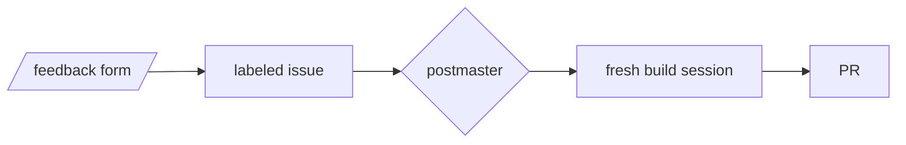
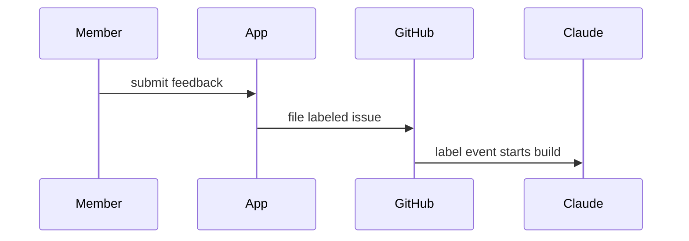
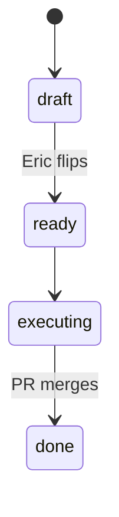

# Pictures — the visual vocabulary for PRs, reports, and journeys

The fridge rule (Eric, 2026-08-20: *"dumb this shit down and draw more pictures"*): every PR and
report-out opens with something judgeable **by eye in ~10 seconds**. This page is the grammar —
which picture fits which change, the mechanics that keep pictures alive, and the honesty rules
that make fast review safe. The PR template points here so its own comments stay short; the
structure is machine-checked by `scripts/ship.sh checkbody`.

Provenance: the 2026-08-20 hat-team communication research (white/red/yellow/blue/black-hat pass
over every feedback surface). Owner: the secretary skill (template codification). The load-bearing
finding, one line: **format compliance tracks enforcement + distribution, never willingness** — so
this guide teaches, the template reminds, and the ship gate enforces existence; taste is never gated.

## The decision table — change type → picture

| Change type | Picture | Why it wins |
|---|---|---|
| UI change | before/after screenshots, 2-col table of `` | the one grammar judged in <10s |
| Single new screen | one `` | uncapped 2× shots dominate the fold |
| Dataflow / pipeline | ```` ```mermaid ```` `flowchart LR` | reads like a sentence |
| New route / request path | `sequenceDiagram` | actors + ordered messages ARE the story |
| Lifecycle / gate / mode (`SIM`/`LIVE`) | `stateDiagram-v2` | guarded transitions are the point |
| Schema / data model | `erDiagram` (or `classDiagram`) | relationship deltas seen, not read |
| Config / constants | table: key · before · after · why | scannable left edge (the gate counts a GFM table as media — 2026-08-22) |
| Risk / irreversible touch | `> [!WARNING]` top-level | pre-attentive; see the caution budget |
| Trivial (typo/chore/pure docs) | `Picture: waived — <reason>` | an honest skip beats a decorative diagram |

The waiver is a first-class move, not a loophole: a 3-node flowchart on a typo fix burns the
glance it claims to save and trains the reader to skip the slot. Skips stay visible and auditable.

## Mermaid that renders on GitHub — stable types only

GitHub renders Mermaid natively in PR bodies, issues, and `.md` files. Templates and this guide
prescribe **stable types only** — `flowchart` (/`graph`), `sequenceDiagram`, `stateDiagram-v2`,
`erDiagram`, `classDiagram`, `pie`, `gantt`, `timeline`. Beta types (`xychart-beta`, `block-beta`,
`architecture-beta`…) are permitted ad hoc but never prescribed: GitHub's deployed Mermaid version
lags releases, and a syntax error renders as the PR's *opening frame*. Never use the `journey`
type for reasoning journeys — it's a UX-satisfaction chart, the wrong shape entirely.

Copy-paste starters (all field-verified shapes):

````markdown

````

````markdown

````

````markdown

````

**The legibility budget:** ≤15 nodes; plain words, not paths (`login canvas`, never
`src/three/pieces/eye-shader.ts`); no SHAs, env vars, or CLI flags in labels; quote labels
containing special characters. The real reading condition is a phone at 390px.

**Dark mode:** the default is NO `%%{init}%%` block and no `style`/`classDef` statements — GitHub
auto-themes both modes for free. Brand-styled mermaid is allowed only via a contrast-verified
snippet checked in here, never improvised per-PR (hand-picked hex that looks right in one theme
breaks in the other — that exact drift already shipped once).

## Screenshots — mechanics that keep pictures alive

- **≤100KB JPEG**, committed under `docs/shots/pr-<n>/` (the ship gate fails anything larger —
  screenshot weight is permanent git history, the one irreversible cost here).
- **SHA-pinned raw URL only:** `https://raw.githubusercontent.com/<owner>/<repo>/<40-hex-sha>/docs/shots/...`.
  `scripts/ship.sh open` pins this automatically from `HEAD`. Never hand-write a branch-name URL —
  the branch deletes at squash-merge and the picture 404s from the permanent record within a day
  (empirical: PR #446's screenshots, the flagship fridge PR, were dead by 2026-08-20).
- **One representative frame per changed surface**; prefer a before/after composite (one file)
  over a gallery. Side-by-side via a 2-column GFM table of ``.
- The shoot scripts (`npm run shoot:login`, `scripts/shoot-*.mjs`) carry the JPEG quality ceiling —
  fix size problems there, not by hand-recompressing.

**The fold is not guaranteed to survive even through `ship.sh`/REST — always re-fetch and check.**
The GitHub **MCP** write tools strip `<details>`/`<summary>` outright while leaving `` and
tables intact, and still report success (`LESSONS.md`, 2026-08-25) — ship through `/ship`, not
those, as the first line of defense. But `LESSONS.md` (2026-08-26) found the fold ALSO stripped
twice through `ship.sh`'s own plain REST path, on a real full-size PR body — the trigger isn't
characterized (a short isolated test body kept its fold; the real PR body didn't, both times), so
"REST preserves it" is necessary but not proven sufficient. `ship.sh checkbody` cannot catch either
case: it lints the body *file*, not what GitHub stored. After ANY automated body write, re-fetch and
check for the literal `<details>` tag; if it's gone, flatten to plain sections rather than retrying
the same call.

**A screenshot embed can vanish even through `ship.sh` — a session-side content-safety layer, not a
repo bug.** Confirmed 2026-08-26: `` and even a plain `[text](url)` pointing at anything
that reads as a media file gets neutralized in flight — the `!` sometimes dropped, the URL wrapped in
backticks — for BOTH `raw.githubusercontent.com` and `github.com/.../blob/...` hosts, verified via
direct REST probes (a bare-text mention of the same URL, no markdown link syntax, survives
untouched). This is outside repo control — don't try to out-clever it (URL tricks, alternate syntax).
When an embed comes back mangled after a re-fetch: use the waiver line instead
(`Picture: waived — <reason>`), name the committed `docs/shots/...` path in prose so a reader can
open it from the PR's own Files-changed tab (a native diff render, unaffected by this), and send the
image directly to the user in-session (`SendUserFile`) so the fridge rule is still met live, even
though the PR body itself can't carry it.

## Alerts — the caution budget

GitHub renders `> [!NOTE]` `> [!TIP]` `> [!IMPORTANT]` `> [!WARNING]` `> [!CAUTION]` as colored
callouts. They break when indented or nested inside `<details>` — always top-level. Budget: **one
per PR**, and `WARNING`/`CAUTION` are *reserved* for the irreversible class (workflow files,
credentials, spend, outward-facing). On a carve-out PR the WARNING comes **before** any
accomplishment framing — blast radius first is the honest inversion of fanfare-first.

## The honesty rules — what no gate can replace

The repo's hard invariant — *never let a flourish imply something false* — applied to pictures:

1. **Grounding:** every node, edge, and label names a real file, route, event, or behavior present
   in this diff. A diagram is a claim; an ungrounded diagram is a lie with good kerning.
2. **No verdicts:** the picture states *what changed*, never how good it is. Judgment belongs to
   the reader (and the telestrator).
3. **Provenance in the caption:** every picture carries a one-line plain-language caption naming
   what it shows and where it came from — e.g. `_Caption — before/after of /login, from npm run
   shoot:login output_`. The caption is also the degradation story — it's the only element that
   survives email, mobile notifications, and raw-text renderers.
4. **Proportionality:** gold-standard treatment on a 5-line config change implies something false
   about the diff. Match picture weight to change weight — or waive.

## Where else this grammar applies

- **Digests** (`docs/digests/`): a picture slot ratchets in only after the digest loop itself is
  proven live — never decorate a dead instrument.
- **Journeys** (`docs/JOURNEYS/`): pictures are *offered, never required* — the open-forks map and
  spine scoreboard snippets live in `docs/JOURNEYS/TEMPLATE.md`. A journey that fires beats a
  journey that's pretty.
- **Plans / handoffs / issues:** same decision table, same honesty rules, same waiver right — plus
  the issue-specific rules (a proposed diagram is captioned as proposed; GitHub hosts issue
  screenshots, so the ≤100KB git-history rule does not apply) in [`ISSUES.md`](ISSUES.md).
- **Research** (`docs/research/`, `docs/research/events/`): the fridge rule reaches here too, and
  arrived last (2026-08-25 — Eric: *"the researched events present walls of text that are difficult
  to read"*). A research document's picture slot is its **decision header**: the TL;DR plus the
  five-column call sheet — call · confidence · why · dated falsifier — which the `hasPicture` rule
  already counts as media, because a table is scanned where the same content as prose is skipped.
  A mermaid map earns its place when the argument is a *structure* (a constraint chain, a reaction
  function); [`research/ai-hardware-constraints-aug-2026.md`](research/ai-hardware-constraints-aug-2026.md)
  is the worked example. Everything downstream of
  the decision — method, instrument runs, the append-only assessment ledger — is **folded by the
  renderer**, not by the author: `/research` collapses those sections automatically, so a document
  nobody rewrote still opens on its call. Gated by `npm run research:lint`; contract in
  [`process/EVENT-RESEARCH.md`](process/EVENT-RESEARCH.md).
