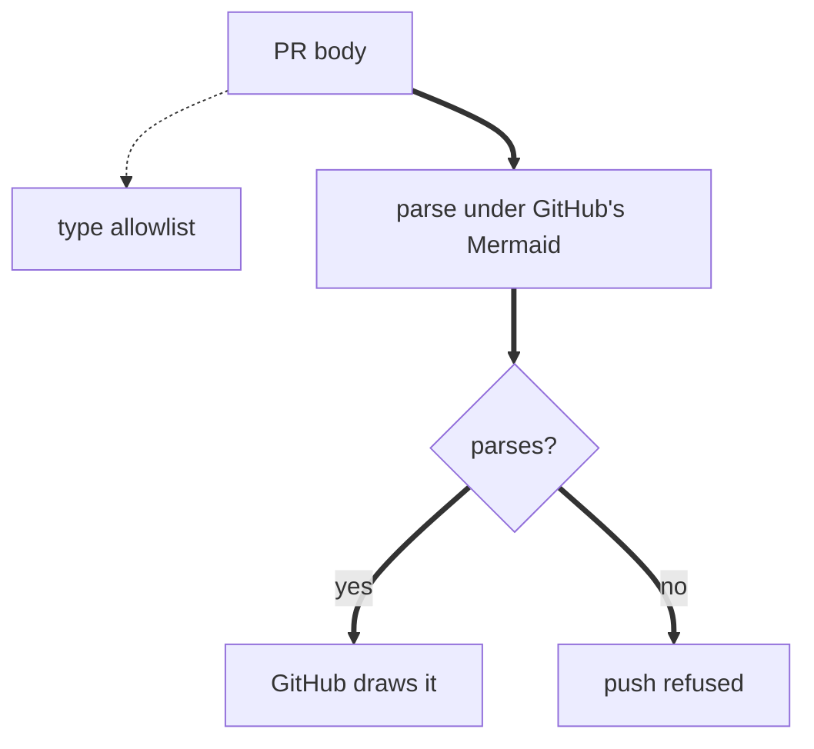
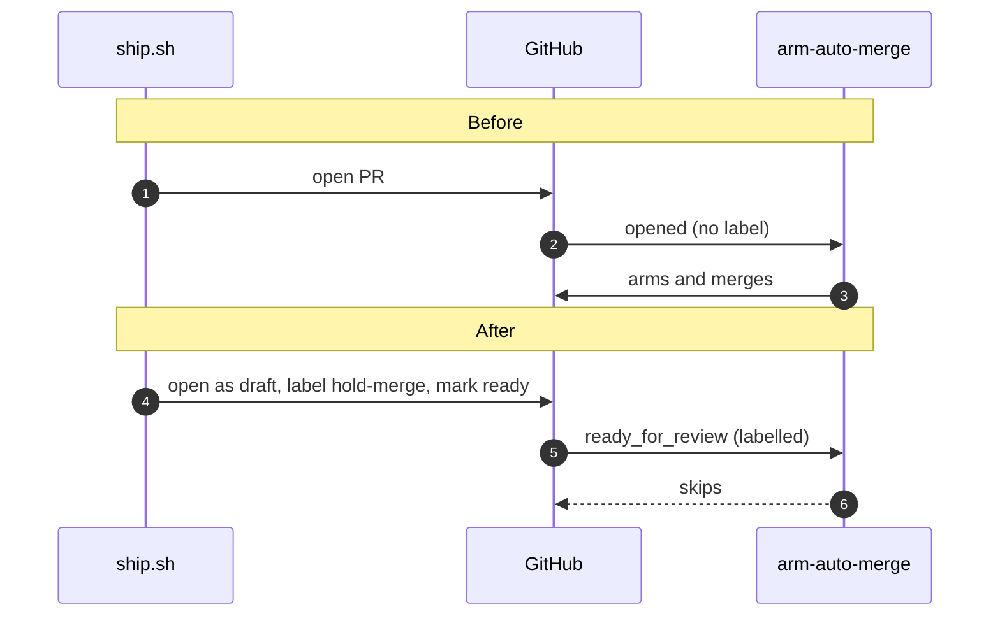
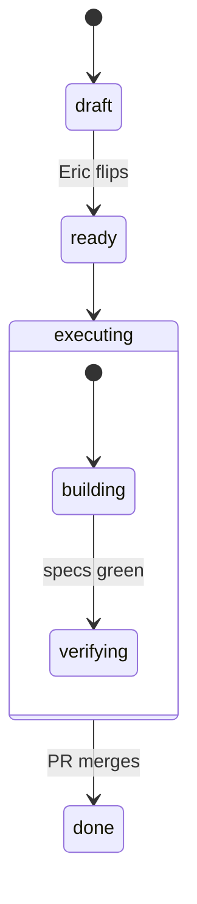
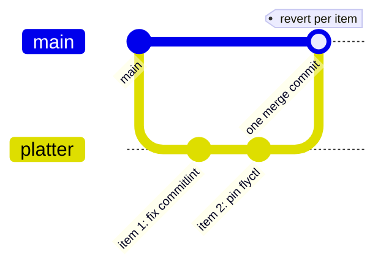
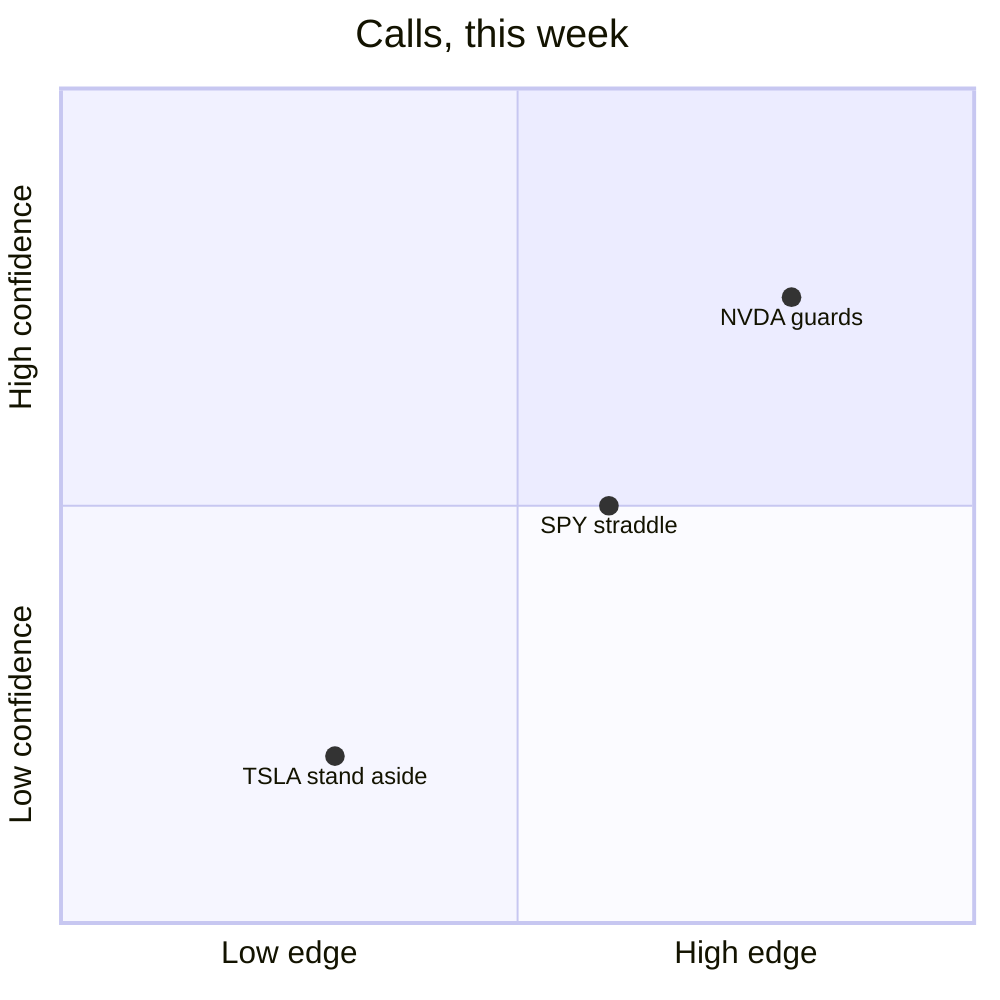
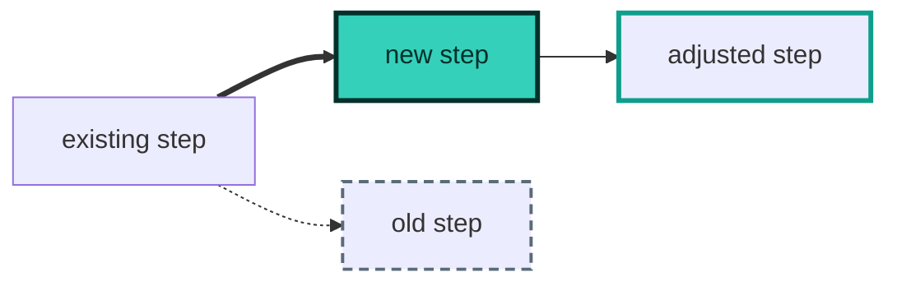

# Pictures — the visual vocabulary for PRs, reports, and journeys

The fridge rule (Eric, 2026-08-20: *"dumb this shit down and draw more pictures"*): every PR and
report-out opens with something judgeable **by eye in ~10 seconds**. This page is the grammar —
which picture fits which change, the mechanics that keep pictures alive, and the honesty rules
that make fast review safe. The PR template points here so its own comments stay short; the
structure is machine-checked by `scripts/ship.sh checkbody`.

Provenance: the 2026-08-20 hat-team communication research (white/red/yellow/blue/black-hat pass
over every feedback surface). Owner: the secretary skill (template codification). The load-bearing
finding, one line: **format compliance tracks enforcement + distribution, never willingness** — so
this guide teaches, the template reminds, and the ship gate enforces existence; taste is never gated.

## The decision table — the story → the picture

Pick by what the picture must *show*, never by habit: a 40-PR census (2026-09-25) found 8 of 11
diagrams were one fan-in/fan-out flowchart whatever the change was — the named anti-pattern is
**one shape for every change** (`PATTERNS.md`). The best frames in that sample made the *causal
argument*: a sequence with Before/After halves (#3737), a flowchart with decision diamonds and
labelled before/after branches (#3710). Each row names the one feature that makes the type read;
the starters below are validated by `npm run mermaid:lint` and the `/mermaid` skill carries the
full card per type.

| The picture must show… | Picture | The feature that makes it read |
|---|---|---|
| A UI change | before/after screenshots, 2-col table of `` | the one grammar judged in <10s |
| A single new screen | one `` | uncapped 2× shots dominate the fold |
| A behaviour before vs after | `sequenceDiagram` | two `Note over` halves, *Before* / *After*; `autonumber` |
| A new route / request path | `sequenceDiagram` | `alt`/`else` for the error branch; ≤4 participants |
| A lifecycle, gate or mode (`SIM`/`LIVE`, draft→ready→done) | `stateDiagram-v2` | a composite state + guard labels on transitions |
| Branch / merge mechanics (platter, backport, worktrees) | `gitGraph` | one branch per item, `tag:` per step |
| A dataflow, pipeline or decision path | `flowchart` (`TD` past ~6 nodes) | the delta grammar: `==>` new, `-.->` removed, a diamond per fork |
| A number moving over time (a budget ratchet, latency, counts) | `xychart-beta` | bar + line on one axis, the series named in the title |
| A call sheet or triage (confidence × impact, borrow/adapt/skip) | `quadrantChart` | ≤6 points; never P&L implied (`BRAND.md`) |
| A retro or incident | `timeline` (+ `ishikawa-beta` for the cause) | sections Detect / Respond / Learn; no `:` in periods |
| A brain-dump or the scope of a study | `mindmap` | three branches, one level of leaves |
| A backlog snapshot (a digest) | `kanban` | generated from labels, never hand-kept |
| The system, its containers, its components | `C4Context` → `C4Container` → `C4Component` | boundaries; `Rel` labels carry the technology |
| A schema or a type change | `erDiagram` / `classDiagram` | cardinality glyphs; before/after namespaces |
| A module split (decompose) | `treeView-beta` or `classDiagram` | the tree the PR adds or moves |
| Requirements ↔ specs ↔ PRs | `requirementDiagram` | `satisfies` / `verifies` per EARS line |
| Where tokens, money or requests split | `sankey-beta` | generated from a ledger |
| Layers or regions where position means something | `block-beta` | columns; the region a change touches |
| Config / constants | table: key · before · after · why | scannable left edge (a GFM table counts as media — 2026-08-22) |
| Risk / irreversible touch | `> [!WARNING]` top-level | pre-attentive; see the caution budget |
| Trivial (typo / chore / pure docs) | `Picture: waived — <reason>` | an honest skip beats a decorative diagram |

The waiver is a first-class move, not a loophole: a 3-node flowchart on a typo fix burns the
glance it claims to save and trains the reader to skip the slot. Skips stay visible and auditable.

**The vocabulary card** — the words that turn "make it richer" into a precise request:
*sequence with before/after notes · state diagram · gitGraph · delta flowchart · xychart · quadrant
call sheet · timeline retro · mindmap · kanban snapshot · C4 (context / container / component) ·
hand-drawn look (proposed, not built)*. Each is a row above and a card in `/mermaid`.

**The delta grammar** — how a diagram marks *what changed* for a reader who cannot rely on hue:

| Meaning | Draw it as | Never as |
|---|---|---|
| new in this change | thick edge `==>`, or `subgraph "this PR"` | a green fill |
| removed / the old path | dotted edge `-.->` | a red fill |
| changed | `classDef changed stroke-width:3px` (no colour) | a hue shift |
| a fork | a diamond `{ }` | — |
| a store / a document / a person | `@{ shape: cyl }` / `@{ shape: doc }` / `@{ shape: person }` | — |
| proposed, not built (plan issues) | frontmatter `config: { look: handDrawn }` — the sketch register | — |

## Mermaid that renders on GitHub — any type 11.17.2 draws, and every block is parsed

GitHub renders Mermaid natively in PR bodies, issues and `.md` files — on **Mermaid 11.17.2**
(read from github.com's production renderer bundle, 2026-09-25; upstream is 12.0.0). **The gate is
the parser, not a type list:** `npm run mermaid:lint` parses every ```` ```mermaid ```` block with
that exact pinned version (`scripts/mermaid-lint.mjs`), and `ship.sh checkbody`, `issue:lint` and
the CI corpus scan all run it — so a diagram that passes here draws there, and the fear that
motivated the old "stable types only" rule (a syntax error as the opening frame) is caught before
push. The type menu is therefore everything 11.17.2 draws: `flowchart`, `sequenceDiagram`,
`stateDiagram-v2`, `erDiagram`, `classDiagram`, `gitGraph`, `quadrantChart`, `requirementDiagram`,
`timeline`, `mindmap`, `kanban`, `pie`, `gantt`, and the beta family (`xychart-beta`, `sankey-beta`,
`block-beta`, `architecture-beta`, `radar-beta`, `treemap-beta`, `packet-beta`, `C4Context` and
kin). Pick by the change, per the decision table. Never `usecase-beta` or `agentflow-beta` (12.x
only — GitHub shows an error), never `zenuml` (a plugin), and never the `journey` type for
reasoning journeys — it's a UX-satisfaction chart, the wrong shape entirely; the lint refuses all
four. Known traps the lint catches for you: unquoted parentheses in a label (`A["SPY 450C (weekly)"]`),
a colon inside a `timeline` period (`0931`, not `09:31`), and iconify/Font Awesome icons (GitHub
renders every one as `?` — `architecture-beta` gets only its built-in cloud/database/disk/internet/
server). The GitHub *mobile app* does not render Mermaid at all (open since 2024); a phone browser
does, so the 390px rule below is about the browser.

Copy-paste starters (every one parses under `npm run mermaid:lint`; the `/mermaid` skill carries
the full card per type):

````markdown

````
_The delta flowchart: dotted = the removed path, thick = the new one, a diamond per fork._

````markdown

````
_Before/After halves: the same exchange twice, the fix visible in the second half (#3737)._

````markdown

````
_A lifecycle: the composite state holds the sub-steps; every transition carries its guard._

````markdown

````
_Branch mechanics: a platter boards each item as one squashed commit on one integration branch and
lands with one merge commit, so a bad item still reverts alone (`scripts/ship.sh platter`)._

````markdown

````
_A call sheet as a picture: confidence × edge; never a P/L claim (`BRAND.md`)._

**The legibility budget:** ≤15 nodes; plain words, not paths (`login canvas`, never
`src/three/pieces/eye-shader.ts`); no SHAs, env vars, or CLI flags in labels; quote labels
containing special characters. The real reading condition is a phone at 390px.

**Dark mode:** the default is NO `theme`, no `themeVariables`, no hex — GitHub picks light or dark
from the page, and a pinned theme freezes one of them (the lint fails `theme:` in frontmatter and
in `%%{init}%%`, which is deprecated upstream anyway). Emphasis that survives both modes and a
colourblind reader is *achromatic*: a thick edge (`==>`) for what is new, a dotted one (`-.->`) for
what is removed, a `subgraph "this PR"`, a diamond for a fork, `@{ shape: cyl }` for a store — never
a colour alone (`BRAND.md` → *Accessibility*). Brand-styled mermaid is allowed only via a
contrast-verified snippet checked in here, never improvised per-PR (hand-picked hex that looks
right in one theme breaks in the other — that exact drift already shipped once).

**The one sanctioned colour snippet** (promised here on 2026-08-20, checked in 2026-09-25 — verified
by `tests/ui/mermaid-classdef.spec.ts` against both of GitHub's canvases with the same formula the
app's tokens pass): the fill and the text are fixed together, so their 7.4:1 never depends on the
theme; the 3px stroke carries the boundary in light mode and the fill carries it in dark; `removed`
and `changed` live in the stroke alone. Copy it whole; never pick a hex in flight.



The colours are `BRAND.md` tokens — `--accent` and `--accent-contrast` for *new* (teal is the
machine/system signal), `--muted` (light) for *removed*, `--accent` (light) for *changed* — never
`--pos`/`--neg`, which mean profit and loss and nothing else.


## Screenshots — mechanics that keep pictures alive

- **≤100KB JPEG**, committed under `docs/shots/pr-<n>/` (the ship gate fails anything larger —
  screenshot weight is permanent git history, the one irreversible cost here).
- **SHA-pinned raw URL only:** `https://raw.githubusercontent.com/<owner>/<repo>/<40-hex-sha>/docs/shots/...`.
  `scripts/ship.sh open` pins this automatically from `HEAD`. Never hand-write a branch-name URL —
  the branch deletes at squash-merge and the picture 404s from the permanent record within a day
  (empirical: PR #446's screenshots, the flagship fridge PR, were dead by 2026-08-20).
- **One representative frame per changed surface**; prefer a before/after composite (one file)
  over a gallery. Side-by-side via a 2-column GFM table of ``.
- **Trading surfaces shoot the phone frame first** (the ticket, the options chain, the milestone
  strip — CLAUDE.md → *Mobile-first on the trading surfaces*, Eric 2026-09-05): pass
  `viewport: { width: 390, height: 844 }` to the harness for the first frame and the default
  desktop viewport for the second. The phone frame is the one that proves the curation; the
  desktop frame proves it expanded instead of floating.
- The shoot scripts live in [`scripts/shoot/`](../scripts/shoot/) — one per surface (`npm run
  shoot:login`, `shoot:feedback`, `shoot:onboarding`, …), each just fixtures and frames over the
  shared harness in `scripts/shoot/lib.mjs` + `shell.mjs`. The harness carries the JPEG quality
  ceiling, so fix size problems there, not by hand-recompressing.
- **A new `/app/*` surface needs a script, not a waiver.** Copy the shortest existing one
  (`scripts/shoot/feedback.mjs`, ~50 lines), swap the stubs and the frames, add its `shoot:<name>`
  npm script. #1308 and #1312 both shipped with "Picture: waived" because no script existed for the
  surface they changed — that is the cost this harness was built to remove (#1327).

**The fold is not guaranteed to survive even through `ship.sh`/REST — always re-fetch and check.**
The GitHub **MCP** write tools strip `<details>`/`<summary>` outright while leaving `` and
tables intact, and still report success (`LESSONS.md`, 2026-08-25) — ship through `/ship`, not
those, as the first line of defense. But `LESSONS.md` (2026-08-26) found the fold ALSO stripped
twice through `ship.sh`'s own plain REST path, on a real full-size PR body — the trigger isn't
characterized (a short isolated test body kept its fold; the real PR body didn't, both times), so
"REST preserves it" is necessary but not proven sufficient. `ship.sh checkbody` cannot catch either
case: it lints the body *file*, not what GitHub stored. After ANY automated body write, re-fetch and
check for the literal `<details>` tag; if it's gone, flatten to plain sections rather than retrying
the same call.

**A screenshot embed can vanish even through `ship.sh` — a session-side content-safety layer, not a
repo bug.** Confirmed 2026-08-26: `` and even a plain `[text](url)` pointing at anything
that reads as a media file gets neutralized in flight — the `!` sometimes dropped, the URL wrapped in
backticks — for BOTH `raw.githubusercontent.com` and `github.com/.../blob/...` hosts, verified via
direct REST probes (a bare-text mention of the same URL, no markdown link syntax, survives
untouched). This is outside repo control — don't try to out-clever it (URL tricks, alternate syntax).
When an embed comes back mangled after a re-fetch: use the waiver line instead
(`Picture: waived — <reason>`), name the committed `docs/shots/...` path in prose so a reader can
open it from the PR's own Files-changed tab (a native diff render, unaffected by this), and send the
image directly to the user in-session (`SendUserFile`) so the fridge rule is still met live, even
though the PR body itself can't carry it.

## Alerts — the caution budget

GitHub renders `> [!NOTE]` `> [!TIP]` `> [!IMPORTANT]` `> [!WARNING]` `> [!CAUTION]` as colored
callouts. They break when indented or nested inside `<details>` — always top-level. Budget: **one
per PR**, and `WARNING`/`CAUTION` are *reserved* for the irreversible class (workflow files,
credentials, spend, outward-facing). On a carve-out PR the WARNING comes **before** any
accomplishment framing — blast radius first is the honest inversion of fanfare-first.

## The honesty rules — what no gate can replace

The repo's hard invariant — *never let a flourish imply something false* — applied to pictures:

1. **Grounding:** every node, edge, and label names a real file, route, event, or behavior present
   in this diff. A diagram is a claim; an ungrounded diagram is a lie with good kerning.
2. **No verdicts:** the picture states *what changed*, never how good it is. Judgment belongs to
   the reader (and the telestrator).
3. **Provenance in the caption:** every picture carries a one-line plain-language caption naming
   what it shows and where it came from — e.g. `_Caption — before/after of /login, from npm run
   shoot:login output_`. The caption is also the degradation story — it's the only element that
   survives email, mobile notifications, and raw-text renderers.
4. **Proportionality:** gold-standard treatment on a 5-line config change implies something false
   about the diff. Match picture weight to change weight — or waive.

## Where else this grammar applies

- **Digests** (`docs/digests/`): a picture slot ratchets in only after the digest loop itself is
  proven live — never decorate a dead instrument.
- **Journeys** (`docs/JOURNEYS/`): pictures are *offered, never required* — the open-forks map and
  spine scoreboard snippets live in `docs/JOURNEYS/TEMPLATE.md`. A journey that fires beats a
  journey that's pretty.
- **Plans / handoffs / issues:** same decision table, same honesty rules, same waiver right — plus
  the issue-specific rules (a proposed diagram is captioned as proposed; GitHub hosts issue
  screenshots, so the ≤100KB git-history rule does not apply) in [`ISSUES.md`](ISSUES.md).
- **Research** (`docs/research/`, `docs/research/events/`): the fridge rule reaches here too, and
  arrived last (2026-08-25 — Eric: *"the researched events present walls of text that are difficult
  to read"*). A research document's picture slot is its **decision header**: the TL;DR plus the
  five-column call sheet — call · confidence · why · dated falsifier — which the `hasPicture` rule
  already counts as media, because a table is scanned where the same content as prose is skipped.
  A mermaid map earns its place when the argument is a *structure* (a constraint chain, a reaction
  function); [`research/ai-hardware-constraints-aug-2026.md`](research/ai-hardware-constraints-aug-2026.md)
  is the worked example. Everything downstream of
  the decision — method, instrument runs, the append-only assessment ledger — is **folded by the
  renderer**, not by the author: `/research` collapses those sections automatically, so a document
  nobody rewrote still opens on its call. Gated by `npm run research:lint`; contract in
  [`process/EVENT-RESEARCH.md`](process/EVENT-RESEARCH.md).
