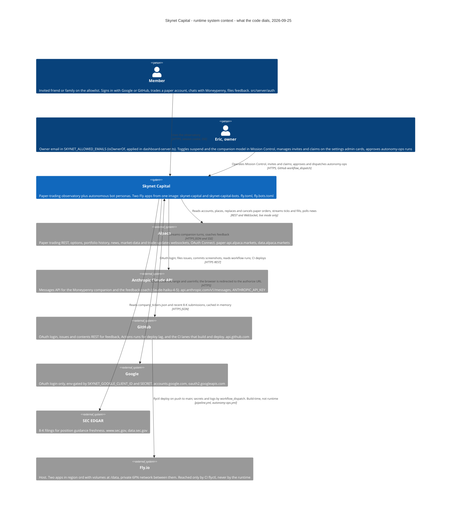
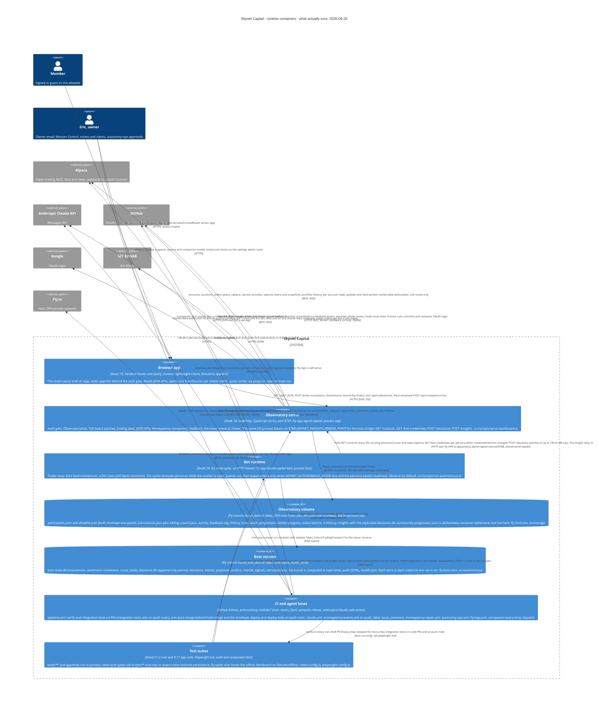
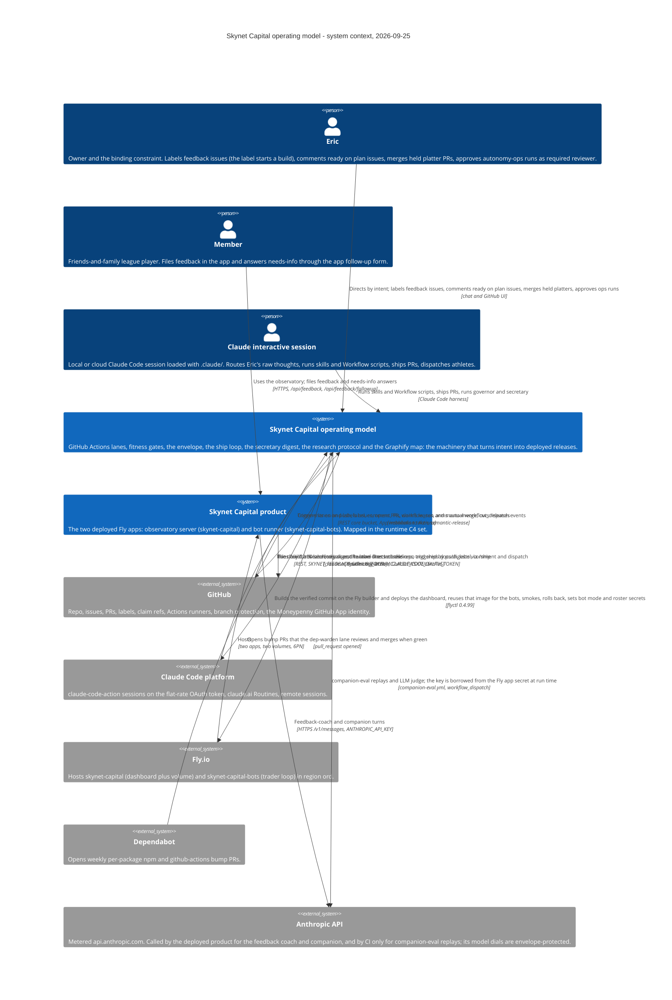
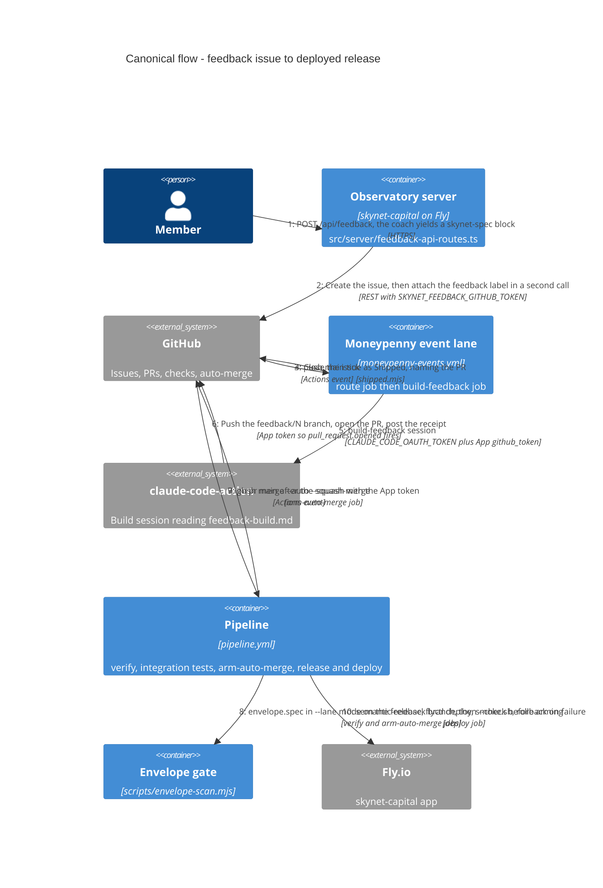

# Architecture — the storybook

One page per container, each grounded in code paths (a diagram is a claim; an ungrounded diagram is
a lie with good kerning — `docs/PICTURES.md`). The C4 model: **Context** (people, the system, its
neighbours) → **Container** (separately runnable units) → **Component** (the modules inside one).

**Generated** by `scripts/architecture-pages.mjs` from `source/` (the two maps derived from the code
on 2026-09-25, one refuter verdict per claim, the Graphify parity notes); `tests/arch/architecture-pages.spec.ts`
regenerates and fails on drift, and checks every code root exists. Edit the source, not the pages;
read a container's page before touching it, and update the source in the same PR. Provenance:
`docs/adr/0008` chose Mermaid as the spec surface for exactly this. The research package behind
the source (each refuter's evidence, the narrative synthesis, the parity sketch) is not in the
tree — it stays at the commit that carried it:
[`synthesis.md`](https://github.com/ejclark/skynet-capital/blob/6a900d3ea08c9fed1d6ea339d38f0a324db5535c/docs/architecture/source/synthesis.md) ·
[`verdicts.json`](https://github.com/ejclark/skynet-capital/blob/6a900d3ea08c9fed1d6ea339d38f0a324db5535c/docs/architecture/source/verdicts.json).
## Runtime system — what serves members and runs the bots

_Caption — system context of the runtime, from the code paths named on each element._

| Container | Technology | Responsibility | Code roots | Page |
|---|---|---|---|---|
| **Browser app** | React 19, TanStack Router (basepath /app) + TanStack Query, Zustand, lightweight | The observatory shell every member uses: the standings board over a seq-numbered SSE patch stream, accounts and positions, the trade ticket  | `app/src/main.tsx`, `app/src/routes`, `app/src/live` | [runtime-browser.md](runtime-browser.md) |
| **Observatory server** | Node 24 (mise.toml), node:http, TypeScript run via tsx | Auth gate (Google/GitHub OAuth or legacy password), the in-memory ObservatoryHub folding Alpaca fills/ticks into DashboardData, the SSE boar | `src/scripts/serve-dashboard.ts`, `src/scripts/dashboard-*.ts`, `src/server` | [runtime-api.md](runtime-api.md) |
| **Bot runtime** | Node 24, TypeScript via tsx, node:sqlite | The autonomous trader loop: one credential feeds the market clock, the 10-symbol universe price stream and a 60s news poll; ticks update mom | `src/scripts/run-autonomous.ts`, `src/scripts/autonomous-*.ts`, `src/autonomous` | [runtime-bots.md](runtime-bots.md) |
| **Observatory volume** | Fly volume skynet_data mounted at /data | Every durable member-facing record: participants.json (credentials, encrypted), allowlist.json, bot-controls.json, activity/ (trade activity | `src/storage`, `src/participants/participant-store.ts`, `src/server/auth/allowlist-store.ts` | [runtime-appvol.md](runtime-appvol.md) |
| **Bots volume** | Fly volume skynet_bots_data at /data | What must survive a bots redeploy: momentum and sentiment windows, per-persona cooldown clocks, the beta scout's day state, the decision jou | `src/autonomous/bots-state-db.ts`, `src/autonomous/decision-db.ts`, `src/autonomous/decision-db-rows.ts` | [runtime-botvol.md](runtime-botvol.md) |
| **CI and agent lanes** | GitHub Actions (ubuntu-latest), actions/setup-node from mise.toml, superfly/flyc | pipeline.yml: verify (typecheck/lint/test/commitlint) → integration tests (Playwright e2e over the offline dashboard) → arm-auto-merge (enve | `.github/workflows`, `.github/actions`, `scripts/moneypenny` | [runtime-ci.md](runtime-ci.md) |
| **Test suites** | Rstest 0.12 (rstest.config.ts, tests/**/*.spec.ts, node env) and app/rstest.conf | The consumer that proves the runtime: unit/BDD specs import src modules directly (ports & adapters make every network seam fakeable), archit | `tests`, `app/tests`, `e2e` | [runtime-tests.md](runtime-tests.md) |

_Caption — containers of the runtime and how they talk._

Refuted: 7 containers and 19 relationships; 0 container claim(s) not grounded as drawn (corrections on the pages).

<strong>Undocumented before this page</strong> — 15 subsystems no doc named

- src/autonomous/decision-replication-client.ts + decision-wire.ts + the POST /decisions route in src/server/insights-listener.ts (the two-leg bots→app decision replication, incl. the 2026-09-23 cursor bug note) — no doc under docs/ mentions 'replication' at all; only code headers and issue #2287 describe it.
- src/observatory/month-return-sync.ts (10-minute Alpaca portfolio-history poll feeding the league's 1M return) — no doc names it or the '1M return' mechanic.
- src/server/networth-api-routes.ts + src/observatory/networth-json-view.ts (/api/accounts/networth) — no doc mentions net worth.
- src/server/community-progression-service.ts / community-progression-store.ts + src/domain/community-progression.ts and SKYNET_COMMUNITY_PROGRESSION_FILE (deliberately ephemeral per tests/arch/volume-persistence.spec.ts) — no doc names the community track's files or its ephemeral-store decision.
- src/server/ladder-progress-log.ts + ladder-activity-detector.ts + src/scripts/dashboard-ladder-progress.ts and SKYNET_LADDER_PROGRESS_DIR (the durable graduated-ladder record) — only fly.toml's comment describes it; no doc under docs/ does.
- src/http/ (fetch-json.ts, the single fetch seam every Alpaca/GitHub/Anthropic call rides; anthropic-reply.ts) — no doc names the directory or fetchJson.
- src/indicators/ (sma, ema, rsi, bollinger) and src/math/num.ts — no doc names either directory.
- src/news/ as a subsystem: sentiment-scorer.ts, sentiment-tracker.ts, taco-signal.ts and SKYNET_TACO_WATCHLIST — the news feed gets one prose mention; the scorer, the TACO signal and its watchlist env var get none.
- src/options/unusual-flow*.ts, in-memory-unusual-flow-store.ts, src/adapters/alpaca-options-flow.ts, src/ports/options-flow.ts and the CLI src/scripts/scan-unusual-flow.ts with SKYNET_FLOW_DIR — no doc mentions unusual flow or the env var.
- src/research/iv-history-store.ts, iv-instrument.ts, iv-rank.ts, iv-record.ts, in-memory-iv-history.ts (IV rank/history instrument) — no doc mentions it.
- src/server/symbol-search-route.ts (/api/symbols/search), quote-route.ts (/api/trade/quote), bars-route.ts (/api/trade/bars) — none named in any doc.
- src/scripts/record-session.ts, capture-option-lifecycle.ts, backfill-trade-activity.ts, backfill-activity-events.ts (package.json scripts record:session, capture:lifecycle, backfill:activity, backfill:activity-events) — no doc names these operational CLIs.
- .github/workflows/companion-eval.yml (its own header says it has never been run end to end) — no doc under docs/ mentions it; docs/ROUTINES.md's 'every scheduled/automation row' table does not list it (it is dispatch-only, so arguably out of that table's scope).
- src/server/desk-events-route.ts + app/src/live/desk-events.ts (the second SSE stream, /api/trade/events, heartbeat ping) — one incidental mention; no doc describes that the app has two SSE streams, not one.
- The app-side replicated decisions.db at SKYNET_INSIGHTS_DIR/decisions.db (src/scripts/dashboard-insights-bridge.ts seedAppDecisionDb) — docs/plans/trade-insights-loop.md describes the JSONL insight relay but not that the observatory now also holds a SQLite copy of the bots' decision journal.

## Operating model — the machinery that runs the repo

_Caption — system context of the operating model, from the code paths named on each element._

| Container | Technology | Responsibility | Code roots | Page |
|---|---|---|---|---|
| **Interactive session toolkit** | Claude Code harness (local or cloud), .claude/ config, Markdown skill and agent  | What a human-steered Claude session loads: Orient output style, SessionStart hooks (mise Node 24 provisioning, commit signing), 16 skills (/ | `.claude/settings.json`, `.claude/output-styles/orient.md`, `.claude/hooks/session-start.sh` | [operating-model-session.md](operating-model-session.md) |
| **Ship loop** | Bash, curl against the GitHub REST core bucket, python3 for JSON, git | Lands a verified branch as a PR without polling: local npm run verify, incident/plan-closure/test-quality preflights, checkbody fridge-rule  | `scripts/ship.sh`, `.claude/skills/ship/SKILL.md`, `scripts/deploy-lag.mjs` | [operating-model-ship.md](operating-model-ship.md) |
| **Fitness gates and coaches** | Node ESM scan scripts, rstest (@rstest/core 0.12), Biome 2.5, Husky 9, knip 6, j | Detect-and-correct loops per quality dimension: each eye is a scan script plus a ratchet-down budget JSON plus a tests/arch spec (advisory f | `scripts/*-scan.mjs`, `tests/arch/`, `tests/support/advisory-scan.ts` | [operating-model-gates.md](operating-model-gates.md) |
| **Envelope gate** | envelope.json manifest, scripts/envelope-scan.mjs (Node, glob-to-regex path matc | The single mechanical answer to 'is this the irreversible class?': red on feedback/ research/ design/ lane branches via tests/arch/envelope. | `envelope.json`, `scripts/envelope-scan.mjs`, `tests/arch/envelope.spec.ts` | [operating-model-envelope.md](operating-model-envelope.md) |
| **Pipeline (CI + CD)** | GitHub Actions, actions/setup-node@v7 (Node 24 via .nvmrc), actions/cache@v6, rs | verify (PR title commitlint, typecheck, lint, test in parallel; docs-only PRs skip heavy steps), integration tests (Playwright on PR and on  | `.github/workflows/pipeline.yml`, `scripts/smoke.sh`, `scripts/smoke-bots.sh` | [operating-model-pipeline.md](operating-model-pipeline.md) |
| **Moneypenny event lane** | GitHub Actions trigger shim, Node ESM router (scripts/moneypenny/index.mjs), gh  | One router for every issue-driven automation: sweeps receipt issues for never-assessed events, claims feedback labels and plan ready-comment | `.github/workflows/moneypenny-events.yml`, `scripts/moneypenny/`, `scripts/event-scan.mjs` | [operating-model-mp-events.md](operating-model-mp-events.md) |
| **Moneypenny repair lane** | GitHub Actions workflow_run + workflow_dispatch, Node ESM router (scripts/moneyp | Watches the other lanes: a failed run on main files one ci-failure capsule per signature and dispatches a repair session; workflow_dispatch  | `.github/workflows/moneypenny-repair.yml`, `scripts/moneypenny/repair.mjs`, `scripts/moneypenny/repair-logs.mjs` | [operating-model-mp-repair.md](operating-model-mp-repair.md) |
| **Human-directed lane** | GitHub Actions on issues/issue_comment/pull_request_review_comment, claude-code- | Any comment from a recognised OWNER/MEMBER/COLLABORATOR on an existing thread starts or steers a session under .github/prompts/interactive.m | `.github/workflows/claude.yml`, `.github/prompts/interactive.md` | [operating-model-claude-lane.md](operating-model-claude-lane.md) |
| **Ops buttons** | GitHub Actions workflow_dispatch, flyctl 0.4.99, the autonomy-ops GitHub Environ | Phone-operable, reviewer-gated operations: autonomy-ops (status, machine-status, logs, bootstrap-bots-app, flip-mode, set-playbooks, set-bet | `.github/workflows/autonomy-ops.yml`, `.github/workflows/fly-logs.yml`, `.github/workflows/companion-eval.yml` | [operating-model-ops-buttons.md](operating-model-ops-buttons.md) |
| **Secretary digest loop** | claude.ai Routine (daily 12:00, trig_01KaMC2uR3cFW5XTUL6rzPuS), scripts/digest-s | Protects Eric's attention: when digest-scan says a digest is due (5 commits or 7 days), assemble the three tiers (needs-you, headlines, nois | `.claude/skills/secretary/SKILL.md`, `scripts/digest-scan.mjs`, `scripts/config-audit.mjs` | [operating-model-secretary.md](operating-model-secretary.md) |
| **Graphify structural map** | graphifyy (PyPI, tree-sitter code extraction, no LLM), bash wrapper | Regenerates docs/STRUCTURE-graph.md from graphify-out/ on demand; navigation via graphify explain/affected/path/query; refresh is manual and | `scripts/refresh-graph.sh`, `docs/STRUCTURE-graph.md`, `docs/GRAPHIFY.md` | [operating-model-graphify.md](operating-model-graphify.md) |
| **Repo ledgers and budgets (git)** | git-tracked Markdown and JSON | The durable operating state every lane reads and writes through PRs: research ledgers (docs/research/events, ~688 files), the market-event c | `docs/research/events/`, `docs/research/forward-tests/`, `src/domain/market-events/` | [operating-model-ledgers.md](operating-model-ledgers.md) |
| **Observatory server (skynet-capital)** | Node 24 slim image, tsx, node:http + SSE, React 19 shell built by rsbuild, Fly v | The deployed product half that participates in the operating loop: serves the observatory on 8787 and the private controls/insight bridge on | `src/scripts/serve-dashboard.ts`, `src/server/`, `fly.toml` | [operating-model-dashboard.md](operating-model-dashboard.md) |
| **Bot runner (skynet-capital-bots)** | Node 24, tsx, same image as the dashboard, Fly volume skynet_bots_data | The stateful autonomous trader loop, observe mode by default, roster SKYNET_AUTONOMOUS_BOTS=sauron; redeployed only when scripts/bot-relevan | `src/scripts/run-autonomous.ts`, `src/autonomous/`, `fly.bots.toml` | [operating-model-bots.md](operating-model-bots.md) |

```mermaid
C4Container
  title Skynet Capital operating model - containers, 2026-09-25
  UpdateLayoutConfig($c4ShapeInRow="4", $c4BoundaryInRow="2")

  Person(eric, "Eric", "Owner: feedback labels, ready comments, held-platter merges, ops approvals")
  Person(member, "Member", "Files feedback in the app, answers needs-info")

  System_Ext(github, "GitHub", "Issues, PRs, labels, claim refs, Actions, branch protection, App identity")
  System_Ext(ccp, "Claude Code platform", "claude-code-action sessions and claude.ai Routines")
  System_Ext(dependabot, "Dependabot", "Weekly per-package bump PRs")
  System_Ext(anthropic, "Anthropic API", "api.anthropic.com/v1/messages, ANTHROPIC_API_KEY")

  System_Boundary(ops, "Skynet Capital operating model") {
    Container(session, "Interactive session toolkit", "Claude Code harness, .claude/", "Orient output style (Focus is the other), SessionStart hooks (commit signing everywhere; mise Node 24 only when CLAUDE_CODE_REMOTE=true), 16 skills, 13 agents (7 sonnet athletes, 3 opus, 3 fable xhigh), grind.js and symbol-sweep.js, duel-log.mjs telemetry hooks")
    Container(ship, "Ship loop", "Bash, curl REST core bucket, python3; one GraphQL call each to arm auto-merge and promote a held draft", "scripts/ship.sh: local verify plus incident, plan-closure and test-quality preflights, checkbody fridge-rule lint, push, open PR over REST, checkarm via envelope-scan, one auto-merge arm; platter boards the irreversible class onto one held PR")
    Container(gates, "Fitness gates and coaches", "Node ESM scans, rstest, Biome, Husky, commitlint, knip, jscpd, dependency-cruiser", "Code-hygiene coaches (arch, dupe, clone, dead, dep-graph, spec-gap, doc-rot, comment-bloat, incident, workflow-lint) each with a budget JSON or arch-grandfather.json; communication-format gates (issue-lint, research-lint, digest, journey, checkbody) block; governor dispatches only the four coaches that have athletes")
    Container(envelope, "Envelope gate", "envelope.json, scripts/envelope-scan.mjs", "Path globs plus a new-runtime-dependency check. --lane mode is red on feedback/, research/ and design/ branches via tests/arch/envelope.spec.ts; --check runs on every PR before arming, filtered on blocking beside the hold-merge check. diffAware was removed 2026-09-17")
    Container(pipeline, "Pipeline", "GitHub Actions, Node 24 from .nvmrc, rstest, Biome, Playwright, commitlint, semantic-release 25, flyctl 0.4.99", "pipeline.yml jobs: verify (PR only; parallel processes on one runner; docs-only skips heavy steps), integration tests (code PRs and push main, against a local offline server), arm-auto-merge, release and deploy, deploy bots")
    Container(mp_events, "Moneypenny event lane", "GitHub Actions trigger shim, scripts/moneypenny/index.mjs, claude-code-action", "Routes push, feedback label, plan ready comment and dependabot PR events into feedback, plan, event-research and dep-warden builds; model tier haiku light, sonnet default, opus escalation, plans on opus; audits stalls and conflicts on every push")
    Container(mp_repair, "Moneypenny repair lane", "GitHub Actions workflow_run and workflow_dispatch, scripts/moneypenny/repair.mjs, claude-code-action opus", "Watches the five enumerated lanes; files one ci-failure capsule per signature; repairs CI failures, PR conflicts and stalled research; four loop guards")
    Container(claude_lane, "Human-directed lane", "GitHub Actions, claude.yml, claude-code-action opus, max 80 turns", "A member comment on an issue or PR, or a new issue with @claude in its body, starts or steers a session under .github/prompts/interactive.md; inert until CLAUDE_CODE_OAUTH_TOKEN is set")
    Container(ops_buttons, "Ops buttons", "GitHub Actions workflow_dispatch, flyctl", "autonomy-ops.yml and companion-eval.yml gated by the autonomy-ops Environment required reviewers; fly-logs.yml is self-serve and read-only; flyctl pinned 0.4.99 except companion-eval, which installs latest")
    Container(secretary, "Secretary digest loop", "claude.ai Routine daily 12:00, scripts/digest-scan.mjs, secretary skill", "When digest-scan says due (5 commits or 7 days), writes the three-tier digest into docs/digests; rides config-audit, comment-bloat, incident and doctrine scans; comms-scan is the landing-meter table")
    Container(graphify, "Graphify structural map", "graphifyy on PyPI, tree-sitter, scripts/refresh-graph.sh", "Manual npm run graph:refresh re-extracts the repo into graphify-out and copies GRAPH_REPORT.md into docs/STRUCTURE-graph.md; doc-rot-scan flags a snapshot over 30 days behind HEAD")
    ContainerDb(ledgers, "Repo ledgers and budgets", "git, Markdown, JSON", "docs/research/events (about 687 ledgers plus TEMPLATE), docs/digests, docs/LESSONS.md, docs/IDEAS.md, CLAUDE.md, root *-budget.json ratchets, assessment-cadence.json, src/domain/market-events/*.json")
  }

  Boundary(flyhost, "Fly.io deploy host", "external") {
    Container(dashboard, "Observatory server", "Node 24, tsx, node:http and SSE, React shell built by rsbuild, Babylon scene bundle", "fly.toml app skynet-capital: serve-dashboard.ts on 8787, private bridge listener on 8788, /data volume; files feedback issues; deploys on every push to main")
    Container(bots, "Bot runner", "Node 24, tsx, same image", "fly.bots.toml app skynet-capital-bots: run-autonomous.ts, observe by default; volume holds bots-state.db, decisions.db, audit, health.json; deploys when bots-deploy-preflight says so or force_bots_deploy")
  }

  Rel(eric, session, "Dumps raw ideas and directives in chat; the session routes act, park, fan, profile, question", "Claude Code")
  Rel(eric, github, "Applies the feedback label, comments ready on plan issues, merges held platters", "GitHub UI")
  Rel(eric, ops_buttons, "Approves as required reviewer and can dispatch autonomy-ops and companion-eval", "autonomy-ops Environment")
  Rel(member, dashboard, "Uses the observatory, files feedback and follow-ups", "HTTPS, OAuth session")
  Rel(dashboard, github, "Files feedback-labelled issues: POST issue, then POST labels", "REST, SKYNET_FEEDBACK_GITHUB_TOKEN")
  Rel(dashboard, anthropic, "Feedback-coach turns (feedback-coach.ts) and companion chat turns (companion-tool-rounds.ts)", "HTTPS")
  Rel(session, ship, "Lands branches: verify, push, REST PR, arm auto-merge, no polling", "ship skill")
  Rel(session, gates, "Runs gate scans for verification and governor target selection; bare scan commands are pre-approved, --candidate is not", "npm run verify, node scripts/*-scan.mjs")
  Rel(session, graphify, "Refreshes the map by hand", "npm run graph:refresh")
  Rel(ship, envelope, "checkarm refuses to arm a blocking envelope hit, exit 5", "envelope-scan --check")
  Rel(ship, github, "REST /pulls open, label and PATCH body plus git push; GraphQL arm, falling back to the MCP arm or ship merge", "REST core bucket")
  Rel(github, pipeline, "pull_request to main, push main, workflow_dispatch force_bots_deploy", "Actions")
  Rel(pipeline, gates, "verify runs typecheck, biome lint and rstest for root and app; the suite includes the tests/arch gate specs, some advisory", "npm test")
  Rel(pipeline, envelope, "Arms only if no changed path is protected and the PR is not held", "envelope-scan --check")
  Rel(pipeline, github, "arm-auto-merge: gh pr merge --auto --squash with the App token", "PR events")
  Rel(pipeline, github, "deploy: semantic-release with GITHUB_TOKEN cuts the tag and Release", "push main")
  Rel(pipeline, dashboard, "Releases and deploys on every push to main, smokes, rolls back to the previous image on smoke failure", "flyctl deploy --remote-only")
  Rel(pipeline, bots, "After deploy succeeds, when the preflight says so (bot-relevant diff vs the stamped GIT_SHA, debounced, deploys when unsure), reuses the dashboard image, smokes, rolls back", "flyctl deploy --image")
  Rel(github, mp_events, "push main, issues labeled feedback or plan, issue_comment ready, pull_request opened (job-gated to dependabot), workflow_dispatch", "Actions")
  Rel(mp_events, ccp, "build-feedback, build-plan, build-events matrix legs fanned per due event via a route re-dispatch, dep-warden", "claude-code-action pinned v1, CLAUDE_CODE_OAUTH_TOKEN")
  Rel(mp_events, github, "Claim leases, receipt issues, labels, comments, closes shipped issues, screen PRs, re-dispatch", "gh CLI plus REST and GraphQL, App token")
  Rel(mp_events, mp_repair, "Conflicted PRs (pr_number, up to 3 attempts then needs-eric) and stalled event-research issues (batched issue_number)", "gh workflow run moneypenny-repair.yml")
  Rel(github, mp_repair, "workflow_run completed for the five watched workflows; conclusion and default-branch filters run in repair.mjs", "Actions")
  Rel(mp_repair, ccp, "Repair sessions: CI-failure repair, PR conflict repair, stalled-issue diagnosis", "claude-code-action opus")
  Rel(mp_repair, github, "Triage files or dedupes the ci-failure capsule with GITHUB_TOKEN; the repair session opens the PR with the App token", "gh")
  Rel(github, claude_lane, "OWNER, MEMBER or COLLABORATOR comment, new or edited, on an issue or PR thread, or a new issue with @claude", "Actions, cancel-in-progress")
  Rel(claude_lane, ccp, "Interactive session", "claude-code-action")
  Rel(dependabot, github, "Opens weekly bump PRs", "pull_request opened")
  Rel(ops_buttons, bots, "flip-mode, set-playbooks, set-beta-forcing, set-hardcore, logs, status, bootstrap; never bot Alpaca credentials", "flyctl secrets set and logs through the Fly API")
  Rel(ops_buttons, anthropic, "companion-eval replays and LLM judge; key borrowed from the Fly app at run time", "companion-eval.yml")
  Rel(ccp, secretary, "Fires daily 12:00; gated by digest-scan --due", "Routine trig_01KaMC2uR3cFW5XTUL6rzPuS")
  Rel(secretary, ledgers, "Writes docs/digests/YYYY-MM-DD.md from TEMPLATE and ships it as an auto-merged docs PR", "ship skill")
  Rel(secretary, eric, "Push-notifies the needs-you count and top headline, only when a digest is due", "claude.ai push")
  Rel(mp_events, ledgers, "Research sessions on research/ID and the deterministic screen on moneypenny/screen-* land ledger files via auto-merged PRs", "docs/research/events, forward-tests")
  Rel(gates, ledgers, "--update after a correction lands writes min(prev, debt) to the budget JSON; CI reads it and fails if debt grew", "manual --update, CI read")
  Rel(bots, dashboard, "GET /controls, GET /bot-credentials, POST /decisions (POST /insights is accepted but the client is unwired)", "private 6PN http on 8788, shared-secret header")
```

_Caption — containers of the operating model and how they talk._

Refuted: 14 containers and 39 relationships; 0 container claim(s) not grounded as drawn (corrections on the pages).

<strong>Undocumented before this page</strong> — 21 subsystems no doc named

- research-dispatch-budget.json — the per-tick research dispatch cap (read by scripts/moneypenny/events.mjs); no doc under docs/ names it
- research-circuit-breaker.json — the spend circuit breaker config (scripts/moneypenny/circuit-breaker.mjs); no doc names it (CLAUDE.md/COACHES mention a 'circuit breaker' only in passing)
- scripts-grouping-budget.json — a budget file at the repo root with no scan script or doc referencing it by name
- scripts/moneypenny/events.mjs — event-research dispatch and the cap; docs/MONEYPENNY.md and COACHES.md cite index.mjs and repair.mjs only
- scripts/moneypenny/plan-claim.mjs — the plan ready-flip decision (#823); no doc names it
- scripts/moneypenny/open-screen-pr.mjs — the deterministic-screen PR opener (#915); no doc names it
- scripts/moneypenny/repair-logs.mjs — the repair lane's log fetch/sanitise; no doc names it
- scripts/commit-msg-reflow.mjs — invoked by .husky/commit-msg; no doc names it
- scripts/proxy-reexec.mjs — re-exec-under-proxy helper used by open-screen-pr.mjs (tests/arch/proxy-reexec.spec.ts exists); no doc names it
- scripts/script-deps.mjs — has a spec (tests/scripts/script-deps.spec.ts) but no doc
- scripts/workflow-labels.mjs — no doc, no spec found
- scripts/issue-lint-audit.mjs — the issue-surface audit; docs/ISSUES.md cites 'issue-lint.mjs --audit' but not this file
- scripts/event-title-overlap.mjs — same-date title-overlap detector cited in EVENT-RESEARCH only as a --validate behaviour, not by file
- scripts/doctrine-decide.mjs — the pure half of doctrine-scan.mjs; only the scan is documented
- scripts/design-cards.mjs — npm run design:cards; no doc names it
- scripts/research/earnings-controls.mjs, intraday-strategies.mjs, session-stats.mjs — research instruments not named by docs/process/EVENT-RESEARCH.md (which names earnings-cycle.mjs and intraday-edges.mjs)
- .github/workflows/companion-eval.yml — the replay-eval button (issue #1672 slice 5); not in docs/ROUTINES.md's table (it is manual, so not a schedule) and no doc names it
- .github/actions/oauth-token-gate/action.yml — the armed? composite action; envelope.json protects .github/actions/** but no doc describes this action (app-token is mentioned in four docs)
- .github/prompts/plan-build.md, .github/prompts/moneypenny-ci-repair.md, .github/prompts/moneypenny-event-stall-repair.md — three of the eight lane instruction sets are named by no doc (feedback-build, interactive, event-research, design-build, moneypenny-conflict-repair are)
- Stale in-code references found while grounding (doc-rot candidates inside scripts, not docs): scripts/smoke.sh header cites .github/workflows/deploy.yml, which no longer exists (the job lives in pipeline.yml); scripts/moneypenny/circuit-breaker.mjs header cites a 'held research-daily-budget.json' that is not in the repo (research-budget.json is); .claude/agents/dep-warden.md says dependabot opens 'grouped' PRs while .github/dependabot.yml moved to per-package PRs (#3315)
- No document under docs/ carries a system-level architecture map of the operating model itself; docs/adr/0008-spec-surfaces-and-architecture-fitness.md and docs/STRUCTURE-graph.md cover code structure, docs/OPERATING-MODEL.md covers the portable process — the C4 set above is the first

### Flow — feedback-to-deploy

## Graphify parity

| Community | Hubs | Mapped to |
|---|---|---|
| (snapshot facts) docs/STRUCTURE-graph.md dated 2026-08-28, built from f0bdc1f4 — 4000 nodes, 11034 edges, 193 communities (172 shown); HEAD is 72774db (2026-09-25); f0bdc1f4 is not in this shallow clone (56 commits), graphify CLI is not installed and graphify-out/ is absent, so no live queries were possible — everything below is read from the committed snapshot and verified against `git ls-files` at HEAD | escapeHtml() 158 edges, MarketContext 76, OrderIntent 74 | n/a — 14 hub files no longer exist at HEAD; app/src (235 files), src/companion, src/autonomous/{bots-state-db,decision-db,decision-replication-client,bot-credentials-client}.ts, src/three/scene-main.ts, scripts/moneypenny/**, every .yml and envelope.json have ZERO nodes in the snapshot |
| 0 MarketContext (46 nodes, cohesion 0.07) | MarketContext, OrderIntent, Portfolio | shared kernel — runtime:bots (src/personas) ∩ runtime:api (src/domain/types.ts); both maps list src/domain under api and src/personas under bots |
| 1 SafetyController (40, 0.06) | SafetyController, AlertBus, AlertFilter | straddles runtime:api (src/alerts → desk-alerts-route, appvol alert-dismissals) and runtime:bots (src/autonomous/safety.ts) |
| 2 participant-snapshot.ts (40, 0.05) | ParticipantSnapshot, DashboardData, findAccountCollisions() | runtime:api (hub component) |
| 3 ObservatoryHub (35, 0.05) | ObservatoryHub, Participant, ParticipantStore | runtime:api (hub + stores/participants) |
| 4 Persona (38, 0.07) | Persona, AutonomousTrader, DecisionRecord | runtime:bots (trader component) |
| 5 insights-listener.ts (43, 0.06) | BotControls, BotControlsClient, CONTROLS_BRIDGE_PATH | runtime:api (bridge component) + runtime:bots (clients component) — the 8788 seam is one community; at HEAD the client files (bot-credentials-client, decision-replication-client) are absent from the graph |
| 6 AlpacaTradingClient (35, 0.06) | AlpacaTradingClient, AlpacaBrokerAdapter, AlpacaOptionContract | shared kernel src/alpaca + src/adapters — listed under BOTH runtime:api (datasource) and runtime:bots (broker) |
| 7 tower.ts (54, 0.06) — largest community | tower.ts, createStage(), attachGodRays() | runtime:api (folded into the router's '/tower' description; src/three, 22 files at HEAD) — no box of its own |
| 8 data-source.ts (39, 0.05) | data-source.ts, FixtureTradingTransport, ReplayEventStream | runtime:api (datasource) + runtime:tests (the offline seam, ADR-0002) |
| 9 escapeHtml (51, 0.09) | escapeHtml() 158 edges, courseCard(), milestoneRow() | runtime:api residue — the server-rendered HTML layer; 15 importers at HEAD vs 158 edges in the snapshot |
| 10 trade-ticket-route.ts (49, 0.08) | handleOptionPost(), renderOptionReviewBody(), ticketContext() | none — file deleted since snapshot; job now runtime:browser (routes/trade.tsx) + runtime:api (desk) |
| 11 session.ts (34, 0.06) | Authenticator, completeOAuthCallback(), isAllowedIdentity() | runtime:api (router/auth) |
| 12 outlook.ts (46, 0.08) | Outlook, CandidateScore, expectedMove() | runtime:api (content: position guidance, src/options) |
| 13 positions-view.ts (44, 0.06) | positions-view.ts, CANDIDATES, EXE | none — deleted view; now runtime:browser positions-* + runtime:api desk-json-view. CANDIDATES/EXE/pages are scripts/shoot symbols merged in by the pre-#1504 node-id scheme (same-name collisions) |
| 14 autonomous-live-wiring.ts (31, 0.10) | Bot, BotCredentials, createBotBroker() | runtime:bots (boot component) |
| 15 JsonResponse (13, 0.06) | JsonResponse 70 edges, FakeTradingTransport, StubDataTransport | runtime:tests (fakes) + src/http (a directory neither map names) |
| 16 run-eval.ts (28, 0.10) | assessReadiness(), evaluatePersona(), runScenario() | runtime:bots (guards — src/autonomous/readiness.ts imports src/evals) + CLI eval:persona/eval:safety/eval:companion (excluded by RUNTIME scope) + operating:ops_buttons companion-eval |
| 17 dashboard-server.ts (30, 0.10) | dashboard-server.ts, NavContext 50 edges, NavView | runtime:api (router) — NavContext/NavView/renderAcademyBody are legacy server-render residue |
| 18 comprehension.ts (31, 0.08) | COMPREHENSION_CHECKS, CheckQuestion, checkFor() | runtime:api (progression/desk gates, src/domain/comprehension*) |
| 19 earnings-calendar.ts (34, 0.10) | EarningsPrint, PRINT_WINDOWS, nextPrint() | shared — runtime:bots (guards: S2/E1 print discipline) + runtime:api (content/research) |
| 20 scripts (48, 0.04) + 39 devDependencies + 101 package.json + 54 compilerOptions + 95 knip.json | package.json scripts table, devDependencies, tsconfig compilerOptions | operating:gates / operating:pipeline (manifests, not code) — parity script should skip these by file_type/path rule |
| 21 option-trade-service.ts (27, 0.10) | AlpacaOptionsClient, openDesk(), DeskSubmitResult | runtime:api (desk) |
| 22 activity-store.ts (27, 0.10) | ActivityStore, reconcileBrokerActivity(), backfillParticipantActivity() | runtime:api (stores) / runtime:appvol — dual-listed in both containers' code_roots |
| 23 draft-order.ts (38, 0.09) | DraftOrder, DraftLeg, AggregateGreeks | runtime:api (desk, src/trading) — the browser twin app/src/live/draft-order.ts is absent from the graph |
| 24 ticket-view.ts (38, 0.12) | STARTER_PLAYS, TradeType, tradeTypeByCode() | none — deleted view; survivors src/domain/plays.ts + trade-types.ts → runtime:api content |
| 25 standings-view.ts (38, 0.12) | formatCurrency(), LEADER_METRICS, metricValue() | runtime:api (hub/content — standings-*.ts still feed board-patch-routes and content-api-routes) |
| 26 feedback-routes.ts (26, 0.10) | servePublicRoute(), handleFeedbackCoach(), BOARD_PATCH_SCRIPT | runtime:api (router + feedback) |
| 27 research-service.ts (32, 0.12) | renderResearchShelfBody(), ledgerLine(), CANDIDATES | runtime:api (content: research) — polluted by scripts/shoot symbol collisions |
| 28 feedback-coach.ts (31, 0.11) | createFeedbackCoach(), CoachTurn, coachThrottled() | runtime:api (companion/coach component) — the companion itself (src/companion/*) has no nodes |
| 29 persona-collections.ts (29, 0.10) | COLLECTION_PROBES, AGAINST_THE_CROWD, BY_THE_BOOK | none — deleted (collections surface removed) |
| 30 performance-view.ts (27, 0.12) | deskLedger(), fillsFrom(), longestGreenStreak() | none — deleted view; logic now src/observatory/history-metrics + desk-json-view → runtime:api content |
| 31 render-dashboard.ts (22, 0.16) | renderShell(), participantCard(), activityFeed() | none — deleted; participant-card.ts survives (imported by networth-api-routes) → runtime:api content |
| 32 progression-service.ts (27, 0.14) | Course, COURSES, Milestone | runtime:api (progression component) |
| 33 playbook-collections.ts (30, 0.10) | collections, desks, scale | none — deleted view; now runtime:browser routes/playbooks.tsx + runtime:api playbooks-api-routes |
| 34 serve-dashboard.ts (18, 0.11) | CeremonyChannel, startHistorySampler(), deriveTransitions() | runtime:api (composition root + datasource syncs) |
| 35 trade-review-view.ts (29, 0.11) | openOrdersPanel(), cancelForm(), OPEN_STATUSES | none — deleted; now runtime:browser working-orders + runtime:api trade-orders-routes |
| 36 observatory/morning-brief.ts (27, 0.10) | buildMorningBrief(), MorningBrief, personaEntry() | none — CLI only (brief:morning; sole importer src/scripts/morning-brief.ts); RUNTIME excluded CLIs by scope, OPERATING does not name it |
| 37 feedback-service.ts (27, 0.13) | FeedbackSpec, submitterFor(), createFollowup() | runtime:api (feedback) = operating:dashboard |
| 38 option-ticket.ts (25, 0.12) | payoffSvg(), premiumByStrikeSvg(), windowChain() | runtime:api (desk, src/trading) — server-side SVG renderers now sit beside browser payoff-chart.tsx; likely residue |
| 40 wire-view.ts (20, 0.12) | WirePnlRow, renderFeedbackPulse(), statusBadge() | none — deleted; wire-json-view survives → runtime:api content |
| 41 order-audit-log.ts (13, 0.10) | JsonlOrderAuditLog, OrderAuditRecord, createProgressionService() | runtime:api (stores) / runtime:appvol (dual-listed) |
| 42 envelope-scan.mjs (25, 0.12) | classifyDiff(), breachOf(), globToRegExp() | operating:envelope (runtime:ci) |
| 43 structure-risk.ts (24) · 44 probability.ts (28) · 58 pricing.ts (22) · 63 candidate-score.ts (19) · 77 payoff-surface.ts (15) | describeMechanics(), probabilityOfProfit(), impliedVolatility() | runtime:api (content: options analytics, src/options) — a pure library family; only reached by api guidance and CLIs |
| 45 builders.ts (12, 0.16) · 117 authenticator.spec.ts · 152 comms-scan.spec.ts · 157 dockerignore-research.spec.ts · 162 deploy-lag.spec.ts · 138 dashboard-board-routes.spec.ts | NewsFaderPersona, HARDCORE_SAURON_CONFIG, FakeRes | runtime:tests (138 also touches api router: serveBoardFrame is src code named by a test-file hub) |
| 46 research-view.ts (23, 0.12) | agendaBandPanel(), BANDS, callChip() | none — deleted view; event-agenda.ts + research-json-view survive → runtime:api content |
| 47 EquitySample (11, 0.17) | EquitySample, HistoryStore, rehydrateHistory() | runtime:api (datasource/history) + runtime:appvol |
| 48 comms-scan.mjs (27) · 55 config-audit.mjs (25) · 97 incident-scan.mjs (13) · 124 feedback-scan.mjs (9) | parseLog(), computeFloorFindings(), failedMainRuns() | operating:secretary (ride-along scans) / operating:gates (incident = learning coach) |
| 49 unusual-flow.ts (19) · 69 UnusualFlowScan (6) · 107 unusual-flow-metrics.ts (8) | assessFlow(), AlpacaOptionsFlowSource, UnusualFlowStore | none in practice — src/options is claimed by runtime:api but these files are reached only via CLI scan:flow (SKYNET_FLOW_DIR); RUNTIME lists them as undocumented |
| 50 event-scan.mjs (26, 0.13) | assessmentDue(), loadCadence(), loadEvents() | operating:mp_events (due oracle) + operating:gates (--validate) |
| 51 feedback-view.ts (18) · 53 day-trophies.ts (25) · 73 dashboard-shell.ts (7) · 94 ticker.ts (12) · 125 play-feedback.ts (7) · 133 confirm-button.ts (6) | feedbackTally(), greenStreakBoard(), NAV/BRAND/SHELL_STYLE | runtime:api residue — legacy HTML/UI atoms whose only importers at HEAD are tests (dashboard-shell is still imported by dashboard-server + board-patch-routes); neither map names a 'legacy shell' component |
| 52 round-trips.ts (20, 0.12) | matchRoundTrips(), Lot, OpenLot | runtime:api (content: history metrics, src/trading) |
| 56 issue-lint.mjs (24) · 57 research-lint.mjs (25) · 136 journey-scan.mjs (6) | checkFold(), checkHorizons(), REQUIRED_HEADINGS | operating:gates (communication format gates) |
| 59 postmaster.mjs (20, 0.22) · 92 postmaster-shipped.mjs (11) · 102 postmaster-labels.mjs (10) | claimHandoff(), claimFeedback(), audit() | operating:mp_events — files renamed since snapshot to scripts/moneypenny/{index,claim-lease,audit,shipped,labels,events}.mjs; 'moneypenny' has 0 hits in the graph |
| 60 collections-view.ts (19, 0.18) | Collection, CollectionMember, DeskIndex | none — deleted |
| 61 trade-ledgers-view.ts (16, 0.16) | DecisionContext, decisionContextFor(), foldedLedger() | none — deleted; decision-context.ts survives → runtime:api content |
| 62 order-ticket.ts (16, 0.16) | previewOrder(), previewClose(), TicketContext | runtime:api (desk, src/trading) |
| 64 iv-rank.ts (18) · 79 iv-instrument.ts (8) · 83 IvSample (4) | IvMetric, IV_WINDOW_DAYS, recordIvTick() | split — iv-rank reaches runtime:api (guidance-market imports src/research); iv-instrument/IvSample are CLI-only (iv-clock-wiring, week-study) → none |
| 65 providers.ts (9) · 93 resolve-auth.ts (11) · 91 claim-form.ts (13) · 100 controls-form.ts (11) · 114 account-forms.spec.ts (9) | googleProvider(), AlpacaConnectProvider, ownerEmails() | runtime:api (router/auth + owner gates: invites, claims, Mission Control) |
| 66 shoot-portfolio.mjs (16) · 129 shoot-tower.mjs (5) · 137 shoot-login.mjs (6) | playwright-core (betweenness 0.059), CANDIDATES, EXE | none — screenshot tooling, renamed to scripts/shoot/*.mjs (22 files; docs/PICTURES.md); neither map names it; closest is operating:session |
| 67 earnings-cycle.mjs (18, 0.27) · 68 intraday-edges.mjs (17, 0.27) | controlBaseRate(), controlFade(), binomTail() | operating:session (symbol-sweep Workflow) / research protocol; excluded from RUNTIME by scope |
| 70 markdown-preview.ts (9, 0.27) | renderMarkdownPreview(), stashFences() | runtime:api (content: research docs render, src/ui) |
| 71 market-events.ts (11, 0.20) | MARKET_EVENTS, allEvents(), eventsWithin() | runtime:api (content) + operating:ledgers (src/domain/market-events/*.json, 1184 files, invisible to a code-only graph) + operating:mp_events (due oracle) |
| 72 JsonlKeyedStore (5) · 131 allowlist-store.ts / secure-envelope (4) · 126 volume-guard.ts (6) · 74 owner-link-store.ts (10) | JsonlKeyedStore, seal()/open()/Envelope, PERSISTED_STORES | runtime:appvol (src/storage + store files) — also listed under api's 'stores' component |
| 75 beta-scout.ts (9, 0.16) | LiveCycleRunner, betaScoutIntents(), BETA_SCOUT_ID | runtime:bots (cycle component) |
| 76 feedback-images.ts (14) · 90 feedback-status.ts (13) · 115 feedback-areas.ts (8) | ensureAssetBranch(), setupFeedback(), createStatusFetcher() | runtime:api (feedback component + boot wiring) |
| 78 project.ts (11) · 82 empire-skyline.ts (13) · 84 WorldPatchChannel (7) · 99 board-patch-routes.ts (9) · 104 world-patch.ts (11) · 116 world-state.ts (7) · 134 world-patch-apply.ts (7) | projectEmpire(), PERSONA_LANDMARK, renderEmpireSkyline() | runtime:api (hub + patch channel) — src/universe is ALSO imported by runtime:browser (app/src/live/board.ts) and src/three/kit/params.ts; no named 'world model' box in either map |
| 80 broker-sync.spec.ts (10) · 87 trade-updates-stream.ts (8) | BrokerSync, createBrokerSync(), AlpacaTradeUpdatesStream | runtime:api (datasource syncs + WSS) — month-return-sync.ts absent from graph |
| 81 cycle-report-store.ts (5, 0.23) | CycleReport, JsonlCycleReportStore | runtime:bots (offline runner, src/runtime) — unnamed by either map |
| 85 dashboard-self-service-routes.ts (13, 0.32) | handleAccountSelfServiceRoute(), resolveOwnedIds() | none — deleted; now admin-api-routes / settings-api-routes → runtime:api router |
| 86 ci-medic.mjs (15) · 122 ci-medic-logs.mjs (7) | gatherFailures(), issueBody(), sanitizeLog() | operating:mp_repair — renamed since snapshot to scripts/moneypenny/repair.mjs + repair-logs.mjs |
| 88 sentiment-tracker.ts (5, 0.19) | SentimentTracker, scoreSentiment(), NewsArticle | runtime:bots (trackers) — taco-signal.ts absent from graph |
| 89 research-view.spec.ts (12, 0.24) | monthGrid(), navBounds(), dayCell() | none — deleted view; calendar-widget.ts survives with test-only importers |
| 96 deploy-lag.mjs (10) · 98 ship.sh (11, 0.36) | botsDeployLag(), scanRunBaselines(), cmd_open() | operating:ship (runtime:ci) — deploy-lag has a runtime twin in api ops-status-deploy-lag.ts |
| 103 confirm-print-dates.ts (12, 0.23) | confirm(), datesAround(), CALENDAR_FILE | none — research CLI (confirm:print-dates) feeding operating:ledgers; excluded by RUNTIME scope |
| 105 doc-rot-scan.mjs (8) · 106 workflow-lint.mjs (9) · 112 spec-gap-scan.mjs · 121 arch-scan.mjs · 123 dupe-scan.mjs · 135 clone-scan.mjs · 141 dead-scan.mjs · 142 dep-graph-scan.mjs | staleGraphFindings(), lintWorkflow(), BUDGET_FILE | operating:gates (coaches) — doc-rot's stale-graph check is the one existing consumer of the graph header |
| 108 load-participants.ts (8, 0.30) | loadParticipants(), loadBotParticipants(), timezoneForHuman() | runtime:api (stores/participants) + runtime:bots (roster) — shared |
| 110 style · 118 biome.json · 119 rules · 127 includes · 139 noExcessiveCognitiveComplexity · 140 suspicious · 146/147 formatter · 148 options · 149 useFilenamingConvention · 155 source | biome.json rule tree | operating:gates (biome) — config nodes, not code; 11 communities of graph noise |
| 111 design-extract.mjs (9, 0.27) | findSeedCanvases(), pickSeedCanvas(), skillRoots() | none — the design-handoff lane (docs/HANDOFFS.md); the OPERATING map itself says it could not ground that lane |
| 113 plays.ts (9, 0.29) | PLAYS, PlayLevel, playsAtLevel() | runtime:api (content, src/domain/plays) — browser twin app/src/live/plays.ts absent from graph |
| 120 symbol-sweep.js (7) · 128 context7 (.mcp.json, 7) · 150 fetch-claude-docs.mjs (4) | DEFAULT_TICKERS, RESEARCH_SCHEMA, babylon-mcp | operating:session (Workflow scripts, MCP config) — grind.js, settings.json, hooks, skills and agents have no nodes |
| 151 backfill-trade-activity.ts (4, 0.70) | main(), mergeRoster(), createActivityStore() | none — ops CLI (backfill:activity); excluded by RUNTIME scope |
| 156 smoke-bots.sh (3, 0.83) | bridge_armed(), machine_ok() | operating:pipeline (runtime:ci) — with smoke.sh the only pipeline presence; .yml files are not extracted |
| 21 thin communities (<3 nodes) omitted + 705 isolated nodes | OrderStatus, BankerConfig, DayTraderConfig | unknown — config types with ≤1 edge; the parity script should treat them as members of their file's community, not orphans |

**Containers with no code presence:** runtime:browser — ZERO graph presence: app/src (235 files: routes/20, live/50, shell/107, styles/58), .tsx, routeTree.gen.ts, react, lightweight-charts all have 0 hits; the snapshot predates the React shell entirely; runtime:botvol — ZERO presence: src/autonomous/{bots-state-db,decision-db,decision-db-rows,decision-db-migration,jsonl-audit-store,bots-health-file}.ts have no nodes (0 hits for bots-state-db / decision-db); runtime:bots — HALF present: communities 4/14/16/75/88 exist, but src/scripts/run-autonomous.ts, autonomous-data-connections/market-clock/sinks, bot-credentials-client, decision-replication-client, taco-signal have 0 hits; runtime:api — newest components missing: src/companion/* (0 hits for 'companion' beyond feedback-coach), guidance-route/guidance-pulse/edgar-filings, month-return-sync, networth-api-routes, community-progression, ladder-progress-log, desk-events-route, scene-main.ts all absent; runtime:ci / operating:pipeline — no workflow nodes: .github/workflows/*.yml, .github/actions/*, envelope.json, fly.toml, Dockerfile are not extracted (code-only graph); presence is only scripts/smoke.sh, smoke-bots.sh, ship.sh, deploy-lag.mjs (bot-relevant.mjs, bots-deploy-preflight.mjs, fly-image-ref.mjs absent); operating:claude_lane — none (claude.yml + .github/prompts/interactive.md are YAML/Markdown); operating:ops_buttons — none (autonomy-ops.yml, fly-logs.yml, companion-eval.yml); operating:ledgers — none by construction: docs/research/events/*.md, docs/digests, docs/LESSONS.md, *-budget.json, src/domain/market-events/*.json (1184 files) are data, not code; only src/domain/market-events.ts (community 71) touches it; operating:secretary — entrypoint missing: scripts/digest-scan.mjs has 0 hits and SKILL.md is not code; only the ride-along scans (config-audit 55, comms-scan 48, incident-scan 97, feedback-scan 124) are present; doctrine-scan/comment-bloat-scan absent; operating:session — thin: symbol-sweep.js (120), .mcp.json (128), fetch-claude-docs (150) only; grind.js, .claude/settings.json, hooks, 16 skills, 13 agents have no nodes; operating:mp_events / operating:mp_repair — present only under STALE names (postmaster*.mjs, ci-medic*.mjs); scripts/moneypenny/** has 0 hits — a path-glob parity check would report both containers as empty against this snapshot; operating:envelope — envelope-scan.mjs present (42) but envelope.json itself absent (JSON manifests other than package/biome/knip/tsconfig were not extracted); operating:graphify — refresh-graph.sh appears only as a thin (omitted) community; doc-rot-scan (105) is its one code hook; runtime:appvol — thin but real: JsonlKeyedStore (72), secure-envelope (131), volume-guard (126), EquitySample (47), owner-link-store (74) — every file is also listed under api's 'stores' component, so this ContainerDb has no code of its OWN

**Communities with no container:** Deleted server-rendered view layer — communities 10, 13, 24, 29, 30, 31, 33, 35, 40, 46, 60, 61, 85, 89 (~430 nodes, incl. the 158-edge escapeHtml god node's consumers): files no longer exist at HEAD; a graph-staleness finding, not a map gap, but any parity run against this snapshot will report them as unowned; Legacy renderer residue still on disk — communities 9 (escapeHtml), 51 feedback-view, 53 day-trophies, 73 dashboard-shell, 82 empire-skyline, 94 ticker, 125 play-feedback, 133 confirm-button, plus NavContext/renderAcademyBody in 17 and the SVG renderers in 38: importers at HEAD are tests only (dashboard-shell is still wired into dashboard-server/board-patch-routes); neither map names a 'legacy HTML shell' component — mortician/decomposer targets; Research and ops CLIs — communities 36 morning-brief, 103 confirm-print-dates, 151 backfill-trade-activity, 16 (eval:* half), 67 earnings-cycle, 68 intraday-edges, 79/83 IV instrument, 49/69/107 unusual flow, 81 cycle-report-store: the RUNTIME map excluded 'research CLIs (src/scripts/*, scripts/research)' by scope and the OPERATING map never picked them up (it names earnings-cycle/intraday-edges only via symbol-sweep); ~12 communities land nowhere; Tower scene — community 7 (54 nodes, the largest in the graph; src/three, 22 files, built by build:scene, served at /tower): folded into api's router description, no container or component; Universe / world model — communities 78, 82, 84, 104, 116, 134 (src/universe + world-patch): shared by runtime:api (hub) and runtime:browser (app/src/live/board.ts imports src/universe), plus src/three/kit/params.ts; neither map draws it; Screenshot tooling — communities 66, 129, 137 (now scripts/shoot/*.mjs, 22 files, docs/PICTURES.md): playwright-core is the graph's top cross-community bridge (betweenness 0.059) purely because of this tooling; no container; Design-handoff lane — community 111 design-extract.mjs (docs/HANDOFFS.md, .github/prompts/design-build.md): the OPERATING map records it could not ground the lane's entrypoint; Shared kernel — communities 0 (src/domain types), 6 (src/alpaca + adapters), 19 (earnings-calendar), 1 (src/alerts), 15 (src/http), 108 (participants loader): dual-claimed by runtime:api and runtime:bots code_roots; no explicit 'shared' system exists for a deterministic owner; Toolchain manifests — communities 20, 39, 54, 95, 101 and the 11 biome communities (110, 118, 119, 127, 139, 140, 146–149, 155): config nodes graphify extracts from package.json/tsconfig/knip/biome; gates covers biome+knip conceptually, nothing covers tsconfig/package.json — should be excluded by rule (file_type or path), not mapped; 21 thin communities omitted from the report + 705 isolated nodes (persona *Config types, OrderStatus…): membership unknown from the snapshot; only graph.json can place them
