# Fitness gates and coaches

**Technology:** Node ESM scan scripts, rstest (@rstest/core 0.12), Biome 2.5, Husky 9, knip 6, jscpd 5, dependency-cruiser 18, commitlint 21

**Responsibility:** Detect-and-correct loops per quality dimension: each eye is a scan script plus a ratchet-down budget JSON plus a tests/arch spec (advisory for debt, blocking for contracts); drills are skills, athletes are agents dispatched by /governor

**Code roots:** `scripts/*-scan.mjs` · `tests/arch/` · `tests/support/advisory-scan.ts` · `*-budget.json` · `arch-grandfather.json` · `biome.json` · `.husky/` · `commitlint.config.js` · `knip.json` · `.jscpd.json` · `.dependency-cruiser.cjs` · `.claude/skills/governor/SKILL.md`

**Entrypoints:** `npm run verify` · `npm test` · `npm run arch:scan / dupe:scan / dead:scan / spec:gap / incident:scan ...` · `.husky/pre-push`

**Grounding:** package.json scripts (verify = run-p typecheck lint test typecheck:app test:app); docs/COACHES.md defensive roster table; tests/support/advisory-scan.ts explains the 2026-08-29 advisory demotion

**Refuter's verdict:** grounded — Narrow code_roots to the fitness scans: arch, dupe, clone, dead, dep-graph, spec-gap, incident, ci-install-duration, forward-test-id, doc-rot and comment-bloat, plus scripts/workflow-lint.mjs. Say that digest, event, com

## Where it sits

| From | To | What | How | Refuter |
|---|---|---|---|---|
| session | gates | Runs scans and governor cycles | npm run verify, --candidate | grounded — Relabel the edge to "Runs gate scans (node scripts/*-scan.mjs [--candidate]) for local verification and governor target selection". Optionally add a separate edge, session → athletes, labelled "governor cycle dispatch".  |
| pipeline | gates | verify job runs the suite | npm test, npm run lint, npm run typecheck | grounded — Label the edge "verify (PR only, code changes only) runs typecheck + biome lint + rstest (root and app); the rstest suite includes the tests/arch gate specs, some of them advisory/non-blocking". Do not draw a separate ed |
| gates | ledgers | Ratchets budgets down after a correction lands | --update | grounded — Label the edge "--update (manual, after a correction lands): writes min(prev, debt) to *-budget.json", and add a separate read edge ledgers -> gates: "CI compares debt to budget; fails if it grew". Note that arch-scan us |

## Components

```mermaid
C4Component
  title Fitness gates and coaches - components
  UpdateLayoutConfig($c4ShapeInRow="4", $c4BoundaryInRow="1")

  Container(pipeline, "Pipeline verify job", "pipeline.yml", "Runs commitlint on the PR title, typecheck, lint and the suite on one runner")
  Container(session, "Interactive session", "Claude Code, .claude/", "Runs scans by hand and governor cycles; husky hooks fire on commit and push")
  ContainerDb(budgets, "Ratchet budgets and ledgers", "JSON and Markdown in git", "the *-budget.json files, arch-grandfather.json, docs/LESSONS.md")

  Container_Boundary(gates, "Fitness gates and coaches") {
    Component(verify, "Verify entry", "package.json verify, .husky/pre-push", "run-p typecheck lint test typecheck:app test:app, CI parity")
    Component(specs, "Arch spec seam", "tests/arch/*.spec.ts, tests/support/advisory-scan.ts", "About 48 specs; debt eyes advisory, contract eyes blocking; some assert inline (volume-persistence, fly-split)")
    Component(biome, "Lint and format", "biome.json, .husky/pre-commit", "Cognitive complexity is a warning; pre-commit auto-formats staged files")
    Component(commitlint, "Commit lint", "commitlint.config.js, .husky/commit-msg, scripts/commit-msg-reflow.mjs", "Conventional commits; CI lints the PR title only")
    Component(size, "Size coach", "scripts/arch-scan.mjs, scripts/code-lines.mjs, arch-grandfather.json", "300 code lines in src, 500 in tests, junk-drawer names; exceptions list, not a numbered budget; drill decompose, athlete decomposer")
    Component(dupe, "Duplication and clone coach", "scripts/dupe-scan.mjs, scripts/clone-scan.mjs, .jscpd.json", "dupe-budget.json and clone-budget.json; drill dedupe, athlete ui-librarian")
    Component(dead, "Dead-code coach", "scripts/dead-scan.mjs, knip.json", "dead-budget.json; drill bury, athlete mortician")
    Component(depgraph, "Dep-graph coach", "scripts/dep-graph-scan.mjs, .dependency-cruiser.cjs", "no-circular and hexagonal layering rules; dep-graph-budget.json; no athlete")
    Component(specgap, "Spec-gap coach", "scripts/spec-gap-scan.mjs", "spec-gap-budget.json; drill backfill, athlete test-backfiller")
    Component(incident, "Learning coach", "scripts/incident-scan.mjs, tests/arch/lessons.spec.ts", "Failed main runs with no docs/LESSONS.md entry; drill retro; also a ship.sh preflight; Moneypenny repair is event-driven, not governor-dispatched")
    Component(docrot, "Doc-rot and comment-bloat", "scripts/doc-rot-scan.mjs, scripts/comment-bloat-scan.mjs", "Dead file refs, missing npm scripts, stale graph age; narration comments")
    Component(wflint, "Workflow contract gates", "scripts/workflow-lint.mjs, workflow-meta-scan.mjs, repair-watchlist-scan.mjs, grind-manifest.mjs", "Blocking: duplicate keys, dangling refs, pure meta literal, repair watchlist, chore tiers")
    Component(formats, "Communication format gates", "scripts/issue-lint.mjs, research-lint.mjs, digest-scan.mjs --validate, journey-scan.mjs, mermaid-lint.mjs, ship.sh checkbody", "Blocking capsule, call-sheet, digest, mermaid and fridge-rule checks")
    Component(researchgates, "Research and ops eyes", "scripts/forward-test-id-scan.mjs, event-scan.mjs --validate, ci-install-duration-scan.mjs, doctrine-scan.mjs", "Forward-test ids, calendar validity, CI install wall-clock, doctrine due dates")
    Component(governor, "Governor and athletes", ".claude/skills/governor/SKILL.md, .claude/agents decomposer ui-librarian mortician test-backfiller", "WIP one per coach, --candidate picks the target, sonnet athletes in worktrees, one cycle PR")
  }

  Rel(pipeline, verify, "Runs on every non-draft code PR", "npm ci then parallel typecheck lint test")
  Rel(session, verify, "Local gate before anything leaves the machine", ".husky/pre-push")
  Rel(verify, specs, "npm test", "rstest")
  Rel(verify, biome, "npm run lint")
  Rel(session, commitlint, "On every commit", ".husky/commit-msg")
  Rel(specs, size, "advisory")
  Rel(specs, dupe, "advisory")
  Rel(specs, dead, "advisory")
  Rel(specs, depgraph, "advisory")
  Rel(specs, specgap, "advisory")
  Rel(specs, incident, "offline half")
  Rel(specs, docrot, "advisory")
  Rel(specs, wflint, "blocking")
  Rel(specs, formats, "blocking")
  Rel(specs, researchgates, "mixed")
  Rel(governor, size, "--candidate")
  Rel(governor, dupe, "--candidate")
  Rel(governor, dead, "--candidate")
  Rel(governor, specgap, "--candidate")
  Rel(session, governor, "governor cycle")
  Rel(size, budgets, "reads arch-grandfather.json")
  Rel(dead, budgets, "--update ratchet")
  Rel(incident, budgets, "reads docs/LESSONS.md")
```

_Caption — components of Fitness gates and coaches, from the paths on each element._

| Component | Path | Responsibility |
|---|---|---|
| **Verify entry** | `package.json (verify), .husky/pre-push` | run-p typecheck lint test typecheck:app test:app — the same gate locally (pre-push) and in CI |
| **Arch spec seam** | `tests/arch/*.spec.ts, tests/support/advisory-scan.ts` | 46 rstest specs that invoke the scan scripts; advisoryScan() logs debt-class findings without failing; contract-class specs fail the suite |
| **Lint and format** | `biome.json, .husky/pre-commit` | biome check . ; noExcessiveLinesPerFile off, noExcessiveCognitiveComplexity warn; pre-commit auto-formats staged files |
| **Commit lint** | `commitlint.config.js, .husky/commit-msg, scripts/commit-msg-reflow.mjs` | Conventional Commits on every local commit; pipeline lints the PR title (the squash subject) via npx commitlint |
| **Size coach** | `scripts/arch-scan.mjs, scripts/code-lines.mjs, arch-grandfather.json, tests/arch/god-file.spec.ts` | 300 code lines (src, app/src, scripts) / 500 (tests) and junk-drawer names; advisory; drill /decompose, athlete decomposer |
| **Duplication and clone coach** | `scripts/dupe-scan.mjs, scripts/clone-scan.mjs, .jscpd.json, dupe-budget.json, clone-budget.json` | Same symbol in N files (dupe) and jscpd token clones; advisory; drill /dedupe, athlete ui-librarian |
| **Dead-code coach** | `scripts/dead-scan.mjs, knip.json, dead-budget.json` | knip-found unused files/exports/types; advisory; drill /bury, athlete mortician |
| **Dep-graph coach** | `scripts/dep-graph-scan.mjs, .dependency-cruiser.cjs, dep-graph-budget.json` | no-circular, no-orphans, domain-stays-pure, ports-depend-on-domain-only; advisory; no athlete yet |
| **Spec-gap coach** | `scripts/spec-gap-scan.mjs, spec-gap-budget.json` | src files no spec imports; advisory; drill /backfill, athlete test-backfiller |
| **Learning coach** | `scripts/incident-scan.mjs, incident-budget.json, tests/arch/lessons.spec.ts, docs/LESSONS.md` | Failed main runs with no LESSONS entry naming the sha; offline ledger integrity spec; drill /retro; also runs inside ship.sh open as a preflight |
| **Doc-rot and comment-bloat** | `scripts/doc-rot-scan.mjs, scripts/comment-bloat-scan.mjs, doc-rot-budget.json, comment-bloat-budget.json` | Dead file refs, missing npm scripts, stale STRUCTURE-graph age; narration comments; advisory; comment-bloat rides the secretary digest |
| **Workflow contract gates** | `scripts/workflow-lint.mjs, scripts/workflow-meta-scan.mjs, scripts/repair-watchlist-scan.mjs, scripts/grind-manifest.mjs` | Blocking: duplicate YAML keys, dangling steps/needs refs, prompt shim paths, workflow_run watchlist drift, pure-literal Workflow meta, grind chore front-matter tiers |
| **Communication format gates** | `scripts/issue-lint.mjs, scripts/research-lint.mjs, scripts/digest-scan.mjs --validate, scripts/journey-scan.mjs, scripts/ship.sh checkbody` | Blocking: issue capsule grammar (docs/ISSUES.md), research call sheet (grade + falsifier), digest template, journey headings, PR-body fridge rule with SHA-pinned screenshots |
| **Research and ops eyes** | `scripts/forward-test-id-scan.mjs, scripts/event-scan.mjs --validate, scripts/ci-install-duration-scan.mjs, scripts/doctrine-scan.mjs` | Forward-test id collisions (budget) and fragment placement (blocking), calendar file validity, CI install wall-clock budget, persona doctrine due dates (advisory, digest ride-along) |
| **Governor and athletes** | `.claude/skills/governor/SKILL.md, .claude/agents/decomposer.md, ui-librarian.md, mortician.md, test-backfiller.md` | One dispatch cycle: WIP 1 per coach, --candidate target, collision check, sonnet athlete in an isolated worktree (scripts/worktree-setup.sh), one cycle PR with auto-merge per the merge-policy table; feast mode for planned burn-downs |
