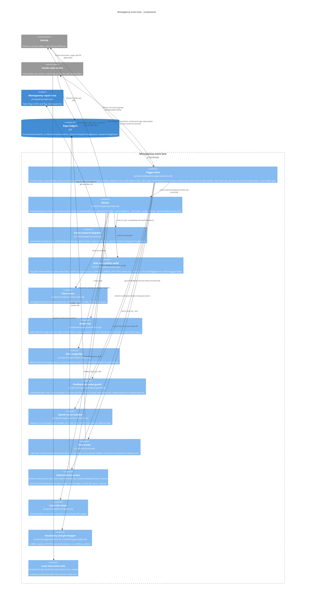

# Moneypenny event lane

**Technology:** GitHub Actions trigger shim, Node ESM router (scripts/moneypenny/index.mjs), gh CLI, claude-code-action sessions (sonnet default, opus escalation; sonnet for research legs)

**Responsibility:** One router for every issue-driven automation: sweeps receipt issues for never-assessed events, claims feedback labels and plan ready-comments with a 2h lease, screens quiet pulses deterministically, dispatches capped event-research matrix legs behind a spend circuit breaker, reviews dependabot PRs, audits stalls and conflicts on every push, and closes shipped issues

**Code roots:** `.github/workflows/moneypenny-events.yml` · `scripts/moneypenny/` · `scripts/event-scan.mjs` · `scripts/event-material-scan.mjs` · `scripts/event-material-decide.mjs` · `.github/prompts/feedback-build.md` · `.github/prompts/plan-build.md` · `.github/prompts/event-research.md` · `.claude/agents/dep-warden.md` · `.github/actions/app-token/` · `.github/actions/oauth-token-gate/` · `research-dispatch-budget.json` · `research-circuit-breaker.json` · `assessment-cadence.json` · `tests/scripts/moneypenny/`

**Entrypoints:** `.github/workflows/moneypenny-events.yml` · `node scripts/moneypenny/index.mjs`

**Grounding:** moneypenny-events.yml header ('this file is a trigger shim and nothing else'); scripts/moneypenny/index.mjs CLI flags; docs/MONEYPENNY.md 'Authority'; docs/ROUTINES.md Active table row

**Refuter's verdict:** grounded — Change the model label to "claude-code-action sessions (feedback/plan tier via model-tier.mjs: haiku light / sonnet default / opus escalation, plans on opus; sonnet pinned for research legs and dependabot review)". Also 

## Where it sits

| From | To | What | How | Refuter |
|---|---|---|---|---|
| github | mp_events | push main, issues labeled, issue_comment created, dependabot pull_request opened, workflow_dispatch | Actions | grounded — Optional precision: label the edge "pull_request opened (job-gated to dependabot[bot], line 133)" and "issues labeled (feedback/plan)". The label as written would not mislead a build session. |
| mp_events | ccp | build-feedback, build-plan, build-events matrix legs, dep-warden sessions | claude-code-action, CLAUDE_CODE_OAUTH_TOKEN | grounded — Optional: add the tech detail to the edge label, e.g. "anthropics/claude-code-action@v1 (pinned cfc3eb22), OAuth token". Also say that build-events legs are fanned out per due event through a route → workflow_dispatch re |
| mp_events | github | Claim leases, receipt issues, labels, screen PRs, re-dispatch | gh with App token; refs/tags/claim/<slug> | grounded — Optional: add "comment/close issues" to the label and write the technology as "gh CLI + REST/GraphQL". Also cite scripts/moneypenny/labels.mjs and scripts/moneypenny/gh.mjs as evidence. |
| mp_events | mp_repair | Hands over conflicted PRs and stalled research issues | gh workflow run moneypenny-repair.yml -f pr_number / issue_number | grounded — Change the evidence to scripts/moneypenny/index.mjs commentAndFlagConflict (pr_number dispatch) plus stallRepairDispatch/dispatchEventStallRepair (one batched issue_number dispatch per audit run), triggered by the `--aud |
| mp_events | ledgers | Research write-ups and screen rows land via PRs | docs/research/events/<id>.md, src/domain/market-events/<id>.json | grounded — Change the label to name what actually does the writing and where it goes: "Research session (research/<event-id> branch) and deterministic screen (moneypenny/screen-* branch) → PR with auto-merge → docs/research/events/ |

## Components

_Caption — components of Moneypenny event lane, from the paths on each element._

| Component | Path | Responsibility |
|---|---|---|
| **Trigger shim** | `.github/workflows/moneypenny-events.yml` | Declares the triggers (push main, issues labeled, issue_comment created, dependabot pull_request opened, workflow_dispatch scan/audit/release-claim), the per-event concurrency group, and the jobs route, build-feedback, build-plan, build-events (matrix, max-parallel 8, sonnet, --max-turns 150) and dep-warden; mints an App token per job via .github/actions/app-token and gates on CLAUDE_CODE_OAUTH_TOKEN via .github/actions/oauth-token-gate |
| **Router** | `scripts/moneypenny/index.mjs` | route() is pure (event + deps → intents); execute()/runIntents() is the only impure half; owns claimHandoff/releaseClaim (refs/tags lease, pinned by tests/arch/lease-namespace.spec.ts), claimFeedback, claimPlan, sweepShipped, stallRepairDispatch and the CLI flags |
| **Event-research dispatch** | `scripts/moneypenny/events.mjs` | routeSweep/routeReceipts open one [event-research] receipt issue per never-assessed event; dueForResearch dedupes against open research/* PR heads and caps the batch from research-dispatch-budget.json (close-outs first) |
| **Stall and conflict audit** | `scripts/moneypenny/audit.mjs` | audit() emits flag-stall / silent-feedback / plan-ready-stall / flag-conflict intents with stall-flagged and conflict-flagged labels as memory; CONFLICT_REPAIR_CAP 3 escalates to needs-eric |
| **Claim lease support** | `scripts/moneypenny/claim-lease.mjs` | CLAIM_TTL_MS (2h), claimAgeOf, claimStamp, claimFailureReason for the refs/tags/claim/<slug> compare-and-set |
| **Model tier** | `scripts/moneypenny/model-tier.mjs` | modelTier(body): sonnet default, opus escalation from the issue's skynet-spec block readiness/criteria; plan issues stay on opus |
| **Plan ready-flip** | `scripts/moneypenny/plan-claim.mjs` | isReadySignal/hasPlanLabel/planReadyIntent: whole-comment ready patterns on plan-labelled issues (the workflow's if: already checked author_association) |
| **Feedback outcome guard** | `scripts/moneypenny/feedback-guard.mjs` | visibleOutcome(): a feedback/<n> PR, a terminal label or a comment beyond the receipt; otherwise posts needs-eric; interactiveHandoff() applies needs-session on a Sliced hand-off |
| **Spend circuit breaker** | `scripts/moneypenny/circuit-breaker.mjs` | checkCircuitBreaker(): rolling window over total_cost_usd from run logs against research-circuit-breaker.json; trip state is a label on a tracking issue, cleared by a human |
| **Due oracle** | `scripts/event-scan.mjs` | --due lists events owed research (never-assessed, interval-elapsed, event-passed-unscored, forward-test-due) from src/domain/market-events/<id>.json and docs/research/events/<id>.md 'Last assessed' headers, banded by assessment-cadence.json; --validate is a CI gate |
| **Deterministic screen** | `scripts/event-material-scan.mjs, scripts/event-material-decide.mjs, scripts/moneypenny/open-screen-pr.mjs` | For interval-elapsed pulses, probes price/VIX movement; quiet ones get a ledger row committed on a moneypenny/screen-* branch and a screen PR (never a direct push, never a session) |
| **Last-mile closer** | `scripts/moneypenny/shipped.mjs` | routeShipped/resolveShipped/prIsMerged close feedback and event-research issues whose PR merged, because Closes # links do not fire for bot-authored bot-merged PRs |
| **Vocabulary and gh wrapper** | `scripts/moneypenny/labels.mjs, scripts/moneypenny/gh.mjs` | LABELS registry (managed vs registered), FOOTER, ensureVocabulary/ensureLabel; sh, isTransientGhError, withRetry, ghRest, ghRestAll |
| **Lane instruction sets** | `.github/prompts/feedback-build.md, .github/prompts/plan-build.md, .github/prompts/event-research.md, .claude/agents/dep-warden.md` | The complete orders each claude-code-action session reads first; envelope-protected so no lane can rewrite its own instructions |
