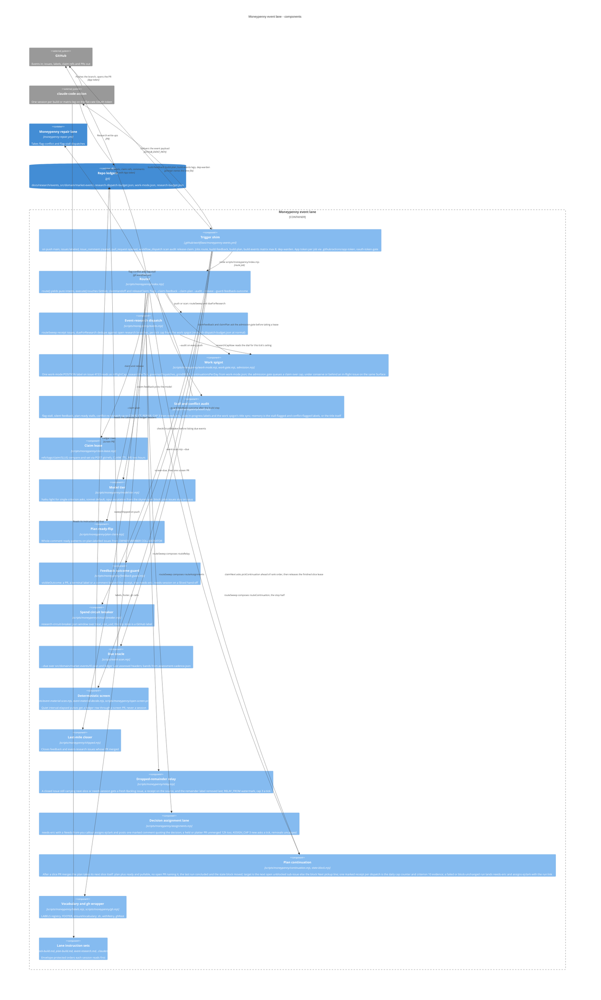

# Moneypenny event lane

**Technology:** GitHub Actions trigger shim, Node ESM router (scripts/moneypenny/index.mjs), gh CLI, claude-code-action sessions (sonnet default, opus escalation; sonnet for research legs)

**Responsibility:** One router for every issue-driven automation: sweeps receipt issues for never-assessed events, claims feedback labels and plan ready-comments with a 2h lease, screens quiet pulses deterministically, dispatches capped event-research matrix legs behind a spend circuit breaker, reviews dependabot PRs, audits stalls and conflicts on every push, and closes shipped issues

**Code roots:** `.github/workflows/moneypenny-events.yml` · `scripts/moneypenny/` · `scripts/event-scan.mjs` · `scripts/event-material-scan.mjs` · `scripts/event-material-decide.mjs` · `.github/prompts/feedback-build.md` · `.github/prompts/plan-build.md` · `.github/prompts/event-research.md` · `.claude/agents/dep-warden.md` · `.github/actions/app-token/` · `.github/actions/oauth-token-gate/` · `research-dispatch-budget.json` · `research-circuit-breaker.json` · `work-mode.json` · `assessment-cadence.json` · `tests/scripts/moneypenny/`

**Entrypoints:** `.github/workflows/moneypenny-events.yml` · `node scripts/moneypenny/index.mjs`

**Grounding:** moneypenny-events.yml header ('this file is a trigger shim and nothing else'); scripts/moneypenny/index.mjs CLI flags; docs/MONEYPENNY.md 'Authority'; docs/ROUTINES.md Active table row

**Refuter's verdict:** grounded — Change the model label to "claude-code-action sessions (feedback/plan tier via model-tier.mjs: haiku light / sonnet default / opus escalation, plans on opus; sonnet pinned for research legs and dependabot review)". Also 

## Where it sits

| From | To | What | How | Refuter |
|---|---|---|---|---|
| github | mp_events | push main, issues labeled, issue_comment created, dependabot pull_request opened, workflow_dispatch | Actions | grounded — Optional precision: label the edge "pull_request opened (job-gated to dependabot[bot], line 133)" and "issues labeled (feedback/plan)". The label as written would not mislead a build session. |
| mp_events | ccp | build-feedback, build-plan, build-events matrix legs, dep-warden sessions | claude-code-action, CLAUDE_CODE_OAUTH_TOKEN | grounded — Optional: add the tech detail to the edge label, e.g. "anthropics/claude-code-action@v1 (pinned cfc3eb22), OAuth token". Also say that build-events legs are fanned out per due event through a route → workflow_dispatch re |
| mp_events | github | Claim leases, receipt issues, labels, screen PRs, re-dispatch | gh with App token; refs/tags/claim/<slug> | grounded — Optional: add "comment/close issues" to the label and write the technology as "gh CLI + REST/GraphQL". Also cite scripts/moneypenny/labels.mjs and scripts/moneypenny/gh.mjs as evidence. |
| mp_events | mp_repair | Hands over conflicted PRs and stalled research issues | gh workflow run moneypenny-repair.yml -f pr_number / issue_number | grounded — Change the evidence to scripts/moneypenny/index.mjs commentAndFlagConflict (pr_number dispatch) plus stallRepairDispatch/dispatchEventStallRepair (one batched issue_number dispatch per audit run), triggered by the `--aud |
| mp_events | ledgers | Research write-ups and screen rows land via PRs | docs/research/events/<id>.md, src/domain/market-events/<id>.json | grounded — Change the label to name what actually does the writing and where it goes: "Research session (research/<event-id> branch) and deterministic screen (moneypenny/screen-* branch) → PR with auto-merge → docs/research/events/ |

## Components

```mermaid
C4Component
  title Moneypenny event lane - components
  UpdateLayoutConfig($c4ShapeInRow="4", $c4BoundaryInRow="1")

  System_Ext(github, "GitHub", "Events in; issues, labels, claim refs and PRs out")
  System_Ext(cca, "claude-code-action", "One session per build or matrix leg on the flat-rate OAuth token")
  Container(mp_repair, "Moneypenny repair lane", "moneypenny-repair.yml", "Takes flag-conflict and flag-stall dispatches")
  ContainerDb(ledgers, "Repo ledgers", "git", "docs/research/events, src/domain/market-events, research-dispatch-budget.json, work-mode.json, research-budget.json")

  Container_Boundary(lane, "Moneypenny event lane") {
    Component(wf, "Trigger shim", ".github/workflows/moneypenny-events.yml", "on push main, issues labeled, issue_comment created, pull_request opened, workflow_dispatch scan audit release-claim. Jobs route, build-feedback, build-plan, build-events matrix max 8, dep-warden. App token per job via .github/actions/app-token, oauth-token-gate")
    Component(router, "Router", "scripts/moneypenny/index.mjs", "route() yields pure intents, execute() touches GitHub; claimHandoff and releaseClaim; flags --claim-feedback --claim-plan --audit --release --guard-feedback-outcome")
    Component(events, "Event-research dispatch", "scripts/moneypenny/events.mjs", "routeSweep receipt issues, dueForResearch dedupe against open research branches, per-tick cap from the work spigot (research-dispatch-budget.json at normal)")
    Component(spigot, "Work spigot", "scripts/moneypenny/work-mode.mjs, work-gate.mjs, admission.mjs", "One work-mode:POSITION label on issue 4153 reads as inFlightCap, researchPerTick, governorDispatches, grindWidth, continuationsPerDay from work-mode.json; the admission gate queues a claim over cap, under conserve or behind an in-flight issue on the same Surface")
    Component(audit, "Stall and conflict audit", "scripts/moneypenny/audit.mjs", "flag-stall, silent feedback, plan-ready stalls, conflict re-dispatch up to CONFLICT_REPAIR_CAP 3 then needs-eric, stale in-progress labels and the work spigot's title sync; memory is the stall-flagged and conflict-flagged labels, or the title itself")
    Component(lease, "Claim lease", "scripts/moneypenny/claim-lease.mjs", "refs/tags/claim/SLUG compare-and-set via POST git/refs, CLAIM_TTL_MS two hours")
    Component(tier, "Model tier", "scripts/moneypenny/model-tier.mjs", "haiku light for single-criterion asks, sonnet default, opus escalation from the skynet-spec block; plan issues stay on opus")
    Component(planclaim, "Plan ready-flip", "scripts/moneypenny/plan-claim.mjs", "Whole-comment ready patterns on plan-labelled issues from OWNER MEMBER COLLABORATOR")
    Component(guard, "Feedback outcome guard", "scripts/moneypenny/feedback-guard.mjs", "visibleOutcome: a PR, a terminal label or a comment beyond the receipt, else needs-eric; needs-session on a Sliced hand-off")
    Component(breaker, "Spend circuit breaker", "scripts/moneypenny/circuit-breaker.mjs", "research-circuit-breaker.json window over total_cost_usd; the trip state is a GitHub label")
    Component(eventscan, "Due oracle", "scripts/event-scan.mjs", "--due over src/domain/market-events/ID.json and ledger Last assessed headers; bands from assessment-cadence.json")
    Component(screen, "Deterministic screen", "scripts/event-material-scan.mjs, event-material-decide.mjs, scripts/moneypenny/open-screen-pr.mjs", "Quiet interval-elapsed pulses get a ledger row through a screen PR, never a session")
    Component(shipped, "Last-mile closer", "scripts/moneypenny/shipped.mjs", "Closes feedback and event-research issues whose PR merged")
    Component(relay, "Dropped-remainder relay", "scripts/moneypenny/relay.mjs", "A closed issue still carrying next-slice or needs-session gets a fresh Backlog issue, a receipt on the source, and the remainder label removed last; RELAY_FROM watermark, cap 3 a tick")
    Component(assign, "Decision assignment lane", "scripts/moneypenny/assignments.mjs", "needs-eric with a Needs-from-you callout assigns ejclark and posts one marked comment quoting the decision; a held or platter PR unmerged 12h too; ASSIGN_CAP 3 new asks a tick, removals uncapped")
    Component(continuation, "Plan continuation", "scripts/moneypenny/continuation.mjs, state-block.mjs", "After a slice PR merges the plan takes its next slice itself: plan plus ready and pullable, no open PR naming it, the last run concluded and the state block moved; target is the next open unblocked sub-issue else the block Next pickup line; one marked receipt per dispatch is the daily cap counter and criterion 10 evidence; a failed or block-unchanged run lands needs-eric and assigns ejclark with the run link")
    Component(vocab, "Vocabulary and gh wrapper", "scripts/moneypenny/labels.mjs, scripts/moneypenny/gh.mjs", "LABELS registry, FOOTER, ensureVocabulary; sh, withRetry, ghRest")
    Component(prompts, "Lane instruction sets", ".github/prompts/feedback-build.md, plan-build.md, event-research.md, .claude/agents/dep-warden.md", "Envelope-protected orders each session reads first")
  }

  Rel(github, wf, "Delivers the event payload", "GITHUB_EVENT_PATH")
  Rel(wf, router, "node scripts/moneypenny/index.mjs", "route job")
  Rel(router, events, "push or scan: routeSweep and dueForResearch")
  Rel(router, spigot, "claimFeedback and claimPlan ask the admission gate before taking a lease")
  Rel(events, spigot, "researchCapNow reads the dial for this tick's ceiling")
  Rel(router, audit, "--audit on every push")
  Rel(router, lease, "claim and release")
  Rel(router, tier, "--claim-feedback picks the model")
  Rel(router, planclaim, "--claim-plan")
  Rel(router, shipped, "sweepShipped on push")
  Rel(events, relay, "routeSweep composes routeRelay")
  Rel(events, assign, "routeSweep composes routeAssignments")
  Rel(events, continuation, "routeSweep composes routeContinuation, the stop half")
  Rel(router, continuation, "claimNext asks pickContinuation ahead of rank order, then releases the finished slice lease")
  Rel(router, vocab, "labels, footer, gh calls")
  Rel(wf, breaker, "checkCircuitBreaker before listing due events")
  Rel(wf, eventscan, "event-scan.mjs --due")
  Rel(wf, screen, "screen-due, then one screen PR")
  Rel(wf, cca, "build-feedback, build-plan, build-events legs, dep-warden", "prompt names the lane file")
  Rel(cca, prompts, "Reads its instruction set first")
  Rel(wf, guard, "--guard-feedback-outcome after the build step")
  Rel(audit, mp_repair, "flag-conflict and flag-stall", "gh workflow run")
  Rel(router, github, "Issues, labels, claim refs, comments", "gh with App token")
  Rel(cca, github, "Pushes the branch, opens the PR", "App token")
  Rel(cca, ledgers, "Research write-ups", "PR")
  Rel(screen, ledgers, "Ledger rows", "screen PR")
  Rel(eventscan, ledgers, "Reads the calendar and ledger headers")
```

_Caption — components of Moneypenny event lane, from the paths on each element._

| Component | Path | Responsibility |
|---|---|---|
| **Trigger shim** | `.github/workflows/moneypenny-events.yml` | Declares the triggers (push main, issues labeled, issue_comment created, dependabot pull_request opened, workflow_dispatch scan/audit/release-claim), the per-event concurrency group, and the jobs route, build-feedback, build-plan, build-events (matrix, max-parallel 8, sonnet, --max-turns 150) and dep-warden; mints an App token per job via .github/actions/app-token and gates on CLAUDE_CODE_OAUTH_TOKEN via .github/actions/oauth-token-gate |
| **Router** | `scripts/moneypenny/index.mjs` | route() is pure (event + deps → intents); execute()/runIntents() is the only impure half; owns claimHandoff/releaseClaim (refs/tags lease, pinned by tests/arch/lease-namespace.spec.ts), claimFeedback, claimPlan, sweepShipped, stallRepairDispatch and the CLI flags |
| **Event-research dispatch** | `scripts/moneypenny/events.mjs` | routeSweep/routeReceipts open one [event-research] receipt issue per never-assessed event; dueForResearch dedupes against open research/* PR heads and caps the batch (close-outs first) at researchCapNow — the work spigot's number for the dial's position, which is research-dispatch-budget.json's maxPerTick at `normal` |
| **Work spigot** | `scripts/moneypenny/work-mode.mjs, scripts/moneypenny/work-gate.mjs, scripts/moneypenny/admission.mjs` | One `work-mode:<position>` label on the tracking issue is the whole state (#3960); work-mode.json holds the per-position numbers (inFlightCap, researchPerTick, governorDispatches, grindWidth, continuationsPerDay) and refuses to load if a position is missing one or is looser than the one above it. resolveWorkMode fails closed to conserve on an unreadable dial; workGate folds in the spend breaker for callers with no import statement (a skill). admitBuild refuses under halt, under conserve without `fast-track`, over the in-flight cap, or behind an in-flight issue sharing the capsule's Surface cell; a `/grind` run reads the same gate and refuses a batch wider than grindWidth |
| **Stall and conflict audit** | `scripts/moneypenny/audit.mjs` | audit() emits flag-stall / silent-feedback / plan-ready-stall / flag-conflict / clear-in-progress / retitle-work-mode intents with stall-flagged and conflict-flagged labels as memory; CONFLICT_REPAIR_CAP 3 escalates to needs-eric, and workModeRetitle keeps the spigot's tracking-issue title in step with the position the lanes read |
| **Claim lease support** | `scripts/moneypenny/claim-lease.mjs` | CLAIM_TTL_MS (2h), claimAgeOf, claimStamp, claimFailureReason for the refs/tags/claim/<slug> compare-and-set |
| **Model tier** | `scripts/moneypenny/model-tier.mjs` | modelTier(body): sonnet default, opus escalation from the issue's skynet-spec block readiness/criteria; plan issues stay on opus |
| **Plan ready-flip** | `scripts/moneypenny/plan-claim.mjs` | isReadySignal/hasPlanLabel/planReadyIntent: whole-comment ready patterns on plan-labelled issues (the workflow's if: already checked author_association); refuses a plan carrying a parking label (isBuildable, labels.mjs), and a Claude-footed comment counts only when its first line is CLAUDE_READY_LINE |
| **Feedback outcome guard** | `scripts/moneypenny/feedback-guard.mjs` | visibleOutcome(): a feedback/<n> PR, a terminal label or a comment beyond the receipt; otherwise posts needs-eric; interactiveHandoff() applies needs-session on a Sliced hand-off |
| **Spend circuit breaker** | `scripts/moneypenny/circuit-breaker.mjs` | checkCircuitBreaker(): rolling window over total_cost_usd from run logs against research-circuit-breaker.json; trip state is a label on a tracking issue, cleared by a human |
| **Due oracle** | `scripts/event-scan.mjs` | --due lists events owed research (never-assessed, interval-elapsed, event-passed-unscored, forward-test-due) from src/domain/market-events/<id>.json and docs/research/events/<id>.md 'Last assessed' headers, banded by assessment-cadence.json; --validate is a CI gate |
| **Deterministic screen** | `scripts/event-material-scan.mjs, scripts/event-material-decide.mjs, scripts/moneypenny/open-screen-pr.mjs` | For interval-elapsed pulses, probes price/VIX movement; quiet ones get a ledger row committed on a moneypenny/screen-* branch and a screen PR (never a direct push, never a session) |
| **Last-mile closer** | `scripts/moneypenny/shipped.mjs` | routeShipped/resolveShipped/prIsMerged close feedback and event-research issues whose PR merged, because Closes # links do not fire for bot-authored bot-merged PRs; never closes an issue still carrying next-slice |
| **Dropped-remainder relay** | `scripts/moneypenny/relay.mjs` | routeRelay/notRelayableReason/executeRelay carry a CLOSED issue's unbuilt remainder to a fresh [relay] #N issue in Backlog (never ready), because pullable() reads open issues only; the source gets a receipt and loses the remainder label last, which is the idempotency. A not_planned close is never relayed; only closes from the RELAY_FROM watermark forward, RELAY_CAP 3 a tick, oldest first; --list / --apply --backfill drain the historical queue by hand |
| **Decision assignment lane** | `scripts/moneypenny/assignments.mjs` | decisionLine/plan/routeAssignments/executeAssignments: an open needs-eric issue whose above-the-fold Needs-from-you callout states a decision gets ejclark assigned and ONE marked comment quoting that line (the marker is the memory, so it never asks twice); criterion 4 does the same for a hold-merge or platter/ PR unmerged 12h, and criterion 2 removes only the assignments it marked. The assignment is written BEFORE its comment, so the half-write that can happen leaves the phone push and the digest row intact and loses only the quoted copy; criterion 4 outranks criterion 2 on the same number, or a still-held PR would assign/unassign every tick. ASSIGN_CAP 3 new asks a tick (oldest number first) bounds a wrong read; removals are uncapped. plan() is also the digest's Needs-you selector (criterion 12) |
| **Plan continuation** | `scripts/moneypenny/continuation.mjs, scripts/moneypenny/state-block.mjs` | continuationDecision/routeContinuation/pickContinuation (#3818 criteria 9-10): after a plan's slice PR merges, the plan continues itself rather than waiting out its own lease. A plan continues only when it carries plan + ready and is pullable, no open PR NAMES it (derivePrIssues, not the branch), the last dispatched run concluded AND the state block's fingerprint moved; the target is the next open sub-issue whose blockers are all closed (an unread blocker list is unknown, never unblocked), else the block's Next-pickup line. state-block.mjs is the one parser for that format (docs/ISSUES.md): find the block, read its pickup line, fingerprint it, write and read back the receipts. claimNext releases the finished slice's lease (only one stamped before the merge), claims with ctx.continuation (which pins the model to CONTINUED_MODEL, below the top tier) and leaves one marked receipt carrying the run id and the fingerprint — that receipt is the daily cap's counter (continuationsPerDay on the dial) and criterion 10's evidence. A continued run that fails, goes missing past STALL_HOURS, or leaves the block unchanged stops the plan: needs-eric lands first (which unpullables it), then ejclark is assigned with the run link, STOP_CAP 1 a tick. Nothing retries |
| **Vocabulary and gh wrapper** | `scripts/moneypenny/labels.mjs, scripts/moneypenny/gh.mjs` | LABELS registry (managed vs registered), FOOTER, ensureVocabulary/ensureLabel; sh, isTransientGhError, withRetry, ghRest, ghRestAll |
| **Lane instruction sets** | `.github/prompts/feedback-build.md, .github/prompts/plan-build.md, .github/prompts/event-research.md, .claude/agents/dep-warden.md` | The complete orders each claude-code-action session reads first; envelope-protected so no lane can rewrite its own instructions |
