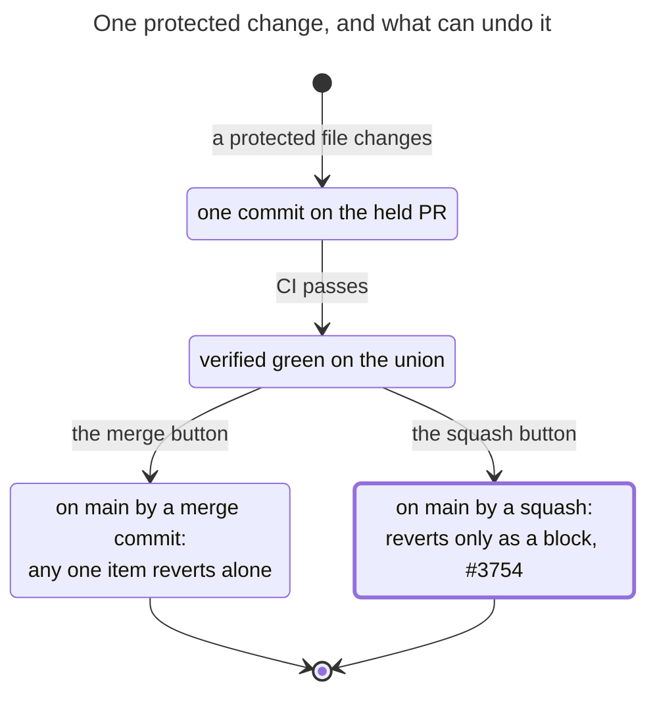

# Ship loop

**Technology:** Bash, curl against the GitHub REST core bucket, python3 for JSON, git

**Responsibility:** Lands a verified branch as a PR without polling: local npm run verify, incident/plan-closure/test-quality preflights, checkbody fridge-rule lint, push, REST open, one auto-merge arm (checkarm refuses protected diffs), and the ship.sh platter subcommand that batches irreversible-class items onto one held PR

**Code roots:** `scripts/ship.sh` · `.claude/skills/ship/SKILL.md` · `scripts/deploy-lag.mjs` · `scripts/incident-scan.mjs` · `scripts/plan-closure-scan.mjs` · `scripts/test-quality-scan.mjs`

**Entrypoints:** `scripts/ship.sh open` · `scripts/ship.sh automerge` · `scripts/ship.sh platter`

**Grounding:** scripts/ship.sh header and cmd_open/cmd_checkbody/cmd_checkarm/cmd_platter functions; tests/arch/ship.spec.ts; .claude/settings.json allow 'Bash(scripts/ship.sh checkbody *)'

**Refuter's verdict:** grounded — Change the technology label to "REST core bucket, plus a single GraphQL call each for auto-merge arming (MCP enable_pr_auto_merge or `ship automerge`) and for promoting a held draft to ready (promote_ready, with REST fal

## Where it sits

| From | To | What | How | Refuter |
|---|---|---|---|---|
| session | ship | Lands branches | /ship skill → scripts/ship.sh | grounded — Optional: a more precise label would be "Lands branches (verify → push → REST PR → arm auto-merge; no polling)", with ship noted as a skill that wraps scripts/ship.sh. Carve-outs get the PR opened but are merged by Eric. |
| ship | envelope | checkarm refuses to arm a protected diff | envelope-scan --check | grounded — Optionally relabel the edge "checkarm refuses to arm a blocking envelope hit (envelope-scan.mjs --check over envelope.json; exit 5)". Note that a diffAware pure insertion under --base is protected but not blocking. autom |
| ship | github | Opens the PR, arms auto-merge, boards platters | REST core bucket, one GraphQL arm | grounded — Optional sharpening: label the edge "REST /pulls (open, label, PATCH body) + git push; GraphQL enablePullRequestAutoMerge (arm; falls back to MCP enable_pr_auto_merge or `ship merge`)". Also mention cmd_merge and platter |

## Lifecycle: One protected change, and what can undo it

_Caption — the lifecycle of one protected change, from the held PR to whichever ending the merge button chooses; the thick state is the one that happens today (every landing since 2026-09-19 was a squash, #3754). Drawn once here; the per-PR record is generated by `scripts/ship.sh platter landed <pr>`._
