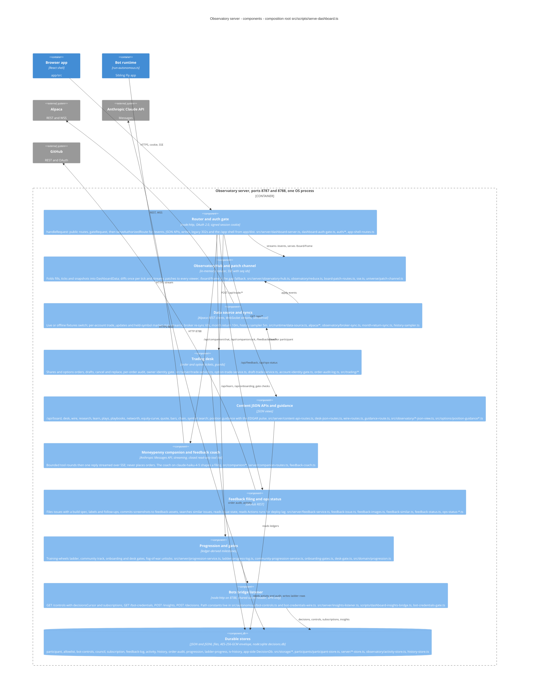

# Observatory server

**Technology:** Node 24 (mise.toml), node:http, TypeScript run via tsx; port 8787 (src/server/resolve-port.ts, PORT/SKYNET_DASHBOARD_PORT) plus an in-process internal listener on 8788; Fly app skynet-capital, process `app`

**Responsibility:** Auth gate (Google/GitHub OAuth or legacy password), the in-memory ObservatoryHub folding Alpaca fills/ticks into DashboardData, the SSE board-patch channel, the JSON API families the shell reads, the trading desk (share/option orders, drafts, cancel/replace, order audit), Moneypenny companion + feedback coach (Anthropic), feedback filing (GitHub), progression/ladder gates, ops status, the /tower three.js scene, and the 8788 bridge the bots poll/post to. Owns every durable store on the skynet_data volume.

**Code roots:** `src/scripts/serve-dashboard.ts` · `src/scripts/dashboard-*.ts` · `src/server` · `src/observatory` · `src/runtime` · `src/alpaca` · `src/adapters` · `src/companion` · `src/options` · `src/trading` · `src/domain` · `src/participants` · `src/storage` · `src/universe` · `src/alerts` · `src/subscriptions` · `src/discovery` · `src/research` · `src/three`

**Entrypoints:** `package.json: serve:dashboard → tsx src/scripts/serve-dashboard.ts` · `package.json: serve:dashboard:offline (SKYNET_DATA_SOURCE=offline)` · `Dockerfile CMD npm run serve:dashboard` · `fly.toml [processes] app`

**Grounding:** src/scripts/serve-dashboard.ts builds createDashboardServer(...).listen(PORT); src/server/dashboard-server.ts routes; src/scripts/dashboard-insights-bridge.ts starts createInsightsListener on resolveInsightsBridgePort (8788, src/server/insights-listener.ts); fly.toml http_service internal_port 8787 and the comment that 8788 is deliberately unforwarded.

**Refuter's verdict:** grounded — Label the 8788 bridge by its real routes: GET /controls (it also carries decisionsCursor and subscriptions), POST /insights, POST /decisions, and a bot-credentials route. Note that its port can be overridden with SKYNET_

## Where it sits

| From | To | What | How | Refuter |
|---|---|---|---|---|
| browser | api | GET /api/* JSON, POST writes, EventSource /events and /api/trade/events, fetch-streamed POST /api/companion | HTTPS JSON, SSE | grounded — Relabel the companion edge as "GET /api/companion (enabled JSON); POST /api/companion/chat (fetch-streamed SSE: delta/handoff/done/error); POST /api/companion/ack". Note that /events (seq-numbered board patch SSE, auth-g |
| api | appvol | Reads and writes every durable store | node:fs JSON/JSONL, AES-256-GCM envelope, node:sqlite | grounded — Relabel the edge as: "Reads/writes all volume-pinned stores (JSON/JSONL files plus SQLite decisions.db under /data; bots-app writes arrive via the :8788 insight bridge)." Add a note that community-progression claim-state |
| bots | api | Polls GET /controls every 30s (carries decisionsCursor + Playbook Store subscriptions), GET /bot-credentials for rotations; POSTs /insights and /decisions batches | HTTP over Fly 6PN to app.process.skynet-capital.internal:8788, shared-secret header, 4 MB decisions cap | grounded — Label: "POST /insights (single record) and /decisions (batches <=100, 4MB cap)"; note GET /bot-credentials is per-persona, triggered by credentialsVersion change on the /controls poll + boot prime, auth via SKYNET_BOT_CR |
| api | alpaca | Reads accounts/positions/orders/portfolio history, options chains, places member orders; opens per-account trade_updates and a held-symbols market-data websocket | REST via src/http/fetch-json.ts, WSS | grounded — No change is required. For a more precise label, add "replaces/cancels orders, reads account activities" and note that the relationship exists in live mode only (offline mode replays fixtures). Optionally note that optio |
| api | anthropic | Companion tool rounds + streamed reply; feedback coach turns | HTTPS JSON, streaming, ANTHROPIC_API_KEY | grounded — Optional: label the relationship "HTTPS/JSON + SSE (Messages API, x-api-key)". Note that the coach uses claude-haiku-4-5 and hardcodes the URL at feedback-coach.ts:166 rather than using companion-tool-rounds.ts ANTHROPIC |
| api | github | Files feedback issues, commits screenshots to feedback-assets, reads issue state and Actions runs; OAuth login | HTTPS REST api.github.com, SKYNET_FEEDBACK_GITHUB_TOKEN; OAuth github.com/login/oauth | grounded — Suggested label: "Files feedback issues, labels them and posts follow-up comments, commits screenshots to the feedback-assets branch, searches for similar issues, reads issue state and Actions runs, commits and compare f |
| api | google | OAuth login | HTTPS | grounded — Optional refinement: label the edge "OAuth code exchange + userinfo (HTTPS). Optional, env-gated by SKYNET_GOOGLE_CLIENT_ID/SECRET." Add a separate user → google edge for the browser authorize redirect, and a parallel ap |
| api | edgar | Reads company_tickers.json and recent 8-K submissions for the guidance pulse | HTTPS JSON, cached 24h/5m | grounded — Optional refinement for the label: "HTTPS GET (User-Agent) to www.sec.gov company_tickers.json (ticker→CIK) and data.sec.gov/submissions/CIK*.json (8-K list), with in-memory caching (5 min for filings; refresh bypasses i |
| tests | api | e2e boots the offline dashboard; unit specs import server, observatory, autonomous and companion modules with fake transports | child process on :8787, ESM import | grounded — Split the element into two edges. (a) e2e/ (Playwright, playwright.config.ts webServer) → dashboard server started with `serve:dashboard:offline`, which sets SKYNET_DATA_SOURCE=offline. That makes src/runtime/data-source |

## Components

_Caption — components of Observatory server, from the paths on each element._

| Component | Path | Responsibility |
|---|---|---|
| **Router and auth gate** | `src/server/dashboard-server.ts, src/server/dashboard-auth-gate.ts, src/server/auth/*, src/server/app-shell-routes.ts, src/server/legacy-redirects.ts, src/server/dashboard-board-routes.ts` | createServer handler: public routes (incl. /tower and /three/scene.js), gateRequest (OAuth session or password), then /events, /board/frame, JSON APIs, write APIs, research docs, legacy 302s, the /app SPA fallback, and the / → /app/ redirect. |
| **Observatory hub and patch channel** | `src/server/observatory-hub.ts, src/observatory/reduce.ts, src/server/board-patch-routes.ts, src/server/sse.ts, src/universe/patch-channel.ts, src/universe/world-patch.ts, src/observatory/ceremony-channel.ts` | Single in-memory DashboardData folded by a pure reducer; one board diff per hub tick shared by every SSE viewer with seq ids, hello/patch/resync events and Last-Event-ID replay. |
| **Data source and syncs** | `src/runtime/data-source.ts, src/alpaca/*, src/adapters/fixture-trading-transport.ts, src/adapters/replay-event-stream.ts, src/observatory/broker-sync.ts, src/observatory/month-return-sync.ts, src/observatory/history-sampler.ts, src/observatory/history-boot.ts, src/scripts/iv-clock-wiring.ts, src/research/iv-sampler.ts, src/adapters/alpaca-atm-quotes.ts` | The live/offline seam (SKYNET_DATA_SOURCE); per-participant Alpaca trading + options clients; held-symbol market-data and per-account trade_updates websockets; the timers (broker re-sync 60s, month-return 10m, equity sampler 5m) that write history and repair the hub, plus the IV clock: one at-the-money implied-volatility sample per tracked name in the session's last half hour, appended under SKYNET_IV_HISTORY_DIR for IV rank. |
| **Trading desk** | `src/server/trade-service.ts, src/server/option-trade-service.ts, src/server/draft-trade-service.ts, src/server/trade-api-routes.ts, src/server/trade-orders-routes.ts, src/server/option-api-routes.ts, src/server/draft-order-route.ts, src/server/account-identity-gate.ts, src/server/order-audit-log.ts, src/trading/*, src/scripts/dashboard-desk-wiring.ts` | Member order flow: review/submit/cancel/replace for shares and options, draft builder, per-order audit log, and the identity gate that only lets an owner trade their own linked account. |
| **Content JSON APIs and guidance** | `src/server/content-api-routes.ts, src/server/desk-json-routes.ts, src/server/wire-routes.ts, src/server/networth-api-routes.ts, src/server/equity-curve-routes.ts, src/server/quote-route.ts, src/server/bars-route.ts, src/server/option-chain-route.ts, src/server/symbol-search-route.ts, src/server/research-service.ts, src/server/learn-api-routes.ts, src/server/plays-api-routes.ts, src/server/playbooks-api-routes.ts, src/server/guidance-route.ts, src/server/guidance-pulse.ts, src/server/guidance-market.ts, src/server/spot-checks-route.ts, src/research/spot-checks.ts, src/observatory/*-json-view.ts, src/options/position-guidance*.ts` | Read-only JSON twins of every view the shell renders, plus position guidance: /api/trade/guidance returns the market only (quotes, spot, research stance, freshness checks against live spot/chain/EDGAR) and the browser applies the member's stake; each fresh read appends one spot cross-check line beside the IV history, summarized at /api/trade/guidance/spot-checks. |
| **Moneypenny companion and feedback coach** | `src/companion/*, src/server/companion-routes.ts, src/server/companion-message-log.ts, src/server/feedback-coach.ts, src/server/feedback-coach-*.ts, src/http/anthropic-reply.ts, src/scripts/dashboard-companion.ts` | Bounded tool rounds over a closed read-only tool list then one streamed reply over SSE; the coach shapes a filing into a build spec; structurally cannot reach any order-placing function (tests/companion/companion-no-order-path.spec.ts). |
| **Feedback filing and ops status** | `src/server/feedback-service.ts, feedback-issue.ts, feedback-images.ts, feedback-status.ts, feedback-followup.ts, feedback-log.ts, feedback-api-routes.ts, feedback-routes.ts, github-api.ts, ops-status-service.ts, ops-status-deploy-lag.ts, ops-status-deploy-verdict.ts, ops-status-routes.ts, src/scripts/dashboard-feedback.ts, src/scripts/dashboard-ops-status.ts` | Files GitHub issues with pseudonymous attribution and a build spec, commits screenshots to the feedback-assets branch, reads issue state for 'your recent feedback', and reads Actions runs to answer 'is main deployed' plus the bots-poll liveness signal. |
| **Progression and gates** | `src/server/progression-service.ts, progression-store.ts, ladder-progress-log.ts, ladder-activity-detector.ts, community-progression-service.ts, community-progression-store.ts, onboarding-gates.ts, onboarding-api-routes.ts, desk-gate.ts, settings-api-routes.ts, src/domain/progression.ts, src/domain/community-progression.ts, src/domain/onboarding.ts, src/scripts/dashboard-ladder-progress.ts` | Training-wheels ladder and community track derived from the activity/order-audit/feedback ledgers, onboarding gates, and the fog-of-war unlocks the shell renders as visible-named-disabled-counted doors. |
| **Bots bridge listener** | `src/server/insights-listener.ts, src/scripts/dashboard-insights-bridge.ts, src/server/bot-credentials-gate.ts, src/server/bot-controls-store.ts, src/autonomous/bot-controls.ts, src/autonomous/decision-wire.ts, src/autonomous/controls-poll-wire.ts, src/autonomous/subscriptions-wire.ts, src/autonomous/insight-record.ts` | Second node:http server on 8788 (6PN only): GET /controls returns Mission Control state + decisionsCursor + Playbook Store subscriptions and records the poll as liveness; GET /bot-credentials hands a bot its own rotated key; POST /insights and POST /decisions land in the app-side stores. |
| **Durable stores** | `src/storage/json-file-store.ts, jsonl-store.ts, secure-envelope.ts, parse-guards.ts, in-memory-keyed-store.ts; src/participants/participant-store.ts; src/server/auth/allowlist-store.ts; src/server/bot-controls-store.ts, subscription-store.ts, council-store.ts, owner-link-store.ts, progression-store.ts, feedback-log.ts, companion-message-log.ts, ladder-progress-log.ts, order-audit-log.ts; src/observatory/activity-store.ts, history-store.ts; src/adapters/jsonl-alert-dismissals.ts; src/autonomous/jsonl-insight-store.ts, decision-db.ts (app-side); src/runtime/volume-guard.ts` | File-backed stores under /data on the skynet_data volume; credentials sealed with AES-256-GCM; every path pinned in fly.toml and gated by tests/arch/volume-persistence.spec.ts. |
