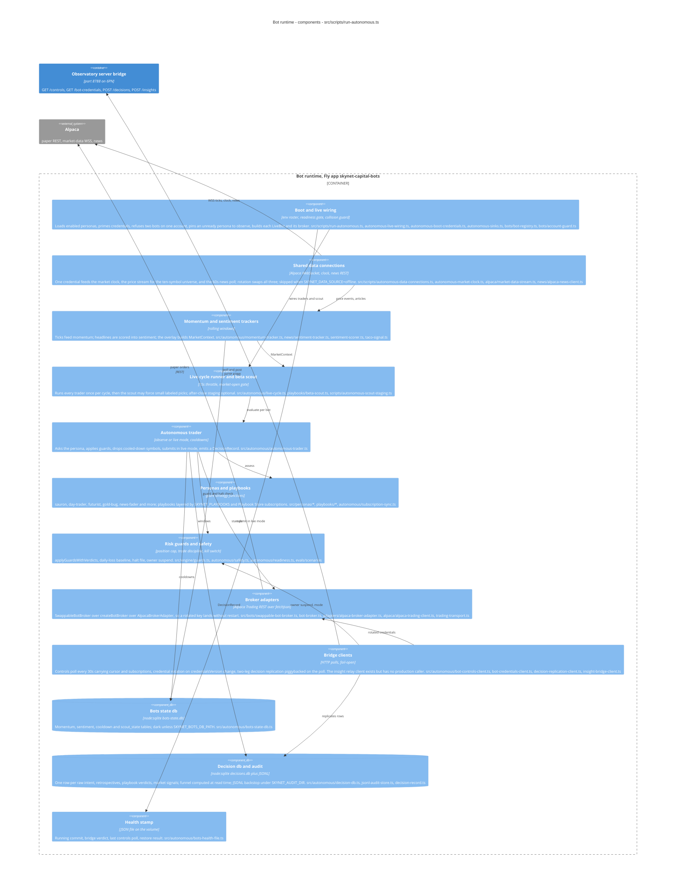

# Bot runtime

**Technology:** Node 24, TypeScript via tsx, node:sqlite; no HTTP listener (no createServer/.listen in its import tree; fly.bots.toml has no [http_service]); Fly app skynet-capital-bots, process `bots`

**Responsibility:** The autonomous trader loop: one credential feeds the market clock, the 10-symbol universe price stream and a 60s news poll; ticks update momentum, headlines update sentiment; every 15s while the market is open each enabled persona assesses, risk guards + safety + owner suspend filter its intents, and in `live` mode (default `observe`) the broker places paper orders. Persists momentum/sentiment/cooldowns/scout state and a decision journal on its own volume, replicates decisions and insights to the observatory over the 6PN bridge, polls Mission Control controls and rotated credentials.

**Code roots:** `src/scripts/run-autonomous.ts` · `src/scripts/autonomous-*.ts` · `src/autonomous` · `src/bots` · `src/personas` · `src/playbooks` · `src/engine` · `src/news` · `src/evals/scenarios` · `src/alpaca` · `src/adapters`

**Entrypoints:** `package.json: run:autonomous → tsx src/scripts/run-autonomous.ts` · `package.json: run:autonomous:offline` · `fly.bots.toml [processes] bots = npm run run:autonomous`

**Grounding:** src/scripts/run-autonomous.ts (UNIVERSE, LIVE_EVAL_INTERVAL_MS=15000, NEWS_POLL_MS=60000, SafetyController, LiveCycleRunner, marketDataStream.start()); fly.bots.toml env SKYNET_AUTONOMOUS_MODE=observe, SKYNET_AUTONOMOUS_BOTS=sauron, SKYNET_INSIGHTS_BRIDGE_URL, SKYNET_BOTS_DB_PATH, SKYNET_AUDIT_DIR, SKYNET_BOTS_HEALTH_PATH; pipeline.yml deploy-bots gated by scripts/bot-relevant.mjs.

**Refuter's verdict:** grounded — Change the replication edge to read "replicates decisions (cursor batches via decision-replication-client) to the dashboard app's insights listener (app.process.skynet-capital.internal:8788) over 6PN, piggybacked on the 

## Where it sits

| From | To | What | How | Refuter |
|---|---|---|---|---|
| bots | botvol | Persists momentum/sentiment/cooldowns/scout state, decision journal, JSONL audit, health stamp | node:sqlite DatabaseSync, node:fs | grounded — Optional detail for the diagram label: the volume at /data holds bots-state.db (momentum/sentiment/cooldowns/scout_state), decisions.db (decision journal, a sibling path taken from SKYNET_BOTS_DB_PATH), audit/*.jsonl (tu |
| bots | api | Polls GET /controls every 30s (carries decisionsCursor + Playbook Store subscriptions), GET /bot-credentials for rotations; POSTs /insights and /decisions batches | HTTP over Fly 6PN to app.process.skynet-capital.internal:8788, shared-secret header, 4 MB decisions cap | grounded — Label: "POST /insights (single record) and /decisions (batches <=100, 4MB cap)"; note GET /bot-credentials is per-persona, triggered by credentialsVersion change on the /controls poll + boot prime, auth via SKYNET_BOT_CR |
| bots | alpaca | Market-data websocket for the 10-symbol universe, market clock, news poll every 60s, paper orders in live mode | WSS stream.data.alpaca.markets/v2/iex, REST paper-api + data.alpaca.markets/v1beta1/news | grounded — Keep the edge. Refine the evidence and label so a build session isn't misled. Order path: SwappableBotBroker (src/bots/swappable-bot-broker.ts) → createBotBroker (src/bots/bot-broker.ts) → AlpacaBrokerAdapter/AlpacaTradi |
| tests | bots | Specs the cycle runner, trader, guards, safety, bridge clients and offline runner | ESM import, in-memory broker | **not grounded** — Relabel as: tests -> bots: "Specs the live cycle runner, AutonomousTrader, safety/equity-watch/breakers, and the bridge clients (insight, decision-replication, bot-controls, credentials, subscriptions); tests/engine spec |

## Components

_Caption — components of Bot runtime, from the paths on each element._

| Component | Path | Responsibility |
|---|---|---|
| **Boot and live wiring** | `src/scripts/run-autonomous.ts, src/scripts/autonomous-live-wiring.ts, src/scripts/autonomous-boot-credentials.ts, src/scripts/autonomous-sinks.ts, src/scripts/autonomous-offline-runner.ts, src/bots/bot-registry.ts, src/bots/bot.ts, src/bots/account-guard.ts` | Resolves the enabled roster (SKYNET_AUTONOMOUS_BOTS, hardcore overrides), primes per-bot Alpaca credentials (env or bridge), refuses account collisions, gates each persona's mode on its readiness pack, and wires every LiveBot; offline mode replays fixtures against in-memory brokers. |
| **Shared data connections** | `src/scripts/autonomous-data-connections.ts, src/scripts/autonomous-market-clock.ts, src/alpaca/market-data-stream.ts, src/alpaca/market-data-stream-events.ts, src/news/alpaca-news-client.ts` | One credential (bots[0]) feeds the Alpaca clock refresh, the wss://stream.data.alpaca.markets/v2/iex price stream for UNIVERSE, and the 60s news poll; replaceCredentials swaps all three on rotation. |
| **Momentum and sentiment trackers** | `src/autonomous/momentum-tracker.ts, src/news/sentiment-tracker.ts, src/news/sentiment-scorer.ts, src/news/taco-signal.ts, src/indicators/*` | Rolling price window per symbol (SKYNET_MOMENTUM_WINDOW) and scored-headline window (SKYNET_SENTIMENT_WINDOW) overlaid into the MarketContext each cycle reads. |
| **Live cycle runner and beta scout** | `src/autonomous/live-cycle.ts, src/playbooks/beta-scout.ts, src/scripts/autonomous-scout-staging.ts, src/autonomous/equity-watch.ts, src/autonomous/day-open-equity.ts` | Every 15s while the market is open: read equity, run each trader, then let the beta scout force up to N labeled picks when nothing organic traded (SKYNET_BETA_FORCING; '+stage' arms after-close staging). |
| **Autonomous trader** | `src/autonomous/autonomous-trader.ts, src/autonomous/decision-record.ts, src/autonomous/decision-funnel.ts` | Per-persona evaluate(): assess → applyGuardsWithVerdicts → cooldown filter → submit only in live mode; emits one DecisionRecord per cycle; swapRoster lets a Playbook Store change land without restart. |
| **Personas and playbooks** | `src/personas/*.ts (sauron, sauron-hardcore, day-trader, futurist, gold-bug, news-fader, retail-investor, rumor-trader, banker, prospector, configured-persona), src/playbooks/playbook.ts, registry.ts, tactical-playbook.ts, with-playbooks.ts, src/autonomous/subscription-sync.ts, src/subscriptions/*` | Pure strategy functions over MarketContext; playbooks enabled by SKYNET_PLAYBOOKS and by member subscriptions arriving on the /controls poll. |
| **Risk guards and safety** | `src/engine/guards.ts, src/autonomous/safety.ts, src/autonomous/readiness.ts, src/autonomous/doctrine-effectiveness-breaker.ts, src/evals/scenarios/*, src/domain/earnings-calendar.ts` | Position cap (SKYNET_MAX_POSITION_PCT), S2/E1 trade discipline around prints, daily-loss circuit breaker, halt file kill switch (SKYNET_HALT_FILE), owner suspend from Mission Control, readiness scenarios that pin an unready persona to observe. |
| **Broker adapters** | `src/bots/swappable-bot-broker.ts, src/bots/bot-broker.ts, src/adapters/alpaca-broker-adapter.ts, src/alpaca/alpaca-trading-client.ts, src/alpaca/trading-transport.ts, src/ports/broker.ts, src/http/fetch-json.ts` | BrokerPort over Alpaca's paper Trading API; the swappable wrapper lets a rotated credential replace the transport in place. |
| **Bridge clients** | `src/autonomous/bot-controls-client.ts, bot-credentials-client.ts, bot-credential-fingerprint.ts, insight-bridge-client.ts, decision-replication-client.ts, controls-poll-wire.ts, decision-wire.ts, subscriptions-wire.ts, insight-record.ts` | Fail-open pollers against SKYNET_INSIGHTS_BRIDGE_URL: controls every 30s (carrying the app's decisionsCursor and subscriptions back), credential rotation, insight relay, and the two-leg decision replication (ascending + newest-rows preview). |
| **Bots state db** | `src/autonomous/bots-state-db.ts` | node:sqlite current-state tables (momentum, sentiment, cooldowns, scout day-state) at SKYNET_BOTS_DB_PATH; restored at boot, stamped in health.json. |
| **Decision db and audit** | `src/autonomous/decision-db.ts, decision-db-rows.ts, decision-db-migration.ts, decision-retrospectives.ts, jsonl-audit-store.ts, src/storage/jsonl-store.ts` | Append-only decision journal (one intents row per raw intent, retrospectives, funnel) in a sibling SQLite file; JSONL audit under SKYNET_AUDIT_DIR as the backstop and migration source. |
| **Health stamp** | `src/autonomous/bots-health-file.ts` | Writes /data/health.json (GIT_SHA, pid, bootedAt, bridge verdict, lastControlsPollAt, restore result) so scripts/smoke-bots.sh can read the process's own word without log lag. |
