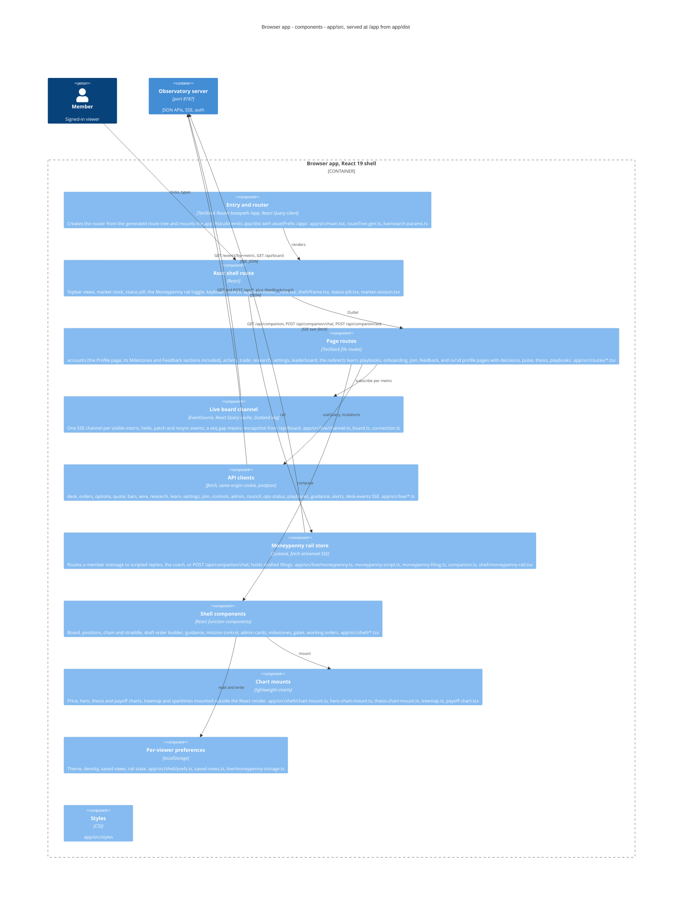

# Browser app

**Technology:** React 19, TanStack Router (basepath /app) + TanStack Query, Zustand, lightweight-charts 5.2; built by Rsbuild/Rspack to app/dist (app/rsbuild.config.ts); TypeScript

**Responsibility:** The observatory shell every member uses: the standings board over a seq-numbered SSE patch stream, accounts and positions, the trade ticket (shares + options), learn/curriculum, playbooks and the Playbook Store, research shelf, settings, onboarding/join, the Moneypenny rail, Mission Control for the owner. Served as static files at /app behind the server's auth gate.

**Code roots:** `app/src/main.tsx` · `app/src/routes` · `app/src/live` · `app/src/shell` · `app/src/styles`

**Entrypoints:** `app/src/main.tsx` · `app/package.json: dev/build/preview (rsbuild)` · `Dockerfile: cd app && npm ci && npm run build`

**Grounding:** app/package.json dependencies; app/rsbuild.config.ts (assetPrefix /app/, dev proxy to :8787); served by src/server/app-shell-routes.ts (serveAppShell from app/dist); app/src/live/channel.ts (EventSource /events), app/src/live/post.ts (POST /api/*).

**Refuter's verdict:** grounded — Optional refinements: label the stream as "SSE /events?by=<metric> (seq patches; resnapshot via /board/frame on a gap)", and label writes as "JSON POST via postJson (mostly /api/*, plus /feedback/coach)". In dev, Rsbuild

## Where it sits

| From | To | What | How | Refuter |
|---|---|---|---|---|
| member | browser | Uses the observatory shell | HTTPS, session cookie | grounded — Fix the evidence chain: dashboard-server.ts handleRequest → gateRequest (auth passes) → serveAuthorizedRoute → serveAppShell for /app/*. gateRequest does not call serveAppShell. The relationship label is fine as is: memb |
| eric | browser | Mission Control suspend/mode toggles, invites, claims | HTTPS | grounded — Relabel the edge as: "Owner toggles suspend/resume (global and per bot) and Moneypenny's model in Mission Control, and manages invites and claims on the settings admin cards". Cite: mission-control.tsx -> app/src/live/co |
| browser | api | GET /api/* JSON, POST writes, EventSource /events and /api/trade/events, fetch-streamed POST /api/companion | HTTPS JSON, SSE | grounded — Relabel the companion edge as "GET /api/companion (enabled JSON); POST /api/companion/chat (fetch-streamed SSE: delta/handoff/done/error); POST /api/companion/ack". Note that /events (seq-numbered board patch SSE, auth-g |

## Components

_Caption — components of Browser app, from the paths on each element._

| Component | Path | Responsibility |
|---|---|---|
| **Entry and router** | `app/src/main.tsx, app/src/routeTree.gen.ts, app/src/live/search-params.ts, app/rsbuild.config.ts` | QueryClientProvider + RouterProvider with basepath /app and custom search-param codec; Rsbuild emits app/dist with assetPrefix /app/. |
| **Root shell route** | `app/src/routes/__root.tsx, app/src/shell/frame.tsx, app/src/shell/status-pill.tsx, app/src/shell/market-session.tsx, app/src/shell/keyboard.tsx` | Topbar view navigation, market clock, fleet-ops status pill, settings/sign-out actions, the Moneypenny rail toggle, keyboard chords, and the Outlet every page renders into. The page frame (shell/frame.tsx) is one full-width stage per route: a page's controls are a row at the top of its own stage, and Settings keeps its list as two columns inside its own stage (#3807 slice 2a). |
| **Page routes** | `app/src/routes/accounts.tsx, activity.tsx, trade.tsx, learn.tsx, learn_.trading.tsx, playbooks.tsx, research.tsx, settings.tsx, onboarding.tsx, join.tsx, feedback.tsx, leaderboard.tsx, index.tsx, u.$id.tsx, u.$id.index.tsx, u.$id.activity.tsx, u.$id.decisions.tsx, u.$id.pulse.tsx, u.$id.thesis.tsx, u.$id.playbooks.tsx` | One TanStack file route per view; each composes shell sections and subscribes to the live layer. |
| **Live board channel** | `app/src/live/channel.ts, app/src/live/board.ts, app/src/live/connection.ts` | One EventSource per visible metric; hello/patch/resync events applied to the React Query cache; Zustand holds connection status + seq; a seq gap triggers a /api/board resnapshot. |
| **API clients** | `app/src/live/*.ts (desk, orders, options, quote, quote-query, bars, wire, research, horizon-params, held-events, learn, settings, join, controls, council, ops-status, playbooks, playbook-store, plays, guidance, manage-handoff, alerts, networth, equity-curve, desk-events, symbol-search, onboarding, admin, feedback, post)` | Typed fetch wrappers over /api/* with same-origin cookies; postJson for every write; desk-events.ts opens the second SSE stream /api/trade/events. |
| **Moneypenny rail store** | `app/src/live/moneypenny.ts, moneypenny-script.ts, moneypenny-filing.ts, moneypenny-storage.ts, companion.ts, app/src/shell/moneypenny-rail.tsx` | Decides whether a member message is scripted, goes to the feedback coach, or streams from POST /api/companion; acks messages for the ladder gate; holds drafted filings the member must send. |
| **Shell components** | `app/src/shell/*.tsx (board-section, calendar-head, cockpit-clock, held-events-line, positions-*, accounts-*, chain-section, chain-straddle, draft-order-builder, guidance-*, mission-control, milestone-*, ladder-gate, trade-gate, option-gate, unlock-gate, working-orders, orders-section, decisions-section, league-card, networth-*, sauron-card, admin-cards …)` | Presentational React components for every section; gates render fog-of-war doors visible, named, disabled and counted. |
| **Chart mounts** | `app/src/shell/chart-mount.ts, chart-data.ts, chart-studies.ts, hero-chart-mount.ts, hero-chart-data.ts, thesis-chart-mount.ts, treemap.ts, payoff-chart.tsx, roster-sparkline.tsx` | lightweight-charts instances mounted imperatively outside React's render cycle; studies (SMA/EMA/RSI/Bollinger) computed client-side. |
| **Per-viewer preferences** | `app/src/shell/prefs.ts, saved-views.ts, default-account.ts, decision-pager.tsx, new-high-ceremony.tsx, alpaca-guide.tsx, app/src/live/moneypenny-storage.ts, guidance.ts` | localStorage-backed per-browser conveniences (theme, density, saved views, default account, dismissed ceremonies) — never shared state. |
| **Styles** | `app/src/styles` | Global CSS imported from main.tsx (index.css) — brand tokens per docs/BRAND.md. |
