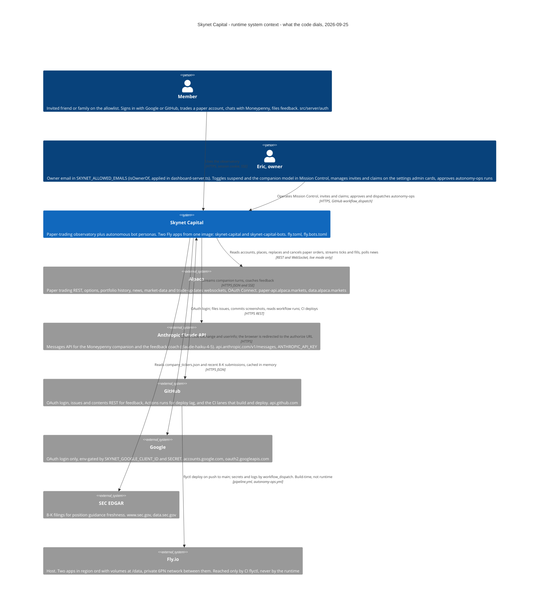
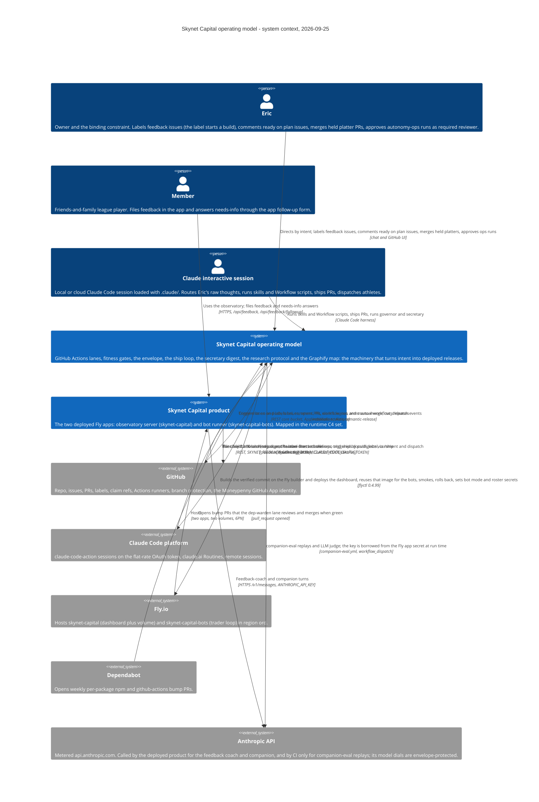
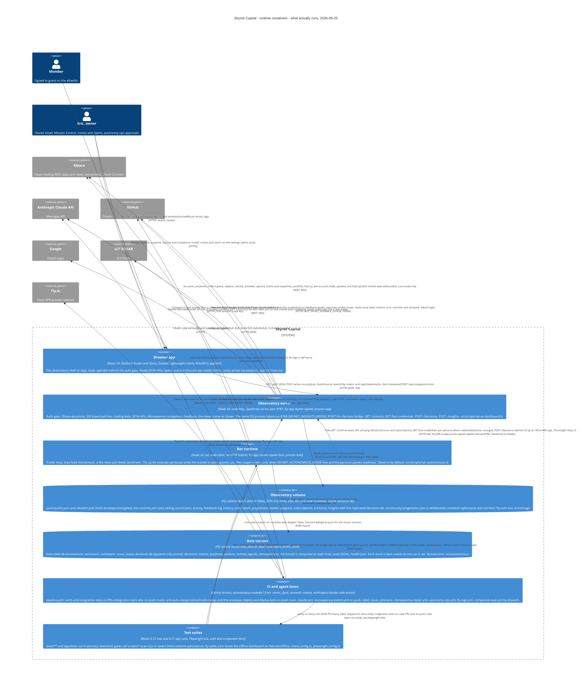
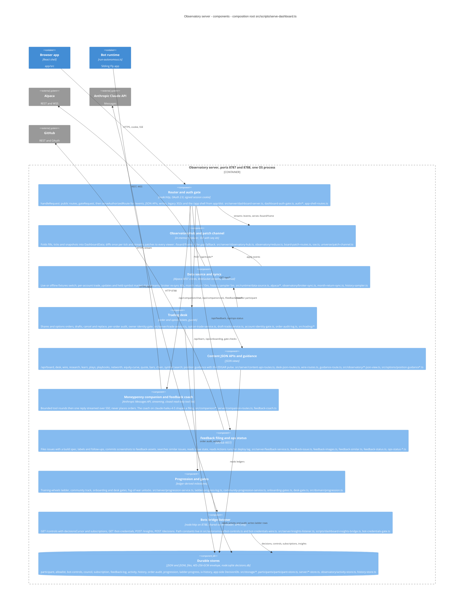
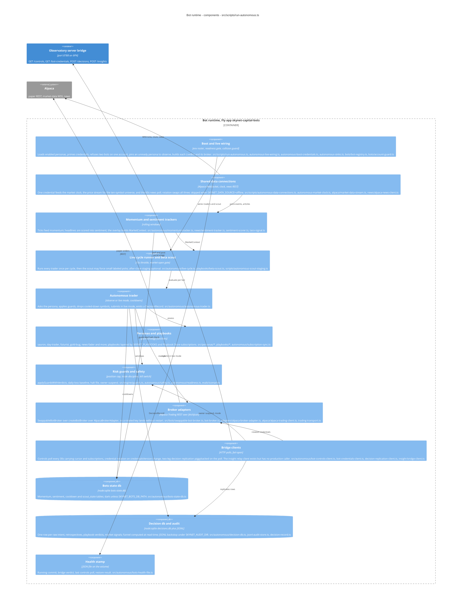
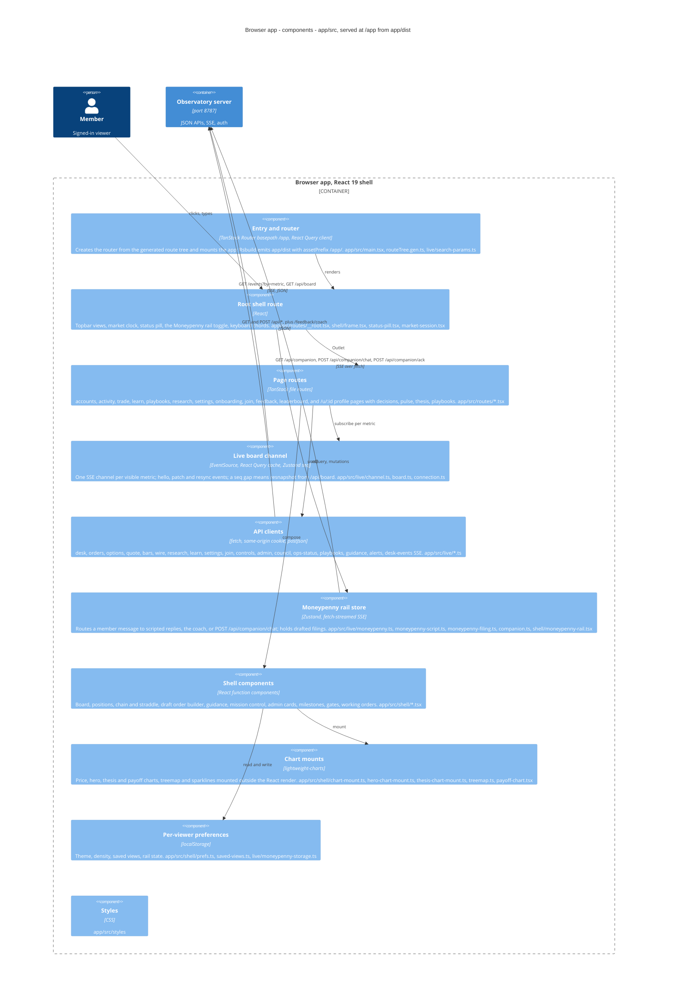
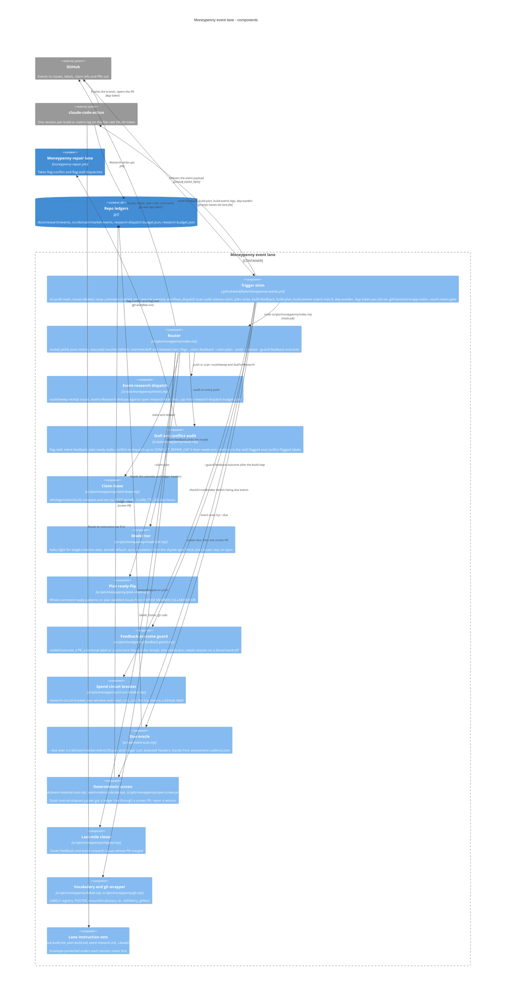
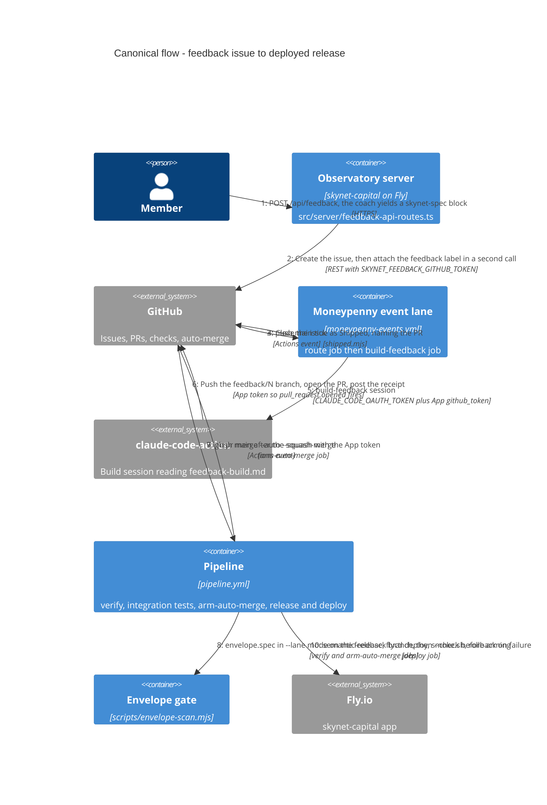

# Skynet Capital — C4 architecture package (final, 2026-09-25, HEAD 245b952 / 72774db)

## 1. What the system is

1. A friends-and-family options **paper-trading** app: a React observatory shell at `/app` served by one Node 24 process (`skynet-capital`, port 8787) that gates members by Google/GitHub OAuth, folds Alpaca fills and ticks into an in-memory `ObservatoryHub`, streams seq-numbered SSE board patches, runs the trading desk, a Moneypenny companion (Anthropic), feedback filing (GitHub) and progression gates.
2. A sibling Fly app (`skynet-capital-bots`, same Docker image, no HTTP listener) runs autonomous personas on a 15 s cycle over a 10-symbol Alpaca stream and a 60 s news poll; paper orders fire only in `live` mode behind guards, safety and owner suspend; it persists SQLite/JSONL state on its own volume and replicates decisions to the app over a private 6PN bridge on 8788.
3. Every durable member record lives on the `skynet_data` volume (JSON/JSONL, AES-256-GCM envelopes, one SQLite journal), pinned in `fly.toml` and gated by `tests/arch/volume-persistence.spec.ts`.
4. The **operating model** is a second system: seven GitHub Actions lanes (pipeline, Moneypenny events/repair, human-directed, three dispatch buttons), an envelope gate for the irreversible class, a REST-first ship loop, advisory fitness coaches with ratchet budgets, a daily claude.ai secretary Routine, git-tracked research ledgers, and a hand-refreshed Graphify map.
5. All diagrams describe what the **code does at HEAD**, not what `docs/LIVING-UNIVERSE.md` intends; every element cites a file, and every verdict correction below is applied in the sources.

## 2. Corrected C4Context sources

### 2a. Runtime system context (D1)



### 2b. Operating-model system context (D6)



## 3. Corrected C4Container sources

### 3a. Runtime system (D2)



### 3b. Operating model (D7)

```mermaid
C4Container
  title Skynet Capital operating model - containers, 2026-09-25
  UpdateLayoutConfig($c4ShapeInRow="4", $c4BoundaryInRow="2")

  Person(eric, "Eric", "Owner: feedback labels, ready comments, held-platter merges, ops approvals")
  Person(member, "Member", "Files feedback in the app, answers needs-info")

  System_Ext(github, "GitHub", "Issues, PRs, labels, claim refs, Actions, branch protection, App identity")
  System_Ext(ccp, "Claude Code platform", "claude-code-action sessions and claude.ai Routines")
  System_Ext(dependabot, "Dependabot", "Weekly per-package bump PRs")
  System_Ext(anthropic, "Anthropic API", "api.anthropic.com/v1/messages, ANTHROPIC_API_KEY")

  System_Boundary(ops, "Skynet Capital operating model") {
    Container(session, "Interactive session toolkit", "Claude Code harness, .claude/", "Orient output style (Focus is the other), SessionStart hooks (commit signing everywhere; mise Node 24 only when CLAUDE_CODE_REMOTE=true), 16 skills, 13 agents (7 sonnet athletes, 3 opus, 3 fable xhigh), grind.js and symbol-sweep.js, duel-log.mjs telemetry hooks")
    Container(ship, "Ship loop", "Bash, curl REST core bucket, python3; one GraphQL call each to arm auto-merge and promote a held draft", "scripts/ship.sh: local verify plus incident, plan-closure and test-quality preflights, checkbody fridge-rule lint, push, open PR over REST, checkarm via envelope-scan, one auto-merge arm; platter boards the irreversible class onto one held PR")
    Container(gates, "Fitness gates and coaches", "Node ESM scans, rstest, Biome, Husky, commitlint, knip, jscpd, dependency-cruiser", "Code-hygiene coaches (arch, dupe, clone, dead, dep-graph, spec-gap, doc-rot, comment-bloat, incident, workflow-lint) each with a budget JSON or arch-grandfather.json; communication-format gates (issue-lint, research-lint, digest, journey, checkbody) block; governor dispatches only the four coaches that have athletes")
    Container(envelope, "Envelope gate", "envelope.json, scripts/envelope-scan.mjs", "Path globs plus a new-runtime-dependency check. --lane mode is red on feedback/, research/ and design/ branches via tests/arch/envelope.spec.ts; --check runs on every PR before arming, filtered on blocking beside the hold-merge check. diffAware was removed 2026-09-17")
    Container(pipeline, "Pipeline", "GitHub Actions, Node 24 from .nvmrc, rstest, Biome, Playwright, commitlint, semantic-release 25, flyctl 0.4.99", "pipeline.yml jobs: verify (PR only; parallel processes on one runner; docs-only skips heavy steps), integration tests (code PRs and push main, against a local offline server), arm-auto-merge, release and deploy, deploy bots")
    Container(mp_events, "Moneypenny event lane", "GitHub Actions trigger shim, scripts/moneypenny/index.mjs, claude-code-action", "Routes push, feedback label, plan ready comment and dependabot PR events into feedback, plan, event-research and dep-warden builds; model tier haiku light, sonnet default, opus escalation, plans on opus; audits stalls and conflicts on every push")
    Container(mp_repair, "Moneypenny repair lane", "GitHub Actions workflow_run and workflow_dispatch, scripts/moneypenny/repair.mjs, claude-code-action opus", "Watches the five enumerated lanes; files one ci-failure capsule per signature; repairs CI failures, PR conflicts and stalled research; four loop guards")
    Container(claude_lane, "Human-directed lane", "GitHub Actions, claude.yml, claude-code-action opus, max 80 turns", "A member comment on an issue or PR, or a new issue with @claude in its body, starts or steers a session under .github/prompts/interactive.md; inert until CLAUDE_CODE_OAUTH_TOKEN is set")
    Container(ops_buttons, "Ops buttons", "GitHub Actions workflow_dispatch, flyctl", "autonomy-ops.yml and companion-eval.yml gated by the autonomy-ops Environment required reviewers; fly-logs.yml is self-serve and read-only; flyctl pinned 0.4.99 except companion-eval, which installs latest")
    Container(secretary, "Secretary digest loop", "claude.ai Routine daily 12:00, scripts/digest-scan.mjs, secretary skill", "When digest-scan says due (5 commits or 7 days), writes the three-tier digest into docs/digests; rides config-audit, comment-bloat, incident and doctrine scans; comms-scan is the landing-meter table")
    Container(graphify, "Graphify structural map", "graphifyy on PyPI, tree-sitter, scripts/refresh-graph.sh", "Manual npm run graph:refresh re-extracts the repo into graphify-out and copies GRAPH_REPORT.md into docs/STRUCTURE-graph.md; doc-rot-scan flags a snapshot over 30 days behind HEAD")
    ContainerDb(ledgers, "Repo ledgers and budgets", "git, Markdown, JSON", "docs/research/events (about 687 ledgers plus TEMPLATE), docs/digests, docs/LESSONS.md, docs/IDEAS.md, CLAUDE.md, root *-budget.json ratchets, assessment-cadence.json, src/domain/market-events/*.json")
  }

  Boundary(flyhost, "Fly.io deploy host", "external") {
    Container(dashboard, "Observatory server", "Node 24, tsx, node:http and SSE, React shell built by rsbuild, Babylon scene bundle", "fly.toml app skynet-capital: serve-dashboard.ts on 8787, private bridge listener on 8788, /data volume; files feedback issues; deploys on every push to main")
    Container(bots, "Bot runner", "Node 24, tsx, same image", "fly.bots.toml app skynet-capital-bots: run-autonomous.ts, observe by default; volume holds bots-state.db, decisions.db, audit, health.json; deploys when bots-deploy-preflight says so or force_bots_deploy")
  }

  Rel(eric, session, "Dumps raw ideas and directives in chat; the session routes act, park, fan, profile, question", "Claude Code")
  Rel(eric, github, "Applies the feedback label, comments ready on plan issues, merges held platters", "GitHub UI")
  Rel(eric, ops_buttons, "Approves as required reviewer and can dispatch autonomy-ops and companion-eval", "autonomy-ops Environment")
  Rel(member, dashboard, "Uses the observatory, files feedback and follow-ups", "HTTPS, OAuth session")
  Rel(dashboard, github, "Files feedback-labelled issues: POST issue, then POST labels", "REST, SKYNET_FEEDBACK_GITHUB_TOKEN")
  Rel(dashboard, anthropic, "Feedback-coach turns (feedback-coach.ts) and companion chat turns (companion-tool-rounds.ts)", "HTTPS")
  Rel(session, ship, "Lands branches: verify, push, REST PR, arm auto-merge, no polling", "ship skill")
  Rel(session, gates, "Runs gate scans for verification and governor target selection; bare scan commands are pre-approved, --candidate is not", "npm run verify, node scripts/*-scan.mjs")
  Rel(session, graphify, "Refreshes the map by hand", "npm run graph:refresh")
  Rel(ship, envelope, "checkarm refuses to arm a blocking envelope hit, exit 5", "envelope-scan --check")
  Rel(ship, github, "REST /pulls open, label and PATCH body plus git push; GraphQL arm, falling back to the MCP arm or ship merge", "REST core bucket")
  Rel(github, pipeline, "pull_request to main, push main, workflow_dispatch force_bots_deploy", "Actions")
  Rel(pipeline, gates, "verify runs typecheck, biome lint and rstest for root and app; the suite includes the tests/arch gate specs, some advisory", "npm test")
  Rel(pipeline, envelope, "Arms only if no changed path is protected and the PR is not held", "envelope-scan --check")
  Rel(pipeline, github, "arm-auto-merge: gh pr merge --auto --squash with the App token", "PR events")
  Rel(pipeline, github, "deploy: semantic-release with GITHUB_TOKEN cuts the tag and Release", "push main")
  Rel(pipeline, dashboard, "Releases and deploys on every push to main, smokes, rolls back to the previous image on smoke failure", "flyctl deploy --remote-only")
  Rel(pipeline, bots, "After deploy succeeds, when the preflight says so (bot-relevant diff vs the stamped GIT_SHA, debounced, deploys when unsure), reuses the dashboard image, smokes, rolls back", "flyctl deploy --image")
  Rel(github, mp_events, "push main, issues labeled feedback or plan, issue_comment ready, pull_request opened (job-gated to dependabot), workflow_dispatch", "Actions")
  Rel(mp_events, ccp, "build-feedback, build-plan, build-events matrix legs fanned per due event via a route re-dispatch, dep-warden", "claude-code-action pinned v1, CLAUDE_CODE_OAUTH_TOKEN")
  Rel(mp_events, github, "Claim leases, receipt issues, labels, comments, closes shipped issues, screen PRs, re-dispatch", "gh CLI plus REST and GraphQL, App token")
  Rel(mp_events, mp_repair, "Conflicted PRs (pr_number, up to 3 attempts then needs-eric) and stalled event-research issues (batched issue_number)", "gh workflow run moneypenny-repair.yml")
  Rel(github, mp_repair, "workflow_run completed for the five watched workflows; conclusion and default-branch filters run in repair.mjs", "Actions")
  Rel(mp_repair, ccp, "Repair sessions: CI-failure repair, PR conflict repair, stalled-issue diagnosis", "claude-code-action opus")
  Rel(mp_repair, github, "Triage files or dedupes the ci-failure capsule with GITHUB_TOKEN; the repair session opens the PR with the App token", "gh")
  Rel(github, claude_lane, "OWNER, MEMBER or COLLABORATOR comment, new or edited, on an issue or PR thread, or a new issue with @claude", "Actions, cancel-in-progress")
  Rel(claude_lane, ccp, "Interactive session", "claude-code-action")
  Rel(dependabot, github, "Opens weekly bump PRs", "pull_request opened")
  Rel(ops_buttons, bots, "flip-mode, set-playbooks, set-beta-forcing, set-hardcore, logs, status, bootstrap; never bot Alpaca credentials", "flyctl secrets set and logs through the Fly API")
  Rel(ops_buttons, anthropic, "companion-eval replays and LLM judge; key borrowed from the Fly app at run time", "companion-eval.yml")
  Rel(ccp, secretary, "Fires daily 12:00; gated by digest-scan --due", "Routine trig_01KaMC2uR3cFW5XTUL6rzPuS")
  Rel(secretary, ledgers, "Writes docs/digests/YYYY-MM-DD.md from TEMPLATE and ships it as an auto-merged docs PR", "ship skill")
  Rel(secretary, eric, "Push-notifies the needs-you count and top headline, only when a digest is due", "claude.ai push")
  Rel(mp_events, ledgers, "Research sessions on research/ID and the deterministic screen on moneypenny/screen-* land ledger files via auto-merged PRs", "docs/research/events, forward-tests")
  Rel(gates, ledgers, "--update after a correction lands writes min(prev, debt) to the budget JSON; CI reads it and fails if debt grew", "manual --update, CI read")
  Rel(bots, dashboard, "GET /controls, GET /bot-credentials, POST /decisions (POST /insights is accepted but the client is unwired)", "private 6PN http on 8788, shared-secret header")
```



## 4. Component diagram sources kept (5)

### 4a. Observatory server (D3)



### 4b. Bot runtime (D4)



### 4c. Browser app (D5)



### 4d. Moneypenny event lane (D8)



### 4e. Fitness gates and coaches (D9)

```mermaid
C4Component
  title Fitness gates and coaches - components
  UpdateLayoutConfig($c4ShapeInRow="4", $c4BoundaryInRow="1")

  Container(pipeline, "Pipeline verify job", "pipeline.yml", "Runs commitlint on the PR title, typecheck, lint and the suite on one runner")
  Container(session, "Interactive session", "Claude Code, .claude/", "Runs scans by hand and governor cycles; husky hooks fire on commit and push")
  ContainerDb(budgets, "Ratchet budgets and ledgers", "JSON and Markdown in git", "the *-budget.json files, arch-grandfather.json, docs/LESSONS.md")

  Container_Boundary(gates, "Fitness gates and coaches") {
    Component(verify, "Verify entry", "package.json verify, .husky/pre-push", "run-p typecheck lint test typecheck:app test:app, CI parity")
    Component(specs, "Arch spec seam", "tests/arch/*.spec.ts, tests/support/advisory-scan.ts", "About 48 specs; debt eyes advisory, contract eyes blocking; some assert inline (volume-persistence, fly-split)")
    Component(biome, "Lint and format", "biome.json, .husky/pre-commit", "Cognitive complexity is a warning; pre-commit auto-formats staged files")
    Component(commitlint, "Commit lint", "commitlint.config.js, .husky/commit-msg, scripts/commit-msg-reflow.mjs", "Conventional commits; CI lints the PR title only")
    Component(size, "Size coach", "scripts/arch-scan.mjs, scripts/code-lines.mjs, arch-grandfather.json", "300 code lines in src, 500 in tests, junk-drawer names; exceptions list, not a numbered budget; drill decompose, athlete decomposer")
    Component(dupe, "Duplication and clone coach", "scripts/dupe-scan.mjs, scripts/clone-scan.mjs, .jscpd.json", "dupe-budget.json and clone-budget.json; drill dedupe, athlete ui-librarian")
    Component(dead, "Dead-code coach", "scripts/dead-scan.mjs, knip.json", "dead-budget.json; drill bury, athlete mortician")
    Component(depgraph, "Dep-graph coach", "scripts/dep-graph-scan.mjs, .dependency-cruiser.cjs", "no-circular and hexagonal layering rules; dep-graph-budget.json; no athlete")
    Component(specgap, "Spec-gap coach", "scripts/spec-gap-scan.mjs", "spec-gap-budget.json; drill backfill, athlete test-backfiller")
    Component(incident, "Learning coach", "scripts/incident-scan.mjs, tests/arch/lessons.spec.ts", "Failed main runs with no docs/LESSONS.md entry; drill retro; also a ship.sh preflight; Moneypenny repair is event-driven, not governor-dispatched")
    Component(docrot, "Doc-rot and comment-bloat", "scripts/doc-rot-scan.mjs, scripts/comment-bloat-scan.mjs", "Dead file refs, missing npm scripts, stale graph age; narration comments")
    Component(wflint, "Workflow contract gates", "scripts/workflow-lint.mjs, workflow-meta-scan.mjs, repair-watchlist-scan.mjs, grind-manifest.mjs", "Blocking: duplicate keys, dangling refs, pure meta literal, repair watchlist, chore tiers")
    Component(formats, "Communication format gates", "scripts/issue-lint.mjs, research-lint.mjs, digest-scan.mjs --validate, journey-scan.mjs, mermaid-lint.mjs, ship.sh checkbody", "Blocking capsule, call-sheet, digest, mermaid and fridge-rule checks")
    Component(researchgates, "Research and ops eyes", "scripts/forward-test-id-scan.mjs, event-scan.mjs --validate, ci-install-duration-scan.mjs, doctrine-scan.mjs", "Forward-test ids, calendar validity, CI install wall-clock, doctrine due dates")
    Component(governor, "Governor and athletes", ".claude/skills/governor/SKILL.md, .claude/agents decomposer ui-librarian mortician test-backfiller", "WIP one per coach, --candidate picks the target, sonnet athletes in worktrees, one cycle PR")
  }

  Rel(pipeline, verify, "Runs on every non-draft code PR", "npm ci then parallel typecheck lint test")
  Rel(session, verify, "Local gate before anything leaves the machine", ".husky/pre-push")
  Rel(verify, specs, "npm test", "rstest")
  Rel(verify, biome, "npm run lint")
  Rel(session, commitlint, "On every commit", ".husky/commit-msg")
  Rel(specs, size, "advisory")
  Rel(specs, dupe, "advisory")
  Rel(specs, dead, "advisory")
  Rel(specs, depgraph, "advisory")
  Rel(specs, specgap, "advisory")
  Rel(specs, incident, "offline half")
  Rel(specs, docrot, "advisory")
  Rel(specs, wflint, "blocking")
  Rel(specs, formats, "blocking")
  Rel(specs, researchgates, "mixed")
  Rel(governor, size, "--candidate")
  Rel(governor, dupe, "--candidate")
  Rel(governor, dead, "--candidate")
  Rel(governor, specgap, "--candidate")
  Rel(session, governor, "governor cycle")
  Rel(size, budgets, "reads arch-grandfather.json")
  Rel(dead, budgets, "--update ratchet")
  Rel(incident, budgets, "reads docs/LESSONS.md")
```



## 5. Dynamic flow — feedback issue to deployed release (D10)



### Validation results (re-run on the final sources)

| # | Diagram | Mermaid Chart MCP (`validate_and_render_mermaid_diagram`) | `scripts/mermaid-lint.mjs` (GitHub's Mermaid 11.17.2) |
|---|---|---|---|
| D1 | Runtime C4Context | valid=true, diagramType=c4, no syntax-error text in SVG | ok |
| D2 | Runtime C4Container | valid=true, c4 | ok (length note: 41 lines, advisory) |
| D3 | Observatory server C4Component | valid=true, c4 | ok |
| D4 | Bot runtime C4Component | valid=true, c4 | ok |
| D5 | Browser app C4Component | valid=true, c4 | ok |
| D6 | Operating C4Context | valid=true, c4 | ok |
| D7 | Operating C4Container | valid=true, c4 | ok (length note: 63 lines, advisory) |
| D8 | Moneypenny event lane C4Component | valid=true, c4 | ok (length note: 44 lines, advisory) |
| D9 | Fitness gates C4Component | valid=true, c4 | ok (length note: 46 lines, advisory) |
| D10 | Feedback-to-deploy C4Dynamic | valid=true, c4 | ok |

MCP results were spilled to files (SVG-heavy); only the structured fields (`title`, `valid`, `diagramType`, SVG length, and a regex for "Syntax error|Parse error" over the SVG) were read back with jq. The lint reported zero problems across all ten blocks; the four notes are the ≤15-node legibility budget, which reference maps in `docs/architecture` are allowed to exceed per `docs/PICTURES.md`.

## 6. Element table — grounding verdict and correction applied

No element was dropped: both `grounded=false` verdicts (#25, #48) carried a correction, which is applied. "Verdict" is the adversarial grounding result; "Applied" is what changed in the sources above.

| # | Element | Verdict | Applied |
|---|---|---|---|
| 1 | Browser app container | grounded | SSE relabelled as one `EventSource` per metric (`/events?by=metric`, `/board/frame` gap fallback); writes as `postJson` (mostly `/api/*` plus `/feedback/coach`); routes list adds activity, feedback, `/u/:id/*` |
| 2 | Observatory server container | grounded | 8788 bridge labelled by real routes and `SKYNET_INSIGHTS_BRIDGE_PORT` override; `src/autonomous/*-wire.ts` named as the shared contract; `ObservatoryHub` confirmed as an exported class (kept) |
| 3 | Bot runtime container | grounded | Replication edge is decisions only, piggybacked on the 30 s `/controls` poll; insight relay marked as having no production caller; target named as the app process listener |
| 4 | Observatory volume | grounded | Added `council.json` (sibling of bot-controls, no env var), `iv-history/` (`SKYNET_IV_HISTORY_DIR`), `allowlist.json` marked encrypted; `community-progression.json` drawn outside the volume |
| 5 | Bots volume | grounded | Files named (`bots-state.db`, `decisions.db` via `decisionDbPathFrom`, `audit/`, `health.json`); funnel marked computed-at-read; `playbook_verdicts`, `market_signals` tables added; best-effort open noted |
| 6 | CI and agent lanes | grounded | Node source is `.nvmrc` (mise is local-dev only); verify/e2e/arm are PR lanes, e2e also on push main; deploy-bots chain spelled out with `force_bots_deploy`; `scripts/ship.sh` moved to the session side; `issue_comment` added to moneypenny-events triggers |
| 7 | Test suites | grounded | tests/arch gates "call scripts or assert inline" (volume-persistence, fly-split inline; workflows.spec uses workflow-lint); app suite is `@rstest/core ^0.11.9` |
| 8 | member → browser | grounded | Evidence chain fixed: `handleRequest → gateRequest → serveAuthorizedRoute → serveAppShell`; `gateRequest` never calls `serveAppShell` |
| 9 | eric → browser | grounded | Relabelled: suspend/resume + companion model in Mission Control (`controls-api-routes.ts`), invites/claims on settings admin cards (`admin-cards.tsx`, `settings.tsx`, `admin-api-routes.ts`); `isOwnerOf` defined in auth-gate, applied in `dashboard-server.ts` |
| 10 | eric → ci | grounded | Notes `target_app` default `skynet-capital-bots`, Environment reviewer approval, never sets bot Alpaca credentials |
| 11 | browser → api | grounded | Companion edge is `GET /api/companion`, `POST /api/companion/chat` (streamed), `POST /api/companion/ack`; `/events` noted outside `/api/*`, routed in `dashboard-server.ts:178` |
| 12 | api → appvol | grounded | Relabelled "all volume-pinned stores"; community-progression ephemeral; feedback images go to GitHub, not the volume; `iv-history` missing from `PERSISTED_STORES` noted in §9 |
| 13 | bots → botvol | grounded | Two SQLite files named; JSONL audit armed in `autonomous-sinks.ts`; each store off unless its env var is set |
| 14 | bots → api | grounded | `/insights` single-record (listener side), `/decisions` batches ≤100 / 4 MB; `/bot-credentials` per persona on `credentialsVersion` change; path constants in `bot-controls.ts` and `bot-credentials-wire.ts`; combined with #3: client unwired |
| 15 | api → alpaca | grounded | Added replace/cancel, activities; options snapshots on the data host; live mode only |
| 16 | bots → alpaca | grounded | Order path `SwappableBotBroker → createBotBroker → AlpacaBrokerAdapter` wired per bot in live-wiring; live only when mode=live and readiness passes; one shared data credential; offline skips Alpaca |
| 17 | api → anthropic | grounded | Labelled HTTPS JSON + SSE, x-api-key; coach on claude-haiku-4-5; `evals/companion/judge.ts` kept off the api edge |
| 18 | api → github | grounded | Expanded label (labels, follow-ups, similar-issue search, commits, compare); `feedback-similar.ts` added; `github-api.ts` described as header helper |
| 19 | api → google | grounded | "OAuth code exchange + userinfo, env-gated"; browser redirect noted in the Context label |
| 20 | api → edgar | grounded | Two hosts, in-memory cache, refresh bypass, only the guidance route |
| 21 | ci → fly | grounded | Split into two edges: automatic push deploy (remote build on Fly) and manual dispatch ops (secrets/logs); preflight cooldown + fail-open + `force_bots_deploy` named |
| 22 | ci → github | grounded | Added `workflow_dispatch` and PR review comments to the trigger list |
| 23 | ci → anthropic | grounded | Auth named as `CLAUDE_CODE_OAUTH_TOKEN`; dep-warden listed as a dependency job, not a build |
| 24 | ci → tests | grounded | "every non-draft PR, heavy steps skipped for docs-only"; integration tests on code PRs and push main; not an e2e of the deployed app |
| 25 | tests → api | grounded | Split into two edges: e2e/ boots the offline server; unit specs use adapter fakes; fixture/replay adapters described as offline-mode adapters tests reuse |
| 26 | tests → bots | **not grounded → corrected** | "offline runner" dropped (no spec imports `autonomous-offline-runner.ts`); guards attributed to `tests/engine`; `InMemoryBroker` marked as the double; coverage gap stated in the label |
| 27 | Interactive session toolkit | grounded | Agents relabelled 7 sonnet / 3 opus / 3 fable xhigh; mise Node 24 step marked cloud-only; `duel-log.mjs` named; two output styles noted |
| 28 | Ship loop | grounded | Technology: REST plus one GraphQL call each for arm and draft promotion; `deploy-lag.mjs` removed from code roots; `envelope-scan.mjs` + `envelope.json` added; held/platter PRs are not armed |
| 29 | Fitness gates and coaches | grounded | Code roots narrowed to the fitness scans + `workflow-lint.mjs`; size uses `arch-grandfather.json`; governor dispatches only the four athlete-backed coaches; incident repair is event-driven |
| 30 | Envelope gate | grounded | Relabelled: path globs + new-runtime-dep check; `--lane` red only on lane branches touching protected paths; `--check` on every PR, filtered on `blocking` beside the hold check; diffAware removed 2026-09-17 |
| 31 | Pipeline | grounded | "parallel processes on one runner"; `superfly/flyctl-actions@master` with flyctl 0.4.99 |
| 32 | Moneypenny event lane | grounded | Model tier is three-level (haiku/sonnet/opus, plans on opus); `research-budget.json` added to ledgers |
| 33 | Moneypenny repair lane | grounded | "watches the five enumerated lanes"; `repair-watchlist-scan.mjs` is a drift gate, not part of the runtime lane |
| 34 | Human-directed lane | grounded | Arming gate on `CLAUDE_CODE_OAUTH_TOKEN`; issues trigger covers opened+labeled with @claude in the body |
| 35 | Ops buttons | grounded | fly-logs is NOT reviewer-gated (self-serve, read-only); companion-eval installs unpinned flyctl |
| 36 | Secretary digest loop | grounded | `comms-scan.mjs` is the landing-meter table, not a ride-along; push carries count + top headline |
| 37 | Graphify structural map | grounded | "re-extracts then copies GRAPH_REPORT.md"; entrypoint `npm run graph:refresh`; watcher `doc-rot-scan.mjs`, 30 days by commit age |
| 38 | Repo ledgers and budgets | grounded | Root paths for `*-budget.json`, `assessment-cadence.json`; "about 687 + TEMPLATE"; `CLAUDE.md` added per rail 5 |
| 39 | Observatory server (ops view) | grounded | Babylon scene bundle in technology; `pipeline.yml` deploy job cited; bridge listener named |
| 40 | Bot runner (ops view) | grounded | Volume contents named; `force_bots_deploy` bypass noted; bridge edge kept |
| 41 | eric → ops | grounded | Relabelled: feedback label starts a build, ready comment starts a plan claim, merges held platters, approves as required reviewer |
| 42 | member → ops | grounded | Routed through the product: `POST /api/feedback` → issue; needs-info answered via `POST /api/feedback/followup` |
| 43 | claude → ops | grounded | Kept; paths named (`grind.js`, `symbol-sweep.js`, ship skill wrapping `ship.sh`) |
| 44 | ops → github | grounded | "Comments on and labels issues" (no script creates issues); semantic-release cited for releases |
| 45 | github → ops | grounded | Added manual `workflow_dispatch`; dispatch-only workflows noted |
| 46 | ops → ccp | grounded | Digest removed from this arrow; modelled as `ccp → ops` / `ccp → secretary` (claude.ai Routine) |
| 47 | ops → fly | grounded | "Builds the verified commit on the Fly builder" (dashboard is a remote build, bots reuse the image); autonomy-ops secrets beyond flip-mode named |
| 48 | dependabot → ops | grounded | "reviews and merges when green"; OAuth-token arming noted in §9 |
| 49 | ops → anthropic | **not grounded → corrected** | Split: `product/dashboard → anthropic` (coach + companion turns) and `ops/ops_buttons → anthropic` (companion-eval replays + judge, key borrowed at run time) |
| 50 | eric → session | grounded | "Dumps raw ideas and directives; the session routes act/park/fan/profile/question" |
| 51 | eric → ops_buttons | grounded | "Approves as required reviewer and can dispatch"; scope limited to autonomy-ops + companion-eval |
| 52 | member → dashboard | grounded | Label adds follow-ups and the OAuth session |
| 53 | dashboard → github | grounded | "POST issue, then POST labels"; token-gated |
| 54 | session → ship | grounded | "verify → push → REST PR → arm auto-merge; no polling" |
| 55 | session → gates | grounded | Relabelled to scans + governor target selection; bare commands pre-approved, `--candidate` is not |
| 56 | session → graphify | grounded | "by hand"; no CI edge drawn |
| 57 | ship → envelope | grounded | "blocking envelope hit, exit 5"; diffAware clause dropped (superseded by #30/#61 and the code read at `envelope-scan.mjs:13-19,118`) |
| 58 | ship → github | grounded | Mixed transport labelled; GraphQL arm with MCP / `ship merge` fallbacks |
| 59 | github → pipeline | grounded | Added `workflow_dispatch force_bots_deploy`; base=main |
| 60 | pipeline → gates | grounded | "PR only, code changes only; suite includes tests/arch specs, some advisory" |
| 61 | pipeline → envelope | grounded | "Arms only if no changed path is protected and the PR is not held"; `--base` ignored by `runCheck` noted in §9 |
| 62 | pipeline → github | grounded | Split into two edges: arm with App token (PR events); semantic-release with `GITHUB_TOKEN` (push main) |
| 63 | pipeline → dashboard | grounded | "every push to main"; rollback conditional on a previous image |
| 64 | pipeline → bots | grounded | Preflight decision spelled out (baseline diff, debounce, deploy-when-unsure) |
| 65 | github → mp_events | grounded | `pull_request opened` marked job-gated to dependabot; labeled narrowed to feedback/plan |
| 66 | mp_events → ccp | grounded | Pinned v1 named; build-events legs fanned via route re-dispatch |
| 67 | mp_events → github | grounded | Added comments/closes; technology "gh CLI + REST/GraphQL" |
| 68 | mp_events → mp_repair | grounded | Evidence corrected to `commentAndFlagConflict` and `dispatchEventStallRepair`; cap semantics (3 then needs-eric) |
| 69 | github → mp_repair | grounded | Main/conclusion filters noted as living in `repair.mjs`; watchlist scan is a CI gate |
| 70 | mp_repair → ccp | grounded | Three step variants named |
| 71 | mp_repair → github | grounded | Split: triage (`repair.mjs`, `GITHUB_TOKEN`) files the capsule; repair session (App token) opens the PR |
| 72 | github → claude_lane | grounded | Relabelled: OWNER/MEMBER/COLLABORATOR, new or edited, or new issue with @claude; cancel-in-progress; inert without token |
| 73 | ccp → secretary | grounded | "gated by digest-scan --due" |
| 74 | secretary → ledgers | grounded | "from TEMPLATE, auto-merged docs PR via /ship" |
| 75 | secretary → eric | grounded | "only when a digest is due"; sender is the claude.ai Routine |
| 76 | mp_events → ledgers | grounded | Names the writers (research session branch, deterministic screen branch) and the markdown targets |
| 77 | gates → ledgers | grounded | "`--update`, manual, min(prev, debt)"; CI read edge folded into the same label; size uses `arch-grandfather.json` |
| 78 | bots → dashboard | grounded | Bridge carries controls, bot-credentials, decisions; insights accepted but client unwired; 6PN 8788 shared-secret |
| 79 | ops_buttons → bots | grounded | "through the Fly API (flyctl secrets set / logs)"; extra actions named; never bot Alpaca credentials |

## 7. Undocumented — merged and deduped (the architecture gap, as evidence)

No document under `docs/` names these (measured by grep over `docs/` excluding the generated `docs/STRUCTURE-graph.md`, `docs/digests`, `docs/JOURNEYS`, `docs/research`).

**Runtime — bots ↔ app bridge and stores**
- `src/autonomous/decision-replication-client.ts`, `decision-wire.ts`, `POST /decisions` in `src/server/insights-listener.ts` — the two-leg decision replication (incl. the 2026-09-23 cursor note); only code headers and issue #2287 describe it.
- The app-side replicated `decisions.db` at `SKYNET_INSIGHTS_DIR/decisions.db` (`dashboard-insights-bridge.ts seedAppDecisionDb`) — `docs/plans/trade-insights-loop.md` covers the JSONL relay, not the SQLite copy.
- `src/server/desk-events-route.ts` + `app/src/live/desk-events.ts` — the app has two SSE streams, not one.

**Runtime — server features with no doc**
- `src/observatory/month-return-sync.ts` (10 m portfolio-history poll behind the league's 1M return).
- `src/server/networth-api-routes.ts` + `networth-json-view.ts` (`/api/accounts/networth`).
- `src/server/community-progression-*.ts`, `src/domain/community-progression.ts`, `SKYNET_COMMUNITY_PROGRESSION_FILE` and its deliberate ephemeral-store decision.
- `src/server/ladder-progress-log.ts`, `ladder-activity-detector.ts`, `src/scripts/dashboard-ladder-progress.ts`, `SKYNET_LADDER_PROGRESS_DIR` — only a `fly.toml` comment.
- `src/server/symbol-search-route.ts`, `quote-route.ts`, `bars-route.ts`.
- `src/server/council-store.ts` → `/data/council.json` (derived path, no env var).

**Runtime — libraries and subsystems**
- `src/http/` (`fetch-json.ts`, the single fetch seam; `anthropic-reply.ts`).
- `src/indicators/` (sma, ema, rsi, bollinger) and `src/math/num.ts`.
- `src/news/` as a subsystem: `sentiment-scorer.ts`, `sentiment-tracker.ts`, `taco-signal.ts`, `SKYNET_TACO_WATCHLIST`.
- `src/options/unusual-flow*.ts`, `in-memory-unusual-flow-store.ts`, `src/adapters/alpaca-options-flow.ts`, `src/ports/options-flow.ts`, CLI `scan-unusual-flow.ts`, `SKYNET_FLOW_DIR`.
- `src/research/iv-history-store.ts`, `iv-instrument.ts`, `iv-rank.ts`, `iv-record.ts`, `in-memory-iv-history.ts`; `SKYNET_IV_HISTORY_DIR` (pinned in `fly.toml` but absent from `PERSISTED_STORES`).
- `src/autonomous/insight-bridge-client.ts` — exported, never called in production (dead-code candidate for the mortician).

**Operational CLIs**
- `src/scripts/record-session.ts`, `capture-option-lifecycle.ts`, `backfill-trade-activity.ts`, `backfill-activity-events.ts` (`record:session`, `capture:lifecycle`, `backfill:activity`, `backfill:activity-events`).
- `scripts/research/earnings-controls.mjs`, `intraday-strategies.mjs`, `session-stats.mjs` (EVENT-RESEARCH.md names only `earnings-cycle` and `intraday-edges`).
- `scripts/design-cards.mjs` (`npm run design:cards`).

**Operating model — lanes, actions, prompts**
- `.github/workflows/companion-eval.yml` — its own header says it has never run end to end; absent from `docs/ROUTINES.md` (dispatch-only, so arguably out of that table's scope) and every other doc.
- `.github/actions/oauth-token-gate/action.yml` (envelope-protected under `.github/actions/**`, described nowhere; `app-token` is).
- `.github/prompts/plan-build.md`, `moneypenny-ci-repair.md`, `moneypenny-event-stall-repair.md` — three of eight lane instruction sets named by no doc.

**Operating model — Moneypenny scripts and budgets**
- `scripts/moneypenny/events.mjs`, `plan-claim.mjs` (#823), `open-screen-pr.mjs` (#915), `repair-logs.mjs` — MONEYPENNY.md and COACHES.md cite only `index.mjs` and `repair.mjs`.
- `research-dispatch-budget.json`, `research-circuit-breaker.json` (CLAUDE.md/COACHES mention a breaker only in passing), `scripts-grouping-budget.json` (no scan script or doc references it).

**Operating model — helper scripts**
- `scripts/commit-msg-reflow.mjs` (`.husky/commit-msg`), `scripts/proxy-reexec.mjs`, `scripts/script-deps.mjs`, `scripts/workflow-labels.mjs` (no doc, no spec), `scripts/issue-lint-audit.mjs`, `scripts/event-title-overlap.mjs`, `scripts/doctrine-decide.mjs`.

**Stale in-code references (doc-rot inside scripts, found while grounding)**
- `scripts/smoke.sh` header cites `.github/workflows/deploy.yml`, which no longer exists.
- `scripts/moneypenny/circuit-breaker.mjs` header cites a `research-daily-budget.json` that is not in the repo (`research-budget.json` is).
- `.claude/agents/dep-warden.md` says Dependabot opens "grouped" PRs; `.github/dependabot.yml` moved to per-package (#3315).
- `scripts/ship.sh:381-385` and `.github/workflows/pipeline.yml:345-348` still describe the removed diffAware/`envelope-widening.mjs` path (`envelope-scan.mjs:13-19` records its removal).

**The gap itself**
- No document under `docs/` carries a system-level architecture map of either the runtime or the operating model; `docs/adr/0008-*.md` and `docs/STRUCTURE-graph.md` cover code structure, `docs/OPERATING-MODEL.md` the portable process. This C4 set is the first.

## 8. Graphify parity — findings and the parity-script sketch

**Snapshot facts.** `docs/STRUCTURE-graph.md` is dated 2026-08-28, built from `f0bdc1f4` (4000 nodes, 11034 edges, 193 communities). HEAD is 72774db; `f0bdc1f4` is not in the shallow clone, `graphify` is not installed and `graphify-out/` is absent, so every finding is read from the committed snapshot and checked against `git ls-files` at HEAD. Doc-rot's 30-day stale-graph rule sits at 28 days and cannot fire in a shallow clone (`staleGraphFindings()` skips gracefully), so nothing red protects this today.

**Headline: the snapshot predates most of what the maps draw.**
- Zero nodes for `app/src` (235 files — the React shell), `src/companion/*`, the bots SQLite stores (`bots-state-db`, `decision-db*`, `jsonl-audit-store`, `bots-health-file`), the bridge clients (`bot-credentials-client`, `decision-replication-client`), `src/three/scene-main.ts`, `scripts/moneypenny/**` (present only under the stale names `postmaster*.mjs` / `ci-medic*.mjs`), every `.yml`, `envelope.json`, `fly.toml`, `Dockerfile`.
- 14 hub files no longer exist at HEAD; ~430 nodes (communities 10, 13, 24, 29, 30, 31, 33, 35, 40, 46, 60, 61, 85, 89) are the deleted server-rendered view layer, including the 158-edge `escapeHtml()` god node's consumers.
- The graph's top cross-community bridge (`playwright-core`, betweenness 0.059) is screenshot tooling (`scripts/shoot/*`), not product code.

**Containers with no (or borrowed) code presence.**
- `runtime:browser` — none. `runtime:botvol` — none. `runtime:bots` — half (communities 4/14/16/75/88 exist; `run-autonomous.ts`, data connections, clock, sinks, bridge clients, `taco-signal` absent). `runtime:api` — newest components missing (companion, guidance/EDGAR, month-return, networth, community-progression, ladder-progress, desk-events, tower scene-main). `runtime:appvol` — every listed file is also under api's `stores` component, so the ContainerDb owns no code of its own.
- `runtime:ci` / `operating:pipeline`, `claude_lane`, `ops_buttons`, `ledgers` — none by construction (YAML, Markdown, JSON are not code-only extracted); presence is limited to `smoke.sh`, `smoke-bots.sh`, `ship.sh`, `deploy-lag.mjs`.
- `operating:secretary` — entrypoint `digest-scan.mjs` absent; only ride-along scans present. `operating:session` — thin (`symbol-sweep.js`, `.mcp.json`, `fetch-claude-docs`); `grind.js`, settings, hooks, skills, agents absent. `operating:mp_events` / `mp_repair` — only under stale names. `operating:envelope` — scan present, manifest absent. `operating:graphify` — `refresh-graph.sh` is a thin omitted community; `doc-rot-scan` is its one code hook.

**Communities with no container.**
- Deleted view layer (staleness, not a map gap — but a parity run against this snapshot reports them unowned).
- Legacy renderer residue still on disk — communities 9 (`escapeHtml`), 51, 53, 73, 82, 94, 125, 133, plus `NavContext`/`renderAcademyBody` in 17 and the SVG renderers in 38: test-only or `dashboard-server`-only importers; neither map names a "legacy HTML shell" component. Mortician/decomposer targets.
- Research and ops CLIs — 36 morning-brief, 103 confirm-print-dates, 151 backfill-trade-activity, 16 (eval half), 67/68 earnings-cycle/intraday-edges, 79/83 IV instrument, 49/69/107 unusual flow, 81 cycle-report-store: excluded by the runtime scope, never claimed by the operating map (~12 communities homeless).
- Tower scene — community 7 (54 nodes, the largest; `src/three`, 22 files, `build:scene`, `/tower`) folded into api's router description.
- Universe/world model — 78, 82, 84, 104, 116, 134 (`src/universe` + world-patch): imported by api (hub) and browser (`app/src/live/board.ts`) and `src/three/kit/params.ts`; drawn nowhere.
- Screenshot tooling — 66, 129, 137 (`scripts/shoot/*`, 22 files).
- Design-handoff lane — 111 `design-extract.mjs` (`docs/HANDOFFS.md`, `design-build.md`); no workflow references it.
- Shared kernel — 0 (`src/domain` types), 6 (`src/alpaca` + adapters), 19 (earnings-calendar), 1 (`src/alerts`), 15 (`src/http`), 108 (participants loader): dual-claimed by api and bots code roots.
- Toolchain manifests — 20, 39, 54, 95, 101 and 11 biome communities: config nodes graphify extracts from `package.json`/tsconfig/knip/biome; exclude by rule.
- 21 thin communities + 705 isolated nodes (persona `*Config` types, `OrderStatus`…): place by their file's community, not as orphans.

**Suggested merges/splits (applied to the system list the script reads, not to the diagrams above).**
1. Prerequisite: refresh the graph before any parity run, and verify graphify's TS extractor covers `.tsx` before trusting the browser count.
2. Split `runtime:api` (19 code roots, ~60% of code communities): (a) Tower scene container (community 7, own build step and static route); (b) World model (`src/universe`, shared by api and browser); (c) Options analytics library (12/43/44/58/63/77 + flow 49/69/107 + IV 64/79/83).
3. Add a `shared` pseudo-container (`src/domain`, `src/alpaca`, `src/adapters`, `src/http`, `src/ports`, `src/storage`, `src/participants`) or a declared precedence rule, so a file-glob check does not double-count.
4. Merge appvol's/botvol's code roots into api's `stores` and bots' `state`/`decisions` components; a ContainerDb owns paths, not code.
5. Add a `Research and ops CLIs` container (or an explicit `excluded` entry) so the parity report can tell "deliberately unmapped" from "forgotten".
6. Tag gates' two halves (code-hygiene vs communication-format) in the system list so gates does not absorb ~35 communities silently.
7. Treat `runtime:tests` as a rule (tests/<dir> mirrors src/<dir>) and keep it a container only for `e2e/`, `fixtures/offline`, `tests/arch`.
8. Rename-proof Moneypenny by owning `scripts/moneypenny/**` by path glob with `aliases` for historical names.
9. Add a `legacy-shell` entry with `kind: residue` so the report routes it to the mortician instead of listing it unowned forever.
10. Drop config-manifest communities by rule (`file_type !== "code"` or path outside `src/**`, `app/src/**`, `scripts/**`, `.claude/workflows/**`).

**Parity-script sketch** — `scripts/system-parity-scan.mjs` (ADR-0008 §B: ToC ⇄ Graphify parity; advisory, `--strict` to fail; house style of `doc-rot-scan.mjs`).

```js
// Inputs:
//   graphify-out/graph.json            networkx node-link: nodes[].{id,label,source_file,file_type,community}, links[].{source,target,relation,confidence}, built_at_commit
//   graphify-out/.graphify_analysis.json   {communities:{cid:[nodeId]}, cohesion:{cid:float}, gods:[{node,degree}]}  (field names from graphifyy 0.9.68 export.py/cli.py)
//   docs/architecture/systems.json     [{id, map:"runtime"|"operating", kind:"code"|"volume"|"external"|"excluded"|"residue", code_roots:[glob], aliases:[glob]}]
const OWNED = 0.6, MIN_NODES = 5, STALE_DAYS = 30;
const CODE_SURFACE = /^(src|app\/src|scripts|\.claude\/workflows)\//;   // parity ignores tests/**, docs, manifests

main():
  g   = readJson("graphify-out/graph.json");  links = g.links ?? g.edges          // legacy key tolerated, as graphify itself does
  an  = readJson("graphify-out/.graphify_analysis.json")
  stale = staleness(g.built_at_commit)   // git merge-base --is-ancestor <sha> HEAD && commit age <= STALE_DAYS; unknown sha -> "unverifiable" (shallow clone), never silent
  systems = readJson("docs/architecture/systems.json")
  owners  = systems.filter(s => s.kind === "code" || s.kind === "residue")
             .map(s => ({...s, rx: [...s.code_roots, ...(s.aliases ?? [])].map(globToRegExp)}))   // reuse envelope-scan.mjs globToRegExp
  fileOf  = n => n.source_file?.replace(/ L\d+.*$/, "")                                          // repo-relative path, drop line suffix
  ownerOf = f => { hits = owners.filter(s => s.rx.some(r => r.test(f))).map(s => s.id); return [hits[0] ?? "<none>", hits.length > 1 ? hits : null] }  // first match wins; dual hits logged as "shared"
  codeNodes = g.nodes.filter(n => n.file_type === "code" && CODE_SURFACE.test(fileOf(n) ?? ""))
  // 1. every ToC system maps to real code
  byOwner = groupBy(codeNodes, n => ownerOf(fileOf(n))[0])
  noCode  = owners.filter(s => s.kind === "code" && !(byOwner[s.id]?.length))              // "system with no code presence" (browser, botvol today)
  // 2. every significant community maps to a named system
  for [cid, members] of Object.entries(an.communities):
    files = uniq(members.map(id => fileOf(nodeById[id])).filter(f => f && CODE_SURFACE.test(f)))
    if (files.length < MIN_NODES) continue                                                  // thin/isolated communities never count as orphans
    tally = countBy(files, f => ownerOf(f)[0]);  [top, share] = argmaxShare(tally)
    label = hubOf(cid, an.gods, members)                                                    // highest-degree member, mirrors GRAPH_REPORT naming
    if (top === "<none>" && share >= OWNED)  orphans.push({cid, label, cohesion: an.cohesion[cid], sample: files.slice(0, 5)})   // "community not named in the ToC"
    else if (share < OWNED)                  straddlers.push({cid, label, tally, cohesion: an.cohesion[cid]})                     // split/merge candidate (shared kernel, api ∪ bots)
  // 3. files no system claims — catches a new directory before it rots into an orphan community
  unowned = uniq(codeNodes.map(fileOf)).filter(f => ownerOf(f)[0] === "<none>")
  shared  = uniq(codeNodes.map(fileOf)).filter(f => ownerOf(f)[1])                        // dual-claimed roots (src/alpaca, src/adapters) — must be zero once a precedence rule exists
  report({stale, noCode, orphans, straddlers, unowned, shared})   // markdown tables (fridge rule: counts first); --json for a CI annotation
  exit(process.argv.includes("--strict") && (noCode.length || orphans.length || stale.expired) ? 1 : 0)   // warn-then-ratchet per ADR-0008 §C; stale graph is exit 2 like doc-rot
```

## 9. Uncertainties a human should settle

1. **Insight relay is dead on the bots side.** `src/server/insights-listener.ts` accepts `POST /insights` and `resolveInsightBridge` exists in `src/autonomous/insight-bridge-client.ts`, but nothing in `src/` calls it (only a comment in `decision-replication-client.ts`). The diagrams say so; whether to bury the client, wire it, or retire the listener route is a product call.
2. **`envelope-scan.mjs --check` ignores `--base`.** `runCheck()` (line 110-118) returns `blocking: true` for every protected path; the `--base` the pipeline passes (pipeline.yml:357) is accepted only in lane mode. `ship.sh:381-385` and `pipeline.yml:345-348` still describe the removed diffAware path. Harmless today (stricter than documented), but the stale comments should go — verdicts #56 and #60/#29 disagreed only because of them.
3. **Fly.io as a runtime external.** The runtime never calls Fly (`ops-status-deploy-lag.ts` explicitly declines the machines API); it is in D1 as the deploy host with the `github → fly` edge labelled build-time. Drop it from D1 if a strict runtime-only reading is wanted.
4. **8788 bridge as a component, not a container.** It is the same OS process as the 8787 server (`serve-dashboard.ts → dashboard-insights-bridge.ts`); someone drawing deployment units by port would split it. A `C4Deployment` view was not produced (the runtime map did not include one).
5. **Operating Context now has a `product` system.** Added to honour verdict #48 (coach/companion turns come from the deployed app, not ops). This is a modelling choice: the Context is 10 elements; if the operating set is meant to exclude the product entirely, fold `product → anthropic` and `member → product` back into the Fly host description.
6. **`SKYNET_IV_HISTORY_DIR` vs `PERSISTED_STORES`.** Pinned in `fly.toml` but missing from `src/runtime/volume-guard.ts`; the volume-persistence spec cannot see it. Either add it to `PERSISTED_STORES` or document the omission.
7. **Two verdicts on the tier ladder.** #32 (three tiers: haiku/sonnet/opus) is applied; the `mp_events` container map originally said two. Confirm plan issues really always land on opus (`model-tier.mjs`).
8. **Counts drift.** 16 skills, 13 agents, ~48 tests/arch specs, ~687 research ledgers, 677 market-event JSON files, 10 universe symbols are HEAD-time directory counts; labels carry "about" where the verdicts noted drift.
9. **Timer cadences are defaults.** Broker re-sync 60 s, month-return 10 m, history sampler 5 m, controls poll 30 s, news poll 60 s, live eval 15 s come from code constants; constructors taking `intervalMs` could be overridden in deployment.
10. **Playwright e2e serves the shell open.** `playwright.config.ts` boots without OAuth env; the router's auth branches are exercised only by `playwright.auth.config.ts` and unit specs.
11. **The secretary Routine is not verifiable from the repo.** `trig_01KaMC2uR3cFW5XTUL6rzPuS` is account-level on claude.ai; evidence is `docs/ROUTINES.md` and the digests in `docs/digests/`. Its ride-along scans live only in the Routine's prompt.
12. **The design-handoff lane has no repo entrypoint.** `docs/HANDOFFS.md` and `.github/prompts/design-build.md` describe it; no workflow references it, so it is not drawn as a container (and community 111 `design-extract.mjs` is homeless in parity).
13. **CI → Anthropic is inferred.** `anthropics/claude-code-action` is a pinned third-party action whose network behaviour was not read; the edge assumes it reaches the Claude Code platform with `CLAUDE_CODE_OAUTH_TOKEN`, not `ANTHROPIC_API_KEY`.
14. **"Bot runtime has no HTTP listener"** rests on `fly.bots.toml` having no `[http_service]` plus a grep for `createServer`/`.listen(` across the bots import roots; transitive imports outside those directories were not exhaustively walked.
15. **Graphify CLI absent.** `graphifyy` is not declared in any manifest and was not installed here, so every parity finding is snapshot-only; the parity script cannot run until the graph is refreshed on a full clone.
16. **Doc-coverage method.** "Undocumented" means no doc under `docs/` names the path and no obvious prose synonym hit; a doc could still describe the behaviour under wording not searched.
17. **Element budgets.** The runtime Context has 9 elements, the operating Context 10; both Container diagrams exceed the ≤15-node phone budget (D7 has 20 nodes and 36 rels) — accepted for a `docs/architecture` reference page, not for a PR's opening frame; a trimmed reader-facing variant (drop the audit/repair hand-off and the bots↔dashboard bridge) is a follow-up.

Scratch file with all ten sources (lint-clean): `/tmp/claude-0/-home-user-skynet-capital/9c388356-c09c-516e-bfc0-db0344f7713b/scratchpad/c4-package.md`.