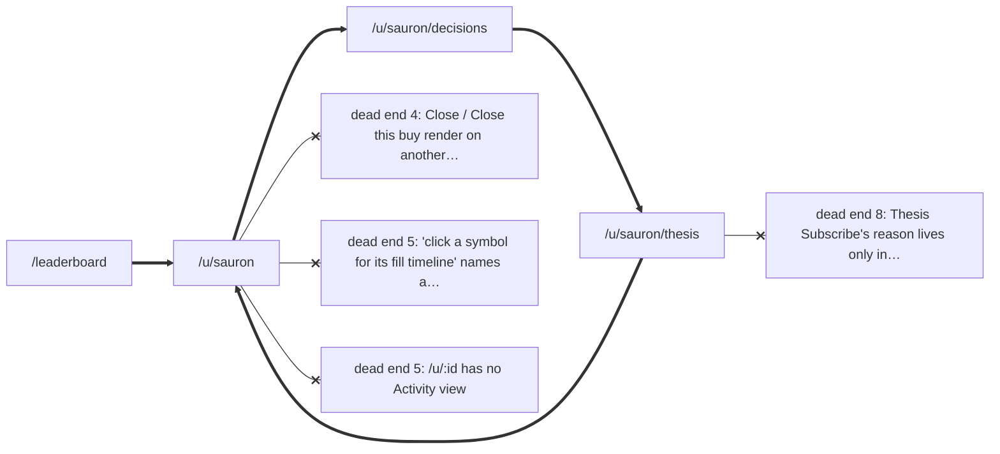
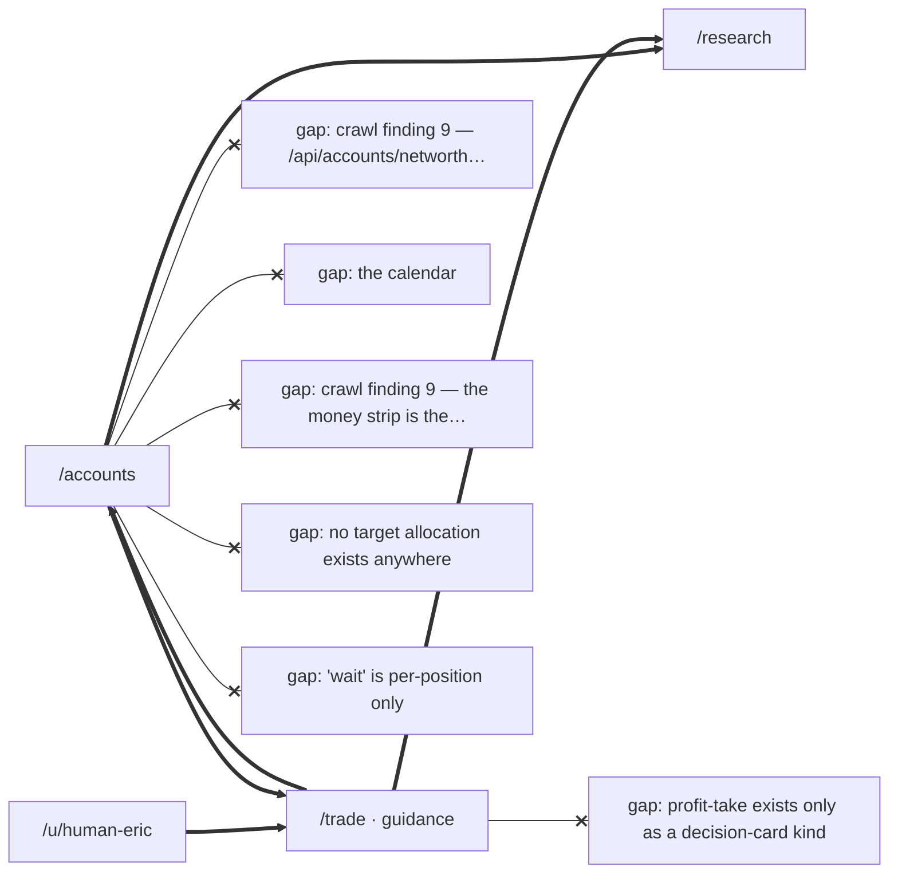
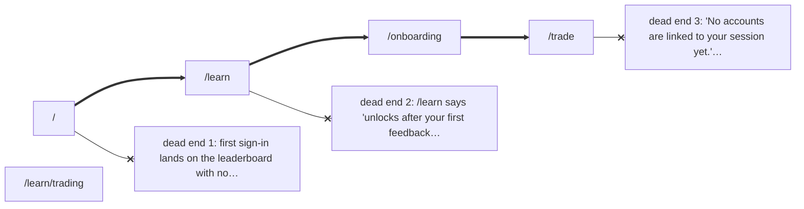
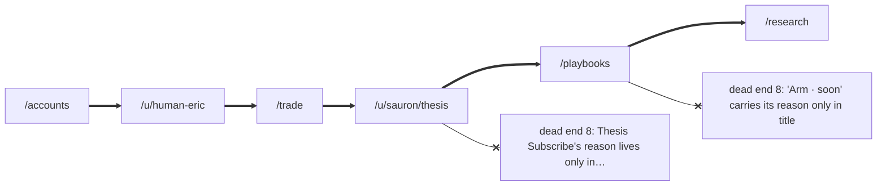
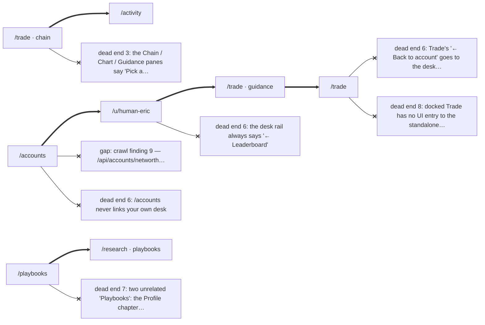

# Journey maps — one per member

_Generated by `scripts/crawl/run.mjs` from `e2e/journeys/*.journey.json` and run 2026-09-26. The member's path is the thick edge; a cross-head is a dead end the journey file names as a known gap (a dotted edge means the gap passed this run — remove its `known_gap`). Route graph only; the eight dead ends' text lives in `friction-ledger.md`._

## bot-watcher

_1 journey: what did Sauron do, and why. Source: `docs/members/bot-watcher.md`._

## eric

_5 journeys: the Monday read · take profit or hold · rebalance · wait · the phone check. Source: `docs/members/eric.md`._

## first-timer

_2 journeys: the first ten minutes · the first rung, read before it is earned. Source: `docs/members/first-timer.md`._

## phone-only

_1 journey: the whole app, one thumb. Source: `docs/members/phone-only.md`._

## returning-trader

_4 journeys: sell a covered call on a position I hold · the fill on Activity · my own desk, and back · playbooks, twice. Source: `docs/members/returning-trader.md`._
