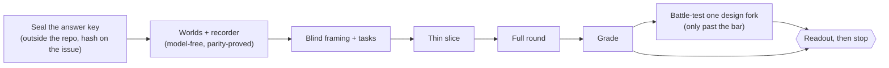
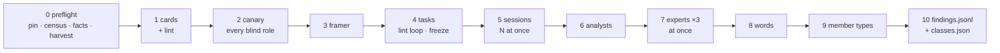

# Member studies — simulated members try to get things done, and we watch where they struggle

_The process artifact for the learning loop `member-study-profile` (#4943, `docs/process/LEARNING-LOOP.md`).
Edited in place each cycle; the next area starts from what this file says, never from a fresh prompt._

## Why this exists

The member journeys (`e2e/journeys/*.journey.json`) and the crawl (`scripts/crawl/`) check that a
thing **exists**. On 2026-10-08 they had passed every profile screen the owner then found broken in
a single walk. They could not have caught it: each step reloads, "visible" means "has a box" rather
than "on screen", nothing looks at where a click lands, and the judge line never ran (the lesson is
in `docs/LESSONS.md`). A member study checks the other half — **can a person with a goal actually
get it done, and what does it cost them on the way?**

## The shape of a study



Two kinds of evaluator, kept apart because they find different problems:

- **Simulated members** — they think aloud while working toward a goal and are biased toward getting
  lost. They see only pixels.
- **Experts** — heuristics, wasted steps, how content is organised. They review frames a machine took
  of every control.

Plus one pass over the words, and the recorder's own measurements. The measurements are reported in
their own column: whoever designs them has seen the answer key, so they never count as discovery.

## Blind and aware roles

| Role | Blind? | Prompt | What it may see |
|---|---|---|---|
| Framer | blind | `roles/framer.md` | member cards · the area's page list |
| Task author | blind | `roles/task-author.md` | member cards · job map · world fact sheet |
| Simulated member | blind | `roles/actor.md` | its card · the task · its own past turns · two frames |
| Analyst | blind | `roles/analyst.md` | one member's traces and frames |
| Expert ×3 | blind | `roles/expert.md` | the machine census of frames · the area's roles |
| Words pass | blind | `roles/words.md` | harvested visible text · the area's roles |
| Member-type audit | blind | `roles/member-type-audit.md` | member cards |
| Matcher ×2 + tie-break | aware | `roles/matcher.md` | sealed key + findings with class labels stripped · a control's `--expect` |
| Checker | aware | — | every non-key finding; the world's known artifacts (`<run>/<world>-artifacts.json`); may re-run the recorder |

**Blind** means a sealed call: `claude -p --safe-mode --restricted --tools "" --strict-mcp-config
--system-prompt-file <role> --json-schema <schema> --input-format stream-json --output-format
stream-json --verbose --no-session-persistence`, run from an empty temporary directory.

- It loads no CLAUDE.md, memory, plugins, hooks or MCP. Admin-managed policy still applies under
  `--safe-mode`; whether a managed CLAUDE.md slips through is unconfirmed, so the canary asks.
- Its only tool is the structured answer.
- It signs in with the owner's subscription (the standalone `claude` must be logged in: `claude auth login`).

Every blind role first passes `roles/canary.md`.

## Rules that keep a study honest

- **Packets are built by script.**
  - Member cards are §1–4 of `docs/members/<member>.md`, only quotes dated before the study, with code spans and paths stripped.
  - §5–7 (known problems, journeys) and the journey JSON never enter.
  - **Only the members read the cards.** The experts and the words pass read the area's roles
    instead: one line per member in the area config (`roles`), saying who they are here and on
    what device, never their own words. So only a member's own finds can be primed, and an
    expert's find counts as unprimed honestly. The roles are linted like the page list, and the
    round refuses them if they repeat five words of any card.
- **Lint fails closed** on:
  - any word from the sealed keyword list in a packet;
  - any interface label in a task;
  - any five-word overlap with the sealed key.

  The one allowed exception is the action name `scroll` in `roles/actor.md`.
- **Tasks name a goal and a reportable fact, never a route.** Where the member found it is measured, not graded.
- **Success comes from the oracle,** never the member's claim: the fact reported, plus the place it lives seen on screen.
  The oracle reads the answer the way a person wrote it: a date in any common form ("6 November
  2026", "Nov 6", "11/6") is that calendar day; an amount beside its labelled parts ("$20,111
  cash") or a rounded restatement ("about $25,200 — $25,212 to be exact") is still one answer;
  only bare amounts in a list, or two joined by "or", are a guess (`oracle.mjs`, #5009).
- **The page runs on the member's clock.** Each member file's §2 may declare a `Clock:` line
  (zone · language); a member without one keeps the owner's (the file titled "— the owner").
  `scripts/study/clock.mjs` reads it; the census, the facts sheet and every session take the same
  `--clock`, and a round whose members keep different clocks is refused — an answer region is
  text on screen, so they must all read one screen.
- **Primes are tagged in advance.** A member card quote that hints at a key item is reported as primed recall, separately.
- **Fixes after the pin don't spend the test.** The study runs against a pinned commit, and the fixed build is the negative control.

## Running against a pinned commit

Worlds compose from the checked-out tree's own server code, so a world composed on main shows
main's fixes. A study of the pin runs in a worktree **at the pin**, with only today's harness
(`scripts/study/**`) copied over it:

```sh
node scripts/study/pin.mjs prepare --commit <sha> --dir <abs dir>   # worktree, harness, installs, build, compose, parity
node scripts/study/pin.mjs remove  --dir <abs dir>                  # only a worktree prepare made
```

- **What is the pin's:** everything outside `scripts/study/` — `src/`, `app/`, the builders, the gates.
- **What is today's:** the harness. `<dir>/.study-pin.json` records its commit, any uncommitted
  edits, and a sha256 per file plus one tree hash, so two runs can say they used the same instrument.
- **Installs are clones** (`cp -c`), never symlinks — and never cloned *from* one: a checkout whose
  `node_modules` is a link is refused. A lockfile that differs at the pin is warned and recorded.
- **Reuse is strict:** a re-run reuses only a worktree `prepare` made, still at the commit, with no
  changes outside `scripts/study/`; the main and the running checkout are always refused.
- **The parity table** lands in `<dir>/.study-run/parity.txt`; the run exits with parity's status.
- **One tap away is part of the world.** Members and experts leave the area through the app nav and
  the header's icons, so each world also lists those destinations (`oneTap`,
  `worlds/shell-surfaces.mjs`) and parity proves them: a page stuck on a loading line, a service
  shown as "not wired", a bare error after Sign out is a MISS before the run, never a finding after.
  The services production always wires behind sign-in (the feed, the Council, account management,
  the fleet panel, feedback) are filled from the book (`worlds/league-services.mjs`); Sign out goes
  through the real auth gate to a declared plain page.
- **Known world artifacts.** What a world still cannot show as production would (the sign-in
  page, the fund owner's cards, writes that never come back…) is declared once
  (`worlds/shell-artifacts.mjs`) and written to `<dir>/.study-run/<world>-artifacts.json` by
  compose, then rewritten by parity with every struck surface and unanswered read or page (a MISS
  is not listed: it may be the app's own defect, and it fails parity instead). The checker
  marks a finding that matches a row `world-artifact`.
- **When the harness outgrows the pin:** a helper it imports from outside its folder that the pin
  lacks is feature-detected in `scripts/study/compat.mjs`, and the fallback is printed under the
  table. A surface that exists only at some commits declares `strikeUnless` (the composed answer
  decides), so it renders at the pin and is struck, out loud, where the build no longer serves it.

## The machine-made inputs: census, harvest, facts sheet

Three model-free tools make the blind roles' packets, so nobody chooses what an evaluator sees:

```sh
npx tsx scripts/study/census.mjs --run <compose dir> --world <world> --viewer <who> --out <fresh dir> \
  [--viewport phone,desktop] [--cap 60] [--route <path> …] [--clock <zone>,<locale>]
node scripts/study/harvest.mjs --out <dir> [--facts <facts.json>] <census dir> [<census dir> …]
npx tsx scripts/study/worlds/facts.mjs --run <compose dir> --world <world> [--viewer <who> …] \
  [--clock <zone>,<locale>] --out <facts.json>
```

`--clock` defaults to the owner's; a round passes its members' (see *Rules*).

- **Census** (the experts' input). For each route the world's surfaces list names for that viewer,
  it walks the page screen by screen and lists every control from Chromium's accessibility tree
  that is on screen at some scroll position — in tree order, nothing hand-picked. Then each one is
  operated once from a fresh load (storage cleared): its screen, a frame before, one tap at the
  centre of its visible part through the recorder's own `act`, the recorder's frame after. A
  control whose activation would leave the app is recorded as skipped, with why; past the cap
  (default 60 a route) controls are logged as dropped, never silently. A control the tree holds but
  no screen shows is scrolled into view — a sideways scroller's far end is then listed and operated
  (`reach: "scrolled-into-view"`); one a box a member cannot scroll keeps out of view is `clipped`, a
  finding; one still nowhere (a skip link placed off the page) is `offscreen`. Every listed control
  carries role, name, `rect` (its box at its screen, cut to its clips) and screen index. Out:
  `census.json`, `walk.json`, and a recorder run dir per route × viewport.
- **Harvest** (the words pass's input, and the leak check's label list). From the walk:
  `labels.txt` — every control's accessible name and every heading on screen (and what an operated
  control put on screen), once each — for `lint.mjs --labels`; names the tree held but no screen
  showed stay banned under a marking comment. Set aside as comments, with why: the world's data
  (accounts, tickers, playbooks — facts.json `dataNames`), names made only of the facts sheet's own
  words, a single word of three letters or fewer, a glyph. `strings.json` — visible text by route
  and kind (heading · button/link · label · short status · long text).
- **Facts sheet** (the task author's input). Facts with a stable name each, taken from the composed
  payloads a viewer's page is served (never the inputs JSON), with the oracle's answer shape and an
  `answerRegion` — text the page prints where the fact is shown (an order's row from its
  date-and-time cell, so two like orders never share one). `weak` marks a region that is a bare
  short number. **Text as rendered:** a time the page formats itself is written on the member's
  clock, as their screen shows it; a string the server formatted is copied as served. A fact the
  page shows in more than one place carries a region for each — an order also as its league-feed
  row (`/api/wire`, the server's own stamp), a position's next event also as a calendar strip
  prints it ("CPI report Wed Oct 14") and as the Events agenda titles a held name's print ("MSFT
  earnings print"), a playbook's verdict also as the bot page's roll call says it ("On, reading live
  price and sentiment every pass…", whose lead clause answers it too). Days are the member's days.
  The app's own formatters come from the checkout that composed the run (manifest `checkout` +
  `commit`), refused if it has moved. `harvest.mjs --facts` says which regions the walk actually
  saw — within one row or block, as the oracle reads one element, and within the fact's own world;
  a fact whose region shows only after a control is operated is found in the census's revealed
  text. **A fact no census screen shows is never handed to the task author** (`regions.json`
  `seen` → `round-plan.mjs` → `gradableFacts`): its member could be right and still fail.

The census, like a member session, runs against the pinned build: `pin.mjs prepare`, then run it in
the pin's directory with `--run .study-run`.

## Grading (Hartson, Andre & Williges 2001)

- **Match:** same place *and* same mechanism; 0.5 for the same place with the same mechanism said
  vaguely. A different mechanism at the same place is no match, however close: "the page shrinks"
  is not "it jumps to the top". The rubric, with a worked example, is `roles/matcher.md`.
- **Thoroughness** per evaluator class and for the blind classes combined, with Wilson intervals.
- **Validity:** verified-real ÷ reported.
- **Structural yield:** verified findings about where things live, what a page is for and how pages connect, not on the key. A finding that re-finds a known gap or a readers-only item is reported apart and never counted; one whose matchers dispute a key item is held until a tie-break settles it.
- **Controls:** the fixed build must not report fixed items; planted defects must be found. A
  fixed build is held, not passed, while a matcher dispute names one of its fixed items.
- **Easy-mode flag:** success ≥ 90% with ease ≥ 6 where the owner struggled fails calibration.

```sh
node scripts/study/grade.mjs --sealed <key dir> --round <round dir> [--struck <parity strikes>] \
  --negative <fixed-build round> --positive <planted-defects round>          # → <round>/grade.json
node scripts/study/readout.mjs --grade <round>/grade.json --round <round dir> --study <name> \
  --next-area "<area>" --cost "<predicted cost>" [--owner-shot <png>] [--battle <battle.json>] \
  [--job-map <framer output>] [--reveal --sealed <key dir>]   # → docs/members/study/<name>/readout.md
```

- **The matchers** are aware agents a workflow runs over `findings-unlabelled.jsonl`, in chunks:
  matcher 1 and matcher 2 apart, then one tie-break over the findings they disagree on. Each reads
  `roles/matcher.md`, the key and, for a control, its `--expect` file, and answers in
  `schemas/matcher.json`'s shape, which becomes `matches-1.json`, `matches-2.json` and
  `tiebreak.json`. Round one's matchers ran from a prompt kept only in one session, with the
  rubric inside the sealed key. The rubric lives here now, so every round grades by the same one.
- **The key is read only from `--sealed`.** `gold.md` (lines starting `A1`… the main list, `B1`…
  known gaps, `S1`… defects only the readers found) and `primes.json` (member → the ids their card
  hints at). `grade.json` carries ids, never the key's wording; the readout shows wording only with
  `--reveal`.
- **A round directory** is exactly what `round.mjs --out` writes. Its layout, the finding record
  and the class vocabulary live in ONE module, `scripts/study/round-contract.mjs`, which the round
  writes through and the grader and readout read through; `tests/scripts/study-round-e2e.spec.ts`
  runs a stub round, grades it and reads it out, so a drift between them fails the build.
  - Written by the round: `findings.jsonl`, `classes.json` (finding → members · experts · words ·
    instruments, kept apart so the matchers never see it) and
    `5-sessions/<member>/<world>/<viewport>/<task>/run-<n>/` (drive.mjs runs).
  - The classes: an analyst's findings are **members**, whether the member said it or the analyst
    read it from the trace (`voice`: member-voiced · instrument-only); every expert's are
    **experts** (`expert`: 1…N); the recorder's and census's own measurements are **instruments**,
    in their own column and never blind.
  - Written after it by the aware roles: `matches-1.json` + `matches-2.json` (+ `tiebreak.json`),
    `checks.json` (real · false · world-artifact, with `same_as` to merge one problem reported
    twice), `struck.json` (read when `--struck` is not given), `touches.json` (which key surfaces
    any trace reached).
  - A control round is a round directory too (`round.mjs --frozen-from`, below), plus the matcher
    files and `control.json` `{kind, source, frozen, pin, sourcePin, expect: [ids]}`. The grader
    holds it to the flag it is passed under (`--negative` takes only a negative control), to
    the main round's `frozen.json` and to another pin than the main round's — a control that asked
    other questions, or asked them of the same build, controls nothing. A negative control's ids
    must be on the key, and it fails when none of its sessions succeeded (silence from a build it
    never reached proves nothing). A control round passed as `--round` is refused.
- **Disputes are never settled kindly:** where the matchers disagree and no tie-break is given, the
  finding counts as no match and its row is marked for the owner.
- **The arithmetic** (`grade-core.mjs`, specced in `tests/scripts/study-grade.spec.ts`): found at
  ≥ 0.5 with partial credit apart; Wilson 95% ranges; primed = found only by members hinted at it;
  world artifacts leave the validity denominator; new problems count once per `same_as` group;
  kappa over the two matchers' labels; the cycle gate and the stop rule.
- **The readout's frames** are copied ≤ 100KB to `docs/shots/study-<name>/` (macOS `sips` shrinks a
  larger one). The worked example is `tests/fixtures/study-grade/` — a made-up house, not an app.

## The readout (one shape, every time)

1. A picture: a member stuck, beside the owner's own screenshot.
2. The headline counts.
3. Structural findings first, uncapped.
4. The scorecard, with disputes marked.
5. The battle-test.
6. The job map.
7. What it missed.
8. One question.

Then the study **stops** for the owner.

## Running one member session

`scripts/study/drive.mjs` joins a composed world (a `worlds/compose.mjs` run directory), the
recorder (`session.mjs`) and an actor, then grades the run with the oracle (`oracle.mjs`):

```sh
npx tsx scripts/study/worlds/compose.mjs <run-dir> <world>
node scripts/study/drive.mjs --run <run-dir> --world <world> --viewer <viewer> --viewport phone \
  --task <task.json> --card <card.md> --actor scripted:<actions.json>|sealed --out <fresh dir>
```

- **Out:** `turns.jsonl` (the member's turns, `scripts/study/schemas/actor-turn.json`),
  `trace.jsonl` + `frames/` (the recorder's), `summary.json` (task metrics, the oracle's verdict,
  the ease answer, the world's log, the sha256 of the task and card).
- **Cap:** min(2.5 × the task's `optimal`, 15) actions; a refused action still counts.
- **Scripted actor:** the no-model run. A tap may name on-screen text instead of a point, so one
  script replays on two builds. `scripts/study/tasks/proof/` is the harness proof, not a study task.
- **Sealed actor:** refuses to start while the standalone `claude` is signed out. `--dry-run`
  writes the first turn's message and a half-scale frame without calling it. `--stub <dir>` plays
  it from canned answers instead (`<dir>/actor/<n>.json`, `<dir>/ease/<n>.json`); `--roles <dir>`
  reads the role prompt from another checkout (a pin may predate the roles).
- **Native pickers are drawn by the recorder.** Headless Chromium never paints a `<select>`'s
  popup into a screenshot, so a member who taps one sees nothing open — the harness's blindness,
  not the app's failure. The recorder draws a plain, system-styled stand-in in the page instead
  (`scripts/study/measure-picker.mjs`; its rules are `picker.mjs`, specced without a browser): a
  bottom sheet at phone width, the current row checked; a dropdown under the select at desktop
  width. A row sets the select and fires `input` + `change`, as a person's choice does; a tap
  elsewhere or Escape closes it unchanged. The label opens it on a phone only, as on iOS. Each
  moment lands on the trace record as `nativePicker` (`opened` · `chose` · `dismissed`, the
  options, the value). The overlay sits outside `<body>`, so the text hash, overflow, sticky-head
  and shift measurements never count it; a census operating a select frames it open. Proof:
  `scripts/study/tasks/proof/picker-*.json`. Date and time inputs get no stand-in yet: none sits on
  the profile's routes.

## Running a round

`scripts/study/round.mjs` runs every blind role of one round, in order, against a pinned build.
Run it from today's checkout; the members' sessions, the census and the facts sheet run inside the
pin (`pin.mjs prepare`), and a pin whose harness is not this checkout's is prepared again first.

```sh
node scripts/study/round.mjs --pin <pin dir> --out <fresh dir> --sealed <answer-key dir> \
  [--profile scripts/study/tasks/<area>.json] [--thin] [--dry-run] [--concurrency N]
```



- **The area config** (`scripts/study/tasks/<area>.json`) holds everything area-specific: the
  cutoff, the members × worlds × viewports table (each member's viewer and start page), runs and
  tasks per pairing, the census cap and list, the framer's page list in plain words, the roles the
  experts and the words pass read (`roles`, one line per member), the thin cut.
- **Every blind call** goes through `scripts/study/sealed.mjs` with its role prompt and its schema
  (`scripts/study/schemas/`). Each call's request (images as sha256 + size), answer and **usage**
  (tokens by kind, the CLI's dollar figure, time, the model) is kept in `<out>/<step>/requests/`.
- **What it cost** is read back from those records, never estimated (`usage.mjs`): each step's
  `done.json` carries its `usage`, and `<out>/usage.json` sums the round by step — written even
  when the round stops. A replayed call counts at the price first paid; a session driven again
  keeps its earlier attempt's calls under `5-sessions/superseded/`, so they still count; a failed
  call is counted apart, since the CLI never said what it spent. On a subscription sign-in the
  dollar figure is the CLI's API-price estimate, not a bill. `duration_ms` is the calls' own time
  added up — calls made at once overlap, so it is not how long a step took; the step's `start` and
  `done` lines in `<out>/log.jsonl` are.
- **The experts run at once,** up to `--concurrency` (the flag, else the area's), each over its
  own batches in order. Every call keeps the number it had when they ran one after another, so a
  round recorded either way replays.
- **The lint loop:** the task author hears back only the lint's `rewrite <file> item N (<kind>)`
  lines (plus `unknown-fact` when a task cites no fact on the sheet), at most three times; then
  the round stops. Tasks are frozen with their sha256 in `<out>/frozen.json`.
- **Findings:** `<out>/findings.jsonl` holds every finding with a stable id, its class, level,
  severity, surface (route + viewport) and evidence frames; `<out>/classes.json` keeps id → class
  apart, and `findings-unlabelled.jsonl` is what a matcher gets: id, what, level, severity and
  surface only, sorted by id — no class, no detail, no evidence paths and no source order, since
  each of those names its source. Ids hash surface + what, never the class.
- **`--dry-run`** answers every call from `tests/fixtures/study-stub/` (or `--stub <dir>`) — no
  sign-in, no model; `--only-world` and `--cap` narrow it. `--thin` is the area's thin slice.
  The stub's stand-in key (`sealed/`) carries made-up items and `primes.json`, so a dry round can
  be graded and read out too.
- **Resuming:** a step whose `done.json` exists is skipped; `log.jsonl` only ever grows. A resume
  must use the mode the out dir was made with (`<out>/round.json`: profile and its hash, pin,
  sealed dir, thin, stub, `--only-world`, `--cap`) — any other is refused. Sessions check
  `tasks.json` against `frozen.json`, and a session dir is kept only when its `task.sha256` matches
  the task it is planned for. A pin whose harness is not the checkout's is refused with its
  `pin.mjs prepare` command, never re-prepared under another round.

## The control rounds

Two more rounds, each on the main round's **frozen** tasks against another pinned build: the
fixed build (negative — it must not report what the fixes removed) and a build with planted
defects (positive — they must be found).

```sh
node scripts/study/round.mjs --pin <other pin> --out <fresh dir> --sealed <answer-key dir> \
  --frozen-from <main round dir> --control negative|positive --expect <expect file> \
  [--runs N] [--experts N]
```

- **Nothing is re-authored.** The framer and the task author never run: the main round's
  `tasks.json`, per-task files and `frozen.json` are copied in, and refused unless `tasks.json`
  still hashes to its freeze. The member cards are rebuilt and refused unless each hashes to the
  main round's. The main round must have run its sessions on that freeze, under the same stub
  or sealed mode and the same `--sealed` key.
- **The main round's shape:** its members × worlds × viewports, its thin cut, its world — so
  `--thin` and `--only-world` are refused beside `--frozen-from`. The area config must ask what
  the main round asked: the same file, or one whose area, matrix, cutoff, tasks per member, thin
  cut and page list match the file the main round ran, read from the path its `round.json`
  recorded and only while that file still hashes to the record. Any other key may differ (a census
  route, the roles, the run counts) and is logged as `config-drift`. A control of a control is
  refused.
- **The build's own inputs:** census, facts sheet and harvest come from the control pin. A frozen
  task whose fact this build serves differently is logged as `fact-drift`, never refused.
- **Cheaper:** 1 run a task and 1 expert unless `--runs` / `--experts` say otherwise; no words
  pass or member-type audit.
- **`--expect`** is the key ids the control is about, each with its **mechanism** beside it: what
  the fix removed, or the defect that was planted. Write one a line (`A3 — tapping a filter jumps
  the page to the top`) or a JSON array of `{id, mechanism}`. A negative control is refused unless
  every id states one, so the mechanism is written before the round, never fitted to its findings.
  The matchers judge an expected id against that mechanism. The round keeps the ids only, in
  `control.json` and `round.json`, and no blind role reads the file. A resume under another kind,
  source or list is refused.

## Starting a new area — checklist

1. Write the area's answer key (the owner's or members' own complaints), seal it outside the repo,
   and post its hash and the pin on the owning issue. Every scored item gets its own id **at sealing**
   (a pointer like "the open gaps in the README" cannot be graded), and `primes.json` is written in
   the grader's shape, `{"<member>": ["<id>", …]}`. The controls' `--expect` files name the
   mechanism each fix removed (or each planted defect) beside its id, not only the item.
   Write the area config's `roles`: one plain line per member, never a quote from a card.
2. `scripts/study/worlds/<area>-*.mjs`: compose payloads from the real builders at the pin, one pinned
   instant, full-URL stubs. Run `scripts/study/parity.mjs` and strike anything that cannot render, out loud.
   Derive, never type, any figure the page shows two ways: yesterday's closing equity is cash plus
   each position at its `lastday` (`worlds/book.mjs` → `yesterdayEquity`), and compose refuses a
   world whose header day change is not the sum of its rows' (`worlds/day-change.mjs`, #5052). P/L
   booked today on a position already closed is the one honest gap: declare it as the
   participant's `closedToday` and say so in the input's comment.
3. Run the framer, then the task author, then the lint. Freeze and hash the tasks.
4. Thin slice: one member, one task, phone width.
5. Full round, then grade, then the readout. Add what broke to *Lessons* below.

## Lessons (one dated line each; the detail goes to `docs/LESSONS.md` via `/retro`)

- 2026-10-09 · the standalone `claude` CLI can be signed out while the desktop session works; check
  `claude auth status` before a run, or the sealed calls fail with "OAuth session expired".
- 2026-10-09 · parallel workflow agents can share one scratchpad directory; a run dir named
  `run` or `smoke2` got a second agent's session appended to its trace. Give every run dir a name
  only this run would pick, and the driver refuses an `--out` that already holds a run.
- 2026-10-09 · **the first real thin slice stopped three times before a member ever ran — each on
  something a stub dry run cannot see.** (1) Every role schema declared the 2020-12 `$schema`; the
  CLI rejects it before answering and says so only on stderr (#4988). (2) A leak check that hid
  every word made the blind task author guess four times which everyday word was also a button;
  hide only sealed words, name screen labels, and check only what the member reads (#4989). (3) The
  CLI injects three kinds of context even under `--safe-mode` (the account's email, the environment
  block, its own tool-use instructions) in different words every call; the canary classifies by
  kind, never by wording (#4988, #4990). Rule: no full round before a real thin slice completes.
- 2026-10-09 · **a headless screenshot never draws a native `<select>` popup.** The first real member
  tapped the account picker four times, saw nothing open, and gave up at ease 1/7 — the harness's
  blindness, not the app's. The recorder draws a platform-faithful stand-in for native pickers.
- 2026-10-09 · **links out of the area meet test-world placeholders** ("not the shell", "Tuning in…")
  that then come back as findings and cost validity. Parity covers every one-tap destination, and
  anything still unfaithful is listed for the checker before the run.
- 2026-10-09 · one blind expert over one route produced 40 findings, 23 structural — the expert pass
  is cheap and dense; the member sessions are the expensive, sparse half. Budget the full round
  accordingly.
- 2026-10-09 · the recorder counted a page's held-open quote stream as a request in flight, so
  after one visit to a page with a live feed every later settle waited out its 5s cap twice
  (22s an action, `settled: false`). Every EventSource is now ignored, and a fresh load forgets
  the old page's requests.
- 2026-10-09 · **full round: the census said done after operating 0 of 856 controls** — a world
  change made fresh loads sign the member out, and the experts reviewed sign-in doors. A census
  reaching under 80% of its controls, or an expert batch with no frames, now stops the round
  (#5008; detail in `docs/LESSONS.md`).
- 2026-10-09 · the answer grader failed 20 of 42 answers that were right (dates in words,
  breakdowns, on-screen text in another format): task success read 43% when it was 66%. Audit the
  oracle with two auditors before quoting task success (#5003, #5009).
- 2026-10-09 · phone is where members struggle: 21 of 45 tasks right on a phone against 36 of 42
  on desktop, and every give-up was on a phone. Phone sessions are where the next area's budget
  earns the most.
- 2026-10-09 · the expert merge timed out at 10 minutes on both controls, and resuming re-paid for
  every answer. A resumed round now replays recorded answers, and the merge gets 30 minutes (#5010).
  Resume with the same `--profile` path: the round compares the path, not its contents.
- 2026-10-09 · the generated readout printed all 66 structural findings with every frame (794 lines,
  48MB) and had to be cut to a top ten by hand. Next: `readout.mjs` ranks and caps at ten, the rest folded.
- 2026-10-09 · the experts read the member cards, so their finds are primed — but the grader
  counts an expert's find as unprimed, and every item came out "unprimed". Either give experts no
  cards or count card-exposed finds apart.
- 2026-10-09 · the fixed-build control failed on 5 of 7 items: two were real leftovers the fixes
  missed (#5021, #5023), one was a false alarm from a Trade address the study typed by hand into
  its route list (the app's own links open a held contract with `section=orders&manage=<OCC>`),
  and two were a rubric that matched a different mechanism ("the page shrinks" vs "it jumps to the
  top"). A full match needs the same mechanism, and census routes are copied from links the app
  builds, never composed.
- 2026-10-09 · three experts ran one after another (~2.7 minutes a batch, ~4½ of the round's ~7¾
  hours), and token use was never recorded. Run experts in parallel and log the CLI's usage per call.
- 2026-10-10 · the grader fix (#5009) was proved by replaying round one's 87 sessions on the same
  pin — each member's own taps, no model: 14 of the 20 audited-right answers now pass, none of the
  15 audited-wrong, and all 36 earlier passes that replay still pass. Two more could not replay (the
  no-account page opens mid-scroll, so a first tap lands elsewhere). Three still fail because the
  member read the row through the page's translucent sticky header, which the recorder counts as
  covered. And deriving one figure can flip a world's story: Jordan's derived close made today a new
  all-time high and the page opened on a celebration, so a spec now refuses an unplanned high.
- 2026-10-11 · the experts now run at once and every sealed call records its usage (#5099). The
  ~4½ hours the experts took one after another should fall to about one expert's time; the next
  round's `7-experts` start and done lines in `log.jsonl` say whether it did, and its `usage.json`
  what the round cost.
- 2026-10-11 · the matching rubric and the experts' inputs are fixed (#5099). A full match now
  needs the same mechanism: an adjacent one at the same place scores 0, where round one gave 0.5
  and so counted it found. The rubric moved out of the sealed key and one session's prompt into
  `roles/matcher.md`. A negative control states each fixed item's mechanism in `--expect` before
  it runs, and a matcher dispute on a fixed item holds it rather than passing it. The experts and
  the words pass now read one line per member instead of the cards, so the next round's primed
  split is honest. Round one's grade still counts its card-reading experts as unprimed.
- 2026-10-11 · round one could not be re-controlled: a control was refused on any edit to the
  area config, and round one's had two since it ran (#5027's census route, #5099's roles). A
  control now compares the file the main round ran on what it asks of whom, and logs the rest.
