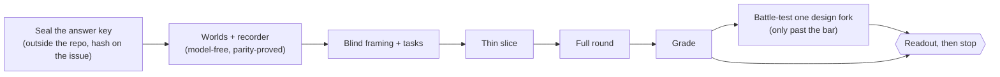

# Member studies — simulated members try to get things done, and we watch where they struggle

_The process artifact for the learning loop `member-study-profile` (#4943, `docs/process/LEARNING-LOOP.md`).
Edited in place each cycle; the next area starts from what this file says, never from a fresh prompt._

## Why this exists

The member journeys (`e2e/journeys/*.journey.json`) and the crawl (`scripts/crawl/`) check that a
thing **exists**. On 2026-10-08 they had passed every profile screen the owner then found broken in
a single walk. They could not have caught it: each step reloads, "visible" means "has a box" rather
than "on screen", nothing looks at where a click lands, and the judge line never ran (the lesson is
in `docs/LESSONS.md`). A member study checks the other half — **can a person with a goal actually
get it done, and what does it cost them on the way?**

## The shape of a study



Two kinds of evaluator, kept apart because they find different problems:

- **Simulated members** — they think aloud while working toward a goal and are biased toward getting
  lost. They see only pixels.
- **Experts** — heuristics, wasted steps, how content is organised. They review frames a machine took
  of every control.

Plus one pass over the words, and the recorder's own measurements. The measurements are reported in
their own column: whoever designs them has seen the answer key, so they never count as discovery.

## Blind and aware roles

| Role | Blind? | Prompt | What it may see |
|---|---|---|---|
| Framer | blind | `roles/framer.md` | member cards · the area's page list |
| Task author | blind | `roles/task-author.md` | member cards · job map · world fact sheet |
| Simulated member | blind | `roles/actor.md` | its card · the task · its own past turns · two frames |
| Analyst | blind | `roles/analyst.md` | one member's traces and frames |
| Expert ×3 | blind | `roles/expert.md` | the machine census of frames · member cards |
| Words pass | blind | `roles/words.md` | harvested visible text · member cards |
| Member-type audit | blind | `roles/member-type-audit.md` | member cards |
| Matcher ×2 + tie-break | aware | — | sealed key + findings with class labels stripped |
| Checker | aware | — | every non-key finding; may re-run the recorder |

**Blind** means a sealed call: `claude -p --safe-mode --restricted --tools "" --strict-mcp-config
--system-prompt-file <role> --json-schema <schema> --input-format stream-json --output-format
stream-json --verbose --no-session-persistence`, run from an empty temporary directory.

- It loads no CLAUDE.md, memory, plugins, hooks or MCP. Admin-managed policy still applies under
  `--safe-mode`; whether a managed CLAUDE.md slips through is unconfirmed, so the canary asks.
- Its only tool is the structured answer.
- It signs in with the owner's subscription (the standalone `claude` must be logged in: `claude auth login`).

Every blind role first passes `roles/canary.md`.

## Rules that keep a study honest

- **Packets are built by script.**
  - Member cards are §1–4 of `docs/members/<member>.md`, only quotes dated before the study, with code spans and paths stripped.
  - §5–7 (known problems, journeys) and the journey JSON never enter.
- **Lint fails closed** on:
  - any word from the sealed keyword list in a packet;
  - any interface label in a task;
  - any five-word overlap with the sealed key.

  The one allowed exception is the action name `scroll` in `roles/actor.md`.
- **Tasks name a goal and a reportable fact, never a route.** Where the member found it is measured, not graded.
- **Success comes from the oracle,** never the member's claim: the fact reported, plus the place it lives seen on screen.
- **Primes are tagged in advance.** A member card quote that hints at a key item is reported as primed recall, separately.
- **Fixes after the pin don't spend the test.** The study runs against a pinned commit, and the fixed build is the negative control.

## Grading (Hartson, Andre & Williges 2001)

- **Match:** same place *and* same mechanism; 0.5 for the same place with a vaguer mechanism.
- **Thoroughness** per evaluator class and for the blind classes combined, with Wilson intervals.
- **Validity:** verified-real ÷ reported.
- **Structural yield:** verified findings about where things live, what a page is for and how pages connect, not on the key.
- **Controls:** the fixed build must not report fixed items; planted defects must be found.
- **Easy-mode flag:** success ≥ 90% with ease ≥ 6 where the owner struggled fails calibration.

## The readout (one shape, every time)

1. A picture: a member stuck, beside the owner's own screenshot.
2. The headline counts.
3. Structural findings first, uncapped.
4. The scorecard, with disputes marked.
5. The battle-test.
6. The job map.
7. What it missed.
8. One question.

Then the study **stops** for the owner.

## Running one member session

`scripts/study/drive.mjs` joins a composed world (a `worlds/compose.mjs` run directory), the
recorder (`session.mjs`) and an actor, then grades the run with the oracle (`oracle.mjs`):

```sh
npx tsx scripts/study/worlds/compose.mjs <run-dir> <world>
node scripts/study/drive.mjs --run <run-dir> --world <world> --viewer <viewer> --viewport phone \
  --task <task.json> --card <card.md> --actor scripted:<actions.json>|sealed --out <fresh dir>
```

- **Out:** `turns.jsonl` (the member's turns, `scripts/study/schemas/actor-turn.json`),
  `trace.jsonl` + `frames/` (the recorder's), `summary.json` (task metrics, the oracle's verdict,
  the ease answer, the world's log, the sha256 of the task and card).
- **Cap:** min(2.5 × the task's `optimal`, 15) actions; a refused action still counts.
- **Scripted actor:** the no-model run. A tap may name on-screen text instead of a point, so one
  script replays on two builds. `scripts/study/tasks/proof/` is the harness proof, not a study task.
- **Sealed actor:** refuses to start while the standalone `claude` is signed out. `--dry-run`
  writes the first turn's message and a half-scale frame without calling it.

## Starting a new area — checklist

1. Write the area's answer key (the owner's or members' own complaints), seal it outside the repo,
   and post its hash and the pin on the owning issue.
2. `scripts/study/worlds/<area>-*.mjs`: compose payloads from the real builders at the pin, one pinned
   instant, full-URL stubs. Run `scripts/study/parity.mjs` and strike anything that cannot render, out loud.
3. Run the framer, then the task author, then the lint. Freeze and hash the tasks.
4. Thin slice: one member, one task, phone width.
5. Full round, then grade, then the readout. Add what broke to *Lessons* below.

## Lessons (one dated line each; the detail goes to `docs/LESSONS.md` via `/retro`)

- 2026-10-09 · the standalone `claude` CLI can be signed out while the desktop session works; check
  `claude auth status` before a run, or the sealed calls fail with "OAuth session expired".
- 2026-10-09 · parallel workflow agents can share one scratchpad directory; a run dir named
  `run` or `smoke2` got a second agent's session appended to its trace. Give every run dir a name
  only this run would pick, and the driver refuses an `--out` that already holds a run.
