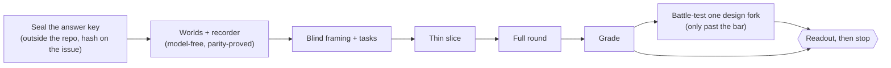
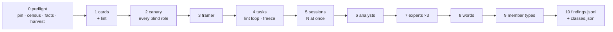

# Member studies — simulated members try to get things done, and we watch where they struggle

_The process artifact for the learning loop `member-study-profile` (#4943, `docs/process/LEARNING-LOOP.md`).
Edited in place each cycle; the next area starts from what this file says, never from a fresh prompt._

## Why this exists

The member journeys (`e2e/journeys/*.journey.json`) and the crawl (`scripts/crawl/`) check that a
thing **exists**. On 2026-10-08 they had passed every profile screen the owner then found broken in
a single walk. They could not have caught it: each step reloads, "visible" means "has a box" rather
than "on screen", nothing looks at where a click lands, and the judge line never ran (the lesson is
in `docs/LESSONS.md`). A member study checks the other half — **can a person with a goal actually
get it done, and what does it cost them on the way?**

## The shape of a study



Two kinds of evaluator, kept apart because they find different problems:

- **Simulated members** — they think aloud while working toward a goal and are biased toward getting
  lost. They see only pixels.
- **Experts** — heuristics, wasted steps, how content is organised. They review frames a machine took
  of every control.

Plus one pass over the words, and the recorder's own measurements. The measurements are reported in
their own column: whoever designs them has seen the answer key, so they never count as discovery.

## Blind and aware roles

| Role | Blind? | Prompt | What it may see |
|---|---|---|---|
| Framer | blind | `roles/framer.md` | member cards · the area's page list |
| Task author | blind | `roles/task-author.md` | member cards · job map · world fact sheet |
| Simulated member | blind | `roles/actor.md` | its card · the task · its own past turns · two frames |
| Analyst | blind | `roles/analyst.md` | one member's traces and frames |
| Expert ×3 | blind | `roles/expert.md` | the machine census of frames · member cards |
| Words pass | blind | `roles/words.md` | harvested visible text · member cards |
| Member-type audit | blind | `roles/member-type-audit.md` | member cards |
| Matcher ×2 + tie-break | aware | — | sealed key + findings with class labels stripped |
| Checker | aware | — | every non-key finding; may re-run the recorder |

**Blind** means a sealed call: `claude -p --safe-mode --restricted --tools "" --strict-mcp-config
--system-prompt-file <role> --json-schema <schema> --input-format stream-json --output-format
stream-json --verbose --no-session-persistence`, run from an empty temporary directory.

- It loads no CLAUDE.md, memory, plugins, hooks or MCP. Admin-managed policy still applies under
  `--safe-mode`; whether a managed CLAUDE.md slips through is unconfirmed, so the canary asks.
- Its only tool is the structured answer.
- It signs in with the owner's subscription (the standalone `claude` must be logged in: `claude auth login`).

Every blind role first passes `roles/canary.md`.

## Rules that keep a study honest

- **Packets are built by script.**
  - Member cards are §1–4 of `docs/members/<member>.md`, only quotes dated before the study, with code spans and paths stripped.
  - §5–7 (known problems, journeys) and the journey JSON never enter.
- **Lint fails closed** on:
  - any word from the sealed keyword list in a packet;
  - any interface label in a task;
  - any five-word overlap with the sealed key.

  The one allowed exception is the action name `scroll` in `roles/actor.md`.
- **Tasks name a goal and a reportable fact, never a route.** Where the member found it is measured, not graded.
- **Success comes from the oracle,** never the member's claim: the fact reported, plus the place it lives seen on screen.
- **Primes are tagged in advance.** A member card quote that hints at a key item is reported as primed recall, separately.
- **Fixes after the pin don't spend the test.** The study runs against a pinned commit, and the fixed build is the negative control.

## Running against a pinned commit

Worlds compose from the checked-out tree's own server code, so a world composed on main shows
main's fixes. A study of the pin runs in a worktree **at the pin**, with only today's harness
(`scripts/study/**`) copied over it:

```sh
node scripts/study/pin.mjs prepare --commit <sha> --dir <abs dir>   # worktree, harness, installs, build, compose, parity
node scripts/study/pin.mjs remove  --dir <abs dir>                  # only a worktree prepare made
```

- **What is the pin's:** everything outside `scripts/study/` — `src/`, `app/`, the builders, the gates.
- **What is today's:** the harness. `<dir>/.study-pin.json` records its commit, any uncommitted
  edits, and a sha256 per file plus one tree hash, so two runs can say they used the same instrument.
- **Installs are clones** (`cp -c`), never symlinks — and never cloned *from* one: a checkout whose
  `node_modules` is a link is refused. A lockfile that differs at the pin is warned and recorded.
- **Reuse is strict:** a re-run reuses only a worktree `prepare` made, still at the commit, with no
  changes outside `scripts/study/`; the main and the running checkout are always refused.
- **The parity table** lands in `<dir>/.study-run/parity.txt`; the run exits with parity's status.
- **When the harness outgrows the pin:** a helper it imports from outside its folder that the pin
  lacks is feature-detected in `scripts/study/compat.mjs`, and the fallback is printed under the
  table. A surface that exists only at some commits declares `strikeUnless` (the composed answer
  decides), so it renders at the pin and is struck, out loud, where the build no longer serves it.

## The machine-made inputs: census, harvest, facts sheet

Three model-free tools make the blind roles' packets, so nobody chooses what an evaluator sees:

```sh
npx tsx scripts/study/census.mjs --run <compose dir> --world <world> --viewer <who> --out <fresh dir> \
  [--viewport phone,desktop] [--cap 60] [--route <path> …]
node scripts/study/harvest.mjs --out <dir> [--facts <facts.json>] <census dir> [<census dir> …]
npx tsx scripts/study/worlds/facts.mjs --run <compose dir> --world <world> [--viewer <who> …] --out <facts.json>
```

- **Census** (the experts' input). For each route the world's surfaces list names for that viewer,
  it walks the page screen by screen and lists every control from Chromium's accessibility tree
  that is on screen at some scroll position — in tree order, nothing hand-picked. Then each one is
  operated once from a fresh load (storage cleared): its screen, a frame before, one tap at the
  centre of its visible part through the recorder's own `act`, the recorder's frame after. A
  control whose activation would leave the app is recorded as skipped, with why; past the cap
  (default 60 a route) controls are logged as dropped, never silently. A control the tree holds but
  no screen shows is scrolled into view — a sideways scroller's far end is then listed and operated
  (`reach: "scrolled-into-view"`); one a box a member cannot scroll keeps out of view is `clipped`, a
  finding; one still nowhere (a skip link placed off the page) is `offscreen`. Every listed control
  carries role, name, `rect` (its box at its screen, cut to its clips) and screen index. Out:
  `census.json`, `walk.json`, and a recorder run dir per route × viewport.
- **Harvest** (the words pass's input, and the leak check's label list). From the walk:
  `labels.txt` — every control's accessible name and every heading on screen (and what an operated
  control put on screen), once each — for `lint.mjs --labels`; names the tree held but no screen
  showed stay banned under a marking comment. Set aside as comments, with why: the world's data
  (accounts, tickers, playbooks — facts.json `dataNames`), names made only of the facts sheet's own
  words, a single word of three letters or fewer, a glyph. `strings.json` — visible text by route
  and kind (heading · button/link · label · short status · long text).
- **Facts sheet** (the task author's input). Facts with a stable name each, taken from the composed
  payloads a viewer's page is served (never the inputs JSON), with the oracle's answer shape and an
  `answerRegion` — text the page prints where the fact is shown (an order's row from its
  date-and-time cell, so two like orders never share one). `weak` marks a region that is a bare
  short number. Days are New York days, as the page shows them. The app's own formatters come from
  the checkout that composed the run (manifest `checkout` + `commit`), refused if it has moved.
  `harvest.mjs --facts` says which regions the walk actually saw — within one row or block, as the
  oracle reads one element; a fact whose region shows only after a control is operated is found in
  the census's revealed text, and one no screen shows cannot be graded.

The census, like a member session, runs against the pinned build: `pin.mjs prepare`, then run it in
the pin's directory with `--run .study-run`.

## Grading (Hartson, Andre & Williges 2001)

- **Match:** same place *and* same mechanism; 0.5 for the same place with a vaguer mechanism.
- **Thoroughness** per evaluator class and for the blind classes combined, with Wilson intervals.
- **Validity:** verified-real ÷ reported.
- **Structural yield:** verified findings about where things live, what a page is for and how pages connect, not on the key. A finding that re-finds a known gap or a readers-only item is reported apart and never counted; one whose matchers dispute a key item is held until a tie-break settles it.
- **Controls:** the fixed build must not report fixed items; planted defects must be found.
- **Easy-mode flag:** success ≥ 90% with ease ≥ 6 where the owner struggled fails calibration.

```sh
node scripts/study/grade.mjs --sealed <key dir> --round <round dir> [--struck <parity strikes>] \
  --negative <fixed-build round> --positive <planted-defects round>          # → <round>/grade.json
node scripts/study/readout.mjs --grade <round>/grade.json --round <round dir> --study <name> \
  --next-area "<area>" --cost "<predicted cost>" [--owner-shot <png>] [--battle <battle.json>] \
  [--job-map <framer output>] [--reveal --sealed <key dir>]   # → docs/members/study/<name>/readout.md
```

- **The key is read only from `--sealed`.** `gold.md` (lines starting `A1`… the main list, `B1`…
  known gaps, `S1`… defects only the readers found) and `primes.json` (member → the ids their card
  hints at). `grade.json` carries ids, never the key's wording; the readout shows wording only with
  `--reveal`.
- **A round directory** is exactly what `round.mjs --out` writes. Its layout, the finding record
  and the class vocabulary live in ONE module, `scripts/study/round-contract.mjs`, which the round
  writes through and the grader and readout read through; `tests/scripts/study-round-e2e.spec.ts`
  runs a stub round, grades it and reads it out, so a drift between them fails the build.
  - Written by the round: `findings.jsonl`, `classes.json` (finding → members · experts · words ·
    instruments, kept apart so the matchers never see it) and
    `5-sessions/<member>/<world>/<viewport>/<task>/run-<n>/` (drive.mjs runs).
  - The classes: an analyst's findings are **members**, whether the member said it or the analyst
    read it from the trace (`voice`: member-voiced · instrument-only); every expert's are
    **experts** (`expert`: 1…N); the recorder's and census's own measurements are **instruments**,
    in their own column and never blind.
  - Written after it by the aware roles: `matches-1.json` + `matches-2.json` (+ `tiebreak.json`),
    `checks.json` (real · false · world-artifact, with `same_as` to merge one problem reported
    twice), `struck.json` (read when `--struck` is not given), `touches.json` (which key surfaces
    any trace reached).
  - A control round holds findings, the matcher files and `control.json` `{expect: [ids]}`.
- **Disputes are never settled kindly:** where the matchers disagree and no tie-break is given, the
  finding counts as no match and its row is marked for the owner.
- **The arithmetic** (`grade-core.mjs`, specced in `tests/scripts/study-grade.spec.ts`): found at
  ≥ 0.5 with partial credit apart; Wilson 95% ranges; primed = found only by members hinted at it;
  world artifacts leave the validity denominator; new problems count once per `same_as` group;
  kappa over the two matchers' labels; the cycle gate and the stop rule.
- **The readout's frames** are copied ≤ 100KB to `docs/shots/study-<name>/` (macOS `sips` shrinks a
  larger one). The worked example is `tests/fixtures/study-grade/` — a made-up house, not an app.

## The readout (one shape, every time)

1. A picture: a member stuck, beside the owner's own screenshot.
2. The headline counts.
3. Structural findings first, uncapped.
4. The scorecard, with disputes marked.
5. The battle-test.
6. The job map.
7. What it missed.
8. One question.

Then the study **stops** for the owner.

## Running one member session

`scripts/study/drive.mjs` joins a composed world (a `worlds/compose.mjs` run directory), the
recorder (`session.mjs`) and an actor, then grades the run with the oracle (`oracle.mjs`):

```sh
npx tsx scripts/study/worlds/compose.mjs <run-dir> <world>
node scripts/study/drive.mjs --run <run-dir> --world <world> --viewer <viewer> --viewport phone \
  --task <task.json> --card <card.md> --actor scripted:<actions.json>|sealed --out <fresh dir>
```

- **Out:** `turns.jsonl` (the member's turns, `scripts/study/schemas/actor-turn.json`),
  `trace.jsonl` + `frames/` (the recorder's), `summary.json` (task metrics, the oracle's verdict,
  the ease answer, the world's log, the sha256 of the task and card).
- **Cap:** min(2.5 × the task's `optimal`, 15) actions; a refused action still counts.
- **Scripted actor:** the no-model run. A tap may name on-screen text instead of a point, so one
  script replays on two builds. `scripts/study/tasks/proof/` is the harness proof, not a study task.
- **Sealed actor:** refuses to start while the standalone `claude` is signed out. `--dry-run`
  writes the first turn's message and a half-scale frame without calling it. `--stub <dir>` plays
  it from canned answers instead (`<dir>/actor/<n>.json`, `<dir>/ease/<n>.json`); `--roles <dir>`
  reads the role prompt from another checkout (a pin may predate the roles).
- **Native pickers are drawn by the recorder.** Headless Chromium never paints a `<select>`'s
  popup into a screenshot, so a member who taps one sees nothing open — the harness's blindness,
  not the app's failure. The recorder draws a plain, system-styled stand-in in the page instead
  (`scripts/study/measure-picker.mjs`; its rules are `picker.mjs`, specced without a browser): a
  bottom sheet at phone width, the current row checked; a dropdown under the select at desktop
  width. A row sets the select and fires `input` + `change`, as a person's choice does; a tap
  elsewhere or Escape closes it unchanged. The label opens it on a phone only, as on iOS. Each
  moment lands on the trace record as `nativePicker` (`opened` · `chose` · `dismissed`, the
  options, the value). The overlay sits outside `<body>`, so the text hash, overflow, sticky-head
  and shift measurements never count it; a census operating a select frames it open. Proof:
  `scripts/study/tasks/proof/picker-*.json`. Date and time inputs get no stand-in yet: none sits on
  the profile's routes.

## Running a round

`scripts/study/round.mjs` runs every blind role of one round, in order, against a pinned build.
Run it from today's checkout; the members' sessions, the census and the facts sheet run inside the
pin (`pin.mjs prepare`), and a pin whose harness is not this checkout's is prepared again first.

```sh
node scripts/study/round.mjs --pin <pin dir> --out <fresh dir> --sealed <answer-key dir> \
  [--profile scripts/study/tasks/<area>.json] [--thin] [--dry-run] [--concurrency N]
```



- **The area config** (`scripts/study/tasks/<area>.json`) holds everything area-specific: the
  cutoff, the members × worlds × viewports table (each member's viewer and start page), runs and
  tasks per pairing, the census cap and list, the framer's page list in plain words, the thin cut.
- **Every blind call** goes through `scripts/study/sealed.mjs` with its role prompt and its schema
  (`scripts/study/schemas/`). Each call's request (images as sha256 + size) and answer is kept in
  `<out>/<step>/requests/`.
- **The lint loop:** the task author hears back only the lint's `rewrite <file> item N (<kind>)`
  lines (plus `unknown-fact` when a task cites no fact on the sheet), at most three times; then
  the round stops. Tasks are frozen with their sha256 in `<out>/frozen.json`.
- **Findings:** `<out>/findings.jsonl` holds every finding with a stable id, its class, level,
  severity, surface (route + viewport) and evidence frames; `<out>/classes.json` keeps id → class
  apart, and `findings-unlabelled.jsonl` is what a matcher gets: id, what, level, severity and
  surface only, sorted by id — no class, no detail, no evidence paths and no source order, since
  each of those names its source. Ids hash surface + what, never the class.
- **`--dry-run`** answers every call from `tests/fixtures/study-stub/` (or `--stub <dir>`) — no
  sign-in, no model; `--only-world` and `--cap` narrow it. `--thin` is the area's thin slice.
  The stub's stand-in key (`sealed/`) carries made-up items and `primes.json`, so a dry round can
  be graded and read out too.
- **Resuming:** a step whose `done.json` exists is skipped; `log.jsonl` only ever grows. A resume
  must use the mode the out dir was made with (`<out>/round.json`: profile and its hash, pin,
  sealed dir, thin, stub, `--only-world`, `--cap`) — any other is refused. Sessions check
  `tasks.json` against `frozen.json`, and a session dir is kept only when its `task.sha256` matches
  the task it is planned for. A pin whose harness is not the checkout's is refused with its
  `pin.mjs prepare` command, never re-prepared under another round.

## Starting a new area — checklist

1. Write the area's answer key (the owner's or members' own complaints), seal it outside the repo,
   and post its hash and the pin on the owning issue.
2. `scripts/study/worlds/<area>-*.mjs`: compose payloads from the real builders at the pin, one pinned
   instant, full-URL stubs. Run `scripts/study/parity.mjs` and strike anything that cannot render, out loud.
3. Run the framer, then the task author, then the lint. Freeze and hash the tasks.
4. Thin slice: one member, one task, phone width.
5. Full round, then grade, then the readout. Add what broke to *Lessons* below.

## Lessons (one dated line each; the detail goes to `docs/LESSONS.md` via `/retro`)

- 2026-10-09 · the standalone `claude` CLI can be signed out while the desktop session works; check
  `claude auth status` before a run, or the sealed calls fail with "OAuth session expired".
- 2026-10-09 · parallel workflow agents can share one scratchpad directory; a run dir named
  `run` or `smoke2` got a second agent's session appended to its trace. Give every run dir a name
  only this run would pick, and the driver refuses an `--out` that already holds a run.
- 2026-10-09 · the thin slice's member tapped the profile's account picker four times, saw nothing
  open and gave up (ease 1/7): headless Chromium never paints a native `<select>` popup into a
  frame. The recorder now draws the platform's picker in the page and records what it did.
- 2026-10-09 · the recorder counted a page's held-open quote stream as a request in flight, so
  after one visit to a page with a live feed every later settle waited out its 5s cap twice
  (22s an action, `settled: false`). Every EventSource is now ignored, and a fresh load forgets
  the old page's requests.
