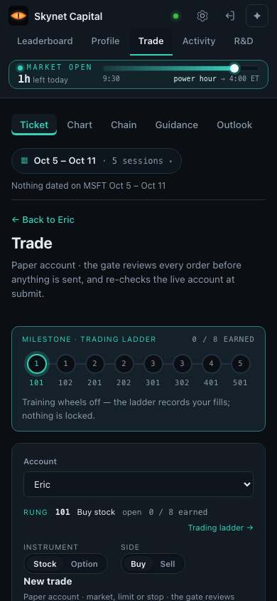
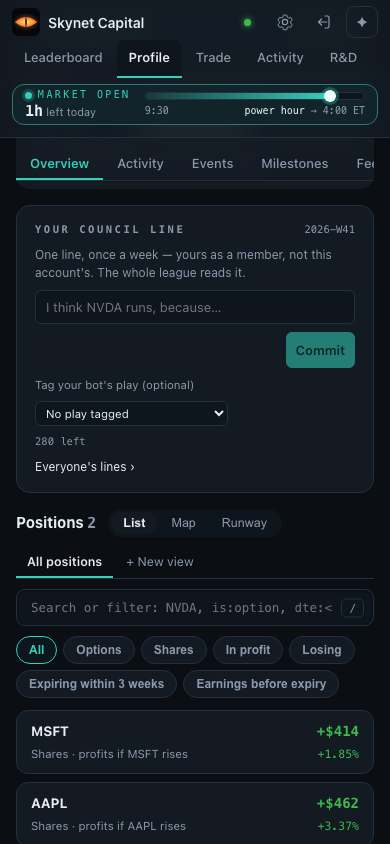
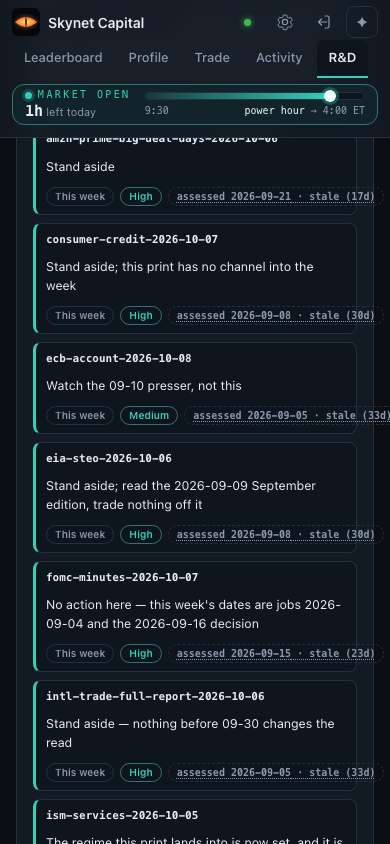
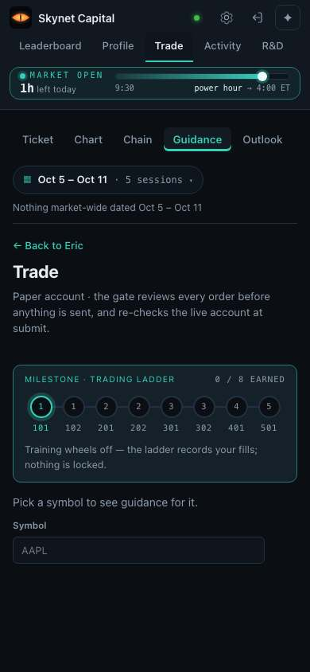
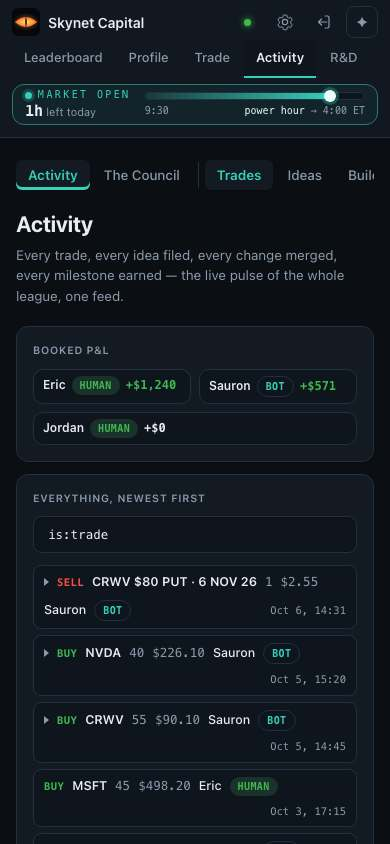
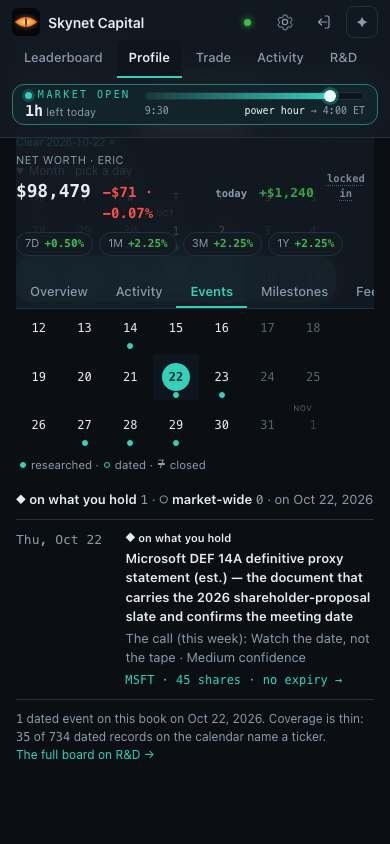
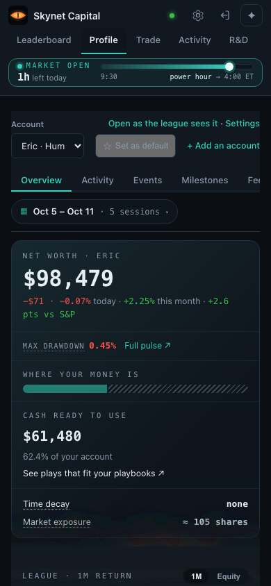
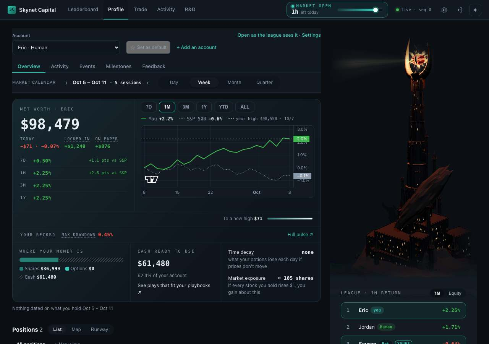

# Member study readout — profile-2026-10

## A member, stuck

The eric member on a phone, at their most confused (confusion 3 of 3):

| Before | What they did | After |
|---|---|---|
|  | tapped "← Back to Eric" |  |

> "As Eric, I'm backing out of this Trade ticket — it opened an order form, not MSFT's position detail — so I can get one last look at the positions list. — "Trade · Ticket · Chart · Chain · Guidance · Outlook". "Nothing dated on MSFT Oct 5 – Oct 11." "New trade — Paper account · market, limit or stop". "← Back to Eric". No P/L numbers anywhere on this screen." — eric

## What it found

**Found 12 of your 12 without seeing them (3 only partly) · 66 new structural problems · 69 new smaller ones.**

Partly means the right place with a vaguer reason; the bar counts it as found. Full matches alone: 9 of 12 (75%).

With 12 items the range is wide: 12 of 12 is anywhere from 76% to 100% (95% confidence).

Not counted as new: 9 structural already on your key (re-found, not new) · 4 smaller already on your key (re-found, not new).

**Phone vs desktop — the clearest signal.** After an audit of the answer grader (below), members answered **36 of 42 tasks right on desktop (86%) but 21 of 45 on a phone (47%)**; all **8 give-ups were on a phone**, and the typical ease score was **5 of 7 on desktop, 3 on a phone**, with the page moving on its own by up to ~5,500px in a single phone session.

**Controls.** The planted-defect build: **all 3 planted defects found** (pass). The fixed build: **5 of the 7 items its fixes removed were still reported** (fail) — partly real leftovers the fixes missed (a filtered list still shifts the page 39–209px; one more "open on Trade" route still lands on a buy form), partly a matching rubric too loose on mechanism. Details in the method half.

**It missed the bar on one count — the fixed-build control above** — so, per the plan, the design battle-test did not run.

## New structural problems

The ten most severe of 66, one screen each; the rest are listed after them. Every one was checked against the screens and the code at the pinned build (real, not a test-world artifact).

### 1. The phone Positions list shows only lifetime P/L per row (MSFT +$414, AAPL +$462). There is no TODAY column, which the desktop table has — so on phone the day's loser is unreachable and the header's −$71 can never be attributed to a holding.

| Screen |
|---|
|  |

> "the app never breaks that $71 out by position, so I can't tell you which of the two caused it."

_Found by simulated members (eric) · critical._

### 2. Tapping a position row on phone opens the Trade order ticket instead of a position detail — no P/L anywhere on the destination.

| Screen |
|---|
|  |

> "Tapping MSFT didn't open a position detail — it dropped me into a trade order ticket with no P/L at all."

_Found by simulated members (eric) · high · reported 1 more time._

### 3. No freshness stamp anywhere on the human book — no "as of" time on net worth, positions or guidance. The only candidate, the "live · seq 0" chip in the desktop header, has no tooltip on hover and no last-updated time.

| Screen |
|---|
|  |

> "The only freshness signal anywhere is a "live · seq 0" chip in the header, which has no tooltip and no last-updated timestamp… I wouldn't put money to work on this read without a stated refresh time."

_Found by simulated members (eric) · high._

### 4. The R&D call board — the only surface in the app that stamps its own freshness — stamps every item stale (17–33 days) and every call reads "stand aside" / "no action", so the one place that states freshness states only that it is out of date.

| Screen |
|---|
|  |

> "the one place that does stamp itself — the R&D call board — stamps everything as stale, 17 to 33 days old… So my confidence that anything I'm reading reflects today's prices is close to zero."

_Found by simulated members (eric) · high._

### 5. Trade → Guidance is a per-symbol lookup ("Pick a symbol to see guidance for it") with no book-level view, so a question about the whole book dead-ends there every time.

| Screen |
|---|
|  |

> "I'm skipping the per-symbol Guidance box — I need book level."

_Found by simulated members (eric) · high._

### 6. "The Council" reads as a bot/rules roster but is a weekly one-line thesis post box. He opened it as his bot-roster guess in four sessions, twice in the same run.

| Screen |
|---|
|  |

> "The Council isn't a bot roster at all — it's a weekly one-line thesis post box, and nobody's posted."

_Found by simulated members (eric) · moderate._

### 7. Events opens on a Week span that is empty — "Nothing dated on what you hold in Oct 5 – Oct 11" — which reads as "you have nothing coming" when five of his holdings' items sit later in the month. He had to scroll back up and find the Month switch himself.

| Screen |
|---|
|  |

> "The calendar opened on a week view that showed nothing at all, so I had to find the Month switch myself."

_Found by simulated members (eric) · high · reported 1 more time._

### 8. The events list gives an estimated DEF 14A proxy filing (Oct 22) the same weight and the same ◆ marker as the MSFT earnings print (Oct 27), with no way to filter to the announcements that actually carry price risk. Both sessions answered Oct 22 and missed the earnings date.

| Screen |
|---|
|  |

> "it's an estimated date and coverage is thin (35 of 734 dated records name a ticker), so… Oct 22 is my first marker but I wouldn't bet the trim on it being the only one."

_Found by simulated members (eric) · high · reported 1 more time._

### 9. The landing Net Worth card is scoped to one account and never says so — it reads "NET WORTH · ERIC $98,479" with no hint that a whole-book roll-up exists. He had to open the account picker and guess that it rolls up rather than just switches.

| Screen |
|---|
|  |

> "I had to guess that the headline $98,479 was only one account — the card didn't say which scope it was showing, so I needed one extra check before I trusted the number."

_Found by simulated members (eric) · moderate · reported 1 more time._

### 10. The Positions list sits below the fold on the Profile Overview — the member landed on net worth, chart and league panels and had to scroll every single time before their own holdings were on screen.

| Screen |
|---|
|  |

> "the positions weren't on screen when I landed, so I had to scroll before I could confirm anything"

_Found by simulated members (returning-trader) · moderate · reported 3 more times._

<strong>The other 56 structural problems</strong>

| # | Problem | Found by · severity |
|---|---|---|
| 11 | Nowhere in the bot page is there a month-to-date (or any period-labelled) performance figure. Pulse's headline tiles — EQUITY, NET REALIZED, WIN RA… | Found by simulated members (bot-watcher) · critical. |
| 12 | Time-based performance is split awkwardly across tabs: Overview carries only today's move and unrealized paper P/L, Pulse carries lifetime-looking … | Found by simulated members (bot-watcher) · high. |
| 13 | Once you scroll into Pulse, nothing on screen says whose numbers these are — the sticky bar reads 'Skynet Capital', not 'Sauron' — so the member sc… | Found by simulated members (bot-watcher) · moderate. |
| 14 | The 'which playbooks this bot runs' list on Heartbeat does not fit a phone screen and offers no count or summary, so counting how many are live is … | Found by simulated members (bot-watcher) · high. |
| 15 | The 'On' badge on a playbook does not mean it is doing anything: three rows are On but parked waiting on an estimated earnings date, one is On and … | Found by simulated members (bot-watcher) · high. |
| 16 | The Positions list is silently scoped to the selected account. CRWV sits in the Sauron account, so searching and filtering inside Eric returns "No … | Found by simulated members (phone-only) · critical. |
| 17 | The Trade tab is only a new-order form — no holdings and no automations below it — but it is the first place members go for "my positions" or "my r… | Found by simulated members (phone-only) · high. |
| 18 | The Leaderboard shows standings only, not what anyone traded, so a member looking for another account's trades lands there first and has to guess t… | Found by simulated members (invited-friend) · low. |
| 19 | On the home/Profile page, the right-rail league list ("1 Eric Human +2.25% … 3 Sauron Bot −0.64%") shows names that look like links but are not cli… | Found by simulated members (first-timer) · high · reported 1 more time. |
| 20 | Nothing on a bot's or person's account page tells you what scheduled news is coming for what it holds. Upcoming dated events live only on a one-lin… | Found by simulated members (first-timer) · critical. |
| 21 | The account tabs (Pulse, Heartbeat, Thesis) name concepts a first-timer has not met, so there is no way to tell which one holds what. Pulse sounded… | Found by simulated members (first-timer) · high · reported 3 more times. |
| 22 | On Trade the pane strip (Ticket · Chart · Chain · Guidance · Outlook · Watchlist · Orders) is 507px of content in a 358px box: "Watchlist" renders … | Found by expert reviews (expert 1) · critical · reported 3 more times. |
| 23 | One bot has two homes with two vocabularies: /app/accounts?account=sauron (Overview · Activity · Events · Heartbeat · Thesis · Milestones · Feedbac… | Found by expert reviews (expert 1) · high · reported 2 more times. |
| 24 | Member-level content lives inside an account's tab strip: "Milestones" and "Feedback" render "Your milestones — the same on every account" with a "… | Found by expert reviews (expert 1) · high · reported 2 more times. |
| 25 | The Thesis tab leads with a complete, operable-looking Subscribe card — Target account select, "Capital allocated $0" slider, Subscribe and Steerin… | Found by expert reviews (expert 1) · high · reported 1 more time. |
| 26 | "Sign out" is an unlabelled 30px icon sitting 8–10px from the equally unlabelled Settings gear and Moneypenny button; one tap ends the session with… | Found by expert reviews (expert 1) · high · reported 2 more times. |
| 27 | "+ Add an account" does not add an account: it full-reloads, drops ?account=sauron, switches the page's account to Eric, and auto-scrolls 716–1082p… | Found by expert reviews (expert 1) · high · reported 2 more times. |
| 28 | The header "Status" control opens a full fleet-operations board to every member: deploy commit hashes ("main (afb76b8) is the deployed commit"), "B… | Found by expert reviews (expert 1) · high · reported 2 more times. |
| 29 | The only route to a decision's reasoning is an unlabelled 22×22px chevron in the table's left gutter — below the 44px minimum, with no column heade… | Found by expert reviews (expert 1) · high · reported 1 more time. |
| 30 | The global nav shows "Profile" as the current section while a bot's book fills the screen, and tapping "Profile" — the page you are apparently alre… | Found by expert reviews (expert 1) · high · reported 2 more times. |
| 31 | Opening Moneypenny reflows the whole app instead of overlaying it: the tapped button jumps 435–440px, the layout shifts 0.09–0.11, the top nav is c… | Found by expert reviews (expert 1) · high · reported 2 more times. |
| 32 | Two "Settings" links promise the bot's settings and deliver the global app Preferences page (density, tower motion, theme): the sixth tab inside th… | Found by expert reviews (expert 1) · high · reported 2 more times. |
| 33 | On Trade the brightest, largest object is a row of eight numbered dots under "MILESTONE · TRADING LADDER · 0/8 EARNED" — and it is not a progress m… | Found by expert reviews (expert 1) · high. |
| 34 | Which account an order will hit is carried only by a small picker — "Sauron", preset purely from the desk= parameter — about 300px into the page, w… | Found by expert reviews (expert 1) · high. |
| 35 | The "AT RISK — Down 116% from what you paid" card is dismissed by a 24–44px "×" labelled "Not now" — made likelier to be mis-hit by the 106px shift… | Found by expert reviews (expert 1) · high · reported 1 more time. |
| 36 | History is written two different ways, so Back is a coin toss: section switches, span changes, date changes and every filter chip use replaceState … | Found by expert reviews (expert 1) · high · reported 2 more times. |
| 37 | Nothing returns a member to where they came from. There is no breadcrumb on either bot page; "Full leaderboard ›", "Everyone's lines ›" and "Full p… | Found by expert reviews (expert 1) · high · reported 2 more times. |
| 38 | Tapping "Trade" in the top nav while already on Trade discards every URL parameter and silently switches the account from Sauron to Eric: the chart… | Found by expert reviews (expert 1) · high. |
| 39 | "See plays that fit your playbooks ↗" and the FORM row's win/loss ticks are in-page jumps dressed as page changes: the first uses the external-link… | Found by expert reviews (expert 1) · moderate. |
| 40 | The overview card stacks eight unrelated blocks with no headings and no consistent treatment for "this is a link" — net worth, three hover-only sta… | Found by expert reviews (expert 1) · moderate. |
| 41 | Each blotter row hides three unlabelled expanders that do different things — a 22px caret opens a metrics strip, the "3 buys" lot-count text opens … | Found by expert reviews (expert 1) · moderate · reported 2 more times. |
| 42 | The feed shows ten or eleven rows ending at Sep 15 with no total count, no date range, no paging and no end-of-list marker, so it is impossible to … | Found by expert reviews (expert 1) · moderate. |
| 43 | The playbook filter chips are bare codes with no counts and no explanation — CRWV-WHEEL, HC-SAURON, SAURON, and in the play-tag select S1-NVDA, G1-… | Found by expert reviews (expert 1) · moderate. |
| 44 | A decorative layer (div.char-blend, the "LEAGUE · 1M RETURN" block) sits over the decision card's action row, so the centres of "Previous decision"… | Found by expert reviews (expert 2) · critical · reported 1 more time. |
| 45 | At least a dozen controls render as buttons and produce no visible change when operated: WIN RATE, PROFIT FACTOR, MAX DRAWDOWN, Time decay, Market … | Found by expert reviews (expert 2) · high. |
| 46 | Standing is carried by hue alone in a dozen places: the league bars, the equity curves (the only difference between Eric's chart and Sauron's is gr… | Found by expert reviews (expert 2) · high. |
| 47 | The row action slot is inconsistent and dangerous: the two share rows put "Guidance" (a safe read) at x=722, and the option row directly beneath pu… | Found by expert reviews (expert 2) · high · reported 1 more time. |
| 48 | Of the six chart ranges only 7D visibly redraws. 1M changes nothing at all (identical text hash), and 3M, 1Y, YTD and ALL all draw a line of exactl… | Found by expert reviews (expert 2) · high. |
| 49 | A decorative tower illustration holds the right third of the window (≈190–470px of 1280, roughly 37%) top-to-bottom on every page and in every fram… | Found by expert reviews (expert 2) · high. |
| 50 | Reached from the R&D rail link, the destination document is 487px wide in a 390px window — the whole page scrolls sideways — and it shifts 0.052 on… | Found by expert reviews (expert 2) · high · reported 1 more time. |
| 51 | The sticky chrome stack (brand nav + account switch + tab row + market calendar, ≈140–179px, 21% of an 844px viewport) overlays page content and sw… | Found by expert reviews (expert 2) · high. |
| 52 | All guidance on the route is per-position: a two-card carousel about one option each, dismissible to zero, plus per-row Guidance links. Nothing any… | Found by expert reviews (expert 2) · high. |
| 53 | "Activity" names two different destinations visible at the same moment, 40–240px apart, and both can read as current: the global rail item goes to … | Found by expert reviews (expert 2) · high · reported 1 more time. |
| 54 | The last three closes — the richest fact on the page, per their accessible names "Closed 9/24, win: AMZN, +$516", "Closed 9/29, loss: TSLA, −$230",… | Found by expert reviews (expert 2) · high · reported 1 more time. |
| 55 | Sauron's own league row is the one that falls below the fold on Sauron's own page — the league card sits at the bottom of the right rail under the … | Found by expert reviews (expert 2) · high. |
| 56 | The permission sentence "You can trade only your own accounts." floats alone between the tiles and the view chips, ~120–380px from the row-level Gu… | Found by expert reviews (expert 2) · moderate · reported 1 more time. |
| 57 | One quantity has several names across adjacent screens: "ON PAPER" on the desk, "TOTAL P/L" in the table over the same money, "NET REALIZED … booke… | Found by expert reviews (expert 2) · moderate. |
| 58 | Expanding a decision changes nothing in the URL, so an opened explanation cannot be linked, shared or returned to after a reload, and the "the whol… | Found by expert reviews (expert 2) · moderate. |
| 59 | On the council page the right half is the tower illustration and the composer sits in a narrow card on the left, while the feed itself is one line … | Found by expert reviews (expert 2) · moderate · reported 1 more time. |
| 60 | The leaderboard calls itself a leaderboard while the subtitle says "Figures, not placings", there are no 1-2-3 positions on screen, the "THE MATCH … | Found by expert reviews (expert 2) · moderate. |
| 61 | The owner's private writing tools sit in the middle of a bot's page: "YOUR COUNCIL LINE · One line, once a week — yours as a member, not this accou… | Found by expert reviews (expert 3) · high. |
| 62 | Tapping the already-selected span button silently sets span=all, leaving the four-segment control with nothing lit and only the small line "any dat… | Found by expert reviews (expert 3) · high. |
| 63 | Two filter chips ("Expiring within 3 weeks", "Earnings before expiry") match nothing on a three-position book, and the result is a bare "No positio… | Found by expert reviews (expert 3) · high. |
| 64 | The blotter's three view names are List, Map and Runway with no preview or caption of what a Map or a Runway of positions is, only Map and Runway w… | Found by expert reviews (expert 3) · high. |
| 65 | Per-account blotters have no way to narrow by symbol, side, outcome or date — the account's Activity section has no filter at all, and the bot desk… | Found by expert reviews (expert 3) · moderate. |
| 66 | Three stacked layers of view machinery — tabs, "Positions 3 · List · Map · Runway", "All positions · + New view", a query box and six or seven filt… | Found by expert reviews (expert 3) · moderate. |

## Your items, one by one

| Your item | Members | Experts | Words | Measurements (not blind) | Note |
|---|---|---|---|---|---|
| A1 — Playbook status/config popover (heartbeat chip "Market closed · idle, last pass …") is useful but sits in an odd spot — not attached to what it describes. | partly | partly | partly | — |  |
| A2 — Calendar controls (period nav + Day/Week/Month/Quarter) are disconnected from the content they control — placement. | partly | yes | — | — |  |
| A3 — Calendar controls appear on most sections but not all, and drive nothing on many of them (inert control). | — | yes | — | — | **disputed** |
| A4 — Cash ready to use is not presented with total net worth; idle capital should read beside net worth. | — | partly | — | — | **disputed** |
| A5 — Content shifts when switching between sections/tabs (layout jumps). | partly | yes | — | yes | **disputed** |
| A6 — Activity line items do not show which playbook triggered the trade; it should be visible at the row level. | yes | partly | — | — |  |
| A7 — Activity row's expanded detail is a wall of text, not human-readable/scannable. | — | yes | — | — | **disputed** |
| A8 — Needs-a-decision guidance is detached from the position it concerns; guidance should be inline with the position. | — | partly | — | — | **disputed** |
| A9 — The at-risk call/copy on a sold put is wrong or one-dimensional ("Down 111% from what you paid" / sell after a drop on a volatile name) — copy half counts; signal-richness half is out of denominator. | — | partly | yes | — |  |
| A10 — Horizontal scrolling on the positions/decision area (columns or buttons pushed past the edge). | yes | yes | — | yes | **disputed** |
| A11 — Guidance button navigates away to another page and the user must scroll through lots of content to find guidance — disorienting. | yes | yes | — | — | **disputed** |
| A12 — Filter chips (and similar same-page refinements) scroll the page to the top, breaking flow. | yes | yes | — | yes | **disputed** |
| **Found** | 7 of 12 (32%–81%) | 12 of 12 (76%–100%) | 2 of 12 (5%–45%) | 3 of 12 (9%–53%) | |

The measurements were designed after reading your list, so they never count as finding anything.

The two matchers agreed on 95% of 691 findings (Cohen's kappa 0.893).

Of those 38 disputes the tie-break counted 27 as a find of one of your items and 11 as no match — mostly calls on layout jumping (A5) and sideways scroll (A10).

The 38 findings the two matchers disagreed on, and how the tie-break settled each

- Disputed F-1fe79edfbb: one matcher said none (0), the other A10 (0.5); a third matcher said none (0).
- Disputed F-032e5de1c0: one matcher said A4 (0.5), the other none (0); a third matcher said none (0).
- Disputed F-abc3e85100: one matcher said A8 (0.5), the other A11 (0.5); a third matcher said A11 (0.5).
- Disputed F-d39e90e4f7: one matcher said A11 (0.5), the other none (0); a third matcher said A11 (0.5).
- Disputed F-e6b46d862d: one matcher said S5 (0.5), the other none (0); a third matcher said S5 (0.5).
- Disputed F-1d303083de: one matcher said A7 (0.5), the other A5 (0.5); a third matcher said A5 (0.5).
- Disputed F-a2d17667cd: one matcher said S5 (0.5), the other none (0); a third matcher said S5 (0.5).
- Disputed F-06cfe464b5: one matcher said A7 (0.5), the other A5 (0.5); a third matcher said A5 (0.5).
- Disputed F-89ad961c7a: one matcher said none (0), the other A10 (0.5); a third matcher said A10 (0.5).
- Disputed F-e93d2c8033: one matcher said A5 (0.5), the other none (0); a third matcher said A5 (0.5).
- Disputed F-0844c42472: one matcher said none (0), the other A10 (0.5); a third matcher said A10 (0.5).
- Disputed F-3da4dfb279: one matcher said A12 (0.5), the other none (0); a third matcher said A5 (0.5).
- Disputed F-56d18b8be3: one matcher said A10 (0.5), the other none (0); a third matcher said A10 (0.5).
- Disputed F-d16c30807f: one matcher said A10 (0.5), the other none (0); a third matcher said A10 (0.5).
- Disputed F-452eab0368: one matcher said A10 (0.5), the other none (0); a third matcher said A10 (0.5).
- Disputed F-d88418bb3f: one matcher said A5 (0.5), the other none (0); a third matcher said none (0).
- Disputed F-d5e1304d03: one matcher said A5 (0.5), the other none (0); a third matcher said A5 (0.5).
- Disputed F-e68dbf74c4: one matcher said A10 (0.5), the other none (0); a third matcher said A10 (0.5).
- Disputed F-1d141eb36a: one matcher said none (0), the other A10 (0.5); a third matcher said A10 (0.5).
- Disputed F-fc80fa24be: one matcher said none (0), the other A12 (0.5); a third matcher said none (0).
- Disputed F-53435a2176: one matcher said A10 (0.5), the other none (0); a third matcher said A10 (0.5).
- Disputed F-56c688f07a: one matcher said none (0), the other A3 (0.5); a third matcher said none (0).
- Disputed F-59013f7516: one matcher said A5 (0.5), the other S7 (0.5); a third matcher said A5 (0.5).
- Disputed F-8d0e2cb4d2: one matcher said none (0), the other A5 (0.5); a third matcher said A5 (0.5).
- Disputed F-b9894e8b5f: one matcher said A12 (0.5), the other A5 (0.5); a third matcher said A5 (0.5).
- Disputed F-bd65eb7bc6: one matcher said A12 (0.5), the other A5 (0.5); a third matcher said A5 (0.5).
- Disputed F-db7afea72b: one matcher said A5 (0.5), the other none (0); a third matcher said none (0).
- Disputed F-fad4bbc5ee: one matcher said none (0), the other A12 (0.5); a third matcher said none (0).
- Disputed F-45516ba73f: one matcher said A10 (0.5), the other none (0); a third matcher said A10 (0.5).
- Disputed F-f9a5cc0ee1: one matcher said none (0), the other A5 (0.5); a third matcher said A5 (0.5).
- Disputed F-f21f4d31d0: one matcher said none (0), the other A5 (0.5); a third matcher said A5 (0.5).
- Disputed F-4631860f16: one matcher said none (0), the other A3 (0.5); a third matcher said none (0).
- Disputed F-fa25265d54: one matcher said none (0), the other A5 (0.5); a third matcher said none (0).
- Disputed F-45d60a92a1: one matcher said none (0), the other A3 (0.5); a third matcher said none (0).
- Disputed F-4682853778: one matcher said A10 (0.5), the other none (0); a third matcher said A10 (0.5).
- Disputed F-f9cb1bc08b: one matcher said none (0), the other A5 (0.5); a third matcher said A5 (0.5).
- Disputed F-603f8ba0be: one matcher said A5 (1), the other none (0); a third matcher said none (0).
- Disputed F-fc82ac2e6d: one matcher said none (0), the other A5 (0.5); a third matcher said A5 (0.5).

Of what the blind evaluators reported, 279 of 317 were real (88%); 13 came from the test world, not the app, and are left out.

By member: bot-watcher 3 of 12 · eric 4 of 12 (1 hinted) · first-timer 2 of 12 · invited-friend 2 of 12 · phone-only 3 of 12 (1 hinted) · returning-trader 2 of 12.

Members succeeded in 43% of 87 sessions by the grader as it ran, **66% after the audit** (20 of 42 "failed" answers were right — the grader misread dates in words, breakdowns and on-screen text formats; #5009); middle ease 5 of 7. (Counted over every session, not only the tasks you found hard, so this is a rough check, not the plan's calibration test.)

## The design battle-test

Did not run: the round missed the bar on its negative control (a calibration fault in the method, explained in the method half), so per the plan no design fork was battle-tested.

## What members hire this area for

Hired for: eric: Decide what to do with the whole book today — what to trade, what to rebalance, what to take off, and what to leave alone — without reading a wall of text to get there. · returning-trader: Turn one holding they already know about into a placed order, with the strike and expiry decided for them, and end up back on their book. · bot-watcher: Follow what an automated account has been doing lately and understand, in its own words, why — like reading a box score after a bad week. · phone-only: Check the book and anything needing attention in thirty seconds, one hand, one screen — and understand every disabled thing without hovering. · invited-friend: See how their own money is doing across their two accounts, trade only from theirs, and see where they stand against everyone else. · first-timer: Work out what to do first in an app where they own nothing yet, and get an account linked so they can place a first trade..

| Stage | What members want from it |
|---|---|
| Define | minimize the time it takes to know whether anything needs my attention today; minimize the number of screens I must read before I know where I stand overall; minimize the effort it takes to tell what to do first when I own nothing yet; maximize how much of my standing I can take in above the fold on a phone |
| Locate | minimize the time it takes to find the one holding I came for; minimize the number of taps from a list to the account or bot I want to read; minimize the chance I lose my place in a long list while narrowing it; minimize the effort it takes to tell which of my accounts a holding sits in |
| Prepare | maximize my confidence that the suggested move is reasonable right now; minimize the effort it takes to learn which strike and until when; maximize how much of what is coming up against my holdings I can see at a glance; minimize the reading needed to understand what an automated account believes right now |
| Confirm | maximize my certainty that the money and account named here are mine; minimize the time it takes to know how fresh these numbers are; minimize the number of controls I can see but cannot press without being told why, in words; minimize my reliance on colour alone to tell good from bad |
| Execute (not served here) |  |
| Monitor | minimize the time it takes to see whether my order filled; maximize my understanding of why an automated account placed the orders it did; minimize the effort it takes to tell a good week from a bad week for a bot; minimize the time it takes to see whether the automated strategies are actually running |
| Modify (not served here) |  |
| Conclude | minimize the number of taps to get back to my book after acting or reading; minimize the chance I end up somewhere I did not intend after following a link; maximize my sense that I am done and nothing was left hanging |

Measured: minimize the time it takes to know whether anything needs my attention today (Task success); minimize the effort it takes to understand a disabled control and whose account I am on, without hovering (Happiness).

## What it missed

Nothing on your list was missed.

## How well the process worked — the method half

This run's numbers are the baseline the next run is scored against. Each row says where the method fell short, what changed (or will), and what to aim for next time.

| Measure | This run | Where it fell short | Fix | Next run aims for |
|---|---|---|---|---|
| Your list, found blind | **12 of 12** (9 full, 3 partly; 76–100%) | Members alone found 7, the words pass 2; three items only partly (popover placement, cash beside net worth, guidance detached) | Experts carry recall today; give members tasks that reach placement questions | ≥ 10 full; members ≥ 8 |
| Primed vs unprimed | all 12 "unprimed" | The experts read the member cards too, and the grader never counts an expert's find as primed — generous | Experts get the area's roles, not the cards; or count card-exposed finds apart | an honest primed split |
| Precision (blind findings that are real) | **88%** (279 of 317; 38 false, 13 test-world) | Test-world gaps: the world's clock in UTC, a playbook-store read and Trade's chain/watchlist reads never answered | World fixes (#5009 and a follow-up) | ≥ 90%, ≤ 5 test-world |
| New structural problems | **66** (and 69 smaller) | So many that an uncapped readout became a 794-line wall | Rank and cap the top ten in the readout itself | top ten ranked by the tool |
| Planted-defect control | **pass** — all 3 found | — | — | pass |
| Fixed-build control | **fail** — 5 of 7 still reported | Two real leftovers the fixes missed (filtering still shifts the page 39–209px; one more "open on Trade" route lands on a buy form), and a matching rubric loose on mechanism ("moves" matched "jumps to the top") | Rubric: a full match needs the same mechanism; state expectations by mechanism; file the leftovers | pass |
| Matcher agreement | **kappa 0.89** (38 disputes, tie-broken) | — | — | ≥ 0.85 |
| Task success the grader reported | 43% (66% after audit) | 20 of 42 "failed" answers were right: dates in words, breakdowns, on-screen snippets in the wrong format | #5009 | audit changes < 5 verdicts |
| Census coverage (did experts see every control) | 0% at first → **100%** | Fresh loads signed the member out after a world change; preflight still said done | Sign-in restored; a census under 80% now stops the round (#5008) | ≥ 95% |
| Stops before a result | **13** across thin slice, full round and controls | Each a contract only a real run could test (schema key, lint, CLI context, native picker, placeholder pages, one stubborn task, the answer grader, a signed-out census, a merge timeout, a resume path) | Each guarded at its source (#4988–#5010) | ≤ 2 |
| Cost and time | 829 model calls (≈ estimate); **~7¾ h** wall-clock vs 2–3.5 h | Three experts ran one after another (~4½ h); tokens were never recorded | Run experts in parallel; log the CLI's own usage and cost per call | ≤ 4 h; tokens known |

Method fixes made during this run, by PR

- #4988 sealed calls survive the real CLI (no draft schema key, stderr kept, canary by kind)
- #4989 the leak check names a screen label it hits, and reads only what members read
- #4990 the canary allows the CLI's own tool-use instructions
- #4994 the thin slice's lessons
- #4997 a stand-in for native pickers a headless browser never draws
- #4998 pages one tap from the profile render as production, not as world holes
- #5000 one stubborn task is dropped, not the whole round
- #5003 the answer grader fails a list of rival amounts, not a long answer (+ re-grade tool)
- #5008 the census keeps the member signed in; a dead census or frameless batch stops the round
- #5010 a resumed round replays paid-for answers; the expert merge gets 30 minutes
- #5009 (open) the grader reads dates in words and on-screen text as rendered; the world uses the member's clock

## One question

Scale to **the trade page and its guidance (where the profile hands members off)** next (predicted cost: about 830 model calls and 8 wall-clock hours for one area at this method's current speed; 1 area ≈ 1 working day until the experts run in parallel), revise the method first (the open rows above: parallel experts, usage logging, the matching rubric, experts without member cards, #5009), or stop?

If you like, sit one short session yourself on the same tasks.
