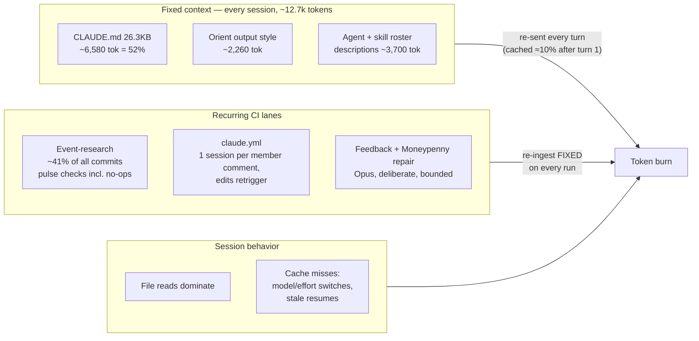

# Token efficiency — spend the budget on intelligence, not overhead

**Intent (Eric, 2026-08-28):** token burn is rising; find the waste and cut it **so the budget funds
higher-tier models and more work before rate limits bite** — not so we run cheaper models. This doc
is the standing playbook: the measured burn profile of this repo, the ranked levers, and the session
habits that keep the cache warm. Evidence comes from the official Claude Code docs (mirrored at
[`docs/vendor/claude-code/`](../vendor/claude-code/), refresh: `npm run docs:claude`) and from an
audit of this repo's own lanes (2026-08-28).

**Doctrine, unchanged:** [`docs/COMPUTE.md`](../COMPUTE.md) still rules — floors are quality-first,
tie-breaks round **up**, and optimization is judged in **cost per completed task, never cost per
token** (a cheap model that fails bills its tokens, then the retry, then the damage). Anthropic's own
measurements back the round-up doctrine: Fable 5 at `low` effort beat Sonnet 5 on deep research at
~10% *less* cost per task. The lever when burn pressures the budget is **waste-elimination below**,
never floor-lowering.

## The call — ranked by savings ceiling, not application order

| # | Lever | Type | Ceiling | The move |
|---|---|---|---|---|
| 1 | **Gate event-research pulses on material change** | free win | largest — the lane is ~41% of all commits and ~9 of 30 recent pulse rows were "no change" full sessions | A deterministic pre-filter (like `digest-scan --due`) that no-ops a pulse when nothing tracked moved. Critical before the **late-October cliff** (~6 critical prints + FOMC/CPI hit daily cadence at once ≈ 20+ sessions/day on current design) |
| 2 | **Protect the prompt cache in every session** | free win | 2.5–3.7× on agent-loop cost at 81–90% hit rates (Anthropic's measurement) | Pick model + effort at the top of a session and don't touch them mid-task; `/clear` between unrelated tasks; `/rewind` over `/compact` when abandoning a path. Invalidator catalogue below |
| 3 | **Compress CLAUDE.md (26.3KB → ~14–16KB)** | free win | ~2,500–3,000 tokens × *every* session and *every* CI lane run, zero information loss | Every trimmed item already has an on-demand home (skills, `docs/`). Details below; CLAUDE.md is Eric's file, so this ships as a reviewed proposal |
| 4 | ~~Debounce the `claude.yml` comment lane~~ **withdrawn 2026-08-28** | — | comment-per-session cost is real, but the retrigger-on-new/edited-comment + cancel-in-progress IS Eric's steering directive (2026-08-20, in the workflow's own header) — the discarded partial work is the designed price of "any comment steers" | No change without Eric; the open question (should steering debounce rapid-fire edits?) is his, banked here |
| 5 | **Pin model + turn caps on CI lanes** | hygiene | bounded worst case, deliberate routing | `build-events` and `claude.yml` set no `--model` today (action default decides — the only unrouted compute in the repo); add `--max-turns` per the GHA cost guidance |
| 6 | **Route structure questions to Graphify, not file reads** | free win | file reads dominate context (docs' own finding); one query replaces a grep + N candidate reads | `graphify explain/affected/query` before reading; snapshot refresh now verified working (this PR) |
| 7 | **Effort-tier the fan-outs we already run** | tradeoff | research-type effort curves are nearly flat: `medium` matched default accuracy at 70–85% of its cost in Anthropic's runs | Keep verify/judge stages at `xhigh`; run mechanical read/extract stages at `high` or below. Never silently — floors still apply |

Ranked by ceiling; apply free wins first (2 and 6 are pure habit and start today; 1, 3, 5 are each
one PR, listed under **Follow-up slices**; 4 is withdrawn as written — see its row).

## Where the tokens actually go

The three flows compound: every CI lane run re-ingests the fixed context, and every turn of every
session re-sends the whole history (at ~10% rate when cached, full rate when an invalidator fired).
So lever 3 (smaller CLAUDE.md) multiplies through levers 1, 4, 5 — and lever 2 decides whether
everything else bills at 10% or 100%.

## Cache discipline — the session habits

The cache is a strict prefix match, keyed per model **and** per effort level, billed at ~10% on hits
([prompt-caching](../vendor/claude-code/prompt-caching.md)).

- **Set model and effort at the top of a session; change them only at task boundaries.** `/model`,
  `/effort`, and fast-mode toggles each make the next request re-read the *entire* history uncached.
  Need one-turn depth instead? Type `ultrathink` in the prompt — it doesn't touch the cache key.
- **`/clear` between unrelated tasks — it costs nothing.** `/compact` is itself a large request (it
  reads everything it summarizes) — save it for natural breaks in one continuing task. Abandoning a
  path? `/rewind` truncates back to an already-cached prefix.
- **Resume stale sessions from summary.** Resuming after the cache TTL expires reprocesses the full
  history uncached — the docs call it potentially "the most expensive request you send." Prefer a
  fresh session with a sharper prompt; after two failed corrections, `/clear` and re-prompt.
- **Delegate bulky reads to subagents; prefer forks when context is shared.** A subagent absorbs its
  reads and returns a summary (docs' worked example: 6,100 tokens read → 420 returned). A fork
  (`/subtask`) reuses the parent's cache; a fresh subagent starts cold. Keep fan-out siblings
  homogeneous (same model/effort/tools) so they share one prefix cache.
- **Watch it:** `/usage` (behavior flags fire at ≥10% of recent usage — long context, cache misses),
  `/context` (what's eating the window), `/insights` (HTML patterns report). On the statusline,
  `cache_creation` staying high turn after turn means something is churning the prefix.

## The agent roster — built; the gap is the mining loop

Eric's instinct (2026-08-28: "shouldn't we be creating a collection of agents and sub-agents?") is
already the standing architecture: **13 chartered agents** in `.claude/agents/` (adversarial:
red-team, reviewer · judgment: art-director, artifact-smith, linguist · mechanical: decomposer,
ui-librarian, mortician, test-backfiller, dep-warden, piece-wright, set-dresser · research:
render-alchemist), each with model/effort floors enforced by `scripts/config-audit.mjs`, created
only through `/charter` (which rejects unbounded mandates on purpose). Delegation is also exactly
the context-isolation lever the docs prescribe — a subagent's reads stay in *its* window.

What his question surfaces that we **don't** have: a systematic loop that mines session history for
repetitive tasks, corrections, and follow-ups and turns recurrences into charter proposals. Today
that discovery is ad-hoc (the secretary codifies a feedback format "after ~3 recurrences"; side
quests log to `IDEAS.md`). The raw material already exists — `data/duel-log.jsonl` (every prompt +
fan-out, logged by hooks), `docs/digests/`, `docs/LESSONS.md`, and `/insights` (Claude Code's own
usage-patterns report). Slice 6 below builds the miner.

## The burn profile, itemized

<b>Fixed context (~12.7k tokens/session) — audit detail and the CLAUDE.md compression map</b>

Measured 2026-08-28 (bytes/4): CLAUDE.md 26,323B ≈ 6,580 tok (52%) · orient.md 9,027B ≈ 2,260 ·
13 agent descriptions ≈ 1,970 · 12 skill descriptions ≈ 1,740 · symbol-sweep workflow meta ≈ 140.
Hooks are exemplary — `duel-log.mjs` is async with no stdout, ~0 context/turn.

Compression map for CLAUDE.md (~26KB → ~14–16KB, every item keeps an on-demand home):

- **Call-sheet grammar** (~2.5KB across two sections) → already contracted in
  [`EVENT-RESEARCH.md`](EVENT-RESEARCH.md); leave ~3 lines + pointer.
- **Ship-loop weeds** (~3–4KB: stash warning, commitlint casing, TS1005 trap, worktree
  `origin/HEAD`, deploy-lag mechanics) → ship skill body / `docs/ENGINEERING.md` / `docs/LESSONS.md`.
- **Operations routing detail** (~1.5KB) → the roster self-describes its `Use when`; orient.md
  already says to consult it. Keep the principle line only.
- **Dated incident narratives** (draft/verify 08-14, plan-label 08-21/22, `
`-stripping
  08-25, #612 empty-diff 08-26) → distill to one-line rules; stories live in `docs/LESSONS.md`.
- **Duplication to deduplicate:** the envelope/irreversible-class rule is restated in orient.md
  (the exact drift CLAUDE.md itself warns about); interrupt-economics and report-shape guidance
  each appear in both files. One home each.

Also available if roster pressure grows: `disable-model-invocation: true` keeps a user-only skill
entirely out of the startup index; subagent description budget warns at 15k tokens combined
([sub-agents](../vendor/claude-code/sub-agents.md)); ours total ~2k — fine today.

<b>Recurring lanes — ranked burners and their fixes</b>

1. **Event-research lane** (`moneypenny-events.yml → build-events`): ~41% of commits over the audited
   window; ~11–12 pulse checks/day owed by the 44-event calendar; 9 of ~30 recent pulse commits are
   "no change" rows, each a full session + PR + verify + deploy + re-scan. Fix: a deterministic
   material-change gate (adjacent event/date/price thresholds) before any session spawns — the
   `digest-scan --due` pattern, which already made the digest no-op free. Also: batch adjacent macro
   events sharing one adjacency sweep (today the same CPI/FOMC/VIX facts are re-researched once per
   event per day), and cap events per session before the October cadence cliff.
2. **`claude.yml` comment lane** — *cost confirmed, "fix" withdrawn (2026-08-28)*: it fires on
   every member comment created or edited, and cancel-in-progress restarts a fresh session per
   message. But that is the **deliberate steering primitive** Eric directed on 2026-08-20 ("listen
   for new/edited comments … to steer any inflight processes") — the workflow header documents it.
   The audit's debounce recommendation would reverse a directive; the only open lever here is a
   question for Eric (debounce rapid-fire edits?), plus the model pin + turn cap below.
3. **Model pinning**: `build-events` and `claude.yml` run the action default — the one place the
   repo's route-by-who-pays discipline is silent (feedback and moneypenny-repair.yml pin Opus deliberately).
   Decide and pin; add `--max-turns` per the
   [GitHub Actions cost guidance](../vendor/claude-code/github-actions.md).
4. **Deploy churn**: every docs-only research row ships a full dashboard deploy (the bots app got a
   diff-based preflight after the 08-26 restart storm; the dashboard has none).
5. **Banked, don't re-litigate**: GraphQL-bucket burn → `/ship` REST; empty Routine firings (~130)
   → event-driven Moneypenny; the $0.88 tool-less session → `--allowedTools`; metered-spend
   self-escalation → `envelope.json` on feedback-coach limits; Haiku-on-flat-rate false economy →
   always-Opus on the feedback lane.

<b>CI/headless levers from the docs we don't use yet</b>

- **`--bare` for scripted runs** — skips auto-discovery of hooks/skills/agents/MCP/CLAUDE.md;
  re-add context surgically (`--append-system-prompt-file`, `--settings`). Recommended mode for
  scripted/SDK calls ([headless](../vendor/claude-code/headless.md)). Candidate anywhere we shell
  `claude -p` without needing the full repo persona.
- **`--max-turns` / `--max-budget-usd`** — hard caps for print-mode lanes; budget cap includes
  subagent spend ([cli-reference](../vendor/claude-code/cli-reference.md)).
- **`promptCacheTtl` / `subagentPromptCacheTtl: "1h"`** — subagents/workflows get the 5-minute TTL
  bucket by default even on a subscription; long fan-outs with waits can lose their cache mid-run
  ([prompt-caching](../vendor/claude-code/prompt-caching.md)).
- **Hooks as output filters** — a PreToolUse hook that rewrites test commands to emit only failures
  "reduc[es] context from tens of thousands of tokens to hundreds"
  ([costs](../vendor/claude-code/costs.md)). Candidate for our verify loop on red runs.
- **Read-deny for bulky generated/vendored trees** — searches respect `.gitignore`, but committed
  vendor content doesn't benefit; keep broad hunts scoped away from `docs/vendor/` (read it
  deliberately, never sweep it).
- **OpenTelemetry export** — per-session token/cost metrics segmentable by skill/agent/model
  ([monitoring-usage](../vendor/claude-code/monitoring-usage.md)) if we ever want burn dashboards
  instead of `/usage` spot checks.

## Follow-up slices (each one PR, ranked)

1. **Event-lane material-change gate** — the single largest ceiling; must land before late October.
   (Workflow-file changes: Eric's carve-out, no auto-merge.)
2. **CLAUDE.md compression** — proposal PR against the map above; Eric reviews (his file).
3. **Model pinning + `--max-turns` on `build-events` and `claude.yml`** — same carve-out review
   (steering behavior untouched — see the withdrawal above).
4. **Dashboard deploy preflight** — skip deploy when the diff is docs-only.
5. **Verify-output filter hook** — grep-to-failures on test output.
6. **Repetition miner → `/charter` pipeline** — periodically mine `data/duel-log.jsonl`, digests,
   and `/insights` for recurring uncodified task shapes; each hit becomes a charter proposal (where
   REJECT stays a first-class outcome).

_Provenance: Eric's ask + gist pointer (allisoneer's `fetch_claude_docs.py`), 2026-08-28. Method:
four-agent fan-out (two doc miners over the 138-page mirror, two repo auditors), synthesized against
`shared/cost-optimization.md` (the claude-api skill's measured lever framework). Full agent reports
in the session transcript; numbers above are point-in-time — re-audit after the October calendar
turns over._
